# 2025年浙江省公务员录用考试《行测》题（A类）（网友回忆版）

> 数量关系 · 18 题 · 浙江 2025

## 第 1 题　qid 10297241 · 数学运算

-7，1，11，24，42，67，（    ）

- **A**. 103　✅
- **B**. 109
- **C**. 116
- **D**. 122

**答案**：A

**官方解析**

数列无明显特征，优先考虑多级数列。后项-前项得到新数列：8，10，13，18，25，无明显特征。再次作差，新数列后项-前项得到数列：2，3，5，7，是连续质数数列，下一项为11，则新数列下一项为25+11=36。故所求项为67+36=103。
故正确答案为A。

---

## 第 2 题　qid 10297243 · 数学运算

5，2，8，-4，20，-28，（    ）

- **A**. 44
- **B**. 56
- **C**. 68　✅
- **D**. 80

**答案**：C

**官方解析**

方法一：数列无明显特征，优先考虑多级数列。后项-前项得到新数列：-3，6，-12，24，-48，（    ），是公比为-2的等比数列，则下一项为-48×（-2）=96。故所求项为-28+96=68。
方法二：数列无明显特征，考虑递推数列。观察发现：5×2-2=8，2×2-8=-4，8×2-（-4）=20，（-4）×2-20=-28，规律为：第一项×2-第二项=第三项，故所求项为20×2-（-28）=68。
故正确答案为C。

---

## 第 3 题　qid 10297242 · 数学运算

，，1，0，3，6，21，（    ）

- **A**. 27
- **B**. 35
- **C**. 60　✅
- **D**. 63

**答案**：C

**官方解析**

观察数列，存在分数，但无分数数列常见规律；无其他明显特征，考虑多级数列。将数列相邻两项加和，可得新数列：，，1，3，9，27，（    ），新数列是公比为3的等比数列，即新数列下一项为27×3=81，则所求项为81-21=60。

故正确答案为C。

---

## 第 4 题　qid 10297343 · 数学运算

农学院学生采集了甲、乙两个品种的水稻样本各若干份，其中36份为有效样本。已知乙品种采集样本30份，那么甲品种的有效样本比乙品种的无效样本：

- **A**. 多6份　✅
- **B**. 多12份
- **C**. 少6份
- **D**. 少12份

**答案**：A

**官方解析**

设甲品种的有效样本为x份，则乙品种的有效样本为（36-x）份，根据乙品种采集样本30份可列乙品种的无效样本为30-（36-x）=（x-6）份，故甲品种的有效样本比乙品种的无效样本多x-（x-6）=6份。
故正确答案为A。

---

## 第 5 题　qid 10297341 · 数学运算

某地从A、B、C三所高校分别招聘了50名应届毕业生，并将他们分配到15个基层单位。已知每个基层单位最少分配3人，且任意2个基层单位分配到的人数都不相同。问A校毕业生最少被分配到多少个基层单位中？

- **A**. 3
- **B**. 4　✅
- **C**. 5
- **D**. 6

**答案**：B

**官方解析**

因每个基层单位最少分配3人且任意2个基层单位分配到的人数都不相同，则15个基层单位最少分配情况如下：

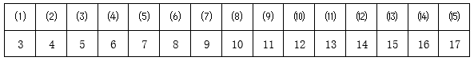

即首项为3，公差为1的等差数列，根据等差数列求和公式：，则最少分配10×15=150人。根据题意可知，本次共招聘了50×3=150名应届毕业生，因此只有表格这一种分配方式。要想A校毕业生分配的基层单位数最少，则尽量集中在分配人数较多的单位。分配人数前三名的单位分配人数之和=15+16+17=48人&lt;50人，则还需多分配到1个单位，即最少被分配到3+1=4个单位。

故正确答案为B。

---

## 第 6 题　qid 10297371 · 数学运算

甲、乙两名工人同时开始生产相同数量的零件，两人手工生产的效率都是2个/小时，用机器生产的效率都是6个/小时。已知甲先用机器生产任务总量的一半，然后换手工生产直至完成；乙先手工生产t小时，然后再用机器生产t小时，正好完成任务。问以下折线图中，最能准确反映甲（实线）和乙（虚线）两人生产用时和产量之间关系的是：

- **A**. 
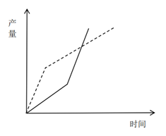

- **B**. 
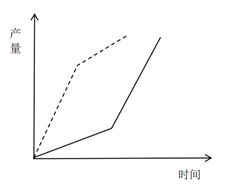

- **C**. 
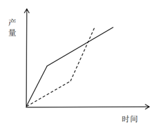
　✅
- **D**. 
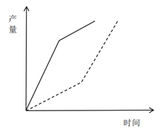

**答案**：C

**官方解析**

根据题意，甲先用机器生产，乙先手工生产，刚开始生产阶段甲的效率（即图中的斜率）大于乙，排除A、B两项。手工生产与机器生产的效率之比为2：6=1：3。甲先用机器生产任务总量的一半，剩余任务量换手工生产，任务量相同，时间与效率成反比，则甲后一半任务量用时是前一半任务量的3倍，排除D项。
故正确答案为C。

---

## 第 7 题　qid 10297363 · 数学运算

一项任务，甲、乙分别单独完成的天数之和是合作完成天数的4.5倍。任务开始后，甲、乙先合作12天，乙再单独工作12天，恰好完成。已知甲的效率比乙高，那么甲单独完成这项任务需要多少天？

- **A**. 24　✅
- **B**. 30
- **C**. 48
- **D**. 60

**答案**：A

**官方解析**

方法一：赋值该项任务的工作总量为1，设甲的效率为x，乙的效率为y，且x&gt;y，根据“甲、乙分别单独完成的天数之和是合作完成天数的4.5倍”，可列式：，化简为：，解得：x=2y或2x=y（排除）。根据“甲、乙先合作12天，乙再单独工作12天，恰好完成”，可列式：12（x+y）+12y=12x+24y=1，将x=2y代入可得：12x+12x=1，解得，则甲单独完成这项任务需要天。

方法二：根据“甲、乙先合作12天，乙再单独工作12天，恰好完成”，又“甲的效率比乙高”，可知甲单独完成这项任务一定是小于12+12+12=36天的，排除C、D两项。剩余两项代入一项验证即可：

代入A项，甲单独完成这项任务需要24天，根据“甲、乙先合作12天，乙再单独工作12天，恰好完成”，可得：（甲+乙）×12+12乙=24甲，解得：甲=2乙，赋值乙的效率为1，则甲的效率为2，该项任务的工作总量为24×2=48，乙单独完成的天数为天，甲、乙合作完成的天数为天，24+48=16×4.5，符合“甲、乙分别单独完成的天数之和是合作完成天数的4.5倍”，当选。

故正确答案为A。

---

## 第 8 题　qid 10297320 · 数学运算

甲处室有6人，乙处室有4人，甲处室平均年龄比乙处室大1.5岁。甲处室新进了小张，乙处室新进了老张，老张比小张大20岁，他们来了之后甲处室平均年龄比乙处室小2岁。问老张比乙处室原来的平均年龄大多少岁？

- **A**. 5
- **B**. 7.5　✅
- **C**. 12.5
- **D**. 15

**答案**：B

**官方解析**

设乙处室原来的平均年龄为x岁，老张的年龄为y岁，则甲处室原来的平均年龄为（x+1.5）岁，小张的年龄为（y-20）岁。根据题意，甲处室新进小张后有6+1=7人，乙处室新进老张后有4+1=5人，可列方程：，整理可得y=x+7.5，即老张比乙处室原来的平均年龄大7.5岁。

故正确答案为B。

---

## 第 9 题　qid 10297340 · 数学运算

小李开车从静止开始匀加速行驶10分钟后，再匀速行驶20分钟，然后开始第二次匀加速行驶13.5千米。已知两次匀加速行驶总距离与匀速行驶距离相等，那么匀速行驶的速度是多少千米/小时？

- **A**. 54　✅
- **B**. 63
- **C**. 72
- **D**. 81

**答案**：A

**官方解析**

设小李开车匀加速行驶10分钟后的速度为v千米/小时，则匀速行驶20分钟时的速度为v千米/小时。根据公式：匀加速运动的平均速度，可得小李开车前10分钟匀加速行驶的平均速度为千米/小时。根据“两次匀加速行驶总距离与匀速行驶距离相等”，可得，解得v=54，即匀速行驶的速度是54千米/小时。

故正确答案为A。

---

## 第 10 题　qid 10297364 · 数学运算

篮球比赛中，三分线内，投中一次得2分，三分线外，投中一次得3分；若被犯规，则获得罚球机会，投中一次得1分。某场比赛，小张2分球命中率为62.5%，3分球命中率为44.4%，最终得分25分。已知小张罚球次数为7次，那么他的罚球命中率在以下哪个范围？

- **A**. 30%-40%
- **B**. 40%-50%　✅
- **C**. 50%-60%
- **D**. 60%-70%

**答案**：B

**官方解析**

根据题意，，即2分球命中次数是5的倍数；，即3分球命中次数是4的倍数。设2分球命中次数为5x个，3分球命中次数为4y个，罚球命中次数为z个，可列式：，由于x、y、z均为正整数，故x、y均只能取1，此时z=3，罚球命中率，在B项范围内。

故正确答案为B。

---

## 第 11 题　qid 10297366 · 数学运算

某年级从A、B、C、D四个班招募96名志愿者，其中A班志愿者人数占总数的，B班志愿者人数比C班多4人，D班志愿者人数比其他三个班都少。问D班最多能有多少名志愿者？

- **A**. 18　✅
- **B**. 19
- **C**. 20
- **D**. 21

**答案**：A

**官方解析**

根据题意，设C班志愿者人数为x人，D班志愿者人数为y人，则B班志愿者人数为（x+4）人。根据四个班招募96名志愿者，可知，即2x+y=60。由于2x和60均为偶数，可知y为偶数，结合选项可排除B、D两项。由于所求为最多，优先代入C项验证：当y=20时，解得x=20，即C班、D班志愿者人数均为20人，不满足D班志愿者人数比其他三个班都少的条件，排除C项，A项当选。

验证A项可知：当y=18时，解得x=21，此时，A班、B班、C班、D班志愿者人数分别为32人、25人、21人、18人，满足题干所有条件。

故正确答案为A。

---

## 第 12 题　qid 10297367 · 数学运算

某班级只有两个宿舍的男生，每宿舍4人。每周从这8人中随机抽取一人担任周管理员，同一人不连续两周担任管理员。问开学前三周的管理员都来自同一宿舍的概率在以下哪个范围？

- **A**. 0%-10%
- **B**. 10%-20%　✅
- **C**. 20%-30%
- **D**. 30%-40%

**答案**：B

**官方解析**

根据公式：概率，分析如下：

根据题意，每周从8人中随机抽取一人担任周管理员，同一人不连续两周担任管理员，则前两周先从8人中选2人，有种情况，第三周的管理员不能和第二周相同，有7种情况，则总情况数有种情况；

满足条件的情况为开学前三周的管理员都来自同一宿舍，先从两间宿舍中选一间，有2种情况；再从同一宿舍的4人中选2人，即前两周有种情况，第三周的管理员不能和第二周相同，有3种情况，则共有种情况。

综上，所求概率，在B项范围内。

故正确答案为B。

---

## 第 13 题　qid 10297370 · 数学运算

某商店门口排了一列100米长的直线队伍，小明随机站在队伍的某处。小明的妈妈在队伍里随机找个位置喊小明的名字，如果小明距离她不超过25米，就能听到。问小明听到他妈妈呼喊的概率是多少？

- **A**. 

- **B**. 

- **C**. 

　✅
- **D**. 

**答案**：C

**官方解析**

设在队伍中小明距离该商店门口x米，妈妈距离该商店门口y米，根据题干可列式：，即或，如下图所示：

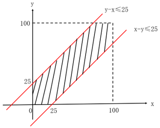

则只有在阴影部分区域小明能听到他妈妈的呼喊，即所求概率为阴影部分面积所占比例。由上图可知正方形面积=100×100，阴影部分面积，故阴影部分面积所占比例，即小明听到他妈妈呼喊的概率为。

故正确答案为C。

---

## 第 14 题　qid 10297327 · 数学运算

一块四边形田地ABCD如下图所示，已知、和的面积分别为9平方千米、15平方千米和12平方千米，CD长8千米。问B点到CD的距离为多少千米？

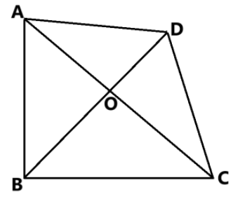

- **A**. 6
- **B**. 7
- **C**. 8　✅
- **D**. 9

**答案**：C

**官方解析**

由图可知，与等高，则对应面积比等于底之比，即；同理可知，与等高，则，平方千米，平方千米。B点到CD的距离即为以CD为底的对应高，根据三角形的面积公式，即，解得所求高=8千米。

故正确答案为C。

---

## 第 15 题　qid 10297344 · 数学运算

商场促销甲、乙、丙3种商品，单价分别为300元、500元和700元。一次购买1000元及以上者，可获赠品1份。小张打算消费不超过1600元，他在所有可能消费组合中随机选择1种，获赠品的概率是多少？

- **A**. 

- **B**. 

- **C**. 

- **D**. 

　✅

**答案**：D

**官方解析**

按照购买商品的种类，根据题意可列表枚举如下：

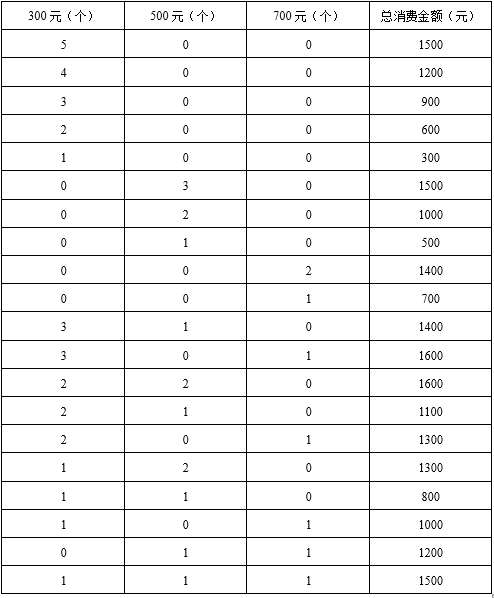

综上可知，消费不超过1600元的组合共有20种，其中一次购买1000元及以上的组合有14种。则题干所求概率。

故正确答案为D。

---

## 第 16 题　qid 10297351 · 数学运算

单位每周三组织篮球活动。已知2024年1月1日是周一，那么2024年组织5次活动的月份有几个？

- **A**. 1
- **B**. 2
- **C**. 3
- **D**. 4　✅

**答案**：D

**官方解析**

方法一：已知2024年1月1日是周一，则2024年1月3日是周三。因为单位每周三组织篮球活动，则2024年（闰年）1-12月的周三枚举如下：

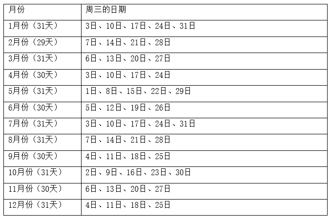

综上，2024年组织5次活动的月份有1月、5月、7月、10月，共4个。

方法二：2024年全年共计366天，共有366÷7=52周······2天。根据2024年1月1日是周一，可知2024年为52周加星期一、星期二各1天，则全年共有52个星期三。每个月的天数为29~31天，则每个月必包含完整的4周，即至少有4个星期三，至多有5个星期三。若12个月均只有4个星期三，则共有4×12=48个星期三。因此全年共有个月有5个星期三，即2024年组织5次活动的月份有4个。

故正确答案为D。

---

## 第 17 题　qid 10297372 · 数学运算

一块直角梯形空地ABCD如右图所示，其中AD=AC=2AB。现准备在图中三角形区域ABC建设特色生态园，并在图中与两条边相切的圆形区域建设特色花坛。已知D点到圆上任一点最短距离为AB长度的一半，那么特色生态园与特色花坛的面积比值在以下哪个范围？

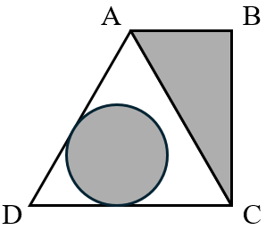

- **A**. 小于1
- **B**. 1-1.5　✅
- **C**. 1.5-2
- **D**. 大于2

**答案**：B

**官方解析**

根据题意，赋值AB=2，AD=AC=4。ABCD为直角梯形，则。在直角中，AC=2AB，则，则，。在中，AD=AC，，则该三角形为等边三角形。如下图所示，连接OD与圆相交于点G，根据题意“已知D点到圆上任一点最短距离为AB长度的一半”，则。E、F为切点，，，OE=OF，OD为公共边，则与全等，，则DO=2OE，即1+r=2r，则圆的半径r=1，圆的面积。因此特色生态园与特色花坛的面积比值，在B项范围内。

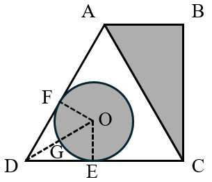

故正确答案为B。

---

## 第 18 题　qid 10297356 · 数学运算

四朵荷花随机出现在一个圆形池塘的任意位置，可以用一根过池塘圆心的笔直竹竿将四朵荷花都划分在同一边的概率是多少？

- **A**. 

- **B**. 

- **C**. 

- **D**. 

　✅

**答案**：D

**官方解析**

要求4朵荷花出现在过池塘圆心的笔直竹竿的同一边，即4朵荷花都在同一个半圆内。

方法一：将4朵荷花分别记为A、B、C、D，池塘圆心为O。从圆形池塘任意位置开始，将顺时针方向出现的第一朵荷花记为“花王”，则只需满足另外三朵荷花，都在“花王”之后的顺指针180°之内（如图阴影区域），即可保证4朵荷花都在同一个半圆内。

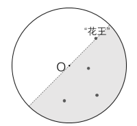

若A为“花王”，以AO所在的直径将池塘划分为两个半圆，因为每朵花在池塘内任意位置，则B、C、D在阴影内的概率均为，则B、C、D均在阴影内的概率为。

同理可知：若B、C、D分别为“花王”，则另外三朵花都在阴影内的概率均为。综上所述，4朵荷花都在同一个半圆内的概率为。

方法二 ：取任一朵荷花位置记为A点，池塘圆心为O。以AO所在的直径将池塘划分为两个半圆，则如图所示，另外三朵荷花，必有两朵处于同一个半圆之内，将这两朵荷花记为B、C。最后一朵荷花记为D，则D与B、C在同一侧的概率为，即所求四朵荷花均在同一个半圆内的概率为。

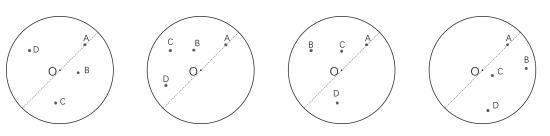

故正确答案为D。

---
