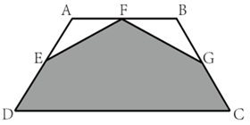
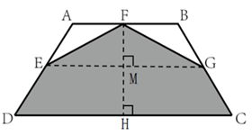
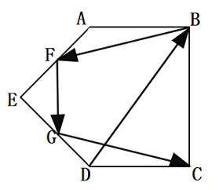
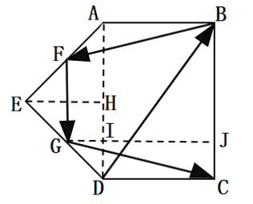

# 2025年海南省公务员录用考试《行测》题（网友回忆版）

> 数量关系 · 15 题 · 海南 2025

## 第 1 题　qid 13504397 · 数学运算

某产品甲、乙两个经销商第一季度销售总额为200万元。第二季度，甲、乙的销售额比第一季度分别高20%、25%，且甲的销售额比乙高44万元。问上半年甲的销售额比乙高多少万元？

- **A**. 72
- **B**. 76
- **C**. 80
- **D**. 84　✅

**答案**：D

**官方解析**

设甲第一季度销售额为a万元，则乙第一季度销售额为（200-a）万元，甲第二季度销售额为1.2a万元，乙第二季度销售额为1.25×（200-a）万元。根据题意可列式：1.2a-1.25×（200-a）=44，解得a=120，则甲第一季度销售额为120万元，乙第一季度销售额为200-120=80万元。故甲第一季度销售额比乙高120-80=40万元，根据题干甲第二季度销售额比乙高44万元，因此上半年甲的销售额比乙高40+44=84万元。
故正确答案为D。

---

## 第 2 题　qid 13504316 · 数学运算

某购物平台推出每消费600元立减50元的活动，钟先生在该平台准备购买单价为500元的某款商品不超过10件，问他购买几件时平均每件的购买成本最低？

- **A**. 5
- **B**. 6　✅
- **C**. 8
- **D**. 9

**答案**：B

**官方解析**

方法一：根据题意，由于“每消费600元立减50元”，故要想平均每件的购买成本最低，则应让购买总价刚好为600的倍数。因为购买商品单价为500元，因此购买总价也应为500的倍数。故购买总价既是600的倍数又是500的倍数，则其应为600和500最小公倍数（3000）的倍数。因为购买件数不超过10件，所以购买总价不超过500×10=5000元，则当购买总价为3000元时，即购买件商品时，此时平均每件成本最低。

方法二：根据每消费600元立减50元，代入选项进行分析：

代入A项：若购买5件，则总价为500×5=2500元，······100，故可享受优惠50×4=200元，平均每件商品享受优惠元；

代入B项：若购买6件，则总价为500×6=3000元，，故可享受优惠50×5=250元，平均每件商品享受优惠元；

代入C项：若购买8件，则总价为500×8=4000元，······400，故可享受优惠50×6=300元，平均每件商品享受优惠元；

代入D项：若购买9件，则总价为500×9=4500元，······300，故可享受优惠50×7=350元，平均每件商品享受优惠元。

综上，当购买6件时，平均每件商品享受优惠最大，此时平均每件的购买成本最低。

故正确答案为B。

---

## 第 3 题　qid 13504531 · 数学运算

甲、乙、丙合作完成一项工程。如甲8天、乙6天、丙4天依次工作刚好可完工。现甲、乙合作6天后，剩下的工程丙恰好单独5天完工。已知甲的效率是乙的1.5倍，问丙单独完成需要多少天？

- **A**. 10　✅
- **B**. 15
- **C**. 20
- **D**. 30

**答案**：A

**官方解析**

由“甲的效率是乙的1.5倍”，可赋值甲的效率为3，则乙的效率为2。设丙的效率为a，根据题意可列式：8×3+6×2+4a=6×（3+2）+5a，解得a=6，即丙的效率为6，这项工程总量为6×（3+2）+5×6=60，则丙单独完成这项工程需要60÷6=10天。
故正确答案为A。

---

## 第 4 题　qid 13504262 · 数学运算

某公司搬家需打包运走电脑主机和显示器各n台。有两种打包方式：一种是一箱装入6台主机和4台显示器，另一种是一箱装入3台主机和8台显示器。已知公司所有的电脑主机和显示器正好装满若干箱，问n可能的最小值为：

- **A**. 18
- **B**. 24
- **C**. 30
- **D**. 36　✅

**答案**：D

**官方解析**

设第一种打包方式装满a箱，第二种打包方式装满b箱。根据电脑主机和显示器各有n台，可得：n=6a+3b=4a+8b，解得a=2.5b，代入可得n=18b。因为a、b均为箱子的数量，必须为正整数，故b取最小值2时，n取最小值为36。
故正确答案为D。

---

## 第 5 题　qid 13504395 · 数学运算

一场大学生机器人预选赛中，某高校A专业有5名学生备赛，B专业有7名学生备赛，C专业有8名学生备赛。问至少派出多少名备赛学生，才能保证一定有3名学生的专业相同？

- **A**. 5
- **B**. 6
- **C**. 7　✅
- **D**. 8

**答案**：C

**官方解析**

根据题干“至少······保证一定有”，可判定本题为最不利构造问题。要保证一定有3名学生专业相同，则每个专业先最少派出2个人，则A、B、C三个专业共派出3×2=6人。此时再多1人，则必然有一个专业达到3人，因此所求最少人数为6+1=7人。
故正确答案为C。

---

## 第 6 题　qid 13504289 · 数学运算

甲乙两部门组织户外团建，共设A、B、C三项活动。甲部门每人三项活动均参加1次，乙部门每人任选2项不同活动各参加1次。已知A、B、C三项活动分别有18人、16人、15人参加，问甲部门成员至多有多少人?

- **A**. 11
- **B**. 12
- **C**. 13　✅
- **D**. 14

**答案**：C

**官方解析**

解法一：A、B、C三项活动参加的总人次为18+16+15=49，设甲部门为x人，乙部门为y人。根据题意，可得方程3x+2y=49，根据奇偶特性，可得x为奇数，排除B、D两项；根据问题“至多有多少人”，优先代入C项，解得y=5，符合题意，当选。
解法二：根据问题“至多”，可通过选项从大到小依次代入验证：
代入D项：甲部门14人，根据甲部门每人三项活动均参加1次，即A、B、C三项活动分别剩下4、2、1人次，4+2+1=7人次，奇数不能让乙部门每人任选2项不同活动各参加1次，排除；
代入C项：甲部门13人，根据甲部门每人三项活动均参加1次，即A、B、C三项活动分别剩下5、3、2人次，5+3+2=10人次，偶数能让乙部门每人任选2项不同活动各参加1次，符合题意，当选。
故正确答案为C。

---

## 第 7 题　qid 13504275 · 数学运算

小王、小李参加某项知识竞赛答题，小王每题答对的概率相等，且均为小李的1.5倍。已知小王连续答对2题的概率比小李高0.2，问小王前2题全对且小李前2题全错的概率在以下哪个范围内？

- **A**. 不到0.05
- **B**. 0.05~0.08
- **C**. 0.08~0.11
- **D**. 0.11以上　✅

**答案**：D

**官方解析**

设小李答对每道题的概率为p，小王答对每道题的概率为1.5p，则小李连续答对2道题的概率为，小王连续答对2道题的概率为。

根据题干“小王连续答对2题的概率比小李高0.2”，则，解得p=0.4。

小王答对每道题的概率为1.5×0.4=0.6，前2题全对的概率为0.6×0.6=0.36；小李答对每道题的概率为0.4，前2题全错的概率为（1-0.4）×（1-0.4）=0.36，因此小王前2题全对且小李前2题全错的概率为0.36×0.36=0.1296，在D项范围内。

故正确答案为D。

---

## 第 8 题　qid 13504394 · 数学运算

某种农作物一年一熟，每次种植均有0.2的概率歉收，有0.3的概率丰产。问该农作物连续3年丰产的概率是连续3年歉收概率的多少倍？

- **A**. 2.5以下
- **B**. 2.5~3之间
- **C**. 3~4.5之间　✅
- **D**. 4.5以上

**答案**：C

**官方解析**

根据题意，连续3年丰产的概率为0.3×0.3×0.3=0.027；连续3年歉收的概率为0.2×0.2×0.2=0.008。则该农作物连续3年丰产的概率是连续3年歉收概率的倍。

故正确答案为C。

---

## 第 9 题　qid 13504282 · 数学运算

小张和小赵分别从甲、乙两地同时出发前往对方的出发地。小张出发时的速度是小赵的一半，两人匀速行进1小时后迎面相遇。此后小张开始均匀加速，最终比小赵晚到达1小时。问小张到达时的速度是小赵到达时速度的多少倍？

- **A**. 

- **B**. 

- **C**. 

　✅
- **D**. 

**答案**：C

**官方解析**

根据题意，赋值小赵出发时每小时的速度为2，则小张出发时每小时的速度为1。两人同时从甲、乙两地出发，1小时后相遇，根据相遇公式：，可得。小赵从乙地到甲地全程用时为小时，则小张从甲地到乙地全程用时为1.5+1=2.5小时。小张从相遇后到达乙地用时为2.5-1=1.5小时，小张从相遇后到达乙地距离等于小赵1小时行进距离=2×1=2，则小张从相遇后到达乙地的平均速度为。根据公式：均匀加速运动的平均速度，可列式，解得小张达到乙地时的速度为，则小张到达时的速度是小赵到达时速度的倍。

故正确答案为C。

---

## 第 10 题　qid 13504419 · 数学运算

甲生产线的效率是乙生产线的2倍，是丙生产线的3倍。某日8：00甲生产线先开始生产，此后乙、丙生产线也依次开始生产，9：00时甲的当日产量是乙的6倍，10：00时乙的当日产量是丙的4倍。问丙是几点开始生产的？

- **A**. 9：30　✅
- **B**. 9：20
- **C**. 9：15
- **D**. 9：10

**答案**：A

**官方解析**

根据题意，赋值甲生产线每小时的效率为6，则乙的效率为3，丙的效率为2。某日8：00甲生产线开始生产，9：00时其当日产量=1×6=6，根据“9：00时甲的当日产量是乙的6倍”，可知9：00时乙的当日产量=6÷6=1，10：00时乙的当日产量为1+3×1=4。根据“10：00时乙的当日产量是丙的4倍”，可知10：00时丙的当日产量=4÷4=1，即已用时小时=30分钟，则丙是从9：30开始生产的。

故正确答案为A。

---

## 第 11 题　qid 13504347 · 数学运算

某梯形区域ABCD的俯视图如下图所示，AB、BC、AD长度相等，且为CD长度的一半，E、F、G分别为所在边的中点。现打算在阴影区域建艺术广场，如果梯形ABCD的总面积为120亩，问艺术广场的面积为多少亩？

- **A**. 
80

- **B**. 

- **C**. 

- **D**. 
100
　✅

**答案**：D

**官方解析**

如图所示，连接EG，过F向DC作垂线，垂足为H，与EG交于点M，根据题意可知，E、F、G分别为所在边的中点，则梯形ABCD为等腰梯形，EG为等腰梯形ABCD的中位线，FH为等腰梯形ABCD的高，FM为的高，，，由图可知，设AF长度为a，FH长度为2h，则AB=2a、CD=4a、FM=h，根据梯形面积公式：，可得；根据三角形面积公式：，可得，则，即亩，因此亩。

故正确答案为D。

---

## 第 12 题　qid 13504286 · 数学运算

某单位优化办事流程，每个窗口总服务时间不变，但个人服务和企业服务的单次用时分别下降了50%和20%。原来每个窗口每天可以服务80名个人和30家企业，现在每个窗口可以服务54名个人和42家企业。问现在每次企业服务的用时是个人服务的多少倍（服务衔接时间忽略不计）？

- **A**. 不到11倍
- **B**. 11~13倍之间
- **C**. 13~15倍之间
- **D**. 超过15倍　✅

**答案**：D

**官方解析**

设原个人服务单次用时需要2x，企业服务单次用时需要5y，则现在个人服务单次用时需要，企业服务单次用时需要。根据每个窗口总服务时间不变，则原服务总时长等于现在的服务总时长，可列方程：。整理可得：。则现在每次企业服务的用时是个人服务用时的倍数为：。

故正确答案为D。

---

## 第 13 题　qid 13504333 · 数学运算

五边形公园ABCDE的面积为4万平方米，其中ABCD为长方形，AB=0.75BC，且ADE为等腰直角三角形（为直角）。小张从D点出发在公园中慢跑，沿箭头所示方向先后经过B点、AE中点和DE中点后到达C点。问小张全程跑了多少米?

- **A**. 

- **B**. 

- **C**. 

　✅
- **D**. 

**答案**：C

**官方解析**

连接AD，设长方形长BC、AD为4x米，则宽AB、DC为3x米，则根据勾股定理可得长方形对角线BD米；根据为等腰直角三角形，三边比例关系为，可得米；则；解得x=50米，那么AB=CD=150米，AD=BC=200米，BD=250米。

由题意可得F、G分别为AE、DE中点，故米；过E点做AD垂线相交于H点，过G点做AD、BC垂线分别相交于I、J点，则EH=HD=100米，GI为的中位线，故米；那么在直角中，CJ=DI=50米，JG=IJ+GI=150+50=200米，根据勾股定理可得：米，同理可得：米；则所求距离米。

故正确答案为C。

---

## 第 14 题　qid 12882041 · 数学运算

甲和乙两条生产线的效率比为1：x，现共同生产一批设备12天后正好完成一半。此时甲的效率提升为原来的2x倍，乙的效率提升为原来的y倍后，又用了6天正好完成生产任务。问x和y的关系为：

- **A**. xy=1
- **B**. xy=2　✅
- **C**. x=2y
- **D**. x=3y

**答案**：B

**官方解析**

设甲和乙两条生产线的效率分别为1和x，根据“共同生产一批设备12天后正好完成一半”，可得：。根据“甲的效率提升为原来的2x倍，乙的效率提升为原来的y倍”，则甲生产线的效率变为2x，乙生产线的效率变为xy，根据“又用了6天正好完成生产任务”，可得：。联立①②，可得：（1+x）×12=（2x+xy）×6，化简得：xy=2。

故正确答案为B。

---

## 第 15 题　qid 13504532 · 数学运算

甲、乙、丙3名研究生本学期已阅读了159篇本专业的学术论文。已知甲的阅读量比乙的一半多28篇，丙的阅读量比甲和乙的平均阅读量多18篇。问乙本学期至少还要再阅读多少篇，阅读量才能比丙多50%以上？

- **A**. 42
- **B**. 48
- **C**. 54　✅
- **D**. 60

**答案**：C

**官方解析**

根据题意，设乙本学期已阅读2x篇，则甲本学期已阅读（x+28）篇，丙本学期已阅读篇。根据题意可列式：x+28+2x+1.5x+32=159，解得x=22，则乙本学期已阅读44篇，丙本学期已阅读65篇。设乙本学期还要阅读y篇即可比丙多50%以上，根据题意可列式：，解得y&gt;53.5，y最少为54。

故正确答案为C。

---
