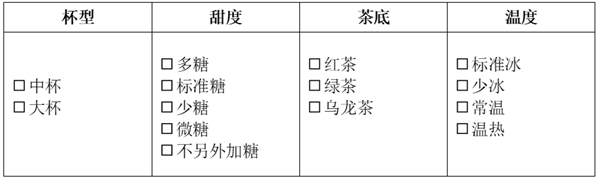

# 2025年深圳市考公务员录用考试《行测》试题（网友回忆版）

> 数量关系 · 7 题 · 深圳市考 2025

## 第 1 题　qid 13432282 · 数学运算

1，，，，，（    ）

- **A**. 

- **B**. 

- **C**. 

- **D**. 

　✅

**答案**：D

**官方解析**

数列大部分为分数，考虑分数数列。分子、分母均未呈单调递增或递减趋势，考虑反约分，原数列可转化为：，，，，，（    ），分母部分：2，4，8，16，32，（    ），是公比为2的等比数列，则所求项分母为32×2=64；分子部分：2，5，10，17，26，（    ），无明显规律，考虑作差，后项减前项得到新数列：3，5，7，9，（    ），是公差为2的等差数列，下一项为9+2=11，则所求项分子为26+11=37。故所求项为。

故正确答案为D。

---

## 第 2 题　qid 13432279 · 数学运算

{3，4，85}，{5，3，128}，{7，2，（    ）}

- **A**. 50
- **B**. 51　✅
- **C**. 52
- **D**. 53

**答案**：B

**官方解析**

数列各项均三三分组，考虑多重数列。观察发现，，，即每组中：，故所求项。

故正确答案为B。

---

## 第 3 题　qid 13432363 · 数学运算

有Y、L两款3年期理财产品，Y的年预期收益率为5%（单利），L的年预期收益率为4%（按年计复利）。彭大爷现有40万元计划全部购买Y或L，则Y的预期收益比L的预期收益（    ）。（结果保留整数）

- **A**. 多1万元　✅
- **B**. 少1万元
- **C**. 多2万元
- **D**. 少2万元

**答案**：A

**官方解析**

若是全部购买Y理财产品，即按年收益率5%（单利）计算，根据单利公式：利息=本金×年收益率×时间，则3年预期收益为40×5%×3=6万元。若是全部购买L理财产品，即按年收益率4%（复利）计算，根据复利公式：本息和，则3年预期本息和万元，此时3年预期收益=44.8-40=4.8万元，故Y的预期收益比L的预期收益多6-4.8=1.2万元，与A项最接近。

故正确答案为A。

---

## 第 4 题　qid 13432353 · 数学运算

M、N两部电视剧于2025年3月20日（周四）同日开播，M剧周四至周六每天播出3集，N剧周一至周五每天播出2集，但清明节期间（4月4日、4月5日、4月6日）两部剧都停播。若至2025年4月21日，M、N两部剧均未播完，则期间共有（    ）天两部剧都有播出。

- **A**. 8
- **B**. 9　✅
- **C**. 10
- **D**. 11

**答案**：B

**官方解析**

根据题意可知，M、N两部电视剧在每周四和周五都有播出。从3月20日至4月21日，共有31-19+21=33天，周⋯⋯5天，则这最后5天为周四至周一，即题目所求期间内应共有4×2+2=10天为周四或周五。3月20日至4月4日，共有31-19+4=16天，周⋯⋯2天，即4月4日为周五，则4月5日为周六、4月6日为周日。由于清明期间停播，则4月4日（周五）两部剧都未播出。题目所求期间共有10-1=9天两部剧都有播出。

故正确答案为B。

---

## 第 5 题　qid 13432366 · 数学运算

某咖啡馆新推出两款联名活动套餐：甲套餐售价74元，包含3杯大杯和1杯中杯，附赠贴纸；乙套餐售价68元，包含2杯大杯和2杯中杯，附赠徽章。因公司团建，张三计划购买甲、乙套餐各若干份，钱刚好用完。点单时，服务员给了甲套餐打八折的优惠，但却把两种套餐的份数搞反了，结账后张三余下的钱刚好再购买7杯中杯。已知相同杯型咖啡的单价相同，则张三原计划购买（    ）份套餐。

- **A**. 12
- **B**. 14　✅
- **C**. 16
- **D**. 18

**答案**：B

**官方解析**

设大杯单价为x元，中杯单价为y元。根据题意可列方程组为：3x+y=74······①；2x+2y=68······②。解得x=20，y=14。设张三买了甲套餐a份，乙套餐b份。已知张三计划购买甲、乙套餐的钱刚好用完，可知张三总钱数为（74a+68b）元；点单时甲套餐打了8折，则甲套餐单价为74×0.8=59.2元，结合“但却把两种套餐的份数搞反了，结账后张三余下的钱刚好再购买7杯中杯”，可列方程：（74a+68b）-（59.2b+68a）=7×14，整理得3a+4.4b=49。由于a、b为套餐数必须是正整数，结合选项范围，故b可能的取值有5、10、15。当b=5时，解得a=9；当b=10或15时，a均非正整数。则张三原计划购买5+9=14份套餐。
故正确答案为B。

---

## 第 6 题　qid 13432365 · 数学运算

某商场举行消费满额抽奖活动，现场共布置了50个礼盒，每个礼盒中均放有1张奖品券或1张现金券，每名消费达标顾客有2次抽奖机会。某日恰好有25名顾客参与抽奖，礼盒全部抽完。已知至少有20%的顾客2次都抽中现金券，至多有60%的顾客2次都抽中同种类券，则一共至少有（    ）张现金券。

- **A**. 10
- **B**. 15
- **C**. 20　✅
- **D**. 25

**答案**：C

**官方解析**

根据题意可知，至少有25×20%=5名顾客2次都抽中现金券，即共抽中5×2=10张现金券；至多有25×60%=15名顾客2次都抽中同种类券，则至少有25-15=10名顾客抽中不同种类券，即每人抽中1张现金券和1张奖品券，故抽中不同种类券的10名顾客共抽中10×1=10张现金券。则一共至少有10+10=20张现金券。
故正确答案为C。

---

## 第 7 题　qid 13432355 · 数学运算

阿哥、阿姐请小妹帮忙买奶茶，每杯奶茶都有4个必选定制项（如下图所示）。小妹在途中把阿哥、阿姐不同的定制要求忘了，如果她随意购买3杯不同的奶茶，则恰有1杯刚好满足阿哥或阿姐定制要求的概率是（    ）。

- **A**. 

- **B**. 

- **C**. 

- **D**. 

　✅

**答案**：D

**官方解析**

根据公式：概率，分析如下：

由题意可知，奶茶的定制组合共有2×5×3×4=120种，小妹随意购买3杯不同奶茶有种情况；

满足定制要求的1杯满足了阿哥或阿姐的要求，有2种可能；另外2杯一定不满足阿哥或阿姐的定制要求，有种可能。则满足题目要求的有种情况。

综上，所求概率。

故正确答案为D。

---
