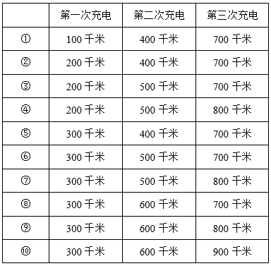
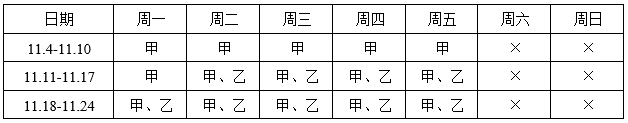

# 2025年湖北省选调生招录考试综合知识和行政职业能力测验试卷（网友回忆版）

> 数量关系 · 19 题 · 湖北 2025

## 第 1 题　qid 11542763 · 数学运算

一辆汽车从A地开往B地，匀速行驶60%的路程后开始匀加速，又用了1小时到达B地，且到达时的速度最快，是出发时的2倍。问全程用了多长时间？

- **A**. 3小时
- **B**. 3小时15分钟　✅
- **C**. 3小时25分钟
- **D**. 3小时30分钟

**答案**：B

**官方解析**

由题意可知，匀速行驶路程∶匀加速行驶路程=60%∶（1-60%）=3∶2，设匀速行驶路程为3S，则匀加速行驶路程为2S。设出发时速度为v，则到达时速度为2v，根据匀变速运动的平均速度，可得匀加速行驶的平均速度，根据路程=速度×时间，可列式：1.5v×1=2S，化简得：。则匀速行驶路程所用时间小时，全程用时为小时=3小时15分钟。

故正确答案为B。

---

## 第 2 题　qid 11542773 · 数学运算

一种商品按标价打八折出售时，每件利润比打七折出售时高40%；比打六五折出售时高54元。问该商品标价每件多少元？

- **A**. 340
- **B**. 350
- **C**. 360　✅
- **D**. 370

**答案**：C

**官方解析**

设该商品每件进价为x元，标价为y元，根据题意可列式：（0.8y-x）-（0.65y-x）=54，化简可得：0.15y=54，解得：y=360，即该商品标价每件360元。
故正确答案为C。

---

## 第 3 题　qid 11542769 · 数学运算

食品厂要加工一批原材料，可由人工手动或机器（每台机器需要1人操作）来完成。如果由25个人、5台机器合作，则7小时30分完成；如果新增3台机器，则6小时完成。问机器的效率是人工效率的多少倍？

- **A**. 

- **B**. 
5

- **C**. 

- **D**. 

　✅

**答案**：D

**官方解析**

方法一：赋值加工总量为7.5和6的公倍数45，设每个人的效率为a，每台机器的效率为b，根据题意可列式：······①，······②，联立①②两式，解得：，，则题目所求倍。

方法二：赋值每个人的效率为1，每台机器的效率为x，根据总加工量不变可列式：，解得，则题目所求倍。

故正确答案为D。

---

## 第 4 题　qid 11542761 · 数学运算

甲、乙、丙三个单位共有100多名职工，甲单位职工比乙单位多14%；丙单位职工比甲单位少3人。问三个单位共有多少人？

- **A**. 158
- **B**. 159
- **C**. 160
- **D**. 161　✅

**答案**：D

**官方解析**

根据甲单位职工比乙单位多14%，可得，因三个单位共有100多名职工，故乙单位职工数只能为50人，甲单位职工数为57人。丙单位职工比甲单位少3人，则丙单位职工数为57-3=54人，三个单位共有50+57+54=161人。

故正确答案为D。

---

## 第 5 题　qid 11542758 · 数学运算

某村一场网络直播共销售352单，卖出762盒特色农产品。已知每单最多购买3盒，且购买3盒的订单正好比购买1盒的订单多50%。问购买了2盒产品的订单有多少笔？

- **A**. 62　✅
- **B**. 72
- **C**. 82
- **D**. 92

**答案**：A

**官方解析**

设购买1盒的订单有2x笔，购买2盒的订单有y笔，因购买3盒的订单正好比购买1盒的订单多50%，则购买3盒的订单为笔。已知该场直播共销售352单，卖出762盒特色农产品，可列方程组：2x+y+3x=5x+y=352······①，······②，②-2×①，解得x=58，再代入①式，解得y=62，即购买了2盒产品的订单有62笔。

故正确答案为A。

---

## 第 6 题　qid 11542765 · 数学运算

某水果商根据草莓的品质，把草莓分装为精品、高质、普通三种包装，单价分别为45元/袋、30元/袋、20元/袋。某天上午，该水果商共售出15袋草莓（每种包装的草莓均有售出），销售额为400元，则售出的精品与普通包装的袋数之比是：

- **A**. 1：3
- **B**. 1：4　✅
- **C**. 2：3
- **D**. 2：5

**答案**：B

**官方解析**

设精品、高质、普通三种包装的草莓分别售出x袋、y袋、z袋。根据题意可列式：x+y+z=15······①，45x+30y+20z=400，即9x+6y+4z=80······②，①×6-②可得：2z-3x=10，根据奇偶特性，2z与10均为偶数，则3x必为偶数，即x为偶数。由于每种包装的草莓均有售出，即x&gt;0，当x=2时，解得z=8，此时y=5，满足题意；当x取其他值时，y均不符合题意。故售出精品包装2袋，普通包装8袋，售出的精品与普通包装的袋数之比为1：4。
故正确答案为B。

---

## 第 7 题　qid 11542768 · 数学运算

已知有黑白棋子共30枚，从中随机选择3枚棋子，仅选出2枚黑棋子的概率是仅选出1枚黑棋子概率的3倍。问黑棋子比白棋子多多少枚？

- **A**. 8
- **B**. 10
- **C**. 12
- **D**. 14　✅

**答案**：D

**官方解析**

设黑棋子有n枚，则白棋子有（30-n）枚。根据题意可知，选出的3枚棋子中，“2黑1白”的概率是“1黑2白”概率的3倍，由此可列方程：，整理后得，解得n=22，即黑棋子有22枚，白棋子有30-22=8枚，故黑棋子比白棋子多22-8=14枚。

故正确答案为D。

---

## 第 8 题　qid 11542782 · 数学运算

3家企业在校招活动中共收到476份简历。若向3家企业均投出简历的学生人数是仅向2家企业投出简历人数的1.5倍，且仅向1家企业投出简历的学生人数比简历总数的一半少9。问总共有多少名学生投出了简历？

- **A**. 364
- **B**. 347
- **C**. 324　✅
- **D**. 247

**答案**：C

**官方解析**

设仅向2家企业投出简历的学生人数为2x名，则向3家企业均投出简历的学生人数为名。根据题意可得，仅向1家企业投出简历的学生人数名，则，解得x=19。根据三集合常识型公式：满足一项+满足两项+满足三项=总数-都不，可列式：229+2x+3x=总人数=324，则总共有324名学生投出了简历。

故正确答案为C。

---

## 第 9 题　qid 11542793 · 数学运算

一瓶浓度为n%的酒精中加入1千克水，浓度变为0.6n%；又加入1.5千克浓度为50%的酒精后，浓度变为0.9n%。问n的值在以下哪个范围内？

- **A**. 

- **B**. 

　✅
- **C**. 

- **D**. 
n&gt;40

**答案**：B

**官方解析**

设原浓度为n%的酒精溶液质量为x千克。根据公式：浓度，可列式：，解得x=1.5，即原浓度为n%的酒精溶液质量为1.5千克。根据“又加入1.5千克浓度为50%的酒精后，浓度变为0.9n%”，可列式：，解得，在B项范围内。

故正确答案为B。

---

## 第 10 题　qid 11542794 · 数学运算

研究生小张从去年1月开始阅读学术论文，每个月阅读的学术论文都比上个月多6篇。己知他去年第三季度的学术论文阅读量比上半年少33篇，问去年第四季度他读了多少篇学术论文？

- **A**. 249　✅
- **B**. 250
- **C**. 252
- **D**. 255

**答案**：A

**官方解析**

根据题意，小张去年每个月学术论文阅读量构成公差为6的等差数列，记每个月阅读论文数为{······}。根据公式：、，则小张去年上半年学术论文阅读量为篇，第三季度学术论文阅读量为篇，则，解得。因此去年第四季度小张读了篇学术论文。

故正确答案为A。

---

## 第 11 题　qid 11542801 · 数学运算

小张和小王从一条400米环形跑道的相同位置出发沿相反方向匀速跑步。小王等小张出发38秒后出发，跑了18秒后与小张相遇，又跑了49秒后正好回到出发点。问两人第四次相遇的位置和第一次相遇的位置相距多少米？

- **A**. 120
- **B**. 150
- **C**. 160　✅
- **D**. 170

**答案**：C

**官方解析**

小张从出发到第一次相遇所走的路程，与第一次相遇后小王回到出发点所走的路程相同，根据“路程相同，速度与时间成反比”，可得。从第一次相遇到第四次相遇，两人所走路程之和=3×400=1200米，且两人所用时间相同，根据“时间相同，路程与速度成正比”，可得，则小王所走路程米，两人第四次相遇的位置和第一次相遇的位置相距400×2-640=160米。

故正确答案为C。

---

## 第 12 题　qid 11542798 · 数学运算

甲和乙两个单位分别有职工20名和14名，且甲单位男性占比正好比乙单位男性占比高5个百分点（乙单位男性职工数不为零）。现要从甲、乙单位选出3名男性参加某个会议，每个单位至少选1人，问有多少种不同的选择方式？

- **A**. 586
- **B**. 616　✅
- **C**. 770
- **D**. 840

**答案**：B

**官方解析**

设甲单位男性职工数为x，乙单位男性职工数为y。根据题意可列方程：，整理可得:7x−10y=7。由于7x和7均为7的整数倍，则10y一定为7的整数倍，即y为7的整数倍，且。当y=14时，x=21，不满足，排除；当y=7时，x=11，满足条件，则甲单位男性职工数为11人，乙单位男性职工数为7人。现要从甲、乙单位选出3名男性参加某个会议，每个单位至少选1人。有以下两种情况：

①甲单位选1名男性，乙单位选2名男性，有种不同的选择方式；

②甲单位选2名男性，乙单位选1名男性，有种不同的选择方式。

分类用加法，则共有231+385=616种不同的选择方式。

故正确答案为B。

---

## 第 13 题　qid 11542806 · 数学运算

从A地前往B地的高速公路总长度为1000千米，途中每100千米设置一个充电站。甲驾驶满电的新能源汽车从A地前往B地，车辆在高速公路上的续航里程为350千米，如果甲希望以最少的充电次数到达B地，则他充电的位置选择有多少种不同的组合？

- **A**. 6
- **B**. 10　✅
- **C**. 16
- **D**. 24

**答案**：B

**官方解析**

根据“从A地前往B地的高速公路总长度为1000千米，途中每100千米设置一个充电站”，可知途中充电站的位置分别在100千米、200千米······900千米处，共9个充电站。由于车辆在高速公路上的续航里程为350千米，但充电站均设置在整百千米处，因此最多驾驶300千米便要充一次电，次······100千米，即甲最少需要充电3次方可到达B地，3次充电的位置选择枚举如下：

综上可知，甲充电的位置选择有10种不同的组合。

故正确答案为B。

---

## 第 14 题　qid 11542807 · 数学运算

某单位实行“前台受理、后台办理”经办模式。某天早上，甲、乙、丙三名后台经办人员的待办事项数量之比为1：2：3，当天不再新增待办事项。三人同时开工，经过2小时后，甲完成的事项数量是乙未完成的二分之一，乙完成的事项数量是丙未完成的三分之一，丙完成的事项数量等于甲未完成的。那么再经过多少分钟，甲可以完成自己的所有待办事项？

- **A**. 60
- **B**. 75
- **C**. 90　✅
- **D**. 120

**答案**：C

**官方解析**

设开工前甲、乙、丙三名后台经办人员的待办事项数量分别为x、2x、3x，三人同时开工2小时后，甲未完成的事项数量为a，则甲完成的事项数量为x-a，乙未完成的事项数量为2(x-a)，乙完成的事项数量为2x-2(x-a)=2a，丙完成的事项数量为a，丙未完成的事项数量为2a×3=6a，如下表所示：

则有a+6a=3x，整理可得，即开工2小时（120分钟）后，甲未完成的事项数量为，完成的事项数量为。设再经过t分钟甲可以完成自己的所有待办事项，根据工作效率不变，工作总量和工作时间成正比，可得，解得t=90。

故正确答案为C。

---

## 第 15 题　qid 11542800 · 数学运算

大学生小陈和小刘同时做一套模拟题，小陈的正确率为75%，小刘只答错了5道，并且两人都答错的题数占总题数的六分之一，两人都答对的题超过一半。问小陈答对而小刘答错的题有多少道？

- **A**. 1　✅
- **B**. 2
- **C**. 3
- **D**. 4

**答案**：A

**官方解析**

根据“小陈的正确率为75%”，因，可得总题数为4的倍数；根据“两人都答错的题数占总题数的六分之一”，可得总题数为6的倍数，故设总题数为12x道，则两人都答错道，又因小刘只答错了5道，故，x可取值为1、2。

若x=1，则总题数为12x=12道，两人都答错2x=2道，小刘答错5道，小陈答错12×（1-75%）=3道，根据两集合容斥原理公式：，可得两人总共答错5+3-2=6道，则两人都答对的题数占总题数的，并未超过总题数的一半，排除；

若x=2，则总题数为12x=24道，两人都答错2x=4道，小刘答错5道，小陈答错24×（1-75%）=6道，则两人总共答错5+6-4=7道，两人都答对24-7=17道，占总题数的，超过总题数的一半；小陈答对的题数为24×75%=18道，则小陈答对而小刘答错的题有18-17=1道。

故正确答案为A。

---

## 第 16 题　qid 11542813 · 数学运算

某工程可交给甲、乙两个工程队完成，两个工程队周一到周五工作，周六、日休息，甲队从11月4日（周一）开始工作，乙队从11月12日开始加入一起工作。截至11月13日下班，工程完成了25%；截至11月21日下班，工程完成了一半。问该工程将于哪天完成？

- **A**. 12月12日
- **B**. 12月11日
- **C**. 12月10日
- **D**. 12月9日　✅

**答案**：D

**官方解析**

根据题意，甲、乙两队工作和休息的情况如下表所示：（“×”表示休息）

方法一：结合表格可得，截至11月13日下班，甲队工作8天，乙队工作2天，工程完成了25%；截至11月21日下班，甲队工作14天，乙队工作8天，工程完成了一半，可知还剩一半工程，且甲、乙两队效率关系为：2×（8甲+2乙）=14甲+8乙，整理可得甲=2乙。赋值甲队效率为2，乙队效率为1，则剩余工程量为14×2+8×1=36，还需个工作日完成。11月22日为周五，11月22日-30日共6个工作日，则再过12-6=6个工作日，即12月9日完成。

方法二：根据截至11月13日下班，工程完成了25%；截至11月21日下班，工程完成了一半，可知还剩一半工程，结合表格可得，11月14日-21日，甲、乙两队合作6天完成了，则每天完成，剩余工程还需个工作日完成。11月22日为周五，11月22日-30日共6个工作日，则再过12-6=6个工作日，即12月9日完成。

故正确答案为D。

---

## 第 17 题　qid 11542812 · 数学运算

小明老家有一块三角形空地，已知该三角形是直角三角形且斜边长为千米，其中一条直角边正好是另一条直角边的小数部分，问该空地的面积为多少平方千米？

- **A**. 0.75　✅
- **B**. 1
- **C**. 1.5
- **D**. 2

**答案**：A

**官方解析**

根据题意，设该三角形空地较长的直角边为（x+y）千米（x为正整数，0&lt;y&lt;1），较短的直角边为y千米，则该空地的面积平方千米。根据直角三角形斜边长为千米，结合勾股定理可列式：，整理可得，则，该空地的面积平方千米。 

代入A项：若，解得x=3，则面积，，可得y&lt;1，满足题干条件，当选；

代入B项：若，解得，x非整数，排除；

代入C项：若，解得，x非整数，排除；

代入D项：若，解得x=2，则面积，，可得y&gt;1，不满足题干条件，排除。

故正确答案为A。

---

## 第 18 题　qid 11542822 · 数学运算

小张、小王、小李是3名健身爱好者，按以下规律坚持健身：小张每健身2天休息1天；小王每健身3天休息2天；小李每健身5天休息3天。某年3月，小张、小王、小李分别从2日、3日、4日开始健身。问当年3月，三人均健身的日子有几天？

- **A**. 7
- **B**. 8
- **C**. 9　✅
- **D**. 10

**答案**：C

**官方解析**

根据题意，列表如下，其中“√”代表去健身，“×”代表休息。

可知，当年3月，三人均健身的日子有5日、8日、14日、15日、20日、23日、24日、29日、30日，共9天。

故正确答案为C。

---

## 第 19 题　qid 11542821 · 数学运算

从足够量的桃子、李子、橘子、柿子中选取2025个水果装成一车，要求选取的桃子的数量是5的倍数，李子数是7的倍数，橘子最多6个，柿子最多4个，桃子李子必须都有。问有多少种不同的装法？

- **A**. 2013
- **B**. 2014　✅
- **C**. 2015
- **D**. 2016

**答案**：B

**官方解析**

根据题干条件可知，桃子数量为5的倍数即个，柿子数量不超过4个即0~4个，设桃子与柿子总数为x；李子数量为7的倍数即个，橘子数量不超过6个即0~6个，设李子与橘子总数为y。则x+y=2025。分析x与y的取值：

故满足条件的装法共2024-4-6=2014种。

故正确答案为B。

---
