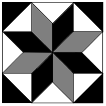

# 2025年湖南省公务员录用考试《行测》题（网友回忆版）

> 数量关系 · 10 题 · 湖南 2025

## 第 1 题　qid 13504430 · 数学运算

小明在网络二手交易平台按照每张150元的价格转手了两张珍藏版CD，其中一张盈利25%，另一张亏损25%，则小明转手这两张CD总的盈亏情况是：

- **A**. 不盈不亏
- **B**. 盈利20元
- **C**. 亏损20元　✅
- **D**. 亏损25元

**答案**：C

**官方解析**

每张CD转手价格为150元，则盈利25%的CD原价为元；亏损25%的CD原价为元。可得小明购买两张CD原价为120+200=320元，转手价格为150×2=300元，亏损了20元钱。

故正确答案为C。

---

## 第 2 题　qid 13504431 · 数学运算

某小区组织“情满金秋”柑橘采摘活动，参加人员按年龄分成老、中、青三组，老年组、中年组的人数之比为5：2，中年组、青年组的人数之比为3：4。老年组、中年组、青年组平均每人采摘速度之比为1：2：3。已知青年组共采摘80斤柑橘，那么三组人员一共采摘柑橘：

- **A**. 170斤　✅
- **B**. 212斤
- **C**. 255斤
- **D**. 298斤

**答案**：A

**官方解析**

根据题干“老年组、中年组的人数之比为5：2，中年组、青年组的人数之比为3：4”，则老年组、中年组、青年组的人数之比为15：6：8，设老年组、中年组、青年组的人数分别为15a、6a、8a，根据题干“老年组、中年组、青年组平均每人采摘速度之比为1：2：3”，设老年组、中年组、青年组平均每人采摘速度分别为b、2b、3b，由题意得，青年组一共采摘8a×3b=80，解得。老年组与中年组共采摘的柑橘重量为斤，故三组人员一共采摘的柑橘重量为90+80=170斤。

故正确答案为A。

---

## 第 3 题　qid 13504481 · 数学运算

某地军工驿站就业直通车送6名工人到A、B、C三个开发区务工，实现从“家门”直达“厂门”就业。若A开发区至少需要2名工人，B、C开发区至少各安排1名工人，每名工人只能去其中的一个开发区，则共有多少种不同的安排方法？

- **A**. 180
- **B**. 320
- **C**. 345
- **D**. 360　✅

**答案**：D

**官方解析**

根据题目要求，分类讨论如下：

（1）A区4人，则B区、C区各1人：有种情况；

（2）A区3人，则B区2人、C区1人或B区1人、C区2人：有种情况；

（3）A区2人，则：

①B区3人、C区1人或B区1人、C区3人：有种情况；

②B区、C区各2人：有种情况。

综上，共有30+120+120+90=360种不同的安排方法。

故正确答案为D。

---

## 第 4 题　qid 13504499 · 数学运算

一只蜘蛛爬到一块正方形瓷砖上，该瓷砖的花纹由8个全等的菱形和12个全等的等腰直角三角形构成（如下图所示），假设蜘蛛的停留位置是随机的，那么蜘蛛恰好停在白色区域的概率最接近下列哪个值？

- **A**. 25%
- **B**. 30%
- **C**. 35%　✅
- **D**. 40%

**答案**：C

**官方解析**

设每个等腰直角三角形的直角边长度为1，可得每个等腰直角三角形的斜边长度为，则每个等腰直角三角形的面积，正方形瓷砖的总面积为。根据公式：概率，则所求，与C项最接近。

故正确答案为C。

---

## 第 5 题　qid 13504505 · 数学运算

高速公路某路段转向处靠近居民楼，为减少噪声需设置隔音板（如下图所示），安装隔音板范围为公路转向处的一段圆曲线（即从点A至点B圆弧），测控人员在过点A、B的两条切线的交点C处，测得从A到B转角为，若此圆曲线的半径OA=1km，则这段隔音板的安装长度为：

- **A**. 

- **B**. 

- **C**. 

　✅
- **D**. 

**答案**：C

**官方解析**

因为AC、BC与弧线相切，故、。已知，四边形OACB内角和为，则。根据弧长公式：弧长，则点A至点B弧长，即这段隔音板的安装长度为km。

故正确答案为C。

---

## 第 6 题　qid 13504513 · 数学运算

为丰富儿童的暑假生活，某公园在半径为米的半圆形水池旁修建了一个弯月形儿童戏水池（如下图所示）。该弯月形戏水池可看作是由半径为20米的半圆和半径为米的半圆O的圆弧围成的阴影部分，圆心距为20米且垂直于直径AB，那么该戏水池的面积为多少平方米？

- **A**. 
400
　✅
- **B**. 

- **C**. 
800

- **D**. 

**答案**：A

**官方解析**

如图所示，根据题意可知半圆O的半径为米，半圆的半径为r=20米。连接OA、OB，可得米，又因为，可得和均为等腰直角三角形，则。故平方米，平方米；根据扇形面积公式：，可得：平方米。

综上，所求戏水池面积平方米。

故正确答案为A。

---

## 第 7 题　qid 13504561 · 数学运算

在台风影响下，B、E两个受灾严重的村庄急需电力救援，村庄E位于AB中点处（如下图所示，为等腰直角三角形），电力救援部门需要在长为6公里的AC路段上确定临时送电站F的位置，从点F分别搭建两条电路FE与FB，要求这两条电路长度之和最小，则临时送电站F的位置距离点A：

- **A**. 
公里

- **B**. 
1.5公里

- **C**. 
2公里
　✅
- **D**. 
3公里

**答案**：C

**官方解析**

本题属于平面几何求最短路径问题，以AC为对称轴作E点的对称点（如下图），与AC交于点G，连接与AC交于点F，再连接EF、，则两条线路长度之和最小为。因为为等腰直角三角形，可得，则，可得，已知E为AB中点，则，，即公里。

故正确答案为C。

---

## 第 8 题　qid 12882057 · 数学运算

某工厂生产A、B两种商品，需要用到猪肉和土豆两种原材料。已知生成100份A食品需要猪肉50公斤，土豆50公斤，利润为500元。生产100份B食品需要猪肉20公斤，土豆75公斤，利润400元。目前猪肉和土豆只能进货500公斤和600公斤，则生产A、B两种食品最大利润为：

- **A**. 5272元
- **B**. 5313元
- **C**. 5363元　✅
- **D**. 5432元

**答案**：C

**官方解析**

设生产A食品份，生产B食品份，根据题干可得方程组：

，解得，。则生产A、B两种食品最大利润为：元。

故正确答案为C。

备注1：本题也可以按整数份计算，当解得、时，即生产了A食品份，取整为927份；生产了B食品份，取整为181份。根据题意可知，生产1份A食品需要猪肉公斤、土豆公斤，可获得利润元；生产1份B食品需要猪肉公斤、土豆公斤，可获得利润元。则还剩下猪肉500-927×0.5-181×0.2=0.3公斤、土豆600-927×0.5-181×0.75=0.75公斤，剩下的两种原材料恰好还能生产1份B食品，故生产A、B两种食品最大利润为927×5＋181×4＋4=5363元。

备注2：按备注1取整的方式计算时，即927×5＋181×4=5359元，可排除A、B项，即使剩余的原材料还能制作A、B两种食品，但是D项的数据过大显然不可能，可直接选C项。

---

## 第 9 题　qid 13504500 · 数学运算

某农科所将一块上底长为20米的直角梯形状实验田划分为4个完全相同的区域（如下图所示），种上4个不同品种的玉米，产量分别为110、115、125和130千克。那么，该实验田玉米的平均产量为多少千克/平方米？

- **A**. 0.6
- **B**. 0.8　✅
- **C**. 1
- **D**. 1.25

**答案**：B

**官方解析**

如上图所示，结合题意可知AE+ED=20米，且四个梯形为全等梯形，则OE=ED=OF，AE=FH，由此可得AB=FH+OE=AE+ED=20米，BH=AE+OF=AE+ED=20米，BC=2×BH=40米。梯形ABCD的面积为平方米。该实验田玉米总产量为110+115+125+130=480千克，则该实验田玉米的平均产量为千克/平方米。

故正确答案为B。

---

## 第 10 题　qid 13504523 · 数学运算

某三层高的露天平台每层可视作圆柱体（如下图所示）。已知每层高5米，下层直径100米，中层直径80米，上层直径68米，现要对平台的外表面进行清洁维护，共需要维护多少平方米？

- **A**. 

　✅
- **B**. 

- **C**. 

- **D**. 

**答案**：A

**官方解析**

由图可知，平台的外表面是由三层平台的上表面和侧面组成的。三层平台的上表面相当于直径为100米的大圆面积，侧面则由三个圆柱体侧面积组成。由于大圆直径为100米，则半径为50米，三层平台的上表面面积；上层侧面积平方米；中层侧面积平方米；下层侧面积平方米。故共需要维护平方米。

故正确答案为A。

---
