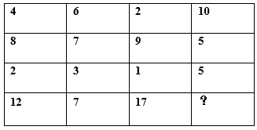
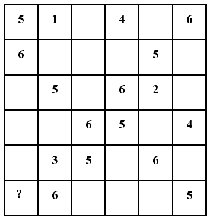
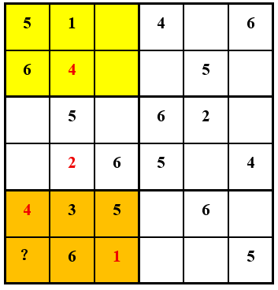
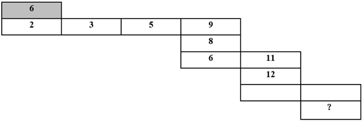
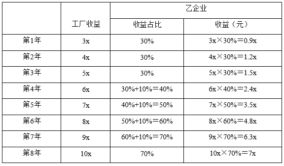
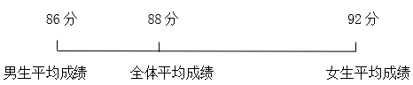
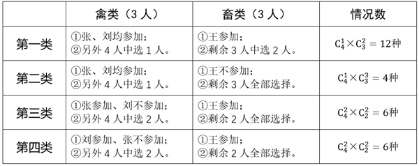
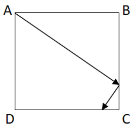
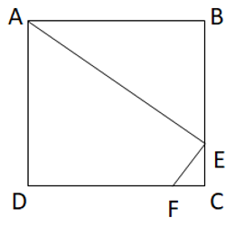
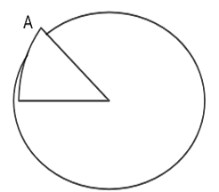

# 2025年重庆市定向选调优秀大学生到基层工作考试《行测》题

> 数量关系 · 20 题 · 选调 2025

## 第 1 题　qid 14096255 · 数学运算

以下每一行的数列都有相同的规律，问“？”处应填入的数字为（    ）。

- **A**. -3　✅
- **B**. 3
- **C**. -11
- **D**. 11

**答案**：A

**官方解析**

题干出现图形，判定为图形数阵。
方法一：观察表格数据，按行查找规律可得：（6-4）×4=10-2；（7-8）×4=5-9；（3-2）×4=5-1。即在每行中满足规律：（第二列数字-第一列数字）×4=第四列数字-第三列数字，则（7-12）×4=（？-17），？=-3。
方法二：观察表格数据，每一行两两作差可得：第一行，2、-4、8，第二行，-1、2、-4，第三行，1、-2、4，即每一行作差之后均是公比为-2的等比数列。第四行两两作差可得：-5、10、（    ），则下一项为10×（-2）=-20，？-17=-20，？=-3。
故正确答案为A。

---

## 第 2 题　qid 14096254 · 数学运算

以下为6×6的数独，其每行、每列和每个小方块的6个格子中都包含1~6的数字。问“？”处应填入的数字为（    ）。

- **A**. 1
- **B**. 2　✅
- **C**. 3
- **D**. 4

**答案**：B

**官方解析**

题干出现图形，判定为图形数阵。观察空缺数字较少的第二列，所缺数字是2和4，因第四行出现了数字4，则第二列第四行只能是2，第二列第二行是4。观察倒数第二行数字，所缺数字是1、2、4，因第四列和第六列均出现了数字4，则第一列的空格处只能是4。

如下图，橙色小方块右下角的空格处只能是1或2，结合黄色小方块的最右侧两个空格中必有2，则橙色小方块右下角的空格处只能是1，故“？”处应填入的数字是2。

故正确答案为B。

---

## 第 3 题　qid 14096270 · 数学运算

以下二维数列的首项为灰色方格中数字。每组上下相邻的数字呈现一种固定规律，每组左右相邻的数字呈现另一种固定的规律。问“？”处应填入的数字为（    ）。

- **A**. 20
- **B**. 24
- **C**. 40
- **D**. 44　✅

**答案**：D

**官方解析**

题干出现图形，判定为图形数阵。观察上下相邻的数字，查找规律可得：第一组，6×2-10=2；第二组，9×2-10=8，8×2-10=6；第三组，11×2-10=12。即上下相邻的数字满足规律：上×2-10=下，则第三组空格数字=12×2-10=14。观察左右相邻的数字，查找规律可得：第一组，2×2-1=3，3×2-1=5，5×2-1=9；第二组，6×2-1=11。即左右相邻的数字满足规律：左×2-1=右，则第三组第二列空格数字=14×2-1=27。故“？”处应填入的数字为27×2-10=44。
故正确答案为D。

---

## 第 4 题　qid 14096252 · 数学运算

商店购进一批服装，按进价的2倍定价销售。如打八折销售，每天比原价销售时多卖20件，每天的利润与原价销售时相同；如每件降价120元，每天销量比原价销售时多2倍，每天的利润是原价销售时的1.2倍。问原价销售时每天能获利多少元？

- **A**. 3600
- **B**. 4000
- **C**. 6000　✅
- **D**. 7200

**答案**：C

**官方解析**

设每件服装进价x元，原价销售时每天可卖y件，则定价为2x元，原价销售时每天可获利（2x-x）y=xy元。根据题意，可列式：······①，······②，解得x=200，y=30。则原价销售时每天能获利200×30=6000元。

故正确答案为C。

---

## 第 5 题　qid 14096269 · 数学运算

甲、乙两企业共同投资建厂，约定前三年的收益70%归甲，30%归乙，往后每年的收益中，归乙的比例都比上一年高10个百分点，直到乙的收益占比达到70%为止，已知第一年工厂收益3x元，往后每一年的收益都比上一年高x元。问乙企业的累计收益第一次超过甲是在第几年？

- **A**. 7
- **B**. 8　✅
- **C**. 9
- **D**. 10

**答案**：B

**官方解析**

根据题意，乙企业的收益可列表如下：

代入A项：第7年时，根据等差数列求和公式：，可得工厂累计收益为，乙企业的累计收益为0.9x+1.2x+1.5x+2.4x+3.5x+4.8x+6.3x＝20.6x，则甲企业的累计收益为42x-20.6x＝21.4x。20.6x&lt;21.4x，可知第7年乙企业的累计收益未超过甲，排除；

代入B项：第8年时，工厂累计收益为42x+10x=52x，乙企业的累计收益为20.6x+7x=27.6x，则甲企业的累计收益为52x-27.6x＝24.4x。27.6x&gt;24.4x，可知第8年乙企业的累计收益第一次超过甲，当选。无需再验证C、D两项。

故正确答案为B。

---

## 第 6 题　qid 14096258 · 数学运算

甲、乙工程队共同实施某个路面铺装工程，如每天各工作8小时，正好20天完成任务，实际工作5天后，甲工程队引入新设备效率提升10%，乙工程队每天多工作2小时，结果提前2天完成任务。则甲、乙工程队原始效率的比值为（    ）。

- **A**. 

- **B**. 

- **C**. 

- **D**. 

　✅

**答案**：D

**官方解析**

赋值甲工程队原始效率为每小时10，设乙工程队原始效率为每小时x。

方法一：工作5天后的剩余工程量为。根据“提前2天完成任务”，即在甲、乙工程队改变工作模式之后实际工作20-2-5=13天完成，可列方程：，解得x=5.6。则甲、乙工程队原始效率的比值为。

方法二：根据“提前2天完成任务”，即原计划20-5=15天的工程量实际15-2=13天完成。根据“总量一定，效率与时间成反比”，可列方程：，解得x＝5.6。则甲、乙工程队原始效率的比值为。

故正确答案为D。

---

## 第 7 题　qid 14096271 · 数学运算

一个不规则八面体零件的每个面都是不同的三角形，7个面是白色，1个面是黑色，现选择2个白色面分别涂成红色和黄色，要求红、黄色两个面与黑色面均不相邻（仅共顶点不算相邻）。问有多少种不同的涂色方案？

- **A**. 6
- **B**. 8
- **C**. 10
- **D**. 12　✅

**答案**：D

**官方解析**

八面体即八个面，每个面都是三角形，则每个面均有3个相邻面（公共边），仅1个面是黑色，则与黑色面相邻的面有3个，那么与黑色面不相邻的面有4个，从不相邻的面中任意选2个，一定不会与黑色面相邻，共有种涂色方案。

故正确答案为D。

---

## 第 8 题　qid 14096253 · 数学运算

某集团甲、乙、丙三个分公司共有100多人，甲、乙、丙分公司销售人员分别占总人数的40%、44%和34%，且甲分公司销售人员比乙分公司多13人，问销售人员最多和最少的分公司，非销售人员相差多少人？

- **A**. 16
- **B**. 18
- **C**. 20
- **D**. 22　✅

**答案**：D

**官方解析**

根据“甲、乙、丙分公司销售人员分别占总人数的40%、44%和34%”，可得；；。假设甲分公司销售人员人数为2x人，乙分公司销售人员人数为11y人，又因“甲分公司销售人员比乙分公司多13人”，可列式2x-11y=13，2x为偶数，13为奇数，则11y为奇数，y可取1，3，5，······，当y=1时，x=12，即甲分公司销售人员人数为24人，甲分公司总人数为60人；乙分公司销售人员人数为11人，乙分公司总人数为25人，那么丙分公司的总人数为50人或100人都满足题意；

当y=3时，x=23，即甲分公司销售人员人数为46人，甲分公司总人数为115人；乙分公司销售人员人数为33人，乙分公司总人数为75人，那么丙分公司的总人数为50人时，不满足题意。因此当y取3及以上时，皆不满足题意。

综上，若甲分公司销售人员人数为24人、乙分公司销售人员人数为11人、丙分公司销售人员人数为17人时，销售人员最多的是甲公司，最少的是乙公司，则所求为（60-24）-（25-11）=22人。

故正确答案为D。

---

## 第 9 题　qid 14096259 · 数学运算

张、王和李从甲地出发匀速前往乙地，到达后均原速度返回。张比王早出发20分钟，比李晚出发30分钟。出发2小时后张追上李，又用了1小时张到达乙地，又用了1小时返程中的李与王迎面相遇。问王从甲地到乙地单程的用时（    ）。

- **A**. 不到4小时15分
- **B**. 在4小时15分~4小时30分之间
- **C**. 在4小时30分~4小时45分之间　✅
- **D**. 超过4小时45分

**答案**：C

**官方解析**

根据题意，出发2小时后张追上李，张所用时间为2小时，李所用时间为2.5小时，；根据路程相同，时间与速度呈反比，可知。假设，，张从甲地到乙地一共走了2+1=3小时，即180分钟，则。根据题干“又用了1小时返程中的李与王迎面相遇”，此时张用时3+1=4小时，即240分钟，再根据题干“张比王早出发20分钟，比李晚出发30分钟”，可得李用时240+30=270分钟，王用时240-20=220分钟。李走的总路程为4×270=1080，即走完甲到乙的900后返程走了1080-900=180，此时与王相遇，那么王走的距离为900-180=720，则，故王从甲地到乙地单程的用时为分钟，即4小时35分，在C项范围内。

故正确答案为C。

---

## 第 10 题　qid 14096256 · 数学运算

甲和乙两条生产线4小时可以生产320个零件，乙和丙两条生产线6小时可以生产420个零件。如果甲的效率提高25%，其3小时生产的零件数量与丙生产5小时相同。问乙生产210个零件需要多长时间？

- **A**. 5小时15分　✅
- **B**. 6小时
- **C**. 7小时
- **D**. 7小时30分

**答案**：A

**官方解析**

根据题意可得，4（甲+乙）=320①；6（乙+丙）=420②，整理得甲-丙=10。根据“甲的效率提高25%，其3小时生产的零件数量与丙生产5小时相同”，可列式1.25×甲×3=5×丙，整理得，甲比丙多1份，结合甲-丙=10，则1份=10，故甲=40，丙=30，乙=40。那么所求为小时，小时分钟，即乙生产210个零件需要5小时15分。

故正确答案为A。

---

## 第 11 题　qid 14096262 · 数学运算

书店A、B、C三种图书，每本售价分别是20元、28元、40元，利润分别是3元、2.8元、4元。已知某学校用1000元购买其中两种图书，合计40本，问书店的利润最大是多少元？

- **A**. 112
- **B**. 115
- **C**. 120
- **D**. 130　✅

**答案**：D

**官方解析**

根据公式：利润率，则出售A图书的利润率为，出售B图书的利润率为，出售C图书的利润率为，比较可知书店出售A图书的利润率最大，若要书店的利润最大，则应尽可能多地购买A图书，即学校可能购买A、B两种图书或A、C两种图书。

（1）学校购买A、B两种图书：设购买A图书m本，则购买B图书（40-m）本，根据题意可列式：20m+28×（40-m）=1000，解得m=15，即学校购买A图书15本，B图书40-15=25本，此时书店的利润为3×15+2.8×25=115元。

（2）学校购买A、C两种图书：设购买A图书n本，则购买C图书（40-n）本，根据题意可列式：20n+40×（40-n）=1000，解得n=30，即学校购买A图书30本，C图书40-30=10本，此时书店的利润为3×30+4×10=130元。

综上，书店的利润最大是130元。

故正确答案为D。

---

## 第 12 题　qid 14096267 · 数学运算

某学院艺术特长生招生，学员平均成绩88分，其中男生的平均成绩86分，女生的平均成绩92分。后扩招了2名女生，使得男、女生平均成绩相同，已知扩招的女生的成绩均不超过70分，问扩招后，至少有几名学员？

- **A**. 12
- **B**. 14
- **C**. 20　✅
- **D**. 26

**答案**：C

**官方解析**

根据线段法“距离与量成反比”，则扩招前男生人数：女生人数=（92-88）：（88-86）=2：1，故设扩招前有男生2n人，女生n人。

根据题意可知，扩招了2名女生后，女生的平均成绩也为86分。

方法一：设扩招的2名女生的平均成绩为x，则可列式：92n+2x=86（n+2），整理可得：x=86-3n。根据“已知扩招的女生的成绩均不超过70分”，则，解得，且n为整数，故n最小为6。当n=6时，扩招后至少有学员2n+n+2=3n+2=20人。

方法二：扩招前男女生人数比为2：1，即扩招前总人数是3的倍数，则扩招后的总人数减2应为3的倍数，结合选项可排除A项。题目问“至少”，将选项从小到大依次代入验证：

代入B项：扩招后共有14人，则扩招前有女生人，扩招后有女生4+2=6人，总成绩为6×86=516分，故扩招的2名女生的总成绩为516-92×4=148分，148÷2=74分&gt;70分，不符合题意，排除；

代入C项：扩招后共有20人，则扩招前有女生人，扩招后有女生6+2=8人，总成绩为8×86=688分，故扩招的2名女生的总成绩为688-92×6=136分，136÷2=68分&lt;70分，符合题意，当选。无需验证剩余选项。

故正确答案为C。

---

## 第 13 题　qid 14096265 · 数学运算

一个圆柱体容器内装有水，其底面半径是一圆台下底面半径的1.5倍，且圆台上底面半径是其下底面半径的一半，圆台完全浸没于圆柱体水中时，水面上升2厘米，问圆台高是多少厘米？

- **A**. 不到5厘米
- **B**. 5厘米到6厘米
- **C**. 6厘米到7厘米
- **D**. 超过7厘米　✅

**答案**：D

**官方解析**

设圆台上底面半径为x厘米，高为y厘米，则圆台下底面半径为2x厘米，圆柱体底面半径为厘米。根据圆台体积公式：，圆柱体体积公式：，结合“圆台完全浸没于圆柱体水中时，水面上升2厘米”，即水面上升体积等于圆台体积，可列式：，解得，故圆台高超过7厘米。

故正确答案为D。

---

## 第 14 题　qid 14096268 · 数学运算

2024年某国际比赛，A国参赛运动员比C国的多，F国的参赛运动员比A国的多，F国的参赛运动员与C国的差的3倍比A国的要多35人，问C国的参赛运动员人数是多少人？

- **A**. 405　✅
- **B**. 486
- **C**. 576
- **D**. 648

**答案**：A

**官方解析**

设C国的参赛运动员为81x人，则A国的参赛运动员为人，F国的参赛运动员为人。根据“F国的参赛运动员与C国的差的3倍比A国的要多35人”，可得3×（114x-81x）-92x=35，解得x=5，则C国的参赛运动员人数是81×5=405人。

故正确答案为A。

---

## 第 15 题　qid 14096266 · 数学运算

单位从72名刚入职的应届毕业生中选派3人参加某项活动，如果选派2名女性、1名男性，则不同的选派方式正好是选派2名男性、1名女性时的1.5倍。问该单位刚入职的男性应届毕业生有多少人？

- **A**. 24
- **B**. 25
- **C**. 28
- **D**. 29　✅

**答案**：D

**官方解析**

设该单位刚入职的男性应届毕业生有x人，则女性应届毕业生有（72-x）人。根据“如果选派2名女性、1名男性，则不同的选派方式正好是选派2名男性、1名女性时的1.5倍”，则可列式为，化简可得：72-x-1=1.5（x-1），解得x=29，即该单位刚入职的男性应届毕业生有29人。

故正确答案为D。

---

## 第 16 题　qid 14096380 · 数学运算

农业大学从张、刘、王等7名教师中选出6人去禽类和畜类养殖基地开展培训，要求每个基地安排3名专业对口教师。已知张和刘只能开展禽类养殖培训，王只能开展畜类养殖培训，其余4人能开展2类培训。问有多少种不同的安排方式？

- **A**. 28　✅
- **B**. 32
- **C**. 38
- **D**. 48

**答案**：A

**官方解析**

根据题干条件，对满足要求的安排方式进行分类讨论：

分类用加法，满足要求的安排方式共12+4+6+6=28种。

故正确答案为A。

---

## 第 17 题　qid 14096379 · 数学运算

一个长方体纸盒第二长的棱长30厘米，其表面积是最大一面面积的4倍，是最小一面面积的12倍。问这个长方体纸盒最长的棱比最短的棱长多少厘米？

- **A**. 20
- **B**. 30
- **C**. 40　✅
- **D**. 50

**答案**：C

**官方解析**

设该长方体纸盒最长的棱长为m厘米，最短的棱长为n厘米。根据长方体表面积公式：，，，根据题意可列方程：2×（30m+30n+mn）=4m×30······①，2×（30m+30n+mn）=12n×30······②，则4m×30=12n×30，可得m=3n，将m=3n代入①：2×（30×3n+30n+3n×n）=4×3n×30，化简可得：30+10+n=60，解得n=20，则m=3n=60，故题干所求为60-20=40厘米。

故正确答案为C。

---

## 第 18 题　qid 14096381 · 数学运算

甲办公室比乙办公室多1人。现从甲办公室选出4人，从乙办公室选出3人参加某个培训，甲办公室的选法正好是乙办公室的2.5倍。如从甲办公室选3人，从乙办公室选4人参加，则甲办公室的选法是乙办公室的（    ）。

- **A**. 不到0.9倍
- **B**. 0.9~1.0倍之间　✅
- **C**. 1.0~1.1倍之间
- **D**. 1.1倍以上

**答案**：B

**官方解析**

设乙办公室人数为x人，则甲办公室人数为x+1人，根据题意可得：，即，化简可得，解得x=9。故从甲办公室选3人，有种选法；从乙办公室选4人，有种选法，则题干所求为倍，在B项范围内。

故正确答案为B。

---

## 第 19 题　qid 14096383 · 数学运算

一个正方形操场ABCD的边长为100米，小王从A点出发以1米/秒的速度匀速直线行走，2分5秒后到达BC边上的某一点后，保持原速度右转继续行走，问还要走多长时间到达CD边？

- **A**. 不到30秒
- **B**. 30~35秒之间　✅
- **C**. 35~40秒之间
- **D**. 40秒以上

**答案**：B

**官方解析**

如图所示，小王从A点出发，沿AE匀速行走，2分5秒后到达E点，保持原速度右转继续行走，一段时间后到达F点。

AB=100米，因小王的速度为1米/秒，则AE=（2×60+5）×1=125米，，根据勾股定理可知：米，则EC=BC-BE=100-75=25米。因，所以，又因，所以，且与均为直角三角形，则，故有，即，解得米，则小王从E点走到F点需要的时间秒，在B项范围内。

故正确答案为B。

---

## 第 20 题　qid 14096437 · 数学运算

将一个圆锥体零件侧放在平面上滚动一周,得到一个面积为 平方厘米的圆形（如图所示）。A为该圆锥体底面圆周上的一点，滚动过程中，A点正好围绕圆锥底面圆心转动了2周。问该圆锥体的体积为多少立方厘米?（    ）

- **A**. 

- **B**. 

　✅
- **C**. 

- **D**. 

**答案**：B

**官方解析**

根据题意可知，圆锥体零件侧放在平面上滚动一周，所得的圆形半径R与圆锥体母线l完全相等，，解得R=x，则l=R=x厘米。根据“滚动过程中，A点正好围绕圆锥底面圆心转动了2周”可得，圆形周长为圆锥体底面圆周长的2倍，设圆锥体底面圆的半径为r厘米，则有，解得。在圆锥中圆锥的母线与底面圆的半径以及圆锥的高组成一个直角三角形，母线为该直角三角形的斜边。设圆锥体的高为h厘米，根据勾股定理可列式：，即，解得。根据圆锥体积公式：，可得所求为立方厘米。

故正确答案为B。

---
