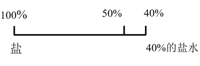

# 2025年黑龙江公务员录用考试《行测》题（网友回忆版）

> 数量关系 · 10 题 · 黑龙江 2025

## 第 1 题　qid 13504572 · 数学运算

某单位接到一项任务，探访所在辖区的商户了解相关信息。原计划由5人10天完成探访200家商户工作任务，工作5天后，由于工作调整，需要增加探访辖区的300家商户。假定所有人工作效率相同，若仍要求在原计划时间之内完成，则需要增加的人数为：

- **A**. 10人
- **B**. 15人　✅
- **C**. 20人
- **D**. 25人

**答案**：B

**官方解析**

根据题意，所有人工作效率相同，则工作效率；再根据题意，原来5人，后面假设增加x人，则后来为（5+x）人；原计划10天完成，先探访了5天，后面按原计划需要再做10-5=5天，最终完成总的工作量，总的工作量为200+300=500家。列式：5×4×5+（5+x）×4×5=500，解得x=15。

故正确答案为B。

---

## 第 2 题　qid 13504576 · 数学运算

甲乙两辆车相距200米，同向同时沿直线出发，乙保持5米/秒的速度匀速前行，甲从速度为零起步做匀加速运动追赶乙，10秒后恰好追上乙，则甲在追上乙时的速度为：

- **A**. 10米/秒
- **B**. 30米/秒
- **C**. 50米/秒　✅
- **D**. 70米/秒

**答案**：C

**官方解析**

设甲全程的平均速度为，甲乙同向同时沿直线出发，10秒后甲追上乙，根据直线追及公式：S=速度差×时间，可得，解得米/秒，即甲全程的平均速度为25米/秒。已知甲是从速度为0起步做匀加速运动，根据公式：匀加速运动的平均速度，可得，解得，即甲在追上乙时的速度为50米/秒。

故正确答案为C。

---

## 第 3 题　qid 12882023 · 数学运算

棒球队招募两个位置的队员，分别为击球手和投球手，共有10人报名，其中5人只报名击球手，3人只报名投手，另外两人既报名击球手又报名投手。若球队在报名人员中随机抽取2人，则此2人报名相同位置的概率为（    ）。

- **A**. 

- **B**. 

- **C**. 

　✅
- **D**. 

**答案**：C

**官方解析**

方法一：在报名人员中随机抽取2人，总的情况数有种。2人报名相同位置有两种情况：

①2人都报名击球手，情况数为种；

②2人都报名投球手，情况数为种，但其中抽取的2人均是既报名击球手又报名投球手的情况重复出现1次，故满足条件的情况数为21+10-1=30种。

根据公式：概率，则所求概率为。

方法二：在报名人员中随机抽取2人，总的情况数有种。要求抽取的2人报名相同位置，则反面情况为抽取的2人报名不同位置，只能为其中一人只报名击球手，另一人只报名投球手，情况数为种。根据公式：概率，则所求概率=1-反面情况概率。

故正确答案为C。

---

## 第 4 题　qid 13504587 · 数学运算

一个空的倒置的圆锥形容器，倒入1瓶固定容量的水后，水的高度恰好为容器高度的一半。若要使容器盛满水，则需要再倒入水的瓶数为：

- **A**. 5瓶
- **B**. 7瓶　✅
- **C**. 8瓶
- **D**. 10瓶

**答案**：B

**官方解析**

根据几何等比例放缩性质，在立体几何中，体积比等于相似比的立方。因圆锥形容器倒置底部朝上，且“水的高度恰好为容器高度的一半”，则，即相似比为1：2，则。因容器内现装有1瓶容量的水，则装满容器需要8瓶水，需要再倒入水的瓶数为8-1=7瓶。

故正确答案为B。

---

## 第 5 题　qid 12882022 · 数学运算

甲乙两人参加200米趣味接力比赛，乙在100米处等待接力。假设甲乙起跑后都做加速度为的匀加速运动，达到最高速度后保持匀速运动，已知甲乙的最高速度分别为8m/s和10m/s，为取得最好成绩，乙需要在距离甲多少米时起跑？

- **A**. 14
- **B**. 15
- **C**. 16　✅
- **D**. 17

**答案**：C

**官方解析**

根据题干可知，乙最快速度&gt;甲最快速度，若要取得最好成绩，则让乙尽量用超过甲的速度多跑，即甲乙交接时乙的速度=甲的最高速度=8m/s。根据加速度公式：，则乙从速度0到8m/s用了。根据匀加速直线运动的位移公式为：，则乙从速度0到8m/s一共跑了米，这4s内，甲跑了8×4=32米。则甲追乙的距离=32-16=16米，即乙需要在距离甲16米时起跑。

故正确答案为C。

备注:跑道宽度一般不适合两名队员并排跑，若按照乙加速到10m/s再接棒来解题，会形成在接力区内你追我赶反复超越的局面，与接力赛跑的现实情况严重不符。

---

## 第 6 题　qid 12882031 · 数学运算

某绿色有机农场把61600平方米耕地划分为玉米、大豆、稻谷三个作物区，玉米和大豆的面积比是7：2，大豆和稻谷的面积比是6：1，则玉米的面积是多少平方米？

- **A**. 46200　✅
- **B**. 47200
- **C**. 48200
- **D**. 49200

**答案**：A

**官方解析**

方法一：根据题意可知，，。则玉米、大豆、稻谷三者的面积之比为21：6：1，故玉米的面积平方米。

方法二：根据题意可知，，则玉米的面积应为7的倍数，只有A项满足条件。

故正确答案为A。

---

## 第 7 题　qid 13504584 · 数学运算

物流公司有两种载重分别为1.5吨和2吨的货车，甲乙两名调度员均调动10辆车满载运货。若甲乙调动的两种车的数量比相反，全部货物运完后，乙运的货物比甲运的货物多1吨，则乙运的货物重量为：

- **A**. 16吨
- **B**. 17吨
- **C**. 18吨　✅
- **D**. 19吨

**答案**：C

**官方解析**

设甲调动1.5吨货车x辆，2吨货车y辆，则乙调动1.5吨货车y辆，2吨货车x辆，根据题意可列式：，解得x=6，y=4，则乙运的货物重量=1.5×4+2×6=18吨。

故正确答案为C。

---

## 第 8 题　qid 13504578 · 数学运算

九位裁判给一个选手打分，都打整数分，计算成绩时，去掉一个最高分和一个最低分，用四舍五入法，精确到一位小数，平均得分9.4分。若要精确到两位小数，则该选手的平均得分为：

- **A**. 9.41分
- **B**. 9.42分
- **C**. 9.43分　✅
- **D**. 9.44分

**答案**：C

**官方解析**

九位裁判打分，去掉一个最高分和一个最低分，通过四舍五入法精确到一位小数，平均得分9.4分，可知此时的平均分如果精确到两位小数应为9.35~9.44分，即剩余的七位裁判总分为65.45~66.08分，根据“裁判都打整数分”，则剩下七位裁判打的总分为整数，只能为66分。因此，若要精确到两位小数，则该选手的平均分为分。

故正确答案为C。

---

## 第 9 题　qid 13504580 · 数学运算

某工程项目要招聘100名甲乙两个岗位的工人，月工资分别为3000元和4000元，且招聘的乙岗位工人数不少于甲岗位的2倍。为使月付工资最少，则甲乙两个岗位招聘工人数分别为：

- **A**. 31人，69人
- **B**. 32人，68人
- **C**. 33人，67人　✅
- **D**. 34人，66人

**答案**：C

**官方解析**

代入A项：甲岗位31人，乙岗位69人，则月付工资为3000×31+4000×69=369000元；
代入B项：甲岗位32人，乙岗位68人，则月付工资为3000×32+4000×68=368000元；
代入C项：甲岗位33人，乙岗位67人，则月付工资为3000×33+4000×67=367000元；
因为66&lt;2×34，不满于乙岗位工人数不少于甲岗位的2倍，排除D项。
综上，月份工资最少的为C项。
故正确答案为C。

---

## 第 10 题　qid 13504582 · 数学运算

实验室只有盐和浓度为40%的盐水，为制备120克浓度为50%的盐水，则需要浓度为40%的盐水量是：

- **A**. 60克
- **B**. 80克
- **C**. 100克　✅
- **D**. 110克

**答案**：C

**官方解析**

方法一：设需要浓度为40%的盐水x克，需要盐（120-x）克。根据混合前后溶质质量不变，结合题意可列式：，解得x=100，即需要浓度为40%的盐水100克。

方法二：根据线段法“距离（浓度之差）与量（溶液质量）成反比”，结合题意可列式：，则需要浓度为40%的盐水克。

故正确答案为C。

---
