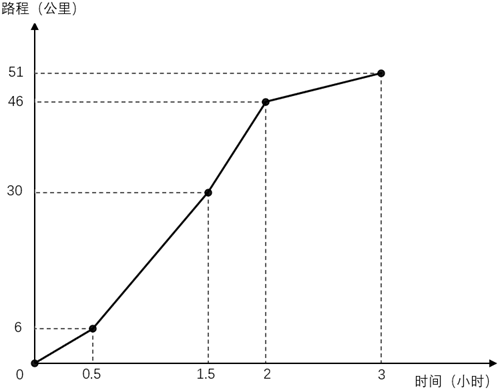
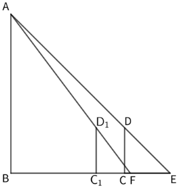
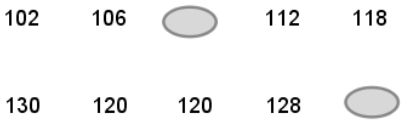
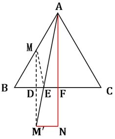

# 2026年上海市公务员录用考试《行测》题（网友回忆版）

> 数量关系 · 10 题 · 上海 2026

## 第 1 题　qid 12867713 · 数学运算

假设太阳系中的行星表面温度与它到太阳距离的平方根成反比，已知火星与太阳之间的距离大约为地球与太阳之间距离的1.5倍，若地球表面温度约为，则火星表面温度约为<u>        </u>。

- **A**. 9
- **B**. 12　✅
- **C**. 18
- **D**. 21

**答案**：B

**官方解析**

根据“太阳系中的行星表面温度与它到太阳距离的平方根成反比，火星与太阳之间的距离大约为地球与太阳之间距离的1.5倍”，则地球的表面温度大约为火星表面温度的倍。根据“地球表面温度约为”，则火星表面温度约为。

故正确答案为B。

---

## 第 2 题　qid 12867717 · 数学运算

某人骑行健身，他的骑行时间与路程的关系如图所示，则他骑行过程中的最快速度为每小时<u>        </u>公里。

- **A**. 16
- **B**. 24
- **C**. 32　✅
- **D**. 36

**答案**：C

**官方解析**

根据题意，骑行的过程可分为四个阶段，每个阶段速度可根据求解，具体如下：

第一阶段，公里/小时；

第二阶段，公里/小时；

第三阶段，公里/小时；

第四阶段，公里/小时。

综上，第三阶段速度最快，为每小时32公里。

故正确答案为C。

---

## 第 3 题　qid 12867716 · 数学运算

某科研院所50%的研究人员精通人工智能，70%的研究人员能用英语演讲，10%的研究人员既不精通人工智能也不能用英语演讲。现从精通人工智能的研究人员中随机选择1人，其能用英语演讲的概率为        。

- **A**. 0.2
- **B**. 0.4
- **C**. 0.6　✅
- **D**. 0.8

**答案**：C

**官方解析**

根据两集合容斥原理公式：，可得：，解得，即该科研院所有30%的研究人员既精通人工智能又能用英语演讲。根据公式：概率，则题干所求概率。

故正确答案为C。

---

## 第 4 题　qid 12867868 · 数学运算

文件柜有一个抽屉，其底面为长方形，该长方形的长比宽多12厘米，且抽屉内部四周无凸起，底面平整。小李准备裁剪一张刚好完全覆盖抽屉底面的防潮纸，他按测量的尺寸裁剪防潮纸后，发现这张防潮纸的面积恰好是448平方厘米。该文件柜抽屉的宽是        厘米。

- **A**. 14
- **B**. 16　✅
- **C**. 18
- **D**. 20

**答案**：B

**官方解析**

设该文件柜抽屉的宽为x厘米，长为（x+12）厘米。根据题意，这张防潮纸刚好完全覆盖抽屉底面，则防潮纸的面积即为抽屉底面的面积，由此可列式为：，解得x=16或-28，已知x应为正数，故该文件柜抽屉的宽是16厘米。

故正确答案为B。

---

## 第 5 题　qid 12867869 · 数学运算

甲、乙两个果园计划将所产苹果全部销售到阳光超市，以占据该超市的苹果市场份额的。实际销售中，甲果园售出了其苹果产量的，乙果园售出了其苹果产量的，甲、乙两个果园售出的苹果仅占超市苹果全部份额的，则甲果园苹果产量与乙果园苹果产量之比为<u>        </u>。

- **A**. 1：2
- **B**. 2：3
- **C**. 2：1　✅
- **D**. 3：2

**答案**：C

**官方解析**

设甲、乙果园的苹果产量分别为x、y，则阳光超市苹果的全部市场份额为，甲、乙果园实际售出的苹果分别为、。根据题意可列方程：，解得x：y=2：1。

故正确答案为C。

---

## 第 6 题　qid 12867870 · 数学运算

身高1.6米的甲站在路灯边，影子的长度是1.6米，她向路灯的方向走了1米，影子的长度变成了1.2米，则路灯的高度是        米。

- **A**. 4
- **B**. 5.6　✅
- **C**. 6
- **D**. 8.4

**答案**：B

**官方解析**

如图所示：

根据题意，路灯为AB，甲为CD，CE=1.6米，米，米。由于，则，故AB=BE。设路灯AB的高度为x米，则BE为x米，米。由于，则，可列式：，解得x=5.6，故路灯的高度是5.6米。

故正确答案为B。

---

## 第 7 题　qid 12867720 · 数学运算

某足球业余比赛规定：每支球队获胜一场得3分，平一场得1分，输一场不得分。球队A在单循环小组赛（小组中的每两支球队之间都进行一场比赛）中得12分。若该小组一共有6支球队，那么下列判断正确的是        。

- **A**. 球队A一定是小组第一
- **B**. 球队A在小组中至少排名第二（可以并列）　✅
- **C**. 球队A可能在小组中排名第三
- **D**. 球队A不可能进入前三

**答案**：B

**官方解析**

小组有6支球队，则单循环赛制中每支球队需与其余5支球队各赛一场，因此每支球队的比赛场数均为5场。球队A得12分，则只有4胜（3分×4）1负（0分）一种情况。设球队A负1场是输给球队B，则球队B最多可能5场比赛均获胜，得分不高于3×5=15分。其他4支球队至少输给球队A一场，最多可能胜4场，得分不高于3×4=12分。因此球队A12分在小组中的排名必然在前二。
故正确答案为B。

---

## 第 8 题　qid 12867719 · 数学运算

某市政务服务中心推出一款便民APP，上线第一个月注册用户数为1600人，在第二个月注册用户数比第一个月增长了        ，在第三个月注册用户仅比在第二个月注册用户多了100人，使得前三个月的总注册用户数为5300人。

- **A**. 12%
- **B**. 12.5%　✅
- **C**. 13%
- **D**. 13.5%

**答案**：B

**官方解析**

设在第二个月注册用户数为x人，则在第三个月注册用户数为（x+100）人，根据题意可列式：1600+x+（x+100）=5300，解得x=1800人。则在第二个月注册用户数比第一个月增长了。

故正确答案为B。

---

## 第 9 题　qid 12867725 · 数学运算

某工厂对10位员工进行技能测试，测试总分为150分，下面数据记录了员工测试成绩。其中有两名员工的成绩不小心被污渍盖住了，但人力资源总监记得测试成绩的均分为116.2分，且第25百分位数为106，第75百分位数为120，则中位数为<u>        </u>。

- **A**. 118
- **B**. 119　✅
- **C**. 120
- **D**. 121

**答案**：B

**官方解析**

设被污渍盖住的两个成绩分别为a、b（a&lt;b）。10位员工测试成绩的第25百分位数为106，其对应的位置为10×25%=2.5，向上取整为3，即成绩从小到大排列的第3个数为106，未被污渍盖住的8个数中只有102小于106，说明①。同理，第75百分位数为120，则10×75%=7.5，向上取整为8，即成绩从小到大排列的第8个数为120，未被污渍盖住的8个数中有130、128共2个数大于120，说明②。根据测试成绩的均分为116.2分，可列式：102+106+a+112+118+130+120+120+128+b=116.2×10，解得：a+b=226。若b=120，a=226-120=106；若b&lt;120，，与①矛盾。则满足题意的10位员工测试成绩只有一种情况，按从小到大排序依次为：102、106、106、112、118、120、120、120、128、130。故题干所求中位数，即第5和第6个数的平均数。

故正确答案为B。

注：百分位数是一种统计学术语，用于描述一组数据中特定百分比位置的值。一组n个观测值按数值从小到大排列，处于p%位置的值称第p百分位数。计算百分位数的位置i的公式为：i=n×p%，若i非整数，将i向上取整，对应数为第p百分位数；若i是整数，则第i项与第i+1项数据的平均数为第p百分位数。

---

## 第 10 题　qid 17056444 · 数学运算

某正三角形的太阳能板阵列ABC，边长为2公里，需要无人机进行巡检，已知无人机从AB边的中点M出发，飞至BC边任何一处后再返回控制中心A，则无人机的最短航程为（    ）公里（飞行轨迹视为平面）。

- **A**. 
2

- **B**. 

- **C**. 

- **D**. 

　✅

**答案**：D

**官方解析**

如图所示，作M点关于BC的对称点，连接，与BC的交点为E，所求最短航程即。作于点F，。在直角中，AB=2，，则公里，公里。，因M为AB中点，则公里，公里，故公里。在直角中，根据勾股定理，有，则公里，即无人机的最短航程为公里。

故正确答案为D。

---
