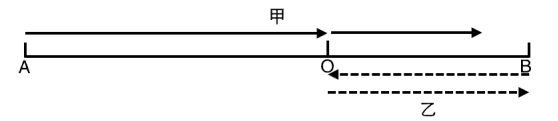
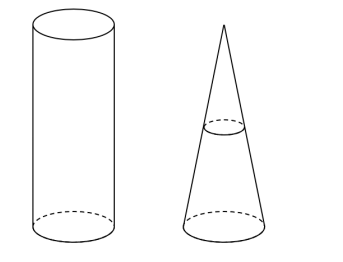
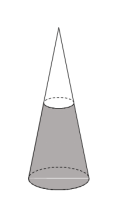

# 2026年内蒙古公务员录用考试《行测》题（网友回忆版）

> 数量关系 · 10 题 · 内蒙古 2026

## 第 1 题　qid 15833873 · 数学运算

一项工程，先由甲、乙两个工程队共同工作3天再由甲队单独工作5天，此时完成了工程的一半，且甲队的工作量与乙队的工作量恰好相同。问甲队单独完成此工程需要多少天?

- **A**. 10
- **B**. 24
- **C**. 32　✅
- **D**. 40

**答案**：C

**官方解析**

根据题意可知，3甲+5甲=3乙，则。赋值甲的效率为3，乙的效率为8，则工作总量为。因此，甲队单独完成此工程需要天。

故正确答案为C。

---

## 第 2 题　qid 15833879 · 数学运算

某公司共有甲、乙、丙三类工作人员，人数比例2：1：3，现发放新年礼品，若每人发10个，总礼品剩余100个；若每人发20个，会缺少80个。现按照甲、乙、丙三类工作人员每人1：2：2的数量比例发放，问礼品最少剩余多少个？

- **A**. 5
- **B**. 8
- **C**. 10　✅
- **D**. 14

**答案**：C

**官方解析**

设甲、乙、丙三类工作人员人数分别为2x人、x人、3x人，则总人数为6x人。根据新年礼品总数不变，可列式：10×6x+100=20×6x-80，解得x=3，可知，甲、乙、丙三类工作人员人数分别为6人、3人、9人，新年礼品总数为10×6×3+100=280个。

设现甲、乙、丙三类工作人员每人发放的数量分别为y个，2y个，2y个，根据题意可知：，解得。若要礼品剩余最少，则每人分的数量尽可能多且为整数。当y=9时，剩余数量最少，此时剩余数量=280-30×9=10个。

故正确答案为C。

---

## 第 3 题　qid 15833880 · 数学运算

甲乙相距100米，相向而行，在甲乙相遇后，乙调转方向和甲同向而行，乙的速度变为原来的2倍，甲保持速度不变，当乙回到起点时，乙的总路程为80米，问此时甲的总路程为多少米？

- **A**. 60
- **B**. 70
- **C**. 80
- **D**. 90　✅

**答案**：D

**官方解析**

令甲乙出发点分别为A点和B点，相向而行相遇点为O点，则甲乙二人行走路线如下图：

根据“乙回到起点时，乙的总路程为80米”且乙往返路程相同，则米，故米。方法一：由于甲乙相遇时，两人走的时间相同，根据“时间一定，路程和速度成正比”，可得甲的速度：乙的初始速度，则相遇后，甲的速度：乙变化后的速度，故相遇后甲所走的路程：乙所走的路程。且乙相遇后走了40米，则甲相遇后走了米，甲的总路程米。

方法二：由于乙往返路程相同，返回时速度变为原来的2倍，根据“路程一定，速度和时间成反比”，则返回时间变为相遇时间的，即甲在相遇后的行进时间也为相遇时间的。因甲保持速度不变，则相遇后甲的路程为米。因此，甲的总路程为60+30=90米。

故正确答案为D。

---

## 第 4 题　qid 17467593 · 数学运算

2026年甲与乙年龄之和是甲与乙年龄之差的2倍，也等于2030年甲的年龄，2026年丙的年龄是甲与乙年龄之和的一半，问在以下哪一年，甲与丙的年龄之和是乙的3倍？

- **A**. 2031
- **B**. 2032
- **C**. 2033
- **D**. 2034　✅

**答案**：D

**官方解析**

根据“2026年甲与乙年龄之和等于2030年甲的年龄”，则2026年乙的年龄为2030-2026=4岁。设2026年甲的年龄为x岁，根据“2026年甲与乙年龄之和是甲与乙年龄之差的2倍”，可列方程：，解得x=12，则2026年丙的年龄为岁。设a年后甲与丙的年龄之和是乙的3倍，则12+8+2a=3×（4+a），解得a=8，此时为2026+8=2034年。

故正确答案为D。

---

## 第 5 题　qid 15833738 · 数学运算

某研究机构跟踪一种商品的价格变化，发现每天的价格相较前一天增长10%，问几天之后价格会大于最初价格的1.5倍？

- **A**. 3
- **B**. 4
- **C**. 5　✅
- **D**. 6

**答案**：C

**官方解析**

赋值这种商品的最初价格为1，每天的价格较前一天增长10%，即每天的价格是前一天的1×（1+10%）=1.1倍，第n天后的价格为，需满足，代入选项，逐个验证如下：

A项：，不符合；

B项：，不符合；

C项：，符合题意，当选。

故正确答案为C。

---

## 第 6 题　qid 15833651 · 数学运算

已知甲地与乙地之间有5条路线直接连接，乙地与丙地之间有3条路线直接连接，甲地与丙地之间有2条路线直接连接。某人需要从甲地经过乙地，到达丙地后，再返回甲地，若要求往返路线没有任何重复，问共有多少种不同的路线选择？

- **A**. 150　✅
- **B**. 120
- **C**. 60
- **D**. 30

**答案**：A

**官方解析**

根据题意，本题需要分为选择去程路线和选择返程路线两步。

第一步：选择去程路线。从甲地经过乙地，到达丙地，则从甲地与乙地之间的5条路线选择1条，从乙地与丙地之间的3条路线选择1条，则去程共有种选择。

第二步：选择返程路线。分为以下两种情况：（1）从丙地直接返回甲地：从甲地与丙地之间的2条路线选择1条，有种选择。（2）从丙地经过乙地再回甲地：先从乙地与丙地之间的3条路线中排除去程时的1条路线，即从剩余2条路线中选择1条；再从甲地与乙地之间的5条路线中排除去程时的1条路线，即从剩余4条路线中选择1条，有种选择。分类用加法，则返程共有2+8=10种选择。

分步用乘法，共有15×10=150种不同的路线选择。

故正确答案为A。

---

## 第 7 题　qid 15833881 · 数学运算

实验室有一个圆锥形容器和一个圆柱形容器，高均为10厘米，底面半径均为2厘米。圆锥形容器内水的高度正好是圆锥高度的一半。若将圆锥形容器中的水倒入空的圆柱形容器后，水面的高度在以下哪个范围内？

- **A**. 0~1厘米之间
- **B**. 1~2厘米之间
- **C**. 2~3厘米之间　✅
- **D**. 3~4厘米之间

**答案**：C

**官方解析**

根据题意，圆锥形容器内水的高度正好是圆锥高度的一半（如图），则水面上方小圆锥形高度也是圆锥高度的一半，由于小圆锥形和大圆锥形容器相似，根据几何等比例放缩性质：在立体几何中，体积比等于相似比的立方，则。根据圆锥形体积公式：，则在圆锥形容器中水的体积=大圆锥形的体积-小圆锥形的体积。将圆锥形容器中的水倒入空的圆柱形容器，水的体积保持不变，设此时圆柱形中水面的高度为h厘米，根据圆柱形体积公式：，可列式：，解得，即此时圆柱形中水面的高度在2~3厘米之间。

故正确答案为C。

---

## 第 8 题　qid 15833740 · 数学运算

小明假期计划每周学习滑雪的天数不少于2天，学习乒乓球1天，周六、周日休息，且不能连续两天学习同一项运动，每天至多学习一项。问其每周的学习计划有多少种不同安排？

- **A**. 10
- **B**. 14
- **C**. 20　✅
- **D**. 26

**答案**：C

**官方解析**

根据题意，周六、周日休息，则每周需在周一至周五这5天中学习乒乓球和滑雪，分类讨论如下：

①滑雪2天，乒乓球1天：先从周一至周五中选出不相邻的2天学习滑雪，有（1，3）、（1，4）、（1，5）、（2，4）、（2，5）、（3，5）共6种情况；再从剩余的3天中选1天学习乒乓球，有种情况。分步相乘，共有6×3=18种情况。

②滑雪3天，乒乓球1天：先从周一至周五中选出不相邻的3天学习滑雪，只有（1，3，5）一种情况；再从剩余的2天中选1天学习乒乓球，有种情况。分步相乘，共有1×2=2种情况。

分类相加，小明每周的学习计划共有18+2=20种不同安排。

故正确答案为C。

---

## 第 9 题　qid 17467590 · 数学运算

甲乙同向而行，甲的速度是乙的速度的2倍，同向行走了一段时间后，乙将速度提高到原来的4倍，再用时10秒追上甲，问乙提速前用时多少秒?

- **A**. 5
- **B**. 10
- **C**. 15
- **D**. 20　✅

**答案**：D

**官方解析**

根据题意，赋值甲速度为2m/s，乙初始速度为1m/s，则乙提速后速度变为1×4＝4m/s。设乙提速前用时为t。

方法一：根据追及公式：，可列式：（2-1）t＝（4-2）×10，解得t＝20s。

方法二：因甲、乙行进的总路程相同，可列式：1×t+4×10=2×（t+10），解得t＝20s。

故正确答案为D。

---

## 第 10 题　qid 15833650 · 数学运算

某热水器厂家开展促销活动后，热水器售价降低10%，销量增加30%，活动前后利润与营业额的比值不变。问活动后比活动前的利润提高的百分比是多少？

- **A**. 12.5%
- **B**. 15%
- **C**. 17%　✅
- **D**. 20%

**答案**：C

**官方解析**

赋值活动前热水器的售价为10元/件，销量为10件，则活动后热水器的售价为10×（1-10%）=9元/件，销量为10×（1+30%）=13件。根据公式：营业额=售价×销量，可得活动前营业额为10×10=100元，活动后营业额为9×13=117元。根据“活动前后利润与营业额的比值不变”，即活动前后利润与营业额成正比，可知，则活动后比活动前的利润提高的百分比为。

故正确答案为C。

---
