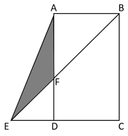

# 2026年四川省考/选调公务员录用考试《行测》试题（网友回忆版）

> 数量关系 · 10 题 · 四川 2026

## 第 1 题　qid 18643841 · 数学运算

一位顾客购买1件A商品和3件B商品，结账时错误地按3件A商品和1件B商品的价格进行计算，总价是实际总价的0.8倍。问A商品的单价是B商品的（    ）。

- **A**. 不到0.7倍　✅
- **B**. 0.7~1.0倍之间
- **C**. 1.0~1.4倍之间
- **D**. 1.4倍以上

**答案**：A

**官方解析**

方法一：赋值实际总价为100，则错误总价为100×0.8=80，根据题意可列式：A+3B=100······①，3A+B=80······②，联立①②两式，解得A=17.5，B=27.5，所求倍数，在A项范围内。

方法二：设A商品的单价为x，B商品的单价为y。“购买1件A商品和3件B商品”的实际总价=x+3y；“按3件A商品和1件B商品的价格进行计算”的错误总价=3x+y。根据题意，可列方程：0.8（x+3y）=3x+y；化简得2.2x=1.4y，故所求。

故正确答案为A。

---

## 第 2 题　qid 18643879 · 数学运算

军事演习中，某排35名战士要携带11台设备利用1条小艇过河。已知小艇最多可以乘坐5名战士，每2台设备需要占用1个人员位置，且返程时至少要留1名战士驾驶。如从河一侧行驶到另一侧需要5分钟，则整个排的战士和设备渡河至少需要多长时间？

- **A**. 1小时15分
- **B**. 1小时25分
- **C**. 1小时35分　✅
- **D**. 1小时45分

**答案**：C

**官方解析**

根据题意，若要用时最短，则每次渡河小艇尽量满员，由于每2台设备需要占用1个人员位置，则11台设备需占用个位置，由于位置数是整数，故11台设备共需占6个人员位置，即渡河需要的总位置数=35+6=41个。小艇每次最多容纳5个位置，且最后一次渡河无需返回，那么去掉最后一次运输5个位置，还剩41-5=36个位置。由于返程时需要驾驶员，则让1人一直充当驾驶员，小艇每次渡河还有4个位置，故需要次往返，总用时为（9×2+1）×5=95分钟，即1小时35分。

故正确答案为C。

---

## 第 3 题　qid 18643886 · 数学运算

甲、乙2人进行射箭训练，开始时分别分到12支和16支箭，甲每中靶一次额外奖励2支箭，乙每中靶一次额外奖励3支箭，且两人均消耗完所有的箭时训练结束。已知训练全程两人射出箭数相同，且甲中靶17次。问乙全程的命中率在以下哪个范围内？

- **A**. 不到20%
- **B**. 20%~25%之间　✅
- **C**. 25%~30%之间
- **D**. 30%以上

**答案**：B

**官方解析**

已知甲初始有12支箭，中靶17次，且每中靶一次奖励2支箭，甲全程射出的箭数=12+17×2=46支。因甲、乙两人射出箭数相同，则乙全程射出46支箭。设乙中靶x次，根据题意，可列方程：16+3x=46，解得x=10。根据命中率，则乙全程的命中率，在B项范围内。

故正确答案为B。

---

## 第 4 题　qid 18643853 · 数学运算

甲生产线每天可加工25台A设备或20台B设备，乙生产线每天可加工15台A设备或10台B设备。现要生产600台A设备和100台B设备，如乙生产线最多工作36天，问甲生产线最少要工作多少天（不足1天算1天）？

- **A**. 8　✅
- **B**. 9
- **C**. 10
- **D**. 11

**答案**：A

**官方解析**

要求甲工作时间最少，任务分配时优先让乙承担高适配任务，最大化减少甲的工作量。根据题意可知，甲生产线生产A、B设备的效率比为，乙生产线生产A、B设备的效率比为，由于1.5&gt;1.25，则乙生产A设备效率相对更优，故先让乙全力生产A设备，结合乙最多工作36天则可生产36×15=540台A设备。根据“甲生产线每天可加工25台A设备或20台B设备”，剩余600-540=60台A设备、100台B设备，那么甲总工作时间合计天，不足1天算1天，则甲最少要工作8天。

故正确答案为A。

---

## 第 5 题　qid 18643843 · 数学运算

某中学调查学生对篮球、足球、乒乓球三项运动的参与情况。随机抽取了150名学生，其中有86人喜欢打篮球，53人喜欢踢足球，76人喜欢打乒乓球；25人三项运动都喜欢，20人三项运动都不喜欢。问这150名学生中，仅喜欢其中两项运动的有多少人？

- **A**. 60
- **B**. 55
- **C**. 40
- **D**. 35　✅

**答案**：D

**官方解析**

设仅喜欢其中两项运动的有x人，根据三集合容斥原理非标准型公式：A+B+C-满足两项-2×满足三项=总数-都不，可得：86+53+76-x-2×25=150-20，解得x=35。
故正确答案为D。

---

## 第 6 题　qid 18643892 · 数学运算

两辆测试用新能源微型汽车A和B在10.8千米长的环形跑道上沿相反方向匀速行驶，每两次相遇之间正好间隔3分钟。已知A的速度是B的0.8倍，问A的速度为多少千米/小时？

- **A**. 76
- **B**. 96　✅
- **C**. 108
- **D**. 120

**答案**：B

**官方解析**

设B的速度为x千米/小时，则A的速度为0.8x千米/小时。每两次相遇之间正好间隔3分钟，可得两车每3分钟（等于小时）共同走完一圈，根据相遇问题公式：，，解得x=120，则A的速度千米/小时。

故正确答案为B。

---

## 第 7 题　qid 18643872 · 数学运算

工厂有甲、乙两个车间，如果从甲车间调90人到乙车间，则乙车间人数是甲车间的2倍；如果从乙车间调9人到甲车间，则甲车间人数是乙车间的6倍。问甲车间原来有多少人？

- **A**. 144
- **B**. 153　✅
- **C**. 169
- **D**. 197

**答案**：B

**官方解析**

设甲车间原来有x人，乙车间原来有y人。根据题意可得（x-90）×2=y+90······①，（y-9）×6=x+9······②，分别化简可得y=2x-270······③，6y=x+63······④，联立③④两式，解得x=153，y=36，即甲车间原来有153人。
故正确答案为B。

---

## 第 8 题　qid 18643881 · 数学运算

某小剧场有4排座位，第一排有6个座位，往后每排比前一排多2个。张某和郭某随机选择小剧场的2个座位就坐，问他们坐在同一排的概率在以下哪个范围内？

- **A**. 低于0.15
- **B**. 在0.15-0.2之间
- **C**. 在0.2-0.25之间　✅
- **D**. 高于0.25

**答案**：C

**官方解析**

根据题意可知，第一排有6个座位，第二排有8个座位，第三排有10个座位，第四排有12个座位，共有6+8+10+12=36个座位。可得张某和郭某就坐的总情况数为种，两人均坐第一排情况数为种；均坐第二排情况数为种；均坐第三排情况数为种；均坐第四排情况数为种；则坐同一排的情况数为30+56+90+132=308种，根据概率，可得所求概率，在C项范围内。

故正确答案为C。

---

## 第 9 题　qid 18643873 · 数学运算

一批志愿者向灾区背运一批物资。如果每人背20千克，则余下100千克物资；如果每人多背4千克，则还能比原计划多背运5%的物资。问如在原计划基础上增加400千克物资且每人背25千克，至少还需要增加多少名志愿者?

- **A**. 9
- **B**. 11
- **C**. 13　✅
- **D**. 15

**答案**：C

**官方解析**

设原计划总人数为x人，物资总量为y千克。则y=20x+100······①；y×（1+5%）=（20+4）x······②。
根据上式，联立方程组，解得x=35，y=800。
根据“如在原计划基础上增加400千克物资且每人背25千克”，则现在物资总量=800+400=1200千克。设至少还需要增加n名志愿者。
则1200=（35+n）×25，解得n=13。因此至少还需要增加13名志愿者。
故正确答案为C。

---

## 第 10 题　qid 18643906 · 数学运算

在下图直角梯形ABCE的花圃中，，阴影部分（面积为300平方米）种植郁金香，梯形内其他部分种植水仙花。已知AB为30米，BC为50米。问水仙花的种植面积为多少平方米？

- **A**. 1700　✅
- **B**. 2000
- **C**. 2300
- **D**. 2500

**答案**：A

**官方解析**

根据AB=30米，BC=50米，可得平方米。则平方米。根据，可得AF=30米，则DF=AD-AF=20米。根据四边形ABCE为直角梯形，则，，故，即DE：AB=DF：AF，可得DE=20米。平方米。

故正确答案为A。

---
