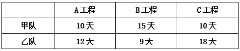
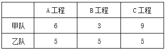
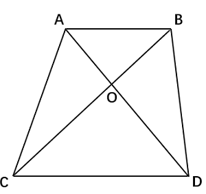
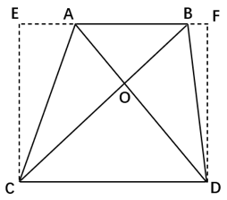

# 2026年国家公务员录用考试《行测》题（行政执法卷网友回忆版）

> 数量关系 · 10 题 · 国考 2026

## 第 1 题　qid 19526236 · 数学运算

某种商品若按每件100元出售，每天售出m件；若降价10%，日销量将提高25%且单日利润与降价前相同。问该商品成本为多少元/件？

- **A**. 50　✅
- **B**. 60
- **C**. 70
- **D**. 80

**答案**：A

**官方解析**

方法一：设该商品成本为x元/件。根据题意，每件售价100元，每天可售出m件；若降价10%，日销量可提高25%，则降价后每件售价为100×（1-10%）=90元，日销量为（1+25%）m=1.25m件。根据单日利润与降价前相同，可列式：，解得x=50，故该商品成本为50元/件。

方法二：降价前每件售价100元，降价10%后每件售价减少100×10%=10元。根据公式：利润=售价-成本，成本不变，则售价减少10元即利润减少10元。根据题意可知，单日利润与降价前相同，根据公式：总利润=单个利润×数量，已知总利润一定，单个利润与数量成反比，该商品降价前、后日销量之比为1：（1+25%）=4：5，则降价前、后单个利润之比为5：4，相差1份即为利润减少的10元，则降价前单个利润为元，故该商品成本为100-50=50元/件。

故正确答案为A。

---

## 第 2 题　qid 19526237 · 数学运算

某部门7人分两组到甲、乙两市进行调研。已知到甲市人数超过一半，老张和小王均到乙市，问共有多少种不同的分组方式？

- **A**. 10
- **B**. 8
- **C**. 6　✅
- **D**. 5

**答案**：C

**官方解析**

根据题意可知，总人数为7人，老张和小王均到乙市，甲市人数超过一半且为整数，即甲市为4人或5人，分以下2种情况。

①甲市4人，乙市3人：因老张和小王均到乙市，故只需在余下7-2=5人中选出1人分到乙市，其余4人去甲市即可，情况数为种。

②甲市5人，乙市2人：老张、小王均到乙市，余下5人均到甲市，情况数为1种。

则共有5+1=6种不同的分组方式。

故正确答案为C。

---

## 第 3 题　qid 19526239 · 数学运算

小王从甲地匀速前往乙地，到达后立刻匀速返回。已知他去程的用时比返程多3小时，去程的速度是返程的40%，且往返的平均速度为40千米/小时，问甲、乙两地相距多少千米？

- **A**. 70
- **B**. 140　✅
- **C**. 210
- **D**. 280

**答案**：B

**官方解析**

由题意可知，，根据“路程一定，速度与时间成反比”，则，设去程时间为5x小时，则返程时间为2x小时，根据“去程的用时比返程多3小时”，可列式：5x-2x=3，解得x=1，故小时，小时，往返用时5+2=7小时，由“往返的平均速度为40千米/小时”，可得甲、乙两地往返距离2S=vt=40×7=280千米，则甲、乙两地距离S=280÷2=140千米。

故正确答案为B。

---

## 第 4 题　qid 19526259 · 数学运算

2024年张和李年龄的平均值是刘的2倍；2028年张的年龄是李的1.5倍，比刘年龄的2倍大4岁。问张哪一年60岁？

- **A**. 2036年
- **B**. 2038年
- **C**. 2040年　✅
- **D**. 2042年

**答案**：C

**官方解析**

方法一：根据“2028年张的年龄是李的1.5倍”，可设2028年张、李、刘的年龄分别为3x、2x、y，因2028年张的年龄比刘年龄的2倍大4岁，可得：3x=2y+4······①；根据“2024年张和李年龄的平均值是刘的2倍”，可得：······②；联立①②式，解得x=16，y=22。即2028年张的年龄为3x=3×16=48岁，到60岁需要60-48=12年，则张在12+2028=2040年60岁。

方法二：根据“2028年张的年龄是李的1.5倍”，可知，故2028年张的年龄是3的倍数；再过n年，张60岁时，年龄也是3的倍数，故n也为3的倍数，即所求年份-2028能被3整除。观察选项，只有C项满足。

故正确答案为C。

---

## 第 5 题　qid 19526285 · 数学运算

甲、乙和丙3个单位共有100多名职工，其中甲单位的职工人数占总数的24%，乙单位的职工比丙单位多50%。问丙单位的职工比甲单位多多少人？

- **A**. 4
- **B**. 8　✅
- **C**. 12
- **D**. 16

**答案**：B

**官方解析**

根据题意可得，，则，又因为，因此（乙人数+丙人数）既满足19的倍数，又满足5的倍数，故应为19×5n=95n人。那么，结合题干条件“3个单位共有100多名职工”可知，总人数（125n）只能为125人，此时n=1。则甲单位的职工人数=125×24%=30人，丙单位的职工人数人，题干所求=38-30=8人。

故正确答案为B。

---

## 第 6 题　qid 19526319 · 数学运算

某单位从所有职工中随机选3人参加某个会议，张立和李磊2人中只有1人被选中的概率是2人均被选中概率的30倍。问该单位有职工多少人？

- **A**. 15
- **B**. 17
- **C**. 29
- **D**. 33　✅

**答案**：D

**官方解析**

根据公式：概率；根据题意可知：，即只有1人被选中的情况数=2人均被选中的情况数×30。

方法一：

设该单位有职工n人，根据题意可知：n＞3。张立和李磊中只有1人被选中，需先从2人中选择1人，再从剩余的职工中选择2人，满足条件的情况数为；张立和李磊2人均被选中，需要从剩余的职工中再选择1人，满足条件的情况数为。可列式：（n−2）×（n−3）=（n−2）×30，解得n=33人。

方法二：

根据题干信息代入排除。

代入A项：若该单位有职工15人，张立和李磊中只有1人被选中，满足条件的情况数为；张立和李磊均被选中，满足条件的情况数为。可验证：，错误；

代入B项：若该单位有职工17人，张立和李磊中只有1人被选中，满足条件的情况数为；张立和李磊均被选中，满足条件的情况数为。可验证：，错误；

代入C项：若该单位有职工29人，张立和李磊中只有1人被选中，满足条件的情况数为；张立和李磊均被选中，满足条件的情况数为。可验证：，错误；

排除A、B、C三项，选择D项。

验证D项：若该单位有职工33人，张立和李磊中只有1人被选中，满足条件的情况数为；张立和李磊均被选中，满足条件的情况数为。可验证：，正确。

故正确答案为D。

---

## 第 7 题　qid 19526316 · 数学运算

甲、乙两个工程队单独完成A、B、C三个工程，所需时间如下：

问两队合作完成这3个工程至少需要多少天（不足1天算1天）？

- **A**. 18
- **B**. 17
- **C**. 16
- **D**. 15　✅

**答案**：D

**官方解析**

根据题意，赋值A工程的工程总量为60，B工程为45，C工程为90，则甲、乙两队完成A、B、C三个工程的工作效率如下：

要想完成这3个工程的时间尽量少，需要让甲、乙两队优先完成各自擅长的工程。对比发现，甲队更擅长C工程，乙队更擅长B工程。则甲队优先完成C工程所需时间为10天，同时乙队完成B工程需要9天，此时乙队可再独自做10-9=1天A工程。甲队完成C工程后，两队再共同完成A工程，还需天，则两队合作完成这3个工程至少需要10+5=15天。

故正确答案为D。

---

## 第 8 题　qid 19526325 · 数学运算

某考试有30人参加，每人得分都是0~100之间的整数且互不相同。已知得分不低于90的人平均分为93.8分，小姜得了92分，问他的成绩排名最低可能是第几名？

- **A**. 4　✅
- **B**. 5
- **C**. 7
- **D**. 8

**答案**：A

**官方解析**

设得分不低于90的有n个人。根据题意“每人得分都是0~100之间的整数且互不相同”，则分数不低于90的人数最多为90~100分各1人，即；总分数为n个整数之和，即总分数＝93.8n为整数，则n只能为5或10。

若n＝10，则前十名的总分数为93.8×10＝938分。因分数为互不相同的整数，则前十名总分最低为90+91+92+93+94+95+96+97+98+99＝945&gt;938，n＝10不成立，则n＝5，排除C、D两项。

n＝5，则前五名总分数为93.8×5＝469分。问“排名最低可能是第几名”，代入B项，92分为第5名，则前五名总分数最低为92+93+94+95+96＝470&gt;469，不成立，排除。

故正确答案为A。

---

## 第 9 题　qid 19526340 · 数学运算

一块梯形场地如下图所示，已知OA=0.6OD，现在需要将这块场地拓展为一块长方形场地，问扩展后场地面积比原来至少增加：

- **A**. 20%
- **B**. 25%　✅
- **C**. 40%
- **D**. 50%

**答案**：B

**官方解析**

场地要扩展成长方形且面积增加最少，需以梯形的最长底边为长方形的长，梯形的高为长方形的宽，扩展后的场地EFCD如下图所示。在梯形ABCD中，，，赋值，，设梯形的高为，则。扩展后的长方形场地面积最小为，扩展后场地面积比原来至少增加。

故正确答案为B。

---

## 第 10 题　qid 19526328 · 数学运算

某社区干部每周一参加工作例会，每月10日、20日接访群众。已知8月与9月共有2次接访群众与工作例会在同一天，问当年9月1日是：

- **A**. 周三
- **B**. 周二
- **C**. 周六　✅
- **D**. 周五

**答案**：C

**官方解析**

根据题意可知，8月10日、20日，9月10日、20日，这4天中有2天既接访群众又参加工作例会，即这4天中仅有2天是周一。这4天中相邻2天间隔天数依次为10天、21天、10天，21天为7的倍数，则仅8月20日与9月10日的星期数相同，故8月20日与9月10日为周一，则9月3日为周一，9月1日为周六。
故正确答案为C。

---
