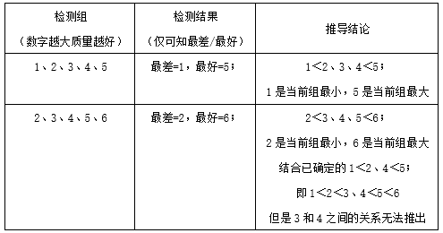
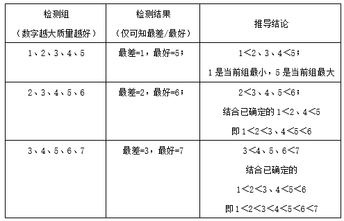

# 2026年天津市公务员录用考试《行测》题（网友回忆版）

> 数量关系 · 15 题 · 天津 2026

## 第 1 题　qid 18643686 · 数学运算

一台扫地机器人满电状态全功率工作25分钟后充电20分钟，剩余电量为80%；此时以全功率工作10分钟后充电24分钟，剩余电量为96%。若单位时间内充入电量为固定值，问剩余电量还能以全功率工作多少分钟？

- **A**. 96
- **B**. 72
- **C**. 64
- **D**. 48　✅

**答案**：D

**官方解析**

赋值扫地机器人满电状态下电量为100，设扫地机器人全功率工作时每分钟消耗电量为x，充电时每分钟补充电量为y。根据题意，可列出方程：
100-25x+20y=100×80%······①；
100×80%-10x+24y=100×96%······②。
化简方程得：4=5x-4y；8=12y-5x。解得x=2，y=1.5。故剩余电量还能以全功率工作100×96%÷2=48分钟。
故正确答案为D。

---

## 第 2 题　qid 18643694 · 数学运算

小陈连续6天看一本书，每天看整数页，且每天看的页数都比上一天多。已知前3天看的页数正好是连续的自然数，第6天看的页数等于第4、5天之和，第5天的页数等于第1、2、3天之和。若6天一共看了100页，则第4天看了多少页？

- **A**. 14　✅
- **B**. 15
- **C**. 16
- **D**. 17

**答案**：A

**官方解析**

设第4天看了x页，前3天看的页数之和为y，则第5天看的页数也为y，第6天看的页数为x+y；由于前3天看的页数正好是连续的自然数，可知y为3的倍数。根据题意，可列出方程y+x+y+x+y=100，整理可得：2x+3y=100。代入A项，x=14，解得y=24，24是3的倍数，24÷3=8，可知前3天看的页数分别为7、8、9，因此这6天看的页数分别是7、8、9、14、24、38，符合“每天看的页数都比上一天多”，A项正确，其他选项无需再代入。
故正确答案为A。

---

## 第 3 题　qid 18643697 · 数学运算

有甲、乙两个仓库均存放一些新款车和旧款车，两个仓库汽车总数之比为7：4。甲仓库的新款车占30%，乙仓库新款车占90%。若两个仓库汽车总数有300多辆，问甲仓库的旧款车比乙仓库多多少辆？

- **A**. 120
- **B**. 124
- **C**. 130
- **D**. 135　✅

**答案**：D

**官方解析**

方法一：根据题意可知，、，因此甲仓库汽车总数是7和10的倍数，即为70的倍数，则乙仓库汽车总数为40的倍数，二者之和为110的倍数，由于“两个仓库汽车总数有300多辆”，可知两个仓库汽车总数为330辆，其中甲仓库汽车总数为210辆，乙仓库汽车总数为120辆。因此，甲仓库旧款车数量=210×（1-30%）=147辆，乙仓库旧款车数量=120×（1-90%）=12辆，甲仓库的旧款车比乙仓库的旧款车多147-12=135辆。

方法二：设甲、乙两个仓库的汽车总数分别为7x、4x，则甲仓库的旧款车数量为，乙仓库的旧款车数量为，二者之比为4.9：0.4=49：4。故甲仓库的旧款车比乙仓库多45份，应是45的倍数，只有D项符合。

故正确答案为D。

---

## 第 4 题　qid 18643632 · 数学运算

甲、乙、丙、丁4个车间工人人数比为5：4：3：2。现乙调1人去甲，丙调3人去丁，此时甲工人数是丙的2倍。问此时乙至少再调多少人去其他车间，其工人数才能少于其余任何一个车间？

- **A**. 5
- **B**. 6
- **C**. 7　✅
- **D**. 8

**答案**：C

**官方解析**

根据比例设原来甲、乙、丙、丁4个车间工人人数分别为5x、4x、3x、2x。根据调动之后甲工人数是丙的2倍，可得5x+1=2（3x-3），解得x=7。故原来甲、乙、丙、丁4个车间工人人数分别为35、28、21、14，调动之后甲、乙、丙、丁4个车间工人人数分别为36、27、18、17。
题干问至少，从最小的选项代入验证：
代入A项，则此时乙车间为27-5=22人，乙可调5人去丙，此时丙工人数为18+5=23，丁工人数不变为17人，不满足乙工人数少于丁，排除；
代入B项，则此时乙车间为27-6=21人，乙可调4人去丙，调2人去丁，此时丙工人数为18+4=22，丁工人数为17+2=19，不满足乙工人数少于丁，排除；
代入C项，则此时乙车间为27-7=20人，乙可调3人去丙，调4人去丁，此时丙工人数为18+3=21，丁工人数为17+4=21，满足题意，当选。
故正确答案为C。

---

## 第 5 题　qid 18643695 · 数学运算

一种商品第一天按定价卖了12件，第二天按定价打七折卖了20件，收入比第一天多400元，利润（收入-成本）比第一天少400元。问这种商品如果按定价打八折卖，每件利润为多少元？

- **A**. 40
- **B**. 50
- **C**. 60　✅
- **D**. 70

**答案**：C

**官方解析**

设该商品的单件定价为x元，单件成本为y元。根据“收入比第一天多400元”，可列方程，解得x=200；根据“利润（收入-成本）比第一天少400元”，可列方程12×（200-y）-20（200×0.7-y）=400，解得y=100。则这种商品如果按定价打八折卖，每件利润为200×0.8-100=60元。

故正确答案为C。

---

## 第 6 题　qid 18643720 · 数学运算

甲和乙两种酒精溶液的浓度分别为m%和n%，3千克甲溶液、2千克乙溶液混合后得到的溶液浓度为1.2m%，9千克甲溶液和1千克水混合后得到的溶液浓度为（n-24）%。问3千克甲溶液、4千克乙溶液和1千克水混合后得到的溶液浓度为多少？

- **A**. 40%
- **B**. 45%　✅
- **C**. 50%
- **D**. 55%

**答案**：B

**官方解析**

由公式：溶质=溶液×浓度，根据“3千克甲与2千克乙混合”可列式：3×m%+2×n%=（3+2）×1.2m%，化解得······①；根据“9千克甲和1千克水混合”可列式：9×m%+1×0%=（9+1）×（n-24）%，与①式联立，解得n=60，m=40；根据“3千克甲、4千克乙和1千克水混合”，设混合后的溶液浓度为x%，则可列式：，解得x=45。

故正确答案为B。

---

## 第 7 题　qid 18643702 · 数学运算

小连从环形跑道上某一点出发跑步，第1圈匀速行进用时4分钟，此后均匀加速，第2圈的用时比第1圈短1分钟。问开始跑步后多久，速度达到匀速时的2倍？

- **A**. 7分15秒
- **B**. 7分30秒
- **C**. 8分15秒
- **D**. 8分30秒　✅

**答案**：D

**官方解析**

设环形跑道的长度为S米，第一圈的速度米/分钟；

第二圈开始匀加速运动，加速度为a，所用时间=4-1=3分钟；

根据匀加速运动的公式；，其中（v）是末速度，（）是初速度，（a）是加速度，（t）是时间。

第一圈和第二圈路程S相同，

第一圈的······①；

第二圈的初始速度为第一圈的速度，所用时间为3分钟，则······②；

联立①②两式得到，即。

求速度达到匀速时的2倍即末速度时的时间，根据公式，得，解得分钟。

则从第二圈开始用时4.5分钟速度达到匀速时的2倍，即开始跑步后4+4.5=8.5分钟。

故正确答案为D。

---

## 第 8 题　qid 18643633 · 数学运算

小张每周一、三晚上上瑜伽课，每周四、五晚上上英语课。她9月上英语课的次数比上瑜伽课的次数多2次，则她12月最后一次上课是：

- **A**. 12月30日，英语　✅
- **B**. 12月31日，英语
- **C**. 12月30日，瑜伽
- **D**. 12月31日，瑜伽

**答案**：A

**官方解析**

9月份有30天，共有4个完整的星期多2天。因为9月上英语课的次数比上瑜伽课的次数多2次，则9月29日、30日分别为周四和周五。由于10月1日至12月31日共：31+30+31=92天，即周余1天，则12月31日是周六，不上课，故她12月最后一次上课是12月30日（周五），上英语课。

故正确答案为A。

---

## 第 9 题　qid 18643681 · 数学运算

某单位开展法治知识竞赛，共50人参与答题，每个人答6道题，其中答对这6道题的人数分别为41至46的连续自然数。如果答对至少4题，则可进入复赛。那么本次至少有多少人可进入复赛？

- **A**. 35
- **B**. 36
- **C**. 37　✅
- **D**. 38

**答案**：C

**官方解析**

根据题意，50人共需答题50×6=300道，已答对题数为41+42+43+44+45+46=261道，则未答对题数为300-261=39道，根据“答对至少4题，则可进入复赛”，每个人答6道题，即错3道及以上不能进入复赛，最多有39÷3=13人未进入复赛，则至少有50-13=37人可进入复赛。
故正确答案为C。

---

## 第 10 题　qid 18643634 · 数学运算

小赵开车从A地前往B地，前25％的路程匀速行驶用了1小时10分，此后均匀加速并用50分钟到达A、B两地中点。后半段均匀减速，又用了1小时40分到达B地。问到达B地的速度是从A地出发时的多少倍？

- **A**. 不到1.25倍　✅
- **B**. 1.25~1.35倍之间
- **C**. 1.35~1.45倍之间
- **D**. 超过1.45倍

**答案**：A

**官方解析**

设全程为4S，第一段匀速运动的速度为，第二段匀加速到达A、B两地中点时速度为，到达B地的速度为。

方法1：赋值全程25％的路程S为350，则总路程4S=350×4=1400，后半段路程。由此可得=5/分钟，根据公式：匀变速运动的平均速度、路程=平均速度×时间，可得，解得/分钟；后半段路程用了1小时40分到达B地，即用了100分钟，可得，解得/分钟，则所求，在A项范围内。

方法2：根据公式：路程=平均速度×时间，可得，由此可得第二段路程的平均速度=第三段路程的平均速度。根据公式：匀变速运动的平均速度，可列式：，由此可得，则所求，在A项范围内。

故正确答案为A。

---

## 第 11 题　qid 18643774 · 数学运算

某种质检设备每次检测5件产品，能从中挑出质量最好和最差的产品各1件。问用其对至少多少件质量彼此不同的产品进行足够多次检测，就一定能将所有产品按照质量高低排序？

- **A**. 6
- **B**. 7　✅
- **C**. 8
- **D**. 9

**答案**：B

**官方解析**

根据题意，每次检测5件产品只能得出质量最好和最差的产品各1件，即中间3件产品质量高低排序未知。正面考虑比较复杂，结合选项数值较少，可采用代入排除法。

代入A项：即6件产品。检测情况及结果如下表所示：

（假设产品质量排序为1＜2＜3＜4＜5＜6）

代入B项：即7件产品。检测情况及结果如下表所示：

（假设产品质量排序为1＜2＜3＜4＜5＜6＜7）

综上所述，即对至少7件质量彼此不同的产品进行足够多次检测，就一定能将所有产品按照质量高低排序。

故正确答案为B。

---

## 第 12 题　qid 18643727 · 数学运算

将20台相同的笔记本电脑分配给甲、乙、丙3个办公室，要求甲分配的数量在3台到7台之间，且不能是分配数量最少的办公室之一。问有多少种不同的分配方式？

- **A**. 30
- **B**. 32
- **C**. 36
- **D**. 40　✅

**答案**：D

**官方解析**

根据题意，“将20台相同的笔记本电脑分配给甲、乙、丙3个办公室”，即每个办公室至少分配一台电脑。“要求甲分配的数量在3台到7台之间”，即甲分配的数量取值范围：3，4，5，6，7。“且甲办公室不能是分配数量最少的办公室之一”，即甲分配的数量不能是3个办公室的最小值。
综上所述，用枚举法分情况讨论：
情况①：若甲分配到3台，剩余17台可分为（1，16）、（2，15）这两种情况，再分配给乙和丙，则有2×2=4种情况；
情况②：若甲分配到4台，剩余16台可分为（1，15）、（2，14）、（3，13）这三种情况，再分配给乙和丙，则有3×2=6种情况；
情况③：若甲分配到5台，剩余15台可分为（1，14）、（2，13）、（3，12）、（4，11）这四种情况，再分配给乙和丙，则有4×2=8种情况；
情况④：若甲分配到6台，剩余14台可分为（1，13）、（2，12）、（3，11）、（4，10）、（5，9）这五种情况，再分配给乙和丙，则有5×2=10种情况；
情况⑤：若甲分配到7台，剩余13台可分为（1，12）、（2，11）、（3，10）、（4，9）、（5，8）、（6，7）这六种情况，再分配给乙和丙，则有6×2=12种情况。
综上，不同的分配方式共有4+6+8+10+12=40种
故正确答案为D。

---

## 第 13 题　qid 18643726 · 数学运算

一个水池的内部结构为倒圆锥体。现向这个水池内部注入水，且注入速度从0开始均匀递增。已知1小时后水深为1米，问还要几小时水深将达到2米？

- **A**. 
3

- **B**. 

- **C**. 

　✅
- **D**. 

**答案**：C

**官方解析**

根据几何等比例放缩性质，在立体几何中“体积之比=相似比的立方”。倒圆锥体中，水深为1米的小圆锥与水深为2米的大圆锥相似，则，即相似比为1：2，故。

根据匀加速直线运动的位移公式：，由题干可知“注入速度从0开始均匀递增”，注水属于初速度的匀加速运动，a为注水加速度，注水量即位移，可得注水量S与成正比。已知注入水深1米时的小圆锥用时小时，设注入水深2米时的大圆锥总时间为小时，则，解得小时。故还需时间为小时。

故正确答案为C。

---

## 第 14 题　qid 18643779 · 数学运算

将6件不同类型的家用电器随机分配给张、王、李、赵4名维修人员修理。已知每人修理1~2件电器，问电视机和冰箱由同一人修理，且李和赵修理电器件数不同的概率在以下哪个范围内？

- **A**. 不到0.1　✅
- **B**. 0.1~0.15之间
- **C**. 0.15~0.2之间
- **D**. 超过0.2

**答案**：A

**官方解析**

根据公式：概率，分析如下：

根据题意，6件不同电器分配给4个人修理，每人修理1~2件，先对电器分配数量进行分组，其中2件有两组，1件有两组，然后分给４个人，则总情况数共有种。

满足条件的情况为“电视机和冰箱由同一人修理，且李和赵修理电器件数不同”，则先从剩下4个电器中选出两个为1组，剩下的2个电器每一个1组，共有种分组情况；接下来从李和赵2个人中选1个人，张和王2个人中选1个人，两人分别去修2个零件的两组，剩余的两人则分别去修1个零件的两组，有种情况。故满足条件的情况数共有6×16=96种。

综上，所求概率&lt;0.1。

故正确答案为Ａ。

---

## 第 15 题　qid 18643776 · 数学运算

维修工小周从13：00开始修理①、②、③、④、⑤共5部手机，15：30修完第3部手机后休息10分钟继续工作，并于17：00完成修理。已知①的修理用时65分钟，②的修理用时比③长10分钟，比④短20分钟，⑤的修理时长是③的2倍，且修理时间均无重合。则他16：20正在修理的手机：

- **A**. 可能是①、②或⑤
- **B**. 可能是③或④
- **C**. 只可能是①
- **D**. 只可能是④　✅

**答案**：D

**官方解析**

设③的修理用时为x分钟，则②的修理用时为（x+10）分钟，④的修理用时=x+10+20=（x+30）分钟，⑤的修理时长为2x分钟。根据题意可知，小周修理5部手机共用时为17：00-13：00-10分钟=230分钟，则65+（x+10）+x+（x+30）+2x=230，解得x=25，则②、③、④、⑤的修理时长分别为35、25、55、50分钟。小周修理前3部手机共用时15：30-13：00=150分钟，后两部手机共用时230-150=80分钟，则只能是①（65分钟）、②（35分钟）、⑤（50分钟）作为前3部修理的手机，③（25分钟）、④（55分钟）作为后两部修理的手机。后两部手机从15：40开始修理，故问题中16：20正在修理的手机是在开始40分钟后。若先修理③只需25分钟，16：20一定正在修理④；若先修理④需要55分钟，16：20也一定正在修理④。
故正确答案为D。

---
