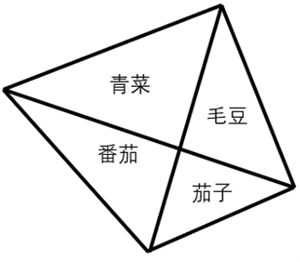
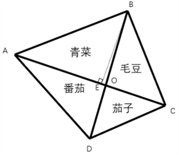

# 2026年广东省公务员录用考试《行测》题（网友回忆版）

> 数量关系 · 11 题 · 广东 2026

## 第 1 题　qid 18643976 · 数学运算

，，，，，，（    ）

- **A**. 
1

- **B**. 

- **C**. 

- **D**. 

　✅

**答案**：D

**官方解析**

数列各项均为分数，考虑分数数列。分子、分母分开看无明显规律，考虑整体看。各项分子减分母得到新数列：24，18，13，9，6，4，（    ），无明显规律；新数列前项减后项得到数列：6，5，4，3，2，（    ），是公差为-1的等差数列，则下一项为2-1=1，新数列下一项为4-1=3，即所求项分子减分母应为3，只有D项53-50=3符合。
故正确答案为D。

---

## 第 2 题　qid 18643978 · 数学运算

未来五年，某市计划新增风电装机容量占新能源总装机容量的40%，光伏装机容量占新能源总装机容量的35%，其余为生物质能，已知光伏装机容量比生物质能多120兆瓦，则未来五年，该市新能源总装机容量为（    ）兆瓦。

- **A**. 600
- **B**. 800
- **C**. 1000
- **D**. 1200　✅

**答案**：D

**官方解析**

由题意可知，生物质能装机容量占新能源总装机容量的比重=1-40%-35%=25%，则光伏装机容量占新能源总装机容量的比重比生物质能高35%-25%=10%，且光伏装机容量比生物质能多120兆瓦，故未来五年，该市新能源总装机容量为兆瓦。

故正确答案为D。

---

## 第 3 题　qid 18643980 · 数学运算

某厂家在广交会期间获得了大量的订单，其中，周六签约的客户数量是周日的1.5倍，签约总金额是周日的80%，如果周六、周日共与40家客户定成了签约，订单总金额为720万元（没有重复签约的客户），则周日平均每家客户的签约金额为（    ）万元。

- **A**. 15
- **B**. 20
- **C**. 25　✅
- **D**. 10

**答案**：C

**官方解析**

因“周六签约的客户数量是周日的1.5倍”，且“周六、周日共与40家客户定成了签约”，则周日签约客户数量家；同理可得，周日签约总金额万元。故周日平均每家客户的签约金额万元。

故正确答案为C。

---

## 第 4 题　qid 18643979 · 数学运算

某蓄电池可以同时供20台设备运行5天，在供20台设备运行12小时后，又新增了5台设备。如果所有设备每天的耗电量相等，则该蓄电池还可以供这些设备运行（    ）天。

- **A**. 3.5
- **B**. 3.6　✅
- **C**. 3.8
- **D**. 4.0

**答案**：B

**官方解析**

赋值每台设备1天的耗电量为1，则蓄电池总电量=20×1×5=100，20台设备运行12小时的耗电量，此时剩余电量=100-10=90，则剩余运行天数天。

故正确答案为B。

---

## 第 5 题　qid 18643972 · 数学运算

某企业每生产一台能耗高的服务器，能获得5万元的利润，但要扣除4单位碳配额；每生产一台能耗低的终端，能获得2万元的利润，并增加1单位碳配额。若该企业每月最多生产服务器和终端共2000台，且每月的碳配额总量不低于零，则该企业每月最大利润为（    ）万元。

- **A**. 4800
- **B**. 5000
- **C**. 5200　✅
- **D**. 6000

**答案**：C

**官方解析**

设该企业每月生产服务器x台，生产终端y台。根据题意可列方程：······①，且······②。因题目要求总利润最大，因此需要尽可能多的生产，即x+y尽量大，让x+y=2000，则y=2000-x，代入②式可得：，解得。同时，要使总利润最大，则要多生产利润较大的产品，即多生产服务器，也就是x取最大值400，此时y=2000-400=1600。故该企业每月最大利润为万元。

故正确答案为C。

---

## 第 6 题　qid 18643971 · 数学运算

雨季期间，某市单日的暴雨发生率为30%，暴雨出现时当地市区主干道拥堵的概率为70%，其余时间拥堵的概率为20%，则雨季期间当地市区主干道拥堵的平均概率为（    ）。

- **A**. 25%
- **B**. 35%　✅
- **C**. 45%
- **D**. 55%

**答案**：B

**官方解析**

根据题意，雨季期间当地市区主干道拥堵可分为两种情况：
①暴雨出现时当地市区主干道拥堵，概率为30%×70%=21%；
②其余时间当地市区主干道拥堵，概率为（1-30%）×20%=14%。
分类用加法，故雨季期间当地市区主干道拥堵的平均概率为21%+14%=35%。
故正确答案为B。

---

## 第 7 题　qid 18643981 · 数学运算

某块不规则的四边形菜地被沿着对角线分为四个区域，分别种上青菜、毛豆、番茄和茄子。已知青菜的种植面积比毛豆多40%，番茄的种植面积比茄子多40平方米，比青菜少了140平方米。则毛豆的种植面积比茄子多了（    ）平方米。

- **A**. 60
- **B**. 70
- **C**. 90
- **D**. 100　✅

**答案**：D

**官方解析**

如图所示，过点B向AC作垂线交AC于点E，则BE是和的高。根据高相同，面积之比等于底边之比，故。同理，和高相等，，即青菜与毛豆的面积比例和番茄与茄子的面积比例相等。根据题意，青菜面积比毛豆多40%，则番茄面积比茄子多40%，又因番茄面积比茄子多40平方米，则茄子种植面积为100平方米，番茄种植面积为140平方米，青菜种植面积为140+140=280平方米，毛豆种植面积为平方米，题干所求为200-100=100平方米。

故正确答案为D。

---

## 第 8 题　qid 18643973 · 数学运算

某街道计划在本周的周一至周日中选取3天开展社区活动。如果要求每次活动之间至少间隔1天，则可行的活动时间安排有（    ）种。

- **A**. 3
- **B**. 5
- **C**. 10　✅
- **D**. 15

**答案**：C

**官方解析**

根据题意，要求每次活动之间至少间隔1天，即活动不能相邻，故可用插空法。先排非活动日，再在非活动日的间隙中插入活动日。一周7天，选3天活动，则非活动日有7-3=4天，4天形成5个间隙，需从中任选3个，每个间隙插入1个活动日，则情况数为种。

故正确答案为C。

---

## 第 9 题　qid 18643974 · 数学运算

甲、乙、丙、丁四人参加知识竞赛，得分均为正整数，得分从高到低依次是甲、乙、丙、丁。如果甲和乙的总得分为100分，乙和丙的总得分为96分，丙和丁的总得分为80分，则丁的得分为：

- **A**. 33　✅
- **B**. 36
- **C**. 39
- **D**. 不能确定

**答案**：A

**官方解析**

方法一：根据题意，设甲的得分为x分，则乙的得分为（100-x）分，丙的得分为96-（100-x）=（x-4）分，丁的得分为80-（x-4）=（84-x）分。根据“得分从高到低依次是甲、乙、丙、丁”，可知甲的得分高于乙，即x&gt;100-x，解得x&gt;50；乙的得分高于丙，即100-x&gt;x-4，解得x&lt;52，因每人得分均为正整数，则x=51。故丁的得分为84-51=33分。
方法二：直接计算较复杂，考虑代入排除法。代入A项：丁的得分为33分，则丙的得分为80-33=47分，乙的得分为96-47=49分，甲的得分为100-49=51分，得分从高到低依次是甲（51分）、乙（49分）、丙（47分）、丁（33分），满足题干所有条件，当选。
故正确答案为A。

---

## 第 10 题　qid 18643975 · 数学运算

有4批原材料存放在同一个仓库，工厂每次会从仓库中运出一整批原材料进行加工，加工完成后才能从仓库提取下一批原材料。已知一批原材料在仓库内每存放满1小时需要支付100元的费用，且工厂加工这4批原材料需要的时间分别为4、6、7、8小时，则工厂为这些原材料支付的仓库存放费用至少为（    ）元。

- **A**. 2800
- **B**. 3100　✅
- **C**. 3300
- **D**. 3500

**答案**：B

**官方解析**

加工原材料的时间是固定的，要使费用最少，则原材料存放在仓库的时间要最短，则让加工时间最短的原材料最先加工。
最先加工时间为4小时的原材料，则剩下3批原材料等待时间为4×3=12小时；
第二批加工时间为6小时的原材料，则剩下2批原材料等待时间为2×6=12小时；
第三批加工时间为7小时的原材料，则剩下1批原材料等待时间为7小时；
最后加工时间为8小时的原材料，则等待总时间=12+12+7=31小时，每小时支付费用为100元，则工厂为这些原材料支付的仓库存放费用至少为31×100=3100元。
故正确答案为B。

---

## 第 11 题　qid 18643977 · 数学运算

甲、乙两人在小区内晨跑，速度分别是140米/分钟和100米/分钟。他们同时从小区跑道的起点向终点匀速跑步，各自不停地在起点和终点往返。如果该跑道的长度为200米，则当甲第二次追上乙时，距离起点（    ）米。

- **A**. 0　✅
- **B**. 50
- **C**. 100
- **D**. 200

**答案**：A

**官方解析**

根据两人同时同地同向出发，第n次追及的路程差为，可得：，解得：。则当甲第二次追上乙时，共跑了140×20=2800米，为个全程，即7个来回，此时甲又回到起点处，距离起点0米。

故正确答案为A。

---
