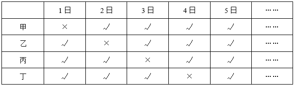
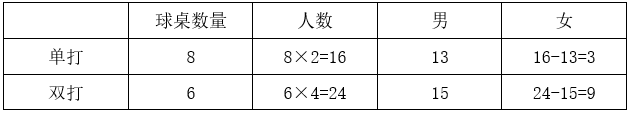
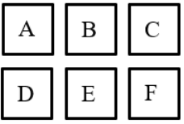
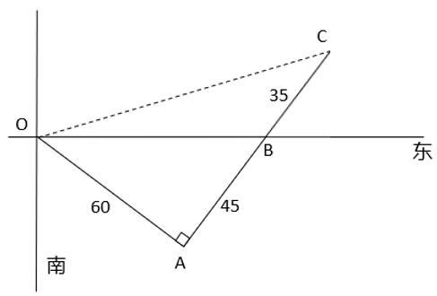
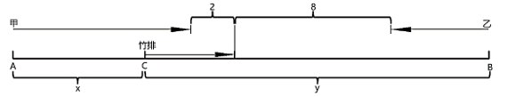
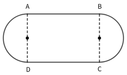
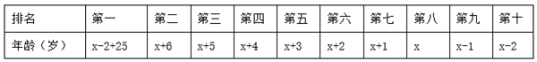
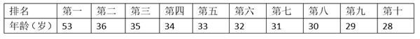
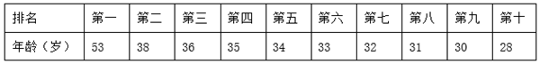
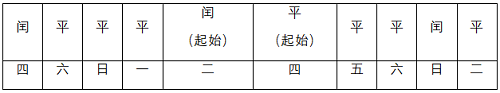

# 2026年浙江省公务员录用考试《行测》题（B类）（网友回忆版）

> 数量关系 · 20 题 · 浙江 2026

## 第 1 题　qid 18643922 · 数学运算

甲、乙两个蓄水池，水深分别为8米、5米。8：30开始，甲蓄水池中的水匀速注入到乙蓄水池。甲蓄水池水深每小时减少0.2米，乙蓄水池水深每小时增加0.3米。问什么时刻两个蓄水池中水深相同？

- **A**. 14：30　✅
- **B**. 15：00
- **C**. 15：30
- **D**. 16：00

**答案**：A

**官方解析**

设t小时后两个蓄水池中水深相同，根据题意可列式：8-0.2t=5+0.3t，解得t=6，8：30过6小时为14：30。
故正确答案为A。

---

## 第 2 题　qid 18643921 · 数学运算

现有200克浓度未知的硝酸铵溶液，加入100克浓度为30%的硝酸铵溶液，再蒸发150克水后，溶液浓度恰好为40%。问原溶液的浓度是多少？

- **A**. 15%　✅
- **B**. 20%
- **C**. 25%
- **D**. 30%

**答案**：A

**官方解析**

设原溶液的浓度为x，根据题意可列式：浓度，解得x=15%。

故正确答案为A。

---

## 第 3 题　qid 18643924 · 数学运算

甲、乙两人在同一户外徒步路线上开展训练，他们早上8点同时出发，匀速前进。甲每小时比乙多走1千米，11点甲开始休息1小时，乙继续前进，并在12点赶上甲。问此时乙走了多少千米？

- **A**. 9
- **B**. 12　✅
- **C**. 15
- **D**. 18

**答案**：B

**官方解析**

设乙每小时的速度为x千米，则甲每小时的速度为（x+1）千米。12点时，甲走了11-8=3个小时，乙走了12-8=4个小时，甲、乙两人所走路程相同，可列方程，解得x=3，则此时乙走了4×3=12千米。

故正确答案为B。

---

## 第 4 题　qid 18643926 · 数学运算

某部门规定，员工每工作4天休息1天。已知员工甲、乙、丙、丁分别在9月1日、2日、3日、4日休息，那么9月份4人同时在岗工作多少天？

- **A**. 3
- **B**. 4
- **C**. 5
- **D**. 6　✅

**答案**：D

**官方解析**

员工每工作4天休息1天，可知员工每个工作周期（工作+休息）为5天，即每5天中休息1天。

方法一：根据“甲、乙、丙、丁分别在9月1日、2日、3日、4日休息”，可知甲的休息日期除以5余1，乙的休息日期除以5余2，丙的休息日期除以5余3，丁的休息日期除以5余4。综合可知4人同时在岗工作的日期除以5的余数不能是1、2、3、4，日期必须为5的倍数，在9月（共30天）中，满足的日期有5日、10日、15日、20日、25日、30日，共6天。

方法二：如下表所示（在岗以“√”表示，休息以“×”表示）：

由上表可知，9月1-5日刚好为一个周期，一个周期内4人同时在岗日期为1天，9月共30天，即共有个周期，则9月份4人同时在岗工作6×1=6天。

故正确答案为D。

---

## 第 5 题　qid 18643925 · 数学运算

乒乓球馆有14张球桌正在进行趣味比赛，其中双打总人数是单打的1.5倍。已知参与单打的男生人数13人，参与双打的男生人数15人，那么参与单打的女生人数比参与双打的女生人数：

- **A**. 少4人
- **B**. 多4人
- **C**. 少6人　✅
- **D**. 多6人

**答案**：C

**官方解析**

方法一：设参与单打的女生有x人，参与双打的女生有y人。根据常识：双打和单打每桌分别有4人和2人参与，结合题意可列式：······①，······②，联立①②两式，解得：x=3，y=9，即参与单打的女生有3人，参与双打的女生有9人，则题目所求=3-9=-6人，即少6人。

方法二：根据“双打总人数是单打的1.5倍”，则。根据常识：双打和单打每桌分别有4人和2人参与，则。设双打球桌数量为3x，单打球桌数量为4x，则3x+4x=14，解得x=2，即双打球桌数量=6，单打球桌数量=8。可列表如下：

则题目所求=3-9=-6人，即少6人。

故正确答案为C。

---

## 第 6 题　qid 18643928 · 数学运算

6名运动员站成2行3列的方队，要求小张和小王前后相邻，小李和小吴左右相邻。问有多少种不同的站法？

- **A**. 16
- **B**. 32　✅
- **C**. 48
- **D**. 96

**答案**：B

**官方解析**

根据题意，2行3列的方队如下图所示：

先将小李和小吴内部排序，情况数为种；再将二人安排在（AB、BC、DE、EF）四组中的一组位置，使其左右相邻，情况数为种；然后将小张和小王内部排序后安排到小李、小吴选择后剩下的一整列，使二人前后相邻，情况数为种；最后将剩余的二人安排到剩下的两个位置，情况数为种。分步用乘法，共有2×4×2×2=32种不同的站法。

故正确答案为B。

---

## 第 7 题　qid 18643929 · 数学运算

小李10天共做了41道数学题，任意两天做的题数相差不超过2道。问他最多有几天做了5道题？

- **A**. 3
- **B**. 4
- **C**. 5　✅
- **D**. 6

**答案**：C

**官方解析**

根据题意，要使做5道题的天数最多，则其他天数中每天的做题量要尽可能少，又根据任意两天做的题数相差不超过2道，则其他天数中每天的做题量可以为3道、4道。设有x天做了5道题，有y天做了4道题，则有（10-x-y）天做了3道题，根据题意可列方程：5x+4y+3（10-x-y）=41，整理可得：2x=11-y，2x为偶数，11为奇数，则y为奇数，当y=1时，可使x最大，x=5，即他最多有5天做了5道题。
故正确答案为C。

---

## 第 8 题　qid 18643933 · 数学运算

某企业在甲、乙两个项目上共投资160万元，最终共收回资金200万元，已知甲项目和乙项目的收益率分别为40%和16%，那么该企业在甲项目上投资了多少万元？

- **A**. 60　✅
- **B**. 70
- **C**. 80
- **D**. 90

**答案**：A

**官方解析**

方法一：设该企业在甲项目上投资了x万元，在乙项目上投资了（160-x）万元。根据题意，可列式：，解得x=60。即该企业在甲项目上投资了60万元。

方法二：根据题意可得甲、乙两个项目总的收益率为。设该企业在甲项目上投资了x万元，在乙项目上投资了（160-x）万元。根据线段法：距离与量成反比，可列式：，解得x=60。即该企业在甲项目上投资了60万元。

故正确答案为A。

---

## 第 9 题　qid 18643932 · 数学运算

小王开网店销售花篮，网店开业前已经做下51个花篮。网店开业后，小王边做边卖，每2天做1个，每天卖出2个。问第几天网店中花篮第一次售空？

- **A**. 32
- **B**. 33
- **C**. 34　✅
- **D**. 35

**答案**：C

**官方解析**

本题考虑代入排除，问第一次售空，从最小的选项开始代入。

代入A项，第32天时，网店一共做出花篮个，一共卖出2×32=64个，67&gt;64，没有售空，排除；

代入B项，第33天时，网店一共做出花篮个，一共卖出2×33=66个，67&gt;66，没有售空，排除；

代入C项，第34天时，网店一共做出花篮个，一共卖出2×34=68个，68=68，花篮第一次售空，当选。

故正确答案为C。

---

## 第 10 题　qid 18643934 · 数学运算

小张从营地出发，骑车向东偏南方向行进60千米后，左转继续行进45千米到达营地正东方向的位置。问他保持当前方向再行进35千米，与营地之间的直线距离为多少千米？

- **A**. 80
- **B**. 90
- **C**. 100　✅
- **D**. 120

**答案**：C

**官方解析**

如图所示，小张从营地O点出发，骑车向东偏南方向行进至A点后，左转继续行进至B点，并保持当前方向再行进35千米到C点。可得，OA=60，AB=45，BC=35，则AC=AB+BC=45+35=80。为直角三角形，则小张到达C点后，他与营地之间的直线距离OC。

故正确答案为C。

---

## 第 11 题　qid 18643930 · 数学运算

甲、乙、丙三个车间同时分别加工120个零件。2小时后，甲车间还剩48个未加工，乙车间还剩12个未加工，丙车间已加工完20分钟。现有270个零件的新任务需要分配给三个车间，要求加工同时开始同时结束，那么丙车间比甲车间多分配多少个零件？

- **A**. 30
- **B**. 60　✅
- **C**. 90
- **D**. 120

**答案**：B

**官方解析**

根据题意，甲车间每小时加工的零件数量为个，乙车间每小时加工的零件数量为个，丙车间加工完120个零件需要小时，则丙车间每小时加工的零件数量为个。

方法1：三个车间共加工270个零件且同时开始同时结束，需用时小时，则丙车间比甲车间多分配个零件。

方法2：甲、乙、丙车间每小时加工零件数量之比为36：54：72=2：3：4，由于三个车间共加工270个零件且同时开始同时结束，即工作时间相同，可得三个车间各自加工零件总数之比=每小时加工零件数量之比=2：3：4，故丙车间比甲车间多分配个零件。

故正确答案为B。

---

## 第 12 题　qid 18643938 · 数学运算

甲、乙两船在静水中的速度相同，现甲从上游A点、乙从下游B点同时出发匀速相向而行，且同时在A、B之间的C点放下一个竹排顺水流漂行。一段时间后甲、乙与竹排的距离分别为2千米和8千米，且均未与竹排相遇。已知AC距离x千米，BC距离y千米，那么x和y的数量关系为：

- **A**. x-y=3
- **B**. x-y=6
- **C**. y-x=3
- **D**. y-x=6　✅

**答案**：D

**官方解析**

如图所示，设甲、乙两船的静水速度为，竹排顺水漂行的速度为，甲、乙、竹排行进时间为t，则甲船的顺流速度为（），乙船的逆流速度为（）。根据甲和竹排行进过程，可得，整理可得······①；根据公式：，乙与竹排的行进过程，可得，整理可得······②。联立①②两式，可得x-2=y-8，即y-x=6。

故正确答案为D。

---

## 第 13 题　qid 18643935 · 数学运算

某快餐店1份盒饭售价40元，1杯奶茶售价10元。如果2份盒饭和1杯奶茶配套出售，打九折，可获利20元；如果4份盒饭和3杯奶茶配套出售，打八折，可获利24元。那么按原价出售，1份盒饭比1杯奶茶多获利多少元？

- **A**. 7
- **B**. 7.5
- **C**. 8
- **D**. 8.5　✅

**答案**：D

**官方解析**

设1份盒饭成本为x元，1份奶茶成本为y元。根据题意，可列式：（2×40+10）×0.9-（2x+y）=20，整理可得：2x+y=61······①；（4×40+3×10）×0.8-（4x+3y）=24，整理可得：4x+3y=128······②，联立①②，解得x=27.5，y=6。则按原价出售，1份盒饭比1杯奶茶多获利40-27.5-（10-6）=8.5元。
故正确答案为D。

---

## 第 14 题　qid 18643940 · 数学运算

如下图所示，某操场形状由两个半圆形和一个矩形组成。已知两个半圆形的面积之和是矩形面积的倍，矩形的周长为500米，那么操场外轮廓的长度为多少米？

- **A**. 

- **B**. 

　✅
- **C**. 

- **D**. 

**答案**：B

**官方解析**

设两个半圆形的半径均为r米，则两个半圆形的面积之和为一个圆形的面积，即为平方米。AD=2r米，则米。根据题意，可列式：，解得r=50米，故两个半圆形的半径均为50米，AB=250-2r=150米，即操场外轮廓的长度为2个半圆对应的弧长之和+AB+DC=1个圆的周长+2AB米。

故正确答案为B。

---

## 第 15 题　qid 18643936 · 数学运算

某旅行团有10位游客，平均年龄为35岁，且年龄各不相同。已知他们当中最大者比最小者大25岁，那么年龄最小的3人年龄之和最大可能为多少岁？

- **A**. 87
- **B**. 88
- **C**. 89　✅
- **D**. 90

**答案**：C

**官方解析**

将年龄从大到小排名第八的人设为x岁，要想年龄最小的3人年龄之和最大，则第九名、第十名尽量大，第二名至第七名尽量小，且年龄各不相同，根据题意，可构造数列如下：

则x-2+25+x+6+x+5+x+4+x+3+x+2+x+1+x+x-1+x-2=10×35，整理可得，10x+41=350，解得：x=30.9，将x向下取整为30，并代入原数列可得：

此时10人年龄之和为10x+41=10×30+41=341岁，距离10人总年龄350岁还差9岁。若将第十名增加1岁，则第一名需增加1岁，第九至第二名每人至少需增加1岁，此时至少要比341岁多10岁，年龄之和超过350岁，不符合要求。若第九名增加1岁，则第八至第三名可均增加1岁，第二名增加2岁，此时刚好增加9岁，十人年龄之和为341+9=350岁，符合要求。构造的数列如下：

则年龄最小的3人年龄之和最大可能为31+30+28=89岁。

故正确答案为C。

---

## 第 16 题　qid 18643943 · 数学运算

某公司从3个部门共选派8人参加会议。已知甲部门人数是乙、丙部门人数之和的一半，乙部门人数占甲、乙、丙部门总人数的20%，丙部门比甲部门多2人。如果每个部门至少选派2人，至多选派3人，那么选派出的8人有多少种不同组合？

- **A**. 560
- **B**. 780
- **C**. 920
- **D**. 1610　✅

**答案**：D

**官方解析**

根据题意，设甲部门有x人，乙部门有y人，则丙部门有（x+2）人。可列式：，化简为：x-y=2······①；y=20%（x+y+x+2），化简为：2y-x=1······②，联立①②解得：x=5，y=3。即甲部门有5人，乙部门有3人，丙部门有5+2=7人。

若满足“每个部门至少选派2人，至多选派3人”，选派8人分情况讨论如下：

（1）甲部门选派2人，乙、丙部门各选派3人：有种情况；

（2）乙部门选派2人，甲、丙部门各选派3人：有种情况；

（3）丙部门选派2人，甲、乙部门各选派3人：有种情况。分类用加法，则共有350+1050+210=1610种情况。

故正确答案为D。

---

## 第 17 题　qid 18643937 · 数学运算

小张计划在假期剩余的13天完成A、B、C三本书的阅读。已知阅读A书需要连续2天，阅读B书需要连续3天，阅读C书需要连续4天。问在所有可能的阅读方案中随机选择一种，没有阅读的4天都不相连的概率是多少？

- **A**. 

- **B**. 

- **C**. 

- **D**. 

　✅

**答案**：D

**官方解析**

根据题意，每本书的阅读时间需要连续，可将一本书看作一个整体，且不同书籍存在阅读顺序，则阅读三本书的情况数为种。此时将三本书看作3个主体，加上没有阅读的4天，即为7个主体中任选4天不阅读，情况数为种，故所有可能的阅读方案有6×35种。

没有阅读的4天都不相连，采用插空法。3本书4个空，刚好安排4天，只有1种情况，且三本书的阅读情况不变，则满足条件的情况数为6×1种。

根据公式：概率，则题干所求为。

故正确答案为D。

---

## 第 18 题　qid 18643939 · 数学运算

从1，2，3，4，5，6，7，8，9，10十个数中随机选择两个数，它们的最大公约数为1的概率是多少？

- **A**. 

- **B**. 

　✅
- **C**. 

- **D**. 

**答案**：B

**官方解析**

根据题意，总情况为从十个数中随机选择两个数，共有种情况。满足条件的情况为两个数的最大公约数为1，即两个数互质，正面考虑情况数较多，故从反面思考。反面情况为两个数存在大于1的公约数，分情况讨论如下：

（1）2个数均为2的倍数，即从2、4、6、8、10中任选2个数，有种情况；

（2）2个数均为3的倍数，即从3、6、9中任选2个数，有种情况；

（3）2个数均为5的倍数，即从5、10中任选2个数，有1种情况。

分类用加法，反面情况共有10+3+1=14种情况。故题干所求概率=1-反面情况概率。

故正确答案为B。

---

## 第 19 题　qid 18643942 · 数学运算

小赵制作一件手工作品，需要将一个长方体纸盒的每条棱和每个面的对角线用细木条加以固定。制作完成后，他发现仅用了3种不同长度的细木条，且最短的细木条长度为1分米。问该纸盒的体积为多少立方分米？

- **A**. 

　✅
- **B**. 
2

- **C**. 

- **D**. 

**答案**：A

**官方解析**

设长方形纸盒的长、宽、高的长度分别为a分米、b分米、c分米，则每个面对角线的长度为分米、分米、分米，共6种长度。由于小赵制作过程中仅用了3种不同长度，则长、宽、高中需有两边长度相同。根据“最短的细木条长度为1分米”，假设b=c=1分米，此时所需的长度分别为a分米、1分米、分米、分米，共4种长度。令a边长度=短边对角线长度，可满足仅有3种不同的长度，此时长、宽、高长度分别为、1、1，长方形的体积立方分米。

故正确答案为A。

---

## 第 20 题　qid 18643941 · 数学运算

根据节假日放假规定，当且仅当元旦在周三时，不会形成小长假。问在连续的10年中，这种情况最少会出现多少次？

- **A**. 0　✅
- **B**. 1
- **C**. 2
- **D**. 3

**答案**：A

**官方解析**

若当年为平年，则下一年元旦在当年元旦星期数基础上加1，若当年为闰年，则下一年元旦在当年元旦星期数基础上加2。若让元旦为周三出现次数最少，可利用闰年星期数加2，跳过周三，前、后相邻两年元旦星期数分别为周二和周四作为起始，推出前、后年份星期数，如下表：

可知连续的10年中元旦在周三的次数最少为0次。

故正确答案为A。

---
