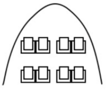
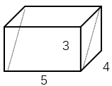
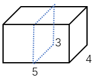
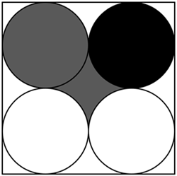
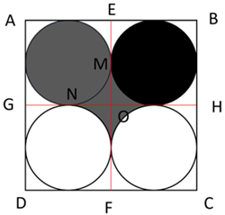
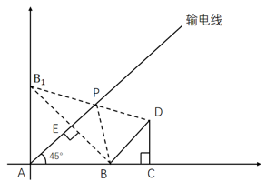

# 2026年贵州省公务员录用考试《行测》题（网友回忆版）

> 数量关系 · 13 题 · 贵州 2026

## 第 1 题　qid 16069941 · 数学运算

某市低空经济示范区要为8个无人机起降点设计航线网络。若任意两个起降点之间最多1条航线，且每个起降点至少连接3条航线，问最少需要设计多少条航线？

- **A**. 12　✅
- **B**. 22
- **C**. 28
- **D**. 56

**答案**：A

**官方解析**

把题干中提到的8个无人机起降点理解为平面几何图形的8个顶点，航线为点与点之间的连线，即为该几何图形的边。题目要求“每个起降点至少连接3条航线，且要使航线数最少”，可以判断出每个起降点只需连接三条航线可使总航线数最少，即构成的图形中每个顶点的度数为3（一个顶点的度数指的是与该顶点相连的边的数量）。由此这个题目可以理解为：有8个顶点的平面几何图形（无重复边），每个顶点的度数为3，求图形的边数。这类题型可以根据“握手定理”解决：所有顶点度数之和=边数×2。该题目共8个顶点，每个顶点的度数为3，8个顶点度数之和=8×3=24，根据“握手定理”的公式可以求得：边数，因此该图形最少的边数为12条，即最少需要设计12条航线。

故正确答案为A。

备注：关于“握手定理”的理解，可以把每个顶点都想象成一个参加会议的人，他们之间相互握手，每一次握手构成一条“边”，每个人握手的次数就是顶点的度数。每一次握手都会涉及两个人，所以一次握手事件会分别被双方记录一次，次数计入到自己的握手次数中，算成自己的度数。所以可得：总握手次数（总度数）=2×握手事件发生的次数（边的数量）。

---

## 第 2 题　qid 16070060 · 数学运算

某AI训练任务需完成X亿次浮点运算。若使用云服务器单独计算，A型需12小时，B型需15小时。实际先由A型工作3小时后，加入B型共同工作。但因任务负载变化，共同工作时效率均下降20%。问完成全部任务需多少小时？

- **A**. 6.25
- **B**. 7.5
- **C**. 9.25　✅
- **D**. 10.5

**答案**：C

**官方解析**

赋值工作总量为60，则A型云服务器的效率为，B型云服务器的效率为。根据“共同工作时效率均下降20%”，可知效率下降后A型的效率变为5×（1-20%）=4，B型的效率变为4×（1-20%）=3.2。设B型云服务器加入后又工作了x小时，根据题意可列式：，解得x=6.25。故完成全部任务需6.25+3=9.25小时。

故正确答案为C。

---

## 第 3 题　qid 16070133 · 数学运算

某光伏电站使用正方形太阳能板构成一正方形阵列，总面积为576平方米。若将板间距再扩大1米，总阵列面积变为784平方米。则正方形太阳能板的边长可能是：

- **A**. 4.6米　✅
- **B**. 5.1米
- **C**. 5.6米
- **D**. 6.1米

**答案**：A

**官方解析**

设正方形阵列每边有N块太阳能板，则每边中间有（N-1）个间隔，设每段间隔长y米，每块太阳能板边长为x米。根据正方形面积等于边长的平方，，，可知正方形阵列的边长增加了28-24=4米。正方形阵列的边长扩大是由于板间距扩大，可得：，解得N=5。根据题意，原正方形阵列边长=太阳能板总长+间隔总长，即24=5x+4y，由于间隔长，则，即米，只有A项满足。

故正确答案为A。

---

## 第 4 题　qid 17467574 · 数学运算

某科技企业用a台智能机器人组装产品，原定20天完成。工作5天后，企业又增加了效率翻倍的b台新型机器人，最终提前4天完成。则a：b的范围是：

- **A**. 不足3
- **B**. 3~5
- **C**. 5~7　✅
- **D**. 超过7

**答案**：C

**官方解析**

赋值每台智能机器人工作效率为1，则每台新型机器人工作效率为1×2=2。根据题意可列式：1×a×20=1×a×5+（1×a+2×b）×（20-5-4），整理得4a=22b，则，在C项范围内。

故正确答案为C。

---

## 第 5 题　qid 16070122 · 数学运算

一架无人机配送货物到5千米外的站点，无人机载重时速30千米/小时、空载时速45千米/小时。每次装卸时间合计5分钟，且最多载货3件。则连续配送60件货物到站点的最短时间在以下哪个范围？（单位：分钟）

- **A**. 不到420
- **B**. 420~430　✅
- **C**. 430~440
- **D**. 超过440

**答案**：B

**官方解析**

每次最多载货3件，配送60件货物，至少需次。载货运送单程需要小时分钟=10分钟，空载返回单程需要小时分钟分钟，每次装卸时间合计5分钟。题干所求为配送货物到站点的最短时间，则最后一次配送后不需要返回，用时总计为分钟，在B项范围内。

故正确答案为B。

---

## 第 6 题　qid 15833653 · 数学运算

一架飞机有如下图所示的8个公务舱座位，本次航程共售出5张公务舱机票（包括一对夫妻）。如每名公务舱旅客都随机选座，且夫妻选择坐在相邻的2个座位上（夫妻先选座且隔过道不算相邻），则只有1人坐在第2排的概率为：

- **A**. 

　✅
- **B**. 

- **C**. 

- **D**. 

**答案**：A

**官方解析**

根据题意，共售出5张公务舱机票，且夫妻选择坐在相邻的2个座位，则可从两排座位中选取最左边或最右边的两个座位给这对夫妻，有种情况，夫妻两人入座时有种情况，剩余3人安排在其余座位，有种情况。分步用乘法，则总情况数有种。

根据题意，若只有1人坐在第2排，则有4人坐在第1排。夫妻只能坐在第1排，从第1排选取最左边或最右边的两个座位给这对夫妻，有种情况，夫妻两人入座时有种情况，从第2排选一个座位，有种情况，剩余3人安排在第1排剩余2个座位与第2排选出的座位上，有种情况。分步用乘法，则满足条件的情况数有种。

根据公式：概率，则题干所求为。

故正确答案为A。

---

## 第 7 题　qid 16070151 · 数学运算

一个长方体金属块的长、宽、高之比为5：4：3，现要用一个平面将这个金属块切为2个完全相同的部分，截面可能的最大面积是最小面积的：

- **A**. 不到1.6倍
- **B**. 1.6～1.8倍
- **C**. 1.8～2倍
- **D**. 2倍以上　✅

**答案**：D

**官方解析**

赋值长方体金属块的长、宽、高分别为5、4、3。要把长方体切为两个完全相同的部分，切面必经过长方体中心。切面尽量大时，应该为沿长方体的长边切割的斜面，如下图所示，切面面积为；

切面尽量小时，应该为垂直于长方体最小面进行切割，如下图所示，切面面积为3×4=12。

综上，截面最大面积是最小面积的倍。

故正确答案为D。

---

## 第 8 题　qid 16069786 · 数学运算

甲和乙从全长n米的环形跑道上某一点同时匀速出发，如两人同向跑步，则甲第一次追上乙的用时是两人反向跑步第一次相遇用时的8倍。如两人反向跑步，那么第一次相遇时乙跑了多少米？

- **A**. 

- **B**. 

- **C**. 

- **D**. 

　✅

**答案**：D

**官方解析**

根据题意，设两人反向跑步第一次相遇时所用时间为t，甲的速度为，乙的速度为，根据环形相遇公式，可得······①；则两人同向追及时间为8t，根据环形追及公式，······②；将①-②可得，故两人反向跑步，第一次相遇时乙跑了米。

故正确答案为D。

---

## 第 9 题　qid 16069808 · 数学运算

某企业每周从下属8个门店中随机选择6个进行巡查。问下周巡查的门店正好有5个与本周相同的概率为：

- **A**. 

- **B**. 

- **C**. 

　✅
- **D**. 

**答案**：C

**官方解析**

根据题意，下周巡查门店的情况为从8个门店中随机选择6个进行巡查，总情况数种；满足条件的情况为“下周巡查的门店正好有5个与本周相同”，先从本周巡查的6个门店中选择5个与下周相同，情况数为种；再从本周没选的2个门店里选1个，情况数为种，则满足条件的情况数=6×2=12种。根据公式：概率，则题干所求概率。

故正确答案为C。

---

## 第 10 题　qid 16069892 · 数学运算

某容器下部分是一个圆柱，上部分是一个圆台，圆台底面刚好与圆柱重合。已知圆台上面半径的2倍等于圆台底面半径，圆台的高和圆柱相等。现匀速向容器内注水，3秒装满了圆柱部分的一半，那么还需要多长时间才能装满整个容器（容器壁厚忽略不计）？

- **A**. 6秒
- **B**. 6.5秒　✅
- **C**. 7秒
- **D**. 7.5秒

**答案**：B

**官方解析**

设圆台上面半径为r，高为h，则圆台下面半径与圆柱半径均为2r，圆柱的高度为h。

方法一：下方圆柱体积为，将上方圆台母线延长相交于一点（如图所示），所求圆台体积可看做一个大圆锥体积与上方小圆锥体积之差。大圆锥底面为圆台下底面，半径为2r；小圆锥底面为圆台上底面，半径为r，大圆锥与小圆锥相似，底面半径之比为2r：r=2：1，即相似比为2：1，大圆锥与小圆锥高度之比也为2：1，圆台高为h，则大圆锥高为2h，小圆锥高为h。故小圆锥体积，大圆锥体积，圆台体积=大圆锥体积-小圆锥体积。该容器总体积。目前容器内注水体积为下方圆柱部分的一半，即注水体积，注水时间为3秒，注水速度不变，则注水体积与注水时间成正比，设还需注水时间为t秒，则，解得t=6.5秒。

方法二：下方圆柱体积为，上方圆台体积，该容器总体积。目前容器内注水体积为下方圆柱部分的一半，即注水体积，注水时间为3秒，注水速度不变，则注水体积与注水时间成正比，设还需注水时间为t秒，则，解得t=6.5秒。

故正确答案为B。

粉笔备注：圆台体积公式

R—圆台底面半径

r—圆台顶面半径

h—圆台高度

---

## 第 11 题　qid 16069798 · 数学运算

某农学院在一块正方形试验田中划出4块尽可能大、且彼此相切的等大圆形土地，并计划在灰色、黑色区域分别种植小麦和玉米（如下图所示）。问小麦和玉米的种植面积之比为：

- **A**. 

　✅
- **B**. 
2：1

- **C**. 

- **D**. 

**答案**：A

**官方解析**

赋值每个圆的半径为1，则正方形边长为4。过AB、AD中点分别作平行于边长的直线EF、GH，相交于O点。因为4个圆大小相等，则把中间灰色区域分成4个面积大小相等的部分MON，那么小麦的种植面积=一个圆的面积+4个MON的面积=正方形AEOG的面积。根据圆的面积公式：，可得玉米的种植面积为。则小麦和玉米的种植面积之比为。

故正确答案为A。

---

## 第 12 题　qid 16069802 · 数学运算

一条输电线沿着A地的东北方向（）布设，B地、C地均在A地正东方向，距离A地分别为4公里、6公里，D地在C地正北方向2公里处。现从输电线的某处P点分别搭建两条电缆至B、D两地，则这两条电缆长度之和最小为多少公里？

- **A**. 

- **B**. 

- **C**. 

- **D**. 

　✅

**答案**：D

**官方解析**

根据几何最短路径问题的结论，选择点B作输电线的镜像对称点，连接点和点D，并与输电线交于点P。则点P为搭建两条电缆长度之和最小的位置。

根据题意可得：，且，则为等腰直角三角形。因为AB=4公里，故。因此。又因为BC=CD=2公里，且，则为等腰直角三角形。故公里。且，则，根据勾股定理公里。

故正确答案为D。

---

## 第 13 题　qid 16069866 · 数学运算

某电脑设有6位开机密码，且每一位密码都是字母a、b、c、d中的一个。若密码必须包含a、b字母至少各1个，且首尾字母相同，问符合要求的密码有多少种？

- **A**. 320
- **B**. 450
- **C**. 570　✅
- **D**. 960

**答案**：C

**官方解析**

根据题意，出现至少······，正面考虑较为复杂，可以从反面考虑。

即：正面情况数=总情况数-反面情况数。

总情况数即首尾字母相同，中间位置字母任选：

第一步：确定首尾字母，有a、b、c、d共种选择；

第二步：确定中间4个位置，每个位置都可从4个字母中任选，共种选择；

总情况数=4×256=1024种情况。

反面情况数可分类讨论：

根据两集合容斥原理，反面情况数=不含a的情况数+不含b的情况数-既不含a也不含b的情况数（重复计算部分）

①不含a的情况：即所有位置只有b、c、d共3个字母可供选择。

第一步：确定首尾字母，有b、c、d共种选择；

第二步：确定中间4个位置，每个位置都可从3个字母中任选，共种选择；

不含a的情况数=3×81=243种情况；

②不含b的情况：即所有位置只有a、c、d共3个字母可供选择。

第一步：确定首尾字母，有a、c、d共种选择；

第二步：确定中间4个位置，每个位置都可从3个字母中任选，共种选择；

不含b的情况数=3×81=243种情况；

③既不含a也不含b的情况：即所有位置只有c、d共2个字母可供选择。

第一步：确定首尾字母，有c、d共种选择；

第二步：确定中间4个位置，每个位置都可从2个字母中任选，共种选择；

既不含a也不含b的情况数=2×16=32种情况；

所以，反面情况数=243+243−32=454种。

因此，正面情况数=总情况数-反面情况数=1024−454=570种。

故正确答案为C。

---
