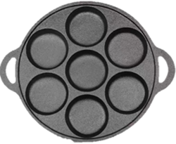

# 2026年重庆市公务员录用考试《行测》题（网友回忆版）

> 数量关系 · 15 题 · 重庆 2026

## 第 1 题　qid 16070159 · 数学运算

运动心率即人体在运动时保持的心率状态，保持最佳的运动心率对于运动安全及运动效果来说都十分重要。一般来说，正常人最佳运动心率的范围是：最大运动心率=（220-年龄）×0.8次/分；最小运动心率=（220-年龄）×0.6次/分。那么正常人40岁时，最佳运动心率的范围为：

- **A**. 108~132次/分
- **B**. 132~144次/分
- **C**. 108~144次/分　✅
- **D**. 144~176次/分

**答案**：C

**官方解析**

根据题干给出的公式，当正常人40岁时，最大运动心率=（220-40）×0.8=144次/分；最小运动心率=（220-40）×0.6=108次/分。故正常人40岁时，最佳运动心率的范围为：108~144次/分。
故正确答案为C。

---

## 第 2 题　qid 16070268 · 数学运算

一家三口去旅游，拍摄单人照、合照一共68张。合照的数量比单人照的两倍少一张；合照中，全家福占了三分之二，且孩子出现的次数为爸爸妈妈出现次数之和的一半；孩子的单人照比爸爸、妈妈单人照数量之和多1张。那么孩子出现的照片一共有：

- **A**. 52张　✅
- **B**. 48张
- **C**. 45张
- **D**. 37张

**答案**：A

**官方解析**

根据“单人照、合照一共68张。合照的数量比单人照的两倍少一张”，可得单人照为张，合照为68−23=45张。因为“孩子的单人照比爸爸、妈妈单人照数量之和多1张”，则孩子单人照为张，爸爸、妈妈单人照为23−12=11张。由于“合照中，全家福占了三分之二”，则全家福数量为张，两人合照数量为45−30=15张。

设有孩子的两人合照为x张，则没有孩子的两人合照为(15−x)张。根据 “合照中孩子出现的次数为爸爸妈妈出现次数之和的一半”，可得方程，解得x=10。所以孩子出现的照片一共有12+30+10=52张。

故正确答案为A。

---

## 第 3 题　qid 16070160 · 数学运算

木星冲日，即木星、地球和太阳三者处于一条直线上，且地球位于太阳和木星之间。已知2024年12月8日发生了木星冲日，若木星绕太阳公转的周期约为12个地球年，则下一次木星冲日发生于下列哪个时间段？

- **A**. 2025年7月~9月
- **B**. 2026年1月~3月　✅
- **C**. 2026年4月~6月
- **D**. 2026年7月~9月

**答案**：B

**官方解析**

已知地球绕太阳公转的周期为1个地球年，相当于钟表的分针（短且快）；木星绕太阳公转的周期约为12个地球年，相当于钟表的时针（长且慢）。“木星冲日，即木星、地球和太阳三者处于一条直线上，且地球位于太阳和木星之间”，相当于分针和时针重合。两针角速度差为圈/年，则重合周期为年1年零33天。已知2024年12月8日发生了木星冲日，则下一次约为2026年1月10日，在B项范围内。

故正确答案为B。

---

## 第 4 题　qid 16070169 · 数学运算

为了节约资源，保护环境，某企业需要购买A、B两种型号的污水处理设备共8台。A型设备月污水处理能力为240吨，价格为每台12万元，B型设备月污水处理能力为160吨，价格为每台10万元，企业最多支出90万元购买设备，且要求月污水处理能力不低于1600吨。那么A型污水处理设备最多可购买：

- **A**. 3台
- **B**. 4台
- **C**. 5台　✅
- **D**. 6台

**答案**：C

**官方解析**

方法一：根据题意可得A、B两种型号的设备每万元月污水处理能力分别为吨、吨，相同支出情况下A型设备污水处理能力更强，但A型设备价格较高，结合题目问A型污水处理设备最多可购买多少，可从最大选项开始代入验证：

代入D项，A型设备6台，则B型设备8-6=2台，总费用=6×12+2×10=72+20=92万元，超过90万预算，排除；

代入C项，A型设备5台，则B型设备8-5=3台，总费用=5×12+3×10=60+30=90万元，刚好符合预算，总处理能力，符合能力要求。

故正确答案为C。

方法二：设购买A型设备x台，则B型设备(8-x)台。根据企业最多支出90万元可得，根据要求月污水处理能力不低于1600吨可得，解得，因此A型设备最多可购买5台。

故正确答案为C。

---

## 第 5 题　qid 16070163 · 数学运算

随着新型清洁能源、现代生态农牧的发展，昔日戈壁荒滩不仅成为光伏“蓝海”，还变成了养殖数万只“光伏羊”的繁茂草原。牧民甲、乙家中都有若干只“光伏羊”，乙若给甲20只羊，甲的羊数将是乙的K倍；甲若给乙K只羊，乙的羊数将是甲的一半；若K为正整数，那么K的值可能有多少个？

- **A**. 5
- **B**. 6
- **C**. 7
- **D**. 8　✅

**答案**：D

**官方解析**

设牧民甲、乙家中的光伏羊分别有x只、y只。根据题意可列方程组：，将①式x=k（y-20）-20代入②式可得：k（y-20）-20-k=2（y+k），整理可得，变形后可得，根据题意y为正整数，且k为正整数，则k-2为66的约数。对66进行因式分解：66=1×66=2×33=3×22=6×11，因此66的约数共8个，k-2共8种情况：

当k-2=1时，k=3，y=89只，x=187只；

当k-2=2时，k=4，y=56只，x=124只；

当k-2=3时，k=5，y=45只，x=105只；

当k-2=6时，k=8，y=34只，x=92只；

当k-2=11时，k=13，y=29只，x=97只；

当k-2=22时，k=24，y=26只，x=124只；

当k-2=33时，k=35，y=25只，x=155只；

当k-2=66时，k=68，y=24只，x=252只。

则k值共有8种可能。

故正确答案为D。

---

## 第 6 题　qid 16070165 · 数学运算

城区某中学安排2位数学老师、4位英语老师到A、B两所乡村中学任教，要求两所乡村中学各安排3位老师，其中A中学至少需要安排1位数学老师。那么有多少种不同的安排方式？

- **A**. 9
- **B**. 12
- **C**. 16　✅
- **D**. 20

**答案**：C

**官方解析**

方法一：根据题意，A中学可以安排1位数学老师或2位数学老师，分类讨论如下：

（1）A中学安排1位数学老师、2位英语老师，其余老师安排给B中学，有种安排方式；

（2）A中学安排2位数学老师、1位英语老师，其余老师安排给B中学，有种安排方式。

分类用加法，则A中学至少需要安排1位数学老师的方式有12+4=16种。

方法二：可考虑逆向思维。总情况为从6位老师中选3位去A中学，有种安排方式。要求A中学至少需要安排1位数学老师，反面为安排到A中学的3位老师全是英语老师，有种安排方式。因此，共有20-4=16种安排方式。

故正确答案为C。

---

## 第 7 题　qid 16070162 · 数学运算

某数字展馆沿入口两侧各设有3个展位。现需安排数字产品展位和人工智能展位各3个，且数字产品展位不能都安排在同一侧，那么共有多少种安排方式？

- **A**. 244
- **B**. 648　✅
- **C**. 684
- **D**. 720

**答案**：B

**官方解析**

方法一：根据题意，要求数字产品的3个展位不能都安排在同一侧，分类讨论如下：

（1）左侧有1个数字产品展位和2个人工智能展位，其余展位在右侧，有种安排方式；

（2）左侧有2个数字产品展位和1个人工智能展位，其余展位在右侧，有种安排方式。

综上，共有324+324=648种安排方式。

方法二：可考虑逆向思维。总情况为将6个展位任意放置在左右两侧的6个位置，有种安排方式。要求数字产品的3个展位不能都安排在同一侧，反面为数字产品的3个展位均放在同一侧。从左、右两侧选择其中一侧，放入数字产品的3个展位，另一侧放入人工智能的3个展位，有种安排方式。因此，共有720-72=648种安排方式。

故正确答案为B。

---

## 第 8 题　qid 16070168 · 数学运算

体操世锦赛男团预赛一共有单杠、双杠、自由体操、鞍马、吊环、跳马六个项目，每个国家的比赛项目顺序由抽签决定。那么某个国家第一个比赛项目不是单杠，且自由体操不在双杠之后的概率是多少?

- **A**. 

　✅
- **B**. 

- **C**. 

- **D**. 

**答案**：A

**官方解析**

根据题意，第一个比赛项目是六个项目中的任意一项的概率均为，则第一个比赛项目不是单杠的概率为；自由体操要么在双杠之前，要么在双杠之后，要求自由体操不在双杠之后，则自由体操在双杠之前，概率为。分步用乘法，则所求概率。

故正确答案为A。

---

## 第 9 题　qid 16070171 · 数学运算

小刚新做了一个鞋柜，鞋柜的纵截面如左下图所示。鞋柜水平深度28.8厘米，隔板与水平面夹角为，这个格子刚好放得下一个15厘米高的鞋盒，则这双鞋的鞋码最大是：（参考数据：，，）

- **A**. 40
- **B**. 41　✅
- **C**. 42
- **D**. 43

**答案**：B

**官方解析**

如下图所示，已知，，，所以，。

在直角中，，所以；

在直角中，，所以；

所以，BC=CE-BE=30-4.35=25.65cm=256.5mm，对应题中表格可知，最大可放41码的鞋。

故正确答案为B。

---

## 第 10 题　qid 16070290 · 数学运算

某林场计划扩大荒原造林面积。下图中区域的荒原造林工作已由两人花费一天的时间完成。若将的AB边延长一倍到点D，BC边延长两倍到点E，CA边延长三倍到点F。假设每人的工作效率一致，则至少需要增加几人才能在接下来的5天内完成剩余区域的荒原造林工作？

- **A**. 3
- **B**. 5　✅
- **C**. 6
- **D**. 12

**答案**：B

**官方解析**

作辅助线连接DC、EA、BF，从点C向BA作垂线与AB交于点G。根据题意可知，DB=BA，CE=2BC，AF=3AC。设为S。将以DB为底，以CG为高；以BA为底，以CG为高，则与等底等高，故。同理，。同理，以CE为底，以BC为底，则与底之比为2:1，高相等，故。同理，。同理，以AF为底，以AC为底，与的底之比为3:1，高相等，故。同理。由于，故。则除了外的剩余区域面积为。由于每人工作效率一致，将每人工作效率赋值为1。根据两人花费一天的时间完成区域的面积S，则有2×1×1=S，即S=2。设需要增加n人在接下来的5天完成剩余区域面积17S，则有（2+n）×1×5=17S，结合S=2，解得n=4.8人，求最小，n向上取整为5，即至少增加5人可满足题干要求。

故正确答案为B。

---

## 第 11 题　qid 16070196 · 数学运算

某风力发电机的三片风叶之间两两所成的角度为，当其中一片风叶OB与塔杆叠合时，一位身高1.8米的技术人员站在另一片风叶OA端头的正下方，测得塔杆顶部仰角为（如左下图所示）；若该技术人员站在离塔杆60米处，则测得塔杆顶部仰角为（如右下图所示）。那么风叶转动时叶片顶端最高离地面：

- **A**. 81.8米
- **B**. 89.8米
- **C**. 95.8米
- **D**. 101.8米　✅

**答案**：D

**官方解析**

根据题意，在风叶转动过程中，叶片垂直地面达到最高点时顶端距地面最远，如图所示，最大距离=OA+OD+1.8米。

根据题干右图所示，且，可得为等腰直角三角形，技术人员离塔杆60米，可得OE=EP=60米；根据题干左图所示，且，根据勾股定理可得，直角三边之比为，则米；根据题意，相邻风叶夹角均为，则且，人在A点正下方，则，，同理可得直角三边之比为，则米。

综上，题干所求=OA+OD+1.8米=40米+60米+1.8米=101.8米。

故正确答案为D。

---

## 第 12 题　qid 16070167 · 数学运算

某冷链物流公司每天至少要运送160吨海鲜从甲港口到乙市场，公司有8辆A型冷链运输车和4辆B型冷链运输车，且只有10名驾驶员。A型车每天每辆可运输24吨，运费350元；B型车每天每辆可运输20吨，运费450元。那么公司每天的运费最少为：

- **A**. 2450元　✅
- **B**. 2550元
- **C**. 2650元
- **D**. 2900元

**答案**：A

**官方解析**

求每天的运费最少，优先考虑使用费用低的车型。根据题意可知，A型车的运费（350元）更低，则尽量多用A型车。要满足每天至少运送160吨，，车辆为整数，向上取整为7辆，即7辆A型车可满足运送要求，且运费最少，运费为7×350=2450元。

故正确答案为A。

---

## 第 13 题　qid 16070173 · 数学运算

某县拟对某段运河开展河道治理。甲公司治理1米需要用时1.5天，投入5万元；乙公司治理1米需要用时2天，投入4万元。甲、乙两公司不能同时作业，若要求在365天内完成不少于200米的治理工作，则至少需要治理费用：

- **A**. 832万元
- **B**. 845万元
- **C**. 860万元
- **D**. 870万元　✅

**答案**：D

**官方解析**

根据题意要求总费用最少，则需治理总量尽量少，即完成200米的治理工作即可。又因甲公司治理费用为5万元/米，乙公司为4万元/米，要使总治理费用最低，则需乙公司治理距离尽量长。设乙公司治理x米，则甲公司治理（200-x）米，根据治理天数在365天内，可列式：，解得，x最大为130。则总治理费用最低为5×（200-130）+4×130=870万元。

故正确答案为D。

---

## 第 14 题　qid 16070176 · 数学运算

为庆祝春节，某村计划在村口的两根圆柱体石柱上缠绕灯带。每根石柱需绕上3圈灯带，起始点为A，终点为B，如下图所示。若每根石柱高为5米，横截面圆的周长为4米，那么两根石柱所需的灯带总长度最短为多少米？

- **A**. 13
- **B**. 25
- **C**. 26　✅
- **D**. 50

**答案**：C

**官方解析**

根据题干要求“两根石柱所需的灯带总长度最短”，即求A点到B点的长度最短，已知每根石柱高为5米，横截面圆的周长为4米，将石柱侧面展开成平面图形（如下图所示），则所求AB长度最短即图中直角三角形的斜边。根据直角三角形勾股定理：，则，故两根石柱所需灯带总长度最短为13×2=26米。

故正确答案为C。

---

## 第 15 题　qid 16070181 · 数学运算

某款蛋堡锅的锅盘为直径24厘米的圆，其中排布着7个全等的深度均为2厘米的圆柱状凹槽，锅盘的金属用料与表面积成正比（厚度忽略不计，锅盘可近似看作如右下图所示的图形）。厂家现推出凹槽加深30%的升级款，则升级后的锅盘用料约增加多少倍？

- **A**. 0.13　✅
- **B**. 0.21
- **C**. 0.3
- **D**. 0.69

**答案**：A

**官方解析**

根据题意，锅盘的表面积=直径24厘米的圆形面积+7个等深的圆柱体侧面积。锅盘升级后，圆形面积不变，圆柱体的高变大30%。则锅盘半径cm，每个圆形小凹槽的半径cm，升级后的高为2×(1+30%)=2.6cm。根据圆柱侧面积公式，则题干所求。

故正确答案为A。

---
