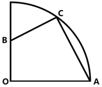
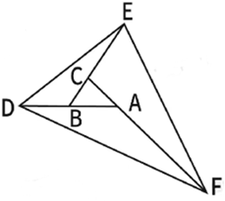
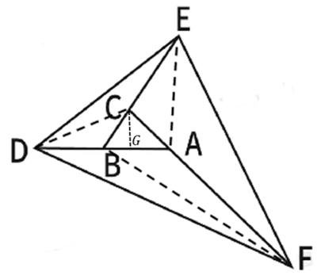
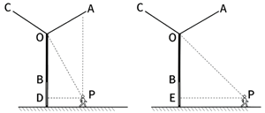
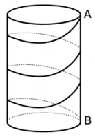
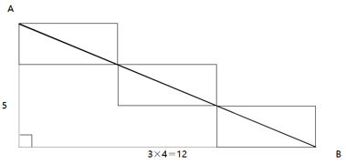

# 2026年陕西省公务员录用考试《行测》题（网友回忆版）

> 数量关系 · 10 题 · 陕西 2026

## 第 1 题　qid 16070165 · 数学运算

城区某中学安排2位数学老师、4位英语老师到A、B两所乡村中学任教，要求两所乡村中学各安排3位老师，其中A中学至少需要安排1位数学老师。那么有多少种不同的安排方式？

- **A**. 9
- **B**. 12
- **C**. 16　✅
- **D**. 20

**答案**：C

**官方解析**

方法一：根据题意，A中学可以安排1位数学老师或2位数学老师，分类讨论如下：

（1）A中学安排1位数学老师、2位英语老师，其余老师安排给B中学，有种安排方式；

（2）A中学安排2位数学老师、1位英语老师，其余老师安排给B中学，有种安排方式。

分类用加法，则A中学至少需要安排1位数学老师的方式有12+4=16种。

方法二：可考虑逆向思维。总情况为从6位老师中选3位去A中学，有种安排方式。要求A中学至少需要安排1位数学老师，反面为安排到A中学的3位老师全是英语老师，有种安排方式。因此，共有20-4=16种安排方式。

故正确答案为C。

---

## 第 2 题　qid 17467518 · 数学运算

某电影院即将开始检票，检票前已有人在排队。假设每人检票时间相同，且排队检票的人数均匀增加。若开一个检票口，10分钟可以检完；若开两个检票口，4分钟可以检完；若开三个检票口，则多少分钟可以检完？

- **A**. 1.8
- **B**. 2
- **C**. 2.5　✅
- **D**. 2.8

**答案**：C

**官方解析**

设检票前已有Y人排队，每分钟增加x人排队检票，每个检票口每分钟检1人。根据牛吃草公式：，可得：······①，······②，联立①②两式，解得，。设开三个检票口，t分钟可以检完，则有，解得t=2.5。

故正确答案为C。

---

## 第 3 题　qid 16070268 · 数学运算

一家三口去旅游，拍摄单人照、合照一共68张。合照的数量比单人照的两倍少一张；合照中，全家福占了三分之二，且孩子出现的次数为爸爸妈妈出现次数之和的一半；孩子的单人照比爸爸、妈妈单人照数量之和多1张。那么孩子出现的照片一共有：

- **A**. 52张　✅
- **B**. 48张
- **C**. 45张
- **D**. 37张

**答案**：A

**官方解析**

根据“单人照、合照一共68张。合照的数量比单人照的两倍少一张”，可得单人照为张，合照为68−23=45张。因为“孩子的单人照比爸爸、妈妈单人照数量之和多1张”，则孩子单人照为张，爸爸、妈妈单人照为23−12=11张。由于“合照中，全家福占了三分之二”，则全家福数量为张，两人合照数量为45−30=15张。

设有孩子的两人合照为x张，则没有孩子的两人合照为(15−x)张。根据 “合照中孩子出现的次数为爸爸妈妈出现次数之和的一半”，可得方程，解得x=10。所以孩子出现的照片一共有12+30+10=52张。

故正确答案为A。

---

## 第 4 题　qid 17467567 · 数学运算

某小区内有一块直角扇形的草坪如下图所示，两条互相垂直的小路AC与BC分别长4米和3米。物业公司准备在四边形OACB围成的区域种植丁香花。如果小路面积忽略不计，则丁香花种植面积为多少平方米？

- **A**. 11　✅
- **B**. 12
- **C**. 13
- **D**. 14

**答案**：A

**官方解析**

连接AB，且延长CB、AO相交于D点，如下图所示：

已知，AC=4米，BC=3米，在直角三角形ABC中，斜边米。由于AD所对圆周角为，故AD为直径，AO=OD，则与全等，BD=AB=5米，CD=CB+BD=3+5=8米。，，。所求面积。

故正确答案为A。

---

## 第 5 题　qid 16070160 · 数学运算

木星冲日，即木星、地球和太阳三者处于一条直线上，且地球位于太阳和木星之间。已知2024年12月8日发生了木星冲日，若木星绕太阳公转的周期约为12个地球年，则下一次木星冲日发生于下列哪个时间段？

- **A**. 2025年7月~9月
- **B**. 2026年1月~3月　✅
- **C**. 2026年4月~6月
- **D**. 2026年7月~9月

**答案**：B

**官方解析**

已知地球绕太阳公转的周期为1个地球年，相当于钟表的分针（短且快）；木星绕太阳公转的周期约为12个地球年，相当于钟表的时针（长且慢）。“木星冲日，即木星、地球和太阳三者处于一条直线上，且地球位于太阳和木星之间”，相当于分针和时针重合。两针角速度差为圈/年，则重合周期为年1年零33天。已知2024年12月8日发生了木星冲日，则下一次约为2026年1月10日，在B项范围内。

故正确答案为B。

---

## 第 6 题　qid 16070290 · 数学运算

某林场计划扩大荒原造林面积。下图中区域的荒原造林工作已由两人花费一天的时间完成。若将的AB边延长一倍到点D，BC边延长两倍到点E，CA边延长三倍到点F。假设每人的工作效率一致，则至少需要增加几人才能在接下来的5天内完成剩余区域的荒原造林工作？

- **A**. 3
- **B**. 5　✅
- **C**. 6
- **D**. 12

**答案**：B

**官方解析**

作辅助线连接DC、EA、BF，从点C向BA作垂线与AB交于点G。根据题意可知，DB=BA，CE=2BC，AF=3AC。设为S。将以DB为底，以CG为高；以BA为底，以CG为高，则与等底等高，故。同理，。同理，以CE为底，以BC为底，则与底之比为2:1，高相等，故。同理，。同理，以AF为底，以AC为底，与的底之比为3:1，高相等，故。同理。由于，故。则除了外的剩余区域面积为。由于每人工作效率一致，将每人工作效率赋值为1。根据两人花费一天的时间完成区域的面积S，则有2×1×1=S，即S=2。设需要增加n人在接下来的5天完成剩余区域面积17S，则有（2+n）×1×5=17S，结合S=2，解得n=4.8人，求最小，n向上取整为5，即至少增加5人可满足题干要求。

故正确答案为B。

---

## 第 7 题　qid 17467542 · 数学运算

杜甫在《绝句》中写道：“两个黄鹂鸣翠柳，一行白鹭上青天。”从这十四个字中任取两个字，则声母相同的概率是多少？

- **A**. 

- **B**. 

　✅
- **C**. 

- **D**. 

**答案**：B

**官方解析**

从十四个字中任取两个字，总的情况数为种。十四个字的拼音分别为“liǎng gè huáng lí míng cuì liǔ，yì háng bái lù shàng qīng tiān。”其中相同的声母只有4个“l”和2个“h”。其中两个字声母均为l的情况数为种，两个字声母均为h的情况数为种，分类用加法，则满足“两个字声母相同”条件的情况数为6+1=7种。根据公式：概率，则题干所求概率。

故正确答案为B。

---

## 第 8 题　qid 16070173 · 数学运算

某县拟对某段运河开展河道治理。甲公司治理1米需要用时1.5天，投入5万元；乙公司治理1米需要用时2天，投入4万元。甲、乙两公司不能同时作业，若要求在365天内完成不少于200米的治理工作，则至少需要治理费用：

- **A**. 832万元
- **B**. 845万元
- **C**. 860万元
- **D**. 870万元　✅

**答案**：D

**官方解析**

根据题意要求总费用最少，则需治理总量尽量少，即完成200米的治理工作即可。又因甲公司治理费用为5万元/米，乙公司为4万元/米，要使总治理费用最低，则需乙公司治理距离尽量长。设乙公司治理x米，则甲公司治理（200-x）米，根据治理天数在365天内，可列式：，解得，x最大为130。则总治理费用最低为5×（200-130）+4×130=870万元。

故正确答案为D。

---

## 第 9 题　qid 16070196 · 数学运算

某风力发电机的三片风叶之间两两所成的角度为，当其中一片风叶OB与塔杆叠合时，一位身高1.8米的技术人员站在另一片风叶OA端头的正下方，测得塔杆顶部仰角为（如左下图所示）；若该技术人员站在离塔杆60米处，则测得塔杆顶部仰角为（如右下图所示）。那么风叶转动时叶片顶端最高离地面：

- **A**. 81.8米
- **B**. 89.8米
- **C**. 95.8米
- **D**. 101.8米　✅

**答案**：D

**官方解析**

根据题意，在风叶转动过程中，叶片垂直地面达到最高点时顶端距地面最远，如图所示，最大距离=OA+OD+1.8米。

根据题干右图所示，且，可得为等腰直角三角形，技术人员离塔杆60米，可得OE=EP=60米；根据题干左图所示，且，根据勾股定理可得，直角三边之比为，则米；根据题意，相邻风叶夹角均为，则且，人在A点正下方，则，，同理可得直角三边之比为，则米。

综上，题干所求=OA+OD+1.8米=40米+60米+1.8米=101.8米。

故正确答案为D。

---

## 第 10 题　qid 16070176 · 数学运算

为庆祝春节，某村计划在村口的两根圆柱体石柱上缠绕灯带。每根石柱需绕上3圈灯带，起始点为A，终点为B，如下图所示。若每根石柱高为5米，横截面圆的周长为4米，那么两根石柱所需的灯带总长度最短为多少米？

- **A**. 13
- **B**. 25
- **C**. 26　✅
- **D**. 50

**答案**：C

**官方解析**

根据题干要求“两根石柱所需的灯带总长度最短”，即求A点到B点的长度最短，已知每根石柱高为5米，横截面圆的周长为4米，将石柱侧面展开成平面图形（如下图所示），则所求AB长度最短即图中直角三角形的斜边。根据直角三角形勾股定理：，则，故两根石柱所需灯带总长度最短为13×2=26米。

故正确答案为C。

---
