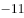
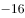
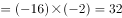
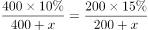
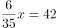
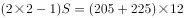
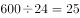
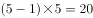
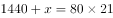
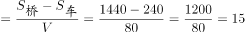

# 天津市2020年度定向34所重点高校招录选调生《综合能力测试》

> 数量关系 · 6 题 · 选调 2020

## 第 1 题　qid 2461721 · 数学运算

，1，，5，，（    ）

- **A**. 
21
　✅
- **B**. 

- **C**. 
17

- **D**. 
19

**答案**：A

**官方解析**

观察数列特征，无特征，考虑多级数列作差。后项前项，得到新数列2，，8，，？，可以看出此数列是公比为的等比数列，则？。因此所求项。

故正确答案为A。

---

## 第 2 题　qid 2461737 · 数学运算

桌上放着的甲种溶液400ml和的乙种溶液200ml，往甲、乙两种溶液中分别倒入等量的水后两种溶液的浓度相同，那么，倒入甲溶液中水的量相当于原来甲乙两种溶液总量的多少？

- **A**. 

- **B**. 

　✅
- **C**. 
1倍

- **D**. 
2倍

**答案**：B

**官方解析**

设分别往甲、乙溶液中倒入ml的水，根据倒入后甲、乙溶液浓度相同，可列式：，即，整理得：，解得ml，。

故正确答案为B。

---

## 第 3 题　qid 2461738 · 数学运算

赵英读一本小说，第一天读了全书的，第二天又读了余下的，这时还有42页没有读完，这本小说共多少页？

- **A**. 245页　✅
- **B**. 255页
- **C**. 265页
- **D**. 275页

**答案**：A

**官方解析**

设这本小说共有页，根据题意可列式：，化简得：，解得页。

故正确答案为A。

---

## 第 4 题　qid 2461739 · 数学运算

小王在甲医院，小赵在乙医院。两人从所在医院同时骑车出发，来回往返于两个医院之间。已知小王骑车速度为205米/分钟，小赵骑车速度为225米/分钟，且经过12分钟后两人第二次相遇。问两家医院相距多少米？

- **A**. 1290
- **B**. 1720　✅
- **C**. 2150
- **D**. 2580

**答案**：B

**官方解析**

设两家医院相距米，根据直线两端多次相遇公式：，代入公式可得：，解得米。

故正确答案为B。

---

## 第 5 题　qid 2461740 · 数学运算

某实验室进行连续试验。自试验开始进行第一次观察并计时，随后每隔5小时观察一次，当观察第121次时，计时表显示正好八点。则进行第（    ）次观察时，计时表的时针与分针是在观察试验时第一次呈150角。

- **A**. 5
- **B**. 8　✅
- **C**. 10
- **D**. 11

**答案**：B

**官方解析**

试验开始后每隔5小时观察一次，当观察第121次时，中间间隔120个5小时，共经过600小时，天，经过完整的25天，即进行第一次观察的时间同样为8点。代入A项验证，当进行第5次观察时，经过小时，此时时间为4点，时针与分针呈120，不满足要求；代入B项验证，当进行第8次观察时，经过小时，此时时间为19点，即晚上7点，时针与分针呈150，满足要求。

故正确答案为B。

---

## 第 6 题　qid 2461741 · 数学运算

某铁路桥长1440米，一列动车从桥上通过，测得动车从开始上桥到完全下桥用了21秒，动车的速度为288km/h，则整列动车完全在桥上的时间为（    ）秒。

- **A**. 18
- **B**. 16
- **C**. 15　✅
- **D**. 12

**答案**：C

**官方解析**

设动车车长为，动车速度，根据火车过桥公式：，代入数据得：，解得米。动车完全在桥上时间秒。

故正确答案为C。

---
