# 天津市选调2018年应届优秀大学毕业生到基层培养锻炼考试题（网友回忆版）

> 数量关系 · 10 题 · 天津 2018

## 第 1 题　qid 2165984 · 数学运算

101  203  210  250  310  （    ）

- **A**. 324　✅
- **B**. 352
- **C**. 385
- **D**. 410

**答案**：A

**官方解析**

数列作差或递推均无规律，观察发现数列较长，考虑分组。交叉分组后，奇数项为：101、210、310，将每项各位数相加，其和组成新数列为：2、3、4，是公差为1的等差数列。偶数项为：203、250、（    ），将每项各位数相加，其和组成的数列为：5、7、（    ），猜测是公差为2的等差数列，故题目所求项各位数相加之和应为9，只有A选项满足要求。

故正确答案为A。

---

## 第 2 题　qid 2165985 · 数学运算

-1  0  1  2  9  （  ）

- **A**. 11
- **B**. 82
- **C**. 720
- **D**. 730　✅

**答案**：D

**官方解析**

数列本身没有特点，但连同选项一起观察，数列变化幅度可能较大，考虑幂次。从相对较大项着手查找规律，观察可发现：，继续验证可知：，，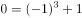。因此规律为，故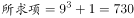。

故正确答案为D。

---

## 第 3 题　qid 2165986 · 数学运算

1  196  27  144  25  100  （  ）

- **A**. 7　✅
- **B**. 8
- **C**. 9
- **D**. 11

**答案**：A

**官方解析**

数列较长，考虑分组。交叉分组后，奇数项为：1、27、25、（ ），各项均为幂次数，可表达为：、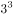、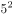、（ ），底数为连续奇数，指数是公差为-1的等差数列，故推断所求项为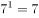。偶数项为：196、144、100，各项均为平方数，可表达为：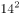、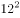、，底数为递减的连续偶数列。

故正确答案为A。

---

## 第 4 题　qid 2165987 · 数学运算

2  3  11  124  （  ）

- **A**. 16367
- **B**. 15943
- **C**. 15387　✅
- **D**. 14269

**答案**：C

**官方解析**

数列起伏较大，考虑幂次。从较大项着手查找规律，观察可发现：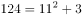，代入其他验证：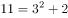，因此规律为。故所求项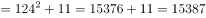。

故正确答案为C。

---

## 第 5 题　qid 2165988 · 数学运算

0  0  2  12  （    ）

- **A**. 8
- **B**. 36　✅
- **C**. 12
- **D**. 32

**答案**：B

**官方解析**

数列变化幅度不大且大部分呈递增趋势，优先考虑作差，无规律，则考虑因式分解。原数列各项因式分解：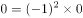，，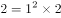，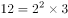。分解后的数列左子列为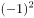，，，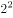，该数列是平方数列，底数是公差为1的等差数列；右子列为0，1，2，3，是公差为1的等差数列，故所求项的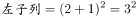，，即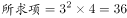。

故正确答案为B。

---

## 第 6 题　qid 2165989 · 数学运算

在一块直角三角形绿地的周边上植树，共植了12棵树，如果树间距为一米，绿地面积是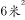，问在绿地的斜边上最多能植多少棵树？

- **A**. 7
- **B**. 5
- **C**. 6　✅
- **D**. 8

**答案**：C

**官方解析**

方法一：根据题意可知，该直角三角形的周长为12米，两直角边的乘积为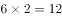米，故该绿地两条直角边边长分别为3米，4米，斜边长为5米。要使斜边上种树最多，则斜边两头需各栽一棵，故在绿地的斜边上最多能植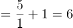棵。

方法二：根据题意可知，该直角三角形的周长为12，两直角边的乘积为12。设直角三角形两直角边长为a、b，斜边长为，则，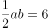。解得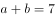，则斜边长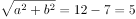。要使斜边上种树最多，则斜边两头需各栽一棵，故在绿地的斜边上最多能植棵。

故正确答案为C。

---

## 第 7 题　qid 2165990 · 数学运算

一个停车场有50辆汽车，其中红色轿车35辆，夏利轿车28辆，既不是红色轿车又不是夏利轿车8辆，问停车场有红色夏利轿车多少辆？

- **A**. 14辆
- **B**. 21辆　✅
- **C**. 15辆
- **D**. 22辆

**答案**：B

**官方解析**

两者容斥问题，套用公式：。红色轿车夏利轿车红色夏利轿车总数既不是红色轿车又不是夏利轿车，即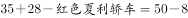，故停车场有红色夏利轿车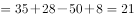辆。

故正确答案为B。

---

## 第 8 题　qid 2165991 · 数学运算

某职业大学的750名学生或上计算机课，或上规划设计课，或两门都上。如果有489名学生上计算机课，606名学生上规划设计课，问两门都上的学生是多少？

- **A**. 118人
- **B**. 114人
- **C**. 261人
- **D**. 345人　✅

**答案**：D

**官方解析**

由题意可知此题为两集合容斥问题。根据两集合容斥公式，代入数据，则两门都上的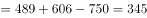。

故正确答案为D。

---

## 第 9 题　qid 2165992 · 数学运算

三个游泳运动员一起练习，当甲游1圈时，乙正好超过甲半圈，丙超过甲圈，按此速度三人共游了15圈。问丙游了多少圈？

- **A**. 7圈
- **B**. 6圈
- **C**. 5圈　✅
- **D**. 4圈

**答案**：C

**官方解析**

由题意可知，时间相同时，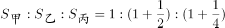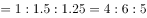则丙游的圈数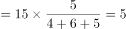圈。

故正确答案为C。

---

## 第 10 题　qid 2165993 · 数学运算

一个边长为8的正立方体，由若干个边长为1的立方体组成，现在要将大立方体表面涂成黄色，问一共有多少个小立方体涂上了黄色？

- **A**. 384
- **B**. 328
- **C**. 324
- **D**. 296　✅

**答案**：D

**官方解析**

由题意可知，该正方体共由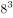个小立方体组成，去除被涂色的小立方体，剩下没被涂色的是一个棱长为6的立方体，即有个小立方体。因此一共有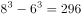个小立方体涂上了黄色。

故正确答案为D。

---
