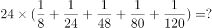
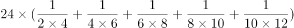
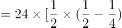
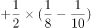
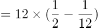
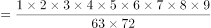
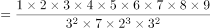
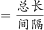
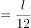

# 安徽省2019年面向全国重点高校定向招录选调生《行测》题（网友回忆版）

> 数量关系 · 5 题 · 安徽 2019

## 第 1 题　qid 4743052 · 数学运算

计算：

- **A**. 2
- **B**. 3
- **C**. 4
- **D**. 5　✅

**答案**：D

**官方解析**

原式可转化为，根据裂项相消公式，故原式。

故正确答案为D。

---

## 第 2 题　qid 4742995 · 数学运算

将正整数1至9分成三组，每组三个数，已知第一组三个数的积是63，第二组三个数的积是72，则第三组三个数的积是：

- **A**. 80　✅
- **B**. 90
- **C**. 108
- **D**. 135

**答案**：A

**官方解析**

方法一：正整数1至9的乘积为：1×2×3×4×5×6×7×8×9，因第一组三个数的积是63，第二组三个数的积是72，故第三组三个数的积。

方法二：把63分解为质数相乘的形式，可得，故在正整数1至9中，乘积是63的三个数字只能为：1，7，9；把72分解为质数相乘的形式，可得，故在正整数1至9中，除了1，7，9，乘积是72的三个数字只能为：3，4，6，故第三组三个数的积=2×5×8=80。

故正确答案为A。

---

## 第 3 题　qid 4742988 · 数学运算

自圆上一点A开始，以8cm弧长为单位等分圆周；再自点A开始，以12cm弧长为单位等分圆周。两次等分的最后一个等分点都恰好回到点A。此时，圆上共有160个等分点。则圆周长为：

- **A**. 800cm
- **B**. 860cm
- **C**. 900cm
- **D**. 960cm　✅

**答案**：D

**官方解析**

方法一：设圆周长为cm，根据环形植树的棵数，故间隔为8cm时，等分点数，间隔为12cm时，等分点数，其中间隔为8cm和12cm的最小公倍数24cm时，两种等分方法的等分点重合，则重合的等分点数。根据圆上共有160个等分点，可列方程：，解得cm。

方法二：根据题意，两次等分的最后一个等分点都恰好回到点A，故圆周长必然能被8和12整除，代入选项进行排除：

A项，800不能被12整除，不满足题意，排除；B项，860不能被8整除，不满足题意，排除；C项，900不能被8整除，不满足题意，排除；D项，960能被8和12整除，满足题意，当选。

故正确答案为D。

---

## 第 4 题　qid 4742993 · 数学运算

甲、乙两辆车同时自A地出发，沿同一条道路匀速驶往B地。当甲距B地还剩18千米时，乙还剩60千米；当甲到达终点时，乙还剩48千米。那么，A、B两地间的距离应为多少千米？

- **A**. 120
- **B**. 136
- **C**. 144　✅
- **D**. 156

**答案**：C

**官方解析**

方法一：设A、B两地间的距离为x千米，当甲距B地还剩18千米时，说明甲行驶了（x-18）千米，乙还剩60千米，说明乙行驶了（x-60）千米；当甲到达终点时行驶了x千米，乙还剩48千米，说明乙行驶了（x-48）千米。根据时间相同，速度比等于路程比，可列等式：，解得：x=144，即A、B两地间的距离应为144千米。

方法二：相同时间内，甲行驶18千米，乙行驶了60-48=12千米，则甲、乙两车的速度比为18：12=3：2。当甲到达终点时，甲、乙两车的路程比等于两车的速度比3：2，此时甲比乙多行驶48千米，故A、B两地间的距离为48×3=144千米。

故正确答案为C。

---

## 第 5 题　qid 4743013 · 数学运算

有一种足球是由32块黑白相间的牛皮缝制而成，黑皮为正五边形，白皮为正六边形，且边长都相等（如图），则白皮的块数是：

- **A**. 22
- **B**. 20　✅
- **C**. 18
- **D**. 16

**答案**：B

**官方解析**

根据题意，设白皮有x块，则黑皮有（32-x）块。黑皮为正五边形，则黑皮边的总数为5×（32-x）条；每块白皮有三条边与黑皮的边重合，则黑皮边的总数还可以表示为3x条，得到方程：5×（32-x）=3x，解得x=20，即白皮的块数是20块。
故正确答案为B。

---
