# 安徽省2020年面向全国重点高校定向招录选调生《行测》题（网友回忆版）

> 数量关系 · 5 题 · 安徽 2020

## 第 1 题　qid 2456421 · 数学运算

三个人在一个长为300米的环形跑道上的不同位置，同时向同一方向匀速跑步，速度分别为、、。问：多少分钟后，他们恰好第一次同时到达各自的起跑位置？

- **A**. 18分钟
- **B**. 15分钟
- **C**. 12分钟
- **D**. 9分钟　✅

**答案**：D

**官方解析**

由题意，三个人的速度分别为、、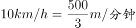。他们恰好第一次同时到达各自的起跑位置即经过相同的时间各自均跑了整数圈，由于是第一次，从时间最小的选项代入，D项：；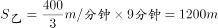;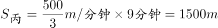。可以看出这些路程都是300米的整数倍，即三人均跑了整数圈，满足题意。

故正确答案为D。

---

## 第 2 题　qid 2456427 · 数学运算

台风中心自A地出发，以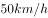的速度向东偏北方向移动，距台风中心范围内的地区均受台风影响。城市B在A的正东方向处，则城市B受台风影响持续的时间为：

- **A**. 0.8h　✅
- **B**. 1h
- **C**. 1.5h
- **D**. 1.6h

**答案**：A

**官方解析**

由题意，如图所示，，过B作垂线于C点。在直角△ABC中，，则。又距台风中心30km范围内的地区均受台风影响，也就是说台风刚好刮过，不形成时间段。

故本题无正确答案，暂以A项代替。

---

## 第 3 题　qid 2456437 · 数学运算

家用小汽车属消耗品。一辆新车购买费用为15万元，根据经验，自购买时算起，第年的维修费用为万元，每年的油耗等其他费用为1万元，则该车的年平均消耗费用最低为：

- **A**. 

- **B**. 
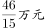
　✅
- **C**. 

- **D**. 
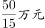

**答案**：B

**官方解析**

由题意，设该汽车可以使用n年，，其中维修费是一个公差为的等差数列，根据等差数列求和公式，可得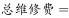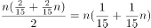。则该车的年平均消耗费用为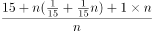。

故正确答案为B。

---

## 第 4 题　qid 2456442 · 数学运算

三组对棱长分别相等的四面体叫等腰四面体。已知一个等腰四面体的三组棱长分别为1、2、3，则其外接球的半径为：

- **A**. 
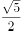

- **B**. 
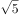

- **C**. 

　✅
- **D**. 
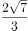

**答案**：C

**官方解析**

方法一：由题意，构造一个长方体ABCD- A&#39;B&#39;C&#39;D&#39;，使得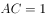，，，则等腰四面体AB&#39;CD&#39;正好满足对棱相等，棱长分别为1，2，3；该等腰四面体的外接球即长方体的外接球，长方体外接球的半径为体对角线的一半，即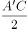。

由勾股定理可得：

,

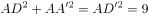,

三式相加除以2,可得：，由于，则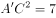，那么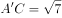。

因此该三棱锥外接球的半径为。

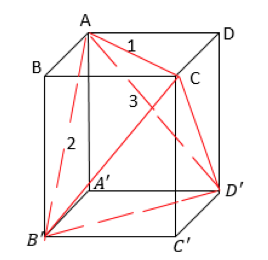

方法二：等腰四面体模型公式，外接球半径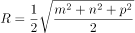，其中、、为等腰四面体的三组棱长。由题意，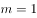，，，代入公式，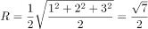。

故正确答案为C。

备注：由于四面体的面为三角形，那么等腰四面体的三组棱长应该也可以构成三角形，但是本题出题人在设置数据时未考虑到这点，所以导致三组棱长1、2、3无法构成三角形。

---

## 第 5 题　qid 2456445 · 数学运算

从4种不同的颜色中选取若干种颜色给图中A、B、C、D、E五个封闭区域涂色，相邻两个区域不同色。问：涂色方法总共有多少种？

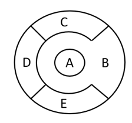

- **A**. 108　✅
- **B**. 106
- **C**. 98
- **D**. 96

**答案**：A

**官方解析**

方法一：由题意，如果C、E区域不同色，则4种颜色涂B、C、D、E区域有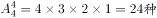，A区域只需跟B不同色，从剩下3种选1种即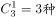，涂色方法共有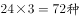。如果C、E区域同色，则B、C、D区域有，A区域只需跟B不同色，从剩下3种选1种即，涂色方法共有。因此，涂色方法共有。

 方法二：A区域可从4种颜色中选1种有；B区域与A区域不同，可从剩下3种颜色中选1种有；C区域与B区域不同，可从剩下3种颜色中选1种有；D区域与B、C区域不同，可从剩下2种颜色中选1种有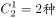；E区域与B、D区域不同，可从剩下2种颜色中选1种有；因此涂色方法共有。

故本题无正确选项，暂以A项代替。

---
