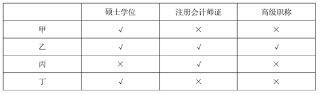
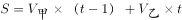
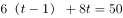
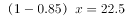
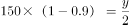
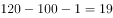
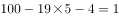

# 广东省2019年选调优秀大学毕业生笔试 思维能力测验（网友回忆版）

> 数量关系 · 12 题 · 广东 2019

## 第 1 题　qid 2262050 · 数学运算

有甲、乙两个品牌的电脑专卖店，甲品牌专卖店客流量略高于乙品牌专卖店，因此，甲品牌专卖店的电脑销量比乙品牌专卖店的大。
上述推论最可能基于的假设是（  ）。

- **A**. 乙品牌开通了网络销售渠道
- **B**. 甲品牌专卖店规模比乙品牌的大
- **C**. 两个专卖店的进店购买率相当　✅
- **D**. 甲品牌的广告投入更大

**答案**：C

**官方解析**

第一步：找出论点和论据。
论点：甲品牌专卖店的电脑销量比乙品牌专卖店的大。
论据：甲品牌专卖店客流量略高于乙品牌专卖店。
第二步：逐一分析选项。
A项：乙品牌开通了网络销售渠道，但该品牌的销售量与甲品牌的销售量谁多谁少不明确，不是论证成立的假设，排除；
B项：论点说的是甲乙电脑销量的比较，该项说的是甲品牌专卖店规模比乙品牌的大，话题不一致，不是论证成立的假设，排除；
C项：两个专卖店的进店购买率相当，说明进店购买的人占客流量的比重是一样的，那么甲品牌专卖店客流量高于乙品牌专卖店，就可以得出在甲品牌专卖店购买电脑的人要多一点，即甲品牌专卖店的电脑销量更大，属于搭桥项，是论证成立的假设，当选；
D项：论点说的是甲乙电脑销量的比较，该项说的是甲品牌的广告投入大，广告投入大不代表销量一定大，话题不一致，不是论证成立的假设，排除。
故正确答案为C。

---

## 第 2 题　qid 2262056 · 数学运算

如果旅行车程超过3小时，选择自驾游的游客数量就会大大减少。目前，从乙市驾车前往甲市至少需要5小时。如果开通甲、乙两市间的高速公路，从乙市前往甲市的自驾游游客将会显著增加。
上述论证最可能基于的潜在假设是（  ）。

- **A**. 该高速公路能够在短时间内开通使用
- **B**. 绝大多数游客以自驾的方式前往甲市
- **C**. 该高速公路开通后，两市车程将小于3小时　✅
- **D**. 很多乙市居民喜欢前往周边城市旅游

**答案**：C

**官方解析**

第一步：找出论点和论据。
论点：如果开通甲、乙两市间的高速公路，从乙市前往甲市的自驾游游客将会显著增加。
论据：如果旅行车程超过3小时，选择自驾游的游客数量就会大大减少。目前，从乙市驾车前往甲市至少需要5小时。
第二步：逐一分析选项。
A项：论点说的是从乙市前往甲市的自驾游游客会增多，该项说的是该高速公路能够在短时间内开通使用，话题不一致，不是论证成立的假设，排除；
B项：论点说的是从乙市前往甲市的自驾游游客会增多，该项说的是游客会以自驾的方式前往甲市，但没有说是从哪个地方去甲市以及高速公路开通对自驾选择的影响，不是论证成立的假设，排除；
C项：论据提到如果时间超过3小时，自驾游游客数量就会减少，因此高速公路开通后车程小于3小时，是从乙市前往甲市的自驾游游客增多的必要条件，是论证成立的假设，当选；
D项：论点说的是从乙市前往甲市的自驾游游客会增多，该项说的是乙市居民喜欢前往周边城市旅游，话题不一致，不是论证成立的假设，排除。
故正确答案为C。

---

## 第 3 题　qid 2262035 · 数学运算

人们通常会通过阅读和学习提升自我。一项调查显示，超过一半的受访对象保持了长期的阅读习惯，接近一半的受访对象习惯通过网络扩充知识面。此外，受访对象还表示会通过购买线上课程等方式持续学习。可以看出，现代人越来越倾向在精神层面进行自我投资，非常愿意持续提升自我。
以下最无法支持上述推论的是（  ）。

- **A**. 个人的自我提升方式存在较大差异　✅
- **B**. 精神层面的投资消费有增大的趋势
- **C**. 市场上图书杂志等销量持续走高
- **D**. 线上课程销量持续上升

**答案**：A

**官方解析**

第一步：找出论点和论据。
论点：现代人越来越倾向在精神层面进行自我投资，非常愿意持续提升自我。
论据：一项调查显示，超过一半的受访对象保持了长期的阅读习惯，接近一半的受访对象习惯通过网络扩充知识面。此外，受访对象还表示会通过购买线上课程等方式持续学习。
第二步：逐一分析选项。
A项：论点说的是现代人非常愿意持续提升自我，该项说的是个人的自我提升方式存在较大差异，但是否愿意持续提升自我不清楚，属于不明确选项，无法加强，当选；
B项：该项说的是精神层面的投资消费有增大的趋势，说明现代人确实越来越倾向在精神层面进行自我投资，补充论据，可以加强，排除；
C项：该项说的是市场上图书杂志等销量持续走高，图书杂志算是精神层面的投资，可以说明现代人越来越倾向在精神层面进行自我投资，补充论据，可以加强，排除；
D项：该项说的线上课程销量持续上升，而线上课程也是精神层面的投资，说明现代人越来越倾向在精神层面进行自我投资，补充论据，可以加强，排除。
本题为选非题，故正确答案为A。

---

## 第 4 题　qid 2261994 · 数学运算

一项针对糖尿病患者饮食的研究发现，那些选择高膳食纤维饮食的患者，其肠道内的益生菌生长速度快，进而促进糖化血红蛋白明显下降。因此，高膳食纤维饮食有利于防治糖尿病。
以下最能质疑上述论证的是（  ）。

- **A**. 不少糖尿病患者患病前后一直有着高膳食纤维饮食的习惯　✅
- **B**. 某山区的人经常喝含益生菌的酸牛奶，当地极少有人患糖尿病
- **C**. 高膳食纤维饮食可使进餐后血糖保持稳定
- **D**. 糖化血红蛋白指标可有效反映糖尿病患者过去1-2个月内血糖控制情况

**答案**：A

**官方解析**

第一步：找出论点和论据。
论点：高膳食纤维饮食有利于防治糖尿病。
论据：那些选择高膳食纤维饮食的患者，其肠道内的益生菌生长速度快，进而促进糖化血红蛋白明显下降。
第二步：逐一分析选项。
A项：不少糖尿病患者患病前后一直有着高膳食纤维饮食的习惯，说明高膳食纤维饮食并不能有利于防治糖尿病，直接削弱论点，当选；
B项：论点说的是高膳食纤维饮食有利于防治糖尿病，该项说的是经常喝含益生菌的酸牛奶极少患糖尿病，话题不一致，无法削弱，排除；
C项：高膳食纤维饮食可使进餐后血糖保持稳定，但是否有利于防治糖尿病不确定，属于不明确选项，无法削弱，排除；
D项：该项说的是糖化血红蛋白指标可有效反映血糖控制情况，而论点说的是高膳食纤维饮食有利于防治糖尿病，话题不一致，无法削弱，排除。
故正确答案为A。

---

## 第 5 题　qid 2262028 · 数学运算

某单位准备派3名员工外出参加培训学习，计划从财务部的甲、乙、丙和行政部的丁、戊、己6人中选派人员。由于工作安排限制，参加培训学习的人员安排必须符合以下条件：财务部和行政部分别至少有一人参加；甲和乙不能同时参加；如果丁或戊参加，则丙不能参加。
以下人员名单符合条件的是（  ）。

- **A**. 甲、丙、戊
- **B**. 乙、丙、己　✅
- **C**. 甲、乙、戊
- **D**. 丁、戊、己

**答案**：B

**官方解析**

题干信息确定，考虑排除法。

根据财务部和行政部分别至少有一人参加，但丁、戊、己均来自行政部，排除D项；

根据甲和乙不能同时参加，排除C项； 

根据如果丁或戊参加，则丙不能参加，即丁或戊-丙可知，戊参加，是对条件的肯前，肯前必肯后，所以丙不能参加，排除A项。

故正确答案为B。

---

## 第 6 题　qid 2262042 · 数学运算

低骨量人群是骨质疏松症高危人群，我国50岁以上人群低骨量率接近一半。低骨量人群庞大的主要原因是对骨质疏松症“普遍不了解”，50岁以上人群骨密度检测比例很低。如果提高50岁以上人群的骨密度检测率，该人群的骨质疏松症发病率就能有效降低。
以下最能指出上述论证缺陷的是（  ）。

- **A**. 假设了骨密度检测是骨质疏松症的有效预防手段　✅
- **B**. 暗含了大部分骨密度低的人并未进一步采取有效措施
- **C**. 忽视了饮食和锻炼对骨质疏松症的重要影响
- **D**. 忽视了低骨量对不同个体的影响因人而异

**答案**：A

**官方解析**

第一步：找出论点和论据。
论点：如果提高50岁以上人群的骨密度检测率，该人群的骨质疏松症发病率就能有效降低。
论据：低骨量人群庞大的主要原因是对骨质疏松症“普遍不了解”，50岁以上人群骨密度检测比例很低。
第二步：逐一分析选项。
A项：题干通过50岁以上人群骨密度检测比例很低，得出论点如果提高50岁以上人群的骨密度检测率，该人群的骨质疏松症发病率就能有效降低，该项指出题干其实是在“假设了骨密度检测是骨质疏松症的有效预防手段”基础上论证的，可以指出论证缺陷，当选；
B项：该项说的是大部分骨密度低的人并未进一步采取有效措施，与论点说的骨密度检测率与骨质疏松症发病率之间的关系无关，无法指出论证缺陷，排除； 
C项：该项说的是饮食和锻炼对骨质疏松症的影响，与论点说的骨密度检测率与骨质疏松症发病率之间的关系无关，无法指出论证缺陷，排除； 
D项：该项说的是低骨量对不同个体的影响因人而异，与论点说的骨密度检测率与骨质疏松症发病率之间的关系无关，无法指出论证缺陷，排除。
故正确答案为A。

---

## 第 7 题　qid 2262049 · 数学运算

过去3年中，某企业生产所需原材料的平均价格增长了，但原材料成本占总成本的比例并没有发生变化。因此，该企业的生产总成本在过去3年内同样增长了。

上述推论最可能基于的假设是该企业（  ）。

- **A**. 
过去3年内所需原材料的数量保持不变
　✅
- **B**. 
过去3年内原材料成本增长了

- **C**. 
过去3年内劳动力成本保持不变

- **D**. 
过去3年内盈利增长了 

**答案**：A

**官方解析**

第一步：找出论点和论据。

论点：因此，该企业的生产总成本在过去3年内同样增长了。

论据：过去3年中，某企业生产所需原材料的平均价格增长了，但原材料成本占总成本的比例并没有发生变化。

第二步：逐一分析选项。

A项：该项说的是过去3年内所需原材料的数量保持不变，原材料的成本等于平均价格乘以数量，所以当数量不变时，平均价格的涨幅和原材料的成本成正比，且原材料成本占总成本比例不变，因此可以得到论点生产总成本在过去3年内同样增长了，该项建立了论点和论据的必然联系，是论证成立的假设，保留；

B项：该项说的是过去3年内原材料成本增长了，论据中说到原材料成本占总成本的比例不变，所以可以得到论点生产总成本在过去3年内同样增长了，该项建立了论点和论据的必然联系，是论证成立的假设，保留；

C项：该项说的是劳动力的成本不变，而题干说的是原材料与总成本之间的关系，讨论话题不一致，不是论证成立的假设，排除；

D项：该项说的是盈利增加了，而题干说的是原材料与总成本之间的关系，讨论话题不一致，不是论证成立的假设，排除。

对比A、B两项，A项同时建立了论据的平均价格、成本占比和论点的总成本之间的联系，而B项只建立了论据的成本占比和论点的总成本之间的联系，A项建立的联系更加全面。

故正确答案为A。

---

## 第 8 题　qid 2261984 · 数学运算

今年，某民营企业在当地政府的指导下成立了纪检监察室，将“党管监督模式”融入企业管理。预计今后，通过对企业的生产、采购等环节进行监察审计，该企业能够有效降低成本，产生更大的经济效益。
下列各项如果为真，对上述论证支持最弱的是（  ）。

- **A**. 该企业的主要成本来源于生产与采购环节
- **B**. 引入监察审计后，该企业的产品合格率进一步提升
- **C**. 自从该企业设立举报邮箱后，检举的数量大幅增加了　✅
- **D**. 纪检监察室成立后，查处多起违纪违规行为，挽回大量经济损失

**答案**：C

**官方解析**

第一步：找出论点和论据。
论点：预计今后，通过对企业的生产、采购等环节进行监察审计，该企业能够有效降低成本，产生更大的经济效益。
论据：无。
第二步：逐一分析选项。
A项：该企业的主要成本来来源于生产与采购环节，那么通过对两个环节的监察审计，就可以让成本环节更加科学合理，可以加强，排除；
B项：该企业的产品合格率进一步提升，减少不合格的产品，让生产更有效率，也就是可以产生更大的经济效益，可以加强，排除；
C项：检举的数量大幅增加了，只能说明不好的事情被发现了，检举之后能否降低企业成本，能否带来经济效益，是不明确的，属于不明确选项，不能加强，当选；
D项：查处多起违纪违规行为，挽回大量经济损失，经济损失减少，说明可以有效降低成本，可以加强，排除。
本题为选非题，故正确答案为C。

---

## 第 9 题　qid 2262009 · 数学运算

某部门有甲、乙、丙、丁4名干部，只有一个人同时有硕士学位、注册会计师证和高级职称，有三个人有硕士学位，两个人有注册会计师证，只有一个人有高级职称，但每个人至少具备这三个条件中的一项。已知甲和丁要么都有硕士学位，要么都没有；乙和丙要么都有注册会计师证，要么都没有；丙和丁只有一个人有硕士学位。
那么，该部门同时有硕士学位、注册会计师证和高级职称的是（  ）。

- **A**. 甲
- **B**. 乙　✅
- **C**. 丙
- **D**. 丁

**答案**：B

**官方解析**

第一步：分析题干。

① 只有一个人同时有硕士学位、注册会计师证和高级职称

②有三个人有硕士学位

③两个人有注册会计师证

④只有一个人有高级职称

⑤每个人至少具备这三个条件中的一项

⑥甲和丁要么都有硕士学位，要么都没有

⑦乙和丙要么都有注册会计师证，要么都没有

⑧丙和丁只有一个人有硕士学位

第二步：根据题干条件进行推理。

根据②⑥，得出甲和丁都具有硕士学位；再根据②⑧得出丙没有硕士学位，乙有硕士学位；根据③⑦，假设乙和丙都没有注册会计师证，那么丙既没有硕士学位也没有注册会计师证，又根据⑤，丙必须拥有高级职称，根据④，其他人均没有高级职称，此时并没有一个人同时拥有这三个特征，与①矛盾，那么假设不成立，得出乙和丙都有注册会计师证，此时只有乙同时有硕士学位和注册会计师证，再根据①，乙必须也有高级职称，因此该部门同时有硕士学位、注册会计师证和高级职称的是乙。表格如下：

故正确答案为B。

---

## 第 10 题　qid 2262000 · 数学运算

甲乙两人相距50千米，同时出发相向而行，甲的前进速度为6千米/小时，乙的前进速度为8千米/小时。在途中，甲休息了1个小时再继续前进，则甲、乙在出发（  ）小时后相遇。

- **A**. 2
- **B**. 3
- **C**. 3.5
- **D**. 4　✅

**答案**：D

**官方解析**

设甲乙出发t小时后相遇，则甲实际行驶（t-1）小时，乙实际行驶t小时。根据，得，解得。

故正确答案为D。

---

## 第 11 题　qid 2262005 · 数学运算

某件商品如果打九折销售，利润将减少一半；如果打八五折销售，利润将减少22.5元。如果按原价销售，这件商品的利润是（  ）元。

- **A**. 15
- **B**. 22.5
- **C**. 30　✅
- **D**. 45

**答案**：C

**官方解析**

设原价为元，利润为元。根据“打八五折销售，利润将减少22.5元”可知，成本不变，减少的22.5元恰好为打折少收入的部分，则，解得；根据“打九折销售，利润将减少一半”可得，解得，则这件商品的利润是30元。

故正确答案为C。

---

## 第 12 题　qid 2262014 · 数学运算

在长120米、宽100米的空地上开挖若干个边长大于1米的正方形鱼池，相邻鱼池之间要预留至少1米的走道，则开挖的鱼池总面积最大为（  ）平方米。

- **A**. 11097
- **B**. 11444
- **C**. 11559
- **D**. 11805　✅

**答案**：D

**官方解析**

如图所示，要想使得鱼池总面积最大，可先挖一个最大的正方形，即边长为100米；在剩余的空地上，先预留1米的走道，然后继续挖最大的正方形，此时边长最大为米，因宽为100米，则这样的正方形个数为5个，中间有4个过道，加上至少4米，最后还剩米，因要挖边长大于1米的正方形鱼池，且相邻鱼池之间要预留至少1米的走道，因此最后1米不能再挖新的鱼池。则所求总面积平方米。

故正确答案为D。

---
