# 江西省2018年市县两级法院、检察院统一考录公务员笔试《行测》题（网友回忆版）

> 数量关系 · 10 题 · 江西 2018

## 第 1 题　qid 2256391 · 数学运算

要求厨师从7种主料中挑选出2种、从10种配料中挑选出3种来烹饪一道菜肴，烹饪的方式共有6种，那么该厨师最多可以做出多少道不一样的菜肴？

- **A**. 10290
- **B**. 18470
- **C**. 19826
- **D**. 15120　✅

**答案**：D

**官方解析**

选材顺序不影响结果，故使用组合。7种主料中挑选出2种不同组合为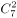种，10种配料中挑选出3种不同组合为种，烹饪方式有6种。分步相乘，因此可以做不同菜肴数量为：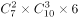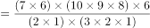，结果为9的倍数，并且尾数为0，选项中仅有D项符合。

故正确答案为D。

---

## 第 2 题　qid 2256395 · 数学运算

甲、乙、丙三人工作的效率比为，现将A、B两项工作量相同的工程交给这三个人，甲负责A工程，乙负责B工程，丙作为机动参与A工程若干天后转而参与B工程，两项工程同时开工，耗时8天同时结束，问丙在A工程中参与施工多少天？

- **A**. 3
- **B**. 4
- **C**. 5　✅
- **D**. 6

**答案**：C

**官方解析**

方法一：设甲乙丙每天工作效率分别为7、9、8，丙在A工程中参与施工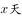。根据A、B两项工程工作量相等，可列方程得：，化简得，解得。

方法二：甲工作效率比乙低，A、B两项工程工作量相同，并且同时完成，那么为了协助甲加快工期，丙参与A工程的天数必然大于B工程天数，即参与A工程大于4天，排除A、B项。代入C项得，。等式成立，符合题意。

故正确答案为C。

---

## 第 3 题　qid 2256401 · 数学运算

甲乙两地之间高速公路设有4个服务区，从甲地驾车以90千米时速行驶并在每个服务区休息10分钟需要4小时20分钟到达乙地。若从乙地驾车以时速120千米并在每个服务区休息5分钟，到达甲地需要的时间是多少？

- **A**. 2小时45分钟
- **B**. 3小时5分钟　✅
- **C**. 3小时25分钟
- **D**. 4小时20分钟

**答案**：B

**官方解析**

根据公式，路程=速度×时间可知，当路程一定时，速度与时间成反比。来回甲乙两地路程相等，因此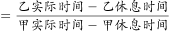，设乙实际行驶时间为,代入数据得：，解得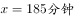，即3小时5分钟。

故正确答案为B。

---

## 第 4 题　qid 2256406 · 数学运算

一个矩形的周长为100，它的面积可能是多少？

- **A**. 600　✅
- **B**. 650
- **C**. 700
- **D**. 750

**答案**：A

**官方解析**

方法一：设矩形长为，因为周长为100，则宽为。因此矩形面积为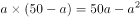。仅有A项符合。

方法二：矩形周长固定，它的面积最小可以无限接近于0，最大会有一个具体的数字。本题为选择题只有唯一解，若通过最大值求解，必然只有A项可为答案。若B、C、D项符合，则A项也符合，因此仅有A项符合。

故正确答案为A。

---

## 第 5 题　qid 2256408 · 数学运算

由1，3，5，7，9五个数字组成的没有重复数字的五位数有120个，将它们从小到大排列起来，第50个数是多少？

- **A**. 51739
- **B**. 53197
- **C**. 53179
- **D**. 51397　✅

**答案**：D

**官方解析**

从小到大排列，当首位为1时，共有个五位数，当首位为3时，同样有个五位数，因此第50个数就是首位为5时从小到大的第二个数即51397。

故正确答案为D。

---

## 第 6 题　qid 2256412 · 数学运算

某高校今年共招收新生6060人，比去年增长，其中本科新生比去年减少，研究生新生比去年增加。那么，该高校今年本科新生有多少人？

- **A**. 4200
- **B**. 4120
- **C**. 3900
- **D**. 3800　✅

**答案**：D

**官方解析**

方法一：本科新生比去年减少，可知今年本科生人数是去年的，即，因此今年本科新生人数为19的倍数，只有D项符合。 

方法二：今年招收6060人，比去年增长，则去年总人数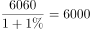人，根据线段法，本科生和研究生新生增长率的距离之比为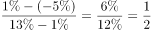，增长率的距离和基期成反比，则去年本科生和研究生人数之比为2：1，那么去年本科的招生人数为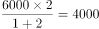人，今年本科新生为人。

故正确答案为D。

---

## 第 7 题　qid 2256416 · 数学运算

从一瓶浓度为的酒精溶液中倒出，加满纯净水，再倒出，又加满纯净水，此时酒精溶液的浓度是多少？

- **A**. 

- **B**. 

　✅
- **C**. 

- **D**. 

**答案**：B

**官方解析**

由题目可知，每次稀释后溶液总量不变，相当于每次减少溶质的，留下的溶质为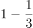，这样操作两次，则最后浓度变为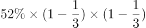。

故正确答案为B。

---

## 第 8 题　qid 2256418 · 数学运算

用6位数字表示日期，如170226表示的是2017年2月26日。如果用这种方法表示2019年的日期，则全年中六个数字都不相同的日期有多少天？

- **A**. 12
- **B**. 24
- **C**. 30　✅
- **D**. 36

**答案**：C

**官方解析**

根据题目的条件,需要求出有多少个符合要求的日期，要表示2019年的日期，先安排月份，再安排具体日期。假设2019年AB月CD日，可以写成“19ABCD”，月份中不能有1和9，排除1月、9月、10月、11月、12月。AB可能02～08，所以A一定为0，写成“190BCD”。分情况讨论：

（1）若B为2，2019年为平年，2月只有28为天，CD不可能为01～28，所以B不能为2；

（2）若B为3，3月有31天，CD只能为24、25、26、27、28，共5种情况；若B为4，4月有30天，CD只能为23、25、26、27、28，共5种情况；同理，若B为5，6，7，8时，不论当月是31天还是30天，一个月都是只有5天满足，3～8月共有6个月，一共有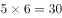天。

故正确答案为C。

---

## 第 9 题　qid 2256422 · 数学运算

一个布袋中装有大小相同的3个白球、4个红球和2个黑球，每次从袋中摸出一球不再放回。问恰好在第3次取得黑球的概率是多少？

- **A**. 

　✅
- **B**. 

- **C**. 

- **D**. 

**答案**：A

**官方解析**

概率=满足要求的情况数/总的情况数。总情况数：从布袋中依次取出3个球，有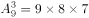种；恰好第3次取得黑球的情况可分类讨论：（1）前两次无黑球，第3次取黑球，情况数为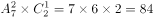种；（2）前两次有一次取黑球，第3次取黑球，情况数为种。则满足要求的情况数为种。概率=。

故正确答案是A。

---

## 第 10 题　qid 2256423 · 数学运算

社区组织自驾游。如果7辆车上每车3人，其余的每4人一车，那么会有6人无车可乘；如果5辆车上每车4人，其余的每5人一车，则会有2辆空车。问一共有多少辆车？

- **A**. 10
- **B**. 12
- **C**. 13
- **D**. 14　✅

**答案**：D

**官方解析**

设有辆车，共有人，根据题意列式：①；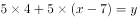②，解得，。

故正确答案为D。

---
