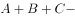
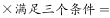
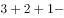
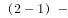
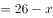
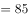
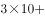
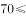
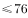

# 河北省2019年度定向招录选调生考试《基本素质和能力测试》题

> 数量关系 · 3 题 · 河北 2019

## 第 1 题　qid 2343329 · 数学运算

从经济学角度看，任何一种商品的价格都是由成本和利润两个因素共同决定的。

- （选项）[]

**答案**：B

**官方解析**

本题主要考查经济知识。
对于商品价格由什么来决定，学界有两种不同的观点：一种是马克思政治经济学认为“商品的价格是由价值决定的，受供求关系的影响。”另外一种是西方经济学中有学者认为“价格是由供求两个因素共同决定的。”这两种说法是从两个不同的角度说了同一个问题。前者是从生产的角度说的，商品作为价值的体现物，在交换时的价格由它的价值决定，会受供求关系的影响；后者是从流通的角度说的，处在流通领域的商品，它的价格是多少，这只能由该商品的供求关系决定。
故题干表述错误。

---

## 第 2 题　qid 2343370 · 数学运算

某单位26人需要安排在ABC三种不同工作岗位上，发现不能胜任A岗位的有3人，不能胜任B岗位的有2人，不能胜任C岗位的有1人，其中，不能胜任两个及以上岗位的2人，三个岗位都不能胜任的1人，该单位多少人能够胜任所有岗位工作？

- **A**. 21人
- **B**. 22人
- **C**. 23人　✅
- **D**. 24人

**答案**：C

**官方解析**

该单位不能胜任A岗位的有3人，不能胜任B岗位的有2人，不能胜任C岗位的有1人，其中不能胜任两个岗位及以上的2人，不能胜任三个岗位的1人。根据容斥原理三集合非标准公式：。设该单位有人能胜任所有岗位工作，则，解得人。

故正确答案为C。

---

## 第 3 题　qid 2343392 · 数学运算

某城市实行阶梯水价，标准范围内每吨水3元，超标准部分每吨5元。某居民上月用水21吨，交水费85元，该居民本月用水18吨，应该交水费多少元？

- **A**. 54
- **B**. 70　✅
- **C**. 80
- **D**. 90

**答案**：B

**官方解析**

该居民上月用水21吨，交水费85元。

方法一：设标准部分用水为吨，则，解得吨。该居民本月用水18吨，应交水费：元。

方法二：该居民本月用水18吨，相比上月少用水3吨，则本月应交水费，即本月应交水费。

故正确答案为B。

---
