# 河南省2019年统一考试录用司法所公务员《行测》题（网友回忆版）

> 数量关系 · 14 题 · 河南 2019

## 第 1 题　qid 2452800 · 数学运算

(    )，11，20，31，44，59

- **A**. 2
- **B**. 3
- **C**. 4　✅
- **D**. 5

**答案**：C

**官方解析**

数列无明显特征，优先考虑作差。作差后得到新数列：（   ）、9、11、13、15，是公差为2 的等差数列，则第一项为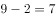，故题干所求项为。

故正确答案为C。 

---

## 第 2 题　qid 2452807 · 数学运算

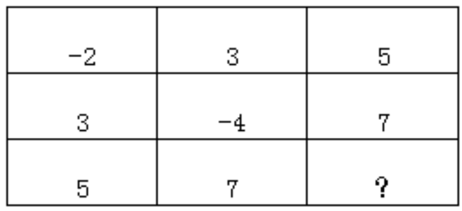

- **A**. -6　✅
- **B**. -3
- **C**. -4
- **D**. -5

**答案**：A

**官方解析**

题干出现图形，且大数位置不固定，优先考虑凑相等。观察发现每一行或者每一列相加之和都为6，故所求项为。

故正确答案为A。 

---

## 第 3 题　qid 2452809 · 数学运算

108.02，-70.04，72.06，-34.08，36.10，（  ）

- **A**. -7.12　✅
- **B**. 7.02
- **C**. 9.12
- **D**. -9.12

**答案**：A

**官方解析**

原数列中数字均为小数，可将整数部分与小数部分分开观察。整数部分正负交替，数字分别108、70、72、34、36，作差加和均无规律，观察各项数字发现，各位数字相加之和为9、7、9、7、9，则下一项整数部分加和应为7。小数部分为02、04、06、08、10，构成公差为2的等差数列，下一项为12。因为原数列正负交替循环，则所求项应为-7.12。
故正确答案为A。

---

## 第 4 题　qid 2452814 · 数学运算

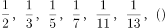

- **A**. 
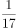
　✅
- **B**. 

- **C**. 
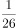

- **D**. 

**答案**：A

**官方解析**

将原数列分子分母分开观察，分子均为1，分母为2、3、5、7、11、13，为质数列，下一项为17。则所求项为。

故正确答案为A。

---

## 第 5 题　qid 2452816 · 数学运算

某市从市儿童公园到市科技馆有6种不同路线，从市科技馆到市少年宫有5种不同路线，从市儿童公园到市少年宫有4种不同路线，则从市儿童公园到市少年宫的路线共有：

- **A**. 24种
- **B**. 36种
- **C**. 34种　✅
- **D**. 38种

**答案**：C

**官方解析**

从市儿童公园到市科技馆有6种不同路线，从市科技馆到市少年官有5种不同路线，那么从市儿童公园途径科技馆再到市少年宫有种路线；从市儿童公园到市少年宫有4种不同路线。故从市儿童公园到市少年宫共有种路线。

故正确答案为C。

---

## 第 6 题　qid 2452818 · 数学运算

在切钢管时会在切口处产生钢材损耗，每切一次损耗的钢材量约为10克，一根钢材被均匀地切成三等份，损耗钢材为钢材总重量的，则这根钢材的重量为：

- **A**. 10千克　✅
- **B**. 12千克
- **C**. 14千克
- **D**. 15千克

**答案**：A

**官方解析**

根据题意，一根钢材被切成三等份，需要切两次，则损耗的钢材量为克。又因为损耗钢材为钢材总重量的，则钢材总重量为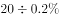。

故正确答案为A。

---

## 第 7 题　qid 2452819 · 数学运算

小王从乡镇骑自行车前往县城，若他骑行速度为18千米/时，则下午5点钟到达；若他骑行速度为20千米/时，则下午4点钟到达。小王的出发时间为：

- **A**. 早上6点
- **B**. 早上7点　✅
- **C**. 早上8点
- **D**. 中午12点

**答案**：B

**官方解析**

乡镇到县城的路程一定，则速度与时间成反比。速度之比为，对应时间之比为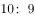。相差的1份对应1小时。当速度为时，所用时间为10小时，下午5点钟到达，对应出发时间应为早上7点。

故正确答案为B。

---

## 第 8 题　qid 2452821 · 数学运算

某隧道长1500米，有一列长150米的火车通过这条隧道，从车头进入隧道到完全通过隧道花费的时间为50秒，整列火车完全在隧道中的时间是：

- **A**. 43.2秒
- **B**. 40.9秒　✅
- **C**. 38.3秒
- **D**. 37.5秒

**答案**：B

**官方解析**

本题为行程问题中的火车过桥问题。，则火车的速度为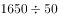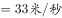。整列火车完全在隧道中的路程为，那么整列火车完全在隧道中的时间为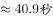。

故正确答案为B。

---

## 第 9 题　qid 2452822 · 数学运算

有A、B两个书架，A书架有50本书，B书架有70本书，要使A书架上的书本数是B书架的2倍，则从B书架上拿书放到A架上是：

- **A**. 30本　✅
- **B**. 32本
- **C**. 34本
- **D**. 35本

**答案**：A

**官方解析**

设从B书架上拿本书放到A架上，根据题意可建立方程：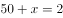，解得。

故正确答案为A。

---

## 第 10 题　qid 2452801 · 数学运算

某书法兴趣班有学员12人，其中男生5人，女生7人。从中随机选取2名学生参加书法比赛，则选到1名男生和1名女生的概率为：

- **A**. 
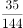

- **B**. 

- **C**. 

- **D**. 
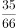
　✅

**答案**：D

**官方解析**

根据公式，概率=。总情况为12名学员随机选2名，共有种情况；满足要求的情况为5名男生中选1名有种情况、7名女生中选1名有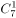种情况，分步用乘法，共有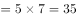种情况。则概率=。

故正确答案为D。

---

## 第 11 题　qid 2452803 · 数学运算

有一条自西向东流向的河流，甲、乙两艘轮船分别从河流的上游和下游两点开始相对航行，在相遇于某地时，甲船航行的路程为乙船的2倍。已知乙船的速度为甲船的2倍，水流速度为1千米/分，则甲船的航行速度为：

- **A**. 4千米/分
- **B**. 3千米/分
- **C**. 2千米/分
- **D**. 1千米/分　✅

**答案**：D

**官方解析**

设甲船航行速度为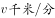，则乙船航行速度为，航行时间为。根据、，结合题干条件中甲船航行的路程为乙船的2倍，列式可得：，解得。

故正确答案为D。

备注：本题为争议题，根据对“航行速度”的不同理解可以得出两个答案。若认为“航行速度”为船速，则本题选择D项；若认为“航行速度”包含水流速度对船速的影响，则本题甲船的航行速度应为千米/分，选择C项。粉笔倾向正确答案为D项。

---

## 第 12 题　qid 2452806 · 数学运算

一瓶硫酸使用了5天，使用时后一天总比前一天少使用1毫升，今天做实验用掉了5毫升后，现在剩下的量与已经用掉的量相同，则这瓶硫酸原来有：

- **A**. 70毫升　✅
- **B**. 65毫升
- **C**. 60毫升
- **D**. 55毫升

**答案**：A

**官方解析**

根据“使用时后一天总比前一天少使用1毫升”可得，这5天硫酸用量为等差数列。等差数列求和公式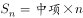，第3天使用硫酸量为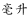，则5天使用硫酸总量为。根据“剩下的量与已经用掉的量相同”可得，这瓶硫酸原来有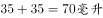。

故正确答案为A。

---

## 第 13 题　qid 2452808 · 数学运算

把1到82这82个自然数都相加起来，但由于中间有两个连续的数都多加了一次，得到的和为3520，则多加的第一个数是：

- **A**. 55
- **B**. 57
- **C**. 58　✅
- **D**. 60

**答案**：C

**官方解析**

设多加的第一个数是，根据等差数列求和公式可得，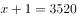，整理得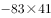，选项尾数不同考虑尾数法，尾数为，则尾数为3或8，只有C项满足。

故正确答案为C。

---

## 第 14 题　qid 2452811 · 数学运算

有8个不同颜色的小球，从中任意选出3个分给3个学生，每人1个，则其分法有：

- **A**. 72种
- **B**. 216种
- **C**. 336种　✅
- **D**. 1008种

**答案**：C

**官方解析**

从8个球中任选3个球，有种情况；将3个球分给3个学生，有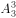种情况。分步用乘法，则共有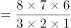种情况。

故正确答案为C。

---
