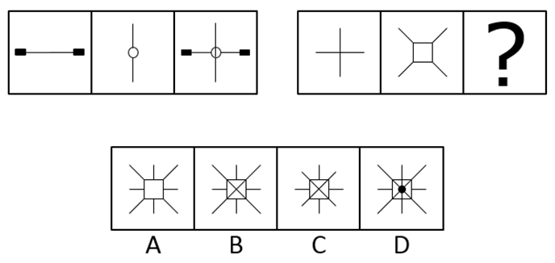
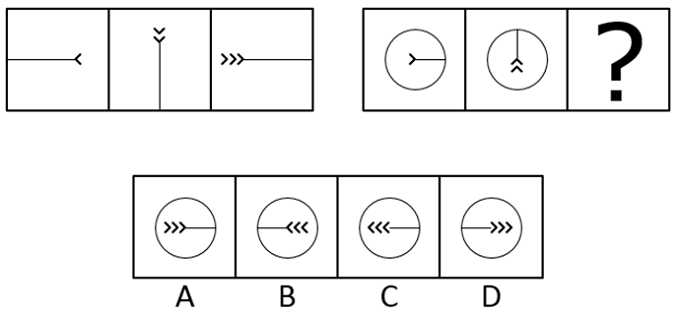
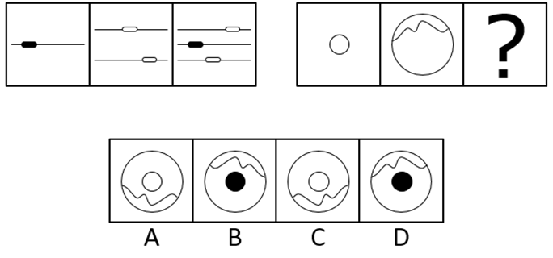
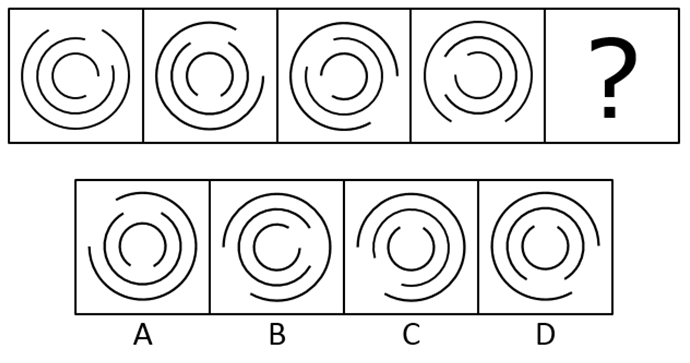
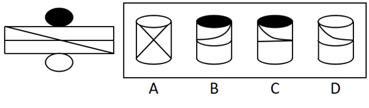
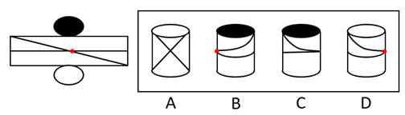

# 2016年3月四川省选调优秀大学生到基层工作考试 行政职业能力测验试卷（精选）

> 判断推理 · 30 题 · 四川 2016

## 第 1 题　qid 2262991 · 图形推理

从所给的四个选项中，选择最合适的一个填入问号处，使之呈现一定的规律性：

- **A**. A
- **B**. B　✅
- **C**. C
- **D**. D

**答案**：B

**官方解析**

元素组成相似，优先考虑样式规律。观察发现，第一组图中，第二个图叠加在第一个图之上，同时中间封闭空间内的线条与第二个图形封闭空间外部的线条相连，得到第三个图。第二组图应用规律，第二个图叠加在第一个图之上，同时中间封闭空间内的线条与第二个图形封闭空间外部的线条相连，得到B项图形。
故正确答案为B。

---

## 第 2 题　qid 2262993 · 图形推理

从所给的四个选项中，选择最合适的一个填入问号处，使之呈现一定的规律性：

- **A**. A
- **B**. B　✅
- **C**. C
- **D**. D

**答案**：B

**官方解析**

元素组成相同，优先考虑位置规律。观察发现，第一组图中，线条依次逆时针旋转，且线条尾端的小箭头依次增加一个。第二组图应用规律，线条依次逆时针旋转，且线条尾端的小箭头依次增加一个，得到B项图形。

故正确答案为B。

---

## 第 3 题　qid 2262995 · 图形推理

从所给的四个选项中，选择最合适的一个填入问号处，使之呈现一定的规律性：

- **A**. A　✅
- **B**. B
- **C**. C
- **D**. D

**答案**：A

**官方解析**

元素组成相似，优先考虑样式规律。观察发现，第一组图中，第二个图上下翻转后与第一个图相加得到第三个图。第二组图应用规律，第二个图上下翻转后与第一个图相加，得到A项图形。
故正确答案为A。

---

## 第 4 题　qid 2262997 · 图形推理

从所给的四个选项中，选择最合适的一个填入问号处，使之呈现一定的规律性：

- **A**. A
- **B**. B
- **C**. C
- **D**. D　✅

**答案**：D

**官方解析**

元素组成相同，优先考虑位置规律。观察发现，每个柱子依次向右平移1、2、3、？步，故？处应选择一个在第三个图形基础上向右平移4步得到的图形，对应D项。
故正确答案为D。

---

## 第 5 题　qid 2262999 · 图形推理

从所给的四个选项中，选择最合适的一个填入问号处，使之呈现一定的规律性：

- **A**. A
- **B**. B
- **C**. C　✅
- **D**. D

**答案**：C

**官方解析**

元素组成相同，优先考虑位置规律。观察发现，外圈的圆弧依次顺时针旋转60°，中间部分的圆弧依次逆时针旋转45°，内圈的圆弧依次顺时针旋转60°，对应C项图形。
故正确答案为C。

---

## 第 6 题　qid 2263001 · 图形推理

从所给的四个选项中，选择最合适的一个填入问号处，使之呈现一定的规律性：

- **A**. A
- **B**. B　✅
- **C**. C
- **D**. D

**答案**：B

**官方解析**

元素组成相似，优先考虑样式规律。九宫格优先横行看，第一行图形中，第一个图形和第三个图形求同得到第二个图形；经验证，第二行也满足此规律；第三行应用规律，只有B项符合规律。
故正确答案为B。

---

## 第 7 题　qid 2263004 · 图形推理

把下面的六个图形分为两类，使每一类图形都有各自的共同特征或规律，分类正确的一项是：

- **A**. ①②⑤  ③④⑥
- **B**. ①③⑤  ②④⑥
- **C**. ①④⑥  ②③⑤
- **D**. ①⑤⑥  ②③④　✅

**答案**：D

**官方解析**

元素组成不同，无明显属性规律，考虑数量规律。观察发现，图①⑤⑥的线条数依次为4、6、4，均为偶数，图②③④的线条数依次为5、3、7，均为奇数，即图①⑤⑥为一组，图②③④为一组，对应D项。
故正确答案为D。

---

## 第 8 题　qid 2263006 · 图形推理

把下面的六个图形分为两类，使每一类图形都有各自的共同特征或规律，分类正确的一项是：

- **A**. ①②④  ③⑤⑥
- **B**. ①③⑥  ②④⑤　✅
- **C**. ①④⑥  ②③⑤
- **D**. ①⑤⑥  ②③④

**答案**：B

**官方解析**

元素组成不同，无明显属性规律，考虑数量规律。观察发现，图①③⑥均有2条曲线为一组，图②④⑤均有1条曲线为一组，对应B项。
故正确答案为B。

---

## 第 9 题　qid 2263009 · 图形推理

把下面的六个图形分为两类，使每一类图形都有各自的共同特征或规律，分类正确的一项是：

- **A**. ①②③  ④⑤⑥
- **B**. ①③④  ②⑤⑥
- **C**. ①③⑤  ②④⑥
- **D**. ①④⑤  ②③⑥　✅

**答案**：D

**官方解析**

元素组成不同，无明显属性规律，考虑数量规律。观察发现，图①④⑤均有2个部分为一组，图②③⑥均有1个部分为一组，对应D项。
故正确答案为D。

---

## 第 10 题　qid 2263011 · 图形推理

左边给定的是纸盒的外表面，右边哪一项能由它折叠而成？

- **A**. A
- **B**. B
- **C**. C
- **D**. D　✅

**答案**：D

**官方解析**

将原图标注如下图，逐一进行分析

A项：根据展开图所示的线条，折叠后应有一条与上下边平行的弧线，与A项所示线条不一致，错误，排除；

B项：如上图所示，展开图中黑色顶面到标红交点之间竖向弧线的方向为左上到右下，与B项所示线条方向不一致，错误，排除；

C项：根据展开图所示的线条，横线折叠后应为一条与上下边平行的弧线，与C项所示线条不一致，错误，排除；

D项：如上图所示，展开图中白色顶面到标红交点之间竖向弧线的方向为左上到右下，与D项所示线条方向一致，正确，当选。

故正确答案为D。

---

## 第 11 题　qid 2263014 · 定义判断

正迁移也叫“助长性迁移”，是指一种学习对另一种学习起到积极的、促进的作用。
根据上述定义，下列中属于正迁移的是：

- **A**. 懂得英语的人很容易掌握法语　✅
- **B**. 地方方言对学习普通话有消极影响
- **C**. 语文学习不能区分一字多义、一字多音
- **D**. 在数学负数运算时错误使用正数的规则

**答案**：A

**官方解析**

第一步：找出定义关键词。
“一种学习对另一种学习”、“起到积极的、促进的作用”。
第二步：逐一分析选项。
A项：英语学习对法语学习能够起到积极的、促进的作用，符合“一种学习对另一种学习起到积极的、促进的作用”，符合定义，当选；
B项：方言的学习对普通话的学习起到消极的作用，不符合“起到积极的、促进的作用”，不符合定义，排除；
C项：只涉及一种学习内容，不符合“一种学习对另一种学习”，不符合定义，排除；
D项：只涉及一种学习内容，不符合“一种学习对另一种学习”，不符合定义，排除。
故正确答案为A。

---

## 第 12 题　qid 2263016 · 定义判断

职业倦怠，是一种由工作引发的心理枯竭现象，指个体在工作重压下产生的身心疲惫与耗竭的状态。
根据上述定义，下列中属于职业倦怠的是：

- **A**. 小王在连续打了两个小时羽毛球的情况下身心俱疲
- **B**. 小李最近一周都在加班，感觉身体吃不消，想要休息
- **C**. 老吴从事岗位工作已经10年了，长期的工作压力使得他对工作的热情下降，对前途感到无望　✅
- **D**. 老张才华横溢，工作能力强，但总是强迫其他同事以他为中心，同事们都觉得跟他共事很累

**答案**：C

**官方解析**

第一步：找出定义关键词。
“由工作引发的心理枯竭”，“工作重压下产生的身心疲惫与耗竭”。
第二步：逐一分析选项。
A项：打羽毛球，不符合“由工作引发的心理枯竭”，不符合定义，排除；
B项：小李是因为加班，身体吃不消，所以想要休息，并非由工作引发的心理枯竭，不符合定义，排除；
C项：长期工作压力使老吴对工作的热情下降，对前途无望，符合“由工作引发的心理枯竭”、也符合“工作重压下产生的身心疲惫与耗竭”，符合定义，当选；
D项：同事们感到压力是由老张引发的，不符合“由工作引发的心理枯竭”，不符合定义，排除。
故正确答案为C。

---

## 第 13 题　qid 2263018 · 类比推理

代位继承：是指有继承权的子女先于其父母死亡并有晚辈直系血亲的，其父母死后的遗产按法定继承方式继承时，先亡子女的晚辈直系血亲代替其继承地位，取得其应继承的遗产份额。
转继承：是指被继承人死亡后，遗产分割前，未放弃继承权的继承人也死亡的，其应得遗产份额转由他的继承人继承。
遗嘱继承：是按被继承人生前所立合法遗嘱继承遗产的继承方式。
典型例证：
（1）王某生前自书遗嘱一份，决定将其遗产的三分之一由父亲继承，另外三分之二由妻子和女儿继承。
（2）赵某的父亲死后，遗产分割前赵某暴病死亡，其本应继承父亲的20万元遗产，由赵某的妻子、子女、母亲继承。
（3）孙某死亡后，妻子李某继承他的遗产。
上述典型例证与定义存在对应关系的数目有：

- **A**. 0个
- **B**. 1个
- **C**. 2个　✅
- **D**. 3个

**答案**：C

**官方解析**

第一步：找出定义关键词。
代位继承：“有继承权的子女先于其父母死亡”、“有继承权的子女有晚辈直系血亲”、“先亡子女的晚辈直系血亲代替其继承地位取得其应继承的遗产份额”；
转继承：“被继承人死亡后，遗产分割前”、“未放弃继承权的继承人也死亡的”、“其应得遗产份额转由他的继承人继承”；
遗嘱继承：“按被继承人生前所立合法遗嘱继承遗产”。
第二步：逐一分析例证。
（1）按王某生前所立遗嘱继承遗产，符合遗嘱继承。
（2）赵某的父亲死后，遗产分割前，赵某死亡，其遗产由其妻子、子女、母亲继承，符合转继承。
（3）孙某妻子继承孙某遗产，不符合所给定义。
典型例证与定义存在对应关系的数目有2个。
故正确答案为C。

---

## 第 14 题　qid 2263024 · 定义判断

情感营销，就是把消费者的个人情感差异和需求作为企业品牌营销战略的中心，通过借助情感包装、情感促销、情感广告、情感口碑、情感设计等策略来实现企业的目标。它主要是和顾客、消费者之间的感情互动。
根据上述定义，下列属于情感营销的是：

- **A**. 某医院的主任医师经常受电视台邀请在电视节目中为广大市民讲解健康养生的方法
- **B**. 某楼盘在开盘前，开发商通过让有意购房者登记、交诚意金、张榜公布销售情况等方式，形成临时性缺货或只剩少数存量现象，造成楼市恐慌
- **C**. 某火锅店专注于服务细节，让每位顾客从进门到出门都体会到“五星级”的贴心服务，这种服务方式深深地打动了每位顾客　✅
- **D**. 某企业在西部地区通过“对原住民儿童的关怀教育”和“部落孩童助学计划”等公益活动，大大提高了自己的知名度和美誉度，树立了良好的企业形象

**答案**：C

**官方解析**

第一步：找出定义关键词。
“把消费者的个人情感差异和需求作为企业品牌营销战略的中心”、“主要是和顾客、消费者之间的感情互动”。
第二步：逐一分析选项。
A项：电视台不属于企业，且讲解健康养生的方法也不符合“和顾客、消费者之间的感情互动”，不符合定义，排除；
B项：开发商通过一系列策略造成楼市恐慌，不符合“和顾客、消费者之间的感情互动”，不符合定义，排除；
C项：火锅店让每位顾客都体会到“五星级”的贴心服务，符合“把消费者的个人情感差异和需求作为企业品牌营销战略的中心”，符合定义，当选；
D项：某企业通过公益活动树立了企业的良好形象，但不符合“和顾客、消费者之间的感情互动”，不符合定义，排除。
故正确答案为C。

---

## 第 15 题　qid 2263027 · 定义判断

蝴蝶效应：是指一个动力系统中，初始条件下微小的变化能带动整个系统的长期的巨大的连锁反应。
根据上述定义，下列中不宜用蝴蝶效应来解释的是：

- **A**. 君子慎始，差若毫厘，谬以千里
- **B**. 一个人小时候受到微小的心理刺激，长大后这个刺激会无限扩大
- **C**. 洛伦兹将仅仅相差0.0001的两个初始条件输入一个数学方程，结果得出的两条曲线不久就分道扬镳，相差甚远
- **D**. 一个干净的地方，人们不好意思丢垃圾，但一旦地上有垃圾出现时，人们就会毫不犹豫地开始丢弃垃圾，丝毫不觉羞愧　✅

**答案**：D

**官方解析**

第一步：找出定义关键词。
“初始条件下微小的变化”、“带动整个系统的长期的巨大的连锁反应”。
第二步：逐一分析选项。
A项：差若毫厘，谬以千里是指开始时虽然相差很微小，结果会造成很大的错误，符合“初始条件下微小的变化”、“带动整个系统的长期的巨大的连锁反应”，符合定义，排除；
B项：小时候受到微小的心理刺激，长大后这个刺激会无限扩大，符合“初始条件下微小的变化”、“带动整个系统的长期的巨大的连锁反应”，符合定义，排除；
C项：开始仅仅相差0.0001，最后得出的两条曲线分道扬镳，相差甚远，符合“初始条件下微小的变化”、“带动整个系统的长期的巨大的连锁反应”，符合定义，排除；
D项：一旦地上有垃圾时，人们就会开始丢弃垃圾，丝毫不觉羞愧，属于对不好的行为的效仿，不符合“初始条件下微小的变化”、“带动整个系统的长期的巨大的连锁反应”，不符合定义，当选。
本题为选非题，故正确答案为D。

---

## 第 16 题　qid 2263032 · 定义判断

发散思维又称“辐射思维”“放射思维”“多向思维”“扩散思维”“求异思维”，是指从一个目标出发，沿着各种不同的途径去思考，探求多种答案的思维。
根据上述定义，下列中属于发散思维的是：

- **A**. 某广告公司的设计员由“点”想到太阳、五子棋、球等，由“线”联系到一根绳子、一根头发、蚯蚓、电线等，由“面”想到海面、平原、足球场、宇宙等　✅
- **B**. 历史上东北发生了蝗虫灾害，某官员为研究治蝗之策，搜集了自战国以来有关蝗灾的资料
- **C**. 鲁班从野草叶子上锋利的齿和蝗虫大板牙上的小齿得到启示，经过反复实验，发明了锯子
- **D**. 某数学老师经过层层推理，终于证明了一道同学们证明不了的数学难题

**答案**：A

**官方解析**

第一步：找出定义关键词。
“从一个目标出发”、“沿着各种不同的途径去思考”、“探求多种答案的思维”。
第二步：逐一分析选项。
A项：由“点”“线”“面”出发，分别想到多种事物，符合“从一个目标出发”、“探求多种答案的思维”，符合定义，当选；
B项：从研治蝗虫之策出发，搜集关于蝗虫的资料，没有体现“沿着各种不同的途径去思考”，也没有体现“探求多种答案的思维”，不符合定义，排除；
C项：由带齿的叶子和蝗虫的牙得到启发发明锯子，没有体现“探求多种答案的思维”，不符合定义，排除；
D项：经过层层推理，证明数学难题，没有体现“沿着各种不同的途径去思考”，也没有体现“探求多种答案的思维”，不符合定义，排除。
故正确答案为A。

---

## 第 17 题　qid 2263035 · 类比推理

美术家：颜料：绘画

- **A**. 音乐家：钢琴：演奏　✅
- **B**. 文学家：书店：阅读
- **C**. 科学家：数据：实验
- **D**. 航海家：大海：航行

**答案**：A

**官方解析**

第一步：判断题干词语间逻辑关系。
美术家用颜料进行绘画，三者是主体、工具、行为的对应关系。
第二步：判断选项词语间逻辑关系。
A项：音乐家用钢琴进行演奏，三者是主体、工具、行为的对应关系，与题干逻辑关系一致，当选；
B项：文学家在书店进行阅读，三者是主体、地点、行为的对应关系，与题干逻辑关系不一致，排除；
C项：科学家用实验得出数据，数据是一种结果，三者是主体、结果、方式的对应关系，与题干逻辑关系不一致，排除；
D项：航海家在大海进行航行，三者是主体、地点、行为的对应关系，与题干逻辑关系不一致，排除。
故正确答案为A。

---

## 第 18 题　qid 2263037 · 类比推理

医生：患者：诊疗

- **A**. 乘警：乘客：购票
- **B**. 农民：农场：耕作
- **C**. 售货员：顾客：购物
- **D**. 服务员：食客：服务　✅

**答案**：D

**官方解析**

第一步：判断题干词语间逻辑关系。
医生诊疗患者，三者构成主谓宾结构。
第二步：判断选项词语间逻辑关系。
A项：乘警的工作对象是乘客，二者是对应关系，乘客购票，二者是主谓结构，与题干逻辑关系不一致，排除；
B项：农民在农场耕作，三者是主体、地点、行为的对应关系，与题干逻辑关系不一致，排除；
C项：售货员的工作对象是顾客，二者是对应关系，顾客购物，二者是主谓结构，与题干逻辑关系不一致，排除；
D项：服务员服务食客，三者构成主谓宾结构，与题干逻辑关系一致，当选。
故正确答案为D。

---

## 第 19 题　qid 2263038 · 类比推理

木材：木匠：家具

- **A**. 钢铁：冶炼：铁轨
- **B**. 食材：厨师：菜品　✅
- **C**. 陶土：窖口：陶器
- **D**. 果园：浇灌：果实

**答案**：B

**官方解析**

第一步：判断题干词语间逻辑关系。
木匠用木材制作家具，木匠是主体，木材与家具是原材料与成品的对应关系。
第二步：判断选项词语间逻辑关系。
A项：钢铁通过冶炼被制作铁轨，三者是原材料、工艺与成品的对应关系，与题干逻辑关系不一致，排除；
B项：厨师用食材制作菜品，厨师是主体，食材与菜品是原材料与成品的对应关系，与题干逻辑关系一致，当选；
C项：陶土在窑口中被制作成陶器，三者是原材料、加工地点与成品的对应关系，与题干逻辑关系不一致，排除；
D项：浇灌果园里的果树从而得到果实，果园是地点，浇灌是一种行为，果实是最终结果，与题干逻辑关系不一致，排除。
故正确答案为B。

---

## 第 20 题　qid 2263041 · 类比推理

通讯：手机：华为

- **A**. 航行：播音：飞机
- **B**. 运输：卡车：东风　✅
- **C**. 办公：电脑：佳能
- **D**. 商场：房屋：租赁

**答案**：B

**官方解析**

第一步：判断题干词语间逻辑关系。
手机可以用于通讯，二者是功能对应关系，华为是手机的一种品牌，二者是品牌对应关系。
第二步：判断选项词语间逻辑关系。
A项：飞机航行时可能需要播音，三者是对应关系，与题干逻辑关系不一致，排除；
B项：卡车可以用于运输，二者是功能对应关系，东风是卡车的一种品牌，二者是品牌对应关系，与题干逻辑关系一致，当选；
C项：电脑可以用于办公，二者是功能对应关系，但佳能不是电脑的一种品牌，二者不是品牌对应关系，与题干逻辑关系不一致，排除；
D项：商场属于房屋的一种，二者是种属关系，房屋可以用于租赁，二者是功能对应关系，与题干逻辑关系不一致，排除。
故正确答案为B。

---

## 第 21 题　qid 2263042 · 类比推理

中国：吴敬梓：《儒林外史》

- **A**. 法国：司汤达：《忏悔录》
- **B**. 印度：广博：《吉檀迦利》
- **C**. 西班牙：但丁：《神曲》
- **D**. 德国：歌德：《少年维特的烦恼》　✅

**答案**：D

**官方解析**

第一步：判断题干词语间逻辑关系。
吴敬梓是中国人，二者是国籍对应关系，吴敬梓是《儒林外史》的作者，二者是作者与作品的对应关系。
第二步：判断选项词语间逻辑关系。
A项：司汤达是法国人，二者是国籍对应关系，但《忏悔录》的作者是卢梭，二者不是作者与作品的对应关系，与题干逻辑关系不一致，排除；
B项：广博是古印度人，二者是国籍对应关系，但《吉檀迦利》的作者是泰戈尔，二者不是作者与作品的对应关系，与题干逻辑关系不一致，排除；
C项：但丁是意大利人，不是西班牙人，二者不是国籍对应关系，与题干逻辑关系不一致，排除；
D项：歌德是德国人，二者是国籍对应关系，歌德是《少年维特的烦恼》的作者，二者是作者与作品的对应关系，与题干逻辑关系一致，当选。
故正确答案为D。

---

## 第 22 题　qid 2263045 · 类比推理

列车员：火车

- **A**. 护士：医院　✅
- **B**. 旅客：轮船
- **C**. 程序员：编程
- **D**. 售货员：贩卖机

**答案**：A

**官方解析**

第一步：判断题干词语间逻辑关系。
列车员的工作地点是火车，二者是工作地点的对应关系。
第二步：判断选项词语间逻辑关系。
A项：护士的工作地点是医院，二者是工作地点的对应关系，与题干逻辑关系一致，当选；
B项：旅客可以在轮船上，但旅客不是一种职业，二者不是工作地点的对应关系，与题干逻辑关系不一致，排除；
C项：程序员的工作内容是编程，二者是工作内容的对应关系，与题干逻辑关系不一致，排除；
D项：售货员与贩售机的功能一致，二者是功能的对应关系，与题干逻辑关系不一致，排除。
故正确答案为A。

---

## 第 23 题　qid 2263047 · 类比推理

苦瓜：凉瓜

- **A**. 矮瓜：茄子　✅
- **B**. 四季豆：荟豆
- **C**. 菱白：高笋
- **D**. 黄花菜：汤肠菜

**答案**：A

**官方解析**

第一步：判断题干词语间逻辑关系。
苦瓜又称凉瓜，二者是全同关系。
第二步：判断选项词语间逻辑关系。
A项：矮瓜又称茄子，二者是全同关系，与题干逻辑关系一致，当选；
B项：四季豆又称芸豆，而非荟豆，与题干逻辑关系不一致，排除；
C项：高笋又称茭白，而非菱白，与题干逻辑关系不一致，排除；
D项：黄花菜又称忘忧草，而非汤肠菜，与题干逻辑关系不一致，排除。
故正确答案为A。

---

## 第 24 题　qid 2263049 · 类比推理

油墨：印刷：书籍

- **A**. 汽油：汽车：驱动
- **B**. 混凝土：建造：房屋　✅
- **C**. 药物：医生：疾病
- **D**. 运动员：比赛：成绩

**答案**：B

**官方解析**

第一步：判断题干词语间逻辑关系。
印刷书籍时需要油墨，三者是对应关系，且印刷书籍是动宾结构。
第二步：判断选项词语间逻辑关系。
A项：驱动汽车时需要汽油，但汽车与驱动的顺序反了，与题干逻辑关系不一致，排除；
B项：建造房屋时需要混凝土，三者是对应关系，且建造房屋是动宾结构，与题干逻辑关系一致，当选；
C项：医生治疗疾病时需要药物，但医生与疾病是主宾结构，与题干逻辑关系不一致，排除；
D项：运动员比赛时会有成绩，且比赛成绩是偏正结构，与题干逻辑关系不一致，排除。
故正确答案为B。

---

## 第 25 题　qid 2263052 · 逻辑判断

想成为医生的同学都会报考医学专业，王刚报考医学专业，那么他一定是想成为一名医生。
下述(  )项为真，最能支持上述论断。

- **A**. 有些医生是心理专业的毕业生
- **B**. 想成为医生的同学不一定非得报考医学专业
- **C**. 所有报考医学专业的同学都想成为一名医生　✅
- **D**. 只有医学专业毕业的同学，才有资格成为医生

**答案**：C

**官方解析**

第一步：找出论点和论据。
论点：王刚想成为一名医生。
论据：王刚报考医学专业。
第二步：逐一分析选项。
A项：有些医生是心理专业毕业生，与题干讨论的报考医学专业是否能得出想成为医生无关，是无关项，排除；
B项：想成为医生的同学不一定非得报医学专业，指出论点与论据不一定具有必然联系，是削弱项，排除；
C项：翻译为报考医学专业→想成为一名医生，建立了论据与论点之间的必然联系，是搭桥项，当选；
D项：翻译为有资格成为医生→医学专业，与题干讨论的报考医学专业是否能得出想成为医生无关，是无关项，排除。
故正确答案为C。

---

## 第 26 题　qid 2263053 · 逻辑判断

某公司举办羽毛球比赛，公司员工甲、乙和丙三人最多有两个人不能参加此项目比赛。
由此可得出：

- **A**. 甲、乙和丙三人都有机会参加比赛　✅
- **B**. 如果甲参加比赛，那么乙和丙都不能参加比赛
- **C**. 如果甲和乙都参加了比赛，那么丙就不能参加比赛
- **D**. 如果甲没有参加比赛，那么乙和丙都可以参加比赛

**答案**：A

**官方解析**

第一步：翻译题干。
“三人最多有两个人不能参加比赛”，即三个人至少有一人参加比赛。
第二步：逐一分析选项。
A项：三个人至少有一人参加比赛，说明甲、乙和丙三人都有机会参加比赛，可以得出，当选；
B项：如果甲参加比赛，根据题干条件，无法确定其他两人是否参加，排除；
C项：如果甲和乙都参加了比赛，根据题干条件，无法确定丙是否参加，排除；
D项：如果甲没有参加比赛，根据题干条件，只能得出乙和丙至少有一人参加比赛，无法得出两人都参加比赛，排除。
故正确答案为A。

---

## 第 27 题　qid 2263056 · 逻辑判断

近期猪肉价格有所回落，但不能因此减少对生猪饲养的关注，要保证猪肉价格的稳定就必须在其价格最低的时候下工夫，只有在这时保护养殖户的积极性，让其不退出生产，才能最终保持猪肉价格稳定。
据此，可以推出：

- **A**. 只要关注生猪，就能保护养殖户们的生产积极性
- **B**. 如果养殖户们退出生产，那么就不能保证猪肉价格不上涨　✅
- **C**. 只要关注生猪饲养，那么就能保证猪肉价格不上涨
- **D**. 只有在猪肉价格最低的时候，保护养殖户们的生产积极性才最有效

**答案**：B

**官方解析**

第一步：翻译题干。

①保证猪肉价格的稳定在其价格最低的时候下工夫

②最终保持猪肉价格稳定保护养殖户的积极性，让其不退出生产

第二步：逐一分析选项。

A项：翻译为关注生猪保护养殖户们的生产积极性，根据题干条件，关注生猪无法推出保护养殖户们的生产积极性，排除；

B项：翻译为养殖户们退出生产猪肉价格上涨，养殖户们退出生产是对条件②的否后，否后必否前，可以推出猪肉价格不稳定，即会上涨，当选；

C项：翻译为关注生猪饲养保证猪肉价格不上涨，根据题干条件，关注生猪无法推出猪肉价格不上涨，排除；

D项：翻译为最有效猪肉价格最低时保护养殖户们的生产积极性，题干中未提及最有效，属于无中生有，排除。

故正确答案为B。

---

## 第 28 题　qid 2263059 · 逻辑判断

某市公安局发布工作人员招聘公告，要求如下：具有研究生学历或者两年及以上基层工作经历。招聘方式分笔试和面试，只有笔试达到60分及格线的才能参加面试。
据此可判断：

- **A**. 进入面试的考生全部都具有研究生学历
- **B**. 小李未进入面试，他肯定不具备研究生学历
- **C**. 小刘进入了面试，他一定具有两年以上的基层工作经验
- **D**. 进入面试的考生可能具有研究生学历和两年及以上基层工作经验　✅

**答案**：D

**官方解析**

第一步：翻译题干。

①参加招聘具有研究生学历或者两年及以上基层工作经历

②参加面试笔试达到60分及格线

第二步：逐一分析选项。

A项：进入面试说明一定可以参加招聘，根据条件①，只能推出研究生学历和两年及以上基层工作经历至少有一个成立，无法推出都具有研究生学历，排除；

B项：小李没进入面试，是对条件②的否前，否前无必然性结论，排除；

C项：小刘进入面试说明一定可以参加招聘，根据条件①，只能推出研究生学历和两年及以上基层工作经历至少有一个成立，无法推出一定具有两年以上的基层工作经验，排除；

D项：进入面试说明一定可以参加招聘，根据条件①，可以推出可能具有研究生学历和两年及以上基层工作经验，当选。

故正确答案为D。

---

## 第 29 题　qid 2263062 · 逻辑判断

有些男士吸烟，所有男士都喜欢运动。

据此，可推出：

- **A**. 有些吸烟的男士喜欢运动　✅
- **B**. 有些喜欢运动的男士不吸烟
- **C**. 有些男士不吸烟，但喜欢运动
- **D**. 有些男士吸烟，但不喜欢运动

**答案**：A

**官方解析**

第一步：翻译题干。

①有些男士吸烟 

②男士喜欢运动

将条件①换位得到：有些吸烟男士

可以递推出：③有些吸烟男士喜欢运动

第二步：逐一分析选项。

A项：翻译为有些吸烟的男士喜欢运动，有些吸烟的男士是对条件③的肯前，肯前必肯后，可以推出喜欢运动，当选；

B项：翻译为有些喜欢运动的男士吸烟，有些喜欢运动的男士是对条件③的肯后，肯后无必然性结论，排除；

C项：翻译为有些男士吸烟且喜欢运动，是对条件①和②的肯前，肯前必肯后，可以推出吸烟且喜欢运动，而非吸烟，排除；

D项：翻译为有些男士吸烟 且 喜欢运动，是对条件①和②的肯前，肯前必肯后，可以推出吸烟且喜欢运动，而非喜欢运动，排除。

故正确答案为A。

---

## 第 30 题　qid 2263096 · 逻辑判断

某地的一个花园小区在2013年以前经常发生盗窃事件，在该小区业主强烈要求下，2013年该小区的物业管理部门在各个路段安装了摄像头，结果该花园小区的盗窃事件发生率明显下降。于是有小区业主说：“在各个路段安装摄像头对防治盗窃事件的发生起到了很大作用。”
下列（    ）项为真，最能加强上述结论。

- **A**. 当地的另外一个小区也在各个路段安装了摄像头，但却时常发生盗窃事件
- **B**. 从2013年开始，当地各个小区物业管理部门加强了保安巡逻，盗窃案件有所减少
- **C**. 另一个时常发生盗窃的小区，采取了其他不同的防盗措施，也起到了一定的效果
- **D**. 从2013年开始，该地区的盗窃案件有明显上升的趋势　✅

**答案**：D

**官方解析**

第一步：找出论点和论据。
论点：在各个路段安装摄像头对防治盗窃事件的发生起到了很大作用。
论据：2013年该小区的物业管理部门在各个路段安装了摄像头，结果该花园小区的盗窃事件发生率明显下降。
第二步：逐一分析选项。
A项：举例说明安装摄像头也无法防治盗窃，削弱了论点，排除；
B项：加强保安巡逻后，减少了盗窃，与题干讨论的安装摄像头是否能防治盗窃无关，是无关项，排除；
C项：另一个小区采取其他措施得到一定的效果，与题干讨论的安装摄像头是否能防治盗窃无关，是无关项，排除；
D项：该地区2013年开始盗窃案件明显上升，但是该小区的盗窃案却减少了，说明摄像头确实起到了作用，补充论据加强，当选。
故正确答案为D。

---
