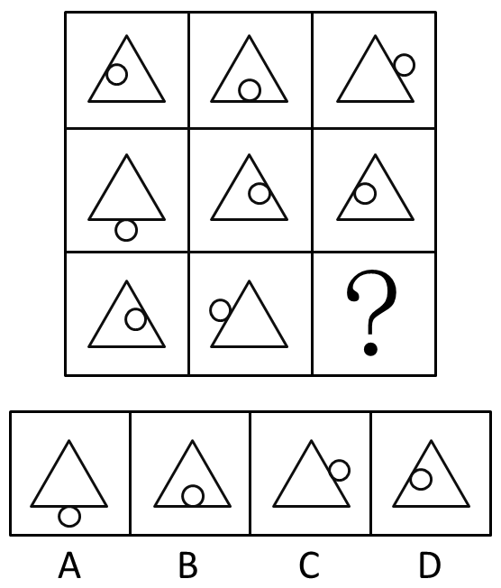
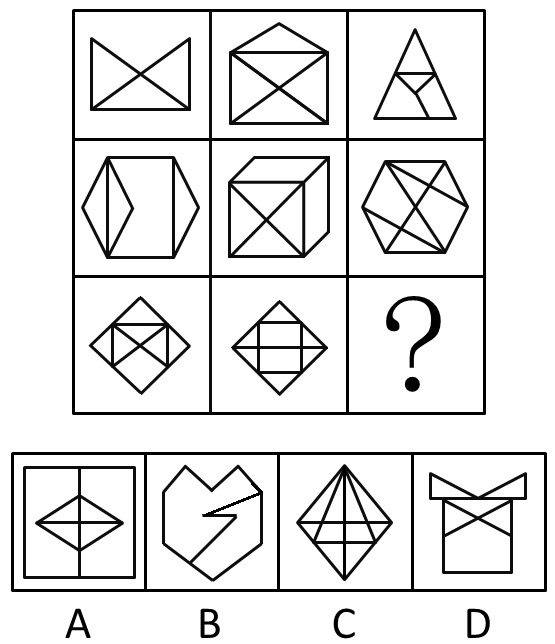
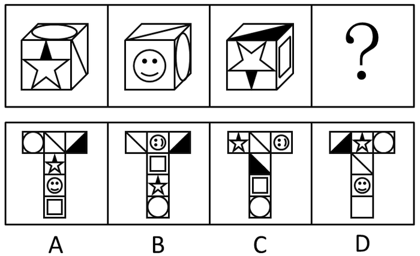
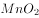
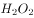
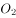
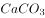
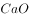
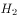

# 2016年423联考《行测》题（新疆兵团网友回忆版）

> 判断推理 · 35 题 · 新疆 2016

## 第 1 题　qid 1796366 · 图形推理

从所给四个选项中，选择最合适的一个填入问号处，使之呈现一定的规律性：

- **A**. A
- **B**. B　✅
- **C**. C
- **D**. D

**答案**：B

**官方解析**

图形元素组成相同，优先考虑位置规律。九宫格优先横向观察，观察第一行发现“○”绕着三角形的边逆时针每次移动一条边，第二行验证此规律成立，因此问号处的“○”应在三角形下面的那条边上，排除C、D两项。观察A、B两项发现，“○”所处的位置不同，一个在三角形外部，一个在三角形内部，因此应考虑两个元素之间的位置关系。经观察发现前两行中都有两个图形“○”位于三角形内部，一个图形“○”位于三角形外部，因此问号处的“○”应于三角形的内部，排除A项。
故正确答案为B。

---

## 第 2 题　qid 1796138 · 图形推理

从所给四个选项中，选择最合适的一个填入问号处，使之呈现一定的规律性：

- **A**. A
- **B**. B　✅
- **C**. C
- **D**. D

**答案**：B

**官方解析**

图形元素组成相似，同一个元素不止一次出现，优先考虑遍历。图形都是由内外两个图形组成，优先考虑分开看。外部图形的形状分别为○、◇、□、○、◇，形状遍历，最后问号处应为□，排除A、C两项；B、D两项内部图形形状相同，区别在于颜色，而题干内部图形的颜色分别是黑、白、阴影、黑、白，颜色遍历，最后一幅应该是阴影，排除D项。
故正确答案为B。

---

## 第 3 题　qid 1796430 · 图形推理

把下面的六个图形分为两类，使每一类图形都有各自的共同特征或规律，分类正确的一项是：

- **A**. ①②③，④⑤⑥
- **B**. ①④⑤，②③⑥
- **C**. ①④⑥，②③⑤
- **D**. ①③⑤，②④⑥　✅

**答案**：D

**官方解析**

本题为分组分类题目。观察发现，每幅图形均有一个小三角形和一个小正方形，优先考虑功能元素。图①③⑤中只有小三角形在两个图形相交区域内，图②④⑥中小三角形和小正方形均在两个图形的相交区域内，因此①③⑤为一组，②④⑥为一组。
故正确答案为D。

---

## 第 4 题　qid 1797874 · 图形推理

从所给四个选项中，选择最合适的一个填入问号处，使之呈现一定的规律性：

- **A**. A　✅
- **B**. B
- **C**. C
- **D**. D

**答案**：A

**官方解析**

考查图形的总点数，第一横行总点数为：5、6、7，第二横行总点数为：7、8、9，第三横行总点数为9、10、11，因此排除C、D两项，而且所有图形内部都有三角形，排除B项，选择A项。
故正确答案为A。

---

## 第 5 题　qid 1796364 · 图形推理

从所给四个选项中，选择最合适的一个填入问号处，使之符合所给的题干所示：

- **A**. A
- **B**. B
- **C**. C　✅
- **D**. D

**答案**：C

**官方解析**

观察题干和选项可知，五角星面是一个特殊的面，由第一个图形可以发现五角星黑色尖端部位所指向的面是“○”的面，选项A中五角星黑色尖端部位所指向的面是“\”面，排除；选项B中五角星黑色尖端部位所指向的面是“□”面，排除；选项D中五角星黑色尖端部位所指向的面是“空白面”，排除。
故正确答案为C。

---

## 第 6 题　qid 1796308 · 定义判断

博喻又称连比，就是用几个喻体从不同角度反复设喻去说明一个本体。博喻运用得当，能给人留下深刻的印象。运用博喻能加强语意，增添气势。博喻能将事物的特征或事物的内涵从不同侧面、不同角度表现出来，这是其他类型的比喻所无法达到的。
根据上述定义，下列属于博喻的是：

- **A**. 这个整天同钢铁打交道的技术员，他的心倒不像钢铁那样
- **B**. 桃花潭水深千尺，不及汪伦送我情
- **C**. 上海人叫小瘪三的那批角色，也很像我们的党八股，干瘪得很，样子十分难看
- **D**. 试问闲愁都几许？一川烟草，满城风絮，梅子黄时雨　✅

**答案**：D

**官方解析**

第一步：找出定义关键词。
“用几个喻体从不同角度反复设喻去说明一个本体”。
第二步：逐一分析选项。
A项：“他的心倒不像钢铁那样”是用钢铁来比喻心，只涉及一个喻体，不符合“用几个喻体从不同角度反复设喻去说明一个本体”，不符合定义，排除；
B项：意思是看那桃花潭水，纵然深有千尺，也比不上汪伦送我之情，是将潭水深度与感情进行比较，不存在比喻，不符合“用几个喻体从不同角度反复设喻去说明一个本体”，不符合定义，排除；
C项：上海人叫小瘪三的那批角色很像党八股，是用党八股来比喻小瘪三，只涉及一个喻体，不符合“用几个喻体从不同角度反复设喻去说明一个本体”，不符合定义，排除；
D项：意思是要问我的忧伤有多深多长。就像烟雨一川青草，就像随风飘转的柳絮，梅子黄时的雨水，无边无际。用“一川烟草”“满城风絮”“梅子黄时雨”来比喻“闲愁”，符合“用几个喻体从不同角度反复设喻去说明一个本体”，符合定义，当选。
故正确答案为D。

---

## 第 7 题　qid 2114644 · 定义判断

红叶子理论认为，一个人职业的成功不在于红叶子数目的多少，而在于他是否具备一片特别硕大的红叶子，这片特别硕大的红叶子不是与生俱来的，需要根据个人优势不断努力才能获得。
根据上述定义，下列哪项能用红叶子理论解释？

- **A**. 小刘虽然偶尔迟到，但对工作尽职尽责、富有团队精神
- **B**. 小张本科学习数学专业，但是他觉得数学专业比较枯燥，所以他选择攻读经济学硕士
- **C**. 小李的销售能力和财务水平一般，但对市场特别敏感，他努力发展这方面优势，最后成了一名企业家　✅
- **D**. 小文是英语系学生，但口语不太好，她辅修了国际法方面的课程，最后成了一名出色的律师

**答案**：C

**官方解析**

第一步：找到定义关键词。
关键词为“职业的成功在于他具有一片特别硕大的红叶子”、“需要靠个人优势不断努力获得”。
第二步：逐一分析选项。
A项：小刘对工作尽职尽责，富有团队精神，没有体现出这是他的个人优势，也没体现出他在不断努力，不符合定义，排除；
B项：小张觉得数学专业枯燥选择了读经济学硕士，没有体现出他的个人优势，也没体现出个人的不断努力，不符合定义，排除；
C项：小李销售水平一般，但是对市场特别敏感，体现了他的个人优势，对市场敏感，同时他努力发展优势体现了他个人不断努力，能用红叶子理论解释，当选；
D项：小文是英语系学生，口语不好，辅修国际法方面的课程最后成为出色律师，说的是虽然有劣势，但是成功了，并没有体现出他的个人优势和特色，不符合定义，排除。
故正确答案为C。

---

## 第 8 题　qid 2114582 · 定义判断

择一的因果关系是指两个或者两个以上的行为人都实施了可能对他人造成损害的危险行为，并且已经造成了损害结果，但是无法确定其中谁是加害人。
根据上述定义，下列存在择一的因果关系的是：

- **A**. 甲、乙两人在搬卸货物过程中因操作不当，造成货物损坏
- **B**. 甲在乙的饮水中下毒，乙喝下后在毒发前又因琐事与丙发生争吵，丙一怒之下用刀刺死了乙
- **C**. 甲、乙共同绑架了丙，甲负责向丙的家人索要赎金，乙为避免被丙认出，将丙残忍杀害
- **D**. 甲、乙、丙三人带着相同的猎枪和子弹外出狩猎，甲、乙看到一只猎物出现在丙附近，二人同时开枪，结果其中一枪打中了丙　✅

**答案**：D

**官方解析**

第一步：找到定义关键词。
关键词为“两个或两个以上的行为人”、“实施了可能对他人造成损害的行为”、“已经造成了损害结果”、“无法确定其中谁是加害人”。
第二步：逐一分析选项。
A项：甲和乙共同搬卸货物造成损坏，货物不是人，题干说的是对他人造成伤害，不符合定义，排除；
B项：乙是在毒发前被丙用刀刺死，丙是确定的加害人，不符合定义，排除；
C项：将丙残忍杀害的是乙，乙是确定的加害人，不符合定义，排除；
D项：甲乙同时开枪，其中一枪打中了丙，无法确定是谁打中的，符合“已经造成了损害结果”、“无法确定其中谁是加害人”，符合定义，当选。
故正确答案为D。

---

## 第 9 题　qid 1796382 · 定义判断

不规则需求是指某些物品或者服务的市场需求在不同季节，或一周不同日子，甚至一天不同时间上下波动很大的一种需求状况。
根据上述定义，下列哪项属于不规则需求？

- **A**. 早晚高峰期出租车供不应求　✅
- **B**. 某品牌牙刷分为软、硬、中三种以面向不同消费者
- **C**. 某电商店庆打折，活动当天点击量剧增
- **D**. 某博物馆引进一批梵高画作巡展，游客蜂拥而至

**答案**：A

**官方解析**

第一步：找到定义关键词。
关键词为“某些物品或者服务的市场需求”、“不同季节，或一周不同日子，甚至一天不同时间”、“上下波动很大”。
第二步：逐一分析选项。
A项：早晚高峰期出租车供不应求，即出租车服务的市场需求在一天的不同时间上下波动很大，符合定义，当选；
B项：只提到牙刷品牌对牙刷分类，并未提到消费者的反应如何，也不存在需求上下波动，不符合定义，排除；
C项：“店庆打折，活动当天点击量剧增”说明这种打折服务的市场需求很大，并未体现出需求上下波动，不符合定义，排除；
D项：“博物馆引进梵高画作后游客蜂拥而至”说明人们对欣赏梵高画作的需求很大，并未体现出需求上下波动，不符合定义，排除。
故正确答案为A。

---

## 第 10 题　qid 1797838 · 定义判断

企业从银行或海外取得外汇借款后并不是直接使用外汇资金，而是将外汇结汇给银行，取得人民币资金加以使用，这种现象称之为贷款替代。
根据上述定义，下列哪项属于贷款替代？

- **A**. 人民币升值后，一些企业纷纷减少人民币负债，增加外汇负债，然后再用人民币进行投资　✅
- **B**. 国内经济过热，商业银行对人民币贷款的发放从紧。某贸易公司出于财务考虑转向外资银行贷款，获得外币资金
- **C**. 王明觉得人民币利率高于美元，因此他申请美元贷款，然后将外汇结汇给银行，从而获得人民币资金
- **D**. 小宇出国旅游前去银行兑换了一些外币，到国外后他使用信用卡结算，回国后用人民币还款

**答案**：A

**官方解析**

第一步：找出定义关键词。
“企业”、“不是直接使用外汇资金”、“取得人民币资金加以使用”。
第二步：逐一分析选项。
A项：一些企业增加外汇负债，然后再用人民币进行投资，符合不直接使用外汇资金，而是取得人民币加以使用，符合定义，当选；
B项：某贸易公司获得外币资金，但并没有转换为人民币加以使用，不符合定义，排除；
C项：主体是王明，不符合定义主体企业，不符合定义，排除；
D项：主体是小宇，不符合定义主体企业，不符合定义，排除。
故正确答案为A。

---

## 第 11 题　qid 2114604 · 定义判断

生物学研究发现，成群的蚂蚁中，大部分蚂蚁很勤劳，寻找、搬运食物争先恐后，少数蚂蚁却东张西望不干活。当食物来源断绝或蚁窝被破坏时，那些勤快的蚂蚁一筹莫展。“懒蚂蚁”则“挺身而出”，带领众伙伴向它早已侦察到的新的食物源转移。这就是所谓的懒蚂蚁效应。
根据上述定义，下列属于懒蚂蚁效应的是：

- **A**. 某经理用人不拘一格，看重的是坚韧和正直，而非学历背景
- **B**. 某汽车公司鼓励员工创新，允许员工在上班时间钻研技术
- **C**. 通信工程师待遇优厚，工作时间自由，擅长攻克技术难题　✅
- **D**. 在金融危机中，某外贸公司凭借多元化经营手段渡过了难关

**答案**：C

**官方解析**

第一步：找到定义关键词。
该定义类似寓言，需理解含义：懒蚂蚁是指没有做本来该做的工作，看似东张西望不干活，但实际上是侦查新的食物来源，解决面临的困难。
简单说，就是平时看似没干活，但在关键时刻可以通过创新来解决困难。
第二步：逐一分析选项。
A项：说的是经理的用人标准，并没有涉及员工如何工作，是否干了本职工作之外的创新工作，不符合定义，排除；
B项：“允许员工在上班时间钻研技术”说明员工上班时间可以不做本来该做的工作，而去进行钻研创新，但这只是公司的规定，员工是否真的会这样去做，尚不确定，而且员工能否钻研出新的成果，选项也没有提到，与C项明确指出工程师“擅长攻克技术难题”相比，表述不够明确，不符合定义，排除；
C项：工程师“工作时间自由，擅长攻克难题”，说明工程师的工作环境相对宽松，主要工作就是解决一般员工难以解决的问题，与“懒蚂蚁”相似，看似东张西望不干活，但当出现紧急情况时，可以挺身而出解决困难，符合定义，当选；
D项：并未提到员工如何工作，是否干了本职工作之外的创新工作，不符合定义，排除。
故正确答案为C。

---

## 第 12 题　qid 2114614 · 定义判断

“气候难民”指的是生存因气候变暖等特殊气候因素而受到威胁的人们，这是一个逐渐扩大的族群。某基金会发表的一份报告称，在未来40年，全球约5到6亿人都面临着沦为“气候难民”的危险。
下列描述中被迫迁移的人们，不属于“气候难民”的是：

- **A**. 卡特里娜飓风使得墨西哥海岸的众多居民逃离家乡
- **B**. 印度洋海啸导致了印度、泰国等多国居民被迫迁移　✅
- **C**. 土地沙漠化使曾经繁荣的楼兰古国消亡，国民外迁
- **D**. 海平面上涨使马尔代夫领导人为国民另觅栖身之所

**答案**：B

**官方解析**

第一步：找到定义关键词。
关键词为“气候变暖”、“导致生存受到威胁”、“逐渐扩大的人群”。
第二步：逐一分析选项。
A项：卡特里娜飓风是由于特殊气候因素引起的，同时众多居民逃离家乡是一种生存威胁，属于“气候难民”，排除；
B项：印度洋海啸不是由气候因素引起的，一般是由地震或者气象变化产生的破坏性波浪，不属于“气候难民”，为正确答案，当选；
C项：土地沙漠化是由于气候变异或者人类活动引起的，属于“气候难民”，排除；
D项：海平面上涨是由于气候因素引起的，导致国民生存受到威胁，符合定义，排除。
本题为选非题，故正确答案为B。

---

## 第 13 题　qid 1796272 · 定义判断

精益生产是通过系统结构、人员组织、运行方式和市场供求等方面的变革，最大限度地消除浪费和降低库存以及缩短生产周期，力求实现低成本准时生产的技术，其最终目的是通过流程整体优化、均衡物流、高效利用资源、消灭一切库存和浪费，达到用最少的投入向顾客提供最完美价值的目的。
根据上述定义，下列属于精益生产的是：

- **A**. 为了抢占市场，甲公司不断提高空间利用率
- **B**. 乙公司投入了大量资金以缩短其产品生产周期
- **C**. 丙公司的强大供货体系保证它能随时满足客户
- **D**. 丁公司充分发挥自身优势建立了超快的物流系统　✅

**答案**：D

**官方解析**

第一步：找到定义关键词。
题干中精益生产的方式是“通过系统结构、人员组织、运行方式和市场供求等方面的变革”，目的是“整体优化、均衡物流、高效利用资源”，达到“最少的投入向顾客提供最完美的价值”。
第二步：逐一分析选项。
A项：题干中的目的是为顾客提供最完美的价值，A项中的目的是抢占市场，不符合定义，排除；
B项：题干中的方式是通过系统结构、人员组织、运行方式和市场供求等方面，B是通过资金的调整，不符合定义，排除；
C项：只说到有强大的供货体系，但是这个供货体系是否经过各方面的变革，是否是最优化的并没有提及，该选项不够明确；
D项：充分发挥自身优势就是对公司优势资源的高效利用，建立超快物流体系符合“均衡物流，高效利用资源”，符合定义。
C、D两项比较而言，D项更加明确地体现了对优势资源的充分利用，实现了均衡物流、高效利用资源的效果。
故正确答案为D。

---

## 第 14 题　qid 1796380 · 定义判断

诱发运动是指由于一个物体的运动使其相邻的一个静止物体产生运动的错觉现象。
根据上述定义，下列属于诱发运动的是：

- **A**. 在黑板前点燃一支蜡烛，并注视着烛光会看到烛光在运动
- **B**. 多张图片按一定空间间隔与时间距离相继呈现形成电影
- **C**. 注视瀑布的某一处，再看周围的树木，会觉得树木在向上飞升
- **D**. 当我们注视夜空时，会看到月亮在动，而云是静止的　✅

**答案**：D

**官方解析**

第一步：找到定义关键词。
“由于一个物体的运动”、“使其相邻的一个静止物体产生运动的错觉”。
第二步：逐一分析选项。
A项：烛光本来就会随风摇动，并不存在让一个静止的物体产生运动的错觉，不符合“使其相邻的一个静止物体产生运动的错觉”，不符合定义，排除；
B项：电影的动态画面是多张图片连续切换的结果，而不是一个物体的运动使相邻静止的物体产生运动的错觉，不符合“由于一个物体的运动”、“使其相邻的一个静止物体产生运动的错觉”，不符合定义，排除；
C项：在注视瀑布后，瀑布向下运动的影像会暂时留在视网膜上，当视线转移到静止的树木时，大脑会误判为树木在向上运动，是运动后效。之所以会觉得树木朝着瀑布向上飞升，原因是长时间注视，不符合“使其相邻的一个静止物体产生运动的错觉”，不符合定义，排除；
D项：注视夜空时会看到月亮在动，而云是静止的，之所以出现这种情况是因为云在运动，给人产生了错觉误以为月亮在运动，符合“由于一个物体的运动”、“使其相邻的一个静止物体产生运动的错觉”，符合定义，当选。
故正确答案为D。

---

## 第 15 题　qid 1797866 · 定义判断

化学中的自发反应是指在给定条件下不需要外加能量就能自动进行的反应。在自发反应过程中有可能需要外加能量，但外加能量的目的不是改变“给定条件”，而是维持“给定条件”。
根据上述定义，下列不属于自发反应的是：

- **A**. 
作催化剂加入中，发生催化反应，产生和

- **B**. 
100kPa条件下，将加热到900℃，分解生成和

- **C**. 
在通电的情况下产生和
　✅
- **D**. 
植物在光照条件下发生光合作用

**答案**：C

**官方解析**

A选项中的催化剂，B选项中的加热，C选项中的通电，D选项中的光合作用，都是外加能量，要想选一个不属于“自发反应”的选项，根据题干，需要判定哪一个外加能量属于改变条件，而非维持条件。比较四个外加能量，催化剂是用来加速催化的，而光合、加热和通电相比，只有“通电”是无法自然形成的，相比较而言更属于改变条件的范畴。
本题为选非题，故正确答案为C。
注：从化学常识角度而言，其实B项的加热，D项的光合作用在某些情况下也属于非自发反应，但是通电一定不属于自发反应，只要通电停止，反应也会立刻停止。也就是说，BD有可能符合定义，也有可能不符合定义，但是C一定不符合定义，故相比较而言，正确答案也是C选项。

---

## 第 16 题　qid 1796410 · 类比推理

黄连：苦涩

- **A**. 班级：团结
- **B**. 钻石：坚硬　✅
- **C**. 花朵：鲜红
- **D**. 城市：繁华

**答案**：B

**官方解析**

第一步：分析题干词语间的逻辑关系。
黄连是一种草本植物，其味入口一定是极苦，因此苦涩是黄连的一种必然属性。
第二步：逐一分析选项。
A选项：班级可能团结可能不团结，不是一种必然属性关系，与题干逻辑不符，排除；
B选项：钻石是指经过琢磨的金刚石。金刚石在天然矿物中的硬度最高，因此坚硬是钻石的必然属性，与题干逻辑关系一致，为正确答案，当选；
C选项：鲜红是花朵的属性，但花朵不一定是鲜红的，花朵的颜色可以多样，不是必然属性，与题干逻辑不符，排除；
D选项：城市不一定繁华，不是一种必然属性关系，与题干逻辑不符，排除。
故正确答案为B。

---

## 第 17 题　qid 1796426 · 类比推理

（　）　对于　熟练　相当于　敏捷　对于　（　）

- **A**. 娴熟　灵敏　✅
- **B**. 操作　迅捷
- **C**. 熟悉　迅速
- **D**. 谙熟　灵动

**答案**：A

**官方解析**

将选项逐一代入。
A项：娴熟是指很熟练，二者为近义关系，且前者是对后者程度的加深，敏捷是指灵敏快捷，与灵敏为近义关系，且前者是对后者程度的加深，前后逻辑关系一致，当选；
B项：熟练可以形容操作，敏捷与迅捷是近义关系，前后逻辑关系不一致，排除；
C项：熟悉指了解得清楚，清楚地知道，而熟练程度要比熟悉更重一些，后比前重。敏捷是指灵敏快捷，所以敏捷程度要比迅速更重一些，这里前比后重。所以二组词顺序反了，前后逻辑关系不一致，排除；
D项：谙熟指熟悉、了解，程度要比熟练轻。敏捷是指灵敏迅速，灵动多指活泼，敏捷和灵动没有关系，前后逻辑关系不一致，排除。
故正确答案为A。

---

## 第 18 题　qid 1796408 · 类比推理

麻雀：动物：生物链

- **A**. 豆浆：早餐：豆制品
- **B**. 开水：纸杯：便利品
- **C**. 发卡：首饰：妆扮品　✅
- **D**. 钢笔：电脑：办公品

**答案**：C

**官方解析**

第一步：分析题干词语间的逻辑关系。
题干麻雀属于动物，二者为种属关系，生物链指的是由动物、植物和微生物互相提供食物而形成的相互依存的链条关系。麻雀和动物都属于生物链的一部分。
第二步：逐一分析选项。
A项：豆浆可以作为早餐食用，但二者并非种属关系，并且早餐不是豆制品的组成部分，与题干逻辑不符，排除；
B项：开水不属于纸杯，二者不是种属关系，与题干逻辑不符，排除；
C项：发卡是首饰的一种，二者为种属关系，发卡和首饰都属于妆扮品，分别与妆扮品构成种属关系，而题干是组成关系，对应关系并不完全一致，但是相比于其他选项，种属关系和组成关系都是包容关系，所以该项更合适，当选；
D项：钢笔和电脑都属于办公品，但是钢笔和电脑之间不是种属关系，与题干逻辑不符，排除。
故正确答案为C。

---

## 第 19 题　qid 1796416 · 类比推理

鱼饵：鱼竿

- **A**. 笔：书籍
- **B**. 写诗：笔
- **C**. 锅铲：炒锅　✅
- **D**. 电脑：无线路由器

**答案**：C

**官方解析**

第一步：分析题干词语间的逻辑关系。
鱼饵和鱼竿为配套使用的对应关系。
第二步：逐一分析选项。
A选项：笔和书籍没有必然对应关系，笔可以书写书籍，但是书籍上的文字也能通过打印形成，与题干逻辑不符，排除；
B选项：写诗和笔没有必然对应关系，笔可以写诗，但不是必然的对应关系，并且写诗是动宾关系，与题干逻辑不符，排除；
C选项：锅铲与炒锅是配套使用的，与题干逻辑关系一致，为正确答案，当选；
D选项：电脑和无线路由器没有必然配套使用的对应关系，与题干逻辑不符，排除。
故正确答案为C。

---

## 第 20 题　qid 2114688 · 类比推理

沟通：手机：金属

- **A**. 招聘：面试：简介
- **B**. 物流：运输：公路
- **C**. 卫星：科技：科学家
- **D**. 露营：帐篷：帆布　✅

**答案**：D

**官方解析**

第一步：判断题干词语间逻辑关系。
“手机”用于“沟通”，“手机”的材质是“金属”。
第二步：判断选项词语间逻辑关系。
A项： “面试”是“招聘”的一个环节，与题干逻辑关系不一致，排除。
B项： “运输”是“物流”的一个环节，与题干逻辑关系不一致，排除。
C项： “卫星”是“科技”发展的成果，与题干逻辑关系不一致，排除。
D项：“帐篷”用于“露营”，“帐篷”的材质是“帆布”，与题干逻辑关系一致，当选。
故正确答案为D。

---

## 第 21 题　qid 2114680 · 类比推理

（  ）对于 美丽 相当于 春风满面 对于 （  ）

- **A**. 楚楚动人 愉快　✅
- **B**. 笑靥如花 兴奋
- **C**. 眉开眼笑 高兴
- **D**. 心地善良 滋润

**答案**：A

**官方解析**

A项：楚楚动人形容姿容美好，动人心神，形容人很美丽。春风满面形容人心情愉快，满脸笑容，形容人很愉快，当选；
B项：笑靥如花形容女子的笑脸像花儿一样美丽，但春风满面不形容兴奋，排除；
C项：眉开眼笑形容人高兴愉快的样子，也不形容人美丽，排除；
D项：心地善良指有道德、德行好，不形容美丽，排除。
故正确答案为A。

---

## 第 22 题　qid 1796412 · 类比推理

报刊：新闻

- **A**. 土地：玉米
- **B**. 法院：法律
- **C**. 出版社：书籍
- **D**. 唱片：歌曲　✅

**答案**：D

**官方解析**

第一步：分析题干词语间的逻辑关系。
报刊是利用纸张传播文字资料的一种工具，是发表、宣传新闻的一种载体；并且新闻的发表方式有很多，报刊只是其中一种。
第二步：逐一分析选项。
A选项：土地与玉米是作物和种植地之间的对应关系，与题干逻辑不符，排除；
B选项：法院是司法审判机关，不是法律的载体，与题干逻辑不符，排除；
C选项：出版社出版书籍，不是书籍刊登的载体，与题干逻辑不符，排除；
D选项：唱片是一种传播音乐、歌曲的载体，并且歌曲的发表形式有很多，唱片只是其中一种，与题干逻辑关系一致，当选。
故正确答案为D。

---

## 第 23 题　qid 1796234 · 类比推理

出行：雾霾：口罩

- **A**. 休息：沙发：电视
- **B**. 超车：公路：路标
- **C**. 勘探：野外：地图　✅
- **D**. 娱乐：海滨：游泳

**答案**：C

**官方解析**

第一步：判断题干词语间逻辑关系。
“出行”是行为，“雾霾”是环境，“口罩”是工具，可以造句为“在雾霾天气出行需要戴口罩”，三者为特殊环境中的行为与特殊工具的对应关系。
第二步：判断选项词语间逻辑关系。
A项：“沙发”是家具，不是环境，与题干逻辑关系不一致，排除；
B项：“路标”是指路的一种工具，在“公路”上“超车”的时候不需要“路标”，与题干逻辑关系不一致，排除；
C项：“勘探”是行为，“野外”是环境，“地图”是工具，可以造句为“在野外勘探需要用到地图”，三者为特殊环境中的行为与特殊工具的对应关系，与题干逻辑关系一致，当选；
D项：“游泳”不是工具，与题干逻辑关系不一致，排除。
故正确答案为C。

---

## 第 24 题　qid 2114658 · 类比推理

水：森林：煤炭

- **A**. 雪：丰年：喜悦
- **B**. 表扬：自信：乐观
- **C**. 氮：蛋白质：智力　✅
- **D**. 闪电：雨：打伞

**答案**：C

**官方解析**

第一步：分析题干词语的逻辑关系。
水是森林存在的必要条件，森林是产生煤炭的必要条件。
第二步：逐一分析选项。
A选项：瑞雪预示着丰年，但雪不是丰年的必要条件，丰年会让人喜悦，但也不是必要条件，不符合题干逻辑关系，排除；
B选项：表扬可能会让人更有自信，自信与乐观是并列关系，不符合题干逻辑关系，排除；
C选项：氮是组成蛋白质的元素之一，没有氮，蛋白质就不存在，氮是蛋白质存在的必要条件，没有蛋白质就没有动物和人类，也不可能存在智力，蛋白质是智力存在的必要条件，符合题干逻辑关系，当选；
D选项：闪电并不是雨产生的必要条件，而是打雷的必要条件，不符合题干逻辑关系，排除。
故正确答案为C。

---

## 第 25 题　qid 1797868 · 类比推理

（    ） 对于 疾病 相当于 新闻 对于 （    ）

- **A**. 细菌 报道
- **B**. 病毒 关注　✅
- **C**. 药品 直播
- **D**. 病房 感动

**答案**：B

**官方解析**

逐一代入选项。
A项：“细菌”会引发“疾病”，二者属于因果对应关系，“报道”与“新闻”属于动宾关系，前后逻辑关系不一致，排除；
B项：“病毒”可能引起“疾病”，二者属于因果对应关系，“新闻”可能引起“关注”，二者属于因果对应关系，前后逻辑关系一致，当选；
C项：“药品”可以治疗“疾病”，二者属于对应关系，“直播”与“新闻”属于动宾关系，前后逻辑关系不一致，排除；
D项：“病房”是治疗“疾病”的地点，二者属于地点对应关系，“新闻”与“感动”无明显逻辑关系，前后逻辑关系不一致，排除。
故正确答案为B。

---

## 第 26 题　qid 1796106 · 逻辑判断

干细胞遍布人体，因为拥有变成任何类型细胞的能力而令科学家们着迷，这种能力意味着它们有可能修复或者取代受损的组织。而通过激光刺激干细胞生长很有可能实现组织生长，因此研究人员认为激光技术或许将成为医学领域的一种变革工具。
以下哪项如果为真，最能支持上述结论？

- **A**. 不同波段的激光对机体组织作用的原理尚不清楚
- **B**. 已有病例表明，激光会对儿童视网膜造成损伤，影响视力
- **C**. 目前激光刺激生长法尚未在人类机体上进行试验，风险还待评估
- **D**. 用激光治疗带有牙洞的臼齿，受损的牙体组织能逐渐恢复　✅

**答案**：D

**官方解析**

第一步：找到题干论点论据。
论点：激光技术或许将成为医学领域的一种变革工具；
论据：激光刺激干细胞生长可能实现组织生长，干细胞具有可以变成任何类型细胞的能力。
第二步：逐一分析选项。
A选项，讨论的是不同波段的激光对人体的组织作用的原理不清楚，属于不明确选项，排除；
B选项，用激光对儿童视网膜影响的例子来证明激光技术会对人体有损伤，属于举例削弱，排除；
C选项，没有在人体试验，风险还待评估，属于不明确选项，排除；
D选项，用有洞的牙齿来作为例子，证明激光技术确实能够成为医学领域变革的工具，举例加强，当选。
故正确答案为D。

---

## 第 27 题　qid 1796206 · 类比推理

理论认为，反物质是正常物质的反状态，当正反物质相遇时，双方就会相互湮灭抵消，发生爆炸并产生巨大能量，有人认为，反物质是存在的，因为到目前为止没有任何证据证明反物质是不存在的。
以下哪项与题干中的论证方式相同？

- **A**. 圣女贞德的审问者们曾对她说，我们没有证据证明上帝与你有过对话，你可能是在胡编乱造，也可能精神失常
- **B**. 动物进化论是正确的，例如始祖鸟就是陆地生物向鸟类进化过程中的一类生物
- **C**. 既然不能证明平行世界不存在，那么平行世界就是存在的　✅
- **D**. 长白山天池有怪兽，因为有人看见过怪兽曾在天池内活动的踪迹

**答案**：C

**官方解析**

第一步：分析题干的论证方式。
因为没有任何证据证明反物质是不存在的，所以反物质是存在的。这种论证方式是诉诸无知，其论证模式是：没有证明S为真，所以S为假的；没有证明S为假，所以S为真的。
第二步：逐一分析选项。
A选项，“没有证据证明上帝与你有过对话，你可能是在胡编乱造，也可能精神失常”，并不符合题干的论证模式，排除；
B选项，论证方式为举例论证，即抛出一个观点，然后举出一个例子来证明这个观点，不符合题干的论证模式，排除；
C选项，“不能证明平行世界不存在，那么平行世界就是存在的”完全符合题干的论证模式，当选；
D选项，因为有活动踪迹，所以有怪兽，这是因为有证据所以得到一个结论，不符合题干的论证模式，排除。
故正确答案为C。

---

## 第 28 题　qid 1796110 · 逻辑判断

人们在社会生活中常会面临选择，要么选择风险小，报酬低的机会；要么选择风险大，报酬高的机会。究竟是在个人决策的情况下富于冒险性，还是在群体决策的情况下富于冒险性？有研究表明，群体比个体更富有冒险精神，群体倾向于获利大但成功率小的行为。
以下哪项如果为真，最能支持上述研究结论？

- **A**. 在群体进行决策时，人们往往会比个人决策时更倾向于向某一个极端偏斜，从而背离最佳决策　✅
- **B**. 个体会将其意见与群体其他成员相互比较，因其想要被其他群体成员所接受及喜爱，所以个体往往会顺从群体的一般意见
- **C**. 在群体决策中，很可能出现以个体或子群体为主发表意见、进行决策的情况，使群体决策为个体或子群体所左右
- **D**. 群体决策有利于充分利用其成员不同的教育程度、经验和背景，他们的广泛参与有利于最高决策的科学性

**答案**：A

**官方解析**

第一步：找到论点论据。
论点：群体比个体更具有冒险精神，群体倾向于获利大但成功率小的行为。
本题没有论据。
第二步：逐一分析选项。
A选项：群体作决策时比个人更容易走极端，将群体决策和个人决策做比较，解释了群体决策与个人决策之间存在差距的原因，可能会导致群体倾向于获利大但成功率小的行为，有一定的加强作用；
B选项：说的是在群体中个体会偏向于群体的一般意见，论证的是个体在群体中是坚持自己独特意见还是屈众，跟论题不一致，所以排除；
C选项：群体决策可能会被个体或者子群体所主导，也就是说群体决策可能和个体决策是一样的，而不是比个体决策更具有冒险精神，有削弱的意思，排除；
D选项：题干中没有涉及到决策的科学性与成功率，为无关选项，排除。
B、D两项为无关选项，C项有削弱的意思，只有A项有一定的加强作用，比较而言只能选A。
故正确答案为A。

---

## 第 29 题　qid 1796108 · 逻辑判断

某市为了实施文化强市战略，在2008年、2010年先后建成了两个图书馆，2008年底共办理市民借书证7万余个，到2010年底共办理市民借书证13余万个。2011年，该市又在新区建立了第三个图书馆，于2012年初落成开放，截止2012年底，全市共计办理市民借书证20余万个，市政府由此认为，该项举措是有实效的，因为在短短的4年间，光顾图书馆的市民增加了近两倍。
以下哪项如果为真，最能削弱上述结论？

- **A**. 图书馆要不断购置新书，维护成本也很高，这会影响该市其他文化设施建设
- **B**. 该市有两所高等学校，许多在校生也办理了这3个图书馆的借书证
- **C**. 很多办理了第一个图书馆借书证的市民又办理了另外两个图书馆的借书证　✅
- **D**. 该市新区建设发展迅速，4年间很多外来人口大量涌入新区

**答案**：C

**官方解析**

第一步：找到论点论据。
论点：该项举措（建图书馆）是有实效的。
论据：在建成三个图书馆的4年内，光顾图书馆的市民增加了近两倍。
论据说的是光顾图书馆的市民多了，论点说的是举措是有实效的，根据论据可以合理推出论点，因此话题一致，削弱优先考虑削弱论点，也可以考虑削弱论据。
第二步：逐一分析选项。
A项：该项说的是图书馆的维护成本高，与论点讨论的建图书馆能否取得实效无关，话题不一致，不能削弱，排除；
B项：该项说的两所高校的学生也办理了借书证，说明建立图书馆对这两所高校的学生有帮助，有一定的实效，可以加强，不能削弱，排除；
C项：该项说的是一个市民办理三个借书证，这样就是说明看书的人并不一定在增加，只是一人办多证，削弱论据，可以削弱，当选；
D项：该项说的是4年间很多外来人口大量涌入新区，外来人口对于借书证影响不明确，为不明确选项，无法削弱，排除。
故正确答案为C。

---

## 第 30 题　qid 1796278 · 逻辑判断

近日，火星车在加勒陨坑拍摄的图像发现，火星陨坑内的远古土壤存在着类似地球土壤裂纹剖面的土壤样本，通常这样的土壤存在于南极干燥谷和智利阿塔卡马沙漠，这暗示着远古时期火星可能存在生命。
以下哪项如果为真，最能支持上述结论？

- **A**. 地球沙漠土壤中存在土块，具有多孔中空结构，硫酸盐浓度较高，这一特征在火星土壤层并不明显
- **B**. 化学物质分析显示，陨坑内土壤的化学风化过程以及粘土沉积中橄榄石矿损耗情况与地球土壤的状况较为接近
- **C**. 这些火星远古土壤样本仅表明火星早期可能曾是温暖潮湿的，那时的环境比现今更具宜居性
- **D**. 土壤裂纹剖面中的磷损耗特别引人注意，因为地球土壤也存在这种现象，这是由于微生物的活跃性所致　✅

**答案**：D

**官方解析**

第一步：找出论点和论据。
论点：远古时期火星可能存在生命。
论据：火星陨坑内的远古土壤存在着类似地球土壤裂纹剖面的土壤样本。
第二步：逐一分析选项。
A项：地球沙漠土壤与火星土壤不同，是对论据的削弱，无法加强，排除。
B项：经化学物质分析后，陨坑内土壤与地球上土壤的化学风化过程相似，与论据表意相同，是对论据的加强，保留。
C项：火星远古土壤样本情况仅表明火星早期的环境比现在宜居，但并没有明确说明当时是否存在生命，不明确选项，排除。
D项：磷在土壤裂纹剖面中有损耗，说明有微生物存在，解释了为什么看到土壤裂纹剖面就说明可能有生命，属于搭桥加强。
B、D两项都能加强，但是D项搭桥的加强力度强于重复论据的B项。
故正确答案为D。

---

## 第 31 题　qid 1796280 · 逻辑判断

酒精本身没有明显的致癌能力。但是许多流行病学调查发现，喝酒与多种癌症的发生风险正相关——也就是说，喝酒的人群中，多种癌症的发病率升高了。
以下哪项如果为真，最能支持上述发现？

- **A**. 
酒精在体内的代谢产物乙醛可以稳定地附着在DNA分子上，导致癌变或者突变
　✅
- **B**. 
东欧地区的人广泛食用甜烈性酒，该地区的食管癌发病率很高 

- **C**. 
烟草中含有多种致癌成分，其在人体内代谢物与酒精在人体内代谢物相似

- **D**. 
有科学家估计，如果美国人都戒掉烟酒，那么的消化道癌可以避免 

**答案**：A

**官方解析**

第一步：找到题干论点论据。
论点：喝酒与多种癌症发生风险正相关。
无论据。
第二步：逐一分析选项。
A选项，说明了酒精在人体内的代谢产物是可以致癌的，解释了题干中所说“酒精无致癌能力，但是饮酒的人中患癌症的几率高”，属于解释论点加强；
B选项，以东欧的人和甜烈性酒作为例子，属于举例加强，加强力度比解释论点加强要弱。并且A选项说的是酒精和人体，是普遍性的，B选项说的是东欧的人，以及甜烈性酒，都属于个例，根据整体加强力度大于局部加强力度的原则，也可排除B项；
C选项，烟草能够致癌，其在人体内代谢物与酒精的代谢物相似，属于类比加强。但是类比只是一种可能性加强，要想证明酒精的代谢物能致癌，还是要进一步分析酒精与烟草致癌机理是否一致，其实还是需要类似A项那样的解释，故不如A项明确，排除；
D选项，如果戒掉烟酒，可避免消化道癌，但不清楚到底是烟致癌还是酒致癌，还是两者在一起能致癌，所以属于不明确选项，排除。
故正确答案为A。

---

## 第 32 题　qid 1796276 · 逻辑判断

有报道称，由于人类大量排放温室气体，过去150多年中全球气温一直在持续上升。但与1970年至1998年相比，1999年至今全球表面平均气温的上升速度明显放缓，近15年来该平均气温的上升幅度不明显，因此全球变暖并不是那么严重。
如果以下各项为真，最能削弱上述论证的是？

- **A**. 海洋和气候系统的调整过程使得海洋表层热量向深海输送
- **B**. 此现象在上世纪50~70年代曾出现过，随后又开始加速变暖　✅
- **C**. 联合国气候专家指出，空气中的二氧化碳浓度处于80万年来的最高点
- **D**. 近几年发生多起因气候变暖而产生的自然灾害

**答案**：B

**官方解析**

第一步：找到论点和论据。
论点：全球变暖并不严重。
论据：与1970年至1998年相比，1999年至今全球表面平均气温的上升速度明显放缓，近15年来该平均气温的上升幅度不明显。
第二步：逐一分析选项。
A项：海洋表层热量向深海输送，解释了地球表面温度上升为什么会减缓，补充论据，为加强项，无法削弱，排除；
B项：此现象指的是全球表面平均气温上升速度放缓的现象，这个现象曾经出现过，但随后又加速变暖，即：气温上升速度的放缓并不能得出变暖不严重，有可能之后全球变暖会更加严重，可以削弱，当选；
C项：首先专家的意见不一定符合实情，其次二氧化碳和全球变暖的关系题干中也没提到，需进一步说明才能明确，为无关项，无法削弱，排除；
D项：题干主题是全球变暖这件事儿会不会变得更严重，而D项说的是气候变暖所带来的后果是什么，二者话题并不一致，为无关项，无法削弱，排除。
故正确答案为B。

---

## 第 33 题　qid 1796274 · 逻辑判断

X分子具有Y结构，串联起了大量的原子，由该分子组成的某种物质在同类型的物质中具有很强的导热性。很明显，分子内包含大量原子是使得该物质拥有极强的导热性所必不可少的。
以下哪项如果为真，最能削弱上述结论？

- **A**. 有的分子拥有别的结构，也串联起了大量的原子，并拥有很强的导热性
- **B**. 有的物质导热性不强，但是它的分子中包含了大量的原子　✅
- **C**. 有的物质导热性很强，但是其分子不具备Y结构
- **D**. 有的物质导热性不强，但是其分子具备类似的结构

**答案**：B

**官方解析**

第一步：找到论点论据。
论点：分子内包含大量原子是使得该物质拥有极强的导热性所必不可少的；
论据：X分子具有Y结构，串联起了大量的原子，由该分子组成的某种物质在同类型的物质中具有很强的导热性。
如果将论点看成条件关系，可以翻译成：极强导热性→分子内包含大量原子。要想削弱，最强的方式无疑是有些物质具有极强的导热性，但分子内不具有大量原子。可惜，选项中没有这样的表述，那么也可以换一种方式去理解论点。论点中的“使得”可以是表示因果关系的连词，因此论点可以看成因果关系。“分子内包含大量原子”为原因，“拥有极强导热性”为结果。预设的削弱方式可以是：（1）该原因无法导致该结果（有因无果）；（2）不是该原因导致该结果（无因有果）；（3）其他原因导致该结果（他因）。
第二步：逐一分析选项。
A项：有别的结构的大量原子的物质有很强的导热性，说明无论结构如何，只要有大量原子就有好的导热性，支持了论点，排除；
B项：指出在包含大量原子的情况下也不一定能够导热性强，即有因无果，可以削弱，当选；
C项：导热性强但不具备Y结构，讨论的是导热性与Y结构之间的关系，而Y结构只是论据例子中X分子的一种结构，这种结构刚好包含大量原子，但是论据并没有说除Y结构以外的其它结构不能串联大量原子，所以Y结构并不是题干的重点，题干只关注原子和导热性之间的关系，而非结构与导热性之间的关系，所以该选项并不能削弱，排除；
D项：说的是导热性与结构之间的关系，而题干讨论的是导热性与原子之间的关系，论题不一致，排除。
故正确答案为B。

---

## 第 34 题　qid 1796286 · 逻辑判断

一个没有普通话一级甲等证书的人不可能成为一个主持人，因为主持人不能发音不标准。
上述论证还需基于以下哪一前提？

- **A**. 没有一级甲等证书的人都会发音不标准　✅
- **B**. 发音不标准的主持人可能没有一级甲等证书
- **C**. 一个发音不标准的人有可能获得一级甲等证书
- **D**. 一个发音不标准的主持人不可能成为一个受人欢迎的主持人

**答案**：A

**官方解析**

第一步：找到题干论点论据。

论点：没有一级甲等证书的人不能成为主持人，即：没有一级甲等证书不是主持人（1）。

论据：主持人不能发音不标准，即：主持人发音标准（2）。

论点说的是“一级甲等证书”和“主持人”，论据说的是“主持人”和“发音”，二者话题不一致，要想加强优先考虑搭桥，且由论据搭向论点，即“发音标准有一级甲等证书”。

第二步：逐一分析选项。

A项：没有一级甲等证书发音不标准，其等价命题为：发音标准→有一级甲等证书，最强搭桥项，当选；

B项：发音不标准的可能没有证书，既是可能性的表述，同时也不符合我们需要的条件逻辑，排除；

C项：发音不标准的可能获得证书，既是可能性的表述，同时也不符合我们需要的条件逻辑，排除；

D项：说的是发音标准与受欢迎之间的关系，排除。

故正确答案为A。

---

## 第 35 题　qid 1796284 · 逻辑判断

记者采访时的提问要具体、简洁明了，切忌空泛、笼统、不着边际。约翰·布雷迪在《采访技巧》中剖析了记者采访时向访问对象提出诸如“您感觉如何？”等问题的弊端，认为这些提问“实际上在信息获取上等于原地踏步，它使采访对象没法回答，除非用含混不清或枯燥无味的话来应付。”
由此可以推出：

- **A**. 记者采访时的提问如果具体、简洁明了，就不会给采访对象带来回答的困难
- **B**. 采访对象如果没法回答提问，说明他没有用含混不清或枯燥无味的话来应付
- **C**. 采访对象只有用含混不清或枯燥无味的话来应付，才能回答那些空泛、笼统的提问　✅
- **D**. 诸如“您感觉如何？”这样的问题，只能使采访对象抓不住问题的要点而作泛泛的或言不由衷的回答

**答案**：C

**官方解析**

第一步：翻译题干。

除非，否则不这个关联词可翻译为：后前的形式，因此，题干最后一句话翻译为：

回答了含混不清或枯燥无味。

第二步：逐一翻译选项。

A项：记者采访时的提问如果具体、简洁明了是否能给采访对象带来回答的困难，原文当中完全没有提到过，属于无中生有的选项，排除；

B项：可翻译为：没法回答没有（含混不清或枯燥无味），否前否后，与题干的翻译形式不一致，排除；

C项：可翻译为：回答含混不清或枯燥无味，与题干翻译形式一致，符合题意，当选；

D项：选项中因为采访对象抓不住要点而作泛泛的或言不由衷的回答，原文说的是采用含混不清或枯燥无味，不等同于泛泛或言不由衷，属于概念的偷换，并且这么回答的原因是什么，题干也没有提到，排除。

故正确答案为C。

---
