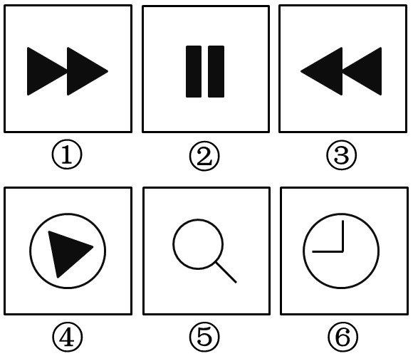
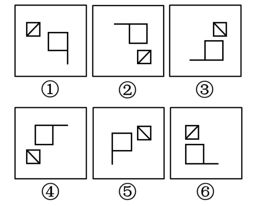
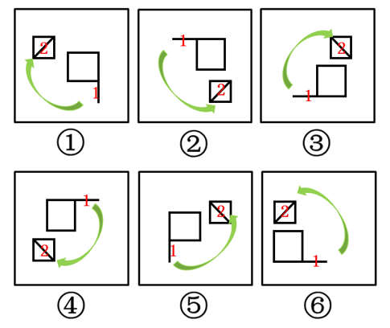

# 2016年423联考《行测》题（海南卷）

> 判断推理 · 25 题 · 海南 2016

## 第 1 题　qid 1796366 · 图形推理

从所给四个选项中，选择最合适的一个填入问号处，使之呈现一定的规律性：

- **A**. A
- **B**. B　✅
- **C**. C
- **D**. D

**答案**：B

**官方解析**

图形元素组成相同，优先考虑位置规律。九宫格优先横向观察，观察第一行发现“○”绕着三角形的边逆时针每次移动一条边，第二行验证此规律成立，因此问号处的“○”应在三角形下面的那条边上，排除C、D两项。观察A、B两项发现，“○”所处的位置不同，一个在三角形外部，一个在三角形内部，因此应考虑两个元素之间的位置关系。经观察发现前两行中都有两个图形“○”位于三角形内部，一个图形“○”位于三角形外部，因此问号处的“○”应于三角形的内部，排除A项。
故正确答案为B。

---

## 第 2 题　qid 1797898 · 图形推理

把下面的六个图形分为两类，使每一类图形都有各自的共同特征和规律，分类正确的一项是：

- **A**. ①②⑥，③④⑤
- **B**. ①③④，②⑤⑥
- **C**. ①⑤⑥，②③④
- **D**. ①③⑤，②④⑥　✅

**答案**：D

**官方解析**

图形元素组成不同，优先考虑属性规律，但无唯一答案。观察发现，题干图形出现了粗线条和生活化图形，考虑部分数。图①③⑤的部分数均为1，图②④⑥的部分数均为2。故图①③⑤为一组，图②④⑥为一组。
故正确答案为D。

---

## 第 3 题　qid 1796430 · 图形推理

把下面的六个图形分为两类，使每一类图形都有各自的共同特征或规律，分类正确的一项是：

- **A**. ①②③，④⑤⑥
- **B**. ①④⑤，②③⑥
- **C**. ①④⑥，②③⑤
- **D**. ①③⑤，②④⑥　✅

**答案**：D

**官方解析**

本题为分组分类题目。观察发现，每幅图形均有一个小三角形和一个小正方形，优先考虑功能元素。图①③⑤中只有小三角形在两个图形相交区域内，图②④⑥中小三角形和小正方形均在两个图形的相交区域内，因此①③⑤为一组，②④⑥为一组。
故正确答案为D。

---

## 第 4 题　qid 1797878 · 图形推理

把下面的六个图形分为两类，使每一类图形都有各自的共同特征和规律，分类正确的一项是：

- **A**. ①②⑥，③④⑤
- **B**. ①③⑤，②④⑥
- **C**. ①③④，②⑤⑥　✅
- **D**. ①④⑥，②③⑤

**答案**：C

**官方解析**

元素组成相同，优先考虑位置规律。此题主要考查图形的旋转和翻转，如下图所示，使用时针法，按照1-2的顺序画时针。图①③④三个图形为顺时针，图②⑤⑥三个图形为逆时针。

故正确答案为C。

---

## 第 5 题　qid 2114644 · 定义判断

红叶子理论认为，一个人职业的成功不在于红叶子数目的多少，而在于他是否具备一片特别硕大的红叶子，这片特别硕大的红叶子不是与生俱来的，需要根据个人优势不断努力才能获得。
根据上述定义，下列哪项能用红叶子理论解释？

- **A**. 小刘虽然偶尔迟到，但对工作尽职尽责、富有团队精神
- **B**. 小张本科学习数学专业，但是他觉得数学专业比较枯燥，所以他选择攻读经济学硕士
- **C**. 小李的销售能力和财务水平一般，但对市场特别敏感，他努力发展这方面优势，最后成了一名企业家　✅
- **D**. 小文是英语系学生，但口语不太好，她辅修了国际法方面的课程，最后成了一名出色的律师

**答案**：C

**官方解析**

第一步：找到定义关键词。
关键词为“职业的成功在于他具有一片特别硕大的红叶子”、“需要靠个人优势不断努力获得”。
第二步：逐一分析选项。
A项：小刘对工作尽职尽责，富有团队精神，没有体现出这是他的个人优势，也没体现出他在不断努力，不符合定义，排除；
B项：小张觉得数学专业枯燥选择了读经济学硕士，没有体现出他的个人优势，也没体现出个人的不断努力，不符合定义，排除；
C项：小李销售水平一般，但是对市场特别敏感，体现了他的个人优势，对市场敏感，同时他努力发展优势体现了他个人不断努力，能用红叶子理论解释，当选；
D项：小文是英语系学生，口语不好，辅修国际法方面的课程最后成为出色律师，说的是虽然有劣势，但是成功了，并没有体现出他的个人优势和特色，不符合定义，排除。
故正确答案为C。

---

## 第 6 题　qid 1797838 · 定义判断

企业从银行或海外取得外汇借款后并不是直接使用外汇资金，而是将外汇结汇给银行，取得人民币资金加以使用，这种现象称之为贷款替代。
根据上述定义，下列哪项属于贷款替代？

- **A**. 人民币升值后，一些企业纷纷减少人民币负债，增加外汇负债，然后再用人民币进行投资　✅
- **B**. 国内经济过热，商业银行对人民币贷款的发放从紧。某贸易公司出于财务考虑转向外资银行贷款，获得外币资金
- **C**. 王明觉得人民币利率高于美元，因此他申请美元贷款，然后将外汇结汇给银行，从而获得人民币资金
- **D**. 小宇出国旅游前去银行兑换了一些外币，到国外后他使用信用卡结算，回国后用人民币还款

**答案**：A

**官方解析**

第一步：找出定义关键词。
“企业”、“不是直接使用外汇资金”、“取得人民币资金加以使用”。
第二步：逐一分析选项。
A项：一些企业增加外汇负债，然后再用人民币进行投资，符合不直接使用外汇资金，而是取得人民币加以使用，符合定义，当选；
B项：某贸易公司获得外币资金，但并没有转换为人民币加以使用，不符合定义，排除；
C项：主体是王明，不符合定义主体企业，不符合定义，排除；
D项：主体是小宇，不符合定义主体企业，不符合定义，排除。
故正确答案为A。

---

## 第 7 题　qid 2114582 · 定义判断

择一的因果关系是指两个或者两个以上的行为人都实施了可能对他人造成损害的危险行为，并且已经造成了损害结果，但是无法确定其中谁是加害人。
根据上述定义，下列存在择一的因果关系的是：

- **A**. 甲、乙两人在搬卸货物过程中因操作不当，造成货物损坏
- **B**. 甲在乙的饮水中下毒，乙喝下后在毒发前又因琐事与丙发生争吵，丙一怒之下用刀刺死了乙
- **C**. 甲、乙共同绑架了丙，甲负责向丙的家人索要赎金，乙为避免被丙认出，将丙残忍杀害
- **D**. 甲、乙、丙三人带着相同的猎枪和子弹外出狩猎，甲、乙看到一只猎物出现在丙附近，二人同时开枪，结果其中一枪打中了丙　✅

**答案**：D

**官方解析**

第一步：找到定义关键词。
关键词为“两个或两个以上的行为人”、“实施了可能对他人造成损害的行为”、“已经造成了损害结果”、“无法确定其中谁是加害人”。
第二步：逐一分析选项。
A项：甲和乙共同搬卸货物造成损坏，货物不是人，题干说的是对他人造成伤害，不符合定义，排除；
B项：乙是在毒发前被丙用刀刺死，丙是确定的加害人，不符合定义，排除；
C项：将丙残忍杀害的是乙，乙是确定的加害人，不符合定义，排除；
D项：甲乙同时开枪，其中一枪打中了丙，无法确定是谁打中的，符合“已经造成了损害结果”、“无法确定其中谁是加害人”，符合定义，当选。
故正确答案为D。

---

## 第 8 题　qid 1796308 · 定义判断

博喻又称连比，就是用几个喻体从不同角度反复设喻去说明一个本体。博喻运用得当，能给人留下深刻的印象。运用博喻能加强语意，增添气势。博喻能将事物的特征或事物的内涵从不同侧面、不同角度表现出来，这是其他类型的比喻所无法达到的。
根据上述定义，下列属于博喻的是：

- **A**. 这个整天同钢铁打交道的技术员，他的心倒不像钢铁那样
- **B**. 桃花潭水深千尺，不及汪伦送我情
- **C**. 上海人叫小瘪三的那批角色，也很像我们的党八股，干瘪得很，样子十分难看
- **D**. 试问闲愁都几许？一川烟草，满城风絮，梅子黄时雨　✅

**答案**：D

**官方解析**

第一步：找出定义关键词。
“用几个喻体从不同角度反复设喻去说明一个本体”。
第二步：逐一分析选项。
A项：“他的心倒不像钢铁那样”是用钢铁来比喻心，只涉及一个喻体，不符合“用几个喻体从不同角度反复设喻去说明一个本体”，不符合定义，排除；
B项：意思是看那桃花潭水，纵然深有千尺，也比不上汪伦送我之情，是将潭水深度与感情进行比较，不存在比喻，不符合“用几个喻体从不同角度反复设喻去说明一个本体”，不符合定义，排除；
C项：上海人叫小瘪三的那批角色很像党八股，是用党八股来比喻小瘪三，只涉及一个喻体，不符合“用几个喻体从不同角度反复设喻去说明一个本体”，不符合定义，排除；
D项：意思是要问我的忧伤有多深多长。就像烟雨一川青草，就像随风飘转的柳絮，梅子黄时的雨水，无边无际。用“一川烟草”“满城风絮”“梅子黄时雨”来比喻“闲愁”，符合“用几个喻体从不同角度反复设喻去说明一个本体”，符合定义，当选。
故正确答案为D。

---

## 第 9 题　qid 1796460 · 定义判断

初级群体指的是由面对面互动所形成的、具有亲密的人际关系和浓厚的感情色彩的社会群体；次级群体指的是其成员为了某种特定的目标集合在一起，通过明确的规章制度结成正规关系的社会群体。
根据上述定义，下列涉及次级群体的是：

- **A**. 亲友团来到比赛现场为小李助威
- **B**. 小赵要到大城市上学了，山里的乡亲们都到村口为他送行
- **C**. 小王考上了研究生，公司的同事一起为他庆贺　✅
- **D**. 20年之后，小张儿时的玩伴建立了一个微信群

**答案**：C

**官方解析**

第一步：找到定义关键词。
关键词为初级群体是由“面对面互动所形成”、“具有亲密的人际关系和浓厚的感情色彩”，次级群体是为了“某种特定的目标”、“通过明确的规章制度”。
第二步：逐一分析选项。
A项：亲友团来到比赛现场为小李助威，群体为亲友团，是通过血缘关系或共同爱好结成的，而不是通过“明确的规章制度”，不符合定义，排除；
B项：小赵考上大学山里乡亲为他送行体现的是一种人际关系和感情色彩，属于初级群体，没有涉及到特定的目标和规章制度，排除；
C项：小王考上研究生，同事为他庆祝，这个群体指的是公司群体，大家的共同目标就是努力工作，把公司搞好，同时这个关系群中有严格的公司规章制度，属于次级群体，当选；
D项：小张的玩伴建立了微信群体现的是亲密的人际关系，属于初级群体，没有涉及到特定的目标和规章制度，排除。
故正确答案为C。

---

## 第 10 题　qid 2114614 · 定义判断

“气候难民”指的是生存因气候变暖等特殊气候因素而受到威胁的人们，这是一个逐渐扩大的族群。某基金会发表的一份报告称，在未来40年，全球约5到6亿人都面临着沦为“气候难民”的危险。
下列描述中被迫迁移的人们，不属于“气候难民”的是：

- **A**. 卡特里娜飓风使得墨西哥海岸的众多居民逃离家乡
- **B**. 印度洋海啸导致了印度、泰国等多国居民被迫迁移　✅
- **C**. 土地沙漠化使曾经繁荣的楼兰古国消亡，国民外迁
- **D**. 海平面上涨使马尔代夫领导人为国民另觅栖身之所

**答案**：B

**官方解析**

第一步：找到定义关键词。
关键词为“气候变暖”、“导致生存受到威胁”、“逐渐扩大的人群”。
第二步：逐一分析选项。
A项：卡特里娜飓风是由于特殊气候因素引起的，同时众多居民逃离家乡是一种生存威胁，属于“气候难民”，排除；
B项：印度洋海啸不是由气候因素引起的，一般是由地震或者气象变化产生的破坏性波浪，不属于“气候难民”，为正确答案，当选；
C项：土地沙漠化是由于气候变异或者人类活动引起的，属于“气候难民”，排除；
D项：海平面上涨是由于气候因素引起的，导致国民生存受到威胁，符合定义，排除。
本题为选非题，故正确答案为B。

---

## 第 11 题　qid 1796136 · 定义判断

运动参与是指主动参与体育活动的态度和行为表现。经常参与体育活动的人，可以培养和发展对运动的兴趣和爱好。养成体育锻炼的习惯，使体育活动成为生活中的重要组成部分。作为学校领域的运动参与，要求学生具有积极参与体育活动的态度和行为，掌握科学健身的知识和方法，养成坚持体育锻炼的习惯。
根据上述定义，下列属于运动参与的是：

- **A**. 小强体质较弱，为了增强体魄，他开始参与体育运动
- **B**. 为了培养孩子的兴趣，小生的父亲经常带他去游泳
- **C**. 小张酷爱网球比赛，会经常观看各种各样的网球比赛
- **D**. 小李热爱跑步，只要有时间，他就会参加马拉松比赛　✅

**答案**：D

**官方解析**

第一步：找到定义关键词。
关键词为“主动参与体育活动的态度和行为表现”。
第二步：逐一分析选项。
A项：小强体质较弱，为了增强体魄他开始参加体育运动，体现的是他参加体育活动的自主性，但是说的是开始参加，没有很好的体现出参与体育运动的行为表现，不属于运动参与，排除；
B项：为了培养孩子的兴趣，小生的父亲经常带他去游泳，虽然有参与体育运动的行为，但是没有体现出小生主动参与体育运动，而是被迫的，是父亲为了培养他的兴趣，不属于运动参与，排除；
C项：小张酷爱网球比赛，会经常观看各种各样的网球比赛，没有体现出他参与体育活动的行为表现，排除；
D项：小李热爱跑步，只要有时间就会参加马拉松，“热爱”一词体现了小李的主动参与性，同时一有时间他就参加马拉松体现了他参与体育活动的行为表现，当选。
故正确答案为D。

---

## 第 12 题　qid 1796382 · 定义判断

不规则需求是指某些物品或者服务的市场需求在不同季节，或一周不同日子，甚至一天不同时间上下波动很大的一种需求状况。
根据上述定义，下列哪项属于不规则需求？

- **A**. 早晚高峰期出租车供不应求　✅
- **B**. 某品牌牙刷分为软、硬、中三种以面向不同消费者
- **C**. 某电商店庆打折，活动当天点击量剧增
- **D**. 某博物馆引进一批梵高画作巡展，游客蜂拥而至

**答案**：A

**官方解析**

第一步：找到定义关键词。
关键词为“某些物品或者服务的市场需求”、“不同季节，或一周不同日子，甚至一天不同时间”、“上下波动很大”。
第二步：逐一分析选项。
A项：早晚高峰期出租车供不应求，即出租车服务的市场需求在一天的不同时间上下波动很大，符合定义，当选；
B项：只提到牙刷品牌对牙刷分类，并未提到消费者的反应如何，也不存在需求上下波动，不符合定义，排除；
C项：“店庆打折，活动当天点击量剧增”说明这种打折服务的市场需求很大，并未体现出需求上下波动，不符合定义，排除；
D项：“博物馆引进梵高画作后游客蜂拥而至”说明人们对欣赏梵高画作的需求很大，并未体现出需求上下波动，不符合定义，排除。
故正确答案为A。

---

## 第 13 题　qid 1796234 · 类比推理

出行：雾霾：口罩

- **A**. 休息：沙发：电视
- **B**. 超车：公路：路标
- **C**. 勘探：野外：地图　✅
- **D**. 娱乐：海滨：游泳

**答案**：C

**官方解析**

第一步：判断题干词语间逻辑关系。
“出行”是行为，“雾霾”是环境，“口罩”是工具，可以造句为“在雾霾天气出行需要戴口罩”，三者为特殊环境中的行为与特殊工具的对应关系。
第二步：判断选项词语间逻辑关系。
A项：“沙发”是家具，不是环境，与题干逻辑关系不一致，排除；
B项：“路标”是指路的一种工具，在“公路”上“超车”的时候不需要“路标”，与题干逻辑关系不一致，排除；
C项：“勘探”是行为，“野外”是环境，“地图”是工具，可以造句为“在野外勘探需要用到地图”，三者为特殊环境中的行为与特殊工具的对应关系，与题干逻辑关系一致，当选；
D项：“游泳”不是工具，与题干逻辑关系不一致，排除。
故正确答案为C。

---

## 第 14 题　qid 1796408 · 类比推理

麻雀：动物：生物链

- **A**. 豆浆：早餐：豆制品
- **B**. 开水：纸杯：便利品
- **C**. 发卡：首饰：妆扮品　✅
- **D**. 钢笔：电脑：办公品

**答案**：C

**官方解析**

第一步：分析题干词语间的逻辑关系。
题干麻雀属于动物，二者为种属关系，生物链指的是由动物、植物和微生物互相提供食物而形成的相互依存的链条关系。麻雀和动物都属于生物链的一部分。
第二步：逐一分析选项。
A项：豆浆可以作为早餐食用，但二者并非种属关系，并且早餐不是豆制品的组成部分，与题干逻辑不符，排除；
B项：开水不属于纸杯，二者不是种属关系，与题干逻辑不符，排除；
C项：发卡是首饰的一种，二者为种属关系，发卡和首饰都属于妆扮品，分别与妆扮品构成种属关系，而题干是组成关系，对应关系并不完全一致，但是相比于其他选项，种属关系和组成关系都是包容关系，所以该项更合适，当选；
D项：钢笔和电脑都属于办公品，但是钢笔和电脑之间不是种属关系，与题干逻辑不符，排除。
故正确答案为C。

---

## 第 15 题　qid 1796410 · 类比推理

黄连：苦涩

- **A**. 班级：团结
- **B**. 钻石：坚硬　✅
- **C**. 花朵：鲜红
- **D**. 城市：繁华

**答案**：B

**官方解析**

第一步：分析题干词语间的逻辑关系。
黄连是一种草本植物，其味入口一定是极苦，因此苦涩是黄连的一种必然属性。
第二步：逐一分析选项。
A选项：班级可能团结可能不团结，不是一种必然属性关系，与题干逻辑不符，排除；
B选项：钻石是指经过琢磨的金刚石。金刚石在天然矿物中的硬度最高，因此坚硬是钻石的必然属性，与题干逻辑关系一致，为正确答案，当选；
C选项：鲜红是花朵的属性，但花朵不一定是鲜红的，花朵的颜色可以多样，不是必然属性，与题干逻辑不符，排除；
D选项：城市不一定繁华，不是一种必然属性关系，与题干逻辑不符，排除。
故正确答案为B。

---

## 第 16 题　qid 2114670 · 类比推理

指鹿为马：颠倒黑白

- **A**. 师心自用：固执己见　✅
- **B**. 目无全牛：鼠目寸光
- **C**. 不以为然：不屑一顾
- **D**. 不孚众望：众望所归

**答案**：A

**官方解析**

第一步：分析题干中词语的逻辑关系。
“指鹿为马”意思是指着鹿，说是马，比喻故意颠倒黑白，混淆是非。
“颠倒黑白”意思是把黑的说成白的，白的说成黑的，比喻歪曲事实，混淆是非，指鹿为马。
二者为近义词。
第二步：逐一分析选项。
A项：“师心自用”形容自以为是，不肯接受别人的正确意见，“固执己见”是指顽固地坚持自己的意见，不肯改变，二者为近义词，符合题干逻辑关系，当选；
B项：“目无全牛”意思是眼中没有完整的牛，只有牛的筋骨结构，形容技艺已经到达非常纯熟的地步，“鼠目寸光”比喻目光短浅，缺乏远见，二者不是近义词，不符合题干逻辑关系，排除；
C项：“不以为然”意思是不认为是对的，表示不同意或否定，“不屑一顾”意思是认为不值得一看，形容极端轻视，二者不是近义词，不符合题干逻辑关系，排除；
D项：“不孚众望”意思是不能使大家信服，未符合大家的期望，“众望所归”是指某人得到大家的信赖，希望他担任某项工作或完成事情，二者不是近义词，不符合题干逻辑关系，排除。
故正确答案为A。

---

## 第 17 题　qid 2114688 · 类比推理

沟通：手机：金属

- **A**. 招聘：面试：简介
- **B**. 物流：运输：公路
- **C**. 卫星：科技：科学家
- **D**. 露营：帐篷：帆布　✅

**答案**：D

**官方解析**

第一步：判断题干词语间逻辑关系。
“手机”用于“沟通”，“手机”的材质是“金属”。
第二步：判断选项词语间逻辑关系。
A项： “面试”是“招聘”的一个环节，与题干逻辑关系不一致，排除。
B项： “运输”是“物流”的一个环节，与题干逻辑关系不一致，排除。
C项： “卫星”是“科技”发展的成果，与题干逻辑关系不一致，排除。
D项：“帐篷”用于“露营”，“帐篷”的材质是“帆布”，与题干逻辑关系一致，当选。
故正确答案为D。

---

## 第 18 题　qid 1796426 · 类比推理

（　）　对于　熟练　相当于　敏捷　对于　（　）

- **A**. 娴熟　灵敏　✅
- **B**. 操作　迅捷
- **C**. 熟悉　迅速
- **D**. 谙熟　灵动

**答案**：A

**官方解析**

将选项逐一代入。
A项：娴熟是指很熟练，二者为近义关系，且前者是对后者程度的加深，敏捷是指灵敏快捷，与灵敏为近义关系，且前者是对后者程度的加深，前后逻辑关系一致，当选；
B项：熟练可以形容操作，敏捷与迅捷是近义关系，前后逻辑关系不一致，排除；
C项：熟悉指了解得清楚，清楚地知道，而熟练程度要比熟悉更重一些，后比前重。敏捷是指灵敏快捷，所以敏捷程度要比迅速更重一些，这里前比后重。所以二组词顺序反了，前后逻辑关系不一致，排除；
D项：谙熟指熟悉、了解，程度要比熟练轻。敏捷是指灵敏迅速，灵动多指活泼，敏捷和灵动没有关系，前后逻辑关系不一致，排除。
故正确答案为A。

---

## 第 19 题　qid 1796412 · 类比推理

报刊：新闻

- **A**. 土地：玉米
- **B**. 法院：法律
- **C**. 出版社：书籍
- **D**. 唱片：歌曲　✅

**答案**：D

**官方解析**

第一步：分析题干词语间的逻辑关系。
报刊是利用纸张传播文字资料的一种工具，是发表、宣传新闻的一种载体；并且新闻的发表方式有很多，报刊只是其中一种。
第二步：逐一分析选项。
A选项：土地与玉米是作物和种植地之间的对应关系，与题干逻辑不符，排除；
B选项：法院是司法审判机关，不是法律的载体，与题干逻辑不符，排除；
C选项：出版社出版书籍，不是书籍刊登的载体，与题干逻辑不符，排除；
D选项：唱片是一种传播音乐、歌曲的载体，并且歌曲的发表形式有很多，唱片只是其中一种，与题干逻辑关系一致，当选。
故正确答案为D。

---

## 第 20 题　qid 1797830 · 逻辑判断

国际工程一般是指那些资金由外国政府或国际组织提供，并在咨询设计、施工、设备材料采购及劳务供应等方面部分或全部实行跨国经营的工程项目。国际工程经营是国际间复杂的商业性交易活动，与国际政治、经济环境密切相关，环境和市场的变化会严重影响到有关国际工程业务的成败，有人认为，目前我国国际工程项目管理体系还未达到要求。
以下哪项如果为真，最能驳斥上述结论？

- **A**. 和其他发达国家相比我国在国际项目管理这个方面学术活动水平比较低
- **B**. 现阶段建设市场在项目整体承包方面认可水平较高，市场认可水平高
- **C**. 现阶段开展项目管理工作的部门绝大部分都具有健全的运作机制　✅
- **D**. 在工程开展方面进行管理控制的项目控制相关部门专业化程度较高

**答案**：C

**官方解析**

第一步：找出论点和论据。
论点：目前我国国际工程项目管理体系还未达到要求。
无明显论据。
第二步：逐一分析选项。
A项：论点说未达到要求，选项说的是学术活动水平较低，并不知道学术活动水平能否反映整个管理体系水平，无关项，排除；
B项：没有提及“工程项目管理体系”，无关项，排除；
C项：绝大部分开展项目管理工作的部门都有健全的运作机制，说明是达到要求的，能够削弱论点，当选；
D项：“项目控制相关部门专业化程度较高”不代表管理体系达到要求，无关项，排除。
故正确答案为C。

---

## 第 21 题　qid 1796110 · 逻辑判断

人们在社会生活中常会面临选择，要么选择风险小，报酬低的机会；要么选择风险大，报酬高的机会。究竟是在个人决策的情况下富于冒险性，还是在群体决策的情况下富于冒险性？有研究表明，群体比个体更富有冒险精神，群体倾向于获利大但成功率小的行为。
以下哪项如果为真，最能支持上述研究结论？

- **A**. 在群体进行决策时，人们往往会比个人决策时更倾向于向某一个极端偏斜，从而背离最佳决策　✅
- **B**. 个体会将其意见与群体其他成员相互比较，因其想要被其他群体成员所接受及喜爱，所以个体往往会顺从群体的一般意见
- **C**. 在群体决策中，很可能出现以个体或子群体为主发表意见、进行决策的情况，使群体决策为个体或子群体所左右
- **D**. 群体决策有利于充分利用其成员不同的教育程度、经验和背景，他们的广泛参与有利于最高决策的科学性

**答案**：A

**官方解析**

第一步：找到论点论据。
论点：群体比个体更具有冒险精神，群体倾向于获利大但成功率小的行为。
本题没有论据。
第二步：逐一分析选项。
A选项：群体作决策时比个人更容易走极端，将群体决策和个人决策做比较，解释了群体决策与个人决策之间存在差距的原因，可能会导致群体倾向于获利大但成功率小的行为，有一定的加强作用；
B选项：说的是在群体中个体会偏向于群体的一般意见，论证的是个体在群体中是坚持自己独特意见还是屈众，跟论题不一致，所以排除；
C选项：群体决策可能会被个体或者子群体所主导，也就是说群体决策可能和个体决策是一样的，而不是比个体决策更具有冒险精神，有削弱的意思，排除；
D选项：题干中没有涉及到决策的科学性与成功率，为无关选项，排除。
B、D两项为无关选项，C项有削弱的意思，只有A项有一定的加强作用，比较而言只能选A。
故正确答案为A。

---

## 第 22 题　qid 1796274 · 逻辑判断

X分子具有Y结构，串联起了大量的原子，由该分子组成的某种物质在同类型的物质中具有很强的导热性。很明显，分子内包含大量原子是使得该物质拥有极强的导热性所必不可少的。
以下哪项如果为真，最能削弱上述结论？

- **A**. 有的分子拥有别的结构，也串联起了大量的原子，并拥有很强的导热性
- **B**. 有的物质导热性不强，但是它的分子中包含了大量的原子　✅
- **C**. 有的物质导热性很强，但是其分子不具备Y结构
- **D**. 有的物质导热性不强，但是其分子具备类似的结构

**答案**：B

**官方解析**

第一步：找到论点论据。
论点：分子内包含大量原子是使得该物质拥有极强的导热性所必不可少的；
论据：X分子具有Y结构，串联起了大量的原子，由该分子组成的某种物质在同类型的物质中具有很强的导热性。
如果将论点看成条件关系，可以翻译成：极强导热性→分子内包含大量原子。要想削弱，最强的方式无疑是有些物质具有极强的导热性，但分子内不具有大量原子。可惜，选项中没有这样的表述，那么也可以换一种方式去理解论点。论点中的“使得”可以是表示因果关系的连词，因此论点可以看成因果关系。“分子内包含大量原子”为原因，“拥有极强导热性”为结果。预设的削弱方式可以是：（1）该原因无法导致该结果（有因无果）；（2）不是该原因导致该结果（无因有果）；（3）其他原因导致该结果（他因）。
第二步：逐一分析选项。
A项：有别的结构的大量原子的物质有很强的导热性，说明无论结构如何，只要有大量原子就有好的导热性，支持了论点，排除；
B项：指出在包含大量原子的情况下也不一定能够导热性强，即有因无果，可以削弱，当选；
C项：导热性强但不具备Y结构，讨论的是导热性与Y结构之间的关系，而Y结构只是论据例子中X分子的一种结构，这种结构刚好包含大量原子，但是论据并没有说除Y结构以外的其它结构不能串联大量原子，所以Y结构并不是题干的重点，题干只关注原子和导热性之间的关系，而非结构与导热性之间的关系，所以该选项并不能削弱，排除；
D项：说的是导热性与结构之间的关系，而题干讨论的是导热性与原子之间的关系，论题不一致，排除。
故正确答案为B。

---

## 第 23 题　qid 1796206 · 类比推理

理论认为，反物质是正常物质的反状态，当正反物质相遇时，双方就会相互湮灭抵消，发生爆炸并产生巨大能量，有人认为，反物质是存在的，因为到目前为止没有任何证据证明反物质是不存在的。
以下哪项与题干中的论证方式相同？

- **A**. 圣女贞德的审问者们曾对她说，我们没有证据证明上帝与你有过对话，你可能是在胡编乱造，也可能精神失常
- **B**. 动物进化论是正确的，例如始祖鸟就是陆地生物向鸟类进化过程中的一类生物
- **C**. 既然不能证明平行世界不存在，那么平行世界就是存在的　✅
- **D**. 长白山天池有怪兽，因为有人看见过怪兽曾在天池内活动的踪迹

**答案**：C

**官方解析**

第一步：分析题干的论证方式。
因为没有任何证据证明反物质是不存在的，所以反物质是存在的。这种论证方式是诉诸无知，其论证模式是：没有证明S为真，所以S为假的；没有证明S为假，所以S为真的。
第二步：逐一分析选项。
A选项，“没有证据证明上帝与你有过对话，你可能是在胡编乱造，也可能精神失常”，并不符合题干的论证模式，排除；
B选项，论证方式为举例论证，即抛出一个观点，然后举出一个例子来证明这个观点，不符合题干的论证模式，排除；
C选项，“不能证明平行世界不存在，那么平行世界就是存在的”完全符合题干的论证模式，当选；
D选项，因为有活动踪迹，所以有怪兽，这是因为有证据所以得到一个结论，不符合题干的论证模式，排除。
故正确答案为C。

---

## 第 24 题　qid 1796108 · 逻辑判断

某市为了实施文化强市战略，在2008年、2010年先后建成了两个图书馆，2008年底共办理市民借书证7万余个，到2010年底共办理市民借书证13余万个。2011年，该市又在新区建立了第三个图书馆，于2012年初落成开放，截止2012年底，全市共计办理市民借书证20余万个，市政府由此认为，该项举措是有实效的，因为在短短的4年间，光顾图书馆的市民增加了近两倍。
以下哪项如果为真，最能削弱上述结论？

- **A**. 图书馆要不断购置新书，维护成本也很高，这会影响该市其他文化设施建设
- **B**. 该市有两所高等学校，许多在校生也办理了这3个图书馆的借书证
- **C**. 很多办理了第一个图书馆借书证的市民又办理了另外两个图书馆的借书证　✅
- **D**. 该市新区建设发展迅速，4年间很多外来人口大量涌入新区

**答案**：C

**官方解析**

第一步：找到论点论据。
论点：该项举措（建图书馆）是有实效的。
论据：在建成三个图书馆的4年内，光顾图书馆的市民增加了近两倍。
论据说的是光顾图书馆的市民多了，论点说的是举措是有实效的，根据论据可以合理推出论点，因此话题一致，削弱优先考虑削弱论点，也可以考虑削弱论据。
第二步：逐一分析选项。
A项：该项说的是图书馆的维护成本高，与论点讨论的建图书馆能否取得实效无关，话题不一致，不能削弱，排除；
B项：该项说的两所高校的学生也办理了借书证，说明建立图书馆对这两所高校的学生有帮助，有一定的实效，可以加强，不能削弱，排除；
C项：该项说的是一个市民办理三个借书证，这样就是说明看书的人并不一定在增加，只是一人办多证，削弱论据，可以削弱，当选；
D项：该项说的是4年间很多外来人口大量涌入新区，外来人口对于借书证影响不明确，为不明确选项，无法削弱，排除。
故正确答案为C。

---

## 第 25 题　qid 1796106 · 逻辑判断

干细胞遍布人体，因为拥有变成任何类型细胞的能力而令科学家们着迷，这种能力意味着它们有可能修复或者取代受损的组织。而通过激光刺激干细胞生长很有可能实现组织生长，因此研究人员认为激光技术或许将成为医学领域的一种变革工具。
以下哪项如果为真，最能支持上述结论？

- **A**. 不同波段的激光对机体组织作用的原理尚不清楚
- **B**. 已有病例表明，激光会对儿童视网膜造成损伤，影响视力
- **C**. 目前激光刺激生长法尚未在人类机体上进行试验，风险还待评估
- **D**. 用激光治疗带有牙洞的臼齿，受损的牙体组织能逐渐恢复　✅

**答案**：D

**官方解析**

第一步：找到题干论点论据。
论点：激光技术或许将成为医学领域的一种变革工具；
论据：激光刺激干细胞生长可能实现组织生长，干细胞具有可以变成任何类型细胞的能力。
第二步：逐一分析选项。
A选项，讨论的是不同波段的激光对人体的组织作用的原理不清楚，属于不明确选项，排除；
B选项，用激光对儿童视网膜影响的例子来证明激光技术会对人体有损伤，属于举例削弱，排除；
C选项，没有在人体试验，风险还待评估，属于不明确选项，排除；
D选项，用有洞的牙齿来作为例子，证明激光技术确实能够成为医学领域变革的工具，举例加强，当选。
故正确答案为D。

---
