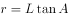
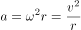
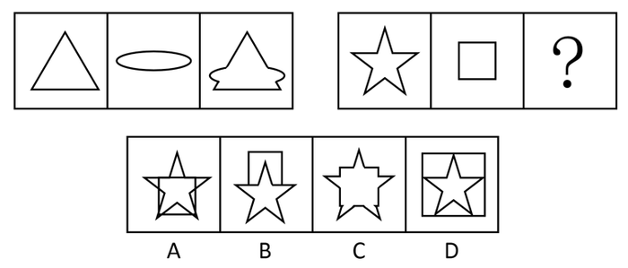
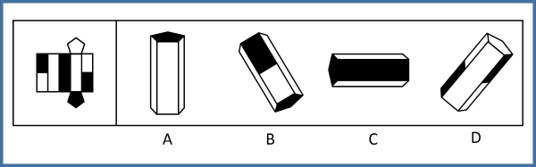
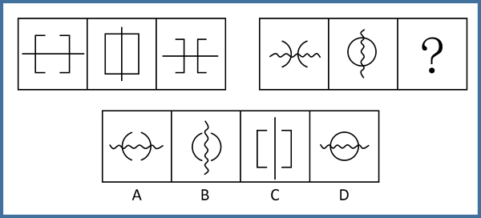
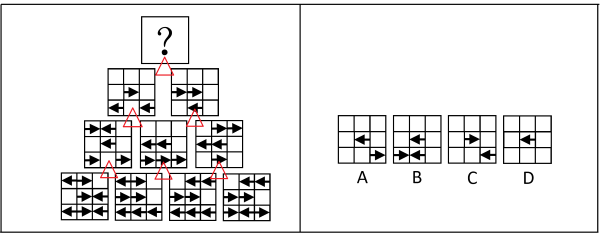

# 2016年上海市公务员录用考试《行测》题（A类）

> 判断推理 · 32 题 · 上海 2016

## 第 1 题　qid 1805102 · 逻辑判断

无线充电，又称为非接触式感应充电，是利用磁场共振原理，由供电设备（充电器）将能量传送至用电的装置，两者之间不用电线连接，下列关于无线充电的说法错误的是：

- **A**. 相对于有线充电来说，无线充电能源转换一次性获得，电能损失小，节能环保　✅
- **B**. 利用无线充电的设备，可以显著减少设备磨损
- **C**. 无线充电技术要求高、价格贵是现阶段不能普及的主要原因
- **D**. 无线传输距离越远，无用功的耗损也就会越大

**答案**：A

**官方解析**

逐项分析：A项错误，应为有线充电能源转换一次性获得，电能损失小，节能环保，而无线充电多进行了电能和磁能的转换，电能损失大，当选。B项正确，因为充电器及用电的装置基本不接触，磨损率会显著下降，排除。C项正确，无线充电不能普及的主要原因有以下几个：要求高、距离较近、充电效率低、成本高等问题，排除。D项正确，距离越远，电磁泄漏越严重，无用功损耗越大，排除。
本题为选非题，故正确答案为A。

---

## 第 2 题　qid 1805104 · 逻辑判断

如图，一轻弹簧下端固定，竖立在水平面上，其正上方A位置有一只小球，小球从静止开始下降，在B位置接触弹簧的上端，在C位置小球所受弹力大小等于重力，在D位置小球速度减小到零。下列对于小球下降阶段的说法中，正确的是（  ）。

- **A**. 在B位置小球动能最大
- **B**. 在C位置小球动能最小
- **C**. 从A→D位置小球重力势能的减少小于弹簧弹性势能的增加
- **D**. 从A→C位置小球重力势能的减少大于小球动能的增加　✅

**答案**：D

**官方解析**

逐项分析：C点速度最大，那么C点动能最大，A、B两项错误；A到D整个过程是动能从0到0，重力势能越来越小，弹簧弹性势能越来越大，两者相互转化，机械能守恒，两者相等，C项错误；D项，从A到C的位置，小球重力势能的减少等于小球动能的增加和弹簧弹性势能的增加之和，所以重力势能的减少大于任意一个的增加，D项正确。
故正确答案为D。

---

## 第 3 题　qid 1805112 · 逻辑判断

如图所示为某人设计的一种机器，原理是这样的：在立柱上放一个强力磁铁A，两槽M和N靠在立柱旁。上槽M上端有一个小孔C，下槽N弯曲。如果在B处放一小铁球，它就会在强磁力作用下向上滚，滚到C时从小孔下落沿N回到B，开始往复运动，从而进行“永恒的运动”。关于这种机器，下列说法正确的是（   ）。

- **A**. 这种机器可以永恒运动，说明了永动机可以制造
- **B**. 这种机器是可以制造的，并且小球在下滑时能源源不断地对外做功
- **C**. 这种机器不能永恒运动，如果小球能从静止加速上升到C的话，它就不可能从C加速下滑到B，并再次从B回到C　✅
- **D**. 这种机器不能永恒运动，关键是因为摩擦阻力太大，要消耗能量

**答案**：C

**官方解析**

本题中，因为小球上升过程磁场力做正功，使小球机械能增加，但小球下滑过程磁场力做负功，这个负功与上升过程的正功相互抵消，故不可能源源不断地向外提供能量。
逐项分析：
A、B两项，这种机器违背了能量守恒定律，是不可能制造成功的，故A项错误，B项错误；
C项，这种机器不能永恒运动，如果小球能从静止加速上升到C的话，它就不可能从C加速下滑到B，并再次从B回到C，故C项正确。
D项，这种机器不能永恒运动的关键是违背了“能量守恒定律”而不是摩擦力，故D项错误。
故正确答案为C。

---

## 第 4 题　qid 1758864 · 逻辑判断

真空玻璃是将两片平板玻璃或玻璃四周密闭起来，将其间隙抽成真空并密封排气孔，两片玻璃之间的间隙为0.1～0.2mm，真空玻璃的两片至少有一片是低辐射玻璃。根据以上信息，下列关于真空玻璃的描述错误的是（  ）。

- **A**. 为了达到玻璃内外压力的平衡，往往会在玻璃之间排列整齐小球，用来支撑玻璃承受外界大气压的压力
- **B**. 采用低辐射玻璃的原因是使辐射传热尽可能小
- **C**. 抽成真空的目的是减少气体传热的影响，从而使保温性能更好
- **D**. 抽成真空后隔音的效果会下降　✅

**答案**：D

**官方解析**

A项，当玻璃内真空时，玻璃内外有压强差而产生压力，为了达到玻璃内外的压力平衡，在玻璃内部排列小球以提供对玻璃内部的支持力，即A项正确，故不选A项。
B项，低辐射玻璃导热性差，使用其可以减少或阻隔热量的传递，即B项正确，故不选B项。
C项，真空下热量的传递效果大大降低，所以达到保温的功效，即C项正确，故不选C项。
D项，声音的传播需要介质，真空下声音无法传播，玻璃抽成真空后的隔音效果更好，即D项错误，故选择D项。
本题为选非题，故正确答案为D。

---

## 第 5 题　qid 1758866 · 类比推理

下列四幅图中，属于近视眼成像原理和远视眼矫正方法的分别是（  ）。  

- **A**. ①和③
- **B**. ②和③　✅
- **C**. ②和④
- **D**. ①和④

**答案**：B

**官方解析**

近视眼的眼球对光的折射程度很大，所以成像在视网膜的前方，②正确；远视眼的眼球对光的折射程度小，故佩戴凸透镜增加对光的折射，对视力进行矫正，③正确。
故正确答案为B。

---

## 第 6 题　qid 1758880 · 类比推理

炎热的夏天开车行驶在高速公路上，常觉得公路远处似乎有水面，水面上还有汽车、电线杆等物体的倒影，但当车行驶至该处时，却发现不存在这样的水面。出现这种现象是因为（  ）。

- **A**. 镜面反射
- **B**. 漫反射
- **C**. 直线传播
- **D**. 折射　✅

**答案**：D

**官方解析**

炎热夏天公路上温度很高，接近地面的空气温度较高，空气密度较低，远离地面空气温度较低，密度较大，且空气不断流动导致光在传播过程中发生折射，而人所看到的像是物体形成的虚像，故D项正确。
故正确答案为D。

---

## 第 7 题　qid 1758872 · 类比推理

小张放假回到农村，发现一个种子堆，好奇的小张把手伸到种子堆里，发现里面温度比较高，这主要是因为（  ）。

- **A**. 天气热
- **B**. 呼吸作用　✅
- **C**. 光合作用
- **D**. 保温作用

**答案**：B

**官方解析**

种子无法进行光合作用，且一直在进行呼吸作用，散发出热量，种子堆里发热的原因就是因为呼吸作用，故B项正确。
故正确答案为B。

---

## 第 8 题　qid 1758876 · 类比推理

如图，质量为65kg的小李站在重为3000N的铁皮船上，船体与陆地上的树木之间用滑轮组连接，小李用60N的拉力拉绳子（质量忽略不计）时，船体向前匀速移动，那么船在水中受到的阻力为（  ）N。

- **A**. 39
- **B**. 60
- **C**. 120
- **D**. 180　✅

**答案**：D

**官方解析**

绳子对人有60N的拉力，人没动，是因为船给人向后60N的摩擦力，故人给船60N向前的摩擦力。另外，由于滑轮组有两条绳子连着船上，故船受到绳子的拉力为120N。因此船受到的总拉力为N。

故正确答案为D。

---

## 第 9 题　qid 1758878 · 类比推理

地球是一个巨大的磁体，它的磁场分布情况与一个条形磁铁的磁场分布情况相似。地理南极相当于条形磁铁的N极，地理北极相当于条形磁场的S极，那么上海上空的磁场方向是（  ）。

- **A**. 由南至北斜向下沉　✅
- **B**. 由南至北斜向上升
- **C**. 由北至南斜向下沉
- **D**. 由北至南斜向上升

**答案**：A

**官方解析**

磁体外部的磁场方向由磁铁N极指向磁铁S极，则地球的磁场方向由南指向北，因为上海处于北半球，则磁场方向由南至北斜向下，故A项正确。
故正确答案为A。

---

## 第 10 题　qid 1758868 · 逻辑判断

如图，用绳子(质量忽略不计）将甲、乙两铁球挂在天花板上的同一个挂钩上，然后使两铁球在同一水平面上做匀速圆周运动，已知两铁球质量相等，那么下列说法中不正确的是（  ）。

- **A**. 甲的角速度一定比乙的角速度大　✅
- **B**. 甲的线速度一定比乙的线速度大
- **C**. 甲的加速度一定比乙的加速度大
- **D**. 甲所受绳子的拉力一定比乙所受的绳子的拉力大

**答案**：A

**官方解析**

设悬挂铁球的绳子与竖直方向的夹角为A，铁球圆周运动的圆心距绳子悬挂点的距离为L，则根据受力分析和几何关系得：铁球圆周运动的半径，铁球的加速度，根据圆周运动公式并代入可得：，。

题中甲悬挂的绳子与竖直方向的夹角大于乙悬挂绳子与竖直方向的夹角，根据上述得到的铁球运动的角速度与线速度公式可得：甲乙两铁球的角速度相等，甲的线速度大于乙的线速度，甲的加速度大于乙的加速度；又两球的质量相等，所受重力相同，则甲所受绳子的拉力一定大于乙所受绳子的拉力，故A项错误，B、C、D三项正确。

本题为选非题，故正确答案为A。

---

## 第 11 题　qid 1805154 · 图形推理

下列选项中，符合所给图形的变化规律的是：

- **A**. A
- **B**. B　✅
- **C**. C
- **D**. D

**答案**：B

**官方解析**

元素组成相同，每个图形都是由4个半黑半白的圆组成，考虑位置规律。观察图形发现，所有位置的圆每次顺时针旋转90度，则问号处应为图三所有圆继续顺时针旋转90度，只有B项符合此规律。
故正确答案为B。

---

## 第 12 题　qid 1758960 · 图形推理

下列选项中，符合所给图形的变化规律的是（  ）。

- **A**. A
- **B**. B
- **C**. C
- **D**. D　✅

**答案**：D

**官方解析**

分析图形的特征。组成图形较为相似，考查样式求异运算。每组都是第一个图形和第二个图形去同存异得到第三个图形，只有D项符合。
故正确答案为D。

---

## 第 13 题　qid 1805272 · 图形推理

下列选项中，符合所给图形的变化规律的是：

- **A**. A
- **B**. B
- **C**. C　✅
- **D**. D

**答案**：C

**官方解析**

图形组成相似，考虑样式规律。第一组图形中，图3为图1与图2的叠加后的外围轮廓，且第一组的每个图形都只有一个面，则第二组图形也应符合此规律，只有C项符合。
故正确答案为C。

---

## 第 14 题　qid 1758948 · 图形推理

从所给的四个选项中，选择最合适的一个填入问号处，使之呈现一定的规律性：

- **A**. A　✅
- **B**. B
- **C**. C
- **D**. D

**答案**：A

**官方解析**

分析图形的特征。图形组成元素都相同，考虑图形的位置变化，同时九宫格中间图形最特殊，为空白面，考虑米字型路线观察。观察发现，米字型的上下左右以及对角线两端的图形都是旋转的关系。故问号处应为第一行第一个图形旋转得到，对应A项。

故正确答案为A。

---

## 第 15 题　qid 1805280 · 图形推理

下列选项中，符合所给图形的变化规律的是：

- **A**. A
- **B**. B
- **C**. C
- **D**. D　✅

**答案**：D

**官方解析**

每个图形都由上下两部分图形通过一条直线连接组成，且第二组图形中的元素均在第一组图形中出现过，考虑遍历规律，第二组图形中没有出现过的图形为正方形与蝴蝶结形，只有D项符合。
故正确答案为D。

---

## 第 16 题　qid 1758954 · 图形推理

下列选项中，符合所给图形的变化规律的是：

- **A**. A　✅
- **B**. B
- **C**. C
- **D**. D

**答案**：A

**官方解析**

图形元素组成相同，优先考虑位置规律。九宫格每行第一个图形向右翻转得到第二个图形，再由第二个图形上下翻转得到第三个图形。
故正确答案为A。

---

## 第 17 题　qid 1805286 · 图形推理

下列选项中，左边给定的是纸盒的外表面展开图，右边哪一项能由它折叠而成？

- **A**. A
- **B**. B
- **C**. C　✅
- **D**. D

**答案**：C

**官方解析**

本题属于空间重构类，逐一分析选项。
A项：立体图中存在三个空白长方形白色面相邻，观察平面图，存在两个空白长方形白色面且不相邻，立体图与平面图二者不对应，排除；
B项：立体图中存在两个空白长方形白色面不相邻，中间为一个半黑半白面，观察平面图，两个空白长方形白色面中间应为一个长方形全黑面，而非半黑半白面，立体图与平面图二者不对应，排除；
C项：在B项的分析之上，此选项的立体图与平面图二者互相对应，为正确选项；
D项：立体图中存在一个长方形白色面与两个半黑半白面相邻，观察平面图，任意一个长方形白色面都要与一个长方形全黑面相邻，立体图与平面图二者不对应，排除。（或者说两个半黑半白面二者是相邻关系）
故正确答案为C。

---

## 第 18 题　qid 1805290 · 图形推理

请从所给的四个选项中，选择最合适的一项填在问号处，使之呈现一定的规律性：

- **A**. A　✅
- **B**. B
- **C**. C
- **D**. D

**答案**：A

**官方解析**

观察前三图，元素组成相同，考虑位置关系。前三图中的长直线每次旋转，再观察其余两个相同元素的位置关系。观察发现，左侧图形不断向右平移，右侧图形不断向左平移，且第一副图中两个相同元素相隔的距离与第三副图中两个相同元素相隔的距离相等。

观察后三图，应遵循相同或者类似的规律，元素组成相同，排除C项。波浪线每次旋转，排除B项；相同元素在第一副图与第三副图中的间隔距离应维持不变，选择A项。

故正确答案为A。

快速解题：第二组图形是将第一组的图形变直为曲且弯曲方向相反，锁定答案A项即可。

---

## 第 19 题　qid 1805294 · 图形推理

下列选项中，符合所给图形的变化规律的是：

- **A**. A
- **B**. B
- **C**. C
- **D**. D　✅

**答案**：D

**官方解析**

此种题型为上海常考题型，类似数学中的“杨辉三角”，即每行相邻的两个图形通过样式运算得到其上方的图形（品字运算），之前常考去同存异或者去异存同。

观察此题，出现箭头，考虑方向。在每个九宫格中，在左下角三个九宫格中寻找规律，发现如下规律：←＋←＝→，→＋←＝空白，空白＋→＝空白，→＋→＝←，←＋空白=空白，空白+空白=空白。整理上述规律，即←＋←＝→，→＋→＝←，其余相加均为空白。

在右下角三个图形中进行验证，发现上述规律正确。

将此规律应用到顶端三个图形中，←＋←＝→，→＋→＝←，其余相加均为空白，发现只有九宫格正中间应该出现一个左箭头←。

故正确答案为D。

---

## 第 20 题　qid 1805302 · 类比推理

某工厂有多个宿舍区和车间，住在A宿舍区的员工都不是纺织工，因此在A车间工作的员工有部分是不住在A宿舍区的。
为了使该推理成立，必须补充下列哪项作为前提条件？

- **A**. 有的纺织工不在A车间工作
- **B**. 在A车间工作的员工有的不是纺织工
- **C**. 住在A宿舍区的员工有的是在A车间工作
- **D**. 有的纺织工在A车间工作　✅

**答案**：D

**官方解析**

第一步：找到题干中的论据和论点。
论据：住在A宿舍区的员工都不是纺织工。
论点：A车间工作的员工有部分不住在A宿舍区。
第二步：论据和论据之间存在跳跃，隐含的前提应该是论点和论据二者之间的联系，考虑搭桥。
搭桥即在纺织工和有的A车间员工之间建立联系。
观察选项，只有D项成立，即A车间工作员工部分是纺织工，纺织工都不是住在A宿舍区的员工，推出论点在A车间工作的员工有部分是不住在A宿舍区的。因此D项是题干前提。
故正确答案为D。

---

## 第 21 题　qid 1805330 · 类比推理

地铁每节车厢门旁边通常会有警告标志：“停车请拉下紧急制动开关，擅动将负法律责任。”
上述警告标志适用的情况是：
Ⅰ、一些乘客会无故使用或误用紧急制动开关；
Ⅱ、在某些特殊情况下，可能有乘客需要使运行的列车停下。

- **A**. 只有情况Ⅰ适用
- **B**. 只有情况Ⅱ适用
- **C**. 情况Ⅰ和Ⅱ都适用　✅
- **D**. 情况Ⅰ和Ⅱ都不适用

**答案**：C

**官方解析**

第一步：抓住题干主要信息。
停车可以拉下紧急制动开关，擅动紧急制动开关将负法律责任，属于警告范围。
第二步：根据题干信息逐一分析情况。
情况Ⅰ，无故使用或误用紧急制动开关，属于擅动紧急制动开关，符合警告标志的内容；
情况Ⅱ，特殊情况下，可能有乘客需要使运行的列车停下，属于停车可以拉下紧急制动开关，符合警告标志的内容。所以情况Ⅰ和Ⅱ都适用。
故正确答案为C。

---

## 第 22 题　qid 1805342 · 逻辑判断

培养设计系学生的审美情趣是很重要的，因此学校应该为设计系学生开设中西方艺术史课程。
下列选项如果为真，最能削弱上述结论的是：

- **A**. 修习过中西方艺术史课程的学生与未修习该课程的学生在审美情趣上无显著差异　✅
- **B**. 有没有审美情趣对于学生能否设计出优秀的作品关系不大
- **C**. 学生在课程学习中的努力程度与设计出的作品的精美程度成正比
- **D**. 并不是所有学习过中西方艺术史课程的学生均能成为杰出的设计师

**答案**：A

**官方解析**

第一步：找到论点论据。
论点：学校应该为设计系学生开设中西方艺术史课程。
论据：培养设计系学生审美情趣很重要。
第二步：逐一分析选项。
A项：选项说明学习中西方艺术史课程对学生审美情趣无影响，通过拆桥的方式，切断论点和论据之间的联系，削弱了题干结论，当选；
B项：此项论述的是审美情趣和优秀作品之间的联系，而优秀作品与学校是否应该为设计系学生开设中西方艺术史课程没有直接联系，此选项为无关选项，排除；
C项：此项论述的是学习努力程度和作品精美程度之间的联系，而学习努力程度、作品精美程度与学校是否应该为设计系学生开设中西方艺术史课程没有直接联系，此选项为无关选项，排除；
D项：“杰出的设计师”题干没有提及，无法得知与学校为设计系学生开设中西方艺术史课程的联系，此选项为无关选项，排除。
故正确答案为A。

---

## 第 23 题　qid 1758910 · 逻辑判断

在过去五年里，xx型高速列车先后发生了4次脱轨事故。针对xx型高速列车存在设计缺陷的公众质疑，该型号的列车制造商提出反驳：调查表明，每一次脱轨事故都是由于驾驶员违反操作规程而导致的。
列车制造商的反驳是基于下列哪项假设？

- **A**. 在质疑xx型高速列车存在设计缺陷时，公众并没有明确指出究竟存在何种缺陷
- **B**. 过去五年里，高速列车的脱轨事故并不都是由于驾驶员违反操作规程而导致的
- **C**. 调查人员有能力弄清楚脱轨事故究竟是由于列车设计缺陷还是由于列车制造方面的问题导致的
- **D**. xx型高速列车不存在任何能导致驾驶员违反操作规程的设计缺陷　✅

**答案**：D

**官方解析**

第一步：找出论点和论据。
论点：“每一次脱轨事故都是由于驾驶员违反操作规程而导致的。”
论据：是调查。
第二步：逐一分析选项。
A项：针对xx型高速列车存在设计缺陷的公众质疑跟列车制造商的反驳是两个不同的观点，排除；
B项：不都是违规造成，但是不是因为设计缺陷也不清楚，因为原因可能多种多样，为无关项，排除；
C项：有能力弄清楚，但是没有得出确切结论，为不明确项，排除；
D项：不存在任何设计缺陷，说明都是人为，肯定论点，是加强项，当选。
故正确答案为D。

---

## 第 24 题　qid 1758898 · 逻辑判断

近十年来，我国每年授予的博士学位数量出现了持续性的上升，因此可以认为近十年我国研究生人数不断增加。
下列各项中，最能支持上述结论的是：

- **A**. 
近十年来，获得博士学位的难度并未发生变化

- **B**. 
近十年来，我国获得博士学位的人数在研究生总人数中所占的比例不变 
　✅
- **C**. 
今年申请攻读博士研究生的人数是十年前的2倍左右

- **D**. 
今年我国的博士研究生在研究生中仅占左右

**答案**：B

**官方解析**

第一步：分析题干。
论点：“近十年我国研究生人数不断增加”。
论据：“我国每年授予的博士学位数量出现了持续性的上升”。
第二步：逐一分析选项。
A项：难度不是题干讨论的主题，属于无关项，排除；
B项：博士学位数量上升，但比例不变，说明研究生总人数在增加，补充了一个前提，把论点论据联系起来，是搭桥，能加强，当选；
C项：申请的人数和授予的人数是两个概念，属于无关项，排除；
D项：题干论点说的是近10年的情况，选项说的是今年的情况，讨论话题不一致，排除。
故正确答案为B。

---

## 第 25 题　qid 1758894 · 逻辑判断

据估计，可能有数以百万吨的塑料漂浮在海洋中。但是一项新研究发现，这些塑料有都消失不见了，研究人员认为大部分消失的塑料可能是被海洋生物吃掉了，并随之进入海洋食物链。

下列哪项最能对上述结论的正确与否进行评价？

- **A**. 海洋中除了塑料是否还有其他垃圾
- **B**. 除了被海洋生物吃掉，漂浮在海洋中的塑料是否会以其他形式消失　✅
- **C**. 是否能说进入海洋食物链的塑料就是“消失”了
- **D**. 消失的塑料最可能集中在哪些海域

**答案**：B

**官方解析**

第一步：找出论点和论据。
论点：大部分消失的塑料可能是被海洋生物吃掉了，并随之进入海洋食物链。
论据：无。
本题只有论点，没有论据，且提问方式为“下列哪项最能对上述结论的正确与否进行评价”，找出会影响论点成立的选项即可。
第二步：逐一分析选项。
A项：海洋中除了塑料是否还有其他垃圾，与塑料是否被海洋生物吃掉无关，无法对结论的正确与否进行评价，排除；
B项：除了被海洋生物吃掉，漂浮在海洋中的塑料是否会以其他形式消失，如果海洋中的塑料不会以其他形式消失，则论点成立；如果海洋中的塑料会以其他形式消失，则论点不成立，可以对结论的正确与否进行评价，当选；
C项：是否能说进入海洋食物链的塑料就是“消失”了，讨论的是塑料是否真的消失，与论点塑料是如何消失的无关，无法对结论的正确与否进行评价，排除；
D项：消失的塑料最可能集中在哪些海域，讨论的是塑料消失的地点，与论点塑料是如何消失的无关，无法对结论的正确与否进行评价，排除。
故正确答案为B。

---

## 第 26 题　qid 1758902 · 逻辑判断

某国人口统计机构预测，到2031年，该国人口将降到1.27亿以下，在今后40年内人口将减少2400万，为此，该国政府出台一系列鼓励生育的政策。近年来，该国人口总数趋于稳定，截至2014年6月1日，人口数量为1.461亿。2014年1至5月人口增长量为5.91万，增长率为。因此，有专家认为该国实施的鼓励生育政策达到了预期的效果。

下列选项如果为真，最能加强上述观点的是：

- **A**. 如果该国政府没有出台鼓励生育的政策，儿童人口总数会持续下降　✅
- **B**. 如果该国政府出台更加有效的鼓励生育政策，就可以提高人口质量
- **C**. 近年来该国人口总数出现缓慢上升的趋势
- **D**. 该国政府出台的鼓励生育政策是一项长期国策

**答案**：A

**官方解析**

 第一步：分析题干。

论点：“该国实施的鼓励生育政策达到了预期的效果”。

论据：“近年来，该国人口总数趋于稳定，截至2014年6月1日，人口数量为1.461亿。2014年1至5月人口增长量为5.91万，增长率为。”

第二步：逐一分析选项。

A项：没有该政策就不行，证明该政策是有效果的，排除他因，是加强论点，当选；

B项：其他政策与该政策无关，主体不一致，排除；

C项：人口总数的上升只是重复了一下原论据，并没有增加新的证据，力度很弱，排除；

D项：长期国策与是否有效无关，排除。

故正确答案为A。

---

## 第 27 题　qid 1758914 · 逻辑判断

某文学期刊网站的栏目设置通常根据读者反馈与浏览量的情况随时调整。去年九月，一批新栏目出现在改版后的网站上。其中，5个栏目是喜剧幽默类的连载，3个栏目是长篇类科幻小说连载，2个栏目是文学批评类的内容。到今年一月，这些新上线的栏目只有7个还在继续更新，其中5个是喜剧幽默类的连载。
如果上述陈述为真，下列哪项可以从题干中推出？

- **A**. 只有1个文学批评类的栏目还持续更新
- **B**. 只有1个长篇科幻类小说的栏目还持续更新
- **C**. 至少有1个长篇科幻类小说的栏目已经下线　✅
- **D**. 相比于文学批评类的内容，读者们更喜欢喜剧幽默类的连载

**答案**：C

**官方解析**

分析题干：总共有7个更新，5个是喜剧幽默，那么剩下的2个是科幻和文学类。科幻原来有3个，就算2个都是科幻，也会有一个下线，因此C项是必然可以推出的。
故正确答案为C。

---

## 第 28 题　qid 1805358 · 逻辑判断

在学校图书馆，只有出示院系开具的证明，才能进入特藏书库阅览。如果没有参加教授的课题组，院系就不会开具证明。小张最近因表现突出被李教授吸收进了自己的课题组。小王因个人原因在上星期退出了陈教授的课题组。
如果上述断定为真，下列哪项一定为真：

- **A**. 小张现在可以进入特藏书库阅览
- **B**. 小王现在不能进入特藏书库阅览　✅
- **C**. 只要进入了教授的课题组，就能进入特藏书库阅览
- **D**. 没有获得院系开具的证明，说明没有参加教授的课题组

**答案**：B

**官方解析**

第一步：翻译题干。
①进入特藏书库阅览→院系开具的证明；
②－参加课题组→－院系开具的证明，根据逆否规则可以翻译为：院系开具的证明→参加课题组；
③小张→参加课题组；
④小王→－参加课题组。
第二步：逐一分析选项。 
A项：通过条件③已知小张→参加课题组，是条件②的否前，否前无法推出任何肯定性结论，小张现在可以进入特藏书库阅览无法推出，错误；
B项：通过条件④已知小王→－参加课题组，根据条件①和②传递律可以推出：能进入特藏书库阅览→院系开具的证明→参加课题组，根据逆否规则可以推出：-参加课题组→-院系开具的证明→-进入特藏书库阅览，所以小王是不能进入特藏书库阅览的，可以推出；
C项：“只要······就······”前推后，翻译为，进入课题组→进入特藏书库阅览，是条件②的否前，否前无法推出任何肯定性结论，错误；
D项：翻译为：-院系开具的证明→-参加教授的课题组，是条件②的肯后，肯后无法推出任何肯定性结论，错误。
故正确答案为B。

---

## 第 29 题　qid 1758916 · 逻辑判断

经过全力检测和排查，疾控中心的专家确定如下事实：
（1）如果蒋某和张某都感染了H7N9新型禽流感病毒，则李某没有被感染；
（2）李某感染了H7N9新型禽流感病毒，而且王某的陈述正确；
（3）只有王某的陈述不正确，张某才没有感染H7N9新型禽流感病毒。
由上述事实可以推出（  ）。

- **A**. 蒋某没有感染H7N9新型禽流感病毒，张某感染了　✅
- **B**. 蒋某和李某都感染了H7N9新型禽流感病毒
- **C**. 李某和王某都感染了H7N9新型禽流感病毒
- **D**. 蒋某感染了H7N9新型禽流感病毒，张某没有感染

**答案**：A

**官方解析**

第一步：翻译题干。
（1）蒋且张→非李；
（2）李且王对；
（3）非张→非王对。
第二步，逐一分析选项。
由条件（1）（3）得“李→非蒋或非张”“王对→张”；
由或关系否定其一，另一个一定为真得出“张→非蒋”；
因此张某感染了，蒋某没有感染。
故正确答案为A。

---

## 第 30 题　qid 1805364 · 类比推理

某大学举办国际会议，在其中一场圆桌会议中，有多个国家的五位相关领域的专家参加，为了使他们能够顺利沟通，组委会事先了解的情况如下：甲是德国人，还会说法语；乙是中国人，还会说英语；丙是英国人，还会说法语；丁是法国人，还会说日语；戊是中国人，还会说德语。
那么组委会应按照哪项安排座位？

- **A**. 甲丙戊乙丁
- **B**. 甲丁丙乙戊　✅
- **C**. 甲乙丙丁戊
- **D**. 甲丙丁戊乙

**答案**：B

**官方解析**

第一步：梳理题干。
① 甲会说德语和法语；
② 乙会说中文和英语；
③ 丙会说英语和法语；
④ 丁会说法语和日语；
⑤ 戊会说中文和德语。
第二步：代入选项进行排除。
A项：甲和丙可以用法语来交流，丙和戊没有共通语言无法交流，不能排在一起，错误；
B项：甲和丁可以用法语来交流，丁和丙可以用法语来交流，丙和乙可以用英语来交流，乙和戊可以用中文来交流，甲和戊可以用德语来交流，这样安排相邻位次的专家都有共通的语言可以交流，注意是圆桌会议，选项两端的人也要有共通的语言才能交流，正确；
C项：甲和乙没有共通的语言来交流，不能排在一起，错误；
D项：甲和丙可以用法语来交流，丙和丁可以用法语来交流，丁和戊没有共通的语言来交流，不能排在一起，错误。
故正确答案为B。

---

## 第 31 题　qid 1758912 · 逻辑判断

某经济学院从国外引进了30种教材，其中，金融类教材12种，非金融类的英文教材10种，从美国引进的非金融类教材7种，从美国以外国家引进的非英文教材9种。
根据上文，可以推知：

- **A**. 从美国引进的、非英文的金融类教材不超过8种
- **B**. 从美国引进的、非英文的金融类教材至少有8种
- **C**. 从美国以外国家引进的、非英文的金融类教材不超过8种　✅
- **D**. 从美国以外国家引进的、非英文的金融类教材至少有8种

**答案**：C

**官方解析**

第一步：分析题干条件。
①从国外引进30种教材；
②金融类教材12种；
③非金融类的英文教材10种；
④从美国引进的非金融类教材7种；
⑤从美国以外国家引进的非英文教材9种。
第二步：根据题干条件进行推理。
根据条件①②可知，总共引进了30种教材，其中金融类为12种，那么非金融类应为30-12=18种；根据条件③可知，非金融英文类10种，那么非金融非英文类应该为18-10=8种；
根据条件④可知，美国引进非金融类7种，那么非金融类非美国应该为18-7=11种；此时，非金融类非英文类+非金融类非美国=8+11=19种，但非金融类总数为18种，因此至少有1种同时满足非金融类非英文类非美国；根据条件⑤可知，非美国非英文类为9种，根据非金融类非英文类非美国至少为1种可知，金融类非英文类非美国至多为9-1=8种。
故正确答案为C。

---

## 第 32 题　qid 1805370 · 类比推理

老张准备完成一项任务需耗时100个工作日，他周一至周五每天坚持工作，周六和周日休息，他从周四开始工作，则他完成任务的那天是：

- **A**. 周一
- **B**. 周二
- **C**. 周三　✅
- **D**. 周五

**答案**：C

**官方解析**

已知老张完成任务共需100个工作日，每周工作5天，需要20周，周四开始的，循环20周以后在周三结束工作。
故正确答案为C。

---
