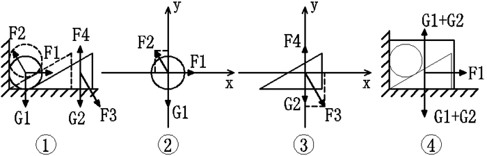
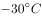
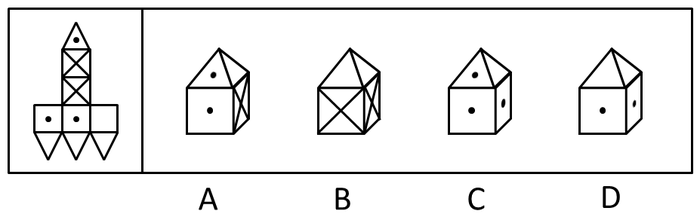
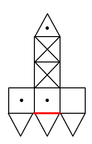
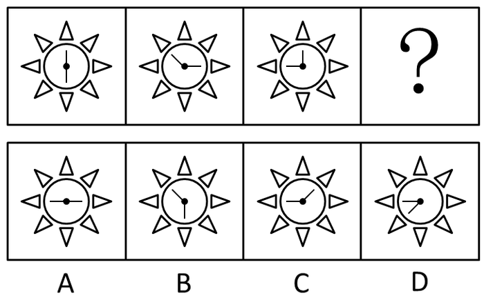
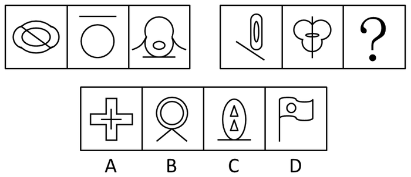
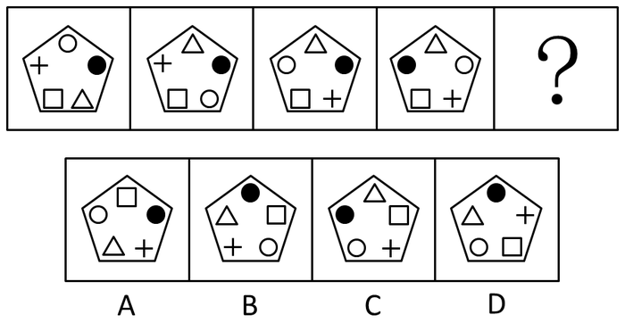
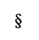
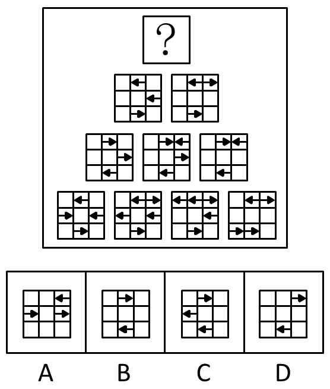

# 2016年上海市公务员录用考试《行测》题（B类）

> 判断推理 · 40 题 · 上海 2016

## 第 1 题　qid 1758862 · 逻辑判断

如图，三角形木块顶住水泥墙壁后静置在水平地面上，现将小铁球从图中位置无初速度地放开，假设不考虑任何摩擦力，那么小球从释放到落至地面的过程中，下列说法正确的是（  ）。

- **A**. 木块对小铁球的弹力不做功
- **B**. 木块的机械能守恒
- **C**. 小铁球的机械能的减少量等于木块动能的增大量　✅
- **D**. 以上说法均不正确

**答案**：C

**官方解析**

先对整个系统相对运动情况分析如图①。

A.对铁球受力分析如图②，F2即为木块对铁球弹力，方向垂直于木块斜面，由于铁球位移方向竖直向下，F2可分解为沿x轴和沿y轴方向，由功的定义F2这个外力对铁球做功，A错误。

B.对木块受力分析如图③，图②F2与图③F3为作用力与反作用力，木块位移水平向右，F3可分解为沿x轴和沿y轴方向，由功的定义F3这个外力对木块做功，所以机械能不守恒；或者可以从机械能的角度出发，木块由静止向右运动，可知木块势能不变动能增加，所以机械能不守恒，B错误。

C.对木块和铁球整体分析，两者只有重力做功，所以木块和铁球整体机械能守恒，铁球势能的减少量与动能增加量之和等于木块动能的增加量，C正确。

故正确答案为C。

---

## 第 2 题　qid 1758864 · 逻辑判断

真空玻璃是将两片平板玻璃或玻璃四周密闭起来，将其间隙抽成真空并密封排气孔，两片玻璃之间的间隙为0.1～0.2mm，真空玻璃的两片至少有一片是低辐射玻璃。根据以上信息，下列关于真空玻璃的描述错误的是（  ）。

- **A**. 为了达到玻璃内外压力的平衡，往往会在玻璃之间排列整齐小球，用来支撑玻璃承受外界大气压的压力
- **B**. 采用低辐射玻璃的原因是使辐射传热尽可能小
- **C**. 抽成真空的目的是减少气体传热的影响，从而使保温性能更好
- **D**. 抽成真空后隔音的效果会下降　✅

**答案**：D

**官方解析**

A项，当玻璃内真空时，玻璃内外有压强差而产生压力，为了达到玻璃内外的压力平衡，在玻璃内部排列小球以提供对玻璃内部的支持力，即A项正确，故不选A项。
B项，低辐射玻璃导热性差，使用其可以减少或阻隔热量的传递，即B项正确，故不选B项。
C项，真空下热量的传递效果大大降低，所以达到保温的功效，即C项正确，故不选C项。
D项，声音的传播需要介质，真空下声音无法传播，玻璃抽成真空后的隔音效果更好，即D项错误，故选择D项。
本题为选非题，故正确答案为D。

---

## 第 3 题　qid 1758866 · 类比推理

下列四幅图中，属于近视眼成像原理和远视眼矫正方法的分别是（  ）。  

- **A**. ①和③
- **B**. ②和③　✅
- **C**. ②和④
- **D**. ①和④

**答案**：B

**官方解析**

近视眼的眼球对光的折射程度很大，所以成像在视网膜的前方，②正确；远视眼的眼球对光的折射程度小，故佩戴凸透镜增加对光的折射，对视力进行矫正，③正确。
故正确答案为B。

---

## 第 4 题　qid 1758868 · 逻辑判断

如图，用绳子(质量忽略不计）将甲、乙两铁球挂在天花板上的同一个挂钩上，然后使两铁球在同一水平面上做匀速圆周运动，已知两铁球质量相等，那么下列说法中不正确的是（  ）。

- **A**. 甲的角速度一定比乙的角速度大　✅
- **B**. 甲的线速度一定比乙的线速度大
- **C**. 甲的加速度一定比乙的加速度大
- **D**. 甲所受绳子的拉力一定比乙所受的绳子的拉力大

**答案**：A

**官方解析**

设悬挂铁球的绳子与竖直方向的夹角为A，铁球圆周运动的圆心距绳子悬挂点的距离为L，则根据受力分析和几何关系得：铁球圆周运动的半径，铁球的加速度，根据圆周运动公式并代入可得：，。

题中甲悬挂的绳子与竖直方向的夹角大于乙悬挂绳子与竖直方向的夹角，根据上述得到的铁球运动的角速度与线速度公式可得：甲乙两铁球的角速度相等，甲的线速度大于乙的线速度，甲的加速度大于乙的加速度；又两球的质量相等，所受重力相同，则甲所受绳子的拉力一定大于乙所受绳子的拉力，故A项错误，B、C、D三项正确。

本题为选非题，故正确答案为A。

---

## 第 5 题　qid 1758870 · 逻辑判断

右图是煤气泄露报警装置原理图，是对煤气敏感的半导体元件，其电阻随煤气浓度的增加而减小，是一可变电阻，在ac间接12V的恒定电压，bc间接报警器，当煤气浓度增加到一定值时报警器发出警告。对此下列说法正确的是（  ）。

- **A**. 
减小的阻值，b点的电势升高

- **B**. 
当煤气的浓度升高时，b点的电势降低

- **C**. 
适当减小ac间的电压，可以提高报警器的灵敏度

- **D**. 
调节的阻值能改变报警器启动时煤气浓度的临界值
　✅

**答案**：D

**官方解析**

A项，减小的阻值，电阻两端分得电压减小，则b点的电势降低，故A项错误。

B项，煤气的浓度升高时阻值减小，电阻两端分得电压增加，b点的电势升高，故B项错误。

C项，当煤气浓度的改变量为一定值，适当减小ac间的电压时，b点的电势改变量减小，则导致报警器的灵敏度降低，故C项错误。

D项，报警器的报警电压值一定，调节的阻值，要使b点电势依然能达到报警电压，则电阻对应的临界值也要发生变化，煤气浓度临界值也将发生变化，故D项正确。

故正确答案为D。

---

## 第 6 题　qid 1758872 · 类比推理

小张放假回到农村，发现一个种子堆，好奇的小张把手伸到种子堆里，发现里面温度比较高，这主要是因为（  ）。

- **A**. 天气热
- **B**. 呼吸作用　✅
- **C**. 光合作用
- **D**. 保温作用

**答案**：B

**官方解析**

种子无法进行光合作用，且一直在进行呼吸作用，散发出热量，种子堆里发热的原因就是因为呼吸作用，故B项正确。
故正确答案为B。

---

## 第 7 题　qid 1758874 · 逻辑判断

蹦床运动员在离开蹦床一定高度后落回蹦床，若不考虑空气阻力，下列说法错误的是（  ）。

- **A**. 运动员在离开蹦床上升过程中，蹦床对运动员一定不做功
- **B**. 运动员在最高时，速度为零
- **C**. 运动员在最高点时，受到的合力为零　✅
- **D**. 运动员从最高点下落过程中，重力势能减小

**答案**：C

**官方解析**

A项，运动员离开蹦床上升，蹦床对运动员没有力的作用，则对运动员不做功，即A项正确，故不选A项。
B、C项，运动员在最高点时，速度为零，所受合力竖直向下，所受合力不为零，即B项正确，C项错误，故选择C项。
D项，运动员下落过程中，高度降低，重力势能减小，即D项正确，故不选D项。
本题为选非题，故正确答案为C。

---

## 第 8 题　qid 1758876 · 类比推理

如图，质量为65kg的小李站在重为3000N的铁皮船上，船体与陆地上的树木之间用滑轮组连接，小李用60N的拉力拉绳子（质量忽略不计）时，船体向前匀速移动，那么船在水中受到的阻力为（  ）N。

- **A**. 39
- **B**. 60
- **C**. 120
- **D**. 180　✅

**答案**：D

**官方解析**

绳子对人有60N的拉力，人没动，是因为船给人向后60N的摩擦力，故人给船60N向前的摩擦力。另外，由于滑轮组有两条绳子连着船上，故船受到绳子的拉力为120N。因此船受到的总拉力为N。

故正确答案为D。

---

## 第 9 题　qid 1758878 · 类比推理

地球是一个巨大的磁体，它的磁场分布情况与一个条形磁铁的磁场分布情况相似。地理南极相当于条形磁铁的N极，地理北极相当于条形磁场的S极，那么上海上空的磁场方向是（  ）。

- **A**. 由南至北斜向下沉　✅
- **B**. 由南至北斜向上升
- **C**. 由北至南斜向下沉
- **D**. 由北至南斜向上升

**答案**：A

**官方解析**

磁体外部的磁场方向由磁铁N极指向磁铁S极，则地球的磁场方向由南指向北，因为上海处于北半球，则磁场方向由南至北斜向下，故A项正确。
故正确答案为A。

---

## 第 10 题　qid 1758880 · 类比推理

炎热的夏天开车行驶在高速公路上，常觉得公路远处似乎有水面，水面上还有汽车、电线杆等物体的倒影，但当车行驶至该处时，却发现不存在这样的水面。出现这种现象是因为（  ）。

- **A**. 镜面反射
- **B**. 漫反射
- **C**. 直线传播
- **D**. 折射　✅

**答案**：D

**官方解析**

炎热夏天公路上温度很高，接近地面的空气温度较高，空气密度较低，远离地面空气温度较低，密度较大，且空气不断流动导致光在传播过程中发生折射，而人所看到的像是物体形成的虚像，故D项正确。
故正确答案为D。

---

## 第 11 题　qid 1758882 · 定义判断

健康传播是一种将医学研究成果转化为大众的健康知识。并通过大众生活态度和行为方式的改变来降低患病率和死亡率，有效提高一个社区或国家生活质量和健康水准的行为。
根据上述定义，下列不属于健康传播的是（  ）。

- **A**. 社区进行安全避孕宣传
- **B**. 国家立法禁止香烟广告
- **C**. 医学界举办学术研讨交流会　✅
- **D**. 学校开展卫生健康教育

**答案**：C

**官方解析**

第一步：找出定义关键词。
健康传播的定义条件为“医学研究成果转化为大众的健康知识”。
第二步：逐一分析选项。
A项：社区进行避孕宣传，属于医学研究成果转化为大众的健康知识，符合定义，排除；
B项：国家立法禁烟广告，属于医学研究成果转化为大众的健康知识，符合定义，排除；
C项：医学界举办学术研讨交流会，不属于医学研究成果转化为大众的健康知识，不符合定义，当选；
D项：学校开展卫生健康教育，属于医学研究成果转化为大众的健康知识，符合定义，排除。
本题为选非题，故正确答案为C。

---

## 第 12 题　qid 1758884 · 定义判断

顺应是指当环境发生改变或当生物迁入新环境时，生物对所在环境条件产生的生理适应过程。
根据上述定义，下列体现顺应的是（    ）。

- **A**. 
松树冬季的耐寒力由夏季的变为
　✅
- **B**. 
某些苍蝇由暗处飞到强光下，会不停地摆头决定方向

- **C**. 
小王转学进入新的学校学习，他更加勤奋了

- **D**. 
参加沟通技巧培训后，小李采用新的方式与他人交流

**答案**：A

**官方解析**

第一步：找出定义关键词。
“生物”、“生理适应过程”。
第二步：逐一分析选项。
A项：松树冬季的耐寒力的改变是生理适应，符合“生理适应过程”，符合定义，当选；
B项：苍蝇不停地摆头，属于动作变化，不符合“生理适应过程”，不符合定义，排除；
C项：小王勤奋，属于对待学习的态度，不符合“生理适应过程”，不符合定义，排除；
D项：小李改变交流方式，属于方法的改变，不符合“生理适应过程”，不符合定义，排除。
故正确答案为A。

---

## 第 13 题　qid 1758886 · 定义判断

社区行动是指社区居民为维护自身利益，促进社区的发展和进步而采取的共同行动。
根据上述定义，下列属于社区行动的是（  ）。

- **A**. 志愿者在某社区进行“节水从点滴做起”的宣传活动
- **B**. 退休工人老王办了社区爱心家政服务队，组织下岗职工的其他居民一起再就业
- **C**. 某小区居民用联名信的方式投诉小区附近的一家海鲜馆造成的环境卫生问题　✅
- **D**. 某小区有居民要求物业将绿地改为停车位

**答案**：C

**官方解析**

第一步：找出定义关键词。
社区行动的定义条件为：“社区居民”和“共同行动”。
第二步：逐一分析选项。
A项：志愿者不属于社区居民，不符合定义，排除；
B项：退休工人老王的行为不属于共同行动，不符合定义，排除；
C项：某小区居民用联名信的方式投诉，符合定义，当选；
D项：有居民要求物业将绿地改为停车位，不属于共同行动，不符合定义，排除。
故正确答案为C。

---

## 第 14 题　qid 1758888 · 定义判断

传媒接近权是指普通公民或社会组织享有的，由法律规定、认可和保障的，为公开发表、传递自己的意见、主张、观点、情感等内容而使用各种媒介手段与方式，不受任何他人或组织非法限制或侵犯的权利。
根据上述定义，下列不涉及传媒接近权的是（  ）。

- **A**. 政府召开新闻发布会　✅
- **B**. 企业在电视上播出产品广告
- **C**. 某学者在杂志上发表自己的学术观点
- **D**. 某人在报纸上刊登寻找失物的酬谢广告

**答案**：A

**官方解析**

第一步：找出定义关键词。
“普通公民或社会组织”、“为公开发表、传递自己的意见、主张、观点、情感等内容而使用各种媒介手段与方式”、“不受任何他人或组织非法限制或侵犯”。
第二步：逐一分析选项。
A项：“政府召开新闻发布会”是发布信息的法定形式，政府不属于“普通公民或社会组织”，召开新闻发布会也不涉及“不受任何他人或组织非法限制或侵犯”，不符合定义，当选；
B项：企业是社会组织，在电视上播出产品广告符合关键词“为公开发表、传递自己的意见、主张、观点、情感等内容而使用各种媒介手段与方式”，符合定义，排除；
C项：某学者是普通公民，在杂志上发表自己的学术观点符合关键词“为公开发表、传递自己的意见、主张、观点、情感等内容而使用各种媒介手段与方式”，符合定义，排除；
D项：某人是普通公民，在报纸上刊登寻找失物的酬谢广告符合关键词“为公开发表、传递自己的意见、主张、观点、情感等内容而使用各种媒介手段与方式”，符合定义，排除。
本题为选非题，故正确答案为A。

---

## 第 15 题　qid 1758890 · 定义判断

生物学家通过对选定的生物物种进行科学研究，用于揭示某种具有普遍规律的生命现象。此时，这种被选定的生物物种就是模式生物。
根据上述定义，下列不属于模式生物的是（  ）。

- **A**. 豌豆——孟德尔在揭示生物界遗传规律时选用豌豆作为实验材料
- **B**. 果蝇——生物学家摩根选用果蝇进行基因的突变进化研究
- **C**. 白鼠——现代医学研究大量使用白鼠作为实验动物
- **D**. 病菌——医院进行细菌培养以确认患者的感染病菌类型　✅

**答案**：D

**官方解析**

第一步：找出定义关键词。
模式生物的定义条件为“揭示某种普遍规律的生物现象”。
第二步：逐一分析选项。
A项：豌豆用于揭示生物界遗传规律的生物，符合定义，排除；
B项：果蝇用于揭示基因突变规律生物，符合定义，排除；
C项：白鼠用于实验的生物，符合定义，排除；
D项：病菌并未体现是具体哪种生物，也未体现生物规律，不符合定义，当选。
本题为选非题，故正确答案为D。

---

## 第 16 题　qid 1758892 · 定义判断

能指和所指是索绪尔语言学的一对术语。索绪尔认为，任何语言符号都是由能指和所指构成的。其中，能指是指符号的物质形式，由声音和形象两部分构成；所指是指语言所反映的事物的概念。而意指则代表了能指与所指之间的关系。意指有两个层次，第一层是直接意指，即语言符号形象具有直接的表现性；第二层是含蓄意指，语言符号形象本身没有直接的表现性，如文学创作中的隐喻、象征、引申等。
根据上述定义，下列表述错误的是（  ）。

- **A**. 孩子在公园游玩，看到了五彩缤纷的花朵，喊出了“花”这个字。在这里，被喊出的“花”这个字就是能指
- **B**. 如果所指是“木本植物的总称”，那么简体中文里的“树”、繁体中文里的“樹”和英语里的“tree”都是对应这一事物的能指
- **C**. 在网络语言中，网民喜欢用“杯具”来代替“悲剧”。因此，在这里“杯具”二字体现了意指的第一个层次　✅
- **D**. 在“硕鼠硕鼠，无食我黍”这句诗中具有含蓄意指

**答案**：C

**官方解析**

第一步：找出定义关键词。
能指的定义条件是“物质形式”；所指的定义条件是“概念”；意指第一层是语言符号形象具有直接的表现性；第二层是含蓄意指，语言符号形象本身没有直接的表现性。
第二步：逐一分析选项。
A项：孩子看到的花，是花的形象，属于物质形式，符合能指的定义条件，表述正确，排除；
B项：“木本植物的总称”是概念，符合所指的定义条件，而“树”“樹”以及“tree”指的是具体的物质形象，符合能指的定义条件，表述正确，排除；
C项：“杯具”表达“悲剧”的含义，并不是语言的直接表现性，不符合意指第一层，表述错误，当选；
D项：“硕鼠硕鼠，无食我黍”是以硕鼠喻剥削者，并不是语言的直接表现性，符合含蓄意指，表述正确，排除。
本题为选非题，故正确答案为C。

---

## 第 17 题　qid 1758948 · 图形推理

从所给的四个选项中，选择最合适的一个填入问号处，使之呈现一定的规律性：

- **A**. A　✅
- **B**. B
- **C**. C
- **D**. D

**答案**：A

**官方解析**

分析图形的特征。图形组成元素都相同，考虑图形的位置变化，同时九宫格中间图形最特殊，为空白面，考虑米字型路线观察。观察发现，米字型的上下左右以及对角线两端的图形都是旋转的关系。故问号处应为第一行第一个图形旋转得到，对应A项。

故正确答案为A。

---

## 第 18 题　qid 1758950 · 图形推理

左边给定的是图形外表面的展开图，右边哪一项能由它折叠而成？请把它找出来：

- **A**. A
- **B**. B
- **C**. C
- **D**. D　✅

**答案**：D

**官方解析**

B项：根据原图可知立体的底面应为两条对角线交叉的面，可直接排除B项；

A项：应用描线法，

与中红线应为同一条，具有黑点的三角形位置不对，可直接排除；

C项：应用描线法，与中红线为同一条，具有黑点的三角形位置不对，可直接排除。

故正确答案为D。

---

## 第 19 题　qid 1758952 · 图形推理

下列选项中，符合所给图形的变化规律的是（  ）。

- **A**. A
- **B**. B　✅
- **C**. C
- **D**. D

**答案**：B

**官方解析**

分析图形的特征。每行组成图形都相同，排除C项；研究图形的位置变化，每行两个元素相向而行，即左边的图向右走，右边的图向左走，而且每次移动的距离相同，排除A、D两项。
故正确答案为B。

---

## 第 20 题　qid 1758954 · 图形推理

下列选项中，符合所给图形的变化规律的是：

- **A**. A　✅
- **B**. B
- **C**. C
- **D**. D

**答案**：A

**官方解析**

图形元素组成相同，优先考虑位置规律。九宫格每行第一个图形向右翻转得到第二个图形，再由第二个图形上下翻转得到第三个图形。
故正确答案为A。

---

## 第 21 题　qid 1758956 · 图形推理

左边给定的是图形外表面的展开图，右边哪一项能由它折叠而成？请把它找出来：

- **A**. A
- **B**. B
- **C**. C　✅
- **D**. D

**答案**：C

**官方解析**

A项：原图中不存在三个白色的长方形，可直接排除；B项：两个白色长方形中间为黑色长方形，可直接排除；D项：任意一个白色长方形都要和黑色长方形相邻，可直接排除。
故正确答案为C。

---

## 第 22 题　qid 1758958 · 图形推理

下列选项中，符合所给图形的变化规律的是（  ）。

- **A**. A
- **B**. B
- **C**. C
- **D**. D　✅

**答案**：D

**官方解析**

分析图形的特征。
解法1：组成图形都相同，考查图形的位置变化。第一个图形上面的线段每次逆时针旋转45度，下面的线段每次逆时针旋转90度。
解法2：两条线段的夹角度数分别为180度、135度、90度。两条线段的夹角度数依次减小45度，则问号处应填入两条线段的夹角度数为45度的图形，对应D项。
故正确答案为D。

---

## 第 23 题　qid 1758960 · 图形推理

下列选项中，符合所给图形的变化规律的是（  ）。

- **A**. A
- **B**. B
- **C**. C
- **D**. D　✅

**答案**：D

**官方解析**

分析图形的特征。组成图形较为相似，考查样式求异运算。每组都是第一个图形和第二个图形去同存异得到第三个图形，只有D项符合。
故正确答案为D。

---

## 第 24 题　qid 1758962 · 图形推理

从所给的四个选项中，选择最合适的一个填入问号处。使之呈现一定的规律性。

- **A**. A
- **B**. B　✅
- **C**. C
- **D**. D

**答案**：B

**官方解析**

分析图形的特征。图形较为凌乱，考虑图形对称属性。第一列只为横轴对称图形，第二列为中心对称图形，第三列只为竖轴对称图形。
故正确答案为B。

---

## 第 25 题　qid 1758964 · 图形推理

下列选项中，符合所给图形的变化规律的是（  ）。

- **A**. A
- **B**. B
- **C**. C　✅
- **D**. D

**答案**：C

**官方解析**

分析图形的特征。每个图形均由直线曲线构成，考查直线曲线的静态位置关系，三个图形分别存在直线与曲线相交、相离、相切的关系。只有C项存在相切。
故正确答案为C。

---

## 第 26 题　qid 1758966 · 图形推理

请从四个选项中选出最恰当的一项填在问号处，使图形呈现一定的规律性：

- **A**. A
- **B**. B
- **C**. C　✅
- **D**. D

**答案**：C

**官方解析**

第一幅和第二幅图之间的区别在空心圆和三角位置互换了，第二幅和第三幅图之间的区别在于空心圆和十字位置互换了，由此可得，规律为相邻两幅图形有两个元素位置不同。因此问号处图形必须和第四幅图有两个元素位置不一样。
A项：四个元素位置不同，排除；
B项：五个元素位置不同，排除；
C项：方块和空心圆位置不同，即两个元素位置不同，符合题干规律，当选；
D项：五个元素位置不同，排除。
故正确答案为C。

---

## 第 27 题　qid 1758968 · 图形推理

下列选项中，符合所给图形的变化规律的是（    ）。

- **A**. A　✅
- **B**. B
- **C**. C
- **D**. D

**答案**：A

**官方解析**

 第一组图形：第一幅和第二幅有两个元素相同，变到第三幅图，把相同的去掉，不同的保留下来；

第二组图形：前两幅相同的是和，去掉后把不同的元素组合起来，得到A项。

故正确答案为A。

---

## 第 28 题　qid 1758970 · 图形推理

下列选项中，符合所给图形的变化规律的是（    ）。

- **A**. A
- **B**. B　✅
- **C**. C
- **D**. D

**答案**：B

**官方解析**

原图是由下往上，下面两幅图结合推出上面一幅图。其规律是：同一位置元素不同的就去掉变成空白，元素相同的就保留但方向变成相反的。

根据这个规律来观察：

相同的地方只有中间列的最上面和最下面，把方向反过来，最上面的箭头变成，最下面箭头变成，其他的都去掉变成空白，只有B项符合要求。

故正确答案为B。

---

## 第 29 题　qid 1758894 · 逻辑判断

据估计，可能有数以百万吨的塑料漂浮在海洋中。但是一项新研究发现，这些塑料有都消失不见了，研究人员认为大部分消失的塑料可能是被海洋生物吃掉了，并随之进入海洋食物链。

下列哪项最能对上述结论的正确与否进行评价？

- **A**. 海洋中除了塑料是否还有其他垃圾
- **B**. 除了被海洋生物吃掉，漂浮在海洋中的塑料是否会以其他形式消失　✅
- **C**. 是否能说进入海洋食物链的塑料就是“消失”了
- **D**. 消失的塑料最可能集中在哪些海域

**答案**：B

**官方解析**

第一步：找出论点和论据。
论点：大部分消失的塑料可能是被海洋生物吃掉了，并随之进入海洋食物链。
论据：无。
本题只有论点，没有论据，且提问方式为“下列哪项最能对上述结论的正确与否进行评价”，找出会影响论点成立的选项即可。
第二步：逐一分析选项。
A项：海洋中除了塑料是否还有其他垃圾，与塑料是否被海洋生物吃掉无关，无法对结论的正确与否进行评价，排除；
B项：除了被海洋生物吃掉，漂浮在海洋中的塑料是否会以其他形式消失，如果海洋中的塑料不会以其他形式消失，则论点成立；如果海洋中的塑料会以其他形式消失，则论点不成立，可以对结论的正确与否进行评价，当选；
C项：是否能说进入海洋食物链的塑料就是“消失”了，讨论的是塑料是否真的消失，与论点塑料是如何消失的无关，无法对结论的正确与否进行评价，排除；
D项：消失的塑料最可能集中在哪些海域，讨论的是塑料消失的地点，与论点塑料是如何消失的无关，无法对结论的正确与否进行评价，排除。
故正确答案为B。

---

## 第 30 题　qid 1758896 · 类比推理

某单位今年新招收了30名职工。
①新招收的职工里有人是外地的；
②新招收的职工里，学历最高的不是外地人；
③新招收的职工里有人不是外地的。
如果上述三个判断中只有一个是真的，则下列哪项正确地表示了该单位新招收的职工中外地人的数量：

- **A**. 只有1个人是外地人
- **B**. 30名职工都是外地人　✅
- **C**. 30名职工都不是外地人
- **D**. 只有1个人不是外地人

**答案**：B

**官方解析**

首先整理题干：①有人是外地的；②学历最高的不是外地人；③有人不是外地的。
分析可知①和③为反对关系，必有一真，条件说只有一真，则其余的（即②）为假，也就是说学历最高的是外地人，进而可知“有人是外地的”为真，即①为真，因为条件说只有一真，因此③为假，它的矛盾为真，即：所有人都是外地人。
故正确答案为B。

---

## 第 31 题　qid 1758898 · 逻辑判断

近十年来，我国每年授予的博士学位数量出现了持续性的上升，因此可以认为近十年我国研究生人数不断增加。
下列各项中，最能支持上述结论的是：

- **A**. 
近十年来，获得博士学位的难度并未发生变化

- **B**. 
近十年来，我国获得博士学位的人数在研究生总人数中所占的比例不变 
　✅
- **C**. 
今年申请攻读博士研究生的人数是十年前的2倍左右

- **D**. 
今年我国的博士研究生在研究生中仅占左右

**答案**：B

**官方解析**

第一步：分析题干。
论点：“近十年我国研究生人数不断增加”。
论据：“我国每年授予的博士学位数量出现了持续性的上升”。
第二步：逐一分析选项。
A项：难度不是题干讨论的主题，属于无关项，排除；
B项：博士学位数量上升，但比例不变，说明研究生总人数在增加，补充了一个前提，把论点论据联系起来，是搭桥，能加强，当选；
C项：申请的人数和授予的人数是两个概念，属于无关项，排除；
D项：题干论点说的是近10年的情况，选项说的是今年的情况，讨论话题不一致，排除。
故正确答案为B。

---

## 第 32 题　qid 1758900 · 逻辑判断

由于近年来在化肥、农药施用和管理技术等方面出现问题，我国北方大葱主产地的大葱产量出现明显下降，国内价格快速上涨。要想维持国内价格稳定，就必须严格限制大葱出口。因为从事大葱出口贸易的企业的出口合同都是在低价位时签订的，如果在大葱价格大幅上涨时继续履行合同，这些企业就会出现严重亏损。但是，如果严格限制大葱出口，我国在国际大葱市场所占有的份额就将被其他国家或地区所取代。
如果以上陈述为真，下列哪项一定为真？

- **A**. 如果不是出现化肥、农药施用和管理技术等方面的问题，就不会严格限制大葱出口
- **B**. 如果严格限制大葱出口，国内大葱价格就不会继续上涨
- **C**. 如果要维持国内大葱价格的稳定，就会失去我国在国际大葱市场所占有的份额　✅
- **D**. 为了避免损失，从事大葱出口贸易的企业肯定会积极游说政府制定严格限制大葱出口的政策

**答案**：C

**官方解析**

第一步：翻译题干。

①维持价格稳定限制大葱出口

②大葱价格上涨时履行合同企业亏损

③限制大葱出口国际市场份额被取代

将①③串联可以递推出：④维持价格稳定限制大葱出口国际市场份额被取代

第二步：逐一分析选项。

A项：翻译为技术问题限制大葱出口，题干没有涉及二者的推出关系，无法推出，排除；

B项：翻译为限制大葱出口大葱价格上涨，要么是肯定①的后项，肯后推不出必然性结论，要么是肯定③的前项，但是无法推出“大葱价格上涨”，即两种情况都无法推出确定的结论，无法推出，排除；

C项：翻译为维持价格稳定国际市场份额被取代，是对④的肯前，肯前必肯后，可以推出，当选；

D项：翻译为企业亏损限制大葱出口，题干没有涉及二者的推出关系，无法推出，排除。

故正确答案为C。

---

## 第 33 题　qid 1758902 · 逻辑判断

某国人口统计机构预测，到2031年，该国人口将降到1.27亿以下，在今后40年内人口将减少2400万，为此，该国政府出台一系列鼓励生育的政策。近年来，该国人口总数趋于稳定，截至2014年6月1日，人口数量为1.461亿。2014年1至5月人口增长量为5.91万，增长率为。因此，有专家认为该国实施的鼓励生育政策达到了预期的效果。

下列选项如果为真，最能加强上述观点的是：

- **A**. 如果该国政府没有出台鼓励生育的政策，儿童人口总数会持续下降　✅
- **B**. 如果该国政府出台更加有效的鼓励生育政策，就可以提高人口质量
- **C**. 近年来该国人口总数出现缓慢上升的趋势
- **D**. 该国政府出台的鼓励生育政策是一项长期国策

**答案**：A

**官方解析**

 第一步：分析题干。

论点：“该国实施的鼓励生育政策达到了预期的效果”。

论据：“近年来，该国人口总数趋于稳定，截至2014年6月1日，人口数量为1.461亿。2014年1至5月人口增长量为5.91万，增长率为。”

第二步：逐一分析选项。

A项：没有该政策就不行，证明该政策是有效果的，排除他因，是加强论点，当选；

B项：其他政策与该政策无关，主体不一致，排除；

C项：人口总数的上升只是重复了一下原论据，并没有增加新的证据，力度很弱，排除；

D项：长期国策与是否有效无关，排除。

故正确答案为A。

---

## 第 34 题　qid 1758904 · 类比推理

教育主管部门应该制定政策，要求从小学就开设逻辑课程，否则学生就难以对现有的知识体系与价值观念展开反思、提出质疑，而逻辑课程能够帮助学生从小养成进行反思、提出质疑的习惯，提高相应的能力。
上述议论预设了下列哪项假设？
Ⅰ除非从小学开始学习逻辑，否则学生难以区分真善美与假恶丑
Ⅱ即使在小学阶段，学生也有能力理解并运用某些逻辑理论与方法
Ⅲ学生对现有的知识体系与价值观念展开反思、提出质疑，这本身是一件好事

- **A**. Ⅰ
- **B**. Ⅲ
- **C**. Ⅱ和Ⅲ　✅
- **D**. Ⅰ、Ⅱ和Ⅲ

**答案**：C

**官方解析**

分析题干。
论点：要从小学就开始开设逻辑课程。
论据：逻辑课程能帮助学生从小培养质疑反思的能力。
Ⅰ区分真善美与假恶丑虽然是价值观，但题干中开设逻辑课程的主要目的是培养反思质疑的能力，因此不符合题意，不是前提，错误；
Ⅱ有能力理解运用是小学开设逻辑课程能对学生有帮助的前提，即是论据的前提，正确；
Ⅲ质疑反思是好事，才要去开课，这句话是执行论点的前提，正确。
故正确答案为C。

---

## 第 35 题　qid 1758906 · 逻辑判断

某年，冀城、豫城、徐城、兖城、青城等五座城市的游客数量比往年偏多，这些城市分别有着不同的地理环境和旅游资源：险峻的高山、茂密的森林、平坦的草原、辽阔的大海和幽静的河谷。该年前往上述五座城市的游客量（人次/年）分别是：12万、27万、32万、44万、65万。已知：
（1）草原中的城市对游客的吸引力最小，最受欢迎的旅游目的是森林
（2）徐城在大山中，交通不方便，但是来此旅游的人却不少
（3）冀城的游客量比兖城多
（4）兖城的游客量是44万人次，创历史新高
（5）前往豫城的游客比青城多，但是没有徐城多
根据上述条件，可以推出青城的特色旅游资源是：

- **A**. 幽静的河谷
- **B**. 茂密的森林
- **C**. 平坦的草原　✅
- **D**. 辽阔的大海

**答案**：C

**官方解析**

分析题干：由（1）得出草原游客量12万，森林游客量65万；
由（3）（4）得出冀城游客量65万；由（5）得出青城＜豫城＜徐城，因此青城游客量最少，为12万；而草原游客量也是12万，所以青城的特色旅游资源是草原。
故正确答案为C。

---

## 第 36 题　qid 1758908 · 逻辑判断

小陈因不具有研究生身份而被图书馆工作人员拒绝进入古籍书库。小陈出示古籍善本书库出入证说：根据规定，我可以进入古籍书库。古籍书库的规定是：不是研究生不能进入古籍书库；只有持有古籍善本书库出入证，才能进入古籍善本书库。
小陈最有可能把古籍书库的规定理解为：

- **A**. 准许进入古籍书库的人，不一定准许进入古籍善本书库
- **B**. 有了古籍善本书库出入证，就不需要研究生身份
- **C**. 如果持有古籍善本书库出入证，就能进入古籍书库　✅
- **D**. 除非持有古籍善本书库出入证，否则不能进入古籍善本书库

**答案**：C

**官方解析**

第一步：分析题干。

图书馆的规定：古籍书库研究生，善本书库出入证。

小陈的理解：出入证古籍书库。

第二步：逐一分析选项 。

A项：与小陈的理解无关，排除；

B项：与小陈的理解无关，排除；

C项：出入证古籍书库，符合小陈理解，当选；

D项：善本书库出入证，这是书店规定，不是小陈理解，排除。

故正确答案为C。

---

## 第 37 题　qid 1758910 · 逻辑判断

在过去五年里，xx型高速列车先后发生了4次脱轨事故。针对xx型高速列车存在设计缺陷的公众质疑，该型号的列车制造商提出反驳：调查表明，每一次脱轨事故都是由于驾驶员违反操作规程而导致的。
列车制造商的反驳是基于下列哪项假设？

- **A**. 在质疑xx型高速列车存在设计缺陷时，公众并没有明确指出究竟存在何种缺陷
- **B**. 过去五年里，高速列车的脱轨事故并不都是由于驾驶员违反操作规程而导致的
- **C**. 调查人员有能力弄清楚脱轨事故究竟是由于列车设计缺陷还是由于列车制造方面的问题导致的
- **D**. xx型高速列车不存在任何能导致驾驶员违反操作规程的设计缺陷　✅

**答案**：D

**官方解析**

第一步：找出论点和论据。
论点：“每一次脱轨事故都是由于驾驶员违反操作规程而导致的。”
论据：是调查。
第二步：逐一分析选项。
A项：针对xx型高速列车存在设计缺陷的公众质疑跟列车制造商的反驳是两个不同的观点，排除；
B项：不都是违规造成，但是不是因为设计缺陷也不清楚，因为原因可能多种多样，为无关项，排除；
C项：有能力弄清楚，但是没有得出确切结论，为不明确项，排除；
D项：不存在任何设计缺陷，说明都是人为，肯定论点，是加强项，当选。
故正确答案为D。

---

## 第 38 题　qid 1758912 · 逻辑判断

某经济学院从国外引进了30种教材，其中，金融类教材12种，非金融类的英文教材10种，从美国引进的非金融类教材7种，从美国以外国家引进的非英文教材9种。
根据上文，可以推知：

- **A**. 从美国引进的、非英文的金融类教材不超过8种
- **B**. 从美国引进的、非英文的金融类教材至少有8种
- **C**. 从美国以外国家引进的、非英文的金融类教材不超过8种　✅
- **D**. 从美国以外国家引进的、非英文的金融类教材至少有8种

**答案**：C

**官方解析**

第一步：分析题干条件。
①从国外引进30种教材；
②金融类教材12种；
③非金融类的英文教材10种；
④从美国引进的非金融类教材7种；
⑤从美国以外国家引进的非英文教材9种。
第二步：根据题干条件进行推理。
根据条件①②可知，总共引进了30种教材，其中金融类为12种，那么非金融类应为30-12=18种；根据条件③可知，非金融英文类10种，那么非金融非英文类应该为18-10=8种；
根据条件④可知，美国引进非金融类7种，那么非金融类非美国应该为18-7=11种；此时，非金融类非英文类+非金融类非美国=8+11=19种，但非金融类总数为18种，因此至少有1种同时满足非金融类非英文类非美国；根据条件⑤可知，非美国非英文类为9种，根据非金融类非英文类非美国至少为1种可知，金融类非英文类非美国至多为9-1=8种。
故正确答案为C。

---

## 第 39 题　qid 1758914 · 逻辑判断

某文学期刊网站的栏目设置通常根据读者反馈与浏览量的情况随时调整。去年九月，一批新栏目出现在改版后的网站上。其中，5个栏目是喜剧幽默类的连载，3个栏目是长篇类科幻小说连载，2个栏目是文学批评类的内容。到今年一月，这些新上线的栏目只有7个还在继续更新，其中5个是喜剧幽默类的连载。
如果上述陈述为真，下列哪项可以从题干中推出？

- **A**. 只有1个文学批评类的栏目还持续更新
- **B**. 只有1个长篇科幻类小说的栏目还持续更新
- **C**. 至少有1个长篇科幻类小说的栏目已经下线　✅
- **D**. 相比于文学批评类的内容，读者们更喜欢喜剧幽默类的连载

**答案**：C

**官方解析**

分析题干：总共有7个更新，5个是喜剧幽默，那么剩下的2个是科幻和文学类。科幻原来有3个，就算2个都是科幻，也会有一个下线，因此C项是必然可以推出的。
故正确答案为C。

---

## 第 40 题　qid 1758916 · 逻辑判断

经过全力检测和排查，疾控中心的专家确定如下事实：
（1）如果蒋某和张某都感染了H7N9新型禽流感病毒，则李某没有被感染；
（2）李某感染了H7N9新型禽流感病毒，而且王某的陈述正确；
（3）只有王某的陈述不正确，张某才没有感染H7N9新型禽流感病毒。
由上述事实可以推出（  ）。

- **A**. 蒋某没有感染H7N9新型禽流感病毒，张某感染了　✅
- **B**. 蒋某和李某都感染了H7N9新型禽流感病毒
- **C**. 李某和王某都感染了H7N9新型禽流感病毒
- **D**. 蒋某感染了H7N9新型禽流感病毒，张某没有感染

**答案**：A

**官方解析**

第一步：翻译题干。
（1）蒋且张→非李；
（2）李且王对；
（3）非张→非王对。
第二步，逐一分析选项。
由条件（1）（3）得“李→非蒋或非张”“王对→张”；
由或关系否定其一，另一个一定为真得出“张→非蒋”；
因此张某感染了，蒋某没有感染。
故正确答案为A。

---
