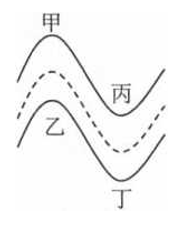
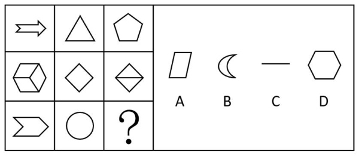
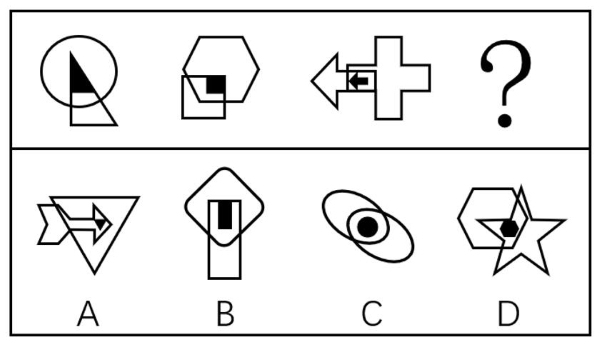
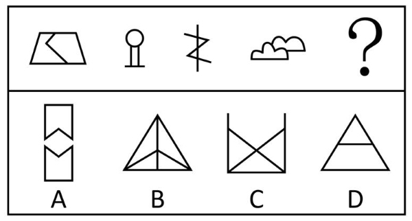
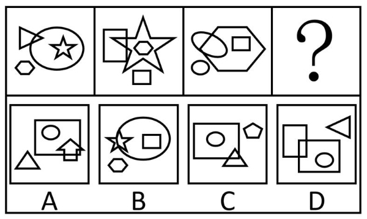
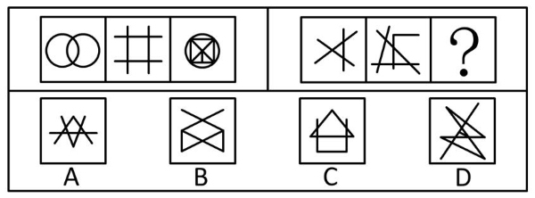
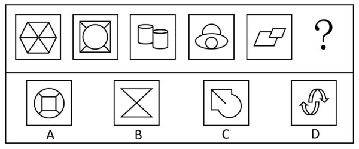
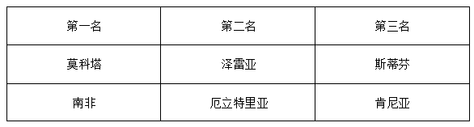

# 2016年上海市行政执法类考试《行测》试题（网友回忆版）

> 判断推理 · 30 题 · 上海 2016

## 第 1 题　qid 5701836 · 逻辑判断

二氧化硫、氮氧化物以及可吸入颗粒物这三项是雾霾的主要组成，前两者为气态污染物，最后一项颗粒物才是加重雾霾天气污染的罪魁祸首。下列有关雾霾说法不正确的是        。

- **A**. 雾霾天气时光照严重不足，紫外线明显减弱，使得空气中的细菌很难被杀死
- **B**. 机动车尾气的排放是雾霾天气形成的原因之一
- **C**. 工地建设的扬尘不属于可吸入颗粒物，因此不是雾霾形成的主要原因　✅
- **D**. 雾霾会对人体的呼吸道造成伤害

**答案**：C

**官方解析**

A项：紫外线具有杀灭细菌的作用，雾霾天气会减弱光照，从而减弱紫外线的照射，使得空气中的细菌很难被杀死，正确；
B项：汽车尾气中含有二氧化硫、氮氧化物、可吸入颗粒物，这三类物质为雾霾的主要构成，故机动车尾气的排放是雾霾天气形成的原因之一，正确；
C项：工地的扬尘根据其颗粒大小可分为降尘、飘尘、可吸入颗粒物，其中可吸入颗粒物是雾霾的主要构成之一，错误；
D项：根据以上分析可知，雾霾天气时，不仅使得空气中的细菌很难被杀死，同时空气中还有大量的可吸入颗粒物，因此会对人体的呼吸道造成伤害，正确。
本题为选非题，故正确答案为C。

---

## 第 2 题　qid 5701925 · 逻辑判断

活性炭是由含碳为主的物质作原料，经高温炭化和活化而成。活性炭含有大量微孔，具有较强的吸附作用。下列关于活性炭的说法正确的是        。

- **A**. 饮用水净化中应用活性炭可以吸附水中几乎所有的重金属离子
- **B**. 活性炭口罩对pm2.5颗粒能起到非常好的阻挡效果
- **C**. 放置于冰箱中的活性炭可以起到消除异味的作用　✅
- **D**. 房屋装修时使用活性炭主要是为了防潮，但对空气中的苯、甲醛等有害气体无法有效吸附

**答案**：C

**官方解析**

A项：在饮用水净化中，活性炭主要吸附气味分子、色素、不溶于水的颗粒等，活性炭无法有效吸附可溶于水的重金属离子，错误；

B项：活性炭微孔的孔径通常在2-50nm之间，pm2.5颗粒的粒径小于或等于，即2500nm，故活性炭无法有效吸附pm2.5颗粒，错误；

C项：活性炭中含有大量微孔，与空气接触的表面积较大，可有效吸附气味分子，起到消除异味的作用，正确；

D项：活性炭除了可以吸附水分子外，还可以吸附空气中的苯、甲醛等有害气体，错误。

故正确答案为C。

---

## 第 3 题　qid 5701927 · 逻辑判断

如图所示是个水果电池示意图，将一个柠檬捏软，插入一把铁叉和一把铜钥匙作为正负极，下列相关叙述错误的是<u>        </u>。

- **A**. 捏软柠檬是为了让其内部产生更多的果汁，增强电解液的活性
- **B**. 一个水果电池并不能使小灯泡发光的原因是电池电压较低
- **C**. 如果用两把相同的铁叉也能做成水果电池　✅
- **D**. 如果将几个柠檬串接起来形成的电池效果会更好

**答案**：C

**官方解析**

根据题意可知，本题中铁叉和铜钥匙分别作为该水果电池的正、负极，铁为活泼金属，铜为不活泼金属，因为柠檬汁呈酸性，其中含有氢离子，又因为在酸性条件下活泼金属铁易失去电子，而铜不易失去电子，故电子可经导线由铁叉移动到铜钥匙处，由于电子带负电，所以根据电子定向移动的反向可知，铜钥匙为正极，铁叉为负极。
A项：捏软柠檬可产生更多的柠檬汁，可使该水果电池产生更多的氢离子，从而增强电解液的活性，正确；
B、D两项：一个水果电池的电压较小，不能使小灯泡发光，但若将多个水果电池串接在一起，相当于将多个电池串联，可使整体的电压增大，电池效果会更好，B、D两项均正确；
C项：如果用两把相同的铁叉制作水果电池，此时正、负极金属的活动性相同，则无法使电子产生定向移动，也就无法做成水果电池，错误。
本题为选非题，故正确答案为C。

---

## 第 4 题　qid 5701894 · 类比推理

小明在家观看汽车拉力赛，发现汽车行驶在一段s形的弯道上，如图所示，如果要保证现场观众的安全，观众应站在图中的位置是<u>        </u>。

- **A**. 甲、丙
- **B**. 甲、丁
- **C**. 乙、丙　✅
- **D**. 乙、丁

**答案**：C

**官方解析**

由图可知，汽车在转弯时做圆周运动，水平方向的静摩擦力为其提供向心力，由于路面对汽车的最大静摩擦力（）近似等于滑动摩擦力，根据滑动摩擦力公式可知，当汽车对路面的压力保持不变时，路面对汽车的最大静摩擦力（）不变，根据向心力的公式可知，汽车过弯的速度越大，则所需的向心力越大，若汽车过弯时的速度过大，所需向心力超过路面对汽车的最大静摩擦力时，路面对汽车的最大静摩擦力无法使汽车在当前赛道上做圆周运动，汽车会向远离圆心的方向偏离赛道，即向弯道外部偏离，所以观众站在弯道内部较为安全，即观众应站在乙处或丙处，C项正确，A、B、D三项均错误。

故正确答案为C。

---

## 第 5 题　qid 5701890 · 类比推理

我们生活中经常会使用各种喷瓶，在喷到喷出的液体时我们常会觉得凉凉的，这主要是因为        。

- **A**. 喷出的液滴蒸发吸收热量　✅
- **B**. 液体急剧膨胀吸热
- **C**. 液体经过喷瓶作用汽化了
- **D**. 液体分子的比热容远大于空气分子

**答案**：A

**官方解析**

喷瓶可将瓶内的液体变成雾状的小液滴形式喷出，当人体接触到这些小液滴时，由于小液滴表面积体积比较大，容易蒸发，又因为蒸发吸热，所以人体会感觉凉凉的。A项正确，B、C、D三项均错误。
故正确答案为A。

---

## 第 6 题　qid 5702201 · 定义判断

肥皂水效应就是指将批评夹在赞美中，将对他人的批评放在前（后）肯定的话语之中， 以减少批评的负面效应，使被批评者愉快地接受对自己的批评。
根据上述定义，下列不符合肥皂水效应的是        。

- **A**. 美国总统柯立芝在要求女秘书提高公文处理能力时说：“你今天穿的衣服真漂亮，我相信你的公文处理能力也可以一样漂亮。”
- **B**. 小张的妈妈对他说：“在这件事上你已经做得很好了，不过也许你还可以做得更好。”
- **C**. 评委在对参赛选手的表现进行点评时，先赞扬了选手积极认真的态度，但是由于客观上的不足，他还是不能让该选手通过
- **D**. 老师在公布考试成绩时，先表扬了取得进步的学生，然后批评了成绩下降的学生　✅

**答案**：D

**官方解析**

第一步：找出定义关键词。
“将对他人的批评放在前（后）肯定的话语之中”、“以减少批评的负面效应，使被批评者愉快地接受对自己的批评”。
第二步：逐一分析选项。
A项：该项中总统先夸女秘书的衣服漂亮，再说“我相信你的公文处理能力也可以一样漂亮”，说明女秘书的公文处理能力欠佳，总统先赞美其衣服，再提出批评，符合“将对他人的批评放在前（后）肯定的话语之中”、“以减少批评的负面效应，使被批评者愉快地接受对自己的批评”，符合定义，排除；
B项：该项中妈妈先肯定小张已经做得很好，再说“不过也许你还可以做得更好”，说明小张在这件事上还没有做到让妈妈满意的程度，妈妈先表扬，再提出批评，符合“将对他人的批评放在前（后）肯定的话语之中”、“以减少批评的负面效应，使被批评者愉快地接受对自己的批评”，符合定义，排除；
C项：该项中评委先赞扬了选手积极认真的态度，再提出客观上的不足，对该选手进行了淘汰，符合“将对他人的批评放在前（后）肯定的话语之中”、“以减少批评的负面效应，使被批评者愉快地接受对自己的批评”，符合定义，排除；
D项：该项中老师先表扬了成绩进步的学生，再批评了成绩下降的学生，表扬和批评的是两个不同的群体，不符合“将对他人的批评放在前（后）肯定的话语之中”、“以减少批评的负面效应，使被批评者愉快地接受对自己的批评”，不符合定义，当选。
本题为选非题，故正确答案为D。

---

## 第 7 题　qid 5702204 · 定义判断

文化认同指个体对于所属文化的归属感及内心的承诺，从而获得保持与创新自身文化属性的社会心理过程。
根据上述定义，下列不涉及文化认同的是        。

- **A**. 小李在国际夏令营活动中结交到了很多外国朋友，这些外国人都对中国传统文化很感兴趣　✅
- **B**. 古代中国人认为自己是唯一称得上“文明”的国度，而周边国家只是接受中华文化恩惠的蛮夷和藩属
- **C**. 中国在历史上曾几经分裂，但随着民族和文化的融合，统一始终是中华民族的共同理想和追求目标
- **D**. 海外华人，即使长期身在异国他乡也保留了过“春节”的习惯

**答案**：A

**官方解析**

第一步：找出定义关键词。
“个体对于所属文化的归属感及内心的承诺”、“从而获得保持与创新自身文化属性的社会心理过程”。
第二步：逐一分析选项。
A项：该项中外国人对中国传统文化很感兴趣，说明是外国人对中国文化的认同，不符合“个体对于所属文化的归属感及内心的承诺”，不符合定义，当选；
B项：该项中古代中国人认为自己是唯一称得上“文明”的国度，说明古代中国人对于中国所属文化都是认同的，符合“个体对于所属文化的归属感及内心的承诺”，符合定义，排除；
C项：该项中指出中华民族的共同理想和追求目标是“统一”，说明中华民族的成员都认同这个理想和目标，符合“个体对于所属文化的归属感及内心的承诺”，符合定义，排除；
D项：该项中身在异国他乡的华人保留过“春节”的习惯，体现了华人对于中华文化的认同，符合“个体对于所属文化的归属感及内心的承诺”，符合定义，排除。
本题为选非题，故正确答案为A。

---

## 第 8 题　qid 5702206 · 定义判断

服从是指在社会要求、群体规范或他人意志下做出自己本不愿意做出的行为。
根据以上定义，以下属于服从的是        。

- **A**. 在找工作的压力下，小王不得不努力通过证券从业资格考试
- **B**. 小李虽然不赞同团队的决定，但还是在规定的时间去了目的地　✅
- **C**. 大家在学校的教学楼和图书馆里都会不约而同地保持安静
- **D**. 对于大学生业余兼职，刘老师不赞成也不反对

**答案**：B

**官方解析**

第一步：找出定义关键词。
“在社会要求、群体规范或他人意志下”、“做出自己本不愿意做出的行为”。
第二步：逐一分析选项。
A项：该项中小王努力通过考试是否为小王本不愿意做出的行为并不明确，不符合“在社会要求、群体规范或他人意志下”、“做出自己本不愿意做出的行为”，不符合定义，排除；
B项：该项中小李不赞同团队的决定，说明小李本不愿意去，但在群体规范下还是去了，符合“在社会要求、群体规范或他人意志下”、“做出自己本不愿意做出的行为”，符合定义，当选；
C项：该项中大家在公共场所保持安静是否为大家本不愿意做出的行为并不明确，不符合“在社会要求、群体规范或他人意志下”、“做出自己本不愿意做出的行为”，不符合定义，排除；
D项：该项中刘老师对于大学生业余兼职的现象未明确表态，不符合“在社会要求、群体规范或他人意志下”、“做出自己本不愿意做出的行为”，不符合定义，排除。
故正确答案为B。

---

## 第 9 题　qid 5702207 · 定义判断

环境教育是指借助教育手段使人们认识环境、了解环境问题，获得治理环境污染和防止新的环境问题产生的知识和技能，并在人与环境的关系上树立正确的态度，以便通过社会成员的共同努力保护环境。
根据上述定义，下列不属于环境教育的是        。

- **A**. 某杂志每期都会刊登一个环境污染案例，用图文并茂的形式向读者展示污染给人们生活生产带来的影响
- **B**. 教育部要求在中小学相关学科教学内容中要讲授环境保护知识
- **C**. 孟母为了使孟子拥有一个好的教育环境，煞费苦心，曾迁居3地　✅
- **D**. 近日，某校组织孩子们到市郊绿地进行植树活动

**答案**：C

**官方解析**

第一步：找出定义关键词。
“借助教育手段”、“使人们认识环境、了解环境问题，获得治理环境污染和防止新的环境问题产生的知识和技能，并在人与环境的关系上树立正确的态度”、“以便通过社会成员的共同努力保护环境”。
第二步：逐一分析选项。
A项：该项中某杂志每期都会刊登环境污染案例，给读者展示污染给生活生产带来的影响，是希望通过案例让人们重视环境污染问题，符合“借助教育手段”、“使人们认识环境、了解环境问题，获得治理环境污染和防止新的环境问题产生的知识和技能，并在人与环境的关系上树立正确的态度”、“以便通过社会成员的共同努力保护环境”，符合定义，排除；
B项：该项中在中小学相关学科教学中讲授环境保护知识，符合“借助教育手段”、“使人们认识环境、了解环境问题，获得治理环境污染和防止新的环境问题产生的知识和技能，并在人与环境的关系上树立正确的态度”、“以便通过社会成员的共同努力保护环境”，符合定义，排除；
C项：该项中“孟母三迁”是为了让孟子有良好的教育环境，不符合“借助教育手段”、“使人们认识环境、了解环境问题，获得治理环境污染和防止新的环境问题产生的知识和技能，并在人与环境的关系上树立正确的态度”、“以便通过社会成员的共同努力保护环境”，不符合定义，当选；
D项：该项中学校组织孩子们进行植树活动，符合“借助教育手段”、“使人们认识环境、了解环境问题，获得治理环境污染和防止新的环境问题产生的知识和技能，并在人与环境的关系上树立正确的态度”、“以便通过社会成员的共同努力保护环境”，符合定义，排除。
本题为选非题，故正确答案为C。

---

## 第 10 题　qid 5702208 · 定义判断

情绪型消费者是指消费行为容易受到情绪支配的消费者，在购买商品的过程中，这类消费者情绪反应比较强烈，容易受商店布置、广告、商品陈列、营业员的服务态度等各种购物现场因素的影响。
以下属于情绪型消费者的是        。

- **A**. 小李被老师骂完后，总是要买很多零食以泄愤
- **B**. 某咖啡厅里灯光柔和，环境优雅，小王每次到这里喝咖啡心情都很愉悦，总会多买几块甜点配咖啡　✅
- **C**. 小刘路过一家小店，禁不住店员的不断游说，以高价买了一条很早就想买的裙子
- **D**. 小林看到商店的橱窗里有一对耳环非常别致，刚好是她去参加晚会所需要的，就立即将其买下

**答案**：B

**官方解析**

第一步：找出定义关键词。
“消费行为容易受到情绪支配的消费者”、“在购买商品的过程中”、“容易受商店布置、广告、商品陈列、营业员的服务态度等各种购物现场因素的影响”。
第二步：逐一分析选项。
A项：该项中小李买零食是因为被老师骂，不符合“容易受商店布置、广告、商品陈列、营业员的服务态度等各种购物现场因素的影响”，不符合定义，排除；
B项：该项中小王因为咖啡厅的环境比较优雅，喝咖啡时的心情比较愉悦，总会多买几块甜点配咖啡，符合“消费行为容易受到情绪支配的消费者”、“在购买商品的过程中”、“容易受商店布置、广告、商品陈列、营业员的服务态度等各种购物现场因素的影响”，符合定义，当选；
C项：该项中小刘以高价买了一条很早就想买的裙子，说明小刘本身就想买裙子，而不是受情绪支配，不符合“消费行为容易受到情绪支配的消费者”、“容易受商店布置、广告、商品陈列、营业员的服务态度等各种购物现场因素的影响”，不符合定义，排除；
D项：该项中小林买耳环是因为参加晚会需要，说明小林是根据自己的需求购买商品，而不是受情绪支配，不符合“消费行为容易受到情绪支配的消费者”、“容易受商店布置、广告、商品陈列、营业员的服务态度等各种购物现场因素的影响”，不符合定义，排除。
故正确答案为B。

---

## 第 11 题　qid 5702215 · 图形推理

下列选项中，符合所给图形的变化规律的是<u>        </u>。

- **A**. A　✅
- **B**. B
- **C**. C
- **D**. D

**答案**：A

**官方解析**

元素组成相似，优先考虑样式规律。题干分为两组图形，每组图形相同线条重复出现，可考虑加减同异。观察发现，第一组图形的图1和图2去异求同后得到图3；第二组图形应用此规律，只有A项符合。
故正确答案为A。

---

## 第 12 题　qid 5702216 · 图形推理

下列选项中，符合所给图形的变化规律的是<u>        </u>。

- **A**. A
- **B**. B
- **C**. C
- **D**. D　✅

**答案**：D

**官方解析**

元素组成不同，无明显属性规律，考虑数量规律。观察发现，题干图形中出现一些多边形，优先考虑直线数。九宫格图形优先看横行，题干第一行图形直线数依次为：8、3、5，题干第二行图形直线数依次为：9、4、5，即8-3=5，9-4=5，故每行第一个图形的直线数-第二个图形的直线数=第三个图形的直线数，第三行前两个图形的直线数分别为：6、0，故？处图形的直线数应为6，只有D项符合。
故正确答案为D。

---

## 第 13 题　qid 5702218 · 图形推理

下列选项中，符合所给图形的变化规律的是<u>        </u>。

- **A**. A
- **B**. B　✅
- **C**. C
- **D**. D

**答案**：B

**官方解析**

题干每幅图形均出现两个白色封闭图形相交，优先考虑图形间关系。观察发现，黑色图形与其中一个白色封闭图形的形状相同，排除C项；继续观察发现，题干黑色图形均和与其形状相同的白色封闭图形相交，排除A、D两项，只有B项符合。
故正确答案为B。

---

## 第 14 题　qid 5702219 · 图形推理

下列选项中，符合所给图形的变化规律的是<u>        </u>。

- **A**. A
- **B**. B
- **C**. C
- **D**. D　✅

**答案**：D

**官方解析**

元素组成不同，无明显属性规律，考虑数量规律。观察发现，图形分割明显，考虑数面，题干图形的面数量均为2，故？处图形的面数量应为2，排除B、C两项；继续观察发现，题干图形的部分数均为1，故？处图形的部分数应为1，只有D项符合。
故正确答案为D。

---

## 第 15 题　qid 5702220 · 图形推理

下列选项中，不符合所给图形的变化规律的是<u>        </u>。

- **A**. A
- **B**. B　✅
- **C**. C
- **D**. D

**答案**：B

**官方解析**

元素组成相似，优先考虑样式规律，题干图形中相同元素重复出现，考虑遍历。观察发现，每幅图均存在4个不同的元素，对于图中面积最大的元素来说，和其他三个元素的位置关系分别为内含、相交和相离。继续观察发现，前一幅图中面积最大的元素内含的小元素将变成后一幅图中面积最大的元素，只有B项不符合此规律。
本题为选非题，故正确答案为B。

---

## 第 16 题　qid 5702221 · 图形推理

下列选项中，符合所给图形的变化规律的是<u>        </u>。

- **A**. A
- **B**. B　✅
- **C**. C
- **D**. D

**答案**：B

**官方解析**

元素组成不同，且无明显属性规律，考虑数量规律。第一组图形的内部角数量均为12，第二组前两幅图形的内部角数量均为9，故？处图形的内部角数量应为9，只有B项符合。
故正确答案为B。

---

## 第 17 题　qid 5702222 · 图形推理

下列选项中，符合所给图形的变化规律的是<u>        </u>。

- **A**. A
- **B**. B
- **C**. C　✅
- **D**. D

**答案**：C

**官方解析**

元素组成不同，且无明显属性规律，考虑数量规律。观察发现，题干图形线条交叉明显，优先考虑数交点。第一组图的交点数分别为2、4、6，即图1交点数+图2交点数=图3交点数。第二组图应用此规律，前两幅图的交点数分别为3、6，故？处应该选择一个交点数为9的图形。A、B、C、D四项中图形的交点数分别为8、6、9、10，只有C项符合。
故正确答案为C。

---

## 第 18 题　qid 5702224 · 图形推理

下列选项中，符合所给图形的变化规律的是<u>        </u>。

- **A**. A
- **B**. B　✅
- **C**. C
- **D**. D

**答案**：B

**官方解析**

元素组成相同，考虑位置规律。第一组图中，图1到图3“L”形黑块沿逆时针方向每次移动1格，三角形黑块沿顺时针方向每次移动1格。第二组图运用此规律，图1到图3梯形黑块沿逆时针方向每次移动1格，三角形黑块沿顺/逆时针方向每次移动2格，只有B项符合。
故正确答案为B。

---

## 第 19 题　qid 5702225 · 图形推理

下列选项中，符合所给图形的变化规律的是<u>        </u>。

- **A**. A
- **B**. B
- **C**. C　✅
- **D**. D

**答案**：C

**官方解析**

元素组成不同，且无明显属性规律，考虑数量规律。观察发现，题干图形中图1、图2分割区域明显，优先考虑数面，题干图形面数量依次为6、5、4、3、2，故？处需要选择一个面数量为1的图形，只有C项符合。
故正确答案为C。

---

## 第 20 题　qid 5702227 · 图形推理

左边给定的是纸盒外表面的展开图，右边选项中能由它折叠而成的是<u>        </u>。

- **A**. A
- **B**. B
- **C**. C　✅
- **D**. D

**答案**：C

**官方解析**

本题考查四面体，将题干展开图标上序号，如下图所示，逐一分析选项。

A项：选项由面f和面g构成，题干展开图中面f中的直线经过两个面公共边的中点，而选项中面f中的直线没有经过两个面公共边的中点，选项与题干展开图不一致，排除； 

B项：选项由面f和面g构成，题干展开图中面f中的直线经过两个面公共边的中点，而选项中面f中的直线没有经过两个面公共边的中点，选项与题干展开图不一致，排除；

C项：选项由面f和面g构成，选项与题干展开图一致，当选；

D项：选项由面f和面g构成，题干展开图中面f中的直线经过两个面公共边的中点，而选项中面f中的直线没有经过两个面公共边的中点，选项与题干展开图不一致，排除。

故正确答案为C。

---

## 第 21 题　qid 5702230 · 逻辑判断

凡是用户办理固定电话、移动电话，无线上网卡的入网、过户等业务都必须实名制。
如果上述论断为真，那么下列        项也一定为真。

- **A**. 实名制的业务都是涉及办理固定电话、移动电话，无线上网卡的入网、过户
- **B**. 用户办理的有些固定电话、移动电话，无线上网卡的入网、过户的业务不需要实名制
- **C**. 非实名制业务都不涉及办理固定电话、移动电话，无线上网卡的入网、过户　✅
- **D**. 用户不办理固定电话、移动电话，无线上网卡的入网、过户等业务也必须实名制

**答案**：C

**官方解析**

第一步：翻译题干。

办理固定电话、移动电话，无线上网卡的入网、过户等业务实名制。

第二步：逐一分析选项。

A项：翻译为：实名制办理固定电话、移动电话，无线上网卡的入网、过户，实名制是对题干的肯后，肯后得不到确定性的结论，无法推出，排除；

B项：翻译为：有些固定电话、移动电话，无线上网卡的入网、过户的业务实名制，与题干为矛盾关系，无法推出，排除；

C项：翻译为：实名制办理固定电话、移动电话，无线上网卡的入网、过户，实名制是对题干的否后，否后必否前，可以推出，当选；

D项：翻译为：办理固定电话、移动电话，无线上网卡的入网、过户等业务实名制，办理固定电话、移动电话，无线上网卡的入网、过户等业务是对题干的否前，否前得不到确定性的结论，无法推出，排除。

故正确答案为C。

---

## 第 22 题　qid 5702231 · 逻辑判断

随着市场经济的发展，越来越多的行业出现了产品的同质化现象。有学者认为：当消费者感到不同公司的同种产品并无本质差别时，各公司为了拉拢顾客，相互竞争，相互压价，使产品价格跌至最低，公司所能获得的利润也将最少。
如果该学者的观点正确，那么可以推测：当各公司不断追逐最大化利益时会出现        的景象。

- **A**. 在激烈的竞争中，小的公司逐渐被淘汰，从而形成行业垄断的格局
- **B**. 每个参与竞争的公司都会向消费者强调自己的产品多么得与众不同
- **C**. 各公司更愿意依靠降价来增加销量，而极少创新产品和提升服务　✅
- **D**. 公司间组成行业联盟，让消费者难以区分不同的产品，从而提升价格

**答案**：C

**官方解析**

日常结论题，根据题干信息逐一分析选项。
A项：题干指出产品价格跌至最低，公司所能获得的利润也将最少，但没有提及利润降低是否会导致小的公司被淘汰，从而形成行业垄断的格局，无中生有，无法推出，排除；
B项：题干指出消费者感到不同公司的同种产品并无本质差别时，各公司为了拉拢顾客，相互竞争，相互压价，但没有提及公司是否会向消费者强调自己的产品与众不同，无中生有，无法推出，排除；
C项：题干指出各公司为了拉拢顾客，相互竞争，相互压价，即通过价格战来获取竞争优势，所以当不断追逐最大化利益时，各公司更愿意依靠降价来增加销量，而极少创新产品和提升服务，可以推出，当选；
D项：题干没有提及各公司不断追逐最大化利益时是否会组成行业联盟，无中生有，无法推出，排除。
注：C项后半段的“极少创新产品和提升服务”题干也没有提及，但是由于A、B、D项完全是无中生有，而C项前半段是题干重点强调的内容，对比择优。
故正确答案为C。

---

## 第 23 题　qid 5702232 · 逻辑判断

只有计算机科学家才了解个人电脑的结构，只有了解个人电脑结构的人才会欣赏上个世纪的技术的进步。因此，只有那些欣赏技术进步的人才是计算机科学家。
最准确的描述了上述论证的缺陷的是        。

- **A**. 上述论证的前提排除了任何逻辑推理的可能性
- **B**. 上述论证忽略了以下的事实：一些计算机科学家并不欣赏上个世纪的技术的进步　✅
- **C**. 上述论证忽略了以下事实：一些计算机科学家可能欣赏上个世纪除了技术进步以外的其他进步
- **D**. 上述论证的前提预先假定每个人都懂得个人电脑的结构

**答案**：B

**官方解析**

第一步：找出论点和论据。

论点：计算机科学家欣赏技术进步。

论据：①了解个人电脑的结构计算机科学家；

②欣赏上个世纪的技术的进步了解个人电脑的结构；

①②串联可得③：欣赏上个世纪的技术的进步了解个人电脑的结构计算机科学家。

论点在说“计算机科学家欣赏技术进步”，论据在说“欣赏上个世纪的技术的进步计算机科学家”，默认了“计算机科学家”都“欣赏技术进步”，指出此论证缺陷即可。

第二步：逐一分析选项。

A项：该项指出上述论证的前提排除了任何逻辑推理的可能性，无法指出论证缺陷，排除；

B项：该项指出上述论证忽略了以下的事实：一些计算机科学家并不欣赏上个世纪的技术的进步，即默认了所有计算机科学家都欣赏上个世纪的技术的进步，可以指出论证缺陷，当选；

C项：该项指出上述论证忽略了以下事实：一些计算机科学家可能欣赏上个世纪除了技术进步以外的其他进步，而论点论据讨论的都只是技术进步而非其他进步，无法指出论证缺陷，排除；

D项：该项指出上述论证的前提预先假定每个人都懂得个人电脑的结构，题干并未假定每个人都懂得个人电脑的结构，无法指出论证缺陷，排除。

故正确答案为B。

注：本题略有不严谨，B项当中的“欣赏上个世纪的技术的进步”与题干的“欣赏技术进步”存在一定范围上的差异，但是对比其他选项，只有B项指出了该论证缺陷。

---

## 第 24 题　qid 5702234 · 逻辑判断

工业博览会等各类展会常在我国各大城市举办，这使我们能够衡量本国的工业发展水平，在与西方一些具有强大工业实力和科技水平的国家交流、比较中补足我们的弱项。在展会中，这些国家的展馆因为实力水平更高而具有较大的吸引力，往往得到更多的关注。
以下各项能从上文推出的是        。

- **A**. 工业博览会增加了经济负担
- **B**. 工业博览会对如美国、德国等产品优于发展中国家的发达国家更有利
- **C**. 工业博览会是以先进工业为中心的展场，对工业水平落后的国家帮助十分有限
- **D**. 通过工业博览会与发达国家的分析比较，能够大幅促进本国产品质与量的提升　✅

**答案**：D

**官方解析**

日常结论题，根据题干信息逐一分析选项。
A项：题干没有提及工业博览会是否会增加经济负担，无中生有，无法推出，排除；
B项：根据题干可知，我国能够在交流、比较中补足我们的弱项，西方一些具有强大工业实力和科技水平的国家的展馆则往往得到更多的关注，即发展中国家和发达国家都能够通过工业博览会有所收获，但题干不涉及二者的比较，无法判断工业博览会对哪类国家更有利，无中生有，无法推出，排除；
C项：题干指出我国能够在与西方一些具有强大工业实力和科技水平的国家交流、比较中补足我们的弱项，选项所说“对工业水平落后的国家帮助十分有限”与题干不符，无法推出，排除；
D项：题干指出我国能够在与西方一些具有强大工业实力和科技水平的国家交流、比较中补足我们的弱项，即通过工业博览会与发达国家的分析比较，能够大幅促进本国产品质与量的提升，可以推出，当选。
故正确答案为D。

---

## 第 25 题　qid 5702235 · 逻辑判断

与现在的大学生相比，上世纪八十年代初的大学生能够参与的课外娱乐活动非常少，更不可能整天沉溺于上网、看微博、发微信。因此，他们比当代大学生更喜欢待在图书馆阅读古今中外的名著。
以下        项陈述如果为真，最能削弱上述论证。

- **A**. 上世纪八十年代初，改革开放刚刚起步，古今中外名著的出版数量非常有限　✅
- **B**. 相较于现在，上世纪八十年代初的大学生用于上课的时间要多得多
- **C**. 现在书籍的销售量远远超过了上世纪八十年代初
- **D**. 目前在大学生中比较流行的一项娱乐项目是去卡拉OK厅唱歌

**答案**：A

**官方解析**

第一步：找出论点和论据。
论点：上世纪八十年代初的大学生比当代大学生更喜欢待在图书馆阅读古今中外的名著。
论据：与现在的大学生相比，上世纪八十年代初的大学生能够参与的课外娱乐活动非常少，更不可能整天沉溺于上网、看微博、发微信。
论据讨论上世纪八十年代初的大学生相较于当代大学生能够参与的课外娱乐活动更少，论点讨论他们比当代大学生更喜欢待在图书馆阅读名著，二者话题不一致，削弱优先考虑拆桥，还可以考虑削弱论点、削弱论据等。
第二步：逐一分析选项。
A项：上世纪八十年代初，古今中外名著的出版数量非常有限，说明当时的大学生即使想阅读名著，能看到的机会也比较少，即他们更喜欢待在图书馆阅读名著不太现实，直接削弱论点，当选；
B项：上世纪八十年代初的大学生用于上课的时间更多，只能说明其课余时间更少，不涉及课余活动内容，和更喜欢待在图书馆阅读名著并不冲突，无法削弱，排除；
C项：现在书籍的销售量远超上世纪八十年代初，而论点讨论上世纪八十年代初的大学生比当代大学生更喜欢待在图书馆阅读名著，话题不一致，无法削弱，排除；
D项：当代大学生比较流行去卡拉OK厅唱歌，但未提及当代大学生是否喜欢待在图书馆阅读名著，无关项，无法削弱，排除。
故正确答案为A。

---

## 第 26 题　qid 5702236 · 逻辑判断

在s市国际马拉松赛男子专业组的比赛中，最后5公里跑在第一集团的莫科塔、泽雷亚、斯蒂芬三人中，一个是肯尼亚选手，一个是南非选手，一个是厄立特里亚选手。比赛结束后得知：
1、泽雷亚的成绩比肯尼亚选手的成绩好。
2、厄立特里亚选手的成绩比莫科塔的成绩差。
3、斯蒂芬称赞厄立特里亚选手发挥比自己出色。
根据上述信息，以下        项肯定为真。

- **A**. 莫科塔、泽雷亚、斯蒂芬依次为肯尼亚选手、厄立特里亚选手和南非选手
- **B**. 肯尼亚选手是冠军，南非选手是亚军，厄立特里亚选手是第三名
- **C**. 莫科塔、泽雷亚、斯蒂芬依次为南非选手、厄立特里亚选手和肯尼亚选手　✅
- **D**. 南非选手是冠军，肯尼亚选手是亚军，厄立特里亚选手是第三名

**答案**：C

**官方解析**

第一步：分析题干条件。

（1）泽雷亚的成绩比肯尼亚选手的成绩好；

（2）厄立特里亚选手的成绩比莫科塔的成绩差；

（3）斯蒂芬称赞厄立特里亚选手发挥比自己出色。

第二步：根据题干条件进行推理。

题干条件中“厄立特里亚”被提及的次数最多，考虑优先从此处开始推理。根据条件（2）（3）可得厄立特里亚选手不是莫科塔、斯蒂芬，只能是泽雷亚。根据条件（1）（2）可得莫科塔&gt;泽雷亚&gt;肯尼亚选手，因此肯尼亚选手只能是斯蒂芬，那么南非选手就是莫科塔。具体情况如下表所示：

故正确答案为C。

---

## 第 27 题　qid 5702238 · 逻辑判断

大雁在迁徙时通常会排成人字形飞行，有人认为，大雁釆用这种队形是因为这样可以节约能量以降低飞行能耗。在飞行中很大一部分体能消耗是为了克服空气阻力，而按人字形列队可以最大限度地减少头雁后方鸟儿的空气阻力。
如果下列选项均为真，则        项最能削弱上述结论。

- **A**. 人字形列队还可以为队伍后方的鸟儿提供上升的托力
- **B**. 直线形的队伍比人字形能更好的克服空气阻力　✅
- **C**. 排列成人字形有助于头雁进行定向
- **D**. 一些较大体型的鸟类在长途迁徙时均是排列成人字形的

**答案**：B

**官方解析**

第一步：找出论点和论据。
论点：大雁釆用人字形飞行是因为这样可以节约能量以降低飞行能耗。
论据：在飞行中很大一部分体能消耗是为了克服空气阻力，而按人字形列队可以最大限度地减少头雁后方鸟儿的空气阻力。
论据讨论按人字形列队可最大限度减少空气阻力，论点讨论大雁采用人字形列队是因为可以降低飞行能耗，二者话题基本一致，削弱优先考虑削弱论点，也可以削弱论据。
第二步：逐一分析选项。
A项：人字形列队可以为队伍后方的鸟儿提供上升的托力，解释了为什么大雁采用人字形列队可以降低飞行能耗，补充论据，无法削弱，排除；
B项：直线形的队伍比人字形能更好的克服空气阻力，直接削弱论据，可以削弱，当选；
C项：排列成人字形有助于头雁进行定向，但这和大雁采用人字形飞行是因为可以降低飞行能耗并不冲突，无法削弱，排除；
D项：一些较大体型的鸟类在长途迁徙时均是排列成人字形，但并不清楚它们这么做的原因，同时这些较大体型的鸟类与大雁的关系也不明确，无法削弱，排除。
故正确答案为B。

---

## 第 28 题　qid 5702239 · 逻辑判断

本月的二手房成交量持续低迷，因为市场上的很多买家正在观望银行按揭贷款利率的动向，而成交量的低迷却伴随着平均成交价格的继续上扬。
如果上述描述属实，下列        项最能为成交量低迷的同时平均成交价格上扬提供解释。

- **A**. 二手豪宅的买家并不需要向银行进行贷款来购买　✅
- **B**. 银行按揭贷款利率在下个月可能会调低
- **C**. 新房的销售量在本月也出现了下滑，平均价格基本保持不变
- **D**. 在过去几年中，二手房的平均成交价格一直保持上涨

**答案**：A

**官方解析**

第一步：找出题干矛盾。
很多二手房买家正在观望银行按揭贷款利率的动向，导致本月的二手房成交量持续低迷，但成交量低迷的同时平均成交价格却在上扬。
第二步：逐一分析选项。
A项：指出二手豪宅的买家并不需要向银行进行贷款，因此银行按揭贷款利率的变动并不会影响这部分人群的购房意愿，即本月成交的订单中二手豪宅的占比会上升，又因为二手豪宅的平均售价一般高于普通住宅，所以本月受普通住宅成交量减少及二手豪宅成交量占比上升双重因素的影响，二手房的平均成交价格出现上扬，可以解释题干矛盾，当选；
B项：指出银行按揭贷款利率在下个月可能会调低，但这只能说明下个月二手房的成交数量可能会上升，无法解释为什么本月二手房成交量低迷的同时平均成交价格却在上扬，无法解释题干矛盾，排除；
C项：指出本月的新房的销售量也出现了下滑，选项讨论的是新房的销售量及平均价格，而题干讨论的是二手房的平均成交价格，无法解释为什么二手房成交量低迷的同时平均成交价格却在上扬，无法解释题干矛盾，排除；
D项：指出在过去几年中，二手房的平均成交价格一直保持上涨，但这只分析了过去平均成交价格的变化趋势，而题干讨论的是本月平均成交价格上涨的原因，无法解释为什么本月二手房成交量低迷的同时平均成交价格却在上扬，无法解释题干矛盾，排除。
故正确答案为A。

---

## 第 29 题　qid 5702240 · 逻辑判断

美国实行严格的就近入学制度，儿童只能在自己居住地所属学区的小学就读。在美国买房每年要缴1%-3%的物业税，比较好的学区房价较高，物业税也会比较高。因此在充足的教育经费保证下，美国重点小学的教学质量要明显好于一般小学。
上述论证是基于以下        项假设。

- **A**. 美国家长大都比较重视子女就读的小学的教育质量
- **B**. 美国小学教育经费的主要来源是物业税　✅
- **C**. 能负担高价学区房的家庭素质相对更高
- **D**. 美国重点小学每年的招生名额是有限的

**答案**：B

**官方解析**

第一步：找出论点和论据。
论点：在充足的教育经费保证下，美国重点小学的教学质量要明显好于一般小学。
论据：美国实行严格的就近入学制度，儿童只能在自己居住地所属学区的小学就读。在美国买房每年要缴1%-3%的物业税，比较好的学区房价较高，物业税也会比较高。
本题论点讨论的是教育经费与教学质量之间的关系，论据说教学质量更好的小学的学区房其物业税更高，讨论的是物业税与教学质量之间的关系，论点和论据话题不一致，加强优先考虑搭桥，在“物业税”与“教育经费”之间建立联系即可。
第二步：逐一分析选项。
A项：指出美国家长大都比较重视子女就读的小学的教育质量，讨论的是家长对教育质量很关心，而论点讨论的是教育经费与教学质量之间的关系，二者讨论的话题不一致，无关项，无法加强，排除；
B项：指出美国小学教育经费的主要来源是物业税，因此物业税更高的学区房其小学也拥有更多的教育经费，在“物业税”与“教育经费”之间建立了联系，搭桥项，可以加强，当选；
C项：指出能负担高价学区房的家庭素质相对更高，讨论的是能负担高价学区房人群的家庭素质情况，而论点讨论的是教育经费与教学质量之间的关系，二者讨论的话题不一致，无关项，无法加强，排除；
D项：指出美国重点小学每年的招生名额是有限的，讨论的是小学的招生名额，而论点讨论的是教育经费与教学质量之间的关系，二者讨论的话题不一致，无关项，无法加强，排除。
故正确答案为B。

---

## 第 30 题　qid 5702241 · 类比推理

为了转播奥运会比赛实况，某电视台规定下属每个频道从周一到周五各有一天停播其他节目，改播奥运节目，周末照常播放其他节目。该台下属有一套、二套、三套、四套、五套共五个频道，保证每天至少有四个频道是正常播放其他节目的。
己知：五套周四播出奥运节目；二套昨天改播了奥运节目；从今天开始，一套、三套两个频道连续四天都可以照常播出其他节目，而五套明天可以照常播出其他节目。
那么，以下        项是正确的。

- **A**. 一套周三改播奥运节目
- **B**. 今天是周四　✅
- **C**. 今天是周六
- **D**. 三套周五改播奥运节目

**答案**：B

**官方解析**

第一步：分析题干条件。
（1）周一至周五每天有一个频道改播奥运节目，周末照常播放其他节目；
（2）保证每天至少有四个频道正常播放其他节目；
（3）五套周四播出奥运节目；
（4）二套昨天播出奥运节目；
（5）从今天开始，一套、三套两个频道连续四天都可以照常播出其他节目；
（6）五套明天可以播出其他节目。
第二步：逐一分析选项。
从最大信息入手，根据条件（3）（6）可知，明天不是周四，即今天不是周三。再根据条件（1）（3）（4）可知，由于二套昨天已经播出了奥运节目，且周一至周五每天只有一个频道改播奥运节目，故昨天五套不能播出奥运节目，即昨天不是周四，可推出今天不是周五。又由条件（1）（4）可知，周末不可能播放奥运节目，而昨天二套已经播出了奥运节目，因此昨天不是周末（周六、周日），即今天不是周日和周一。
则今天只剩下周二、周四和周六三种情况，由于没有其他明确信息，可分别对这三种情况进行假设：
情况1：假设今天为周二，那么昨天应为周一，根据条件（4）可知，周一应由二套播出奥运节目，根据条件（5）可知，此时一套和三套应从周二到周五连续正常播放其他节目，即工作日的五天中，一套和三套都没有改播奥运节目，与条件（1）矛盾，因此假设错误，今天不可能是周二；
情况2：假设今天为周四，由五套播出奥运节目，那么昨天应为周三，根据条件（4）可知，周三应由二套播出奥运节目，根据条件（5）可知，一套和三套连续四天正常播放其他节目，则一套和三套播出奥运节目的时间分别是周一和周二（顺序不确定），工作日中还剩下周五，可以由四套播出奥运节目，此时每一个工作日均有一个频道播出奥运节目，与题干条件符合，因此假设正确，今天是周四，对应B项；
情况3：假设今天为周六，那么昨天应为周五，根据条件（4）可知，周五应由二套播出奥运节目，根据条件（5）可知，一套和三套均在周六、周日、周一、周二的连续四天正常播放其他节目，因而一套和三套播出奥运节目的备选时间只剩周三（周四由五套播出奥运节目），与条件（2）矛盾，因此假设错误，今天不可能是周六。
故正确答案为B。
注：在情况2假设正确时，已经可以选出B项，考生无需再假设情况3。

---
