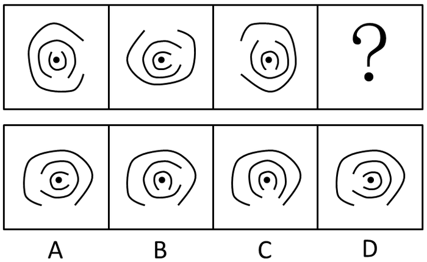
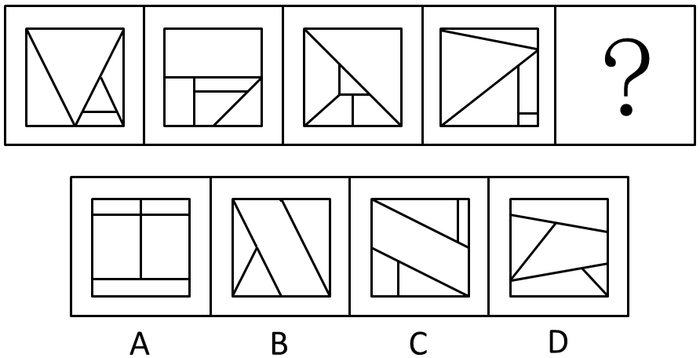
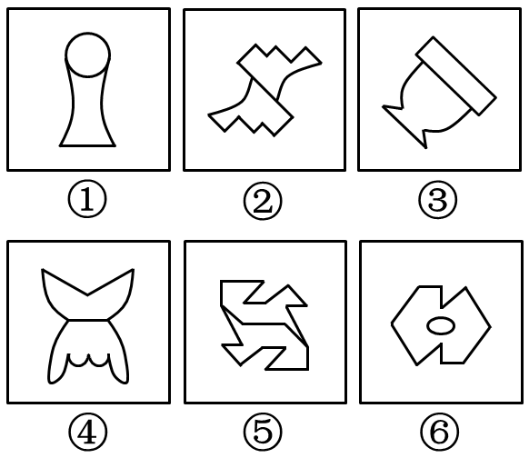
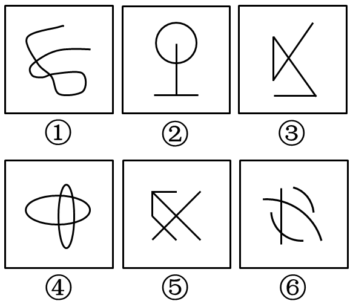

# 2016年北京市公务员录用考试《行测》题

> 判断推理 · 30 题 · 北京 2016

## 第 1 题　qid 1752630 · 图形推理

每道题包含一套图形和四个选项，请从四个选项中选出最恰当的一项填在问号处，使图形呈现一定的规律性。

- **A**. A
- **B**. B
- **C**. C
- **D**. D　✅

**答案**：D

**官方解析**

元素组成相同，考虑位置规律。有三个开口圈，观察开口位置可得，最外圈和第二圈都是每次逆时针旋转90°，故问号处最外圈开口应该朝下，第二圈开口应该朝左，排除B、C项；最内圈每次顺时针旋转90°，故问号处开口应朝左。
故正确答案为D。

---

## 第 2 题　qid 1752638 · 图形推理

每道题包含一套图形和四个选项，请从四个选项中选出最恰当的一项填在问号处，使图形呈现一定的规律性。

- **A**. A
- **B**. B
- **C**. C　✅
- **D**. D

**答案**：C

**官方解析**

元素组成不同，且无法通过属性规律解题，考虑数量规律。题干图形窟窿（封闭区间）很多，优先数面。题干每幅图均由5个面组成，排除B选项。再观察，发现题干中每幅图形均有一个面的面积为整个正方形的一半，选项中ACD中只有C项符合此规律。
故正确答案为C。

---

## 第 3 题　qid 1752670 · 图形推理

每道题包含六个图形和四个选项，请把六个图形分为两类，使每一类图形都具有各自的共同规律或者特征，并从四个选项中选出分类正确的一项。

- **A**. ①②⑤，③④⑥
- **B**. ①③⑥，②④⑤
- **C**. ①③④，②⑤⑥　✅
- **D**. ①⑤⑥，②③④

**答案**：C

**官方解析**

元素组成凌乱，图①③④有明显的轴对称图形特征，优先考虑对称性。图②⑤⑥都是中心对称图形，图①③④都是轴对称图形。
故正确答案为C。

---

## 第 4 题　qid 1752676 · 图形推理

本题包含六个图形和四个选项，请把六个图形分为两类，使每一类图形都具有各自的共同规律或者特征，并从四个选项中选出分类正确的一项。

- **A**. ①③⑤，②④⑥
- **B**. ①②③，④⑤⑥
- **C**. ①②⑤，③④⑥
- **D**. ①②⑥，③④⑤　✅

**答案**：D

**官方解析**

本题为分组分类题目。元素组成不同，且无明显属性规律，考虑数量规律。观察发现，图形线条交叉明显，考虑交点数。题干图形的交点数依次为：2、2、4、4、4、2，图①②⑥的交点数均为2，图③④⑤的交点数均为4，即图①②⑥为一组，图③④⑤为一组。
故正确答案为D。

---

## 第 5 题　qid 1752684 · 图形推理

把下面的六个图形分为两类，使每一类图形都有各自的共同特征或规律，分类正确的一项是：

- **A**. ①②③,④⑤⑥
- **B**. ①③⑤,②④⑥　✅
- **C**. ①②⑤,③④⑥
- **D**. ①③⑥,②④⑤

**答案**：B

**官方解析**

元素组成不同，且所有图形均为小元素组成，故优先考虑数量规律。全部都由四个独立的元素构成，且每幅图都有两个元素一样。观察发现，图①、③、⑤的两个相同的元素的位置关系是在同行或者同列，图②、④、⑥的两个相同的元素的位置关系为对角线关系。
故正确答案为B。

---

## 第 6 题　qid 1752804 · 逻辑判断

当前，随着数字化技术的发展，数字化阅读越来越流行。更多的人愿意利用电脑、手机以及各种阅读器来阅读电子图书，而且电子图书具有存储量大、检索快捷、便于保存、成本低廉等优点。因此，王研究员认为，传统的纸质图书将最终会被电子图书所取代。
  以下哪项如果为真，最能削弱王研究员的观点？

- **A**. 阅读电子图书虽然有很多方便之处，但相对于阅读纸质图书，更容易损害视力
- **B**. 有些读者习惯阅读纸质图书，不愿意采用数字化方式阅读
- **C**. 许多畅销图书刚一出版，短期内就会售完，可见，纸质图书还是有很大市场的
- **D**. 通常情况下，只有在纸质图书出版的前提下才允许流通相应的电子图书　✅

**答案**：D

**官方解析**

第一步：找到论点论据。
 论点：传统的纸质图书将最终会被电子图书所取代。
 论据：电子图书具有存储量大、检索快捷、便于保存、成本低廉等优点。
 第二步：逐一分析选项。
 A项：指出了电子图书相对纸质图书更容易损害视力，但是否会因为这个原因就不能取代纸质图书，不得而知，排除；
 B项：有些读者习惯阅读纸质图书，不愿意采用数字化方式阅读可能会对纸质书被电子书取代产生一定影响，因此此项是可能性削弱，保留；
 C项：部分纸质图书有很大市场，但市场大不代表不会被取代，为无关选项，排除；
 D项：说明电子图书的前提是先有纸质图书，即没有纸质书就不会有电子书，有电子书必有纸质书，也就是说纸质书一定不会被电子书取代，削弱论点，力度比B项的可能性削弱要强，当选。
 故正确答案为D。

---

## 第 7 题　qid 1752836 · 逻辑判断

某国议员认为：“只要提高工人工资就会导致通货膨胀。如果发生通货膨胀，那么人民就会遭受损失。人民遭受损失，就会使政府失去人心。政府只有得人心，国家才能和谐稳定。”
根据该议员的观点，以下除了哪项，均可以推出？

- **A**. 只要提高工人工资，政府就会失去人心
- **B**. 如果发生通货膨胀，政府就会失去人心
- **C**. 提高工人工资，且政府得人心　✅
- **D**. 国家和谐稳定与提高工人工资不能并存

**答案**：C

**官方解析**

第一步：翻译题干。

①只要提高工资就通货膨胀：只要······就······，前推后：提高工资通货膨胀；

②如果通货膨胀那么遭受损失：如果······那么······，前推后：通货膨胀遭受损失；

③遭受损失就失去人心：······就······，前推后：遭受损失失去民心；

④只有得民心国家才和谐稳定：只有······才······，后推前：和谐稳定得人心，根据逆否定理，可以得出：

⑤失去人心不和谐稳定。

第二步：逐一分析选项。

A项：由①②③可得提高工资推出失去人心，正确；

B项：由②③可得通货膨胀推出失去人心，正确；

C项：由①②③可得提高工资推出失去人心，因此提高工资与得人心不可能同时出现，错误；

D项：由①②③⑤可得提高工资不和谐稳定，故提高工资与和谐稳定不能共存，正确。

本题为选非题，故正确答案为C。

---

## 第 8 题　qid 1752842 · 逻辑判断

中东呼吸综合征（简称MERS）根本不像人们想象得那么可怕。据统计，2015年1-6月份，因感染MERS而死亡的人数显著低于同期因患普通感冒而死亡的人数。因此，普通感冒比MERS更能威胁人们的生命安全。
  下列哪项最能反驳上述论证？

- **A**. 2015年1-6月份，普通感冒患者远远多于MERS患者　✅
- **B**. 2015年1-6月份，韩国爆发了MERS疫情，严重威胁着民众的生命安全
- **C**. 引起普通感冒的原因与引起MERS的原因不同
- **D**. 有人患有普通感冒，又感染了MERS病毒，最终死亡

**答案**：A

**官方解析**

第一步：找到论点论据。
 论点：普通感冒比MERS更能威胁人们的生命安全。
 论据：2015年1月－6月期间感染MERS而死亡的人数低于患普通感冒而死亡的人数。
 第二步：逐一分析选项。
 A项：威胁生命安全应该是指死亡率，即死亡数/患病数，而论据只说死亡人数，故可以补充患病人数。分母越大，则威胁生命的概率越低。故A项可削弱，当选；
 B项：指出MERS会威胁生命安全，但没有与普通感冒作比较，为无关选项，排除；
 C项：指出两者患病的原因不同，与题干的哪个更能威胁人们的生命安全无关，为无关选项，排除；
 D项：既患了感冒，又感染了MERS，最终死因无法判定，无法削弱论点，排除。
 故正确答案为A。

---

## 第 9 题　qid 1752850 · 逻辑判断

某单位正在创建无烟单位，最近实行新规：禁止在单位内任何场所吸烟。有些吸烟员工因为不能适应，试图改变这一规定，却以失败告终。因为单位规定，制度变更必须经过如下程序：只有获得15%以上的员工签字提议，才能由全体员工进行投票表决。结果，这些吸烟员工的提议被大多数员工投票否决了。
  由上述断定最可能推出的结论是：

- **A**. 投否决票的员工小于或等于85%
- **B**. 在吸烟员工的提议书上签字的员工不到15%
- **C**. 在吸烟员工的提议书上签字的员工不少于15%　✅
- **D**. 有员工在提议书上签了字，但在表决时又投了否决票

**答案**：C

**官方解析**

第一步：翻译题干。

（1）全体员工投票表决获得15%以上的签字提议。

（2）提议被否决，说明肯定进行了投票表决。

第二步：逐一分析选项。

A项：题干结论是被大多数员工否决，大多数具体是多少，无从得知，错误；

B项：提议被否决，可以推出有15%以上的员工签字，B项说不到15%，错误；

C项：由1和2可得，必定获得了15%以上的签字提议，故C选项正确；

D项：签字的员工是否投了否决票，从文段中无法推出，无中生有，排除。

故正确答案为C。

---

## 第 10 题　qid 1752856 · 逻辑判断

在人一生当中，会不断对脑神经连接进行“优化重组”，“修剪”掉多余的连接，以保证有用的连接更加快速通畅。研究人员选取了121名年龄在4-20岁的健康志愿者，利用磁共振技术，分析了这一年龄段神经连接随着大脑发育和成熟而发生的变化。结果发现，女性对脑神经连接开始“修剪”的时间普遍早于男性。因此研究人员认为，女性的大脑相比男性大脑更高效。
以下陈述如果为真，哪项无法支持上述结论？

- **A**. 学龄期女孩往往表现出比同龄男孩更好的理解能力和语言能力
- **B**. 脑神经连接“修剪”出错会导致自闭症，患病率性别差异显著　✅
- **C**. 男孩只能专注于一件工作的时候，女孩可以同时处理多项工作
- **D**. 大脑“修剪”和“重组”之后使得各种认知活动效率提升很多

**答案**：B

**官方解析**

第一步：找到论点论据。
论点：女性的大脑相比男性的大脑更高效。
论据：人脑会对脑神经进行修剪以保证有用的连接更加快速通畅，4-20岁女性对脑神经连接开始修剪的时间普遍早于男性。
第二步：逐一分析选项。
A项：学龄期女孩比男孩有更好的理解能力和语言能力说明女性大脑比男性大脑更高效，举例加强论点，可以加强，排除；
B项：指出修剪出错会导致的负面后果（自闭症），与论点说的女性大脑是否更高效无关，为无关项，无法加强，当选；
C项：举例说明女性比男性大脑更高效的具体表现，举例加强论点，可以加强，排除；
D项：说明大脑修剪能提高认知活动效率，在论点和论据之间建立联系，属于搭桥项，可以加强，排除。
本题为选非题，故正确答案为B。

---

## 第 11 题　qid 1752862 · 逻辑判断

某经销商为感谢消费者，同时进一步宣传其产品，组织部分消费者进行郊游活动。此活动为参与者准备了H、I、J、K、L、M六种可供选择的礼物。但是，礼物的选择必须满足如下条件：
（1）只有选择礼物I和J，才能选择礼物H
（2）如果选择了礼物L，就不能再选礼物J，也不能再选礼物K
（3）只有选择了礼物L，才能选择礼物M
已知赵先生选择了礼物H，请问以下哪项有可能是赵先生选择的其他礼物？

- **A**. I和M
- **B**. I和L
- **C**. J和L
- **D**. J和K　✅

**答案**：D

**官方解析**

第一步：翻译题干。

（1）只有······才······，后推前：HI 且 J；

（2）如果······就······，前推后：L -J，L-K；

（3）只有······才······，后推前：ML；

已知：选择了H。

第二步：逐个分析选项。

选择了H礼物，则肯定选择I礼物和J礼物；如果选择了J礼物，由（2）可知不能选择L礼物，因此排除B项和C项；如果不选择L礼物，由（3）可知不能选择M礼物，因此排除A项。

故正确答案为D。

---

## 第 12 题　qid 1752868 · 逻辑判断

研究者对一万名平均年龄65岁的男女进行追踪研究，评估他们是否存在抑郁以及中风发病情况。研究开始时这些人均无中风史。研究发现，持续存在重度抑郁症状与中风风险增加一倍以上相关，而那些无抑郁症状或症状较轻的参与者的中风风险则并未增加。曾经存在重度抑郁症状的患者，即使其症状在访谈期间已然缓解，他们的中风风险仍然与那些始终存在重度抑郁症状的人相比无显著差异。
以上陈述如果为真，可以推出：

- **A**. 重度抑郁症极有可能会发展演变为中风
- **B**. 中风患者人群中患抑郁症的几率也比较高
- **C**. 正患有或曾患有重度抑郁均是中风的风险因素　✅
- **D**. 抑郁和中风作为老年常见疾病，经常一起发病

**答案**：C

**官方解析**

通读文段，逐一分析选项。
A项：题干中说的是重度抑郁症状与中风风险是正相关的，有风险并不等同于“极有可能会发展演变为中风”，“极有可能”过于绝对，程度太重，排除。
B项：题干中说的是重度抑郁症患者中风的风险高，选项说中风人群中患有抑郁症的概率高，逻辑顺序反了，排除。
C项：题干最后一句话表述的含义就是无论是曾经患有还是正在患有重度抑郁症的人，他们中风的风险是无显著差异的，能推出，当选。
D项：题干中并未提及抑郁和中风是否经常一起发病，属于无中生有，排除。
故正确答案为C。

---

## 第 13 题　qid 1752874 · 逻辑判断

只有在湿度高且光线昏暗的山林里才会有野生灵芝生长。紫金山林区没有野生灵芝生长。
  若以上判断为真，可推出以下哪项结论？
Ⅰ.紫金山林区湿度不高并且光线不昏暗。
Ⅱ.如果紫金山林区光线昏暗，则肯定湿度不高。
Ⅲ.如果紫金山林区湿度高，则肯定光线不昏暗。

- **A**. 仅Ⅰ
- **B**. 仅Ⅱ
- **C**. 仅Ⅱ和Ⅲ
- **D**. Ⅰ、Ⅱ和Ⅲ都推不出　✅

**答案**：D

**官方解析**

第一步：翻译题干的信息。

只有……才……，后推前：野生灵芝湿度高 且 光线昏暗；

已知：-野生灵芝。

第二步：分析选项。

因为“-野生灵芝”属于否定前件，得不到确定性结论，因此并不能判断紫金山林区的光线是否昏暗，湿度是否高，因此三个结论都无法推出。

故正确答案为D。

---

## 第 14 题　qid 1752876 · 逻辑判断

某科学家批评了人们对化学添加剂的恐惧。“食品标签上如果出现很多添加剂就会让人心生恐惧，但其实添加剂和防腐剂是受到严格控制和计量的，真正应该关注的是食品中糖和脂肪的含量。防腐剂是有益的，显然，我们都愿意吃到一个保存良好的罐头，而不希望因为摄入肉毒杆菌而死亡。”
下列陈述如果为真，哪项无法支持该科学家的观点？

- **A**. 很多药物也是化学制剂，是药三分毒，用药要谨慎　✅
- **B**. 纯天然无添加的原生态食品很难储存，而且价格更高
- **C**. 防腐剂可以有效防止食品腐败变质、滋生细菌
- **D**. 食品安全关键在于食品添加剂种类与量的严格控制

**答案**：A

**官方解析**

第一步：找出论点和论据。
论点：不需要恐惧添加剂。
论据：添加剂和防腐剂是受到严格控制和计量的，是有益的。
第二步：逐一分析选项。
A项：题干中说的是防腐剂和添加剂，而A选项说的是化学制剂，无关项，当选；
B项：无添加的食品难储存，说的是没有防腐剂和添加剂时不好的地方，可以加强，排除；
C项：防腐剂可以防止滋生细菌，是说的好的地方，可以加强，排除；
D项：说的是添加剂的种类和用量是严格控制的，可以加强，排除。
本题为选非题，故正确答案为A。

---

## 第 15 题　qid 1752880 · 逻辑判断

某舞蹈队里有三名女队员王虹、张静和高薇，她们是好朋友，来自不同的省份，或者来自甘肃或者来自山东或者来自广西。高薇见过张静的姐姐，高薇的国标舞比来自广西的队员跳得好。来自山东的独生女，其国标舞是三人中跳得最不好的。
由此可以推出的是：

- **A**. 王虹来自甘肃，张静来自广西
- **B**. 张静来自广西，高薇来自甘肃　✅
- **C**. 高薇国标舞跳得最好，张静跳得最不好
- **D**. 王虹国标舞跳得最不好，张静跳得最好

**答案**：B

**官方解析**

分析题干中的信息可知：
①张静有姐姐，因此不是独生女，而山东的队员是独生女，因此张静不是山东队员；
②高薇国标舞比广西队员跳得好，因此高薇不是广西队员；
③因为山东队员国标舞跳得最不好，因此高薇不是山东队员。
因此，当高薇既不是来自山东也不是来自广西时，可知高薇是甘肃队员；
那么张静不是甘肃队员，同时又推出她不是山东队员，因此张静是广西队员。
故正确答案为B。

---

## 第 16 题　qid 1752886 · 逻辑判断

研究员将六百多位老年痴呆症患者分为三个组，一组补充一定剂量的维生素E，另一组接受药物治疗，第三组服用安慰剂。在接下来两年多的时间里，与服用安慰剂的患者相比，服用维生素E的患者从事制订计划、做饭和购物等日常活动的能力下降较慢。服用药物的患者没有获得类似的临床效果。因而研究员认为，维生素E补充剂有望成为治愈老年痴呆症的特效药。
以下陈述如果为真，哪项最能质疑研究员的结论？

- **A**. 维生素E为脂溶性，不易代谢，一次性大量服用会导致中毒
- **B**. 老年痴呆是不可逆性疾病，症状的发生只可能延缓而无法逆转　✅
- **C**. 正常人体每日所需的维生素E可以从饮食中摄取，不必额外补充
- **D**. 现有的抗老年痴呆的药物中均未添加维生素E

**答案**：B

**官方解析**

第一步：找到论点和论据。
论点：维生素E补充剂有望成为治愈老年痴呆症的特效药。
论据：通过实验，发现服用维生素E的患者日常活动的能力下降得比较缓慢。
第二步：逐一分析选项。
A选项：说明一次性大量服用维生素E有害处，但是并没有提到维生素E对老年痴呆是否能够起到治愈作用，并且一次性大量服用维生素E也是题干中没说到的，因此，属于无关项，不能削弱，排除；
B选项：说明老年痴呆这种病无法逆转，即老年痴呆根本是无法治愈的，说明维生素E不可能成为治愈老年痴呆的特效药，直接削弱了结论，当选；
C选项：正常人需不需要补充维生素E与老年痴呆症患者无关，属于无关项，排除；
D选项：现有的老年痴呆药里面有没有维生素E和维生素E是否能治愈老年痴呆不是一回事，话题不一致，属于无关项，排除。
故正确答案为B。

---

## 第 17 题　qid 1752888 · 逻辑判断

某中学高中部所有喜欢球类运动的学生都参加过学校的运动会。因此，有些喜欢美术的同学不喜欢球类运动。
为使上述论证成立，关于该中学高中部学生的断定必须假设的是：

- **A**. 所有喜欢球类运动的学生都不喜欢美术
- **B**. 参加过学校运动会的学生都喜欢球类运动
- **C**. 所有喜欢美术的同学都没参加过学校的运动会
- **D**. 有些喜欢美术的同学没有参加过学校的运动会　✅

**答案**：D

**官方解析**

第一步：找出论点和论据。

论点：有些喜欢美术的同学不喜欢球类运动。

论据：高中部所有喜欢球类运动的学生都参加过学校的运动会。

本题虽然是加强题型，但是题干中存在明显的逻辑关联词，可先将关联词翻译，题干论点翻译为：有的美术不球类，论据翻译为：球类运动会。

第二步：逐一分析选项。

A项：喜欢球类的都不喜欢美术，翻译为：球不美，可逆否为：美不球，即A项可以替换为所有喜欢美术的都不喜欢球类运动，可以得出题干中有的喜欢美术的同学不喜欢球类运动的结论，属于直接加强结论，保留；

B项：参加过运动会的都喜欢球类运动，可翻译为：运动会球，与喜欢美术的同学是否喜欢球类运动无关，属于无关选项，排除；

C项：所有喜欢美术的同学都没参加过运动会，翻译为：所有美术不运动会，根据题干论据球类运动会可知，所有美术不运动会不球类，在美术和不球类之间搭桥，支持题干论证关系，保留；

D项：有些喜欢美术的同学没参加过运动会，翻译为：有些美术不运动会，根据题干论据球类运动会可知，有些美术不运动会不球类，可得：有些美术不球类，在美术和不球类之间搭桥，支持题干论证关系，保留。

本题的A、C项得出的结论都是所有喜欢美术的都不喜欢球类运动，尽管这两者都能推导出有的喜欢美术的不喜欢球类运动，但D项得出的结论直接就是有的喜欢美术的不喜欢球类运动，与题干的结论是完全一致的，因此，D项要优于A、C项。

故正确答案为D。

---

## 第 18 题　qid 1752894 · 逻辑判断

研究表明，近15年来全球平均气温没有显著的增温趋势，这似乎与温室气体排放造成全球变暖的大背景相矛盾。但温度变化是由动力温度和辐射温度两部分造成的，对其气候效应的研究既要考虑气候系统动力因子的年代际变化，更要量化人类活动造成的辐射温度的作用。事实上，动力温度在近15年出现显著的降温趋势，而辐射温度持续上升，两者相互抵消，造成了近年来全球气温的增温停滞。
下列推论中正确的是：

- **A**. 气候系统动力因子的年代际变化“冷却”了大气温度　✅
- **B**. 动力温度和辐射温度均增高导致全球变暖的大趋势
- **C**. 气温稳定取决于动力温度与辐射温度的相同变化
- **D**. 动力气温降温不显著造成了15年前的全球变暖

**答案**：A

**官方解析**

日常结论题，根据题干信息逐一分析选项。
A项：题干中说“温度变化是由动力温度和辐射温度两部分造成的，既要考虑气候系统动力因子的年代际变化，更要量化人类活动造成的辐射温度的作用”，可知动力温度即是气候系统动力因子的年代际变化，而结论是动力温度降温，可知气候系统动力因子的年代际变化冷却了大气温度，当选；
B项：选项中说动力温度增高，而题干中的结论明确指出动力温度下降，排除；
C项：温度变化是由动力温度和辐射温度两部分造成的，两者相互抵消，造成了近年来全球气温的增温停滞。所以气温稳定应取决于二者的相反变化，而非相同变化，排除；
D项：题干中没有涉及15年前的动力气温降温情况，排除。
故正确答案为A。

---

## 第 19 题　qid 1752898 · 类比推理

从前，有一个奇怪的岛屿，岛屿上只住着M族人和N族人。M族人从不说真话，N族人总是说真话。有一天，小张来到这个岛屿，碰到该岛屿上的三个人。小张问甲：“你是M族人吗？”甲做了回答。乙根据甲的回答说：“甲不是M族人。”丙说：“甲确实是M族人。”
根据以上陈述，可推出小张碰到的三个人中，有几个M族人？

- **A**. 0
- **B**. 1　✅
- **C**. 2
- **D**. 3

**答案**：B

**官方解析**

题干及选项均无确定信息，适合用假设法，分情况讨论，由于题干三人所讨论的都是甲的情况，所以分别假设甲是M族人、甲不是M族人。
情况（一）：假设甲是M族人，由题干“M族人从不说真话”，那么甲说假话，所以甲回答小张的应该是：我不是M族人；
由题干“乙根据甲的回答说”，说明乙说的话并非根据真实情况（即乙并不知道甲是否M族人），乙说的话是基于甲的回答，乙说的是，“甲不是M族人”，和甲的回答一致，所以乙说了真话，由题干“N族人总是说真话”，得出乙是N族人；
此时丙说，“甲是M族人”，丙说的话并非根据甲的回答，说明丙是基于真实情况来说的，而真实情况是，甲是M族（假设的真实情况），因此丙说了真话，由题干“N族人总是说真话”，得出丙是N族人；此种情况下只有甲一个人是M族人；
情况（二）：假设甲不是M族人，是N族人，那么甲只说真话，因此甲回答小张的应该是：我不是M族人。
此时，乙根据甲的回答说，甲不是M族人，与甲的回答一致，说明乙说了真话，所以乙是N族人；
丙说，甲是M族人，丙说的话是基于真实情况，即假设的情况（甲不是M族人），所以此时丙说了假话，由题干“M族人从不说真话”，则丙是M族人。此种情况下只有丙一个人是M族人。
综上两种情况，三个人中均只有一个人是M族人。
故正确答案为B。

---

## 第 20 题　qid 1752904 · 逻辑判断

某学校要从甲、乙、丙、丁、戊、己、庚七名学生中挑选四人组成一个辩论队，去参加全市的辩论比赛。根据平时的训练情况，挑选必须满足下列条件：
（1）如果戊参加，则丙也要参加；
（2）除非乙参加，否则庚不参加；
（3）甲和乙中至少有一人参加，但不能都参加；
（4）戊和己中至少有一人参加，但不能都参加。
根据以上陈述，以下哪些学生一定会参加辩论比赛？

- **A**. 乙或庚，或者二人都参加
- **B**. 戊或庚，或者二人都参加
- **C**. 丙或丁，或者二人都参加　✅
- **D**. 丙或戊，或者二人都参加

**答案**：C

**官方解析**

本题属于翻译推理题型。 

第一步：翻译题干。

（1）戊丙；

（2）庚乙；

（3）要么甲，要么乙；

（4）要么戊，要么己。

第二步：逐一分析选项。

甲和乙中至少有一人参加，但不能都参加，说明甲、乙中有一人参加；戊和己中至少有一人参加，但不能都参加，说明戊、己中有一人参加；一共要4个人，那么说明丙、丁、庚中有两人参加，所以选择C项。

故正确答案为C。

---

## 第 21 题　qid 1752906 · 定义判断

房地产经纪，是以提取佣金为经营特征，为促成他人房地产交易，而从事房地产买卖、交换、租赁、置换等信息提供、信托劳务、居间代理等业务的经济活动。
根据以上定义，下列属于房地产经纪的是：

- **A**. 作为社区工作者，张大妈经常为小区内买卖房屋的人牵线搭桥
- **B**. 某网站设置房产专栏，免费为发布租房卖房信息的会员提供服务
- **C**. 某中介公司接受一房地产开发商的委托，销售其新开发的商品房　✅
- **D**. 置业顾问小李通过自己多年的房产人脉关系买到一套性价比较高的房子

**答案**：C

**官方解析**

第一步：找出定义关键词。
关键词为“提取佣金为经营特征”、“促成他人房产交易”、“从事房地产买卖、交换、租赁、置换等信息提供、信托劳务、居间代理”。
第二步：逐一分析选项。
A项：张大妈虽然经常为小区内买卖房屋的人牵线搭桥，但张大妈是社区工作者不以提取佣金为经营，不符合定义，排除；
B项：某网站的房产专栏是免费为发布信息的会员提供服务，不符合定义，排除；
C项：中介公司受到了房地产的委托，属于居间代理，中介公司是要收取服务费的，符合定义，当选；
D项：小李是为自己买房子而不是促成他人房产交易，不符合定义，排除。
故正确答案为C。

---

## 第 22 题　qid 1752910 · 定义判断

互补品，是指两种商品之间存在着某种消费依存关系，即一种商品的消费必须与另一种商品的消费相配套。可以分为两类：普通互补品，是指两种商品之间没有固定的同时使用的比例；完全互补品，是指两种商品之间必须按照固定不变的比例同时被使用。
根据上述定义，下列选项正确的是：

- **A**. 薯条和汉堡属于普通互补品
- **B**. 眼镜框和眼镜片属于完全互补品　✅
- **C**. 毛笔和墨汁属于完全互补品
- **D**. 数码相机和胶卷属于普通互补品

**答案**：B

**官方解析**

第一步：找出定义关键词。
互补品：“一种商品的消费必须与另一种商品的消费相配套”。
普通互补品：“没有固定的同时使用的比例”。
完全互补品：“必须按照固定不变的比例同时被使用”。
第二步：逐一分析选项。
A项：汉堡和薯条可以分开消费，不是普通互补品，排除；
B项：眼镜框和眼镜片是同时配套使用，而且要按照固定的比例，符合定义关键词，属于完全互补品，当选；
C项：毛笔和墨汁的使用没有固定不变的比例，根据书写的要求决定墨汁需求的比例，属于普通互补品，排除；
D项：数码相机是不需要胶卷的，胶卷在传统胶片相机中使用，两者不存在依存关系，不是普通互补品，排除。
故正确答案为B。

---

## 第 23 题　qid 1752914 · 定义判断

委婉语，是指在特定的语境中，对于使人感到敬畏、恐惧、羞耻、不适的事物，信息组织者有意地运用语音、语义、语法等手段而形成的对这些事物非直接的语言或言语表达，从而避免使信息组织者本人、信息理解者、话语涉及的第三方即信息的潜在理解者有消极的心理反应。
根据上述定义，下列选项中使用了委婉语的是：

- **A**. 王某回忆起母亲常把“树欲静而风不止，子欲养而亲不待”放在嘴边
- **B**. 诗人把“春风又过江南岸”改成“春风又绿江南岸”
- **C**. 同事询问田某母亲的病情，她回答说“老了，送上路了”　✅
- **D**. 外国学生学习汉语后，在路上遇到同学时问“你吃饭了吗”

**答案**：C

**官方解析**

第一步：找出定义关键词。
“使人感到敬畏、恐惧、羞耻、不适的事物”、“运用语音、语义、语法等手段”、“非直接的语言或言语表达”、“避免理解者有消极的心理反应”。
第二步：逐一分析选项。
A项，不涉及“理解者的消极心理反应”，排除；
B项，没有涉及“使人感到敬畏、恐惧、羞耻、不适的事物”和“理解者的消极心理反应”，排除；
C项，对病情的回答属于“避免理解者有消极的心理反应”，“老了”属于语义，人的生命属于“使人感到敬畏的事物”，完全符合，当选；
D项，没有涉及定义给出的任何关键词，排除。
故正确答案为C。

---

## 第 24 题　qid 1752918 · 定义判断

法律移植，是指一个国家对同时代其他国家法律制度的吸收和借鉴。
根据上述定义，下列属于法律移植的是：

- **A**. 非西方国家在西方列强殖民主义扩张之后，被迫地或主动地施行西方国家法律　✅
- **B**. 张某认为雅典城邦的法律思想体现了公平，认为我国的法律也体现了公平
- **C**. 非洲某落后国家研究发达国家的法律史，并根据实际情况修改了本国的法律制度
- **D**. 法国18世纪借鉴了中国的科举考试，设立了本国的公务员考试

**答案**：A

**官方解析**

第一步：找出定义关键词。
“国家”、“同时代其他国家法律制度的吸收和借鉴”。
第二步：逐一分析选项。
A项，非西方国家的做法是对西方列强国家法律的吸收和借鉴，符合题干，当选；
B项，雅典城邦和我国不是同一时代的国家，同时也没有体现出吸收和借鉴，排除；
C项，研究发达国家的法律史，说明不是同一时代的国家，排除；
D项，18世纪法国设立了公务员考试，借鉴的是那时候中国的科举考试，并不是法律制度，排除。
故正确答案为A。

---

## 第 25 题　qid 1752920 · 定义判断

随意注意，是指有预定目的，需要一定意志努力的注意；不随意注意是事先没有预定的目的，也不需要作意志努力的注意；随意后注意是在随意注意之后发生的，既有一定的目的任务，又不需要意志努力的注意。
根据上述定义，下列属于随意后注意的是：

- **A**. 小林在看杂志时发现了一幅插画，他觉得很不错就用照相机拍了下来
- **B**. 某射箭运动员比赛时过度紧张，致使射第一箭时角度出现了严重偏差，只获得2环的成绩
- **C**. 小林在窗前读书时，突然听到了外面有一些声响，他抬头一看发现有两只小鸟停在了树上
- **D**. 小王刚学开车时必须全神贯注，熟练后，上班途中可以边开车边听广播　✅

**答案**：D

**官方解析**

第一步：找到定义关键词。
“随意注意之后发生”、“有目的任务”、“不需要意志努力”。
第二步：逐一分析选项。
A选项，看杂志发现插画属于事先没有预定的目的，是不随意注意，排除；
B选项，没有体现出一个前后的关系，即不是随意注意之后发生的，排除；
C选项，突然听到声响不符合有一定目的这个关键词，是不随意注意，排除；
D选项，开车全神贯注这是随意注意，之后可以边开车边听广播，这是有任务目的的，但是没有意志努力，这是随意后注意，符合定义，当选。
故正确答案为D。

---

## 第 26 题　qid 1752924 · 定义判断

感知综合障碍是指病人在感知某一现实事物时，作为一个客观存在的整体来说是正确的，但对该事物的个别属性，如大小、形状、颜色、空间距离等产生的与该事物不相符合的感知。
根据上述定义，下列属于感知综合障碍的是：

- **A**. 王某由于沉迷于游戏而经常出现幻觉，眼前浮现游戏中打斗的场景
- **B**. 张某最近一段时间以来经常觉得正在摆动着的钟摆停止了摆动　✅
- **C**. 由于眼睛高度近视，李某在大街上经常会认错人，心里非常苦闷
- **D**. 孙某对颜色的辨别能力差，经医生检查发现这是色弱的表现

**答案**：B

**官方解析**

第一步：找出定义关键词。
“感知某一现实事物”、“作为整体正确”、“个别属性如大小、形状、颜色、空间距离等产生的与该事物相不符合的感知”。
第二步：逐一分析选项。
A项：王某是出现幻觉了，不存在整体正确和个别属性不符合，不符合定义，排除；
B项：张某觉得钟摆停止了摆动，对于钟摆的认识是正确的，但对于摆动的钟摆产生了不摆动的认知，符合定义，当选；
C项：李某是眼睛近视导致的认错人，对整体的认识就是错误的，不符合定义，排除；
D项：孙某是对颜色的辨别能力差，没有体现对事物整体的认知是否正确，不符合定义，排除。
故正确答案为B。

---

## 第 27 题　qid 1752928 · 定义判断

斡旋受贿罪，也称间接受贿罪，是指国家工作人员利用本人职权或地位形成的便利条件，通过其他国家工作人员职务上的行为，为请托人谋取不正当利益，索取请托人财物或者收受请托人财物。
根据上述定义，下列存在斡旋受贿罪的是：

- **A**. 民办学校校长张某收受了某学生家长的红包，委托本校老师伪造该生的成绩单
- **B**. 李董事长送了审计司司长太太一部轿车，成功使得自己的企业逃过审计审查
- **C**. 海关负责海外货品清关的小赵，时常收到海外代购商的礼物，并帮他们逃税
- **D**. 警察孙某请交管局老同事帮小李删除违章记录，并向小李索要一笔好处费　✅

**答案**：D

**官方解析**

第一步：找出定义关键词。
关键词为“国家工作人员利用本人职权或地位形成的便利条件，通过其他国家工作人员职务上的行为，为请托人谋取不正当利益，索取请托人财物或者收受请托人财物”。
第二步：逐一分析选项。
A项：“民办学校校长”不是国家工作人员，主体有误，不符合定义，排除；
B项：李董事长送给了“审计司司长太太”一部车，但是审计司司长太太并非国家工作人员，主体有误，不符合定义，排除；
C项：海关关员小赵在这个过程中只存在利用自己的职务提供便利，没有涉及其他国家工作人员，不符合定义，排除；
D项：“警察孙某”是国家工作人员，他请求的“交管局老同事”也是国家工作人员，还索要好处费，符合定义，当选。
故正确答案为D。

---

## 第 28 题　qid 1752932 · 定义判断

资源民族主义，是指基于国家对自然资源的合法管辖，通过控制和支配资源，以及市场干预行为，实现为政治服务和国家特定发展等目标。
根据上述定义，下列属于资源民族主义的是：

- **A**. 某国发展与石油资源国的合作，持续推进原油进口来源多元化
- **B**. 某国加强了某稀有金属开矿许可，并为外资企业投资设立高门槛　✅
- **C**. 某公司研发的特色旅游纪念品在市场上广受欢迎，不得不限量发售
- **D**. 政府组织高科技企业生产高质量钢铁并依靠出口获得利润

**答案**：B

**官方解析**

第一步：找出定义关键词。
主体：“国家”“对自然资源的合法管辖”；
方式：“通过控制和支配资源，以及市场干预行为”；
目的：“实现为政治服务和国家特定发展等目标”。
第二步：逐一分析选项。
A项：与其他国家合作，进口石油，不属于对资源的合法管辖，排除；
B项：稀有金属矿产属于自然资源，设置开矿许可、对外资企业设立门槛属于控制和支配资源，目的是为了国家发展，当选；
C项：主体为某公司，而不是国家，排除；
D项：组织生产钢铁不属于对自然资源的控制和支配或市场干预行为，排除。
故正确答案为B。

---

## 第 29 题　qid 1752936 · 定义判断

兼并，指的是一个企业收购另一个企业的行为，通常以一个企业收购另一企业股票的形式产生。主要形式包括：（1）纵向兼并，发生在两个企业处在生产过程的不同阶段的时候；（2）横向兼并，发生在两个企业处在同一市场中的情况下；（3）混合兼并，发生在两个企业在两个没有关联的市场中各自经营的场合。
根据上述定义，下列选项正确的是：

- **A**. 甲果汁公司收购乙可乐公司，属于横向兼并　✅
- **B**. 甲手机公司收购乙电脑公司，属于纵向兼并
- **C**. 甲面粉厂被乙面包厂收购，属于混合兼并
- **D**. 甲商品房开发公司收购乙物业管理公司，属于混合兼并

**答案**：A

**官方解析**

第一步：找到定义关键词。
纵向兼并关键词为“处于生产过程的不同阶段”；
横向兼并关键词为“处于同一个市场中”；
混合兼并关键词为“在两个没有关联的市场中各自经营的场合”。
第二步：逐一分析选项。
A项：果汁和可乐同属于饮料市场，属于横向兼并，表述正确，当选；
B项：手机与电脑肯定不属于生产过程的不同阶段，故肯定不属于纵向兼并，排除；
C项：面粉与面包同属于食品市场，属于生产的不同阶段，属于纵向兼并，排除；
D项：商品房和物业，都与商品房相关，肯定不属于没有关联的市场，故肯定不属于混合兼并，排除。
故正确答案为A。

---

## 第 30 题　qid 1752938 · 定义判断

显性知识，是能够被人以一定符码系统（如语言、数学公式、各类图表、盲文、手势语、旗语等符号形式）加以完整表述的知识。隐性知识与其相对，通常是指人们知道却难以言述的知识，依靠个人经验获取。基于身体的隐性知识是指主体在认识过程中所产生和应用的隐性知识，多根植于人类身体机能的运用或对于工具的使用。
根据上述定义，下列行为运用基于身体的隐性知识最典型的一项是：

- **A**. 某公司开发了一套金融软件，能够让用户不花现金就可以模拟炒股的情形
- **B**. 幼儿园老师通过讲故事、打比方等方法帮助孩子们理解一些成语的含义
- **C**. 一位具有20年外科手术经验的医生为患者进行骨髓移植手术　✅
- **D**. 一些研究者利用浮力原理制造潜水艇，并设计了能够减少阻力的流线外形

**答案**：C

**官方解析**

第一步：找到定义关键词。
基于身体的隐性知识关键词为“难以言述”、“依靠个人经验获取”、“根植于人类身体机能的运用或对于工具的使用”。
第二步：逐一分析选项。
A项：金融软件可以用程序语言加以完整表述，不属于根植于人类身体机能的运用或对于工具的使用，为显性知识，排除；
B项：讲故事、打比方帮助孩子们理解成语含义属于以语言加以完整表述的知识，为显性知识，排除；
C项：20年外科手术经验属于对身体机能的运用，手术经验也是难以言述，并不能通过任何符码系统加以完整表述，为隐性知识，当选；
D项：浮力原理可以用数学公式加以完整表述，为显性知识，排除。
故正确答案为C。

---
