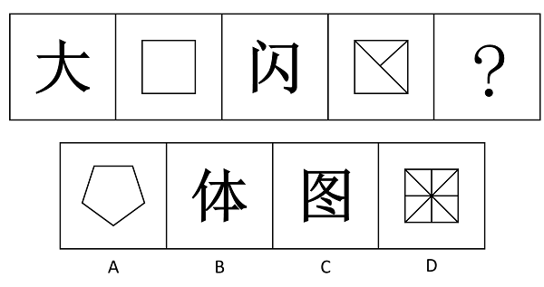
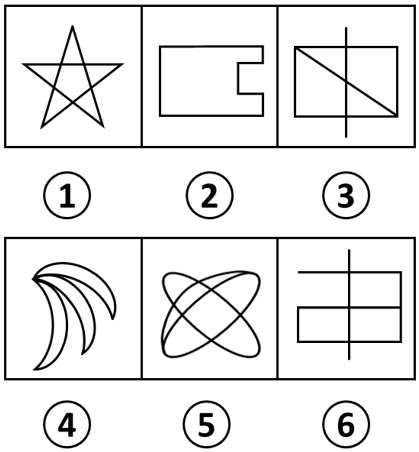
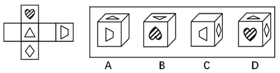

# 2016年吉林省公务员录用考试《行测》题（乙级）

> 判断推理 · 30 题 · 吉林 2016

## 第 1 题　qid 2021852 · 图形推理

从所给四个选项中，选择最合适的一个填入问号处，使之呈现一定的规律性：

- **A**. A
- **B**. B
- **C**. C
- **D**. D　✅

**答案**：D

**官方解析**

元素组成不同，且无明显属性规律，考虑数量规律。九宫格优先横向看，观察发现，第一行黑块的数量分别为2、3、4，第二行黑块的数量分别为7、6、5，第三行黑块的数量分别为8、9、？，进而发现，图形按照“反S型”（如下图所示）的方向，后一幅图形在前一幅图形的基础上增加1个黑块，故？处应为在前一幅图形的基础上增加1个黑块的图形，只有D项符合。

故正确答案为D。

---

## 第 2 题　qid 2021968 · 图形推理

从所给四个选项中，选择最合适的一个填入问号处，使之呈现一定的规律性：

- **A**. A
- **B**. B
- **C**. C　✅
- **D**. D

**答案**：C

**官方解析**

九宫格题目。元素组成相似，优先考虑样式。观察发现第一行中，全白面、半阴影、全阴影的图形都出现，第二行图形中也是全白面、全阴影、半阴影的图形出现，第三行中半阴影、全阴影，问号处应为全白面的图形，排除A、D两项。比较B、C项的不同之处，“蘑菇”图形的方向不同，题干中第一行图形和第二行图形中的两个“蘑菇”朝向都是不同的，因此问号处应选一个和第三行图1中朝向不同的“蘑菇”，第三行图中的“蘑菇”是头朝右的，问号处应选择一个“蘑菇”头朝左的，只有C项符合，排除B项。
故正确答案为C。

---

## 第 3 题　qid 2021976 · 图形推理

从所给四个选项中，选择最合适的一个填入问号处，使之呈现一定的规律性：

- **A**. A
- **B**. B　✅
- **C**. C
- **D**. D

**答案**：B

**官方解析**

元素组成不同，考虑属性和数量规律。观察发现，题干中出现汉字和直线图形，则可考虑汉字笔画数，非汉字图形直线数量。发现分别是3笔画，4条线，5笔画，6条线，？处应该为一个7笔画的汉字。
故正确答案为B。
注：如果看开放封闭性的话，题干图形依次为开放图形、封闭图形、开放图形、封闭图形，？处应选一个开放图形，正确答案仍然选B，但是因为吉林多次考到汉字数笔画，非汉字数线的数量，所以本题更倾向于考虑线的数量。

---

## 第 4 题　qid 2021832 · 图形推理

把下面的六个图形分为两类，使每一类图形都有各自的共同特征或规律，分类正确的一项是：

- **A**. ①③④，②⑤⑥　✅
- **B**. ①③⑤，②④⑥
- **C**. ①②⑤，③④⑥
- **D**. ①②④，③⑤⑥

**答案**：A

**官方解析**

图形组成不同，且属性无规律，考虑数量规律。观察题干发现，图①③⑤⑥线条交叉比较明显，则考虑数交点。题干六幅图交点的数量分别为10、8、7、4、8、8，所以①③④为一组交点的数量不是8，②⑤⑥为一组交点的数量是8。
故正确答案为A。
粉笔提示：有的同学可能考虑数面数量，认为图①③⑤为一组，面数量都是偶数，图②④⑥为一组，面数量都是奇数，从而选到B项。这种思路其实并不合适，一个是因为数点特征图明显，且这种分类方式符合吉林省考分组分类题目的命题特征；一个是奇偶性的考查太特殊，不建议往这个角度上考虑。因此粉笔更建议从点数量的角度考虑，把答案给到A选项。

---

## 第 5 题　qid 2022314 · 图形推理

左边给定的是纸盒的外表面，下面哪一项能由它折叠而成：

- **A**. A
- **B**. B　✅
- **C**. C
- **D**. D

**答案**：B

**官方解析**

A选项：梯形面和三角形面是相对面，相对面不能同时出现，与题干不一致，排除；
B选项：三面相对位置正确，当选；
C选项：梯形面的长边应该对应空白面，而不是菱形面，与题干不一致，排除；
D选项：心形面和菱形面是相对面，相对面不能同时出现，与题干不一致，排除。
故正确答案为B。

---

## 第 6 题　qid 2022310 · 类比推理

动：静

- **A**. 东：西
- **B**. 贫：富
- **C**. 黑：白
- **D**. 曲：直　✅

**答案**：D

**官方解析**

第一步：分析题干词语间的逻辑关系。
动和静二者为并列关系中的矛盾关系，动和静之间存在明显的界限限定。
第二步：判断选项词语间的逻辑关系。
A项：东和西为并列关系中的反对关系，除了东西还有其他不同的方位，与题干逻辑关系不一致，排除；
B项：贫和富为并列关系中的反对关系，除了贫富还有中产阶级，与题干逻辑关系不一致，排除；
C项：黑和白为并列关系中的反对关系，除了黑和白还有其他不同的颜色，与题干逻辑关系不一致，排除；
D项：曲和直为并列关系中的矛盾关系，曲和直之间存在明显的界限限定，与题干逻辑关系一致，当选。
故正确答案为D。

---

## 第 7 题　qid 2021806 · 类比推理

信件：E-mail

- **A**. 电脑：台式电脑
- **B**. 教师：女教师
- **C**. 朋友：老同学
- **D**. 图书：电子书　✅

**答案**：D

**官方解析**

第一步：判断题干词语间逻辑关系。
E-mail是信件的一种，二者是种属关系，且E-mail是信件的一种电子形式。
第二步：判断选项词语间逻辑关系。
A项：台式电脑是电脑的一种，二者是种属关系，与题干逻辑关系一致，保留；
B项：女教师是教师的一种，二者是种属关系，与题干逻辑关系一致，保留；
C项：有的朋友是老同学，有的朋友不是老同学，并且有的老同学是朋友，有的老同学不是朋友，二者是交叉关系，与题干逻辑关系不一致，排除；
D项：电子书是图书的一种，二者是种属关系，与题干逻辑关系一致，保留。
比较A、B、D三项，题干E-mail是信件的一种电子形式，A项台式电脑不是电脑的电子形式；B项女教师不是教师的电子形式；而D项电子书是图书的一种电子形式。
故正确答案为D。

---

## 第 8 题　qid 2022316 · 类比推理

书：纸：笔

- **A**. 河：水：海
- **B**. 饭：米：青菜　✅
- **C**. 林：树：木
- **D**. 枪：子弹：炮

**答案**：B

**官方解析**

第一步：判断题干词语间的逻辑关系。
纸是书的原材料，纸和笔又是并列关系。
第二步：判断选项词语间的逻辑关系。
A项：河与海二者之间为并列关系，水是河、海的组成部分，与题干逻辑关系不符，排除；
B项：米是饭的原材料，米和青菜又是并列关系，与题干逻辑关系一致，当选；
C项：树和木共同组成了林，但是树和木无需经过加工形成林，与题干逻辑关系不符，排除；
D项：枪和炮为并列关系，子弹和枪为配套使用的关系，与题干逻辑关系不符，排除。
故正确答案为B。

---

## 第 9 题　qid 2021804 · 类比推理

松树对于（  ）相当于（   ）对于知识产权

- **A**. 松果：知识
- **B**. 松树枝：权利
- **C**. 植物：专利权　✅
- **D**. 松树林：商标权

**答案**：C

**官方解析**

逐一代入选项验证。
A项：松果是松树结出的果实，两者为对应关系；知识产权是一种法律概念，指智力创造的成果，而知识包含面很广，两者并不构成果实的对应关系，前后逻辑关系不一致，排除；
B项：松树枝是松树的一部分，是组成关系，知识产权是权利的一种，是种属关系，前后逻辑关系不一致，排除；
C项：松树是植物的一种，是种属关系，专利权是知识产权的一种，是种属关系，前后逻辑关系一致，当选；
D项：松树是松树林的一部分，是组成关系；商标权是知识产权的一种，是种属关系，前后逻辑关系不一致，排除。
故正确答案为C。

---

## 第 10 题　qid 2022284 · 类比推理

问号对于（  ）相当于（  ）对于排球

- **A**. 逗号 排球队
- **B**. 句子 沙滩排球
- **C**. 句号 足球　✅
- **D**. 标点符号 体育项目

**答案**：C

**官方解析**

将选项逐一代入，判断各选项前后部分的逻辑关系。
A项：问号和逗号均为标点符号，前两词为并列关系；排球是排球队使用的体育器材，后两词为对应关系。前后逻辑关系不一致，排除；
B项：问号是某些句子（疑问句）的组成部分，沙滩排球是排球的一种，前两词为组成关系，后两词为种属关系。前后逻辑关系不一致，排除；
C项：问号和句号均为标点符号，前两词为并列关系；足球和排球均为运动项目，后两词为并列关系。前后两组词语逻辑关系一致，当选；
D项：问号是一种标点符号，前两词为种属关系；排球是一种体育项目，后两词为种属关系；但是前后两组词顺序不对应，逻辑关系对应不一致，排除。
故正确答案为C。

---

## 第 11 题　qid 2021818 · 定义判断

互补品定价策略，是指企业为主要产品（价值量高的产品）制定较低的价格，而为附属产品（价值量低的产品）制定较高的价格，这样有利于增加整体的销量，从而增加企业利润。
根据上述定义，下列使用了互补品定价策略的是：

- **A**. 甲企业推出的一款网络游戏深受消费者喜爱，带动了游戏周边产品的热销
- **B**. 丁商场销售的十二生肖系列茶杯，成套购买会比单个购买的价格更加优惠
- **C**. 丙公司新推出内存为16G、64G和128G的三款智能手机，售价差别较大
- **D**. 乙厂商生产的喷墨打印机质量好、价格低，但墨盒的价格却一直居高不下　✅

**答案**：D

**官方解析**

第一步：找到定义关键词。
“企业”、“主要产品（价值量高的产品）制定较低的价格”、“附属产品（价值量低的产品）制定较高的价格”、“增加整体的销量，从而增加企业利润”。
第二步：逐一分析选项。
A项：“游戏周边产品”、“网络游戏”没有体现对不同种产品制定不同的价格，不符合定义，排除；
B项：“十二生肖系列茶杯”只是量大优惠，而没有体现主要产品和附属产品的定价不同，不符合定义，排除；
C项：“内存为16G、64G和128G的三款智能手机”这是三种产品，没有体现主要产品和附属产品的区别，不符合定义，排除；
D项：喷墨打印机价格低，墨盒价格高，墨盒是喷墨打印机的附属产品，符合“主要产品（价值量高的产品）价格低，附属产品（价值量低的产品）价格高”，符合定义，当选。
故正确答案为D。

---

## 第 12 题　qid 2021860 · 定义判断

比拟法是植物命名时最常见的一种修辞造词手段，是一种当物体的一部分或整体在形状、纹色、气味、质地、功能等方面，与其他事物存在着相似联系，植物命名时就相应地选择代表相似事物的词语来参与造词的方法。
根据上述定义下列植物命名，没有使用比拟法的是：

- **A**. 蘑菇里最珍贵的叫猴头，这种蘑菇是圆的，没有根，泥黄色表面成头发丝状很像猴子的脑袋，故而得名
- **B**. 代代花，姑苏名产，实熟时色黄，若不采下，经五年而不烂，皮色由青而黄复由黄变青可历多年故称代代花　✅
- **C**. 据《本草纲目-果部-椰子》，记载椰子果实圆形，上有黑褐色的毛，人们将其与人的头颅类比，命名为“越王头”
- **D**. 甘草可调和众药，故又名“国老”，“国老”本为古代的国之重臣，或为告老退职的卿、大夫或士，有德高望重之义

**答案**：B

**官方解析**

第一步：找到定义关键词。
“物体的一部分或整体在形状、纹色、气味、质地、功能等方面，与其他事物存在着相似联系”、“植物命名时就相应地选择代表相似事物的词语来参与造词”。
第二步：逐一分析选项。
A项：“猴头”是因为泥黄色表面成头发丝状很像猴子的脑袋而得名，是蘑菇的形状与猴子脑袋相似，符合定义，选非题，排除；
B项：“代代花”的命名是因为果实成熟时没有采下，经五年而不烂，皮色由青而黄复由黄变青可历多年，不符合定义中“形状、纹色、气味、质地、功能”中的任何一种方式，选非题，当选；
C项：“越王头”因外形圆，有黑褐色的毛，和人类的头颅类似而命名，是形状的类似，符合定义，选非题，排除；
D项：甘草又名“国老”是因为可调和众药，更好地发挥药效，在功能上和古代的重臣类似，重臣可以调和文武百官，发挥出更好的作用，符合定义，选非题，排除。
本题为选非题，故正确答案为B。
附：甘草别名的由来：
南朝有一个名医叫陶弘景，他是著名的医药家、道教学家、文学家。他早年为官，36岁时辞官入茅山隐居。其间，他不时收到梁武帝派人传来的国家时事动态，在山中为朝廷出谋划策，被人称为“山中宰相”。同时，他还编撰书稿，写炼丹笔记，也经常为人治病。
陶弘景开的药方中都有甘草，有病人问甘草是不是能医百病。陶弘景笑道：“甘草甘平补益，又能缓能急，对一些性情猛烈的药物，可监之、制之、敛之、促之；在不同的药方中，可为君为臣，可为佐为使，能调和众药，使它们更好地发挥药效。在药的王国里，甘草是国之药老。”从此，人们就把甘草称作“国老”了。

---

## 第 13 题　qid 2022318 · 定义判断

拟态，是指某些动物在外表、形态、色泽斑纹或行为等特征上，模仿其他生物或非生物环境，从而混淆敌害视觉，避免遭受敌害捕食的适应现象。
根据上述定义，下列现象属于拟态的是：

- **A**. 黄蜂腹部醒目的黑黄相间的条纹是一种警戒色，被黄蜂蜇过的鸟可以记忆几个月，从此只要再见到这种醒目的条纹，就会立即躲得远远的
- **B**. 当酷暑到来时，松鼠会将身体卷缩起来，钻进窝中酣然大睡，其体温会随着代谢的降低而变得冰凉，直至酷暑消退时，才会醒过来活动
- **C**. 尺蠖是尺蛾的幼虫，它栖息在树枝上一动不动，像钉在那里一样，简直就是树干上长出的一个小树杈，食虫鸟对它连看都不看一眼　✅
- **D**. 家兔是由野生的穴兔驯化成的，野兔具有挖洞穴居来逃避敌害的生活习性，家兔尽管有人工建造的居住场所，但是它仍然有挖洞的行为

**答案**：C

**官方解析**

第一步，抓住定义中的关键词。
“某些动物”，“其他生物或非生物环境”，方式是“模仿”，目的是“混淆敌害视觉，避免遭受敌害捕食的适应现象”。
第二步，逐一判断选项。
A项：被黄蜂蜇过的鸟可以记住醒目的黑黄相间的条纹不是模仿，不符合定义 ，排除；
B项：没有出现过“其他生物或非生物环境”，也没有体现“模仿”，不符合定义 ，排除；
C项：尺蠖模仿“树干上长出的一个小树杈”，符合某些生物模仿非生物环境，目的是为了躲避食虫鸟，符合定义中“混淆敌害视角，避免遭受敌害捕食”，符合定义，当选；
D项：家兔和野兔都属于同种生物，选项中也没有体现“模仿”，不符合定义 ，排除。
故正确答案为C。

---

## 第 14 题　qid 2022312 · 定义判断

集合行为是指一种人数众多的自发的无组织的行为。在集合行为中，个人不是独立地行动，而是与他人相互依赖、相互影响。
根据上述定义，下列不属于集合行为的是：

- **A**. 傍晚一群人穿着统一服装在空地上跳街舞　✅
- **B**. 某国发生地震一群居民抢购食物和矿泉水
- **C**. 近期，一些不实的谣言在网络中被迅速传播
- **D**. 今年夏季颜色鲜艳的连衣裙成为流行服饰

**答案**：A

**官方解析**

第一步，找到定义中的关键词。
“人数众多的”、“自发的无组织的行为”。
第二步，逐一判断选项。
A项：穿着统一服装不符合定义中的“自发的无组织的行为”，统一服装说明这种行为不是无组织行为，不符合定义，当选；
B项：一群居民符合定义中“人数众多的”，抢购食物和矿泉水符合定义中的“自发的无组织的行为”，符合定义，排除；
C项：谣言的传播具有盲目性和突发性，迅速传播说明是一种人数众多的自发的无组织行为，符合定义，排除；
D项：颜色鲜艳的连衣裙成为流行服饰涉及到“人数众多的”，且这种行为是“自发的无组织的”，符合定义，排除。
本题为选非题，故正确答案为A。

---

## 第 15 题　qid 2022308 · 定义判断

诉诸无知是一种逻辑谬误，它是指人们指定一件事物是正确的，只是因为它未被证明是错误的，或者断定一件事物是错误的，只是因为它未被证明是正确的。
根据上述定义下列属于诉诸无知的是：

- **A**. 既然权威专家都说你错了，你就很可能真的错了。
- **B**. 你缺乏证实不在现场的证据，所以你一定在现场。　✅
- **C**. 你无法证明鬼是不存在的，所以鬼就是不存在的。
- **D**. 很多人都声称自己曾经见过鬼，所以鬼是存在的。

**答案**：B

**官方解析**

第一步：抓住定义中的关键词。
原因1：未被证明错；结果1：一定是正确的。
原因2：未被证明对；结果2：一定是错误的。
第二步：逐一判断选项。
A选项，因为专家说你错，所以你可能错，不符合题干中的因果关系，排除；
B选项，因为不能证明不在场，所以一定在场，符合题干中的因果关系，当选；
C选项，因为无法证明鬼是不存在的，所以鬼是不存在的，不符合题干中的因果关系，排除；
D选项，声称见过鬼，所以鬼存在，不符合题干的因果关系，排除。
故正确答案为B。

---

## 第 16 题　qid 2021900 · 逻辑判断

王戎七岁，尝与诸小儿游，见道边李树多子折枝。诸儿竞走取之，唯戎不动。人问之，答曰：“树在道边而多子，此必苦李。”取之信然。
王戎的隐含推理的假设是：

- **A**. 若路边的李子被摘光了，就不会多子折枝。
- **B**. 若路边的李子味道甜美，就不会多子折枝。　✅
- **C**. 若路边的李子味道不甜美，就会多子折枝。
- **D**. 只有路边的李子没被摘光，才会多子折枝。

**答案**：B

**官方解析**

第一步：找出论点和论据。

论点：此必苦李。

论据：树在道边而多子。

论点讨论的是李子是苦的，而论据讨论的是树在道路边并且李子很多，论点和论据话题不一致，优先考虑搭桥，即树在道边而多子此必苦李。

第二步：逐一分析选项。

A项：李子被摘光不会多子折枝，李子是否摘光和题干讨论的话题不一致，无法加强，排除；

B项：李子味道甜美不会多子折枝，将其逆否，多子折枝李子味道不甜美，在论点和论据之间搭桥，可以加强，当选；

C项：李子味道不甜美会多子折枝，无法加强，排除；

D项：多子折枝李子没被摘光，李子是否摘光和题干讨论的话题不一致，无法加强，排除。

故正确答案为B。

---

## 第 17 题　qid 2021898 · 逻辑判断

苏格拉底有一句名言：“我只知道一件事，那就是什么都不知道。”
以下哪项最精准地表明了上述推理的荒谬？

- **A**. 甲：“我们不应背后议论我们的朋友。”乙：“难道我们要当面议论我们的朋友吗？”
- **B**. 纸牌一面写：“纸牌反面的句子是对的。”另一面写：“纸牌反面的句子是错的。”　✅
- **C**. 俗话说：“男子汉大丈夫，宁死不屈。”俗话又说：“男子汉大丈夫，能屈能伸。”
- **D**. 甲：“你的观点和主流的观点是有矛盾的。”乙：“这没什么，矛盾是普遍存在的。”

**答案**：B

**官方解析**

第一步：分析题干。
苏格拉底的名言实际上是一个悖论，他只知道一件事，而这件事即“什么都不知道”，那么既然什么都不知道，意味着苏格拉底也不可能知道“一件事”；就是说，我们无法从这句话推论出苏格拉底是否知道这件事。
第二步：逐一分析选项。
A项：甲说不应背后议论朋友，乙说难道要当面议论朋友，属于混淆概念，“背后议论”的反面并非一定是“当面议论”，也可以“不议论”，甲乙两人的话并不违背，不存在题干中的悖论，排除；
B项：纸牌一面写“纸牌反面句子是对的”，即另一面写的“纸牌反面的句子是错的”这句是对的，此句中的“纸牌反面的句子”实际上指的就是前一句“纸牌反面句子是对的”，意味着前一句此时又是错的，这两句构成了悖论，我们同样无法根据这两句话推出结果怎样，与题干一致，当选；
C项：前一句“宁死不屈”讨论的是愿不愿意屈服，而后一句“能屈能伸”讨论的是能不能屈服，二者混淆了概念，不存在题干中的悖论，排除；
D项：前一句“你的观点和主流的观点是有矛盾的”中的矛盾一词指的是两种观点存在冲突，而后一句“矛盾是普遍存在的”指的是同一事物的两个对立面，如自然界中的作用力与反作用力，绝对运动和相对静止等。二者混淆了概念，不存在题干中的悖论，排除。
故正确答案为B。

---

## 第 18 题　qid 2021902 · 类比推理

巫马子对墨子说：我不能兼爱。我爱我的家人比爱我家乡的人深，爱我的双亲比爱我的家人深，爱我自己胜过爱我双亲，这是因为切近我的缘故。打我，我会痛，打别人，不会痛在我身上，所以我只会杀他人以利于我。墨子问道：你的这种义会告诉别人吗？巫马子答道：我为什么要隐藏，我会告诉别人。墨子说：既然你这样，如果有人喜欢你的主张，那么这个人就要杀你以利于自己。如果有人不喜欢你的主张，那他也要杀你，因为他认为你是散布不祥之言的人。
由上文可推知：

- **A**. 巫马子只能远走他乡
- **B**. 巫马子必须承认自己的观点是错的
- **C**. 巫马子一定要改变自己原来的观点
- **D**. 巫马子一定会被人杀死　✅

**答案**：D

**官方解析**

A项：巫马子远走他乡题干中根本没提到，属于无中生有，排除；
B项：题干中只是二者之间的对话，并未涉及最后的结论，也就是说巫马子是否要承认自己的观点是错的并未明确说明，排除；
C项：巫马子一定要改变自己原来的观点说法太绝对，墨子只是在反驳巫马子的观点，但是最终巫马子会不会改变自己的观点，我们无从得知，排除；
D项：墨子的观点给出的是在一组矛盾假设的基础上得出了相同的结论，因此结论一定成立，即喜欢你的观点，你会被人杀死，不喜欢你的观点，你也会被人杀死，所以我们可以得到巫马子一定会被人杀死，正确。
故正确答案为D。
本题涉及矛盾关系，矛盾关系包含了世上所有的情况。比如世界上只有两种情况，喜欢你的主张，不喜欢你的主张，在这两种情况下结论是一样的，所以可以得出结论必然发生。
再举一个例子，下雨和不下雨是矛盾的。如果下雨，我去逛街；如果不下雨，我去逛街。也就是说在任何情况下，逛街这件事是必然发生的。

---

## 第 19 题　qid 2022010 · 逻辑判断

你为什么总是不高兴？因为你缺失信仰，人生失去了方向。也就失去了驾驭快乐的手段。导致很多人在幸福中选择了不快乐。同时，没有信仰就容易把价值观建立在一些外在事物上，甚至是相互比较上，仰望别人的成功，感觉自己的卑微；仰望别人的幸福，慨叹自己的不幸。比较别人的得志，愤然自己的失意；比较别人的快乐，放大自己的痛苦。
如果以上陈述为真，则可以推出：

- **A**. 不缺失信仰，就不会总是不高兴
- **B**. 总是不高兴，说明一定缺失信仰
- **C**. 有信仰，就不会把价值观建立在一些外在的事物上
- **D**. 不把价值观建立在一些外在事物上，代表你有信仰　✅

**答案**：D

**官方解析**

本题为关联词推导题型。
第一步，翻译题干。
①缺失信仰（-信仰）→失去方向→失去快乐；②-信仰→价值观建立在一些外在事物上。
第二步，逐一翻译选项并得出答案。
A项：不缺失信仰→不会总是不高兴，即不缺失信仰→高兴，不缺失信仰是对①中前件的否定，否定前件无法得出任何确定性的结论，无法推出，排除；
B项：不高兴→缺失信仰，不高兴即失去快乐，失去快乐是对①的肯后，肯定后件无法得出任何确定性的结论，无法推出，排除；
C项：信仰→不会把价值观建立在一些外在事物上，此句与②有关联，是对②的前件的否定，否定前件无法得出任何确定性结论，无法推出，排除；
D项：—价值观建立在一些外在事物上→信仰，是对②的后件的否定，否后必否前，能够从题干中推出，当选。
故正确答案为D。

---

## 第 20 题　qid 2022008 · 类比推理

春秋时期楚王在云梦泽打猎，不小心把自己心爱的弓丢失了。左右的侍从立刻要去寻找。楚王制止道：“楚国人丢了弓，楚国人拾了去。不必找了。”
以下与题干中所犯的逻辑错误最为类似的是：

- **A**. 一青年留了长发，父亲见了说：“你赶快去把长发剪掉，不然就别进这个家门！”儿子说：“那我剃光了行吗？”
- **B**. 问：“要是有人把月球塞进大西洋，你说应该用什么方法才能取出来呢？”答：“你是怎么放进去的，我就怎么拿出来。”
- **C**. 老师让学生造句，其中要有“糖”字。小明回答：“父亲在喝茶。”老师问：“糖在哪里啊？”小明回答：“在茶里，父亲喝的是加糖红茶。”　✅
- **D**. 问：“这件衣服是最时髦的吗？”答：“当然了！”又问：“太阳晒了不褪色吗？”又答：“瞧你说的，它在橱窗里挂了三年了，到现在还像新的一样。”

**答案**：C

**官方解析**

第一步，分析题干逻辑错误。
题干逻辑错误在于前者楚国人为楚王，后者楚国人为拾弓的楚国人，前后的主体字面表述一致，但实质主体不一致，偷换了主体概念。
第二步，逐一分析选项。
A项：父亲和儿子都是在围绕剪掉头发进行讨论，没有偷换主体概念，排除；
B项：都在围绕如果将月球取出放进大西洋进行讨论，没有偷换主体概念，排除；
C项：围绕糖在讨论，“糖在哪里啊”是指汉字糖，“父亲喝的是加糖红茶”中的糖是指糖这种物体，偷换主体概念，当选；
D项：前边是在说时髦，后面是在说新旧的问题，没有偷换主体概念，排除。
故正确答案为C。

---

## 第 21 题　qid 2022006 · 类比推理

人寿之长短，或者由于遗传因素，或者由于后天条件。徐某长寿有遗传因素，所以他的长寿与后天条件无关。
以下与题干的论证结构相同的是：

- **A**. 武松过景阳冈，要么打死老虎，要么被老虎吃掉。武松打死了老虎，所以他没有被老虎吃掉
- **B**. 从这个小山村到县城只有两条路，一条大路，一条小路。大路比较远，小亮决定不走大路，所以他只有走小路
- **C**. 功课不好的原因或是上课不认真听讲，或是课后不认真复习。小明上课认真听讲，所以他课后没有认真复习
- **D**. 学院规定，大一学生至少选修一门外语课，或是英语，或是法语。小华选修英语课，所以他不能选修法语课　✅

**答案**：D

**官方解析**

第一步：分析题干论证结构。
A（长寿），或者B（遗传）或者C（后天），S（徐某长寿）有B（遗传），所以S有-C（后天）。
第二步：逐一分析选项。
A项：A（过景阳冈），要么B（打死老虎）要么C（被老虎吃掉），S（武松）有B（打死老虎），所以S有-C（没有被老虎吃掉），但是，题干中用的是“或者... ...或者... ...”句式，本选项用的是“要么... ...要么... ...”句式，与题干论证结构不一致，排除；
B项：A（从小山村到县城），或者B（大路）或者C（小路），S（小亮）有-B（大路），所以S有C（小路），与题干论证结构不一致，排除；
C项：A（功课不好），或者B（上课不听讲）或者C（课后不复习），S（小明）有-B（上课不听讲），所以S有C（课后不复习）与题干论证结构不一致，排除；
D项：A（选修外语课），或者B（选修英语）或者C（选修法语），S（小华）有B（选修英语），所以S有-C（选修法语），与题干论证结构一致，当选。
故正确答案为D。

---

## 第 22 题　qid 2022004 · 逻辑判断

在我们这个高速发展的社会，拆迁和建设的速度早已超出了人们的想象。而城市的发展总是伴随着城市的拆迁和建设。因此，有人认为城市的发展是导致城市拆迁和建设的根本原因。
以下哪项如果为真，最能削弱上述结论：

- **A**. 很少进行拆迁和建设的城市，往往都会发展得比较慢
- **B**. 经济发展水平的提高，促进城市发展，带动城市的拆建　✅
- **C**. 城市的发展过程必然会带来了很多正面的和负面的影响
- **D**. 除城市发展外，工业化也是导致城市拆迁和建设的原因

**答案**：B

**官方解析**

第一步：找到论点论据。
论点：城市的发展是导致城市拆迁和建设的根本原因。
论据：城市的发展总是伴随着城市的拆迁和建设。
第二步：逐一分析选项。
A项：题干说城市发展会导致城市拆迁和建设，并没有说它们之间的速度如何影响，所以少拆迁的情况是怎样影响城市发展并不知道，属于无关选项，排除；
B项：经济发展水平的提高，促进城市发展，带动城市的拆建，说明城市的拆建的根本原因是经济发展水平的提高，直接削弱论点，保留；
C项：强调城市的发展会带来很多影响，与城市的发展是不是导致城市拆建的根本原因无关，为无关选项，排除；
D项：说明除城市发展外，还有工业化也是导致城市拆建的原因，因此不能说明城市的发展是城市拆建的根本原因，为他因削弱，保留；
比较B、D两个选项，直接削弱论点要比另有他因强，所以排除D选项。
故正确答案为B。

---

## 第 23 题　qid 2022002 · 类比推理

某次数学考试结束后，甲班班长和学习委员一起对考试成绩进行了预测，具体如下：
1．有人考试没及格。
2．有人考试及格了。
3．班长考试没及格。
成绩公布后，发现三句预测中只有一句话正确。可推知：

- **A**. 甲班同学都没有及格
- **B**. 甲班同学有人没及格
- **C**. 学习委员考试及格了　✅
- **D**. 学习委员考试没及格

**答案**：C

**官方解析**

第一步：整理题干。
（1）有人没及格；（2）有人及格了；（3）班长没及格。
第二步：找不到矛盾找反对。
我们发现（1）有人没及格和（2）有人及格了为反对关系，必有一真。
第三步：绕过反对看其余。
题干中说只有一真，反对关系之外的（3）一定为假，那真实情况为：班长及格了。班长及格了可以推知有人及格了，即（2）为真，由于只有一真，因此（1）为假，那真实情况为：所有人都及格了，进而可知学习委员及格了。
故正确答案为C。

---

## 第 24 题　qid 2021998 · 逻辑判断

研究显示，睡眠超过八小时的人的皮肤比通宵熬夜的人更加健康。一些金融工作者是通宵熬夜的人，部分体育工作者一直保持着超过八小时的睡眠。张玉是一名体育工作者。
由此可以推出：

- **A**. 多数体育工作者比某些金融工作者的皮肤更健康
- **B**. 某些体育工作者比某些金融工作者的皮肤更健康　✅
- **C**. 某些金融工作者的皮肤比张玉的皮肤更健康
- **D**. 张玉的皮肤比某些金融工作者的皮肤更健康

**答案**：B

**官方解析**

第一步，分析题干条件。
睡眠超过八小时比通宵熬夜的皮肤更加健康；
有的金融工作者是通宵熬夜；
有的体育工作者是睡眠超过八小时；
张玉是体育工作者。
第二步，逐一分析选项。
A项：题干只强调了部分，无法根据部分体育工作者的情况推出多数体育工作者的情况，无法进行两个群体多少之间的比较，所以不能推出，排除；
B项：存在有的体育工作者睡眠超过八小时，也存在有的金融工作者通宵熬夜，这两个群体比较，可以推出某些体育工作者比某些金融工作者的皮肤更健康，当选；
C、D项：张玉虽然属于体育工作者，但是他的睡眠时间无法确定，无法由部分的情况推出群体中个人的情况如何，所以无法与其他人比较，排除。
故正确答案为B。

---

## 第 25 题　qid 2021990 · 逻辑判断

近日，某地出现了严重的雾霾，一些家长担心孩子的健康。提议在学校安装空气净化器，但有专家认为，学校可能不太适合安装空气净化器。
以下哪项如果为真，最能加强上述专家的观点：

- **A**. 空气净化器的噪音可能对孩子学习产生影响　✅
- **B**. 空气净化器的安装并不能完全替代室内通风
- **C**. 适合的空气净化器功率大，会使电网超负荷
- **D**. 市面上空气净化器鱼龙混杂，质量参差不齐

**答案**：A

**官方解析**

第一步：找到论点论据。
论点：学校可能不太适合安装空气净化器。
论据：无。
本题只有论点，没有论据，加强优先考虑补充论据。
第二步：逐一分析选项。
A项：指出空气净化器的噪音可能对孩子学习造成影响，强调在学校安装空气净化器的坏处，可以加强，当选；
B项：安装空气净化器不能完全替代室内通风和学校是否适合安装空气净化器话题不一致，无关项，排除；
C项：电网超负荷与学校能否安装空气净化器之间缺少必要关联，电网超负荷是否一定导致不能安装是未知的，无关项，排除；
D项：市面上空气净化器质量参差不齐和学校是否适合安装空气净化器话题不一致，无关项，排除。
故正确答案为A。

---

## 第 26 题　qid 2021938 · 类比推理

（1）Gillian在屋子里随着音乐一个人快乐地跳起舞
（2）老师写信说：Gillian患有多动症和学习障碍症
（3）看了几分钟，医生诊断：没错，是个舞蹈天才
（4）去看病，医生打开收音机，带着妈妈走出门外
（5）Gillian总是不安生，无法集中注意力，晚交作业

- **A**. 2-5-4-3-1
- **B**. 5-2-4-1-3　✅
- **C**. 2-5-4-1-3
- **D**. 5-4-1-3-2

**答案**：B

**官方解析**

第一步：先确定逻辑关系最为明显的事件顺序。
观察题干，五个事件主要围绕“Gillian去看病”的过程。逻辑关系的先后顺序比较明显的是事件（2）和事件（4），只有先有“多动症和学习障碍症”，才会“去看病”，因此事件（2）和事件（4）相邻，且事件（2）排在事件（4）前面。 
第二步：逐一对照选项并判断正确答案。
根据第一步，可以排除D选项。又因为事件（4）“医生打开收音机，带着妈妈走出门外”，才有了事件（1）“随着音乐一个人快乐地跳起舞”，最后事件（3）“看了几分钟，医生诊断”应该排在最后面，顺序为（4）-（1）-（3），排除A选项。同时容易判断事件（5）应该排最前面，“不安生，无法集中注意力，晚交作业”才会导致事件（2）的发生，排除C选项。正确排序为：（5）-（2）-（4）-（1）-（3）。
故正确答案为B。

---

## 第 27 题　qid 2021942 · 类比推理

（1）黄牛抢票购票难
（2）软件破解验证码
（3）数字验证码购票
（4）图片验证码产生
（5）验证码难以辨认

- **A**. 1-3-2-4-5　✅
- **B**. 1-4-2-3-5
- **C**. 3-2-1-4-5
- **D**. 4-5-2-1-3

**答案**：A

**官方解析**

第一步：先确定逻辑关系最为明显的事件顺序。
观察题干，五个事件主要围绕“黄牛买票”的过程。逻辑关系的先后顺序比较明显的是事件（2）（3）（4），应先有数字验证码，然后软件破解验证码，才有图片验证码的产生，所以它们的顺序应该是（3）（2）（4），排除BD两项。
第二步：逐一对照选项并判断正确答案。
对比A、C选项，事件（1）的位置不同，事件（1）是对“黄牛抢票购票难”这个事件的总述，是产生数字验证码和图片验证码的原因，所以更适合放在（3）（5）之前，排除C项。
故正确答案为A。

---

## 第 28 题　qid 2021986 · 类比推理

（1）加以改造完善，使之能够切实可用
（2）中止有意识思考，启动潜意识思考
（3）尽可能地收集大量的相关原始资料
（4）随时准备迎接灵光乍现时刻的来临
（5）重复咀嚼原始材料，构思初始创意

- **A**. （2）-（3）-（5）-（1）-（4）
- **B**. （3）-（5）-（2）-（4）-（1）　✅
- **C**. （2）-（3）-（5）-（4）-（1）
- **D**. （3）-（5）-（4）-（2）-（1）

**答案**：B

**官方解析**

第一步：先确定逻辑关系最为明显的事件顺序。
观察题干，五个事件主要围绕“创意形成”的过程。逻辑关系的先后顺序比较明显的是事件（3）和事件（5），只有先“收集大量的相关原始资料 ”，才能“重复咀嚼原始材料，构思初始创意”，因此事件（3）和事件（5）相邻，且事件（3）排在事件（5）前面。
选项中首句为事件（2）或事件（3），结合事件（5），“构思初始创意”是有意识的思考，因此应该排在“中止有意识思考”前面，故三个事件顺序应为（3）—（5）—（2），排除A、C两项。
第二步：逐一对照选项并判断正确答案。
根据第一步的结果可以判断只有B、D两项符合， 通过分析事件（2）和事件（4）可知，“中止有意识思考，启动潜意识思考”是“准备迎接灵光乍现时刻”的前提，即事件（2）应排在事件（4）的前面，排除D选项。
故正确答案为B。

---

## 第 29 题　qid 2021994 · 类比推理

（1）深受外地游客喜爱
（2）采摘和旅游相融合
（3）好资源没有好收益
（4）种葡萄卖给酿酒厂
（5）经济效益大幅提升

- **A**. 2-1-3-4-5
- **B**. 4-5-1-2-3
- **C**. 2-1-5-4-3
- **D**. 4-3-2-1-5　✅

**答案**：D

**官方解析**

第一步，找到突破口。
选项提示只有（2）（4）在句首，（2）是一个措施，（4）更偏向于一个现状，（4）应在（2）前，排除A、C项。
第二步，进一步分析选项。
（1）属于一个结果状态，应为（2）的措施后的结果，故（2）在（1）的前面，排除B项。
故正确答案为D。

---

## 第 30 题　qid 2022000 · 类比推理

（1）瘦狮子明白自己命运掌握在羊群手中，就只吃死羊和病羊
（2）羊群让一只狮子吃得膘肥体壮，让一只狮子饿得皮包骨头
（3）上帝规定：羊群可以在狮子中任选一只，还可以随时更换
（4）一片草原上有一群羊，上帝决定给他们找两只狮子做天敌
（5）瘦狮子快饿死了，羊群才请上帝更换，从此过上安稳生活

- **A**. 2-3-5-1-4
- **B**. 4-3-5-1-2
- **C**. 2-3-5-4-1
- **D**. 4-3-2-1-5　✅

**答案**：D

**官方解析**

第一步：先确定逻辑关系最为明显的事件顺序。
观察题干，五个事件主要围绕“两只狮子与羊群”的故事展开。逻辑关系的先后顺序比较明显的是事件（2）和事件（4），应该先有两只狮子，故事才会发展为一只狮子吃得胖，一只狮子饿得皮包骨，因此事件（4）应该排在事件（2）前面，故事件（4）为首句，排除A、C两项。
第二步：逐一对照选项并判断正确答案。
根据第一步得到的结果可以判断只有B、D两项符合。通过分析事件（2）和事件（5）可知，只有先让一只狮子饿得皮包骨头，才会出现瘦狮子快饿死了，因此事件（2）应该排在事件（5）前面，排除B项。
故正确答案为D。

---
