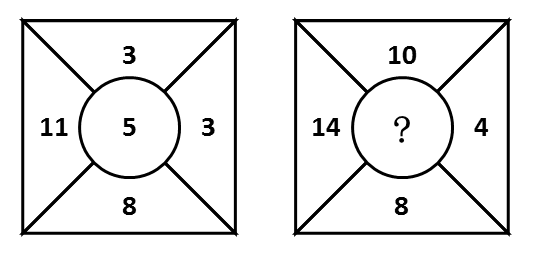
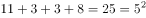
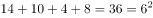
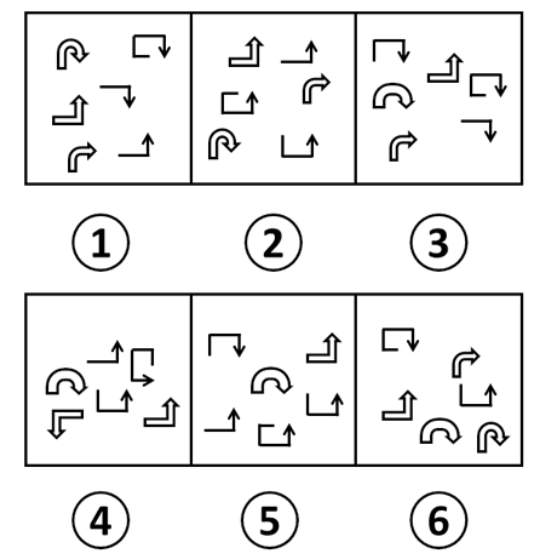

# 2016年吉林省公务员录用考试《行测》题（甲级）

> 判断推理 · 30 题 · 吉林 2016

## 第 1 题　qid 2021844 · 图形推理

从所给的四个选项中，选择最合适的一个填入问号处，使之呈现一定的规律性：

- **A**. 2
- **B**. 6　✅
- **C**. 4
- **D**. 3

**答案**：B

**官方解析**

观察发现第一幅图中外圈数字之和等于中间数字的平方，即；那么第二幅图也满足此规律，外圈数字之和为，那么中间数字应填入6。

故正确答案为B。

---

## 第 2 题　qid 2021852 · 图形推理

从所给四个选项中，选择最合适的一个填入问号处，使之呈现一定的规律性：

- **A**. A
- **B**. B
- **C**. C
- **D**. D　✅

**答案**：D

**官方解析**

元素组成不同，且无明显属性规律，考虑数量规律。九宫格优先横向看，观察发现，第一行黑块的数量分别为2、3、4，第二行黑块的数量分别为7、6、5，第三行黑块的数量分别为8、9、？，进而发现，图形按照“反S型”（如下图所示）的方向，后一幅图形在前一幅图形的基础上增加1个黑块，故？处应为在前一幅图形的基础上增加1个黑块的图形，只有D项符合。

故正确答案为D。

---

## 第 3 题　qid 2021862 · 图形推理

从所给四个选项中，选择最合适的一个填入问号处，使之呈现一定的规律性：

- **A**. A　✅
- **B**. B
- **C**. C
- **D**. D

**答案**：A

**官方解析**

观察发现，元素组成相似，考虑元素的样式规律。第一行图形中“口”和“古”去同存异，得到“十”；第二行图形中“们”和“闫”去同存异得到“仨”；第三行图形也应该遵循此规律，“圣”和“土”去同存异，“？”处应填“又”。
故正确答案为A。

---

## 第 4 题　qid 2021838 · 图形推理

把下面的六个图形分为两类，使每一类图形都有各自的共同特征或规律，分类正确的一项是：

- **A**. ①②④，③⑤⑥
- **B**. ①④⑥，②③⑤
- **C**. ①③⑥，②④⑤　✅
- **D**. ①③④，②⑤⑥

**答案**：C

**官方解析**

观察发现每幅图都由六个元素组成，且组成的元素种类和个数均不存在分组规律。由于题干图形中的所有元素都是箭头形式，而箭头均有指向，无非分为顺、逆时针。分别去数每个图形中顺时针、逆时针方向的箭头：图①中为4个顺时针，2个逆时针；图②中为2个顺时针，4个逆时针；图③中为5个顺时针，1个逆时针；图④中为1个顺时针，5个逆时针；图⑤中为2个顺时针，4个逆时针；图⑥中为4个顺时针，2个逆时针。观察发现，图①③⑥为一组，其中顺时针箭头数量多于逆时针箭头；而图②④⑤为另一组，其中顺时针箭头数量少于逆时针箭头。
故正确答案为C。

---

## 第 5 题　qid 2021832 · 图形推理

把下面的六个图形分为两类，使每一类图形都有各自的共同特征或规律，分类正确的一项是：

- **A**. ①③④，②⑤⑥　✅
- **B**. ①③⑤，②④⑥
- **C**. ①②⑤，③④⑥
- **D**. ①②④，③⑤⑥

**答案**：A

**官方解析**

图形组成不同，且属性无规律，考虑数量规律。观察题干发现，图①③⑤⑥线条交叉比较明显，则考虑数交点。题干六幅图交点的数量分别为10、8、7、4、8、8，所以①③④为一组交点的数量不是8，②⑤⑥为一组交点的数量是8。
故正确答案为A。
粉笔提示：有的同学可能考虑数面数量，认为图①③⑤为一组，面数量都是偶数，图②④⑥为一组，面数量都是奇数，从而选到B项。这种思路其实并不合适，一个是因为数点特征图明显，且这种分类方式符合吉林省考分组分类题目的命题特征；一个是奇偶性的考查太特殊，不建议往这个角度上考虑。因此粉笔更建议从点数量的角度考虑，把答案给到A选项。

---

## 第 6 题　qid 2021804 · 类比推理

松树对于（  ）相当于（   ）对于知识产权

- **A**. 松果：知识
- **B**. 松树枝：权利
- **C**. 植物：专利权　✅
- **D**. 松树林：商标权

**答案**：C

**官方解析**

逐一代入选项验证。
A项：松果是松树结出的果实，两者为对应关系；知识产权是一种法律概念，指智力创造的成果，而知识包含面很广，两者并不构成果实的对应关系，前后逻辑关系不一致，排除；
B项：松树枝是松树的一部分，是组成关系，知识产权是权利的一种，是种属关系，前后逻辑关系不一致，排除；
C项：松树是植物的一种，是种属关系，专利权是知识产权的一种，是种属关系，前后逻辑关系一致，当选；
D项：松树是松树林的一部分，是组成关系；商标权是知识产权的一种，是种属关系，前后逻辑关系不一致，排除。
故正确答案为C。

---

## 第 7 题　qid 2021806 · 类比推理

信件：E-mail

- **A**. 电脑：台式电脑
- **B**. 教师：女教师
- **C**. 朋友：老同学
- **D**. 图书：电子书　✅

**答案**：D

**官方解析**

第一步：判断题干词语间逻辑关系。
E-mail是信件的一种，二者是种属关系，且E-mail是信件的一种电子形式。
第二步：判断选项词语间逻辑关系。
A项：台式电脑是电脑的一种，二者是种属关系，与题干逻辑关系一致，保留；
B项：女教师是教师的一种，二者是种属关系，与题干逻辑关系一致，保留；
C项：有的朋友是老同学，有的朋友不是老同学，并且有的老同学是朋友，有的老同学不是朋友，二者是交叉关系，与题干逻辑关系不一致，排除；
D项：电子书是图书的一种，二者是种属关系，与题干逻辑关系一致，保留。
比较A、B、D三项，题干E-mail是信件的一种电子形式，A项台式电脑不是电脑的电子形式；B项女教师不是教师的电子形式；而D项电子书是图书的一种电子形式。
故正确答案为D。

---

## 第 8 题　qid 2021814 · 类比推理

曲艺：相声：娱乐性

- **A**. 社交：微信：即时性　✅
- **B**. 新闻：评论：客观性
- **C**. 医院：医生：权威性
- **D**. 司机：驾驶：可靠性

**答案**：A

**官方解析**

第一步：判断题干词语间逻辑关系。
相声是曲艺的一种形式，种属关系，娱乐性是相声的一种属性。
第二步：判断选项词语间逻辑关系。
A项：微信是社交的一种形式，是种属关系，即时性是微信的一种属性，与题干逻辑关系一致，当选；
B项：评论和新闻是并列关系，评论不一定具有客观性，与题干逻辑关系不一致，排除；
C项：医生的工作地点是医院，属于人物和场所的对应，不是种属关系，医生未必具有权威性，与题干逻辑关系不一致，排除；
D项：驾驶是司机的工作，不是种属关系，驾驶未必具有可靠性，与题干逻辑关系不一致，排除。
故正确答案为A。

---

## 第 9 题　qid 2021822 · 类比推理

大义凛然：卑躬屈膝

- **A**. 安分守己：好高骛远
- **B**. 穷奢极欲：节衣缩食
- **C**. 得心应手：百无一能
- **D**. 持之以恒：虎头蛇尾　✅

**答案**：D

**官方解析**

第一步：判断题干词语间逻辑关系。
“大义凛然”的意思是由于胸怀正义而神态庄严，令人敬畏；“卑躬屈膝”形容没有骨气，低声下气地讨好奉承。前者是有骨气，后者是没骨气，二者为反义关系。
第二步：判断选项词语间逻辑关系。
A项：“安分守己”的意思是规矩老实，守本分，是人的一种生活状态；“好高骛远”比喻不切实际地追求过高过远的目标。前者说的是一种规矩老实的生活状态，后者说的是目标不切实际，两者没有必然的逻辑关系，排除；
B项：“穷奢极欲”的意思是奢侈和贪欲到了极点；“节衣缩食”的意思是省吃省穿，形容节约。前者是不节约，后者是节约，两者构成反义关系，保留；
C项：“得心应手”的意思是心里怎么想，手就能怎么做，比喻技艺纯熟或做事情非常顺利；“百无一能”的意思是什么都不会做。前者是做事熟练，后者是没有技艺，二者不构成反义关系，做事熟练和技艺不娴熟才是反义关系，与题干逻辑关系不一致，排除；
D项：“持之以恒”的意思是长久坚持下去；“虎头蛇尾”比喻开始时声势很大，到后来劲头很小，有始无终。前者是有毅力，后者是无毅力，构成反义关系，保留。
题干中，“大义凛然”是褒义词，“卑躬屈膝”是贬义词。对比B、D两项，B项，“穷奢极欲”是贬义词，排除；D项，“持之以恒”是褒义词，“虎头蛇尾”是贬义词，与题干的感情色彩一致，当选。
故正确答案为D。

---

## 第 10 题　qid 2021824 · 类比推理

流行：高尚

- **A**. 专家：学者　✅
- **B**. 勇敢：品德
- **C**. 树根：树叶
- **D**. 闰月：春季

**答案**：A

**官方解析**

第一步：判断题干词语间逻辑关系。
有的流行的事物是高尚的，有的流行的事物不是高尚的，并且有的高尚的事物是流行的，有的高尚的事物不是流行的，两者是交叉关系。
第二步：判断选项词语间逻辑关系。
A项：有的专家是学者，有的专家不是学者，并且有的学者是专家，有的学者不是专家，两者是交叉关系，与题干逻辑关系一致，当选；
B项：勇敢是一种品德，两者是种属关系，与题干逻辑关系不一致，排除；
C项：树根和树叶都是树的一部分，两者是并列关系，与题干逻辑关系不一致，排除；
D项：闰月指的是阴历中的一种现象，是阴阳历中为使历年平均长度接近回归年而增设的月；春季是季节的一种，两者之间并没有必然的联系，与题干逻辑关系不一致，排除。
故正确答案为A。

---

## 第 11 题　qid 2021810 · 定义判断

稀缺效应，是指人们因物以稀为贵，而引起的购买行为变化的现象，即当某件事物变得稀缺或者难以得到时，人们会认为此物更有价值，也更想得到。
根据上述定义，下列没有体现稀缺效应的是：

- **A**. 商店每天都挂着打折仅此一天的横幅吸引大量顾客
- **B**. 某品牌手机实行网上预约销售限量抢购，结果供不应求
- **C**. 月底经济拮据的小张靠着去超市购买临期食品度日　✅
- **D**. 男性在临近酒吧打烊时会认为女性的吸引力指数上升了

**答案**：C

**官方解析**

第一步：找到定义关键词。
“当某件事物变得稀缺或者难以得到时”、“人们会认为此物更有价值，也更想得到”。
第二步：逐一分析选项。
A项：“打折仅此一天”体现了事物变得稀缺难得，“吸引大量顾客”体现了购买行为的变化，符合定义，排除；
B项：“限量抢购”体现了事物变得稀缺难得，“供不应求”体现了购买行为的变化，符合定义，排除；
C项：“月底经济拮据”和“购买临期食品”未体现出事物变得稀缺难得，不符合定义，当选；
D项：“酒吧打烊时”人会变得比较少，女性数量也会变少，体现了事物变得稀缺难得，符合定义，排除。 
本题为选非题，故正确答案为C。

---

## 第 12 题　qid 2021818 · 定义判断

互补品定价策略，是指企业为主要产品（价值量高的产品）制定较低的价格，而为附属产品（价值量低的产品）制定较高的价格，这样有利于增加整体的销量，从而增加企业利润。
根据上述定义，下列使用了互补品定价策略的是：

- **A**. 甲企业推出的一款网络游戏深受消费者喜爱，带动了游戏周边产品的热销
- **B**. 丁商场销售的十二生肖系列茶杯，成套购买会比单个购买的价格更加优惠
- **C**. 丙公司新推出内存为16G、64G和128G的三款智能手机，售价差别较大
- **D**. 乙厂商生产的喷墨打印机质量好、价格低，但墨盒的价格却一直居高不下　✅

**答案**：D

**官方解析**

第一步：找到定义关键词。
“企业”、“主要产品（价值量高的产品）制定较低的价格”、“附属产品（价值量低的产品）制定较高的价格”、“增加整体的销量，从而增加企业利润”。
第二步：逐一分析选项。
A项：“游戏周边产品”、“网络游戏”没有体现对不同种产品制定不同的价格，不符合定义，排除；
B项：“十二生肖系列茶杯”只是量大优惠，而没有体现主要产品和附属产品的定价不同，不符合定义，排除；
C项：“内存为16G、64G和128G的三款智能手机”这是三种产品，没有体现主要产品和附属产品的区别，不符合定义，排除；
D项：喷墨打印机价格低，墨盒价格高，墨盒是喷墨打印机的附属产品，符合“主要产品（价值量高的产品）价格低，附属产品（价值量低的产品）价格高”，符合定义，当选。
故正确答案为D。

---

## 第 13 题　qid 2021828 · 逻辑判断

犯罪目的是指犯罪人主观上通过犯罪行为所希望达到的结果，是以观念形态存在于犯罪人大脑中的犯罪行为所预期达到的结果。犯罪动机是刺激、促使犯罪人实施犯罪行为的内心起因或思想活动，它回答犯罪人基于何种心理原因实施犯罪行为。动机的作用是发动犯罪行为，说明实施犯罪行为对行为人的心理愿望具有什么意义。
根据以上定义，下列说法中正确的是：

- **A**. 甲为了报复乙，欲通过投毒的方式剥夺乙的生命，则甲的犯罪目的是报复
- **B**. 甲担心乙对其实施打击报复，将乙非法拘禁数日，则甲的犯罪动机是恐惧　✅
- **C**. 甲投毒致乙死亡，经查明是因为其嫉妒乙的才华，则甲的犯罪目的是嫉妒
- **D**. 甲贪图钱财，通过盗窃而非法占有乙的财物，则甲的犯罪动机是非法占有

**答案**：B

**官方解析**

第一步：找出定义关键词。
犯罪目的：“犯罪人主观上”、“希望达到的结果”。犯罪动机：“刺激、促使犯罪人”、“实施犯罪行为的内心起因或思想活动”。
第二步：逐一分析选项。
A项：甲希望达到的结果应该是剥夺乙的生命，因此甲的犯罪目的是剥夺乙的生命。而报复是实施犯罪行为的内心起因或思想活动，因此报复应该是犯罪动机，选项错误，排除；
B项：担心乙对其打击报复，是甲对乙非法拘禁数日的内心起因和思想活动，因此甲的犯罪动机是恐惧，当选；
C项：既然甲选择了投毒，那他所希望达到的结果肯定是乙死亡，因此甲的犯罪目的是剥夺乙的生命。而嫉妒是甲对乙投毒的内心起因或思想活动，属于犯罪动机，选项错误，排除；
D项：甲是因为贪图钱财而盗窃的，促使甲实施犯罪行为的内心起因是贪图钱财，所以甲的犯罪动机是贪图钱财，选项错误，排除。
故正确答案为B。

---

## 第 14 题　qid 2021834 · 定义判断

价值理性，是指行为人注重行为本身所能代表的价值，即是否实现社会的公平、正义、忠诚、荣誉等，而不计较手段和后果。价值理性所关注的是从某些具有实质的、特定的价值理念的角度来看行为的合理性。
根据上述定义，下列符合价值理性要求的是：

- **A**. 积善成德
- **B**. 替天行道　✅
- **C**. 过河拆桥
- **D**. 礼贤下士

**答案**：B

**官方解析**

第一步：找出定义关键词。
“是否实现社会的公平、正义、忠诚、荣誉等”、“不计较手段和后果”。 
第二步：逐一分析选项。
A项：积善成德的行为中存在做善事的过程，最后达到“成德”的目的，不符合“不计较手段和后果”，排除；
B项：替天行道的目的是实现社会的公平、正义、忠诚、荣誉等，但是其方式方法可能不太恰当，而价值理性就是不计较手段和后果地去实现社会的公平正义，符合定义关键词，保留；
C项：过河拆桥并没有体现出实现社会的公平、正义、忠诚、荣誉等，不符合定义关键词，排除；
D项：礼贤下士是指对有才有德的人以礼相待，根本不涉及不计较手段和后果，不符合定义关键词，排除。 
故正确答案为B。

---

## 第 15 题　qid 2021842 · 定义判断

辐射适应，是指具有血缘关系的生物，由于生活在不同的环境中而在形态以及生活习性上有着完全不同的适应性的现象。根据上述定义，下列属于辐射适应的是：

- **A**. 水生植物莲、狐尾藻和金鱼藻的亲缘关系很远，但由于都受到水中环境的影响，他们都具有通气组织发达，根系发育较弱等相似的特点
- **B**. 善于飞翔的信天翁翼展超过3.4米；善于在沙地上奔跑的鸵鸟身体巨大，双翼衰退，两腿刚劲有力，它的足几乎退化为适于奔跑的“蹄”　✅
- **C**. 斑马除腹部外，全身密布的黑白条纹，具有防止刺刺蝇叮咬的作用，因为刺刺蝇喜欢叮咬一些颜色单一的动物，并且会传播一种睡眠病
- **D**. 生活在寒带的雷鸟，在白雪皑皑的冬天，体色是纯白色的，一到夏天，就换上棕褐色的羽毛，与夏季苔原的斑驳色彩相近，从而保护自己

**答案**：B

**官方解析**

第一步：找出定义关键词。
“具有血缘关系”、“生活在不同环境”、“形态及生活习性上有着完全不同的适应性的现象”。
第二步：逐一分析选项。
A项：虽然水生植物莲、狐尾藻和金鱼藻的亲缘关系很远，可也是具有亲缘关系的生物，但都受到水中环境的影响与题干中提到的受到不同环境的影响不符，不符合定义，排除；
B项：善于飞翔的信天翁翅膀很长，善于奔跑的鸵鸟双翼退化，两腿有力，体现了生活在不同环境中有着形态不同的适应性的现象，但是信天翁和鸵鸟之间是否具有亲缘关系选项中并不明确，先保留；
C项：斑马除腹部外都布满黑白条纹，没有出现具有血缘关系的其他种类生物，也没有体现不同环境的影响，不符合定义，排除；
D项：生活在寒带的雷鸟在冬天和夏天羽毛颜色不同，是同一种生物，没有体现具有血缘关系的其他种类生物生活在不同的环境中，不符合定义，排除。
由于其他选项都能直接排除，并且“双翼衰退”可以看出鸵鸟与信天翁都是鸟类，是具有血缘关系的生物，本题只能选B选项。
故正确答案为B。

---

## 第 16 题　qid 2021846 · 定义判断

X理论认为，人的本性是懒惰的，工作越少越好，可能的话会逃避工作，因此管理者需要以强迫、威胁、处罚、金钱利益等诱因激发人们消极的工作原始动力。而Y理论则认为，人们有积极的工作源动力，工作是很自然的事，大部分人并不抗拒工作，即使没有外界的压力和处罚的威胁，他们一样会努力工作以期达到目的。
根据上述定义下列符合Y理论的是：

- **A**. 甲经理主张：应趋向于设定严格的规章制度，注重“他律”在管理中的应用
- **B**. 丁主任相信：世界上根本没有什么一成不变的、普遍适用的最佳的管理方式
- **C**. 丙科长指出：应趋向于对员工授予更大的权力，以此激发员工的工作积极性　✅
- **D**. 乙厂长认为：在员工管理中要根据企业实际状况灵活掌握管制与自觉的关系

**答案**：C

**官方解析**

第一步：找到定义关键词。
 “没有外界的压力和处罚的威胁，他们一样会努力工作”。
第二步：逐一分析选项。
A项：甲经理主张设定严格的规章制度，与题干中自主自觉性相违背，不符合定义，排除；
B项：丁主任相信世界上没有一成不变普遍适用的管理方式，并没有体现出具体的管理方式，也没体现出在没有外界的压力和处罚的威胁，他们一样会努力工作，不符合定义，排除；
C项：丙科长认为要授予员工更大的权力来激发员工的工作积极性，符合“即使没有外界的压力和处罚的威胁，他们一样会努力工作以期达到目的”，符合定义，当选；
D项：乙厂长认为员工管理中要根据企业实际状况灵活掌控管制与自觉的关系，还是在强调员工管理的重要性，不符合定义，排除。
故正确答案为C。
“Y理论”的若干管理办法：（1）管理要通过有效地综合运用人、财、物等生产要素来实现企业的各种目标。（2）把人安排到具有吸引力和富有意义的岗位上工作。（3）重视人的基本特征和基本需求，鼓励人们参与自身目标和组织目标的制定。（4）把责任最大限度地交给工作者。（5）要用信任取代监督，以启发与诱导代替命令与服从。
故正确答案为C。

---

## 第 17 题　qid 2021848 · 定义判断

概念混淆，是指由于自然语言的多义性和模糊性而产生的非形式谬误。构型歧义，是指由于句子语法结构的不正确而产生的歧义性谬误。
根据上述定义，下列选项中属于构型歧义的是：

- **A**. 一人去算命，问家庭，算命先生掐指一算，说，父在母先亡　✅
- **B**. 问：如果你哥哥有五个苹果，你拿走三个，结果怎样？答：结果他会揍我一顿
- **C**. 三个秀才问考试结果，算命先生伸出一个手指头，说了一个“一”，便再不出声
- **D**. 元宵夜，一女子想去观灯，丈夫说：“家中不是已点灯了吗？”

**答案**：A

**官方解析**

第一步：找出定义关键词。
“由于句子语法结构的不正确产生的歧义性谬误”。
第二步：逐一分析选项。
A项：父在母先亡，由于句子语法结构不对会产生歧义，蕴含了两种意思，一种是父亲亡的时间比母亲早，一种是父亲还在世，但是母亲已亡，符合定义；
B项：哥哥有五个苹果你拿走三个，问结果，这个结果有可能是算术结果也有可能是生活中的结果，是由语言的多义性和模糊性引起的，不符合定义，排除；
C项：三个秀才问考试结果，算命先生说了一个“一”，这个回答体现了语言的多义性和模糊性，和句子语法结构没有关系，不符合定义，排除；
D项：女子想去观灯，丈夫说家中已经点灯了，体现了语言的多义性和模糊性，和句子语法结构没有关系，不符合定义，排除。 
故正确答案为A。

---

## 第 18 题　qid 2021854 · 定义判断

回文，是指用相同语句回环往复地说明的一种修辞方式，形式上表现为词语相同但语序相反。
根据上述定义下列属于回文的是：

- **A**. 雾锁山头山锁雾，天连水尾水连天　✅
- **B**. 寻寻觅觅，冷冷清清，凄凄惨惨戚戚
- **C**. 东边日出西边雨，道是无晴却有晴
- **D**. 主人下马客在船，举杯欲饮无管弦

**答案**：A

**官方解析**

第一步：找到定义关键词。
关键词为“用相同语句回环往复地说明”、“词语相同但语序相反”。
第二步：逐一分析选项。
A项：“雾锁山”和“山锁雾”、“天连水”和“水连天”，都是用相同语句回环往复，且词语相同，语序相反，符合定义，当选；
B项：“寻寻觅觅，冷冷清清，凄凄惨惨戚戚”，只是单纯的汉字重复，没有体现相同语句的回环往复，也没有体现重复词语的语序相反，不符合定义，排除；
C项：“东边日出西边雨，道是无晴却有晴”整句中没有体现相同语句的回环往复，不符合定义，排除；
D项：“主人下马客在船，举杯欲饮无管弦”整句中没有体现相同语句的回环往复，不符合定义，排除。
故正确答案为A。

---

## 第 19 题　qid 2021858 · 定义判断

复合平等理论，是一种实现社会公平的设想，它认为任何一个领域的优势都不应当构成对整个社会的垄断，因此应将不同的社会领域尽可能区隔开来，允许各个领域有各自的优胜者，但要防止某个领域的优势越界扩张到其他领域。
根据上述定义，下列说法中最符合复合平等理论的是：

- **A**. 三百六十行，行行出状元
- **B**. 你可以选择做官，你也可以选择挣钱，但你不能选择通过做官来挣钱　✅
- **C**. 凡有的，还要加倍给他，叫他多余；没有的，连他所有的也要夺过来
- **D**. 术业有专攻，隔行如隔山

**答案**：B

**官方解析**

第一步：找到定义关键词。
“任何一个领域的优势都不应当构成对整个社会的垄断”、“应将不同的社会领域尽可能区隔开来”、“允许各个领域有各自的优胜者，但要防止某个领域的优势越界扩张到其他领域”。
第二步：逐一分析选项。
A项：“三百六十行，行行出状元”的意思是无论从事什么行业，都能做出成绩，成为这一行的专家、能人。并没有体现出应将不同的社会领域尽可能区隔开来，不符合定义，排除；
B项：“你可以选择做官，你也可以选择挣钱”体现了允许各个领域有各自的优胜者，“你不能选择通过做官来挣钱”将做官和挣钱区隔开，体现了将不同的社会领域尽可能区隔开，且防止某个领域的优势越界扩张到其他领域，符合定义，正确；
C项：“凡有的，还要加倍给他，叫他多余；没有的，连他所有的也要夺过来”没有体现不同领域，这属于同一个领域，并且这一做法使得这一领域的优势者构成对整个社会的垄断，不符合定义，排除；
D项：“术业有专攻”，指的是技能学业各有专门研究，“隔行如隔山”指的是不是本行的人就不懂这一行业的门道。二者的意思都是指专注于某个领域才会有成就和收获，定义不符合，排除。
故正确答案为B。

---

## 第 20 题　qid 2021860 · 定义判断

比拟法是植物命名时最常见的一种修辞造词手段，是一种当物体的一部分或整体在形状、纹色、气味、质地、功能等方面，与其他事物存在着相似联系，植物命名时就相应地选择代表相似事物的词语来参与造词的方法。
根据上述定义下列植物命名，没有使用比拟法的是：

- **A**. 蘑菇里最珍贵的叫猴头，这种蘑菇是圆的，没有根，泥黄色表面成头发丝状很像猴子的脑袋，故而得名
- **B**. 代代花，姑苏名产，实熟时色黄，若不采下，经五年而不烂，皮色由青而黄复由黄变青可历多年故称代代花　✅
- **C**. 据《本草纲目-果部-椰子》，记载椰子果实圆形，上有黑褐色的毛，人们将其与人的头颅类比，命名为“越王头”
- **D**. 甘草可调和众药，故又名“国老”，“国老”本为古代的国之重臣，或为告老退职的卿、大夫或士，有德高望重之义

**答案**：B

**官方解析**

第一步：找到定义关键词。
“物体的一部分或整体在形状、纹色、气味、质地、功能等方面，与其他事物存在着相似联系”、“植物命名时就相应地选择代表相似事物的词语来参与造词”。
第二步：逐一分析选项。
A项：“猴头”是因为泥黄色表面成头发丝状很像猴子的脑袋而得名，是蘑菇的形状与猴子脑袋相似，符合定义，选非题，排除；
B项：“代代花”的命名是因为果实成熟时没有采下，经五年而不烂，皮色由青而黄复由黄变青可历多年，不符合定义中“形状、纹色、气味、质地、功能”中的任何一种方式，选非题，当选；
C项：“越王头”因外形圆，有黑褐色的毛，和人类的头颅类似而命名，是形状的类似，符合定义，选非题，排除；
D项：甘草又名“国老”是因为可调和众药，更好地发挥药效，在功能上和古代的重臣类似，重臣可以调和文武百官，发挥出更好的作用，符合定义，选非题，排除。
本题为选非题，故正确答案为B。
附：甘草别名的由来：
南朝有一个名医叫陶弘景，他是著名的医药家、道教学家、文学家。他早年为官，36岁时辞官入茅山隐居。其间，他不时收到梁武帝派人传来的国家时事动态，在山中为朝廷出谋划策，被人称为“山中宰相”。同时，他还编撰书稿，写炼丹笔记，也经常为人治病。
陶弘景开的药方中都有甘草，有病人问甘草是不是能医百病。陶弘景笑道：“甘草甘平补益，又能缓能急，对一些性情猛烈的药物，可监之、制之、敛之、促之；在不同的药方中，可为君为臣，可为佐为使，能调和众药，使它们更好地发挥药效。在药的王国里，甘草是国之药老。”从此，人们就把甘草称作“国老”了。

---

## 第 21 题　qid 2021864 · 逻辑判断

近日，某国的科学家们正在尝试用粒子加速器治疗癌症。他们将包括脑胶质瘤细胞在内的几种肿瘤细胞培养物放置在模拟人类头部的有机玻璃器皿中。再把这个“人头”放在粒子加速器的作用范围内。科学家们首次在肿瘤细胞内聚集着足够量的硼-10，然后再用中子束照射肿瘤部位。使肿瘤细胞内部发生核反应，肿瘤细胞随之死亡。
以下哪项如果为真，最能支持实验的成功？

- **A**. 中子束对肿瘤细胞的作用，有别于健康细胞
- **B**. 脑胶质肿瘤类癌症用其他治疗方式无法治愈
- **C**. 只有肿瘤细胞会在中子束的作用之下死亡　✅
- **D**. 中子束能摧毁包括脑细胞在内的人体细胞

**答案**：C

**官方解析**

第一步：找出论点和论据。
论点：实验的成功，实验即在肿瘤细胞内聚集着足够量的硼-10，然后再用中子束照射肿瘤部位，使肿瘤细胞内部发生核反应，肿瘤细胞随之死亡。
论据：无。
只有论点没有论据，考虑补充论据进行加强，可以解释原因、举例以及说明必要条件。
第二步：逐一分析选项。
A项：中子束对肿瘤细胞有别于健康细胞，有别于存在两个方向的可能，有益或者是有害，因此不能说明中子束对健康细胞是否有害，为无关项，无法加强，排除；
B项：其他治疗方法无法治愈脑胶质肿瘤类癌症，不能通过排除的方式说明本次实验所用的粒子加速器治疗癌症有用，不能支持实验的成功，为无关项，无法加强，排除；
C项：题干中实验利用粒子加速器（中子束）作用于肿瘤细胞来治疗癌症，说明只有肿瘤细胞会在中子束的作用下死亡，否则正常的健康细胞也会死亡，如此实验失败。为实验成功的必要条件，可以加强，当选；
D项：中子束能够摧毁脑细胞，说明实验导致了脑细胞的死亡而不是脑细胞中的肿瘤细胞死亡，从而说明粒子加速器治疗癌症的不成功，通过补充论据的方式削弱了题干论点，无法加强，排除。
故正确答案为C。

---

## 第 22 题　qid 2021866 · 逻辑判断

某家有爸爸、妈妈、哥哥和妹妹四口人。一天家里突然出现了一份为奶奶准备的神秘生日礼物，对于生日礼物是谁准备的四人有如下说法：
爸爸说：我们四人都没准备
妈妈说：不是我准备的
哥哥说：妈妈和妹妹至少有一人没准备
妹妹说：这是我们四人中有人准备的
已知四人中有两人说的真话，两人说的是假话。由此可以推出：

- **A**. 爸爸和妈妈说的是真话
- **B**. 爸爸和妹妹说的是真话
- **C**. 哥哥和妈妈说的是真话
- **D**. 哥哥和妹妹说的是真话　✅

**答案**：D

**官方解析**

第一步：整理题干。

爸爸：所有人都没准备；妈妈：妈妈；哥哥：妈妈 或 妹妹；妹妹：有人准备。

第二步：首先找矛盾。

可以看出，爸爸和妹妹说的话为矛盾关系，必有一真必有一假，提问方式为两真两假，也就是说妈妈和哥哥说的话也是一真一假，但他们两个人说的话既不是矛盾关系，也不是反对关系，无法继续推理。

第三步：找到矛盾却不能继续推理，又找不到反对，所以找推出关系。

我们发现如果妈妈说的话为真，那么可以推出哥哥说的话一定为真，即：妈妈（真）哥哥（真）。

第四步：抓住推出关系定真假。

妈妈和哥哥的话为一真一假，根据“一真前假，一假后真”，可知妈妈的话为假，哥哥的话为真。题干条件为两真两假，根据哥哥的话为真，排除A、B两项；根据妈妈的话为假，排除C项。

故正确答案为D。

---

## 第 23 题　qid 2021870 · 逻辑判断

自由基是人类机体在消耗氧气时产生的一种有时会有害的自由分子，很多人相信自由基是机体衰老背后的罪魁祸首。因为有研究人员发现，人类在衰老的过程中自由基的数量在不断上升。
以下除哪项外，均能削弱上述结论：

- **A**. 关于人类衰老的具体过程还存在着很多的争议　✅
- **B**. 自由基在对抗机体衰老的过程中,数量会上升
- **C**. 通过人工提升自由基的数量可延长机体的寿命
- **D**. 染色体结构失去稳定性是导致人类衰老的原因

**答案**：A

**官方解析**

第一步：找到论点和论据。
论点：自由基是人类机体在消耗氧气时产生的一种有时会有害的自由分子，很多人相信自由基是机体衰老背后的罪魁祸首。
论据：人类在衰老的过程中自由基的数量在不断上升。
第二步：逐一分析选项。
A项：表明人类衰老的具体过程存在争议，未提及自由基与人类衰老之间的关系，为无关选项，当选；
B项：自由基是由于对抗机体衰老的过程中数量才上升，而并非因为自由基的上升导致了机体衰老，属于因果倒置，排除；
C项：说明自由基可以延长寿命，自由基有益，通过举例子削弱了题干论点，排除；
D项：染色体结构失去稳定性导致人类衰老，导致衰老的可能不仅仅是自由基的上升，属于另有他因，排除。
本题为选非题，故正确答案为A。

---

## 第 24 题　qid 2021872 · 逻辑判断

所有工作都是有报酬的，而任何有报酬的工作都是可以用金钱衡量的。因此，公益劳动不是工作。
上述论证的成立，必须补充以下哪项前提？

- **A**. 公益劳动不可以用金钱衡量　✅
- **B**. 有报酬的工作不是公益劳动
- **C**. 公益劳动不是有报酬的工作
- **D**. 一切有报酬的工作都是工作

**答案**：A

**官方解析**

第一步：找出论点和论据。

论点：公益劳动工作。

论据：①工作报酬；②报酬金钱衡量。

第二步：论点和论据之间存在跳跃，需要搭桥补充前提条件。

A项：公益劳动金钱衡量，根据①和②进行逆否等价推理，即金钱衡量报酬工作，可以得出结论：公益劳动工作，保留；

B项：报酬公益劳动，即公益劳动报酬，根据①进行逆否等价推理，即报酬工作，可以得出结论：公益劳动工作，保留；

C项：公益劳动报酬，根据①进行逆否等价推理，即报酬工作，可以得出结论：公益劳动工作，保留；

D项：报酬工作，没有提到公益劳动，排除。

对比A、B、C三项，题干的论证包括两个推理即“工作报酬；报酬金钱衡量”A项是这两个推理存在的必要条件，而B项和C项只是一部分推理的必要条件（忽略了“报酬金钱衡量”），因此A项更加符合题意，当选。

而且，B项和C项属于同构选项，表述的意思完全一致，即B项对C项就对，C项对B项就对，因此同构选项应该排除。

故正确答案为A。

---

## 第 25 题　qid 2021874 · 逻辑判断

最新公布的S省居民膳食结构调查结果显示：在过去的三年中，该省居民平均每日食用谷类薯类及杂豆335.7克，位于平衡膳食推荐量250克至400克的范围之内；食用蔬菜和水果296克和132克，蔬菜仅达到了平衡膳食推荐量要求每日300克至500克的下限，与10年前相比，摄入量大为下降，而水果仅为推荐量的左右；食用鱼虾类水产品16.4克，大大低于平衡膳食推荐量的50克至100克的标准；豆制品和奶制品摄入量分别为16.9克和73.6克，比推荐量低和左右。

由此可以推出：

- **A**. S省居民最喜爱食用的是谷类薯类及杂豆
- **B**. S省居民平均每日食用蔬菜和谷类薯类及杂豆量基本达到平衡膳食推荐量的标准　✅
- **C**. 在S省居民过去三年的日常生活中，平均每日食用鱼虾类水产品数量是最少的
- **D**. S省居民对蔬菜的摄入量呈逐年下降趋势

**答案**：B

**官方解析**

本题属于日常推理题型，逐一对比选项和题干内容。
A项：提到谷类薯类及杂豆的为文段第一句，最喜爱食用在题干中并未提及，属于无中生有，排除；
B项：蔬菜平均每日食用量296克，平衡膳食推荐要求为每日300克至500克；谷类薯类及杂豆平均每日食用量335.7克，平衡膳食推荐要求为每日250克至400克，因此选项所述基本达到，能够从题干中推出，当选；
C项：题干中的调查结果没有进行完全概述，是否进行了完全列举未知，因此无法推出鱼虾类水产品平均每日食用量最少，排除；
D项：题干只给出“在过去三年中”的调查数据，无法推出逐年趋势，属于无中生有，排除。
故正确答案为B。

---

## 第 26 题　qid 2021890 · 逻辑判断

最近几十年，花生过敏问题因其潜在的危险性及全球不断增加的发病率而日益受到关注。在美国国家过敏症和传染病研究所资助下，英国伦敦大学国王学院研究人员得出一个结论：从小就开始吃含花生的食品，会使人对花生过敏的风险大幅降低。
以下哪项如果为真，最能支持上述结论：

- **A**. 
婴儿从4个月就开始吃鸡蛋，会使其对鸡蛋过敏的风险大幅降低

- **B**. 
小孩停止定期食用花生制品之后，防止花生过敏的效果会仍然存在

- **C**. 
美国国家过敏症和传染病研究所建议婴儿摄取花生制品以预防过敏

- **D**. 
定期吃花生制品的婴儿，到5岁时对花生过敏的风险降低了
　✅

**答案**：D

**官方解析**

第一步：找出论点和论据。
论点：从小就开始吃含花生的食品，会使人对花生过敏的风险大幅降低。
论据：无。
第二步：逐一分析选项。
A项：题干论述的是花生过敏问题及其潜在危险性，与鸡蛋无关，属无关选项，排除；
B项：停止食用后防止过敏的效果仍然存在，论述时间点与题干不一致，题干论述的时间点是从小就开始吃含花生的食品，没有讨论停止定期食用问题，与题干表述对象不一致，属无关选项，排除；
C项：建议婴儿摄取花生制品以预防过敏，论述的重点是预防过敏，而题干论述的是使人对花生过敏的风险降低，表述范围不一致，属无关选项，排除；
D项：定期吃花生到5岁，与题干时间节点一致，即从小就开始吃花生；到5岁时对花生过敏的风险大幅降低，与题干论点效果一致。D选项通过举例子的方式加强了题干论点，正确。
故正确答案为D。

---

## 第 27 题　qid 2021894 · 逻辑判断

最近，上海长宁区开了一个新超市。从外表看，这是一间典型的中国连锁超市。满满当当的货架塞满了各种食品和日用品。然而所有店内商品，虽然外观与普通商品没有分别，里面却是空的，包装上找不到拆封的痕迹，来访者也无处得知商品是如何被“掏空”的。虽然这是一家卖空的超市，却人气爆棚。
以下哪项如果为真，最能解释上述现象：

- **A**. 部分购买者不知道里面是空的
- **B**. 空包装实际上是一种艺术商品　✅
- **C**. 有一些空包装是恶作剧的道具
- **D**. 超市引发日常消费文化的探讨

**答案**：B

**官方解析**

此题属于原因解释类题目，需要解释的现象为：超市内塞满了各种被“掏空”的食品和日用品，但是却人气爆棚。
A 项：解释了部分购买者不知道里面是空的，出现了购买行为，但是不能解释为什么人气爆棚，排除。
B 项：空包装实际上是一种艺术商品，既解释了超市内塞满了各种被“掏空”的食品和日用品，是艺术品超市，又解释了人气爆棚的原因，是因为大家都来购买艺术品，解释了矛盾的两个方面，当选。
C 项：有一些空包装是恶作剧的道具，无法解释题干中矛盾，排除。
D 项：超市引发日常消费文化的探讨，无法解释题干中矛盾，排除。
故正确答案为B。

---

## 第 28 题　qid 2021898 · 逻辑判断

苏格拉底有一句名言：“我只知道一件事，那就是什么都不知道。”
以下哪项最精准地表明了上述推理的荒谬？

- **A**. 甲：“我们不应背后议论我们的朋友。”乙：“难道我们要当面议论我们的朋友吗？”
- **B**. 纸牌一面写：“纸牌反面的句子是对的。”另一面写：“纸牌反面的句子是错的。”　✅
- **C**. 俗话说：“男子汉大丈夫，宁死不屈。”俗话又说：“男子汉大丈夫，能屈能伸。”
- **D**. 甲：“你的观点和主流的观点是有矛盾的。”乙：“这没什么，矛盾是普遍存在的。”

**答案**：B

**官方解析**

第一步：分析题干。
苏格拉底的名言实际上是一个悖论，他只知道一件事，而这件事即“什么都不知道”，那么既然什么都不知道，意味着苏格拉底也不可能知道“一件事”；就是说，我们无法从这句话推论出苏格拉底是否知道这件事。
第二步：逐一分析选项。
A项：甲说不应背后议论朋友，乙说难道要当面议论朋友，属于混淆概念，“背后议论”的反面并非一定是“当面议论”，也可以“不议论”，甲乙两人的话并不违背，不存在题干中的悖论，排除；
B项：纸牌一面写“纸牌反面句子是对的”，即另一面写的“纸牌反面的句子是错的”这句是对的，此句中的“纸牌反面的句子”实际上指的就是前一句“纸牌反面句子是对的”，意味着前一句此时又是错的，这两句构成了悖论，我们同样无法根据这两句话推出结果怎样，与题干一致，当选；
C项：前一句“宁死不屈”讨论的是愿不愿意屈服，而后一句“能屈能伸”讨论的是能不能屈服，二者混淆了概念，不存在题干中的悖论，排除；
D项：前一句“你的观点和主流的观点是有矛盾的”中的矛盾一词指的是两种观点存在冲突，而后一句“矛盾是普遍存在的”指的是同一事物的两个对立面，如自然界中的作用力与反作用力，绝对运动和相对静止等。二者混淆了概念，不存在题干中的悖论，排除。
故正确答案为B。

---

## 第 29 题　qid 2021900 · 逻辑判断

王戎七岁，尝与诸小儿游，见道边李树多子折枝。诸儿竞走取之，唯戎不动。人问之，答曰：“树在道边而多子，此必苦李。”取之信然。
王戎的隐含推理的假设是：

- **A**. 若路边的李子被摘光了，就不会多子折枝。
- **B**. 若路边的李子味道甜美，就不会多子折枝。　✅
- **C**. 若路边的李子味道不甜美，就会多子折枝。
- **D**. 只有路边的李子没被摘光，才会多子折枝。

**答案**：B

**官方解析**

第一步：找出论点和论据。

论点：此必苦李。

论据：树在道边而多子。

论点讨论的是李子是苦的，而论据讨论的是树在道路边并且李子很多，论点和论据话题不一致，优先考虑搭桥，即树在道边而多子此必苦李。

第二步：逐一分析选项。

A项：李子被摘光不会多子折枝，李子是否摘光和题干讨论的话题不一致，无法加强，排除；

B项：李子味道甜美不会多子折枝，将其逆否，多子折枝李子味道不甜美，在论点和论据之间搭桥，可以加强，当选；

C项：李子味道不甜美会多子折枝，无法加强，排除；

D项：多子折枝李子没被摘光，李子是否摘光和题干讨论的话题不一致，无法加强，排除。

故正确答案为B。

---

## 第 30 题　qid 2021902 · 类比推理

巫马子对墨子说：我不能兼爱。我爱我的家人比爱我家乡的人深，爱我的双亲比爱我的家人深，爱我自己胜过爱我双亲，这是因为切近我的缘故。打我，我会痛，打别人，不会痛在我身上，所以我只会杀他人以利于我。墨子问道：你的这种义会告诉别人吗？巫马子答道：我为什么要隐藏，我会告诉别人。墨子说：既然你这样，如果有人喜欢你的主张，那么这个人就要杀你以利于自己。如果有人不喜欢你的主张，那他也要杀你，因为他认为你是散布不祥之言的人。
由上文可推知：

- **A**. 巫马子只能远走他乡
- **B**. 巫马子必须承认自己的观点是错的
- **C**. 巫马子一定要改变自己原来的观点
- **D**. 巫马子一定会被人杀死　✅

**答案**：D

**官方解析**

A项：巫马子远走他乡题干中根本没提到，属于无中生有，排除；
B项：题干中只是二者之间的对话，并未涉及最后的结论，也就是说巫马子是否要承认自己的观点是错的并未明确说明，排除；
C项：巫马子一定要改变自己原来的观点说法太绝对，墨子只是在反驳巫马子的观点，但是最终巫马子会不会改变自己的观点，我们无从得知，排除；
D项：墨子的观点给出的是在一组矛盾假设的基础上得出了相同的结论，因此结论一定成立，即喜欢你的观点，你会被人杀死，不喜欢你的观点，你也会被人杀死，所以我们可以得到巫马子一定会被人杀死，正确。
故正确答案为D。
本题涉及矛盾关系，矛盾关系包含了世上所有的情况。比如世界上只有两种情况，喜欢你的主张，不喜欢你的主张，在这两种情况下结论是一样的，所以可以得出结论必然发生。
再举一个例子，下雨和不下雨是矛盾的。如果下雨，我去逛街；如果不下雨，我去逛街。也就是说在任何情况下，逛街这件事是必然发生的。

---
