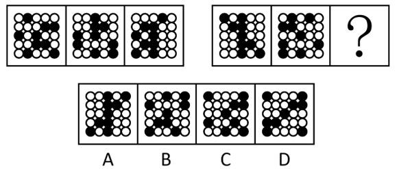
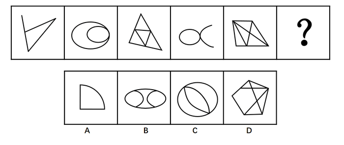
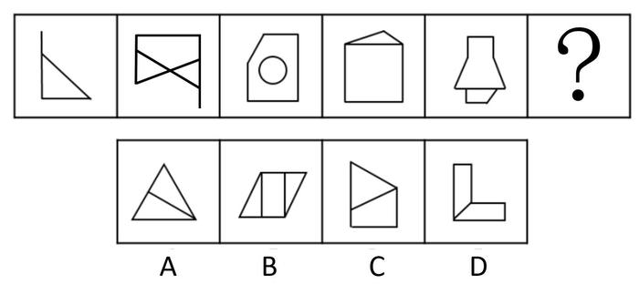
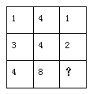
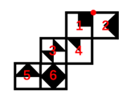
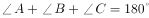

# 2016年四川省公务员录用考试《行测》题（下半年）

> 判断推理 · 30 题 · 四川 2016

## 第 1 题　qid 2029956 · 图形推理

从所给的四个选项中，选择最合适的一个填入问号处，使之呈现一定的规律性：

- **A**. A　✅
- **B**. B
- **C**. C
- **D**. D

**答案**：A

**官方解析**

题干给出图形均由五边形、圆形、阴影三角形和圆中的垂直的两条半径组成，元素组成相同，考虑位置关系。观察发现，前一图中的阴影三角形依次顺时针旋转72°（360°÷5），圆内垂直的两条半径依次逆时针旋转90°。根据阴影三角形的移动可排除CD，再根据圆内垂直的两条半径可排除B。
故正确答案为A。

---

## 第 2 题　qid 2029958 · 图形推理

从所给的四个选项中，选择最合适的一个填入问号处，使之呈现一定的规律性：

- **A**. A
- **B**. B　✅
- **C**. C
- **D**. D

**答案**：B

**官方解析**

元素组成相同，考虑位置规律。观察发现，25宫格内每行黑球的数目恒定，考虑黑球在同行中的平移。第一组图中，第一行黑球每次向右移动一个单位，第二行黑球每次向左移动一个单位，第三行黑球位置保持不变，第四行黑球每次向右移动两个单位（同行内循环跑），第五行图形黑球每次向右移动三个单位（同行内循环跑）。第二组图形遵循此规律，只有B项符合。
故正确答案为B。

---

## 第 3 题　qid 2029960 · 图形推理

从所给的四个选项中，选择最合适的一个填入问号处，使之呈现一定的规律性：

- **A**. A
- **B**. B
- **C**. C　✅
- **D**. D

**答案**：C

**官方解析**

元素组成不同，考虑属性规律和数量规律。观察发现，题干中奇数项图形均为全直线图形，偶数项图形均为全曲线图形，即全直线和全曲线组成的图形交替出现，？处应为全曲线图形，据此排除A、D选项。题干第二个图形为“日”字变形图，考虑笔画数考点，所有图形均能一笔画成。BC选项中只有C选项能够一笔画成。
故正确答案为C。

---

## 第 4 题　qid 2029962 · 图形推理

从所给的四个选项中，选择最合适的一个填入问号处，使之呈现一定的规律性：

- **A**. A
- **B**. B　✅
- **C**. C
- **D**. D

**答案**：B

**官方解析**

元素组成不同，考虑属性或者数数。观察发现属性无规律。考虑数数，图形中“窟窿”较多，可以先数面，面数量 1，3，2，2，2无规律；观察图形发现，第二幅图存在交叉，考虑数点，点数量3，7，5，5，10无规律；观察图形发现，除第三幅图外其余所有图形均由直线构成，考虑数线，直线数3，5，5，6，9无规律；并且在数线时发现，已知图形中均有多边形，其中包含直角三角形，直角梯形，正方形，每一幅图形中都有直角，考虑数直角数，直角数1，2，3，4，5为常数列。在选项中寻找直角数目为6的选项，选项中直角数目依次为2，6，2，5。
故正确答案为B。

---

## 第 5 题　qid 2029964 · 图形推理

从所给的四个选项中，选择最合适的一个填入问号处，使之呈现一定的规律性：

- **A**. A
- **B**. B
- **C**. C
- **D**. D　✅

**答案**：D

**官方解析**

九宫格图形，观察发现图形元素组成不同，考虑属性或者数数。观察发现属性无规律，考虑数数。图形中“窟窿”数比较多，考虑数面。发现，题干九宫格中面的数量分别是：

横向发现无规律，纵向发现，每列第三行面数量是前两行面数量之和。？处应该选择有3个面的选项，选项ABCD的面数量分别为4、6、4、3。

故正确答案为D。

---

## 第 6 题　qid 2029966 · 图形推理

把下面的六个图形分为两类，使每一类图形都有各自的共同特征或规律，分类正确的一项是：

- **A**. ①②③，④⑤⑥
- **B**. ①③④，②⑤⑥
- **C**. ①④⑤，②③⑥
- **D**. ①④⑥，②③⑤　✅

**答案**：D

**官方解析**

题干给出的每幅图形都是由不同形状的面组成，图2、图3、图5图形内部都有和外轮廓形状相同的面，图1、图4、图6图形内部面的形状都与外轮廓不同。
故正确答案为D。

---

## 第 7 题　qid 2029968 · 图形推理

把下面的六个图形分为两类，使每一类图形都有各自的共同特征或规律，分类正确的一项是：

- **A**. ①②③，④⑤⑥
- **B**. ①②⑤，③④⑥
- **C**. ①③⑤，②④⑥
- **D**. ①⑤⑥，②③④　✅

**答案**：D

**官方解析**

方法一：图形组成凌乱，属性没有规律，考虑数量规律，观察题干给出的6个图形，图①和图②、图③和图④、图⑤和图⑥的外轮廓相同，区别在于这个外轮廓内部引出了不同数量的线条，可以考虑外轮廓与内部线条的交点，图①⑤⑥外轮廓与内部线条的交点数为6个，图②③④外轮廓与内部线条的交点数为7个。
方法二：观察图形发现，题干均为内部线条与外框相交构成的图形，其中图①⑤⑥中间有一个面不和外框相接，图②③④的面都和外框相接，即图①⑤⑥为一组，图②③④为一组。
故正确答案为D。
说明：如果这两种思路不是同一个选项，建议同学们选外框交点的选项，因为这个是常考考点。

---

## 第 8 题　qid 2030048 · 图形推理

左边是给定纸盒的外表面，右边哪一项能由它折叠而成？

- **A**. A
- **B**. B
- **C**. C
- **D**. D　✅

**答案**：D

**官方解析**

A项：由面6、面4和面5组成，面5和面4在Z字型两端，为相对面，不可能同时出现，排除；

B项：选项前面和上面都和面2特征一样，但题干中面2只有一个，不可能同时出现2个，选项错误，排除；

C项：由面1、面3和面2组成，面3和面2在Z字型两端，为相对面，不可能同时出现，排除；

D项：与题干一致，当选；

故正确答案为D。

---

## 第 9 题　qid 2029970 · 逻辑判断

甲、乙、丙、丁、戊五人，其中两人是英语教育专业，两人是商贸英语专业，一人是英语翻译专业。五人中有两人找到了工作，并且他们的专业不同。
由此可以推出：

- **A**. 五人中未找到工作的来自不同的专业
- **B**. 五人中商贸英语专业的至多有一人未找到工作
- **C**. 五人中找到工作的人一定有来自商贸英语专业的
- **D**. 五人中未找到工作的人一定有来自英语教育专业的　✅

**答案**：D

**官方解析**

第一步：分析题干。
根据题干的“五人中有两人找到了工作，并且他们的专业不同”可知，找到工作的为三个专业中的其中两个专业。
第二步：逐一分析选项。
A项：如果找到工作的一个人为英语翻译专业，则没找到工作的三个人中有两人必为同一专业，排除；
B项：题干中并未明确找到工作的人的专业，如果是英语翻译专业和英语教育专业，则商贸英语专业的两人均未找到工作，排除；
C项：同理，题干中并未明确找到工作的人的专业，过于绝对，排除；
D项：找到工作的人的专业不同，英语教育专业的最多有一人找到工作，而英语教育专业的有两人在找工作，未找到工作的人一定有来自英语教育专业的，当选。
故正确答案为D。

---

## 第 10 题　qid 2029974 · 定义判断

首因效应是指个体在社会认知过程中，通过第一印象最先输入的信息对客体以后的认知产生显著的影响作用。第一印象作用最强，持续的时间也长，比以后得到的信息对于事物整个印象产生的作用更强。根据上述定义，下列首因效应没有发挥作用的是：

- **A**. 金融行业从业人员，一般着深色套装，给人专业和严谨的印象
- **B**. 小张在面试中表现突出，后公司的人力资源部发现小张的简历上存在错别字而取消了录用他的计划　✅
- **C**. 已过而立之年的王先生频频相亲却没有结果，据和他有过一面之交的金小姐说，王先生“以自我为中心”的夸夸其谈，令她很反感
- **D**. 刚刚毕业的小张在找工作过程中屡屡碰壁，后经咨询专业人士才得知因她染了一头红色的头发，而给人不够成熟稳重的感觉

**答案**：B

**官方解析**

第一步：找到定义关键词。
“通过第一印象最先输入的信息对客体以后的认知产生显著的影响作用”、“第一印象作用比以后得到的信息对于事物整个印象产生的作用更强”。
第二步：逐一分析选项。
A项：金融行业从业人员的衣着是为了给人专业和严谨的印象，属于“通过第一印象最先输入的信息对客体以后的认知产生显著的影响作用”，符合定义，排除；
B项：面试中的表现属于第一印象，然而后面发现简历上存在错别字而取消录用不符合“第一印象作用比以后得到的信息对于事物整个印象产生的作用更强”，不符合定义，当选；
C项：相亲时属于建立第一印象，相亲对象的评价属于“通过第一印象最先输入的信息对客体以后的认知产生显著的影响作用”，符合定义，排除；
D项：因为头发的颜色而给人不够成熟稳重的感觉属于“通过第一印象最先输入的信息对客体以后的认知产生显著的影响作用”，符合定义，排除。
本题为选非题，故正确答案为B。

---

## 第 11 题　qid 2029978 · 逻辑判断

从2002年开始，我国的离婚率就一路走高。专家表示，我国离婚率上升的原因不能简单解释为社会风气不好，一方面与原来整体离婚率水平比较低有关；另一方面也与中国社会方方面面的变化以及舆论环境、社会观念变化有关。以下哪项如果为真，最能支持专家观点？

- **A**. 据统计，在众多的离婚者中，年轻人所占的比率越来越大
- **B**. 统计显示，男女地位平等、个人自我意识的觉醒是我国离婚率上升的主要原因　✅
- **C**. 2015年我国离婚率最高的城市是北京，其后依次是上海、深圳、广州、厦门等城市
- **D**. 我国离婚率上升的原因其实非常复杂，除了社会风气的影响，还牵涉人的情感因素​

**答案**：B

**官方解析**

第一步：找到论点和论据。
论点：我国离婚率上升的原因不能简单解释为社会风气不好，一方面与原来整体离婚率水平比较低有关；另一方面也与中国社会方方面面的变化以及舆论环境、社会观念变化有关。
论据：无。 
第二步：逐一分析选项。
A项：论点讨论的是离婚率上升的原因，而A选项强调的是离婚中年轻人的比率，与论点无关，属于无关选项，排除；
B项：强调了离婚率上升的原因是男女地位平等、个人自我意识的觉醒，说明离婚率上升的原因确实和社会观念变化有关，通过补充新论据来支持论点，当选；
C项：讨论的是离婚率比较高的城市，与离婚率高的原因无关，属于无关选项，排除；
D项：指出离婚率上升的原因除了社会风气的影响，还牵涉人的情感因素，提出了新的原因，属于他因削弱，排除。
故正确答案为B。

---

## 第 12 题　qid 2029980 · 定义判断

职业认同感是指个体对其所从事的职业的肯定性评价。根据上述定义，下列人员具有职业认同感的是：

- **A**. 小王，军人，他常以自己足球踢得好而自豪
- **B**. 小刘，公司文员，多次被自己上司周经理表扬其秘书工作做得好
- **C**. 小魏，大学生，准备大学毕业后回到偏僻的家乡去教书，因为他觉得老师这个职业很伟大
- **D**. 小李，医生，工作特别努力，他觉得国家给他这么高的薪酬，能为他人解除痛苦是一种快乐　✅

**答案**：D

**官方解析**

第一步：找到定义关键词。
“个人”、“所从事的职业”、“肯定性评价”。
第二步：逐一分析选项。
A项：小王是军人，但是却为踢足球自豪，踢足球并不是他所从事的职业，因此不符合定义，排除；
B项：小刘是被上司表扬，并不能体现他自己对所从事工作的评价，因此不符合定义，排除；
C项：小魏要从事教师行业，但还没有毕业，还没有开始从事教师这一行业，因此小魏没有对自己所从事行业有肯定性评价，不符合定义，排除；
D项：小李是医生，并且觉得为他人解除痛苦是快乐，这是对其所从事职业的肯定性评价，符合定义，当选。
故正确答案为D。

---

## 第 13 题　qid 2029984 · 逻辑判断

一天，某老年服务中心管理人员给老年人安排活动：上午，在服务中心养老的男性老年人练习太极，女性老年人参加合唱练习；午休后，体力较弱的老年人安排室内活动，体力较强的老年人在室外活动。
由此可以推出的是：

- **A**. 在该中心养老的张婆婆午休后在室内活动
- **B**. 并非在该中心养老的男性老年人上午都练习太极
- **C**. 在该中心养老的男性老年人午休后不能在室外活动
- **D**. 有部分在该中心养老的老年人可能不参加任何活动　✅

**答案**：D

**官方解析**

根据题意，逐一分析选项。
A项：题干及选项未提到张婆婆是属于体力较弱还是较强的老年人，因此无法确定她午休后在室内还是室外活动，排除；
B项：题干中的活动安排指出“上午，在服务中心养老的男性老年人练习太极”，因此选项的说法与活动安排矛盾，排除；
C项：题干中午休后在室内或者室外活动是根据老年人的体力强弱来区分的，不能确定男性老年人是否为体力较弱的老年人，因此无法确定活动的具体地点，排除；
D项：根据活动安排，男性老年人练习太极，女性老年人参加合唱练习，因此男性老年人和女性老年人都安排了活动，一般来说老年人都有活动参加，但A、B、C三项已明确无法推出，且该项中含有“可能”的描述，可以认为实际上存在部分老年人由于一些原因，可能不参加任何活动的情况，可以推出，当选。
故正确答案为D。

---

## 第 14 题　qid 2029986 · 逻辑判断

有军事专家表示，X-47B无人机的着陆是无人航空发展方面的里程碑，它加剧了目前正在席卷全球的军用机器人技术革命的竞争。以下哪项如果为真，不能支持上述观点？

- **A**. 目前一些组织把机器人技术用于军事目的
- **B**. 一些国家在军用机器人技术方面可能赶超世界强国
- **C**. 某国加强军用机器人技术研发并部署无人机巡逻边界
- **D**. 很多网络公司都将注意力投向研制供消费者日常使用的机器人　✅

**答案**：D

**官方解析**

第一步：找到论点论据。
论点：X-47B无人机的着陆是无人航空发展方面的里程碑，它加剧了目前正在席卷全球的军用机器人技术革命的竞争。
论据：无。
第二步：逐一分析选项。
A项：目前一些组织把机器人技术用于军事目的，说明无人机可以用于军用机器人技术领域，可以支持，排除；
B项：一些国家在军用机器人技术方面可能赶超世界强国，说明军用机器人技术存在竞争，可以支持，排除；
C项：说明无人机正在被使用到军用机器人技术领域，可以支持，排除；
D项：日常使用的机器人，与题干的军用机器人完全无关，当选。
本题为选非题，故正确答案为D。

---

## 第 15 题　qid 2029990 · 定义判断

公理是指依据人类理性的不证自明的基本事实，经过人类长期反复实践的考验，不需要再加证明的基本命题。定理是建立在公理和假设基础上，经过严格的推理和证明得到的，它能描述事物之间内在关系，定理具有内在的严密性，不能存在逻辑矛盾。根据上述定义，下列描述属于公理的是：

- **A**. 三角形的内角和等于180度
- **B**. 过两点有且只有一条直线　✅
- **C**. 世界是物质的，物质是运动的
- **D**. 不值得做的事情，就不值得做好

**答案**：B

**官方解析**

第一步：找到定义关键词。

公理：“经过人类长期反复实践的考验，不需要再加证明的基本命题”。定理：“建立在公理和假设基础上，经过严格的推理和证明得到” 。

第二步：逐一分析选项。

A项：三角形的内角和等于180度是基于欧式几何中的平面三角形的，非欧几何中三角形的内角和不一定为180度，欧式几何中, ，是几何定理，不符合定义，排除；

B项：“过两点有且只有一条直线”是直线公理，也是经过人类长期反复实践的考验，不需要再加证明的基本命题，符合定义，当选；

C项：世界是物质的，物质是运动的，是马克思主义哲学中唯物论和辩证法的观点，马克思主义哲学还在实践中加以发展丰富，还需要再加以证明，不符合定义，排除；

D项：“不值得做的事情，就不值得做好”是不值得定律的内容，说的是是否符合价值观的事情，每个人的价值观是不同的，不是公理，不符合定义，排除。

故正确答案为B。

---

## 第 16 题　qid 2029994 · 逻辑判断

互联网旅游金融服务是指旅游业依托互联网工具，实现资金融通、支付和信息中介等业务的一种新兴金融服务。未来，互联网旅游金融服务也更具有优势。以下哪项如果为真，最能支持上述观点？

- **A**. 
随着收入的增加，人们越来越热衷于旅游

- **B**. 
目前已经使用旅游金融产品的用户只占到

- **C**. 
中国在线旅游用户中36~45岁选择旅游金融服务的比例较高

- **D**. 
旅游金融服务具有覆盖用户面更广、服务更便捷高效的优点
　✅

**答案**：D

**官方解析**

第一步：找到论点论据。

论点：未来，互联网旅游金融服务也更具有优势。

论据：无。

第二步：逐一分析选项。

A项：人们越来越热衷于旅游，但是旅游的方式不明确，无法加强，排除；

B项：目前已经使用旅游金融产品的用户只占到，目前的情况无法推知未来的情况，不能加强，排除；

C项：中国在线旅游用户中36~45岁选择旅游金融服务的比例较高，但是不明确中国在线旅游用户占旅游人数的比例，也不知道36~45岁用户在中国在线旅游用户中的比例，不明确选项，无法加强，排除；

D项：旅游金融服务具有覆盖用户面更广、服务更便捷高效的优点，补充论据加强了论点，当选。

故正确答案为D。

---

## 第 17 题　qid 2029996 · 定义判断

内隐社会认知是指在社会认知过程中虽然个体不能回忆某一过去经验，但这一经验对个体的行为和判断依然具有潜在影响的认知现象。
根据上述定义，下列行为符合内隐社会认知的是：

- **A**. 某一品牌幼儿园出现了虐童事件，家长都无法相信这种事件会出现
- **B**. 二十岁的佳佳很怕狗，这是因为她一岁半时被邻居家的狗吓过　✅
- **C**. 小辉学了六年钢琴，后因学习不得不放弃，一次宴会上，他看到钢琴随即演奏一曲
- **D**. 小魏看到某商场在做微波炉的广告，她想到自己家正好缺少微波炉，不如趁便宜买台微波炉

**答案**：B

**官方解析**

第一步：找出定义关键词。
“个体不能回忆某一过去经验”、“这一经验对个体的行为和判断依然具有潜在影响”。
第二步：逐一分析选项。
A项：家长都无法相信“虐童事件”未体现出“个体不能回忆某一过去经验”，不符合定义，排除；
B项：“二十岁的佳佳很怕狗”体现了“这一经验对个体的行为和判断依然具有潜在影响”，而她一岁半的时候被邻居家的狗吓过，一岁半时发生的事情一般来说长大后是没有印象的，体现了“个体不能回忆某一过去经验”，符合定义，当选；
C项：“小辉学了六年钢琴”不符合关键词“个体不能回忆某一过去经验”，不符合定义，排除；
D项：“想到自己家正好缺少微波炉”不符合关键词“个体不能回忆某一过去经验”，不符合定义，排除。
故正确答案为B。

---

## 第 18 题　qid 2029998 · 类比推理

某种品牌的化肥生产，其废水排放物如果进入河里，会导致红鳟鱼不产卵，从而导致鱼的数量减少。一家建在河流不远处的化工厂在生产该品牌的化肥后，养殖户在该流域养的红鳟鱼排卵数量剧减。因此这家化工厂在生产化肥时一定污染了河水。以下哪项所包含的推理错误与上述推理最相似？

- **A**. 营养不良的容易生病，李某很胖但检查各项指标没有营养不良，所以他肯定不容易染病
- **B**. 重度失眠者经常熬夜，张某是一名大学教师，经常熬夜工作到两点，所以张某很可能是一位重度失眠者
- **C**. 幽门螺旋杆菌检测呈阳性的人会得胃溃疡，张某得了胃溃疡疾病，所以张某的幽门螺旋杆菌一定呈阳性　✅
- **D**. 人吃肥肉可以导致心血管疾病发病率增大，最近老王外出应酬吃了两次回锅肉，体重增加，一定是得了心血疾病

**答案**：C

**官方解析**

第一步：翻译题干。

化肥废水排放物进入河里红鳟鱼不产卵，由养殖户在该流域养的红鳟鱼排卵数量剧减得出这家化工厂在生产化肥时一定污染了河水，是肯后肯前。

第二步：逐一翻译选项。

A项：营养不良容易生病，由检查各项指标没有营养不良得出不容易染病，否前否后，与题干推理形式不一致，排除；

B项：重度失眠者经常熬夜，熬夜工作到两点得出张某很可能是一位重度失眠者，肯后得到了一个可能性的结论，与题干推理形式不一致，排除；

C项：幽门螺旋杆菌检测呈阳性的人得胃溃疡，由张某得胃溃疡疾病得出其幽门螺旋杆菌一定呈阳性，肯后肯前，当选；

D项：人吃肥肉心血管疾病发病率增大，由老王外出应酬吃了两次回锅肉得出心血疾病，肯前肯后，与题干推理形式不一致，排除。

故正确答案为C。

---

## 第 19 题　qid 2030000 · 定义判断

生态补偿是在经济社会发展中对生态功能和质量所造成损害的一种补助，其目的是为了提高受损地区的环境质量或者用于创建新的具有相似生态功能和环境质量的区域。生态补偿在原则上适用谁破坏谁补偿。根据上述定义，下列属于生态补偿的是：

- **A**. 某建筑公司在甲地破坏1公顷森林，在乙地重新营造1公顷森林　✅
- **B**. 张某为扩大土豆种植面积，租用邻居耕地20亩，经商议，租赁费为每年2万元
- **C**. 山东省根据各市环境空气质量情况发放奖金，其中聊城空气质量考核得分最高，获奖950万元
- **D**. 李某非法占用基本农田5亩，被以非法占用农用地罪判处有期徒刑1年6个月，并处罚金人民币1.5万元

**答案**：A

**官方解析**

第一步：找到定义关键词。
方式“对生态功能和质量所造成损害补助”，目的“提高受损地区的环境质量或者用于创建新的具有相似生态功能和环境质量的区域”，原则“谁破坏谁补偿”。
第二步：逐一分析选项。
A项：在甲地破坏1公顷森林体现了“对生态功能和质量造成损害”，在乙地重新营造1公顷森林体现了“创建新的具有相似生态功能和环境质量的区域”，也体现了“谁破坏谁补偿”，符合定义，当选；
B项：租用邻居耕地20亩未体现“生态功能和质量造成损害”，不符合定义，排除；
C项：山东省根据各市环境空气质量情况发放奖金是为了鼓励提高环境质量，但是未体现该地区是否受损或者创建新的具有相似生态功能和环境质量的区域，也未体现“谁破坏谁补偿”，不符合定义，排除；
D项：非法占用基本农田被处罚金未体现方式“对生态功能和质量所造成损害补助”，不符合定义，排除。
故正确答案为A。

---

## 第 20 题　qid 2030004 · 逻辑判断

北冰洋北部的小头睡鲨的生长速度很慢，每年甚至还不到1cm，而它们的成年体长又极大，因此它们的寿命就成为一个很吸引人的话题。研究者发现，小头睡鲨几乎没有像硬骨鱼类那样可以用来测定年龄的组织，不过有其他人在研究鲸鱼年龄时用到了眼睛，因此研究者认为小头睡鲨的年龄是可以通过其眼睛来测定的。
以下哪项如果为真，最能支持上述观点？

- **A**. 通过研究晶状体核，有人测出了鲸鱼的实际年龄
- **B**. 眼睛晶状体最核心位置的晶状体核在小头睡鲨还是幼崽时就有了
- **C**. 眼睛的晶状体是不断生长的，成年小头睡鲨的晶状体比幼年的大　✅
- **D**. 小头睡鲨眼睛的晶状体有结晶蛋白，在代谢上不活跃，甚至可以视为“死的”组织

**答案**：C

**官方解析**

第一步：找出论点和论据。
论点：小头睡鲨的年龄是可以通过其眼睛来测定的。
论据：有其他人在研究鲸鱼年龄时用到了眼睛。
论点和论据讨论的都是如何测定小头睡鲨的年龄，二者话题一致，加强优先考虑补充论据。
第二步：逐一分析选项。
A项：根据晶状体核测出鲸鱼实际年龄，但是论点讨论的是小头睡鲨，鲸鱼可以通过眼睛测出年龄，不代表小头睡鲨也可以通过眼睛测出年龄，属于不明确选项，排除；
B项：眼睛的晶状体核在小头睡鲨是幼崽时就有了，但是晶状体核与小头睡鲨的年龄之间的关系不知道，属于不明确选项，排除；
C项：成年小头睡鲨的晶状体比幼年的大，晶状体不断生长，解释论点，说明晶状体随着年龄的变化而变化，即可以根据眼睛测定小头睡鲨的年龄，加强论点，当选；
D项：小头睡鲨眼睛晶状体有结晶蛋白，视为“死的”组织，说明小头睡鲨眼睛的结晶蛋白是不变的，无法根据它测出小头睡鲨的年龄，削弱论点，排除。
故正确答案为C。

---

## 第 21 题　qid 2030006 · 定义判断

体验式教学法是指在教学过程中为了达到既定的教学目的，从教学需要出发，引入、创造或创设与教学内容相适应的具体场景或氛围，以引起学生的情感体验，帮助学生迅速而正确地理解教学内容，促进他们的心理机能全面和谐发展的一种教学方法。根据上述定义，下列没有采用体验式教学法的是：

- **A**. 在刑法课堂上，由学生扮演老师进行案例分析　✅
- **B**. 在模拟法庭上，学生充当律师对证人进行直接询问和交叉询问
- **C**. 法律诊所中，学生们直接会见当事人，教师通过视频指导和督导学生
- **D**. 在民事诉讼法课堂上，教师给学生分配角色，分别担任当事人、律师和法官

**答案**：A

**官方解析**

第一步：找到定义关键词。
方式“引入、创造或创设与教学内容相适应的具体场景或氛围”，目的“引起学生的情感体验，帮助学生迅速而正确地理解教学内容，促进他们的心理机能全面和谐发展”。
第二步：逐一分析选项。
A项：学生“扮演”的是教师的角色，只是从老师角度分析刑法案例，而不是扮演具体的法律情景，不符合定义，当选；
B项：模拟法庭上学生充当律师，是对具体教学内容的场景模拟，属于创造与教学内容相适应的具体场景，符合定义，排除；
C项：教师通过视频指导法律诊所中的学生，属于引入与教学相适应的具体场景，符合定义，排除；
D项：教师让学生扮演诉讼中的角色，属于创造与教学内容相适应的具体场景，符合定义，排除。
本题为选非题，故正确答案为A。

---

## 第 22 题　qid 2030012 · 定义判断

国际经济法是调整国家、国际组织、法人、自然人从事跨国经济交往活动所产生的关系的国际法和国内法的总称。根据上述定义，下面说法错误的是：

- **A**. 国际经济法既包括国际法也包括国内法
- **B**. 跨国婚姻关系不属于国际经济法调整的对象
- **C**. 国际经济法包含了国家之间关于海洋领土划界的协议　✅
- **D**. 跨国经济交往活动的主体有国家、国际组织、法人和自然人

**答案**：C

**官方解析**

第一步：找到定义关键词。
“调整国家、国际组织、法人、自然人”、“从事跨国经济交往活动”、“国际法和国内法的总称”。
第二步：逐一分析选项。
A项：根据定义可知，国际经济法是国际法和国内法的总称，故其包括国内法也包括国际法，符合定义，排除；
B项：婚姻关系的确不属于跨国经济交往活动，故不属于国际经济法的调整对象，符合定义，排除；
C项：海洋领土划界的协议，涉及到了领土问题，已经不再是经济交往活动，而是政治活动了，不符合定义，当选；
D项：根据定义可知，跨国经济交往活动的主体包括国家、国际组织、法人、自然人，符合定义，排除。
本题为选非题，故正确答案为C。

---

## 第 23 题　qid 2030016 · 定义判断

我国刑法规定，抢劫罪是指以非法占有为目的，对他人人身采取暴力、暴力威胁或者其他方法，强行获取公私财物的行为。根据上述定义，下列行为不构成抢劫罪的是：

- **A**. 王某趁张某不备，抢走其价值10000元的背包　✅
- **B**. 洪某在火车上将安眠药注入饮料罐让张某喝下，趁其昏睡盗走其现金10000元
- **C**. 李某夜晚入户盗窃，取走张某衣服中的5000元现金。张某被惊醒，李某持刀威胁张某后携财物逃走
- **D**. 张某欠刘某5000元不还，刘某将张某骗至家中，威逼张某交出其银行卡并说出密码，刘某到银行取走10000元后，将张某放回

**答案**：A

**官方解析**

第一步：找到定义关键词。
目的：“非法占有”，方式：“对他人人身采取暴力、暴力威胁或者其他方法，强行获取公私财物的行为”。
第二步：逐一分析选项。
A项：王某是趁其不备抢走的，并不是“强行获取”，也未对张某的人身造成威胁，不符合方式，故不符合定义，当选；
B项：洪某是通过安眠药注入的方式将钱盗走，已经对张某的人身造成威胁，符合定义，排除；
C项：李某最初是盗窃，但后来又通过持刀威胁的方式强行获取财物，符合定义，排除；
D项：刘某是以威逼的方式将张某银行卡内的钱取走，符合定义，排除。
本题为选非题，故正确答案为A。

---

## 第 24 题　qid 2030022 · 类比推理

上下：前后

- **A**. 有无：朝暮
- **B**. 左右：东西　✅
- **C**. 多少：正反
- **D**. 异同：生死

**答案**：B

**官方解析**

第一步：判断题干词语间逻辑关系。
上和下是并列关系，前和后是并列关系，且上下和前后是四个不同的方位，属于同一范畴。
第二步：判断选项词语间逻辑关系。
A项：有和无是并列关系，朝和暮是并列关系，但有无和朝暮并无直接关系，不属于同一范畴，与题干逻辑关系不一致，排除；
B项：左和右是并列关系，东和西是并列关系，且左右和东西是四个不同方位，属于同一范畴，与题干逻辑关系一致，当选；
C项：多和少是并列关系，正和反是并列关系，但多少与正反并无直接关系，不属于同一范畴，与题干逻辑关系不一致，排除；
D项：异和同是并列关系，生和死是并列关系，但异同和生死并无直接关系，不属于同一范畴，与题干逻辑关系不一致，排除。
故正确答案为B。

---

## 第 25 题　qid 2030024 · 类比推理

碧螺春：茶叶：江苏

- **A**. 大熊猫：动物：中国　✅
- **B**. 火锅：川菜：重庆
- **C**. 胡萝卜：蔬菜：营养
- **D**. 木兰：植物：四川

**答案**：A

**官方解析**

第一步：判断题干词语间逻辑关系。
碧螺春是茶叶的一种，前两词为种属关系；碧螺春故乡是江苏。
第二步：判断选项词语间逻辑关系。
A项：大熊猫是一种动物，大熊猫的故乡是中国，与题干逻辑关系相符，当选；
B项：火锅一般而言，是以锅为器具，以热源烧锅，以水或汤烧开，来涮煮食物的烹调方式，同时亦可指这种烹调方式所用的锅具。川菜即四川菜肴，是中国特色传统的四大菜系之一。火锅和川菜不是种属关系，重庆是川菜的代表城市，与题干逻辑关系不符，排除；
C项：胡萝卜是蔬菜的一种，营养是蔬菜的属性，与题干逻辑关系不符，排除；
D项：木兰是一种植物，木兰的产地是福建，江苏，江西，浙江，安徽等地，而不是四川，与题干逻辑关系不符，排除。
故正确答案为A。

---

## 第 26 题　qid 2030028 · 类比推理

学生：男学生：女学生

- **A**. 旋转：顺时针：逆时针
- **B**. 整数：正数：负数
- **C**. 餐具：盘子：筷子
- **D**. 词语：实词：虚词　✅

**答案**：D

**官方解析**

第一步：判断题干词语间逻辑关系。
男学生和女学生是矛盾关系，且两者与学生是种属关系。
第二步：判断选项词语间逻辑关系。
A项：顺时针和逆时针是矛盾关系，但是与旋转不是种属关系，不符合题干逻辑关系，排除；
B项：正数和负数不是矛盾关系，还有一个0存在，且正数包含正整数、正分数、正无理数，所以正数和负数与整数之间也不是种属关系，不符合题干逻辑关系，排除；
C项：盘子和筷子是反对关系，不是矛盾关系，不符合题干逻辑关系，排除；
D项：实词和虚词是矛盾关系，且实词和虚词与词语之间是种属关系，符合题干的逻辑关系，当选。
故正确答案为D。

---

## 第 27 题　qid 2030032 · 类比推理

沼气：甲烷：气体

- **A**. 盐酸：氯化钠：液态
- **B**. 体温计：水银：液体
- **C**. 铁锈：三氧化二铁：固体　✅
- **D**. 水蒸气：水：水滴​

**答案**：C

**官方解析**

第一步：判断题干词语间逻辑关系。
甲烷是沼气的组成部分，二者为组成关系；且甲烷和沼气都是气体，前两词和第三词为种属关系。
第二步：判断选项词语间逻辑关系。
A项：盐酸是氯化氢的水溶液，而非氯化钠，与题干逻辑关系不一致，排除；
B项：水银是体温计的组成部分，二者为组成关系，但体温计不是液体，与题干逻辑关系不一致，排除；
C项：三氧化二铁是铁锈的组成部分，二者为组成关系，且铁锈和三氧化二铁都是固体，前两词和第三词为种属关系，与题干逻辑关系一致，当选；
D项：水蒸气是水的气体形式，且水不是水滴的一种，与题干逻辑关系不一致，排除。
故正确答案为C。

---

## 第 28 题　qid 2030034 · 类比推理

面粉：鸡蛋：蛋糕

- **A**. 香蕉：西瓜：水果
- **B**. 纸张：打印机：文件
- **C**. 菊花：茱萸：重阳
- **D**. 水泥：钢筋：房屋​　✅

**答案**：D

**官方解析**

第一步：判断题干词语间逻辑关系。
面粉和鸡蛋是并列关系，面粉和鸡蛋都是制作蛋糕的原材料，是原材料和成品的对应关系。
第二步：判断选项词语间逻辑关系。
A项：香蕉和西瓜都是一种水果，是种属关系，与题干逻辑关系不一致，排除；
B项：纸张和打印机是配套使用的关系，与题干逻辑关系不一致，排除；
C项：重阳节有佩戴菊花和插茱萸的习俗，是传统节日与习俗的对应关系，与题干逻辑关系不一致，排除；
D项：水泥和钢筋是并列关系，水泥和钢筋都是建造房屋的原材料，是原材料和成品的对应关系，与题干逻辑关系一致，当选。
故正确答案为D。

---

## 第 29 题　qid 2030040 · 类比推理

社会科学：社会学：家庭社会学

- **A**. 艺术科学：钢琴：小提琴
- **B**. 人文科学：哲学：历史学
- **C**. 自然科学：化学：分析化学　✅
- **D**. 文学：美国文学：文献翻译​

**答案**：C

**官方解析**

第一步：判断题干词语间逻辑关系。
社会学是社会科学的一种，家庭社会学是社会学的一种，为种属关系。
第二步：判断选项词语间逻辑关系。
A项：钢琴不是艺术科学的一种，小提琴也不是钢琴的一种，与题干逻辑关系不一致，排除；
B项：哲学是人文科学的一种，历史学不是哲学的一种，与题干逻辑关系不一致，排除；
C项：化学是自然科学的一种，分析化学是化学的一种，与题干逻辑关系一致，当选；
D项：美国文学是文学的一种，文献翻译是一种方式，不是美国文学的一种，与题干逻辑关系不一致，排除。
故正确答案为C。

---

## 第 30 题　qid 2030044 · 类比推理

电子书：纸质书：阅读

- **A**. 油画：素描：绘画
- **B**. 卷尺：长方形：测量
- **C**. 计算器：算盘：计算　✅
- **D**. 天平：体重秤：称重

**答案**：C

**官方解析**

第一步：判断题干词语间逻辑关系。
电子书和纸质书是书籍的两种形式，两者为并列关系，都可以用来阅读，第三词为前两词的功能。
第二步：判断选项词语间逻辑关系。
A项：油画和素描是不同的两种绘画形式，两者为并列关系，前两词与第三词为种属关系，不符合题干逻辑关系，排除；
B项：卷尺是测量的工具，长方形是一种几何图形，二者无明显关系，不符合题干逻辑关系，排除；
C项：计算器和算盘是并列关系，二者的功能都是计算，与题干逻辑关系一致，保留；
D项：天平和体重秤是并列关系，二者都可以用来称重，与题干逻辑关系一致，保留。
比较C、D两项，题干的电子书和纸质书，前者为新兴书籍，纸质书为传统书籍；C项中计算器为现代计算工具，算盘为古代计算工具；而D项中天平和体重秤都是现代称重工具，并且体重秤一般情况下只用来称体重，所以C项更优。
故正确答案为C。

---
