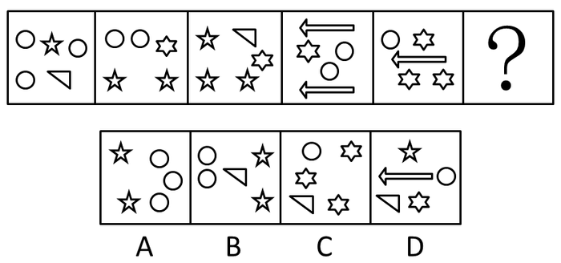
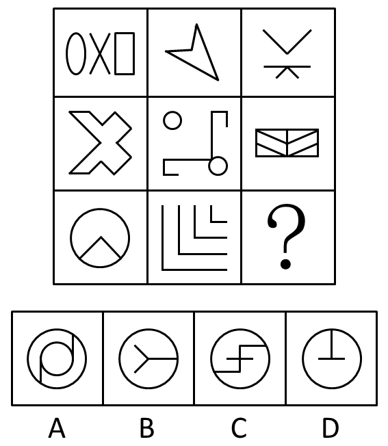
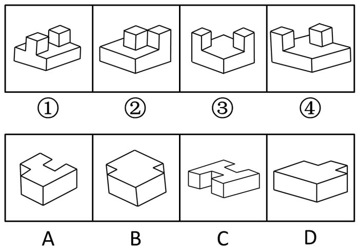

# 2016年国家公务员录用考试《行测》题（副省级）

> 判断推理 · 40 题 · 国考 2016

## 第 1 题　qid 1746882 · 图形推理

从所给四个选项中，选择最合适的一个填入问号处，使之呈现一定规律性：

- **A**. A
- **B**. B　✅
- **C**. C
- **D**. D

**答案**：B

**官方解析**

元素组成凌乱，观察图形发现每个图形均由多种元素组成，考虑元素的种类和个数。观察发现，题干中每幅图均由三种元素构成，B、C两项均满足；继续观察，可发现题干中每幅图中每种元素的个数分别为1、1、3，1、2、2，1、1、3，1、2、2，1、1、3，因此问号处三种元素的个数应分别为1、2、2。B项为1、2、2，C项为1、1、3。
故正确答案为B。

---

## 第 2 题　qid 1746878 · 图形推理

左图是给定的立体图形，将其从任一面剖开，下面哪一项可能是该立体图形的截面？

- **A**. A　✅
- **B**. B
- **C**. C
- **D**. D

**答案**：A

**官方解析**

观察发现，题干图形无论从右侧还是左侧沿竖直方向剖开，均可得到A项中的矩形，而无论从任一面剖开，都得不到B、C、D三项中的图形。
故正确答案为A。

---

## 第 3 题　qid 1746880 · 图形推理

下边给定的是纸盒的外表面，下列哪一项能由它折叠而成？

- **A**. A
- **B**. B
- **C**. C
- **D**. D　✅

**答案**：D

**官方解析**

本题为空间重构题，首先对展开图进行编号，如下图所示：

A项：展开图和选项中均有面e，而面e是可以确定唯一边的（如图中绿线所示）。在展开图和选项的面e上，以唯一边为起始边，沿顺时针同时进行画边，展开图中边2所对的面为面c，选项中边2所对的面不是面c，展开图与选项不一致，排除；

B项：选项中包括面b和面d，而面b和面d为相对面，不能同时出现，展开图与选项不一致，排除；

C项：展开图和选项中均有面e，同样，在展开图和选项的面e上，以唯一边为起始边，沿顺时针同时进行画边，展开图中边2所对的面为面c，选项中边2所对的面不是面c，展开图与选项不一致，排除；

D项：展开图与选项一致，当选。

故正确答案为D。

---

## 第 4 题　qid 1746874 · 图形推理

从所给四个选项中，选择最合适的一个填入问号处，使之呈现一定的规律性：

- **A**. A
- **B**. B　✅
- **C**. C
- **D**. D

**答案**：B

**官方解析**

元素组成凌乱，考虑属性变化。九宫格题先横向找规律，很显然九宫格中第一个图形为轴对称图形，因此先考虑对称性。第一行图形对称轴数量均为一条，方向分别为横、斜、竖，第二行图形对称轴数量也均为一条，方向分别为横、斜、竖，因此第三行图形也应满足此规律。第三行图形对称轴方向分别为竖、斜、？，因此“？”处应选一个对称轴方向为横向的图形。A项为中心对称图形，排除；B项为对称轴方向为横向的轴对称图形，保留；C项为中心对称图形，排除；D项为对称轴方向为竖向的轴对称图形，排除。
故正确答案为B。

---

## 第 5 题　qid 1746876 · 图形推理

①、②、③、④为四个多面体零件，问A、B、C、D四个多面体零件中的哪一个与①、②、③、④中的任一个都不能组成长方体？

- **A**. A
- **B**. B
- **C**. C
- **D**. D　✅

**答案**：D

**官方解析**

此题为立体图形拼接问题，做题原则为凹凸一致。首先多面体①在底面两端的中间上方有两个凸起的正方体，按照原则可知①与C项可以组合成长方体，排除C项；多面体②在右上角有两个凸起的正方体，按照原则查看选项，发现没有能够与多面体②拼合成长方体的选项；多面体③在对角线两端有两个凸起的正方体，按照原则可知多面体③与B项可以组合成长方体，排除B项；多面体④在左下角以及对边中间有两个凸起的正方体，按照原则可知多面体④与A项可以组合成长方体，排除A项。
本题为选非题，故正确答案为D。

---

## 第 6 题　qid 1746844 · 图形推理

把下面的六个图形分为两类，使每一类图形都有各自的共同特征或规律，分类正确的一项是：

- **A**. ①③④，②⑤⑥　✅
- **B**. ①④⑥，②③⑤
- **C**. ①②④，③⑤⑥
- **D**. ①③⑥，②④⑤

**答案**：A

**官方解析**

本题为分组分类题目。在16宫格内，每个图形均由空白圆和黑色圆构成，且发现②⑤⑥图形均为对称图形，且对称轴方向均为竖向，再观察发现①③④图形均关于16宫格的左斜对称轴对称。即①③④一组，②⑤⑥一组。
故正确答案为A。

---

## 第 7 题　qid 1746872 · 图形推理

把下面的六个图形分为两类，使每一类图形都有各自的共同特征或规律，分类正确的一项是：

- **A**. ①②④，③⑤⑥
- **B**. ①②⑤，③④⑥
- **C**. ①③④，②⑤⑥
- **D**. ①③⑥，②④⑤　✅

**答案**：D

**官方解析**

解法一：本题考查数数中的主体元素与其它元素的交点数，逐一分析选项。
观察发现，题干中每幅图中都由一个圆形（可看成主体元素）以及其它元素构成，且主体元素与其它元素之间都存在交点，根据交点的个数可将图形分成两组。其中图①③⑥中交点数均为2，图②④⑤中交点数均为1。
故正确答案为D。
解法二：每幅图均由曲线和直线构成，曲线即圆与直线的交点分别是2、1、2、1、1、2。
故正确答案为D。

---

## 第 8 题　qid 1746858 · 图形推理

把下面的六个图形分为两类，使每一类图形都有各自的共同特征或规律，分类正确的一项是：

- **A**. ①②④，③⑤⑥　✅
- **B**. ①③⑥，②④⑤
- **C**. ①③⑤，②④⑥
- **D**. ①⑤⑥，②③④

**答案**：A

**官方解析**

本题为分组分类题目。
题干中每个图形均由5个元素组成，考虑图形构成关系。
观察发现，①②④图形均有一个外框图形，内部包含4个独立元素，且独立元素间不存在包含等关系，而③⑤⑥图形中外框图形内部包含4个元素，且内部的两个元素又被其中一个元素包含，图形分为内中外三层，存在包含关系。
故正确答案为A。

---

## 第 9 题　qid 1746870 · 图形推理

把下面的六个图形分为两类，使每一类图形都有各自的共同特征或规律，分类正确的一项是：

- **A**. ①④⑥，②③⑤
- **B**. ①③⑤，②④⑥
- **C**. ①②⑤，③④⑥
- **D**. ①②④，③⑤⑥　✅

**答案**：D

**官方解析**

本题为分组分类题目。
元素组成凌乱，且出现了②的单线条直线图形和⑤的典型一笔画图形五角星☆，考虑笔画数。
观察发现，图①②④的奇数点均为2，即①②④图形均为一笔画图形，图③和图⑥的奇数点为4，图⑤为两个一笔画图形，即③⑤⑥图形均为两笔画图形，对应D项。
故正确答案为D。
【易错原因】一看到图形元素组成比较凌乱，做题时就有点懵没有思路，记住凌乱优先看属性类规律，其次数量类，尤其是数量类要尽量找特征图形去看才能快速找到解题突破口。

---

## 第 10 题　qid 1746832 · 图形推理

把下面的六个图形分为两类，使每一类图形都有各自的共同特征或规律，分类正确的一项是：

- **A**. ①④⑥，②③⑤
- **B**. ①③⑤，②④⑥
- **C**. ①②④，③⑤⑥
- **D**. ①②③，④⑤⑥　✅

**答案**：D

**官方解析**

元素组成不同，且无明显属性规律，考虑数量规律。每幅图均由3个元素构成，元素中有直有曲。其中图①②③每个图形都包含2条曲线；图④⑤⑥每个图形都包含1条曲线。
故正确答案为D。
【易错原因】看到字母题，很多同学会去想字母构成单词的意思，其实在国考的图形题当中，我们应当忽略字母的实际意义，把字母当成由线条组成的图形来找规律。

---

## 第 11 题　qid 1746824 · 定义判断

土壤是岩石在风化作用下破碎，物理化学性质改变后形成结构疏松的风化壳，风化壳在气候与生物的作用下，经历很长时间形成的地表物质。与土壤自然形成过程无关的外来物质被称为土壤侵入体。
根据上述定义，下列属于土壤侵入体的是：

- **A**. 戈壁滩中大量的沙砾
- **B**. 河床上存在的大量鹅卵石
- **C**. 考古发掘中挖出的砖瓦　✅
- **D**. 岩缝中生长的野草

**答案**：C

**官方解析**

第一步：找到定义关键词。
“岩石在风化作用下破碎”、“气候与生物的作用下”、“与土壤自然形成过程无关的外来物质”。
第二步：逐一分析选项。
A项：戈壁滩中的沙砾满足“岩石在风化作用下破碎”，是自然过程，不符合定义，排除；
B项：鹅卵石本身是岩石的一种，属于土壤形成过程中的一部分，不符合定义，排除；

C项：考古发掘出的砖瓦显然属于人造物，并非土壤自然形成过程，符合定义，当选；
D项：岩缝中生长的野草满足关键词“气候与生物的作用下”，不符合土壤侵入体定义，排除。
故正确答案为C。

---

## 第 12 题　qid 1746848 · 定义判断

党政机关公文是党政机关实施领导、履行职能、处理公务的具有特定效力和规范体式的文书。其中命令（令）适用于公布行政法规和规章、宣布施行重大强制性措施、批准授予和晋升衔级、嘉奖有关单位和人员。意见适用于对重要问题提出见解和处理办法。批复适用于答复下级机关请示事项。函适用于不相隶属机关之间商洽工作、询问和答复问题、请求批准和答复审批事项。
根据上述定义，下列选项中应添加批复的是：

- **A**. 《国务院办公厅关于进一步加强资本市场中小投资者合法权益保护工作的——》
- **B**. 《国务院办公厅关于黑龙江双鸭山经济开发区升级为国家级经济技术开发区的——》
- **C**. 《国务院关于在我国统―实行法定计量单位的——》
- **D**. 《国务院关于同意设立陕西西咸新区的——》　✅

**答案**：D

**官方解析**

第一步：找到定义关键词。
“答复下级机关请示。”
第二步：逐一分析选项。
A项： 只涉及一个主体国务院办公厅，并没有出现下级，不符合定义，排除；
B项：涉及两个主体，国务院办公厅和黑龙江双鸭山经济开发区，二者不是上下级关系，不符合定义，排除；
C项：只涉及一个主体国务院，并没有出现下级，不符合定义，排除；
D项：涉及两个主体，国务院和陕西西咸新区，二者属于上下级关系，且“同意”二字可以体现出答复下级机关的请示，符合定义，当选。
故正确答案为D。

---

## 第 13 题　qid 1746828 · 定义判断

合成字是合体字中一个比较特殊的门类，它原本是汉语中一个常用的词语、词组，但由于这些词语、词组在方言中使用的频率很高，就把这些词语在讲究字形美观的前提下原封不动地组合成了一个独有的汉字。
根据上述定义，下列汉字根据其意思不属于合成字的是：

- **A**. 氼，读作nì，古同“溺”，沉没，沉溺　✅
- **B**. 嘦，读作jiào，方言，“只要”的意思
- **C**. 覅，读作fiào，表示否定，相当于“不要”
- **D**. 尠，读作xiǎn，意思是稀有的、罕见的

**答案**：A

**官方解析**

第一步：找到定义关键词。
“原本是汉语中一个常用词语、词组”，“在方言中使用的频率很高”、“原封不动地组合成了一个独有的汉字”。
第二步：逐一分析选项。
A项：“氼”在古语中同“溺”，是一个字而不是词语，不满足“原本是汉语中一个常用词语、词组”，不符合定义，当选；
B项：“嘦”原本是“只要”这一常用词语，用于方言，且原封不动地组合起来，满足题干中三个关键词，符合定义，排除；
C项：“覅”相当于“不要”，是一个词语，且分拆后是“勿要”，符合定义，排除；
D项：“尠”分拆后是“甚少”，原本是一个词语，符合定义，排除。
本题为非选题，故正确答案为A。

---

## 第 14 题　qid 1746836 · 定义判断

真理是指客观事物及其规律在人的意识中的正确反映。真理可以分为理性真理和事实真理两种。理性真理指的是具有普遍性和必然性的真理，其反面是不可能的；事实真理指的是具有偶然性的真理，其反面是可能的。
根据上述定义，下列属于理性真理的是：

- **A**. 月晕而风，础润而雨
- **B**. 如果a大于b且b大于c，那么a大于c　✅
- **C**. 恩惠要一点点地施舍才具有最大效益
- **D**. 一个人如果违反了法律，就一定会受到法律的制裁

**答案**：B

**官方解析**

第一步：找到“理性真理”定义的关键词。
“具有普遍性和必然性的真理”、“其反面是不可能的”。
第二步：逐一分析选项。
A项：“月晕而风，础润而雨”意为“月晕出现，将要刮风；础石湿润，就要下雨”，不具有普遍性和必然性，有时候月晕没风，也有时础润无雨，其反面是可能的，不符合定义，排除；
B项：用符号表示为a&gt;b&gt;c，显然a&gt;c，具有普遍性和必然性，反面不可能为真，符合定义，当选；
C项：其反面为“恩惠不一点点施舍也能具有最大效益”，也可以为真，不符合“其反面是不可能的”，排除；
D项：其反面为“一个人如果违反了法律，可能不会受到法律制裁”，也可以为真，不符合定义，排除。
故正确答案为B。

---

## 第 15 题　qid 1746856 · 定义判断

直观教学是指利用教具作为感官传递物，向学生展示相关内容，以达到提高学习效率或效果的一种教学方式。直观教学包括实物直观、模象直观和言语直观。实物直观通过直接感知实际事物而进行；模象直观通过对实物的模拟性形象来直接感知；言语直观是在形象化的语言作用下，通过学生对语言的物质形式（语音、字形）的感知及对语义的理解而进行的一种直观形式。
根据上述定义,下列不属于上述三种直观教学的是：

- **A**. 请学生在课后阅读整篇小说内容并撰写读后感　✅
- **B**. 暑期带着学生去工厂和农村进行实地参观访问
- **C**. 请学生分角色朗读戏剧作品，或通过上台表演来体会人物性格
- **D**. 在艺术鉴赏课上，使用幻灯片给学生展示西方油画的经典之作

**答案**：A

**官方解析**

第一步：找出定义关键词。
实物直观：“直接感知实际事物。”
模象直观：“对实物的模拟性形象来直接感知。”
言语直观：“形象化的语言作用下，通过学生对语言的物质形式（语音、字形）的感知及对语义的理解。”
第二步：逐一分析选项。
A项：课后阅读整篇小说并撰写读后感并未涉及到上述三者，阅读小说写读后感不属于直接感知实际事物，且不属于模拟性形象和学生接收言语直观的理解，不符合定义，当选。
B项：去工厂和农村实地参观访问属于直接感知实际事物，属于实物直观，符合定义，排除。
C项：分角色朗读戏剧作品，通过上台表演体会人物性格属于对语言物质形式的感知，属于言语直观，符合定义，排除。
D项：用幻灯片展示西方油画，属于通过对油画的幻灯片形式而不是直接感知油画本身，即对实物的模拟性形象来直接感知，属于模象直观，符合定义，排除。
本题为选非题，故正确答案为A。

---

## 第 16 题　qid 1746852 · 定义判断

负启动效应是指人们由于之前受到某一刺激的影响而使之后对同一类型刺激的知觉加工过程变得困难的心理现象。其中知觉加工过程是指外界事物作用于人的感官后，头脑中产生的对事物的认识和理解的过程。
根据上述定义,下列属于负启动效应的是：

- **A**. 先给被试人员呈现一组汉字，里面有“海”这个字，随后让他们写出部首是“氵”的字时，这些人写出“海”的几率并未增大
- **B**. 先在黑板上给一组被试人员呈现词语“桌子”，后播放语音“椅子”，一段时间后，请被试人员分别说出看到和听到的词语，发现很多人答错了
- **C**. 请被试人员回答屏幕中显示的词语的颜色，先向其呈现词语“绿色”（字体为红色），再呈现词语“蓝色”（字体为绿色），发现被试人员辨识颜色变得困难　✅
- **D**. 给被试人员呈现一张未完成的画，随着画越来越完整，被试人员逐渐辨认出画的内容，过一段时间后再给他们呈现这个未完成的画，他们会更早辨认出画的内容

**答案**：C

**官方解析**

第一步：找到定义关键词。
关键词为“由于之前受到某一刺激的影响而使之后对同一类型刺激的知觉加工过程变得困难的心理现象”。
第二步：逐一分析选项。
A项：先给被试者呈现“海”字，随后让他们写部首是“氵”的字，一个是呈现，一个是写字，不属于同一类型的刺激，不符合定义，排除；
B项：先给被试人员呈现词语“桌子”、后播放语音“椅子”，一个是视觉刺激，一个是听觉刺激，这属于两种刺激，而定义强调了之后是同一类型的刺激，不符合定义，排除；
C项：先向被试者呈现词语“绿色”（字体为红色），后向其呈现词语“蓝色”（字体为绿色），二者属于同一类型的刺激，且出现的结果是辨识颜色变得困难，符合知觉加工过程变得困难这一结果，符合定义，当选；
D项：前后刺激虽属于同一刺激，但是结果是能够更早辨认出画的内容，没有使过程变得困难，不符合定义，排除。
故正确答案为C。

---

## 第 17 题　qid 1746840 · 定义判断

数字鸿沟指的是由于信息化和互联网的影响，人们的信息获取、信息处理和信息传播都是通过数字化技术来实现的，由此造成了不同个体、群体或者国家在思想意识、经济、文化和政治等方面的差距越来越大。
根据上述定义，下列不涉及数字鸿沟的是：

- **A**. 放假回家的小宋和同学用手机聊天，满口网络新词，一旁的奶奶―句也听不懂
- **B**. 小赵整天痴迷于网络游戏，父母多次苦口婆心地劝说，均没有效果，为此小赵和父母发生了多次争执　✅
- **C**. 东部某镇种植的水果尚未成熟就已经通过网络平台被订购一空，而西部某乡质优价廉的水果由于无人知晓只能烂在树上
- **D**. 一些西方国家利用其技术积累，在大数据处理方面取得了绝对的优势，他们进一步实行技术封锁，使得某些国家在大数据分享方面一筹莫展

**答案**：B

**官方解析**

第一步：找到定义关键词。
关键词为“由于信息化和互联网的影响，信息的获取、处理和传播通过数字化技术实现，导致差距变大。”
第二步：逐一分析选项。
A项：小宋和同学通过手机聊天、运用网络新词是一种受互联网影响的表现，且同学之间的信息传播是通过数字化技术实现的，奶奶没有接触互联网，听不懂正是表现了不同个体之间思想意识的差距，符合定义，排除；
B项：小赵痴迷于网络游戏，虽与互联网有关但是并没有涉及到信息的获取、处理和传播，且其父母与其争执是出于关心孩子的成长，并不能表明二者之间的差距越来越大，不符合定义，当选；
C项：东部和西部水果销售的现象反映了二者在经济上差距，且造成此现象的原因正是由于东部使用了网络平台，实现了信息的有效获取，符合定义，排除；
D项：西方国家利用大数据方面的优势实行技术封锁，使某些国家在此方面一筹莫展，体现了国家之间差距，而造成此差距是由于大数据这种信息数字化技术导致的，符合定义，排除。
本题为选非题，故正确答案为B。

---

## 第 18 题　qid 1746862 · 定义判断

叶龄指数指的是禾谷类作物主茎已出叶数与最终总叶数的比值，是衡量作物生长进程的重要指标之一。
根据上述定义，下列关于叶龄指数的说法一定正确的是：

- **A**. 稻谷的叶龄指数与其生长进程成正比
- **B**. 荞麦的叶龄指数越大则其产量也越高
- **C**. 小麦的叶龄指数最大值为100%　✅
- **D**. 玉米的平均叶龄指数大于高粱

**答案**：C

**官方解析**

第一步，提取定义关键词。
关键词为“禾谷类作物”、“主茎已出叶数与最终总叶数的比值”。
第二步，逐一分析选项。
A项：稻谷的生长进程和稻谷的叶龄指数成正比，还会受到其他因素的影响，但从文中的定义无法进行判断，排除；
B项：叶龄指数与产量的关系在题干中并未提及，为无中生有，排除；
C项：小麦属于“禾谷类”，根据定义“主茎已出叶数与最终总叶数的比值”，小麦最终会长出所有叶子，最终比值为1，故其叶龄指数最大为100%，当选；
D项：题干信息有限，并未告知玉米和高粱的叶龄指数之间的大小关系，为不明确选项，排除。
故正确答案为C。

---

## 第 19 题　qid 1746864 · 定义判断

图灵测试是测试者在与被测试者（一个人和―台机器）隔开的情况下，通过一些装置（如键盘）向被测试者随意提问。问过一些问题后，如果被测试者有超过30%的答复不能使测试者确认出哪个是人、哪个是机器，那么这台机器就通过了测试，并被认为具有人类智能。
据上述定义，以下哪项中的测试一定通过了图灵测试？

- **A**. 
对机器甲的答复所有人都确认其为机器

- **B**. 
对机器乙的答复测试者能确认其为机器或人
　✅
- **C**. 
对机器丙的答复有90%的某小区居民确认其为机器

- **D**. 
对机器丁的答复只有10%的某校大学生不能确认其为机器

**答案**：B

**官方解析**

第一步：找到题干关键词。

关键词为“被测试者有超过的答复不能使测试者确认出哪个是人、哪个是机器，那么这台机器就通过了测试”。

第二步：逐个分析选项。

A项：的答复可以确定为机器，剩下的的答复不知道是能确定为人的还是不能确定其为机器或人的，因此不一定能够通过测试，排除；

B项：的答复可以确定其为机器或人，那么的答复是不能够确定其为机器或人的，因此一定可以通过图灵测试，当选；

C项：的答复可以确定为机器，剩下的的答复不知道是能确定为人的还是不能确定其为机器或人的，因此不一定能够通过测试，排除；

D项：的答复只有的某校大学生不能确定为机器，即的答复有的某校大学生能确定为机器，与C项表达很类似，那么剩下的的答复不知道是能确定为人的还是不能确定其为机器或人的，因此不一定能够通过测试，排除。

故正确答案为B。

---

## 第 20 题　qid 1746868 · 定义判断

产品责任是指产品有缺陷，存在可能危及人身、财产安全的危险，造成产品的消费者、使用者或者其他第三者人身或其他直接财产损失后，缺陷产品的生产者、销售者应当承担的特殊的侵权法律责任。
根据上述定义，下列受害人可因产品责任要求侵权损害赔偿的是：

- **A**. 甲购买了一辆新车，一次与朋友王某驾车外出时，汽车因电路质量问题发生自燃，致使王某被烧伤　✅
- **B**. 乙购买了一件大衣，大衣上没有洗涤标志和成分说明，营业员也未告知应如何洗涤，大衣水洗后严重缩水
- **C**. 丙购买了一部新手机，一次因质量问题自动关机，无法开启，致使丙漏接了客户的电话，损失了一笔大额订单
- **D**. 丁的电视机使用了20年，图像不清晰时拍几下就好了，一次丁在拍打电视机时，电视机发生爆炸，将丁炸伤，后经检验发现是显像管老化造成的

**答案**：A

**官方解析**

第一步：找到定义关键词。
主体：有缺陷的产品。
原因：存在危及人身、财产安全的危险。
结果：产品的消费者、使用者或其他第三者人身或其他直接财产损失。
第二步：逐一分析选项。
A项，新车且电路质量问题，说明产品有缺陷，王某被烧伤属于第三者人身损失，因此完全符合题干关键词，可以要求赔偿，当选；
B项，这个大衣没有成分标志和洗涤说明，那么确实是有缺陷的产品，但洗后严重缩水，并不代表是其他直接的财产损失，不符合定义，排除；
C项，新手机质量问题自动关机，说明产品质量有问题，但是漏接电话造成订单损失，这不属于直接的财产损失，而是间接的，排除；
D项，使用20年，显像管老化，这不属于产品有缺陷，排除。
故正确答案为A。

---

## 第 21 题　qid 1746670 · 类比推理

佩刀：刀鞘

- **A**. 墨：墨盒
- **B**. 火箭：发射架
- **C**. 毛笔：笔帽　✅
- **D**. 旅游鞋：旅行包

**答案**：C

**官方解析**

第一步：判断题干词语间的逻辑关系。
“佩刀”和“刀鞘”是对应关系，“刀鞘”套着“佩刀”的一部分，“佩刀”与“刀鞘”配套存在。
第二步：判断选项词语间逻辑关系。
A项：“墨”用来写字，“墨盒”是装墨水或墨粉的盒子，二者需要配套使用，但是“刀鞘”只是套着“佩刀”的一部分，而“墨”是完全装在打印机的“墨盒”里的，与题干逻辑关系不一致，排除；
B项：“火箭”与“发射架”虽然配套存在，但是“发射架”是支撑“火箭”，而非套着“火箭”，与题干逻辑关系不一致，排除；
C项：“毛笔”和“笔帽”配套存在，且“笔帽”套着“毛笔”的一部分，与题干逻辑关系一致，当选；
D项：“旅游鞋”和“旅行包”不能配套，与题干逻辑关系不一致，排除。
故正确答案为C。

---

## 第 22 题　qid 1746676 · 类比推理

琴棋书画：经史子集

- **A**. 兵强马壮：闭关自守
- **B**. 悲欢离合：漂泊流浪
- **C**. 衣帽鞋袜：冰清玉洁
- **D**. 鸟兽虫鱼：江河湖海　✅

**答案**：D

**官方解析**

第一步：分析题干词语间的逻辑关系。
“琴棋书画”和“经史子集”都是名词，且每个词都可拆分为四个并列关系的名词。
第二步：分析选项词语间的逻辑关系。
A选项：“兵强马壮”中的“强”、“壮”都是形容词，“闭关自守”中的“闭”、“守”都是动词，与题干逻辑关系不符合，排除；
B选项：“悲欢离合”中的“离合”是动词，且“漂泊流浪”是动词，与题干逻辑关系不符，排除；
C选项：“衣帽鞋袜”可拆分为四个名词，但“冰清玉洁”是形容词，与题干逻辑关系不符，排除；
D选项：“鸟兽虫鱼”和“江河湖海”都是名词，且四个字之间是并列关系的名词，当选。
故正确答案为D。

---

## 第 23 题　qid 1746662 · 类比推理

森林：郁郁葱葱

- **A**. 法庭：庄严肃穆　✅
- **B**. 校园：勤奋好学
- **C**. 餐桌：饕餮大餐
- **D**. 公园：嬉戏玩闹

**答案**：A

**官方解析**

第一步：分析题干词语间的逻辑关系。
“郁郁葱葱”形容草木苍翠茂盛，生机勃勃的样子，可以用来形容森林；逻辑关系即后者可以形容前者，第一个词是名词，第二个词是形容词。
第二步：逐一分析选项。
A项：“庄严肃穆”可以用来形容“法庭”，与题干逻辑关系相符，当选；
B项：“勤奋好学”形容的是学生而不是“校园”，与题干逻辑关系不符，排除；
C项：“饕餮大餐”是名词非形容词，自然无法形容“餐桌”，排除；
D项：“嬉戏玩闹”是动词，且应该是游人嬉戏玩闹，无法形容“公园”，排除。
故正确答案为A。

---

## 第 24 题　qid 1746658 · 类比推理

白驹过隙：秒表

- **A**. 恩重如山：天平
- **B**. 一线希望：皮尺
- **C**. 一言九鼎：弹簧秤
- **D**. 风驰电掣：测速仪　✅

**答案**：D

**官方解析**

第一步：分析题干词语间的逻辑关系。
“白驹过隙”形容时间过得很快，而秒表可以测量时间，逻辑关系即后者可以测量前者用来形容的主体。
第二步：逐一分析分析选项词语间的逻辑关系。
A项：“恩重如山”形容恩德重大，而“天平”不能称量恩德，与题干逻辑关系不一致，排除；
B项：“一线希望”形容还有一点微弱的希望，“皮尺”不能测量希望，与题干逻辑关系不一致，排除；
C项：“一言九鼎”形容言语极有分量，能起决定性作用，“弹簧秤”不能测量言语的分量，与题干逻辑关系不一致，排除；
D项：“风驰电掣”形容速度非常快，像风吹电闪一样，“测速仪”可以测量速度，二者逻辑关系与题干一致，当选。
故正确答案为D。

---

## 第 25 题　qid 1746698 · 类比推理

素描：单色：绘画

- **A**. 色素：食品：添加剂
- **B**. 书签：阅读：工具
- **C**. 变脸：表演：艺术
- **D**. 新闻：纪实：文体　✅

**答案**：D

**官方解析**

第一步：分析题干词语间的逻辑关系。
素描的属性是单色，而且素描是一种绘画，即前两词为属性关系，一词与三词为种属关系。
第二步：逐一分析选项。
A项，色素的属性不是食品，但它是一种食品添加剂，与题干逻辑关系不一致，排除；
B项，书签的属性不是阅读，但它是一种阅读工具，与题干逻辑关系不一致，排除；
C项，变脸是一种表演也是一种艺术，不能说表演是变脸的属性，与题干逻辑关系不一致，排除；
D项，新闻的属性就是纪实，而且新闻也是一种文体，为种属关系，与题干切合，当选。
故正确答案为D。

---

## 第 26 题　qid 1746696 · 类比推理

前瞻：预见：回溯

- **A**. 深谋远虑：未雨绸缪：鼠目寸光
- **B**. 标新立异：特立独行：循规蹈矩　✅
- **C**. 犬牙交错：参差不齐：顺理成章
- **D**. 墨守成规：井然有序：纷乱如麻

**答案**：B

**官方解析**

第一步：判断题干词语间逻辑关系。
“前瞻”与“预见”都是指根据自身经验和知识积累，对未来做出的一定预判，二者为近义词；“回溯”是指回忆过去，与前两词为反义词。
第二步：判断选项词语间逻辑关系。
A项：“深谋远虑”形容计划周密、考虑长远；“未雨绸缪”形容提前做好准备工作，也有为将来打算的含义。二者为近义词。“鼠目寸光”形容一个人眼光短、见识浅，只看眼前，不管将来，与前两词为反义词。与题干逻辑关系一致，保留。
B项：“标新立异”指提出新的主张、见解或创造出新奇的样式，也指为显示自己，表现与众不同；“特立独行”指有操守、有见识，不随波逐流。二者为近义词。“循规蹈矩”原指遵守规矩，不敢违反，现也指拘守旧准则，不敢稍做变动，与前两词为反义词。与题干逻辑关系一致，保留。
C项：“犬牙交错”形容交界处参差不齐，像狗牙一样，也形容局面错综复杂；“参差不齐”形容很不整齐，高低不一。二者为近义词。“顺理成章”指写文章或做事情顺着条理就能做好，也指某种情况合乎情理，自然产生某种结果，与前两词不是反义词。与题干逻辑关系不一致，排除。
D项：“墨守成规”形容因循守旧，不肯改进；“井然有序”形容做事有序，有条不紊。二者不是近义词。“纷乱如麻”指交错杂乱，像一团乱麻，一般形容心情，与前两词不是反义词。与题干逻辑关系不一致，排除。
比较A、B两项，A项前两个词语为中性词，但“鼠目寸光”明显是贬义词，B项三个词语都是中性词，而题干三个词语也都是中性词，B项感情色彩与题干更一致，当选。
故正确答案为B。

---

## 第 27 题　qid 1746686 · 类比推理

教：学：教学

- **A**. 买：卖：买卖　✅
- **B**. 好：坏：好坏
- **C**. 正：大：正大
- **D**. 阴：暗：阴暗

**答案**：A

**官方解析**

第一步：分析题干词语间的逻辑关系。
“教”和“学”都是动词，且二者是一种反对关系，主体不同，一教一学，二者组合而成的“教学”既能做动词，又能做名词。
第二步：逐一分析选项词语间的逻辑关系。
A项：“买”“卖”都是动词，且二者是一种反对关系，主体不同，一买一卖，“买卖”既能做动词，如“买卖股票”，又能做名词，如“一笔买卖”，与题干逻辑关系相符，当选；
B项：“好”“坏”都是形容词，与题干逻辑关系不符，排除；
C项：“正”“大”都是形容词，但“正大”一般不单独成词，与题干逻辑关系不符，排除；
D项：“阴”“暗”都是形容词，且是近义词，不符合题干逻辑关系，排除。
故正确答案为A。

---

## 第 28 题　qid 1746710 · 类比推理

自然科学：化学：化学元素

- **A**. 人文科学：历史学：历史人物　✅
- **B**. 物理学：生物物理学：光合作用
- **C**. 语言学：汉语言：文学
- **D**. 社会学：社会科学：社区

**答案**：A

**官方解析**

第一步：分析题干词语的逻辑关系。
化学是一种自然科学，自然科学与化学是种属关系；化学元素是化学研究的对象。
第二步：分析选项词语间的逻辑关系。
A项，历史学是一种人文科学，历史人物是历史学研究的基本对象，与题干逻辑关系一致，当选；
B项，生物物理学是物理学和生物学的交叉学科，与物理学不构成种属关系，同时光合作用也不是生物物理学研究的对象，与题干逻辑关系不符，排除；
C项：汉语言是一种语言学，为种属关系，文学与语言学是并列关系，不是汉语言研究的对象，与题干逻辑关系不符，排除；
D项：社会学是社会科学的一种，二者是种属关系，与题干的顺序相反，与题干逻辑关系不符，排除；
故正确答案为A。

---

## 第 29 题　qid 1746730 · 类比推理

历练 对于 （    ） 相当于 磨砺 对于 （    ）

- **A**. 栉风沐雨；千锤百炼　✅
- **B**. 波澜不惊；一鸣惊人
- **C**. 处心积虑；百折不回
- **D**. 千辛万苦；九死一生

**答案**：A

**官方解析**

逐一代入验证选项。
A项：“栉风沐雨”形容人经常在外面不顾风雨地辛苦奔波，象征对一个人的“历练”。“千锤百炼”比喻经历多次艰苦斗争的锻炼和考验，象征对一个人的“磨砺”，与题干词语逻辑关系一致，当选；
B项：“波澜不惊”比喻局面平静，形势平稳，与“历练”无关系，且“一鸣惊人”与“磨砺”更是无任何逻辑关系，排除；
C项：“处心积虑”形容一个人蓄谋很久，思考时间长，与“历练”无逻辑关系。“百折不回”指无论受多少挫折都不退缩，形容意志坚强，与“磨砺”无逻辑关系，排除；
D项：“千辛万苦”形容非常不容易，很辛苦，可以看作是一种“历练”。“九死一生”形容情况很危险，与“磨砺”无逻辑关系，排除。
故正确答案为A。

---

## 第 30 题　qid 1746722 · 类比推理

重力  对于  （  ）  相当于  （  ）  对于  昼夜交替

- **A**. 物体质量；月圆月缺
- **B**. 潮汐；地球公转
- **C**. 地球；月球
- **D**. 自由落体；地球自转　✅

**答案**：D

**官方解析**

逐一代入选项。
A项：“物体质量”是产生“重力”的必要条件，“昼夜交替”不是“月圆月缺”的必要条件，“昼夜交替”是地球自转导致的，前后逻辑关系不一致，排除；
B项：“潮汐”是由于太阳和月球共同作用导致的，“昼夜交替”是地球自转导致的，前后逻辑关系不一致，排除；
C项：“重力”产生是由于“地球”的吸引作用，两者具有因果关系，昼夜交替一般指的是地球上的现象，而非月球，前后逻辑关系不一致，排除；
D项：“重力”是引起物体“自由落体”的原因，“地球自转”也是引起“昼夜交替”的原因，前后逻辑关系一致，当选。
故正确答案为D。

---

## 第 31 题　qid 1746826 · 逻辑判断

人类与疟疾已经进行了几个世纪的斗争，但一直是“治标不治本”——无法阻断疟疾传染源。日前研究者培育出一种经过基因改造的蚊子，它具备了不再感染疟疾的能力，并且能妨碍野生蚊子繁衍，从而有效切断人与蚊子的疟疾传播途径，假以时日，就能根绝疟疾这个顽症。
以下哪项如果为真，最能支持上述结论？

- **A**. 转基因蚊子的体质比野生蚊子差，一旦被放到野外很容易死亡
- **B**. 转基因蚊子只在疟疾存在时才有生存优势，当生存环境中没有疟疾时，它们和野生蚊子的存活率是相同的
- **C**. 转基因蚊子的生殖能力在繁衍了9代后显著增加，可能带来野生蚊子种群的灭亡　✅
- **D**. 转基因蚊子与野生蚊子交配产下的后代并不都具有抗疟疾基因，但在基因层面上都会产生突变，形成新型蚊子

**答案**：C

**官方解析**

本题属于加强题型。
第一步：找到论点论据。
论点：转基因蚊子的出现，最终可以终结疟疾。
论据：这种蚊子不感染疟疾，并且妨碍野生蚊子繁衍。
A选项：说转基因蚊子不好存活，说明根绝疟疾这件事情是不现实的，有削弱的意思，排除；
B选项：说转基因蚊子存活有条件，同样是在为根绝疟疾设置障碍，有削弱的意思，排除；
C选项：说转基因蚊子9代后带来野生蚊子灭亡，支持结论，当选； 
D选项：说后代不都能抗疟疾的基因，依然是为根绝设置障碍，有削弱的意思，排除。
故正确答案为C。

---

## 第 32 题　qid 1746838 · 逻辑判断

格陵兰岛是地球上最大的岛屿，形成于38亿年前，大部分地区被冰雪覆盖。有大量远古的岩石化石埋藏在格陵兰岛地下，它们的排列就像是一个整齐的堤坝，也被称为蛇纹石。通过这些蛇纹石，人们可以断定格陵兰岛在远古时可能是一块海底大陆。
补充以下哪项作为前提可以得出上述结论？

- **A**. 蛇纹石是两个大陆板块在运动中相互碰撞时挤压海底大陆而形成的一种岩石　✅
- **B**. 这些蛇纹石化石的年代和特征与伊苏亚地区发现的一致，而后者曾是一片海底大陆
- **C**. 蛇纹石中碳的形状呈现出生物组织特有的管状和洋葱型结构，类似于早期的海洋微生物
- **D**. 由于大陆板块的运动才创造出了许多新的大陆，在板块运动发生之前，地球上绝大部分地区是一片汪洋大海

**答案**：A

**官方解析**

本题属于加强题型。
第一步：找到论点论据。
论点：格陵兰岛在远古时可能是一块海底大陆。
论据：大量远古的岩石化石埋藏在格陵兰岛地下，被称为蛇纹石。
第二步：逐个分析选项。
A项，蛇纹石是两个大陆板块挤压海底大陆所形成的一种岩石，在蛇纹石和海底大陆之间建立了联系，说明这原来就是海底大陆，当选；
B项，年代和特征一致，但后者是海底大陆但是不代表前者的蛇纹石一定是海底大陆，排除；
C项，蛇纹石中的生物组织类似于早期海洋微生物不能证明一定就是海洋微生物，排除；
D项，没有提到蛇纹石的事，更不能证明这就是一个海底大陆，排除。
故正确答案为A。

---

## 第 33 题　qid 1746834 · 逻辑判断

近来，国外一些学者和媒体对西方民主体制较为集中地进行了反思和批评，指出西方民主正在衰败。对此，有学者认为，西方民主衰败的原因之一是其存在基因缺陷。西方民主是建立在一个假设前提的基础上的，即权利是绝对的。也就是说，权利与义务本应是相对的，但在西方民主模式中，权利绝对化已成为主流，各种权利绝对化，个人主义至上，社会责任缺乏。
以下哪项如果为真，最能支持学者的观点？

- **A**. 西方民主制对权利绝对化的偏好，导致对他人权利与生存环境的忽视　✅
- **B**. 权利是有限度的，超越了权利的限度，就可能走向权利滥用
- **C**. 美国两党常把自己的权利放在国家利益之上，互相否决，危害国家和公民的利益
- **D**. “程序万能”理论导致了西方民主制度的游戏化，民主被简化为竞选程序

**答案**：A

**官方解析**

第一步：找到论点和论据。
论点：西方民主衰败的原因之一是其存在基因缺陷，即权利是绝对的。
论据：权利与义务本应是相对的，但在西方民主模式中，权利绝对化已成为主流，各种权利绝对化，个人主义至上，社会责任缺乏。
题干整个讨论的都是“西方民主衰败的原因”，论据和论点话题一致，所以优先考虑补充论据加强。
第二步：逐一分析选项。
A项：指出西方的权利绝对化会导致对他人权利和生存环境的忽视，说明是西方民主制度的基因缺陷（即权利绝对化）导致了个人主义至上、社会责任缺乏，进而导致了西方民主的衰败，解释了原因，补充论据加强，保留；
B项：权利是有限度的，权利存在界限，但并未说明权利滥用是否会导致西方民主衰败，无关选项，排除；
C项：美国两党把自己的权利放在国家利益之上，体现了个人主义至上，危害国家和公民的利益，体现了社会责任缺乏，通过列举美国两党的例子，说明是西方民主制度的基因缺陷（即权利绝对化）导致了西方民主的衰败，补充论据加强，保留；
D项：“程序万能”理论导致的最终结果是民主被简化为竞选程序，但并未言明是否导致西方民主衰败，无关选项，排除。
比较A、C两项，解释的力度强于举例，所以排除C项。
故正确答案为A。

---

## 第 34 题　qid 1746830 · 逻辑判断

研究人员在观察开普勒太空望远镜发现的数千颗太阳系外行星后，发现银河系内拥有大量的行星，几乎每一颗恒星周围都存在行星，许多恒星系统内存在两至六颗行星，其中约三分之一的行星处于宜居带上，行星表面的温度适合液态水存在，这可能意味着银河系内几乎处处有宜居的星球。
以下哪项如果为真，最能支持上述结论？

- **A**. 只要存在水资源，就有生命存在的可能性，但不一定能完成进化
- **B**. 许多宜居带行星与恒星之间的距离小于地球和太阳的间距，恒星释放的耀斑可能扼杀生命
- **C**. “恒星系统内存在两至六颗行星”这一结论是根据200多年前的提丢斯—波得定则推算而出，非实测结果
- **D**. 银河系内2000～4000亿颗恒星中80％是红矮星，超过一半的红矮星周围环绕的行星与地球类似，并存在水和大气层　✅

**答案**：D

**官方解析**

第一步：找到论据和论点。
论点：这可能意味着银河系内几乎处处有宜居的星球。
论据：许多恒星系统内存在两至六颗行星，其中约三分之一的行星处于宜居带上，行星表面的温度适合液态水存在。
第二步：逐一分析选项。

A项：选项论述生命存在，题干论述宜居星球存在，二者论述对象不一致，排除；
B项：说明宜居带存在可能扼杀生命的因素存在——恒星释放的耀斑，即宜居带存在宜居星球的可能性降低，削弱了题干论点，排除；
C项：质疑了题干论据的真实性，即“恒星系统内存在两至六颗行星”为推算结果，需要实际测量的考证，在推算结果的基础上进一步推断的论点（银河系内几乎处处有宜居的星球）缺乏真实性的支撑，削弱了题干论点，排除；
D项：银河系内存在大量的红矮星，且红矮星的存在环境和地球类似，并存在水和大气层，类比论证说明银河系可能存在宜居的星球，可以加强，当选。
故正确答案为D。

---

## 第 35 题　qid 1746842 · 逻辑判断

记者采访时的提问要具体、简洁明了，切忌空泛、笼统、不着边际。《采访技巧》一书中尖锐地剖析了“您感觉如何”等问题的弊端，认为这些提问实际上在信息获取上等于原地踏步，它使采访对象没法回答，除非用含混不清或枯燥无味的话来应付。
由此可以推出：

- **A**. 记者采访时的提问如果具体、简洁明了，就不会给采访对象带来回答的困难
- **B**. 采访对象如果没法回答提问，说明他没有用含混不清或枯燥无味的话来应付
- **C**. 采访对象只有用含混不清或枯燥无味的话来应付，才能回答“您感觉如何”等问题的提问　✅
- **D**. 诸如“您感觉如何”这样的问题，只能使采访对象抓不住问题的要点而作泛泛的或言不由衷的回答

**答案**：C

**官方解析**

本题属于关联词推导题型。

第一步：翻译题干。

除非这个关联词可翻译为否11的方式，题干最后一句话翻译为：

没法回答含混不清或枯燥无味的话来应付，即：回答含混不清或枯燥无味

第二步：逐一分析选项。

A项：记者采访时的提问如果具体、简洁明了是否能给采访对象带来回答的困难，原文当中完全没有提到过，属于无中生有的选项，排除；

B项：可翻译为：没法回答没有（含混不清或枯燥无味），否前否后，与题干的翻译形式不一致，排除；

C项：可翻译为：回答含糊不清或枯燥无味，与题干翻译形式一致，当选；

D项：选项中说因为采访对象抓不住问题的要点而作泛泛的或言不由衷的回答，题干说的含混不清或枯燥无味不等同于泛泛或言不由衷，属于概念的偷换，并且这么回答的原因是什么题干也没有提到，排除。

故正确答案为C。

---

## 第 36 题　qid 1746850 · 逻辑判断

某大型晚会的导演组在对节目进行终审时，有六个节目尚未确定是否通过，这六个节目分别是歌曲A、歌曲B、相声C、相声D、舞蹈E和魔术F。综合考虑各种因素，导演组确定了如下方案：
（1）歌曲A和歌曲B至少要上一个；
（2）如果相声C不能通过或相声D不能通过，则歌曲A也不能通过； 
（3）如果相声C不能通过，那么魔术F也不能通过；
（4）只有舞蹈E通过，歌曲B才能通过。
导演组最终确定舞蹈E不能通过。
由此可以推出：

- **A**. 无法确定魔术F是否能通过　✅
- **B**. 歌曲A不能通过
- **C**. 无法确定两个相声节目是否能通过
- **D**. 歌曲B能通过

**答案**：A

**官方解析**

本题属于关联词推导题型。

第一步翻译题干。

（1）A或者B；

（2）非C或者非D非A；

（3）非C非F；

（4）BE。

第二步找突破口，进行解题。

题干最后说，导演组确定舞蹈E不能通过，从这个条件进行入手，找到与之相关条件：

由条件（4）逆否可得：E推出B，即B不能上；

由条件（1）“A、B至少有一个要上”可知：B不能上，那么A一定能上；

对条件（2）逆否可知：AC且D，即：A、C、D都上；

C能上对于条件（3）来说是否前，因此，无法确定F是否能上；综上可知：A、C、D都能上，但B、E不能上，F能不能上不知道。

第三步看选项。

A项：无法确定F能否通过，对应上面推出结论，为正确答案；

B、C、D三项均与上述推出的结论不一致，排除。

故正确答案为A。

---

## 第 37 题　qid 1746846 · 逻辑判断

9月初大学入学报到时，有多家手机运营商到某大学校园进行产品销售宣传。有好几家运营商推出了免费套餐服务。但是其中一家运营商推出了价格优惠的套餐，同时其业务员向学生宣传说：其他运营商所谓的“免费”套餐是通过出售消费者的身份信息来获得运营费用的。
以下哪项如果为真，最能质疑该业务员的宣传？

- **A**. 免费套餐运营商所提供的手机信号质量很差
- **B**. 免费套餐运营商是通过广告来获得运营费用的　✅
- **C**. 有法律明确规定，手机运营商不得出售消费者的身份信息
- **D**. 很难保证价格优惠的运营商不会同样出售消费者的身份信息

**答案**：B

**官方解析**

第一步：找到论点和论据。
论点：其他运营商所谓的“免费”套餐是通过出售消费者的身份信息来获得运营费用的。
论据：无。
第二步：逐一分析选项。
A项：信号差不差跟题干的论点没关系，论点说的是运营费用的来源问题，排除；
B项：直接说明运营费用来自广告的收入，而不是通过出售消费者身份信息获取的，当选；
C项：虽然有法律规定不允许出售消费者的身份信息，但是不能够保证这些运营商不触犯法律，排除；
D项：论点说的是“免费”套餐的运营商的运营费用来源问题，而D选项说的是其他收费套餐运营商的运营费用来源问题，排除。
故正确答案为B。

---

## 第 38 题　qid 1746860 · 逻辑判断

有研究者认为，有些人罹患哮喘病是由于情绪问题。焦虑、抑郁和愤怒等消极情绪，可促使机体释放组织胺等物质，从而引发哮喘病。但是，反对者认为，迷走神经兴奋性的提高和交感神经反应性的降低才是引发哮喘病的原因，与患者的情绪问题无关。
以下哪项如果为真，最能削弱反对者的观点？

- **A**. 现代医学已经证实，消极情绪也可诱发身体疾病
- **B**. 哮喘病发作会造成患者情绪焦虑、抑郁和愤怒等
- **C**. 焦虑、抑郁和愤怒等消极情绪是现代人的普遍问题
- **D**. 消极情绪会提高患者迷走神经的兴奋性并降低交感神经的反应性　✅

**答案**：D

**官方解析**

本题属于削弱题型。
第一步：找到论点和论据。
本题要求削弱反对者的观点，先找到反对者的观点，即：哮喘的原因是迷走神经兴奋性的提高和交感神经反应性的降低，与消极情绪无关。
第二步：逐一分析选项。
A选项：消极情绪可诱发疾病，但没有明确指出是哮喘病，范围过大，与题干主体不一致，排除；
B选项：题干的主题讨论的是哮喘病的发病原因，而不是哮喘病引起的后果，主体不一致，排除；
C选项：只说情绪，没有提及与哮喘病的关系，为无关选项，排除；
D选项：说明消极情绪是迷走神经兴奋性的提高和交感神经反应性的降低的原因，正好说明消极情绪会引起哮喘，能削弱，当选。
故正确答案为D。

---

## 第 39 题　qid 1746854 · 逻辑判断

甲、乙、丙、丁四人商量周末出游。甲说：乙去，我就肯定去；乙说：丙去我就不去；丙说：无论丁去不去，我都去；丁说：甲乙中至少有一人去，我就去。
以下哪项推论可能是正确的？

- **A**. 乙、丙两个人去了
- **B**. 甲一个人去了
- **C**. 甲、丙、丁三个人去了　✅
- **D**. 四个人都去了

**答案**：C

**官方解析**

本题属于关联词推导题型。

第一步：翻译题干。

甲：乙→甲①；

乙：丙→乙②；

丙：丙去③；

丁：甲或者乙→丁④；

第二步：逐一分析选项。

A：由条件②③可知，丙去→乙不去，排除；

B：由条件③可知，丙无论如何都是要去的，甲不可能一个人去，排除；

C：甲、丙、丁三个人去了，甲去了，根据条件④可知，丁会去，丙去了，根据条件②可知，乙没去，当选；

D：根据条件②③可知，丙去了且乙一定不去，所以不可能四个人都去了，排除。

故正确答案为C。

---

## 第 40 题　qid 1746866 · 逻辑判断

某国的科研机构跟踪研究了出生于上世纪50至70年代的1万多人的精神健康状况，其间测试了他们在13岁至18岁时的语言能力、空间感知能力和归纳能力。结果发现，在此期间语言能力远低于同龄人水平的青少年，成年后患精神分裂症等精神疾病的风险较高。研究人员认为，青少年期语言能力的高低将是预测成年后精神疾病的重要指标。
以下哪项如果为真，能够质疑上述观点？

- **A**. 青少年期激素分泌水平异常，影响大脑发育，导致语言能力发展迟缓
- **B**. 患精神分裂症的青少年，其归纳能力相比语言能力的发展更加缓慢
- **C**. 许多精神健康的脑肿瘤患者在青少年时期也经常出现语言能力发展迟缓的问题　✅
- **D**. 适当的教育可显著提高青少年的语言能力，但对中老年人影响不大

**答案**：C

**官方解析**

本题属于削弱题型。
第一步：找到论点和论据。
论点：青少年时期语言能力的高低将是预测成年后精神疾病的重要指标。
论据：跟踪研究结果发现，在13岁至18岁时的语言能力远低于同龄人水平的青少年，成年后患精神分裂症等精神疾病的风险较高。
论点和论据均强调了青少年时期语言能力水平和成年后患精神疾病之间的关系。
第二步：逐一分析选项。
A项：强调的是青少年时期语言能力发展迟缓的原因，与成年后是否患精神疾病无关，属无关选项，排除；
B项：归纳能力如何不在本题论述范围之内，属无关选项，排除；
C项：通过举反例说明许多精神健康的脑肿瘤患者青少年时期语言能力水平也低，即青少年时期的语言能力并不能正确预测成年后是否患精神疾病，削弱了论点，当选；
D项：论述的是如何提高青少年的语言能力，与是否患精神疾病完全无关，属无关选项，排除。
故正确答案为C。

---
