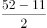
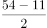
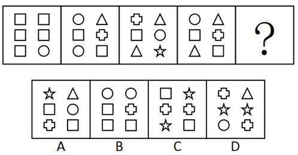
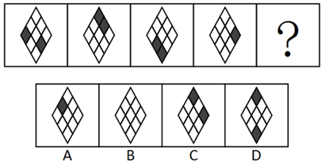
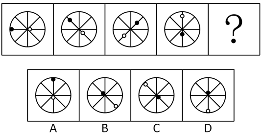

# 2016年天津选调生选拔考试 综合知识试卷（精选）

> 判断推理 · 15 题 · 天津 2016

## 第 1 题　qid 2262756 · 类比推理

海：水

- **A**. 写作：小说
- **B**. 画家：图画
- **C**. 太阳：光
- **D**. 旋律：音符　✅

**答案**：D

**官方解析**

第一步：判断题干词语间逻辑关系。
海是由水组成的，二者为包容关系中的组成关系。
第二步：判断选项词语间逻辑关系。
A项：小说是写作的成果，二者为方式与成果的对应关系，与题干逻辑关系不一致，排除；
B项：画家创作图画，图画是画家的劳动成果，二者为职业与成果的对应关系，与题干逻辑关系不一致，排除；
C项：太阳能够发出光，二者为属性的对应关系，与题干逻辑关系不一致，排除；
D项：旋律是由音符组成的，二者为包容关系中的组成关系，与题干逻辑关系一致，当选。
故正确答案为D。

---

## 第 2 题　qid 2262758 · 类比推理

伞骨：伞

- **A**. 柱：天花板
- **B**. 树干：树　✅
- **C**. 曲柄：引擎
- **D**. 建椽：屋顶

**答案**：B

**官方解析**

第一步：判断题干词语间逻辑关系。
伞骨是伞的组成部分，且伞靠伞骨来支撑，起到主要的支撑作用。
第二步：判断选项词语间逻辑关系。
A项：柱和天花板之间没有必然关系，与题干逻辑关系不一致，排除；
B项：树干是树的组成部分，树木高大的树冠全靠树干支撑，与题干逻辑关系一致，当选；
C项：曲柄是自行车中和牙盘相连的部分，引擎指的是发动机，二者无明显关系，与题干逻辑关系不一致，排除；
D项：椽是装于屋顶以支持屋顶盖材料的木条；虽然有支撑效果，但不是起到主要的支撑作用，需要房梁、檩子和椽结合在一起使用才能支撑起屋顶，而“建椽”是建造“屋顶”的一步工序，而不是其组成部分，与题干逻辑关系不一致，排除。
故正确答案为B。

---

## 第 3 题　qid 2262761 · 类比推理

音响：音量

- **A**. 性情：脆弱
- **B**. 哭叫：呼喊
- **C**. 小费：舞会
- **D**. 蒸馏：纯度　✅

**答案**：D

**官方解析**

第一步：判断题干词语间逻辑关系。
音响播放有音量高低之分，两者为对应关系。
第二步：判断选项词语间逻辑关系。
A项：脆弱是性情的一种，二者为包容关系中的种属关系，与题干逻辑关系不一致，排除；
B项：哭叫和呼喊为并列关系，与题干逻辑关系不一致，排除；
C项：小费和舞会之间没有必然关系，与题干逻辑关系不一致，排除；
D项：蒸馏有纯度之分，二者为对应关系，与题干逻辑关系一致，当选。
故正确答案为D。

---

## 第 4 题　qid 2262762 · 类比推理

射击：手枪

- **A**. 刺伤：匕首　✅
- **B**. 投掷：石头
- **C**. 失败：逃避
- **D**. 子弹：受伤

**答案**：A

**官方解析**

第一步：判断题干词语间逻辑关系。
用手枪射击，两者为工具与用途的对应关系。
第二步：判断选项词语间逻辑关系。
A项：用匕首刺伤他人，二者为对应关系中工具与用途的对应，与题干逻辑关系一致，保留；
B项：用石头投掷，二者为对应关系中工具与用途的对应，与题干逻辑关系一致，保留；
C项：逃避失败，二者是动宾关系，与题干逻辑关系不一致，排除；
D项：子弹能够使人受伤，但两词顺序与题干相反，与题干逻辑关系不一致，排除。
观察A、B两项，匕首是一种人工制造的武器，石头不是人工制造的武器，题干中手枪也是一种人工制造的武器，因此排除B项。
故正确答案为A。

---

## 第 5 题　qid 2262764 · 类比推理

鸟：蛋

- **A**. 鱼：虾
- **B**. 树：苗
- **C**. 蛙：卵　✅
- **D**. 甜：蜜

**答案**：C

**官方解析**

第一步：判断题干词语间逻辑关系。
鸟下蛋，蛋孵化出小鸟，二者是卵生动物与卵的对应。
第二步：判断选项词语间逻辑关系。
A项：鱼和虾为并列关系，与题干逻辑关系不一致，排除；
B项：苗为初生的树，但不是卵生动物与卵的对应关系，与题干逻辑关系不一致，排除；
C项：蛙产卵，卵变成小蝌蚪，最后变成青蛙，二者是卵生动物与卵的对应，与题干逻辑关系一致，当选；
D项：甜为蜜的属性，为对应关系中的属性关系，与题干逻辑关系不一致，排除。
故正确答案为C。

---

## 第 6 题　qid 39523 · 逻辑判断

赵、钱、孙、李四个人比谁的体重最重。已知：赵、钱的体重与孙、李的体重相等，当将钱、李互换后，赵、李的体重高于钱、孙的体重，钱的体重大于赵、孙的体重。
如果为真，以下哪项为真：

- **A**. 钱的体重最重
- **B**. 赵的体重最重
- **C**. 孙的体重最重
- **D**. 李的体重最重　✅

**答案**：D

**官方解析**

第一步：翻译题干。
①赵＋钱＝孙＋李，②赵＋李＞钱＋孙，③钱＞赵，钱＞孙。
第二步：根据题干信息得出结论。
由①赵＋钱＝孙＋李、②赵＋李＞钱＋孙可知李＞钱，又③钱＞赵、钱＞孙，得李＞钱＞赵&gt;孙。则李的体重最重。
故正确答案为D。

---

## 第 7 题　qid 2262768 · 逻辑判断

小曾、小孙、小石三个人是好朋友，他们每个人都有一个妹妹，且都比自己小11岁。三个妹妹的名字叫小英、小丽、小梅。已知小曾比小英大9岁，小曾与小丽年龄之和是52岁，小孙与小丽年龄之和是54岁。
由此可知，谁是谁的妹妹？

- **A**. 小梅是小孙的妹妹，小丽是小曾的妹妹，小英是小石的妹妹
- **B**. 小梅是小石的妹妹，小丽是小孙的妹妹，小英是小曾的妹妹
- **C**. 小梅是小曾的妹妹，小丽是小石的妹妹，小英是小孙的妹妹　✅
- **D**. 小梅是小曾的妹妹，小丽是小孙的妹妹，小英是小石的妹妹

**答案**：C

**官方解析**

第一步：分析题干。

①小曾、小孙、小石都有一个妹妹，且都比自己小11岁；

②三个妹妹的名字叫小英、小丽、小梅；

③小曾比小英大9岁；

④小曾与小丽年龄之和是52岁；

⑤小孙与小丽年龄之和是54岁。

第二步：结合题干分析选项。

题干中①③④都提到了小曾，从最大信息入手，根据③，小曾比小英大9岁，因此小曾的妹妹不是小英。排除B项。根据②，小曾与小丽的年龄之和为52，①小曾比妹妹大11岁，假设小丽是小曾妹妹，那她年龄应该为，结果不为整数，所以小曾的妹妹也不是小丽，排除A项。

因此小曾的妹妹只能为小梅，根据条件⑤，小孙与小丽年龄之和是54岁，条件①小孙比妹妹大11岁，假设小丽是小孙的妹妹，那她年龄应该为，结果不为整数，所以小孙的妹妹不是小丽，因此小孙的妹妹是小英，排除D项。

故正确答案为C。

---

## 第 8 题　qid 2255651 · 逻辑判断

某法院对某刑事案件有以下四种说法：①有证据表明赵刚没有作案；②作案者或者是赵刚，或者是王强，或者是李明；③也有证据表明王强没有作案；④电视画面显示，案发时李明在远离案发现场的一个足球赛的观众席上。
下列各项是对四种说法的不同描述，其中正确的一项是：

- **A**. 从上述说法中可以推出，只有一个人作案
- **B**. 上述说法中至少有一个是假的　✅
- **C**. 从这几种说法中可以推出，表明王强没有作案的证据是假的
- **D**. 李明肯定不在该足球赛的观众席上

**答案**：B

**官方解析**

第一步：找出题干矛盾关系。
本题突破口为“三个人都有证据表明没有作案”与“他们至少有一个人作案”之间的矛盾关系。
第二步：判断真假。
由“三个人都有证据表明没有作案”与“他们至少有一个人作案”之间的矛盾关系可知二者必有一假，故上述说法至少有一个是假的，但不能具体判断谁真谁假。
故正确答案为B。

---

## 第 9 题　qid 2262777 · 逻辑判断

经验告诉我们：天空的薄云，往往是天气晴朗的象征；那些低而厚密的云层，常常是阴雨风雪的预兆。
因此：

- **A**. 天空的云总是由薄变厚，反复无常
- **B**. 风雪来临之前总要给人以暗示
- **C**. 从天空云层的变化就可以预料天气的变化　✅
- **D**. 经验是人们在实践中积累起来的，没有十分把握

**答案**：C

**官方解析**

日常结论题，根据题干信息逐一分析选项。
A项：题干没有提到天空的云总是由薄变厚，反复无常，无中生有，排除；
B项：题干提到了天气晴朗和阴雨风雪时两种云层的变化，而选项只提到风雪，且给人暗示的到底是什么，表意不明，无法推出，排除；
C项：从天空云层的变化就可以预料天气的变化，是对题干的整体概括，可以推出，当选；
D项：题干谈论的是不同云层的变化可预示天气，并未提到经验、实践及是否有把握的问题，无中生有，排除。
故正确答案为C。

---

## 第 10 题　qid 2262779 · 逻辑判断

以下推断正确的一项是：

- **A**. 从我市目前的路面交通情况看，一般车辆较多的路段都比较拥挤，因此，一般比较拥挤的路段肯定车辆都比较多
- **B**. 因为甲班品学兼优的学生在物理考试中考试成绩都在90分以上，所以，乙班在物理考试中考试成绩在90分以上的学生肯定都是品学兼优的学生
- **C**. 几年来，某市每年考取清华北大的学生都在150人左右，因此每年清华、北大的新生中都有150左右的人是某市的学生　✅
- **D**. 冰箱一般对空气的制冷比对食物的制冷费电，因而在冰箱里放少量食物时最省电

**答案**：C

**官方解析**

A项：翻译选项：①车辆多拥挤，②拥挤车辆多，②是对①的肯后，肯后无必然结论，不能推出，排除；

B项：翻译选项：①品学兼优物理考试成绩90分以上，②物理考试成绩90分以上品学兼优，②是对①的肯后，肯后无必然结论，不能推出，排除；

C项：某市每年150人考上清华北大，那么清华北大每年一定有同样多的人来自某市，可以推出，当选；

D项：根据冰箱对空气制冷比对食物制冷费电得出结论：在冰箱里放少量食物时最省电，出现“最”，选项没有涉及到比较的问题，故放多少食物最省电无法推出，排除。

故正确答案为C。

---

## 第 11 题　qid 2262789 · 图形推理

从所给四个选项中，选择最合适的一个填入问号处，使之呈现一定的规律性：

- **A**. A
- **B**. B　✅
- **C**. C
- **D**. D

**答案**：B

**官方解析**

图一和图二同一位置有1个相同的图形，图二和图三同一位置有2个相同的图形，图三和图四同一位置有3个相同的图形，按照这个规律，图四到“？”处图形应有4个相同位置的图形。观察选项，只有B项符合题意。
故正确答案为B。

---

## 第 12 题　qid 2262791 · 图形推理

从所给四个选项中，选择最合适的一个填入问号处，使之呈现一定的规律性：

- **A**. A
- **B**. B
- **C**. C
- **D**. D　✅

**答案**：D

**官方解析**

本题为一组图题目，元素组成不同，且无明显属性规律，优先考虑数量规律。观察发现，图二、图三、图四,均为“田”字的变形图，考虑笔画数。题干图形均为两笔画图形，故？处也应填入一个两笔画的图形。A项、B项和C项均为一笔画，D项是两笔画，D项符合题意。
故正确答案为D。

---

## 第 13 题　qid 2262793 · 图形推理

从所给四个选项中，选择最合适的一个填入问号处，使之呈现一定的规律性：

- **A**. A
- **B**. B　✅
- **C**. C
- **D**. D

**答案**：B

**官方解析**

本题为一组图题目，元素组成相似，优先考虑样式规律。观察发现，题干图形从左到右，依次减少一条直线，减少的直线位置依次为上、下、右，因此“？”处图形应该为第四个图形减少左边直线，符合题干的只有B项。
故正确答案为B。

---

## 第 14 题　qid 2262795 · 图形推理

从所给四个选项中，选择最合适的一个填入问号处，使之呈现一定的规律性：

- **A**. A　✅
- **B**. B
- **C**. C
- **D**. D

**答案**：A

**官方解析**

本题为一组图题目，元素组成相似，优先考虑样式规律。观察发现，前四个图形黑色方块均在外围，且位置都不相同，结合前四图，图形外围只有第一行第二格缺少黑块，选项中只有A项符合。
故正确答案为A。

---

## 第 15 题　qid 2262797 · 图形推理

从所给四个选项中，选择最合适的一个填入问号处，使之呈现一定的规律性：

- **A**. A
- **B**. B
- **C**. C
- **D**. D　✅

**答案**：D

**官方解析**

元素组成相同，优先考虑位置规律。经观察，题干图形中黑点和白点依次整体顺时针移动、、得到下一个图形，故？处图形应在题干中图4的基础上黑点和白点整体顺时针移动，只有A、D两项满足此规律。此外，观察发现，题干中黑点逐渐靠近圆心，白点逐渐远离圆心，只有D选项满足此规律。

故正确答案为D。

---
