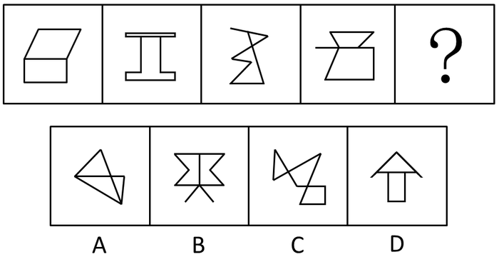
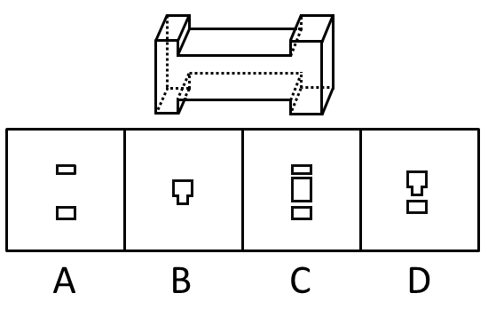
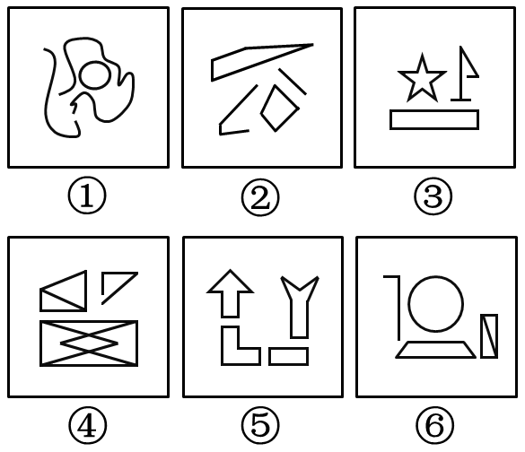

# 2016年山东省公务员录用考试《行测》题

> 判断推理 · 35 题 · 山东 2016

## 第 1 题　qid 1797340 · 图形推理

从所给的四个选项中，选择最合适的一个填入问号处，使之呈现一定的规律性：

- **A**. A
- **B**. B
- **C**. C
- **D**. D　✅

**答案**：D

**官方解析**

图形组成凌乱，且数量规律明显，考虑数数。
题干中每个图形都有两个面，排除A、C两项，B、D两项均有两个面，区别在于B项是两个形状相同的面，D项是不同的面，题干中的面都不相同，排除B项。（也可以用下面的规律：题干中两个面的关系都是一上一下，而B项是一左一右，D项是一上一下，故排除B项。）
故正确答案为D。

---

## 第 2 题　qid 1797352 · 图形推理

从所给的四个选项中，选择最合适的一个填入问号处，使之呈现一定的规律性：

- **A**. A
- **B**. B
- **C**. C　✅
- **D**. D

**答案**：C

**官方解析**

解析一：图形元素组成不同，且无明显的属性规律，考虑数量规律。题干都为多边形，内部被线条分割开，考虑数面，面数量分别为3、2、4、4、？、3。问号处如果有2个面的图形可成规律，无答案；多边形还常考虑数直线，直线数量分别为6、5、6、6、？、10，无明显熟悉规律；再尝试数点，点数量分别为4、6、5、6、？、9。经过仔细研究发现，每个图点数量和面数量之和为：7、8、9、10、？、12。因此问号处应该选择一个面数量与点数量之和为11的选项，只有C选项符合。
故正确答案为C。
解析二：图形元素组成不同，且无明显的属性规律，考虑数量规律。题干都为多边形，考虑数直线，但整体数直线无规律。继续观察发现，题干大部分图形中存在平行线，考虑直线的细化考法数平行线，平行线的组数依次为0、1、2、3、？、5，且每组有2条平行线。因此问号处应该选择一个平行线组数为4，且每组有2条平行线的选项，只有A选项符合。
故正确答案为A。
粉笔说明：两种思路均可通过严谨的数量规律得到答案，且公务员考试中都出现过类似考法的题目，故两种答案粉笔都认可。

---

## 第 3 题　qid 1797364 · 图形推理

下面的立体图形如果从任一面剖开，以下哪一项不可能是该立体图形的截面？

- **A**. A
- **B**. B
- **C**. C
- **D**. D　✅

**答案**：D

**官方解析**

A项：如图1所示可以切出；

C项：如图2所示可以切出；

B项：如图3所示可以切出。

本题为选非题，故正确答案为D。

---

## 第 4 题　qid 1797374 · 图形推理

右边哪一项不可能是左边正方体纸盒的展开图？

 

- **A**. A
- **B**. B
- **C**. C
- **D**. D　✅

**答案**：D

**官方解析**

纸盒右边图形箭头指向椭圆，且具有一条直线与椭圆内的长轴水平方向一致。观察选项，ABCD的右边样式的图形均与椭圆相邻，但D项中直线与椭圆内的长轴垂直，故无法折成原图。
本题为选非题，故正确答案为D。

---

## 第 5 题　qid 1797382 · 图形推理

把下面的六个图形分成两类，使每一类图形都有各自的共同特征或规律，分类正确的一项是：

- **A**. ①②③，④⑤⑥
- **B**. ①③⑤，②④⑥
- **C**. ①③④，②⑤⑥　✅
- **D**. ①⑤⑥，②③④

**答案**：C

**官方解析**

图形元素组成不同，且无明显的属性规律，优先考虑数量规律。每个图形都是由多个小元素构成，考虑数图中的元素的部分数，图①③④都是3部分，图②⑤⑥都是4部分。
故正确答案为C。

---

## 第 6 题　qid 1797948 · 定义判断

群体规范包括正式规范和非正式规范，前者是指由组织明文规定的员工应遵循的规则和程序；后者是指人们在工作与生活过程中约定俗成的行为准则，该规范的形成受到历史、习惯、群体目的性和社会因素的影响，同时也在很大程度上受到模仿、暗示、顺从等心理因素的制约，在群体成员彼此相互作用的条件下，发生的一种内化的过程。
根据上述定义，下列不属于非正式群体规范的是：

- **A**. 公司要求每位员工在刚入职时签署保密责任书　✅
- **B**. 由于受到描写黑帮的电影影响，一些青少年往往容易进行简单的模仿，形成各种“帮”、“会”等组织
- **C**. 春节是一家人团聚的时刻，北方人常常要在除夕夜包饺子，而南方人则是煮汤圆
- **D**. 在举手表决时，尽管有些人不赞成提案，但碍于情面，也会举手赞成

**答案**：A

**官方解析**

第一步：找出定义关键词。
正式群体规范：“由组织明文规定的员工应遵循的规则和程序”；
非正式群体规范：“约定俗成的行为准则”、“受到历史、习惯、群体目的性和社会因素的影响”、“受到模仿、暗示、顺从等心理因素的制约”。
第二步：逐一分析选项。
A项：公司要求每位员工签署保密责任书，这是公司的一项明文规定，符合“由组织明文规定的员工应遵循的规则和程序”，符合“正式群体规范”定义，不符合“非正式群体规范”定义，当选；
B项：青少年对描写黑帮的电影进行简单模仿，符合“受到模仿、暗示、顺从等心理因素的制约”，符合“非正式群体规范”定义，排除；
C项：南北方春节习俗不同，符合“约定俗成的行为准则”、“受到历史、习惯、群体目的性和社会因素的影响”，符合“非正式群体规范”定义，排除；
D项：有些人不赞成提案却碍于情面举手赞成，符合“受到历史、习惯、群体目的性和社会因素的影响”、“受到模仿、暗示、顺从等心理因素的制约”，符合“非正式群体规范”定义，排除。
本题为选非题，故正确答案为A。

---

## 第 7 题　qid 1797950 · 定义判断

前控控制是指在计划实施之前，为了保证将来的实际成果能达到计划的要求，尽量减少偏离的控制。
根据上述定义，下列属于前控控制的是：

- **A**. 营销部主任在方案推广期间，不断做出调整，尽量避免误差
- **B**. 新药剂的配方尽管之前经过多位专家考证，但药效还不如老配方
- **C**. 新游戏的图纸在投入编程之前，经过了几轮研讨以确保效果逼真　✅
- **D**. 新产品上市后销量一般，工厂组织技术人员进行升级后再次推向市场

**答案**：C

**官方解析**

第一步：抓住定义中的关键词。
关键词强调“在计划实施之前”、“保证将来的实际成果能达到计划的要求，尽量减少偏离的控制”。
第二步：逐一判断选项。
A项：在方案推广期间，不符合“在计划实施之前”，排除；
B项：新药剂药效不如老配方是两种不同药剂的比较，并不是使得新药剂的实际效果达到计划要求，排除；
C项：新游戏的图纸在投入编程之前研讨符合“在计划实施之前”，确保效果逼真符合“尽量减少偏离的控制”，所以符合定义，当选；
D项：新产品上市后，不符合“在计划实施之前”，排除。
故正确答案为C。

---

## 第 8 题　qid 1797952 · 定义判断

诉诸群众指的是为赢得众人同意一项主张时，不诉诸相关的事实和理由，而通过激起众人的情感和热情，以达到目的。不是服人以理，而是动人以情。这是宣传家、政客和广告商最常用的辩论方式。
根据上述定义，下列哪项属于诉诸群众？

- **A**. 某宣传家说：“在座的都要支持我的主张，因为我的主张是合理的！”
- **B**. 某政客说：“大家投我一票，选择我就是选择了未来！”　✅
- **C**. 某广告说：“好吃的包子叫龙凤，因为它采用了宫廷秘方！”
- **D**. 某刑事被告人说：“我是家里的顶梁柱，希望法官量刑时综合考虑！”

**答案**：B

**官方解析**

第一步：找出定义关键词。
“赢得众人同意一项主张”、“通过激起众人的情感和热情，以达到目的”、“不诉诸相关的事实和理由”。
第二步：逐一分析选项。
A项：“因为我的主张是合理的”是在诉诸相关理由，不符合“不诉诸相关的事实和理由”，不符合定义，排除；
B项：“大家投我一票，选择我就是选择了未来”，符合“通过激起众人的情感和热情，以达到目的”，符合定义，当选；
C项：“因为它采用了宫廷秘方”是在诉诸相关理由，不符合“不诉诸相关的事实和理由”，不符合定义，排除；
D项：“我是家里的顶梁柱”是在诉诸相关的事实和理由，不符合“不诉诸相关的事实和理由”，且是说服法官一个人，不符合“赢得众人同意一项主张”，不符合定义，排除。
故正确答案为B。

---

## 第 9 题　qid 1797954 · 定义判断

专利间接侵权是指，行为人的行为本身并不直接侵犯他人的专利，但却教唆、帮助或诱导他人实施专利侵权行为。
根据上述定义，下列哪项属于专利间接侵权？

- **A**. 王某通过个人关系购买了甲公司发动机设备，该设备已申请国家专利，之后经甲公司许可转售给乙公司
- **B**. 李某购买了一批已申请专利的用于浇注系统的模具，在购买前他和生产该模具的公司签订了相关合同
- **C**. 宋某将某外文小说译成中文后，以第一作者身份出版该小说，从中获利一百万元
- **D**. 甲公司遇到技术问题后委托乙公司解决，并暗示乙公司技术人员采用了丙公司的专利技术，但未告知丙公司　✅

**答案**：D

**官方解析**

第一步：抓住定义中的关键词。
关键词强调“行为人的行为本身并不实施专利侵权”“教唆、帮助或诱导他人实施专利侵权”。
第二步：逐一判断选项。
A项：王某购买设备不涉及侵犯专利权，也没有教唆、帮助或诱导他人实施专利侵权行为，不符合定义，排除；
B项：李某购买模具前他和生产该模具的公司签订了相关合同，没有侵权行为，也没有教唆、帮助或诱导他人实施专利侵权行为，不符合定义，排除；
C项：宋某本人直接侵犯了专利权，不属于间接侵权，是直接侵权，不符合定义，排除；
D项：甲公司没有直接侵权，教唆乙公司技术人员侵害丙公司的专利权，符合定义关键词，是间接侵权，当选。
故正确答案为D。

---

## 第 10 题　qid 1797956 · 定义判断

互助游是指有旅游意向的双方利用互联网等媒介中的人脉关系交换旅游资源，相互提供帮助而实现旅游的方式，达到双方都能降低旅游成本、实现深入体验旅游的目的。
根据上述定义，下列涉及互助游的是：

- **A**. 小张在北京读书，利用暑假时间到同学所在的城市旅游，期间住在同学的宿舍
- **B**. 小王家住南京，准备到西藏旅游，邀请家住西安的网友同行，分摊支出，旅途中互相帮助
- **C**. 小刘住在北京，在桂林旅游期间住在网友家里，对方到北京旅游时，自己也向对方提供住宿　✅
- **D**. 小赵住在上海，到海南旅行，食宿与行程均有朋友安排负责，小赵返沪后邀请朋友到上海玩

**答案**：C

**官方解析**

第一步：抓住定义中的关键词。
关键词强调“有旅游意向的双方”、“利用互联网等媒介中的人脉关系交换旅游资源”、“双方都能降低旅游成本、实现深入体验旅游”。
第二步：逐一判断选项。
A项：小张一个人旅游，不符合“有旅游意向的双方”，不符合定义，排除；
B项：小王和网友属于互联网媒介中的人脉关系，但只是分摊支出，没有体现出资源的交换，不符合定义，排除；
C项：小刘和网友属于互联网媒介中的人脉关系，网友为小刘在桂林旅游提供住宿，小刘为网友在北京旅游提供住宿，体现了住宿旅游资源的交换，双方都降低了旅游成本，符合定义，当选；
D项：小赵返沪后邀请朋友到上海玩，不涉及互联网媒介，且邀请朋友来但朋友是否前来不知道，是不明确选项，排除。
故正确答案为C。

---

## 第 11 题　qid 1797182 · 定义判断

替代性攻击，即遭受挫折后由于无法直接向挫折制造的源头表达愤怒或不满，而将怒气发泄到另外的“替罪羊”身上，“替罪羊”往往处于相对较弱的地位。
根据上述定义，下列不属于替代性攻击的是：

- **A**. 甲在工作中被老板责备，心怀不满，回家后因为一件小事责骂妻子
- **B**. 乙上课时受到老师批评，心中憋闷，下课后在学校超市把货架上的方便面全部捏碎
- **C**. 丙和邻居发生冲突时被迫忍气吞声，后趁天黑将邻居家的汽车车胎扎漏　✅
- **D**. 丁路过树下时被树上的鸟粪砸中，感到很生气，轰走了上来乞食的流浪猫

**答案**：C

**官方解析**

第一步：找出定义中的关键词。
“遭受挫折后由于无法直接向挫折制造的源头表达愤怒或不满”、“将怒气发泄到另外的‘替罪羊’身上”、“‘替罪羊’往往处于相对较弱的地位。”
第二步：逐一分析选项。
A项：甲受到了领导的责备，不责备领导而责备妻子，妻子是“另外的替罪羊”，符合定义，排除；
B项：乙上课时受到老师批评，不能骂老师，将怒气发泄到方便面上，方便面是“处于较弱地位的替罪羊”，符合定义，排除；
C项：邻居是挫折的源头，丙通过将邻居汽车车胎扎漏向挫折制造的源头“邻居”表达愤怒或不满，没有“替罪羊”出现，不符合定义，当选；
D项：丁被鸟粪砸中，但转而向流浪猫发脾气，流浪猫是“处于较弱地位的替罪羊”，符合定义，排除。
本题为选非题，故正确答案为C。

---

## 第 12 题　qid 1797186 · 定义判断

价值的条件化过程是指个体的价值评价建立在他人评价的基础上，以他人的价值规范为标准，而非根据自身的满足感进行评价。
根据上述定义，下列不属于价值的条件化过程的是：

- **A**. 一个学生受到老师误解，虽然内心愤怒和委屈，但从小受教导应当尊重老师，认为即使受到误解，也不应该指责老师
- **B**. 一个男孩把玻璃杯摔地上，他觉得很好玩，其父母因此不满并教育他不能随意摔东西，为让父母高兴，男孩学会不再摔东西
- **C**. 一个婴儿突然哭了，母亲听到后立刻给他换上干净清洁的纸尿裤，并给他喂奶，婴儿停止哭闹，不久后酣然入睡　✅
- **D**. 一个身材适中的女孩，其男友认为她很胖，于是女孩开始每天通过节食的方式进行减肥，即使饿了也不多进食

**答案**：C

**官方解析**

第一步：抓住定义中的关键词。
关键词强调“个体的价值评价以他人的价值规范为标准”、“非根据自身的满足感进行评价”。
第二步：逐一判断选项。
A项：学生以“从小受教导应当尊重老师，认为即使受到误解，也不应该指责老师”作为自己的价值评价，而非根据自身的满足感进行评价，符合定义，排除；
B项：男孩以“父母教育他不能随意摔东西”作为自己的价值评价，而非根据自身的满足感进行评价，符合定义，排除；
C项：婴儿哭是因为自己饿了，是根据自身的满足感进行评价，不符合定义，当选；
D项：女孩以“男友认为她很胖”作为自己的价值评价，而非根据自身的满足感进行评价，符合定义，排除。
本题为选非题，故正确答案为C。

---

## 第 13 题　qid 1797188 · 定义判断

动物权利主义认为，动物就其本质上来说应该有行为的自由；有在它们自己的生活圈中生活、居住的自由；有远离人类伤害、虐待和剥削的自由，也就是说动物有权利不受人类伤害、虐待和剥削，享有和人类一样的权利。动物福利主义认为，人类可以利用动物，例如用于研究实验、食用、猎取，用于体育娱乐或其他用途，但在利用动物的过程中，人类应该人道地对待动物，防止并惩罚虐待动物的残酷行为。
根据上述定义，下列做法中符合动物权利主义思想的是：

- **A**. 有些国家的法律禁止解剖动物，并禁止在马戏团进行驯兽表演　✅
- **B**. 1822年，英国国会通过了世界上第一部反对虐待动物的法律——《马丁法案》。这个法案禁止无故殴打、虐待任何驴、马、牛、羊或其他牲口，除非牲口先攻击人
- **C**. 大多数人看到一只弱小的毛驴被无辜地鞭打的时候，都会身不由己地同情毛驴
- **D**. 某地爱狗人士将高速公路上运送食用狗的车辆拦截，反对食用狗肉，但他们并不反对食用猪、牛、家禽等动物

**答案**：A

**官方解析**

第一步：找出定义关键词。
动物权利主义：动物应该“有行为的自由”、“有在它们自己的生活圈中生活、居住的自由”、“ 有远离人类伤害、虐待和剥削的自由”。
动物福利主义：“人类应该人道地对待动物，防止并惩罚虐待动物的残酷行为”。
第二步：逐一分析选项。
A项：“法律禁止解剖动物，并禁止在马戏团进行驯兽表演”符合“有远离人类伤害、虐待和剥削的自由”，符合动物权利主义的定义，当选；
B项：“法案禁止无故殴打、虐待任何驴、马、牛、羊或其他牲口，除非牲口先攻击人”符合“人类应该人道地对待动物，防止并惩罚虐待动物的残酷行为”，符合动物福利主义思想，不符合动物权利主义思想，排除；
C项：“大多数人看到一只弱小的毛驴被无辜地鞭打的时候，都会身不由己地同情毛驴”，是说人们会同情，没有涉及对动物权利的保护，不符合动物权利主义思想，排除；
D项：爱狗人士反对吃狗肉但不反对吃其他动物的肉，没有涉及对所有动物的权利的保护，不符合动物权利主义思想，排除。
故正确答案为A。

---

## 第 14 题　qid 1797192 · 定义判断

商标平行进口是指在国际货物贸易中，某一特定产品的商标已获进口国知识产权法保护，并且商标权所有人已在该国自己或授权他人制造或销售其商标权产品的情况下，进口商未经商标权人包括商标所有人或商标独占被许可人许可，擅自从国外进口该商标权产品到进口国销售的行为。
根据上述定义，下列不属于商标平行进口的是：

- **A**. 商标权人甲在A国享有商标权，并仅授权乙在A国制造、销售该商标权产品，丙在B国仿造该商标权产品，并输入到A国　✅
- **B**. A国的商标权人甲授权B国代理商乙在B国独家制造、销售该商标权产品，丙从B国将该商标权产品输入到A国
- **C**. 商标权人甲分别在A、B两国获得了同一商标注册，取得商标权，并且制造、销售产品，乙从A国将该商标产品输入到B国
- **D**. 商标权人甲在A国享有商标权，甲授权B国的乙为独占被许可人，甲在C国不享有该商标权，丙从C国合法购买该商标产品并输入到A国

**答案**：A

**官方解析**

第一步：抓住定义中的关键词。
“进口商未经商标权人许可，擅自从国外进口该商标权产品到进口国销售”。
第二步：逐一分析选项。
A项：丙在B国是仿造该商标权产品，并不是“该商标权产品”，不符合定义，当选；
B项：甲在A国是商标权人，丙没有经过甲的许可，擅自将B国的该商标权产品销售到A国，符合定义，排除；
C项：甲在A、B国都是商标权人，乙没有经过甲的许可，擅自从A国将该商标产品输入到B国，符合定义，排除；
D项：甲在A国是商标权人，丙没有经过甲的许可，擅自从C国将该商标产品输入到A国，符合定义，排除。
本题为选非题，故正确答案为A。

---

## 第 15 题　qid 1797202 · 逻辑判断

精神防御机制是在人们遇到困难时所采取的回避困难、解除烦恼、保护心理安宁的方法。该机制包括几种方法：转移作用是指对某一对象的情感因某种原因（发生危险或不合社会习惯）无法向其直接表现时，而转移到其它较安全或较为大家所接受的对象身上。合理化作用是指个人遭受挫折或无法达到所追求的目标以及行为表现不符合社会规范时，给自己找一些有利的理由来解释。投射作用是指将自己所不喜欢或不能接受的性格、态度、意念，“投射”到别人身上或外部世界去，而断言别人是这样的现象。
根据定义，下列反映了上述三种防御机制之一的是：

- **A**. 小琴的父母不喜欢体育运动，小琴被校羽毛球队选去当优秀苗子来培养，父母认为这样会耽误学习而坚决反对
- **B**. 小风在住院期间长时间和高护士接触，很感激高护士对自己的照顾，出院后他始终感念，对在护士学校上学的妹妹更加关心爱护
- **C**. 小宁不喜欢数学，数学考试也常常不及格，他认为不是自己学不好，而是老师教得不好，无法引起他的兴趣　✅
- **D**. 小何在宾馆做前台接待，最近和家人发生了矛盾，心情很低落，在接待客户时常常心不在焉、丢三落四

**答案**：C

**官方解析**

第一步：抓住定义中的关键词。
关键词强调“遇到困难时采取回避困难、解除烦恼、保护心理安宁的方法”。
“转移作用”：转移到安全或大家接受的对象身上。
“合理化作用”：找有利理由解释。
“投射作用”：把自己不喜欢的性格、态度、意念投射到别人身上。
第二步：逐一判断选项。
A项：父母的反对是小琴遇到的困难，但没有提及小琴如何防御或解决问题，不符合定义，排除；
B项：小风是感激别人的帮助，并没有提到遇到困难怎么解决烦恼，不符合定义，排除；
C项：小宁将自己数学考试常常不及格解释为老师教得不好，是为自己找有利的理由解释他所遇到的困难，属于“合理化作用”，符合定义，当选；
D项：小何因为和家人的矛盾导致工作失误，这是他遇到的困难，但没有提及他如何回避困难解决烦恼，不符合定义，排除。
故正确答案为C。

---

## 第 16 题　qid 1797214 · 类比推理

指甲：指甲钳

- **A**. 头发：发卡
- **B**. 铅笔：铅笔盒
- **C**. 手：手套
- **D**. 胡子：剃须刀　✅

**答案**：D

**官方解析**

第一步：分析题干词语的逻辑关系
指甲钳可以修剪指甲，二者为功能对应关系。
第二步：逐一分析选项
A项：发卡的作用是装饰与固定头发，二者为功能对应关系，保留；
B项：铅笔盒可以用来装铅笔，二者为功能对应关系，保留；
C项：手套戴在手上，可以起到保暖或装饰作用，二者为功能对应关系，保留；
D项：剃须刀是修剪胡子的工具，二者为功能对应关系，保留。
比较四个选项，D项剃须刀和题干指甲钳的功能都是修剪，属于同一范畴，二者更为类似，当选。
故正确答案为D。

---

## 第 17 题　qid 1797222 · 类比推理

哺乳动物：陆生动物

- **A**. 航天器：交通工具　✅
- **B**. 有花植物：无花植物
- **C**. 星际物质：天狼星
- **D**. 北极熊：极地企鹅

**答案**：A

**官方解析**

第一步：分析题干词语的逻辑关系。
有的陆生动物是哺乳动物，有的陆生动物不是哺乳动物；有的哺乳动物是陆生动物，有的哺乳动物不是陆生动物，因此二者是交叉关系。
第二步：逐一分析选项。
A项：有的航天器是交通工具，如航天飞机，有的航天器不是交通工具，如卫星、空间站等；有的交通工具是航天器，有的交通工具不是航天器，二者是交叉关系，与题干逻辑关系一致，当选；
B项：有花植物和无花植物是矛盾关系，与题干逻辑关系不一致，排除；
C项：天狼星是星体，星际物质是星体与星体之间的物质，二者没有必然联系，排除；
D项：北极熊和极地企鹅是两种不同的动物，并列关系，与题干逻辑关系不一致，排除。
故正确答案为A。

---

## 第 18 题　qid 1797228 · 类比推理

清洁能源：太阳能

- **A**. 女英雄：三八红旗手　✅
- **B**. 风车：风能
- **C**. 可再生能源：植物
- **D**. 治疗仪：按摩器

**答案**：A

**官方解析**

第一步：分析题干词语的逻辑关系。

太阳能是一种清洁能源，二者是种属关系。

第二步：逐一分析选项。

A项：英雄（广义）可以指不怕困难，不顾自己，为人民利益而英勇斗争，令人钦敬的人，如“人民英雄”“劳动英雄”等，女英雄指女性英雄；三八红旗手是由中华人民共和国妇女工作组织在三月八号国际妇女节颁发给优秀劳动妇女的荣誉称号，主要是表彰在中国各条战线上为社会主义物质文明和精神文明建设做出显著成绩的妇女先进个人和妇女先进集体。三八红旗手属于女英雄，二者是种属关系，与题干逻辑关系一致，当选；

B项：风车是利用和产生风能的工具，二者是对应关系，与题干逻辑关系不一致，排除；

C项：可再生能源是指风能、太阳能、水能、生物质能、地热能、海洋能等非化石能源，是取之不尽、用之不竭的能源，是相对于会穷尽的不可再生能源的一种能源，对环境无害或危害极小，而且资源分布广泛，适宜就地开发利用。可再生能源不包括植物，二者并非种属关系，与题干逻辑关系不一致，排除；

D项：治疗仪和按摩器是交叉关系，有的治疗仪是按摩器，也有的治疗仪不是按摩器，如一些激光治疗仪、红外治疗仪；有的按摩器是治疗仪，也有的按摩器不是治疗仪，如一些面部按摩器，不属于治疗仪。与题干逻辑关系不一致，排除。

故正确答案为A。

注：本题非常有争议，题干是种属关系，A项出题人是否认为有的三八红旗手不是女英雄，把A项当成了交叉关系？我们不得而知，但是一般来说，出题人没有必要传递出这样的观念，哪个三八红旗手不是女英雄呢？正确的观念应该是所有的三八红旗手都是女英雄，都是值得我们尊敬的；

另外C项的争议主要是植物是可再生“资源”，但是能不能看成可再生“能源”，各家说法也有争议，以后做题遇到类似选项时，可保留跟其他选项比较；

综上，本题争议性太大，在备考阶段，了解即可，可不作为重点题。

---

## 第 19 题　qid 1797234 · 类比推理

天下雨：地上湿

- **A**. 满18岁：有选举权
- **B**. 开花：结果
- **C**. 地上不湿：天没下雨　✅
- **D**. 摩擦：生热

**答案**：C

**官方解析**

第一步：分析题干词语的逻辑关系。
天下雨，必然地就会湿，天下雨是地上湿的充分条件。
第二步：逐一分析选项。
A项：满18岁，也不一定有选举权，不是充分条件，与题干逻辑关系不一致，排除；
B项：开花了也不一定会结果，不是充分条件，与题干逻辑关系不一致，排除；
C项：地没湿说明天一定没有下雨，地没湿是天没下雨的充分条件，与题干逻辑关系一致，当选；
D项：动摩擦产生热，但是静摩擦不产生热，因此摩擦不一定生热，与题干逻辑关系不一致，排除。
故正确答案为C。

---

## 第 20 题　qid 1797238 · 类比推理

研究生：硕士：博士

- **A**. 青少年：少年：青年　✅
- **B**. 妇孺：儿童：妇女
- **C**. 建筑：平房：高楼
- **D**. 图形：直线：三角形

**答案**：A

**官方解析**

第一步：分析题干词语的逻辑关系。
研究生只包含硕士和博士，硕士和博士属于研究生的两个阶段，读完硕士后才能读博士。
第二步：逐一分析选项。
A项：青少年只包含青年和少年两个阶段，经过少年阶段才能成长为青年，与题干逻辑关系一致，当选；
B项：妇孺包含妇女和儿童，儿童和妇女并不是妇孺的两个成长阶段，且儿童的性别有男有女，有可能成长为成年男子，与题干逻辑关系不一致，排除；
C项：平房和高楼虽然都属于建筑，但二者并不是建筑的两个阶段，与题干逻辑关系不一致，排除；
D项：直线和三角形不是图形的两个阶段，与题干逻辑关系不一致，排除。
故正确答案为A。

---

## 第 21 题　qid 1797252 · 类比推理

行驶：违章：罚款

- **A**. 学习：成绩：奖励
- **B**. 栽培：减产：施肥
- **C**. 竞争：优势：成功
- **D**. 锻炼：受伤：医治　✅

**答案**：D

**官方解析**

第一步：分析题干词语的逻辑关系。
行驶的过程中，违章了就可能会被罚款，对应关系。违章的人是被罚款的人。
第二步：逐一分析选项。
A项：学习的过程中，成绩好才可能会有奖励，但A项并没有提到成绩的好坏，与题干逻辑关系不一致，排除；
B项：减产不是发生在栽培的过程中的，而是栽培结束之后，与题干逻辑关系不一致，排除；
C项：竞争的过程中，优势会带来成功。有优势的人是成功的人，不存在被动关系，与题干逻辑关系不一致，排除；
D项：锻炼的过程中，受伤了可能需要被医治，受伤的人是被医治的人，与题干逻辑关系一致，当选。
故正确答案为D。

---

## 第 22 题　qid 1797266 · 类比推理

监督：人大：媒体

- **A**. 教育：小学：中学　✅
- **B**. 融资：借贷：赞助
- **C**. 增收：加薪：优惠
- **D**. 惩罚：死刑：徒刑

**答案**：A

**官方解析**

第一步：判断题干词语间逻辑关系。
人大和媒体是不同的机构，是并列关系，并且都有监督的功能。
第二步：判断选项词语间逻辑关系。
A项：小学和中学都是学校的一种，是并列关系，并且都有教育的功能，与题干逻辑关系一致，保留；
B项：融资即是一个企业的资金筹集的行为与过程，借贷可以作为一种融资的方式、起到融资的作用，但赞助的功能并非是融资，与题干逻辑关系不一致，排除；
C项：加薪是增收的一种方式，是种属关系，优惠和增收没关系，与题干逻辑关系不一致，排除；
D项：死刑和徒刑都是刑罚的一种，是并列关系，并且都有惩罚的功能，与题干逻辑关系一致，保留。
进行二级辨析，题干人大和媒体都是具体的单位机构，A项小学和中学也是具体的单位机构，D项死刑和徒刑是抽象词，即一些虚拟抽象概念。因此，A项与题干逻辑关系更为接近，排除D项。
故正确答案为A。

---

## 第 23 题　qid 1797278 · 类比推理

春雨：杏花：江南

- **A**. 夏荷：烈日：江北
- **B**. 秋风：腊梅：华北
- **C**. 秋霜：枯草：塞外　✅
- **D**. 冬雪：牡丹：边疆

**答案**：C

**官方解析**

第一步：分析题干词语的逻辑关系。
春雨和杏花都是春天的景色，对应的地点是江南，对应关系。
第二步：逐一分析选项。
A项：夏荷和烈日是夏天有的景色，江北也是地点，对应关系，与题干逻辑关系一致，保留；
B项：秋风是秋天的气候，但腊梅冬天才有，与题干逻辑关系不一致，排除；
C项：秋霜和枯草都是秋天的景象，对应的地点是塞外，与题干逻辑关系一致，保留；
D项：冬雪是冬天的景象，但牡丹是春天开花，与题干逻辑关系不一致，排除。
比较A、C两项：题干春雨是一种天气状况，杏花是植物，而A项夏荷是植物，烈日是天气，顺序与题干不一致，排除；C项秋霜是天气状况，枯草是植物，更符合题干逻辑关系，当选。
故正确答案为C。

---

## 第 24 题　qid 1797286 · 类比推理

航空母舰 对于（  ） 相当于 雷达 对于 （   ）

- **A**. 驱逐舰 天线
- **B**. 海洋 天空
- **C**. 舰载机 显示屏
- **D**. 舰艇 电子设备　✅

**答案**：D

**官方解析**

逐一代入选项。
A项：航空母舰和驱逐舰都属于舰艇，是并列关系；天线是雷达的组成部分，是组成关系，前后逻辑关系不一致，排除；
B项：航空母舰在海洋中行驶，但雷达并不在天空中运行，前后逻辑关系不一致，排除；
C项：舰载机停在航空母舰上，也是配备在航空母舰上的主要武器，而且是对应关系；显示屏是现代雷达的一个组成部分，与雷达是组成关系，前后逻辑关系不一致，排除；
D项：航空母舰是一种舰艇，雷达是一种电子设备，均为种属关系，前后逻辑关系一致，当选。
故正确答案为D。

---

## 第 25 题　qid 1797304 · 类比推理

理想  对于（    ）相当于（    ）对于涂鸦

- **A**. 现实  作品
- **B**. 梦想  画家
- **C**. 白日梦  画作　✅
- **D**. 志愿  涂改

**答案**：C

**官方解析**

逐一代入选项。
A项：理想与现实是反义关系，涂鸦和作品不是反义关系，前后逻辑关系不一致，排除；
B项：理想和梦想是近义词，画家和涂鸦是对应关系，前后逻辑关系不一致，排除；
C项：有的白日梦是理想，有的涂鸦是画作，都是交叉关系，前后逻辑关系一致；
D项：理想和志愿意思有相近的地方，但理想比较宏大，志愿比较具体；涂改和涂鸦之间没有必然联系，前后逻辑关系不一致，排除。
故正确答案为C。

---

## 第 26 题　qid 1797314 · 类比推理

人类排放温室气体导致北极冰川开始消融，海平面扩大。冰川可以反射85%的太阳光，而海水只反射5%的太阳光，越来越多的海水吸收更多能量，进一步加速冰川消融。
以下哪一项中的因果关系与题干最为相同？

- **A**. 商场为某名牌香水做推广和宣传，顾客购买几次后发现该香水香氛淡雅，持久清新，成为了该品牌香水的忠实顾客
- **B**. 英语考试在即，王强不得不每天早起诵读英语，早上空气清新，精神抖擞，英语考试结束后，王强依然坚持早起
- **C**. 张楠在爸爸的引荐下，认识了一些证券交易的客户，这个圈子的客户发展是滚雪球式的，张楠认识的客户越来越多　✅
- **D**. 使用新方法后，刘丹的平面几何成绩迅速提高，由于平面几何很多原理可用在立体几何中，刘丹的立体几何成绩也很快提高

**答案**：C

**官方解析**

第一步：分析题干推理方式。
冰川消融导致海水增多，海水增多吸收更多能量加速冰川消融，即a导致b，b又导致a，ab之间互为条件关系。
第二步：逐一分析选项。
A项：顾客购买多次发现其优点成为忠实顾客，即a导致b，与题干推理方式不一致，排除；
B项：考试导致早起，不考试了也早起，说明早起与考试之间不存在因果关系，即a与b无关，与题干推理方式不一致，排除；
C项：张楠在爸爸的引荐下认识了一些客户，然后越来越多的客户认识了张楠，即ab互为条件关系，与题干推理方式一致；
D项：使用新方法，平面几何成绩提高，利用新方法，立体几何成绩也提高，即a导致b，a也导致c，与题干推理方式不一致，排除；
故正确答案为C。

---

## 第 27 题　qid 1797328 · 逻辑判断

某研究所人员结构状况如下：所有女性都拥有博士学位，有的男博士有高级职称，但所里也存在既没有博士学位也没有高级职称的人员。
根据以上陈述，可以推出以下哪项？

- **A**. 有的男性没有高级职称　✅
- **B**. 有的女性有高级职称
- **C**. 所有男性都拥有高级职称
- **D**. 有的女性没有高级职称

**答案**：A

**官方解析**

第一步：根据题干条件进行翻译可得。
（1）女性→博士；
（2）有的男博士→高级职称；
（3）有的人员→-博士且-高级职称。
其中（1）可以用逆否等价进行推理，（2）（3）为有的不符合逆否等价，可以利用“有的S是P等价于有的P是S”进行推理。
第二步：根据已知条件进行推理并逐一分析选项。
A项：对（1）进行逆否，否后必否前可知不是博士就不是女性， 所以不是博士且不是高级职称的人肯定也不是女性，没有博士学位且没有高级职称的人就一定是男性，可以推出有的没有高级职称的人是男性，利用“有的”进行推理可知，有的男性没有高级职称，可以推出，当选；
B项：根据逆否，肯前必肯后可知女性一定是博士，但女博士与高级职称之间不存在任何关系，无法推出，排除；
C项：题干中涉及到男性的都是“有的男性”，无法推出“所有男性”的结论，无法推出，排除；
D项：同B项，根据逆否，肯前必肯后可知女性一定是博士，但女博士与高级职称之间不存在任何关系，无法推出，排除。
故正确答案为A。

---

## 第 28 题　qid 1797342 · 逻辑判断

在摩天大楼里工作的人大多数都是白领阶层，英语水平四级以上是成为外企白领的必要条件，外企中只有白领阶层的办公地点设在摩天大楼里。
根据以上描述，以下哪项是不正确的？

- **A**. 在摩天大楼里的白领不一定是在外企工作
- **B**. 外企中英语水平四级以上的未必是白领
- **C**. 英语水平四级以上的白领可能不在摩天大楼里工作
- **D**. 外企中英语水平四级以下者可能在摩天大楼里工作　✅

**答案**：D

**官方解析**

第一步：翻译题干。

①大多数摩天大楼白领阶层；

②外企白领英语水平四级以上；

③外企办公地点设在摩天大楼外企白领。

第二步：逐一分析选项。

A项：题干中指出摩天大楼里工作的人大多数都是白领阶层，但没有说白领都是外企的，所以在摩天大楼里的白领可能在外企工作，也可能不在外企工作，可以推出，排除；

B项：是对②的肯后，肯后无必然结论，也就是说外企中英语水平四级以上的可能是白领，也可能不是白领，可以推出，排除；

C项：是对①②③的肯后，肯后无必然结论，无法推出是不是外企白领也无法推出是不是在摩天大楼工作，可以推出，排除；

D项：是对②的否后，否后必否前，外企中英语水平四级以下者不是外企白领，不是外企白领是对③的否后，否后必否前，不是外企白领不在摩天大楼，即不可能在摩天大楼里工作，无法推出，当选。

本题为选非题，故正确答案为D。

---

## 第 29 题　qid 1797354 · 逻辑判断

随着气候变化，肥料和供水导致了极大的能源和环境成本，如何让作物更好地吸收营养和水就显得极其重要。因此不少人认为只要增加植物根毛的长度，就可以更有效地吸收水和养分，从而提高作物产量。
下列哪项如果为真，最能削弱上述结论？

- **A**. 实践证明，合理控制光照时间，并保证同一块田地间隔播种作物能极大地提高产量
- **B**. 根毛的寿命很短，仅能存活2~3周便自行脱落，由于更新很快，植物的根部总能保持一个数量相对稳定的根毛区
- **C**. 如果植株过于密集而养料不足，即使增加了根毛长度，也无法保证植物的营养供应　✅
- **D**. 根毛的长度与植物生长激素密切相关，当植物生长激素分泌旺盛时，根毛也变长；而生长激素分泌减少时，根毛也逐渐萎缩

**答案**：C

**官方解析**

第一步：分析论点论据。
论点：只要增加植物根毛的长度，就可以更有效地吸收水和养分，从而提高作物产量。
论据：无。
第二步：逐一分析选项。
A项：合理控制光照时间，并保证同一块田地间隔播种作物能极大地提高产量，与增加植物根毛的长度是否能吸收水和养分和提高作物产量没有关系，为无关选项，排除；
B项：根毛的寿命长短以及植物根部的根毛稳定与增加植物根毛的长度是否能吸收水和养分和提高作物产量没有关系，为无关选项，排除；
C项：指出在植株过于密集而养料不足的条件下，增加了根毛长度无法保证植物的营养供应，直接削弱论点，当选；
D项：植物生长激素对根毛的影响与增加植物根毛的长度是否能吸收水和养分和提高作物产量没有关系，为无关选项，排除。
故正确答案为C。

---

## 第 30 题　qid 1797366 · 逻辑判断

有研究发现，那些每天坐着看电视和工作总计达10小时的女性，与每天通常坐8小时的女性相比，患结肠癌的风险增加8%，患子宫癌的风险增加10%，而且无论研究对象在不坐时有多活跃，都不会影响这个结果。
由此可以推出：

- **A**. 缺乏运动可能是某些癌症的首要病因
- **B**. 久坐可能对女性健康造成不良的影响　✅
- **C**. 工作之余的体育锻炼可以强身健体
- **D**. 上班族职业女性的身体健康状况堪忧

**答案**：B

**官方解析**

通读文段，逐一分析选项。
A项：题干中没有提到研究对象是否缺乏运动，且“首要”也是敏感词，题干并未涉及缺乏运动是否是首要病因，排除；
B项：题干中指出坐10小时的女性比坐8小时的女性患结肠癌与子宫癌的风险更大，也就是说坐的时间越久得病的风险越大，能推出久坐可能对女性健康造成不良影响，当选；
C项：题干中没有提到工作之余的体育锻炼对于身体是否有好处，属于无中生有，排除；
D项：题干中提到的是坐着看电视和工作的女性，“坐着”是研究条件，并不单指上班族职业女性，主体不一致，偷换概念，排除。
故正确答案为B。

---

## 第 31 题　qid 1797376 · 逻辑判断

大脑受到有毒化学物质伤害会产生功能受损，进而导致帕金森症。研究显示，体内细胞色素P450水平低的人患帕金森症的可能性是体内P450水平正常的人的三倍。因而可以认为，P450可以保护大脑免受有毒化学物质的损伤，进而预防帕金森症。
以下陈述如果为真，哪项最能质疑上述结论？

- **A**. 有毒化学物质损伤大脑功能的同时也抑制人体产生P450
- **B**. 帕金森症患者除P450外的其他细胞色素水平也显著低于常人　✅
- **C**. 人工合成P450可以用于治疗帕金森症患者
- **D**. 某些非细胞色素物质可有效对抗有害化学物质来预防帕金森症

**答案**：B

**官方解析**

第一步：找出论点论据。
论点：P450可以保护大脑免受有毒化学物质的损伤，进而预防帕金森症。
论据：体内细胞色素P450水平低的人患帕金森症的可能性是体内P450水平正常的人的三倍。
第二步：逐一分析选项。
A项：有毒物质对于P450的抑制与P450是否可以保护大脑免受有毒化学物质的损伤没有关系，属于无关选项，排除；
B项：帕金森症患者除P450外的其他细胞色素水平也低于常人，意味着帕金森患者除了P450之外，其他细胞色素水平也低，也就不能仅仅通过论据P450低就得到论点能否预防帕金森，即不能通过论据得到论点，属于拆桥项，当选；
C项：人工合成的P450能治疗帕金森症，但结论是预防帕金森症，主题不一致，属于无关选项，排除；
D项：某些非细胞色素物质可以对抗有害化学物质来预防帕金森症与P450是否可以保护大脑免受有毒化学物质的损伤进而预防帕金森症没有关系，属于无关选项，排除。
故正确答案为B。

---

## 第 32 题　qid 1797386 · 逻辑判断

众所周知，每个人的指纹都是不同的，指纹才是每个人独一无二的身份证，因此指纹常常用在案件侦破中。然而科学家的最新研究发现，随着机体老化，指纹纹路排列会发生不可逆转的变化，因此科学家得出结论：指纹不应该再用于案件侦破中。
以下哪项如果为真，最能质疑上述结论？

- **A**. 指纹是目前案件侦破的最关键证据，许多重案犯是依靠指纹才被抓捕归案的
- **B**. 除了指纹，每个人的DNA也是独一无二的且不会随着时间变化而发生改变
- **C**. 除了纹路排列，指纹的其他几项指标也是指纹识别技术的重要依据
- **D**. 指纹纹路排列发生变化有规律可循，这一规律是普遍适用的　✅

**答案**：D

**官方解析**

第一步：分析论点论据。
论点：指纹不应该再用于案件侦破中。
论据：随着机体老化，指纹纹路排列会发生不可逆转的变化。
第二步：逐一分析选项。
A项：指纹对于破案的关键性和重要性与其可靠性之间没有关系，不能影响其是否应该用于案件侦破中，属于无关选项，排除；
B项：DNA的特性与指纹是否应该用于案件侦破没有关系，属于无关选项，排除；
C项：指出指纹的其他几项指标也是指纹识别技术的重要依据，也就是说指纹纹路排列只是条件之一，降低了指纹纹路排列对于指纹应用的作用，削弱论证；
D项：指出指纹纹路排列发生变化有普遍适用的规律，意指虽有变化，但依然可行，也属于削弱论证。
比较C、D两项，C承认纹路不再可行，但是还认为存在其他可行的，而D则表明纹路其实依旧可行，故D的削弱更彻底。
故正确答案为D。

---

## 第 33 题　qid 1797392 · 逻辑判断

骨质疏松是一种骨钙质减少，骨脆性增加，易发骨折的疾病。现有的治疗手段比如使用雌激素或者降钙素有助于阻止进一步的骨质减少但不能增加骨头质量。氟化物被认为能增加骨质，给骨质疏松症患者注入氟化物会帮助他们的骨骼不容易折断。
以下哪项如果为真，能够削弱文中观点？

- **A**. 大多数患骨质疏松症的人没有意识到注入氟化物可以增加骨质
- **B**. 牙膏中常加入氟化物来起到坚固牙齿的作用
- **C**. 氟化物注入健康人的体内会导致较强的副作用
- **D**. 通过注入氟化物增加的骨质比正常的骨骼组织更加脆弱而缺少弹性　✅

**答案**：D

**官方解析**

第一步：分析论点论据。
论点：给骨质疏松症患者注入氟化物会帮助他们的骨骼不容易折断。
论据：氟化物被认为能增加骨质。
第二步：逐一分析选项。
A项：患骨质疏松症的人没有意识到注入氟化物可以增加骨质与给骨质疏松症患者注入氟化物会不会帮助他们的骨骼不容易折断之间没有关系，属于无关选项，排除；
B项：氟化物可以坚固牙齿，但是不代表也能够坚固骨骼，属于无关选项，排除；
C项：仅指出氟化物注入健康人的体内会导致较强的副作用，没有提到注入骨质疏松症患者体内有何影响，属于无关选项，排除；
D项：指出注入氟化物增加的骨质比正常的骨骼组织更加脆弱，更容易被折断，削弱论点。
故正确答案为D。

---

## 第 34 题　qid 1797396 · 逻辑判断

澳大利亚研究人员称，桉树在吸收水分的同时，会将水中微量的金元素吸收进树体。通过分析桉树落叶中金的含量，可指示金矿的位置，不用钻探就能了解地表以下是否有矿藏。因此桉树探矿法对矿产勘探具有重要意义。
以下哪项如果为真，最能削弱上述结论？

- **A**. 金矿一般都埋藏于砂石层之下，普通土壤层在砂石层上面，植物的根生长在土壤层　✅
- **B**. 澳洲西南部的新南威尔士州富含金矿，当地的桉树叶中含金量与其它地区并无显著差异
- **C**. 桉树探矿法的实施周期较长，需要等待桉树成材之后才能有效
- **D**. 澳洲西南部有大片的桉树林，澳洲最早发现的金矿也在那里

**答案**：A

**官方解析**

第一步：分析论点论据。
论点：桉树探矿法对矿产勘探有重要意义。
论据：桉树会将水中微量的金元素吸收进树体，通过分析桉树落叶中金的含量，可以指示金矿的位置，不用钻探就能了解地表以下是否有矿藏。
第二步：逐一分析选项。
A项：即使植物能够通过根吸收微量金元素，但因为植物的根生长在土壤层，与金矿间隔着砂石层，也吸收不到金矿的微量元素，也就无法指示金矿位置，直接削弱了论点，可以削弱，保留；
B项：指出澳洲西南部的新南威尔士州的桉树叶中含金量与其他地区并无显著差异，但是当地却富含金矿，至少此地桉树探矿法无效，有一定的削弱作用，保留；
C项：桉树探矿法的实施周期较长并不影响桉树探矿法是否能有效勘探到金矿，属于无关选项，排除；
D项：指出澳洲西南部有大片的桉树林也有最早发现的金矿，但是没有提到这些桉树叶中含金量，属于无关选项，排除；
比较A、B两项，B项仅是某一地区桉树探矿法无效，其他地区是否适用桉树探矿法无法判断，削弱力度较小，而A项具体解释了为什么桉树探矿法对矿产勘探意义不大，力度更强。
故正确答案为A。

---

## 第 35 题　qid 1797404 · 逻辑判断

过去人们基于对月岩原子放射性衰变的测量认为，月球诞生在太阳系形成之后约3000万到4000万年之间。一项新的研究基于259台电脑对围绕太阳旋转的原行星盘演化过程的模拟，再现了小型天体在最终形成现有岩态行星之前不断撞击和聚合的过程。该研究人员认为，大约在太阳系诞生之后约9500万年，一颗巨大的小行星撞击地球，形成的碎片最后变成了月球。
以下哪项最能指出前后两种观点的分歧？

- **A**. 关于月球形成时间，有两种不同的估算方法，一种基于放射性衰变测量，一种是基于计算机模拟　✅
- **B**. 关于月球形成过程，有两种不同的理论假说，一种基于月岩自然衰变，一种是原行星盘自然演化
- **C**. 关于月球形成方式，有两种不同的模型解释，一种基于月球组成成分的测量，一种是小行星撞击
- **D**. 关于月球与地球的演化，有两种不同的还原方法，一种基于月球现有成分的测量，一种是计算机模拟

**答案**：A

**官方解析**

第一步：分析题干主要信息。
第一种观点：基于对月岩原子放射性衰变的测量认为，月球诞生在太阳系形成之后约3000万年到4000万年之间；
第二种观点：基于259台电脑对围绕太阳旋转的原行星盘演化过程的模拟，大约在太阳系诞生之后约9500万年，一颗巨大的小行星撞击地球形成的碎片最后变成了月球。
第二步：逐一分析选项。
A项：第一种观点是基于对月岩原子放射性衰变的测量得出结论，第二种观点是基于259台电脑的模拟，得到了不同的月亮形成时间，与选项的描述内容一致，指出前后两种观点最大的分歧，当选；
B项：两种观点都是研究月球形成的时间，不是月球的形成过程，而且第一种观点基于的是月岩原子放射性衰变，并不是月岩自然衰变，与题干描述不一致，不能解释分歧，排除；
C项：两种观点都是研究月球形成的时间，不是月球的形成方式，而且第一种观点基于的是月岩原子放射性衰变，并不是月球组成成分的测量，与题干描述不一致，不能解释分歧，排除；
D项：两种观点都是研究月球形成的时间，不是月球和地球的演化，而且第一种观点基于的是月岩原子放射性衰变，并不是月球现有成分的测量，与题干描述不一致，不能解释分歧，排除。
故正确答案为A。

---
