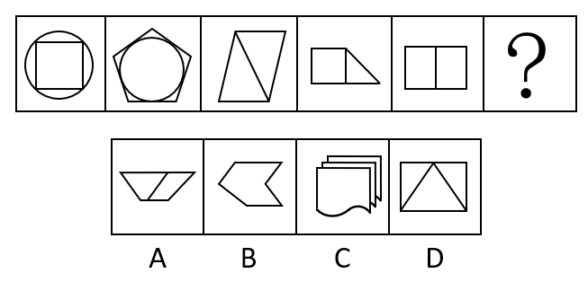
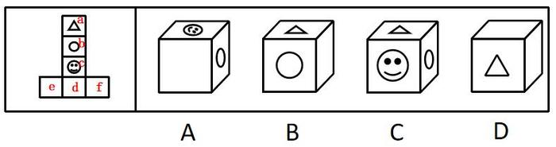
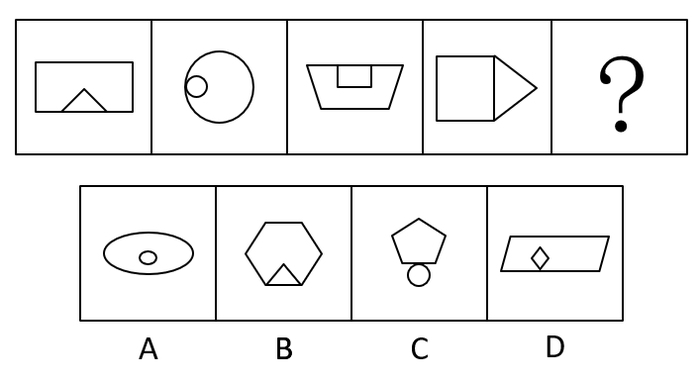
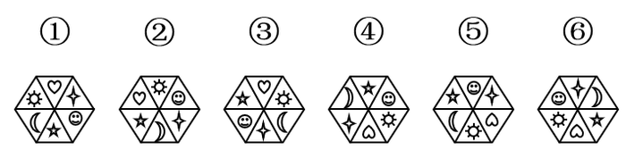
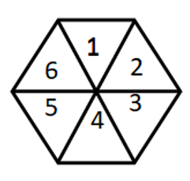

# 2016年山东省选调应届优秀高校毕业生到基层工作考试《行测》试卷（精选）

> 判断推理 · 15 题 · 选调 2016

## 第 1 题　qid 2633369 · 逻辑判断

要使中国足球走出亚洲，关键是要有科学的精神。如果没有科学的精神，物质激励再多，也不可能在世界强队面前有好的突破。
请指出下面选项中与上面画线部分含义不等值的命题：

- **A**. 只有发扬科学精神，才能取得好的突破
- **B**. 除非有科学的精神，否则他不能取得好的突破
- **C**. 只要有了科学的精神，就能有好的突破　✅
- **D**. 如果取得了好的突破，一定树立了科学的精神

**答案**：C

**官方解析**

第一步：翻译题干。

本题问的是与上面画线部分含义不等值的命题，只需翻译画线句。

画线句翻译为：科学精神好的突破。

第二步：逐一分析选项。

A项：翻译为好的突破科学精神，是对画线句的否后，否后必否前，与画线句等值，排除；

B项：翻译为好的突破科学精神，是对画线句的否后，否后必否前，与画线句等值，排除；

C项：翻译为科学精神好的突破，是对画线句的否前，否前无法推出确定结论，与画线句不等值，当选；

D项：翻译为好的突破科学精神，是对画线句的否后，否后必否前，与画线句等值，排除。

本题为选非题，故正确答案为C。

---

## 第 2 题　qid 1771 · 定义判断

重大飞行事故罪是指航空人员违反规章制度，致使发生重大飞行事故，造成严重后果的行为。
根据定义，下列属于重大飞行事故罪的是：

- **A**. 逃犯甲用匕首胁迫飞机驾驶员在某乡镇降落，结果致使大量村民死亡
- **B**. 某客机在滑行途中突遭暴雨，驾驶员作出停止升空的决定，结果导致乘客滞留机场达48小时
- **C**. 驾驶员在和空姐聊天时，飞机偏离原定航线
- **D**. 飞机驾驶员为提神，在驾驶时吸烟，结果导致飞机着火坠毁　✅

**答案**：D

**官方解析**

第一步：找出定义关键词。
“航空人员违反规章制度”、“造成严重后果”。
第二步：逐一分析选项。
A项：飞机驾驶员是在被胁迫的情况下将飞机降落，没有违反航空公司的规章制度，不符合“航空人员违反规章制度”，不符合定义，排除；
B项：客机驾驶员遇到不可抗力因素（暴雨）作出停止升空的决定，没有违反航空公司的规章制度，不符合“航空人员违反规章制度”，且乘客滞留机场也不属于严重的后果，不符合“造成严重后果”，不符合定义，排除；
C项：飞机偏离原定航线不属于严重的后果，不符合“造成严重后果”，不符合定义，排除；
D项：飞机驾驶员在驾驶时吸烟是违反航空公司规章制度的行为，符合“航空人员违反规章制度”，飞机坠毁属于严重的后果，符合“造成严重后果”，符合定义，当选。
故正确答案为D。

---

## 第 3 题　qid 25411 · 逻辑判断

有经验的司机完全有能力并习惯以120公里的时速在高速公路上行驶，为了迅速提高道路的使用效率，某条高速公路的最高时速限制由原来100公里转为120公里。
以下各项如果为真，最能质疑上述主张的是：

- **A**. 统计表明行车速度达120公里时事故发生率明显增加，反而影响高速公路的使用效率　✅
- **B**. 限速每小时120公里不能迅速提高公路使用效率，因为高速驾车对技术的要求很高
- **C**. 时速达120公里时，汽车的油耗量将明显增加，考虑到油价，大多数司机还是放松油门
- **D**. 虽然时速限制放宽到120公里，但在不少路段上，很多司机对此速度有安全之虞

**答案**：A

**官方解析**

第一步：找出论点和论据。
论点：为了迅速提高道路的使用效率，某条高速公路的最高时速限制由原来100公里转为120公里。
论据：有经验的司机完全有能力并习惯以120公里的时速在高速公路上行驶。
本题论据和论点讨论的是都是高速公路的最高时速限制为120公里，二者话题一致，削弱首先考虑削弱论点，其次考虑削弱论据。
第二步：逐一分析选项。
A项：限速转为120公里会明显增加事故，影响高速公路使用效率，即降低使用效率，直接削弱论点，保留；
B项：指出不能迅速提高使用效率，但并不否定限速转为120公里以后有提高使用效率的可能性，削弱论点，保留；
C项：说的是大多数司机考虑到油价，通常不会开到时速120公里，说明限速120公里不一定能够提高使用效率，削弱论点，保留；
D项：说的是司机对车速的顾虑，没有说明是否影响道路使用效率，属无关选项，排除。
比较A、B、C三项，三项都是削弱论点，但B、C两项只说明不能提高公路使用效率，而A项强调的是会降低使用效率，对论点的削弱力度比B、C两项强。
故正确答案为A。

---

## 第 4 题　qid 2633375 · 逻辑判断

一种对传染病非常有效的药物，目前只能从一种叫ibora的树皮中提取，而这种树在自然界中很稀少，5000棵树的皮才能提取1公斤药物。因此，不断生产这种药，将不可避免地导致该物种的灭绝。
以下哪项为真，最能削弱上述理论？

- **A**. 把从ibora树皮中提取的药物通过一个权威机构直接发送给医生
- **B**. 从ibora树皮提取药物生产成本很高
- **C**. ibora的叶子在多种医学制品中都有应用
- **D**. ibora可以通过插枝繁衍，在人工培育下生长　✅

**答案**：D

**官方解析**

第一步：找出论点和论据。
论点：不断生产这种药，将不可避免地导致该物种的灭绝。
论据：这种树在自然界中很稀少，5000棵树的皮才能提取1公斤药物。
本题论点说的是不断生产此药会导致该物种的灭绝，论据是该物种稀少且5000棵树的皮才能提取1公斤药物，二者话题一致，优先考虑削弱论点，即不断生产这种药不会导致该物种的灭绝。
第二步：逐一分析选项。
A项：该项讨论的是将药物发送给医生，而论点讨论的是药物的不断生产会导致该物种灭绝，话题不一致，无法削弱，排除；
B项：该项讨论的是药物提取的成本，而论点讨论的是药物的不断生产会导致该物种灭绝，话题不一致，无法削弱，排除；
C项：该项讨论的是ibora的叶子在医学制品中的应用，而论点讨论的是药物的不断生产会导致该物种灭绝，话题不一致，无法削弱，排除；
D项：该项讨论的是ibora可以通过插枝繁衍，在人工培育下生长，证明药物的不断生产并不会导致该物种灭绝，削弱论点，当选。
故正确答案为D。

---

## 第 5 题　qid 2633380 · 逻辑判断

已知“某大学并非或者有哲学专业或者有逻辑学专业”，则可以得出以下哪项结论？

- **A**. 如果该所大学没有逻辑学专业，那么一定有哲学专业
- **B**. 如果该所大学没有哲学专业，那么一定有逻辑学专业
- **C**. 该所大学既有哲学专业又有逻辑学专业
- **D**. 该所大学既没有逻辑学专业，也没有哲学专业　✅

**答案**：D

**官方解析**

第一步：翻译题干。

题干翻译为：（哲学或逻辑学）哲学 且 逻辑学。

第二步：逐一分析选项。

A项：翻译为逻辑学哲学，无法推出，排除；

B项：翻译为哲学逻辑学，无法推出，排除；

C项：翻译为哲学 且 逻辑学，无法推出，排除；

D项：翻译为哲学 且 逻辑学，根据题干逻辑关系可以推出，当选。

故正确答案为D。

---

## 第 6 题　qid 2633384 · 类比推理

一天，一位上车不久的乘客发现自己的背包被人割开，刚取回的一万元钱不见了。据乘客说上车时还没事，因当时还没有乘客下车，司机于是把车开到附近的派出所。经过调查寻找，发现钱已被扒手丢在了座位下边。嫌疑人有甲、乙、丙、丁。
甲：“反正不是我干的。”
乙：“是丁干的。”
丙：“是乙干的。”
丁：“乙是诬告。”
他们当中只有一人说假话，扒手只有一个人，是：

- **A**. 甲
- **B**. 乙　✅
- **C**. 丙
- **D**. 丁

**答案**：B

**官方解析**

第一步：找矛盾。

甲：甲；

乙：丁；

丙：乙；

丁：丁。

乙和丁是矛盾关系，二者必有一真，必有一假。

第二步：看其余。

已知只有一人说假话，乙和丁一真一假，可以推出甲和丙二人说的都是真话，即乙是扒手。

故正确答案为B。

---

## 第 7 题　qid 2633387 · 类比推理

古希腊唯心主义不可知论者认为：一切都是虚假的。亚里土多德反驳道：如果一切都是虚假的，那么“一切都是虚假的”就是假的。这是一个归谬反驳的例子。
选项中与题干论证方式相同的是：

- **A**. 有人认为刑事犯罪率的高低与刑罚的严厉程度成反比趋势。若该结论成立，那就意味着刑罚最严厉的时代，就是犯罪率最低的时代；而刑罚最宽缓的时代，就是犯罪率最高的时代。但考察历史却发现，事实并非如此。秦朝和明代好像是刑罚最为严酷的时代，但犯罪率却并没有降至最低；而汉代的文景之治、唐朝的贞观之治时期好像是刑罚最宽缓的时期，其犯罪率也没有上升，反倒出现了下降的趋势，足见“反比说”不成立　✅
- **B**. “地心说”是不能怀疑的，因为亚里士多德就是这么说的
- **C**. 谁说中国的失业率高？在我认识的很多人中，没有一个是失业的，说明中国的失业率是很低的
- **D**. 鲁迅是一位伟大的文学家，又是一位伟大的思想家，所以说鲁迅是一位伟大的思想家和文学家

**答案**：A

**官方解析**

第一步：分析题干论证方式。
题干先给出观点“一切都是虚假的”，反驳方式是不直接反对对方的观点，而是按照对方的观点推导出该观点是错误的。
第二步：逐一分析选项。
A项：选项观点是“刑事犯罪率的高低与刑罚的严厉程度成反比趋势”，反驳方式是假设该结论成立，然后指出秦朝和明代、汉代的文景之治、唐朝的贞观之治这些时代的历史事实都不符合上述结论，证明上述观点是不成立的，属于归谬反驳，与题干论证方式一致，当选；
B项：选项观点是“地心说”是不能怀疑的，理由是亚里士多德就是这么说的，属于诉诸权威，与题干论证方式不一致，排除；
C项：选项通过“在我认识的很多人中，没有一个是失业的”，得出“中国的失业率是很低的”的结论，部分推出整体，属于不完全归纳，与题干论证方式不一致，排除；
D项：选项通过“鲁迅是一位伟大的文学家，又是一位伟大的思想家”，得出“鲁迅是一位伟大的思想家和文学家”的结论，只是在原来的观点上进行总结，与题干论证方式不一致，排除。
故正确答案为A。

---

## 第 8 题　qid 2633391 · 逻辑判断

某单位财务处共有11名工作人员（包括处长），有关这11名工作人员的原籍，以下三个断定中只有一个是真的：
①有人是山东的。
②有人不是山东的。
③处长不是山东的。
以下哪项为真？

- **A**. 11名工作人员都是山东人　✅
- **B**. 11名工作人员都不是山东人
- **C**. 只有一人不是山东人
- **D**. 只有一人是山东人

**答案**：A

**官方解析**

第一步：找关系。
①有人是山东的与②有人不是山东的，是反对关系，必有一真。
第二步：看其余。
已知三个断定中只有一个是真的，且①与②必有一真，则可以推出③为假，即处长是山东人。由处长是山东人可以推出①为真，②为假，②的矛盾为真，那么11名工作人员都是山东人，A项当选。
故正确答案为A。

---

## 第 9 题　qid 25295 · 类比推理

汽车：导航仪

- **A**. 电脑：鼠标　✅
- **B**. 相机：闪光灯
- **C**. 医生：护士
- **D**. 办公室：办公桌

**答案**：A

**官方解析**

第一步：判断题干词语间逻辑关系。
汽车和导航仪是或然组成关系，且后者为前者在屏幕上定位。
第二步：判断选项词语间逻辑关系。
A项：电脑和鼠标是或然组成关系，且后者为前者在屏幕上定位，与题干逻辑关系一致，当选；
B项：相机和闪光灯是或然组成关系，但是两词没有定位的关系，与题干逻辑关系不一致，排除；
C项：医生和护士是并列关系，与题干逻辑关系不一致，排除；
D项：办公室和办公桌是地点对应关系，与题干逻辑关系不一致，排除。
故正确答案为A。

---

## 第 10 题　qid 2653 · 类比推理

考试：学生：成绩

- **A**. 网络：网民：电子邮件
- **B**. 汽车：司机：驾驶执照
- **C**. 工作：职员：工资待遇　✅
- **D**. 饭菜：厨师：色香味美

**答案**：C

**官方解析**

第一步：判断题干词语之间逻辑关系。
题干词语之间是对应关系，第二个通过第一个达到第三个目的。学生通过考试取得成绩。
第二步：判断选项词语之间逻辑关系。
A、B、D三项组成的关系与题干逻辑关系不一致；
C项，职员通过工作获得工资待遇，符合题干逻辑关系。
故正确答案为C。

---

## 第 11 题　qid 2633371 · 图形推理

从所给的四个图形中选择最合适的一个填入问号处，使之呈现一定的规律性。

- **A**. A
- **B**. B
- **C**. C
- **D**. D　✅

**答案**：D

**官方解析**

元素组成不同，且无明显属性规律，优先考虑数量规律。观察发现图形明显被分割，考虑数面。面的数量依次是5、6、2、2、2、?，无规律。继续观察，每个图形均含有直线构成的多边形，考虑数直线。直线数依次是4、5、5、6、5、?，无规律。继续观察，直线构成的多边形形成很多夹角，考虑数角。角的数量依次是4、5、6、7、8、?，“?”处应选择角数量为9的图形，只有D项符合规律。
故正确答案为D。

---

## 第 12 题　qid 2633378 · 图形推理

左边给定的是正方体的外表面展开图，右边哪一项不能由它折叠而成？

- **A**. A
- **B**. B
- **C**. C　✅
- **D**. D

**答案**：C

**官方解析**

将展开图标上序号如下图，逐一进行分析。

A项：选项由面b、面c与面f构成，选项与展开图一致，排除；

B项：选项由面a、面b与面f构成，选项与展开图一致，排除；

C项：选项由面a、面b与面c构成，展开图中面a和面c为相对面，不能同时出现，选项与展开图不一致，当选；

D项：选项由面a、面d与面f构成，选项与展开图一致，排除。

本题为选非题，故正确答案为C。

---

## 第 13 题　qid 2633394 · 图形推理

从所给的四个图形中选择最合适的一个填入问号处，使之呈现一定的规律性。

- **A**. A　✅
- **B**. B
- **C**. C
- **D**. D

**答案**：A

**官方解析**

解法一：图形元素组成不同，优先考虑属性规律，观察发现题干中曲线均关于轴对称，而选项中只有A项曲线关于轴对称。

解析二：题干图形均由坐标系和曲线构成，观察发现曲线图形都没有经过原点（轴与轴的交点），而选项中只有A项曲线没有经过原点。 

故正确答案为A。

---

## 第 14 题　qid 2633401 · 图形推理

从所给的四个图形中选择最合适的一个填入问号处，使之呈现一定的规律性。

- **A**. A
- **B**. B　✅
- **C**. C
- **D**. D

**答案**：B

**官方解析**

元素组成不同，优先考虑属性规律。观察发现有等腰三角形、等腰梯形等“等腰”元素，优先考虑对称性。题干图形均为轴对称图形，排除D项。再观察发现每个图形均含有内外两个图形，且内外图形的相交位置分别在下、左、上、右，？处图形应由内外两个图形组成，且相交位置应该在下，排除A、C两项。
故正确答案为B。

---

## 第 15 题　qid 2633409 · 图形推理

把下面的六个图形分为两类，使每一类图形都具有共同的特征或规律，分类正确的是：

- **A**. ①②③，④⑤⑥
- **B**. ①③⑤，②④⑥　✅
- **C**. ①②④，③⑤⑥
- **D**. ①⑤⑥，②③④

**答案**：B

**官方解析**

元素组成相同，考虑样式规律。观察发现题干小图形都在正六边形格子中，如下图所示。其中①③⑤中“心”“月亮”“笑脸”在1、3、5的位置，“太阳”“四角星”“五角星”在2、4、6的位置，②④⑥中“心”“月亮”“笑脸”在2、4、6的位置，“太阳”“四角星”“五角星”在1、3、5的位置。

故正确答案为B。

---
