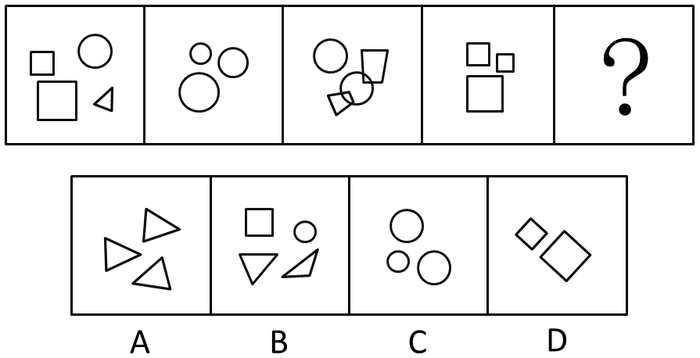
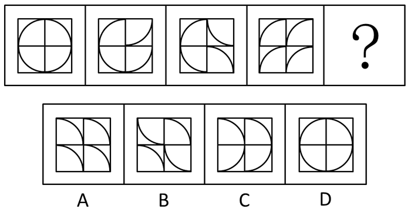
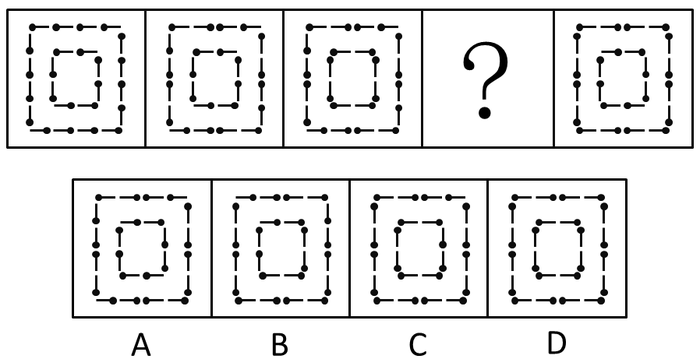
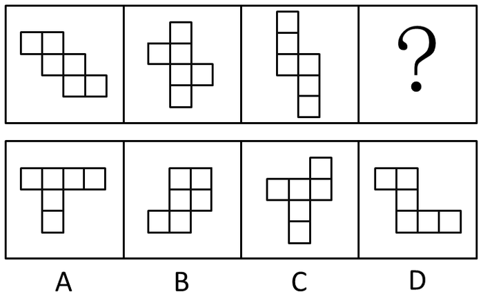
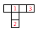
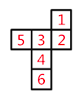
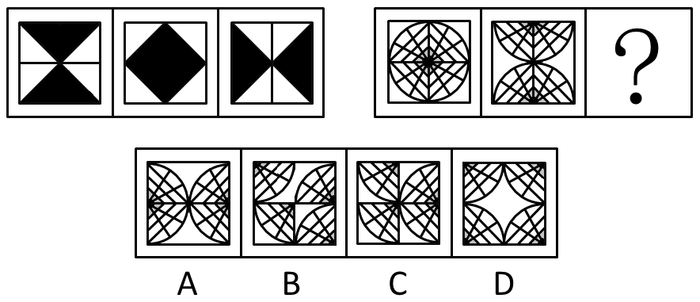
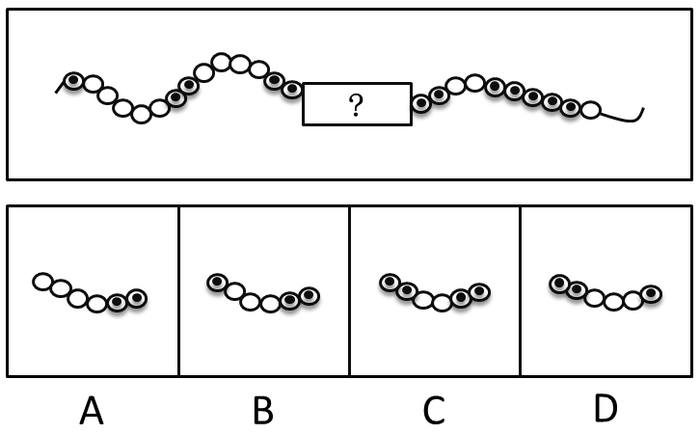

# 2016年广东省公务员录用考试《行测》题（乡镇）

> 判断推理 · 30 题 · 广东 2016

## 第 1 题　qid 1796668 · 图形推理

从所给四个选项中，选择最合适的一个填入问号处，使之呈现一定的规律性。

- **A**. A
- **B**. B　✅
- **C**. C
- **D**. D

**答案**：B

**官方解析**

图形元素组成不同，且都由多个小元素构成，优先考虑数元素的个数和种类。元素个数分别为4、3、4、3，则问号处图形应包含4个元素，只有B项符合。
故正确答案为B。

---

## 第 2 题　qid 1796670 · 图形推理

 从所给四个选项中，选择最合适的一个填入问号处，使之呈现一定的规律性。

- **A**. A
- **B**. B　✅
- **C**. C
- **D**. D

**答案**：B

**官方解析**

图形元素组成相同，优先考虑位置规律。将题干图形的每个格子分开观察发现，右上角的方块从第二个图形开始每次顺时针旋转90度，右下角的方块从第三个图形开始每次逆时针旋转90度，左下角的方块从第四个图形开始每次顺时针旋转90度，按照此规律，左上角的方块从第五个图形开始逆时针旋转90度，只有B项符合。
故正确答案为B。

---

## 第 3 题　qid 1796672 · 图形推理

从所给四个选项中，选择最合适的一个填入问号处，使之呈现一定的规律性。

- **A**. A　✅
- **B**. B
- **C**. C
- **D**. D

**答案**：A

**官方解析**

图形组成相同，每个图形仅有一个黑色部分，且位置不同，考虑小黑块的位置。

观察题干可发现，小黑块移动规律如下图所示：

每次移动的步数分别为1、2、1，则接下来小黑块移动两步，在右边黑色菱形上。

故正确答案为A。

---

## 第 4 题　qid 1796674 · 图形推理

从所给四个选项中，选择最合适的一个填入问号处，使之呈现一定的规律性。

- **A**. A
- **B**. B
- **C**. C
- **D**. D　✅

**答案**：D

**官方解析**

图形组成相同，都是由24根火柴棍组成，考虑位置规律。
从图1到图2，外圈有4根火柴棍方向发生了改变，且内圈的火柴棍方向均没有发生变化。从图2到图3，内圈有4根火柴棍方向发生了改变，且外圈的火柴棍方向均没有发生变化，依此规律，图3到图4外圈应有4根火柴方向发生改变，内圈应保持不变，D项符合规律。
故正确答案为D。

---

## 第 5 题　qid 1796686 · 图形推理

从所给四个选项中，选择最合适的一个填入问号处，使之呈现一定的规律性。

- **A**. A
- **B**. B
- **C**. C　✅
- **D**. D

**答案**：C

**官方解析**

图形组成不同，即黑块的数量不同，考虑数数。题干三个图中，黑方块的个数分别为：12、11、11，没有任何规律，数量上不存在规律，只能考虑其他规律。仔细观察发现，第一个图和第二个图有6个黑块的位置是相同的，第二个图和第三个图有5个黑块的位置是相同的，我们尝试在选项当中寻找跟第三个图有4个黑块位置相同的选项，发现：A选项有5个位置相同；B选项有9个位置相同；C选项有4个位置相同；D选项有6个位置相同。
故正确答案为C。

---

## 第 6 题　qid 1796676 · 图形推理

从所给四个选项中，选择最合适的一个填入问号处，使之呈现一定的规律性。

- **A**. A
- **B**. B
- **C**. C　✅
- **D**. D

**答案**：C

**官方解析**

观察题干图形全都是6个正方形组成，且全都可以折成一个正六面体（即题干图形都可以看成是一个正六面体的展开图形），观察选项：

A选项：如图，根据相对面特征可知，面1与面2是相对面，且面1与面3也是相对面，不符合六面体折合特征，排除。

B选项：如图，根据相对面特征可知，面1与面3是相对面，面2与面3也是相对面，不符合六面体折合特征，排除。

C选项：如图，根据相对面特征可知，面1与面4，面2与面5，面3与面6分别为三组相对面，符合六面体折合特征，为正确选项。

D选项：如图，根据相对面特征可知，面1与面2是相对面，且面1与面3也是相对面，不符合六面体折合特征，排除。

A、B、D均不能折成正六面体，只有C选项可以折成。

故正确答案为C。

---

## 第 7 题　qid 1796678 · 图形推理

从所给四个选项中，选择最合适的一个填入问号处，使之呈现一定的规律性。

- **A**. A
- **B**. B　✅
- **C**. C
- **D**. D

**答案**：B

**官方解析**

本题元素组成完全相同，考查位置变化。每幅图都由田字格中的四个图形构成，观察左下角图形始终不动，左上角图形从左到右，依次顺时针旋转90度，可以排除C、D选项；右上角图形依次进行180度旋转（或看成依次上下翻转）；右下角图形应该是从左到右依次逆时针旋转90度，只有B项符合。
故正确答案为B。

---

## 第 8 题　qid 1796680 · 图形推理

从所给四个选项中，选择最合适的一个填入问号处，使之呈现一定的规律性。

- **A**. A
- **B**. B　✅
- **C**. C
- **D**. D

**答案**：B

**官方解析**

元素组成相似，考虑样式规律里的黑白运算，但不存在规律。其次考虑数黑格个数，整体也不存在规律。观察每个图均分为上下两行，分别数出上下两行黑格的个数，发现每一幅图中，上下两行的黑格个数之差始终为1，只有B项符合。
故正确答案为B。

---

## 第 9 题　qid 1796682 · 图形推理

从所给四个选项中，选择最合适的一个填入问号处，使之呈现一定的规律性。

- **A**. A
- **B**. B
- **C**. C
- **D**. D　✅

**答案**：D

**官方解析**

本题元素组成完全相同，考查位置变化。
观察左边图形，将每幅图看成由四个黑色小三角形组成。从图1到图2，图1中上面两个黑三角上下翻转，下面两个黑三角上下翻转得到图2；再将图2看成左边两个黑三角左右翻转，右边两个黑三角左右翻转得到图3。因此右边图形应遵循同样规律，每幅图看成由四个扇形图形组成，从图1到图2，上面两个扇形上下翻转，下面两个扇形上下翻转。从图2到图3，左边两个扇形左右翻转，右边两个扇形左右翻转得到选项D。
故正确答案为D。

---

## 第 10 题　qid 1796684 · 图形推理

从所给四个选项中，选择最合适的一个填入问号处，使之呈现一定的规律性。

- **A**. A
- **B**. B　✅
- **C**. C
- **D**. D

**答案**：B

**官方解析**

本题只有两种元素，黑圈和白圈，观察选项中的黑圈白圈个数存在不同，考虑数数。题干中除了问号处，已知相连黑圈的个数分别为1，2，X，X，5，由此可知，与选项结合后的最终图形中，中间两个X应该分别有3个黑圈相连和4个黑圈相连，而题干问号前后已经各有两个黑圈，选择的选项中左端应该有1个黑圈，右端有2个，只能选B项。将B项代入整体观察后，发现相连的白圈个数也满足等差数列依次递减的规律，分别是5，4，3，2，1。
故正确答案为B。

---

## 第 11 题　qid 1796590 · 类比推理

天空：蔚蓝

- **A**. 气氛：融洽　✅
- **B**. 土地：耕种
- **C**. 茶叶：保健
- **D**. 河流：灌溉

**答案**：A

**官方解析**

第一步：判断题干词语间逻辑关系。
天空是名词，蔚蓝是形容词，后者形容前者，可以造句子成蔚蓝的天空。
第二步：逐一分析选项。
A项：气氛是名词，融洽是形容词，且融洽是形容气氛的，可以造句子成融洽的气氛，与题干逻辑关系一致。
B项：土地是名词，耕种是动词，词性与题干不符，且耕种不能形容土地，与题干逻辑关系不一致，排除。
C项：保健不能形容茶叶，与题干逻辑关系不一致，排除。
D项：河流有灌溉功能，灌溉不能形容河流，与题干逻辑关系不一致，排除。
故正确答案为A。

---

## 第 12 题　qid 1796478 · 类比推理

蜡烛：电灯

- **A**. 椅子：写字台
- **B**. 茶杯：饮水机
- **C**. 拖把：吸尘器　✅
- **D**. 电视：计算机

**答案**：C

**官方解析**

第一步：判断题干词语间逻辑关系。
蜡烛和电灯两者功能相同，都是照明，且蜡烛是非电力驱动，电灯是电力驱动。 
第二步：逐一分析选项。
A项：椅子的功能是供人坐着工作和休息，而写字台的功能是供人伏案写作，两者功能不一样，与题干逻辑关系不一致，排除；
B项：茶杯是盛茶水的用具，饮水机是升温或降温并方便人们饮用的装置，两者功能不一样，与题干逻辑关系不一致，排除；
C项：拖把的功能是擦除地面灰尘，吸尘器的功能也是清除地面灰尘，且拖把是非电力驱动，吸尘器是电力驱动，与题干逻辑关系一致；
D项：电视机的功能是播放节目，而计算机的功能不仅仅是播放节目，还可以用于办公、研究等方面，与题干逻辑关系不一致，排除。
故正确答案为C。

---

## 第 13 题　qid 1796480 · 类比推理

富裕：扶贫

- **A**. 干燥：抽湿　✅
- **B**. 蒙昧：教育
- **C**. 落后：推进
- **D**. 健康：保卫

**答案**：A

**官方解析**

第一步：判断题干词语间逻辑关系。
富裕的反义词是贫穷，扶贫是解决贫穷的方式和手段，扶贫是动宾结构。
第二步：逐一分析选项。
A项：干燥的反义词是潮湿，抽湿是解决潮湿的方式和手段，抽湿是动宾结构，与题干逻辑关系一致，当选。
B项：蒙昧的反义词是文明，教育不是动宾结构，与题干逻辑关系不一致，排除。
C项：落后的反义词是先进，但是推进是推动前进，并不是推动先进，与题干逻辑关系不一致，排除。
D项：保卫健康是动宾关系，但是与题干逻辑关系不一致，排除。
故正确答案为A。

---

## 第 14 题　qid 1796484 · 类比推理

干旱：沙漠

- **A**. 笔直：树干
- **B**. 坚硬：水泥
- **C**. 寒冷：南极　✅
- **D**. 多雨：赤道

**答案**：C

**官方解析**

第一步：判断题干词语间逻辑关系。
干旱是沙漠的必然属性。
第二步：逐一分析选项。
A项：树干不一定笔直，与题干逻辑关系不一致，排除；
B项：水泥不一定坚硬（比如还没凝固的状态），与题干逻辑关系不一致，排除；
C项：南极一定是寒冷的，与题干逻辑关系一致，当选；
D项：赤道不一定是多雨的，赤道穿过不同气候类型的地区，不是所有地区都多雨，与题干逻辑关系不一致，排除。
故正确答案为C。

---

## 第 15 题　qid 1796488 · 类比推理

菜刀：食物

- **A**. 子弹：枪支
- **B**. 毛巾：身体　✅
- **C**. 铅笔：书籍
- **D**. 窗帘：窗户

**答案**：B

**官方解析**

第一步：判断题干词语间逻辑关系。
菜刀的功能主要是用来切食物。
第二步：逐一分析选项。
A项：子弹和枪支是配套使用的，是对应关系，与题干逻辑关系不一致，排除；
B项：毛巾的主要功能是擦身体，与题干逻辑关系一致；
C项：铅笔的主要功能是写字，与书籍无关，与题干逻辑关系不一致，排除；
D项：窗帘的主要功能是遮挡光线，而不是窗户，与题干逻辑关系不一致，排除。
故正确答案为B。

---

## 第 16 题　qid 2033252 · 类比推理

玉石：雕琢：玉器

- **A**. 蚕丝：织造：丝绸　✅
- **B**. 粮食：酿造：美酒
- **C**. 生铁：冶炼：钢材
- **D**. 蚊香：点燃：烟雾

**答案**：A

**官方解析**

第一步：分析题干词语的逻辑关系。
玉石指未经雕琢的玉，玉石经过雕琢成为玉器，且发生的是物理变化，题干三词为原材料、工艺和成品之间的对应。
第二步：逐一分析选项。
A选项：蚕丝经过织造成为丝绸，且发生的是物理变化，为原材料、工艺和成品之间的对应，与题干逻辑关系一致，当选；
B选项：粮食经过酿造成为美酒，为原材料、工艺和成品之间的对应，但是在这个过程中发生了化学变化，酿酒经过了发酵的过程，通过化学变化生成乙醇，与题干逻辑关系不一致，排除；
C选项：生铁通过冶炼成为钢材，为原材料、工艺和成品之间的对应，但中间存在化学变化，与题干逻辑关系不一致，排除；
D选项：点燃蚊香产生烟雾，烟雾不是一种成品，与题干逻辑关系不一致，排除。
故正确答案为A。

---

## 第 17 题　qid 1796506 · 类比推理

站台：码头：停机坪（）

- **A**. 现金：支票：银行卡　✅
- **B**. 软件：硬件：互联网
- **C**. 外套：婚纱：羽绒服
- **D**. 演员：群众：主持人

**答案**：A

**官方解析**

第一步：分析题干词语的逻辑关系。
站台是城市轨道交通高架车站或高铁、火车站供上下乘客及装卸货物的平台。码头是海边、江河边专供乘客上下、货物装卸的平台。停机坪是供直升机起降的平台。三者之间为并列关系，并且存在功能上的相似。
第二步：逐一分析选项。
A选项：现金、支票、银行卡都具有支付的功能，三者属于并列关系，与题干逻辑关系一致，当选。
B选项：软件与硬件是并列关系，但与互联网无明显的逻辑关系，与题干逻辑关系不符，排除。
C选项：外套和婚纱无明显的逻辑关系，羽绒服与外套为种属关系，与题干逻辑关系不符，排除。
D选项：演员的主要职业是表演，与群众在职能上没有明显相似关系，主持人的职能是主持活动，三者之间在职能上与题干逻辑关系不符，排除。
故正确答案为A。

---

## 第 18 题　qid 1796518 · 类比推理

沙龙：志趣相投

- **A**. 论坛：千言万语
- **B**. 擂台：针锋相对　✅
- **C**. 网站：集思广益
- **D**. 枢纽：承上启下

**答案**：B

**官方解析**

第一步：判断题干词语间逻辑关系。
沙龙是一种聚会形式，沙龙为志趣相投的人进行交流提供平台，志趣相投是沙龙参与者的特征，二者为平台与参与者特征的对应关系。
第二步：判断选项词语间逻辑关系。
A项：论坛是网民发表不同意见的平台，但是千言万语不是网民的特征，二者不是平台与参与者特征的对应关系，与题干逻辑关系不一致，排除；
B项：擂台指为比赛搭建的平台，擂台为针锋相对的人提供比试的平台，针锋相对是擂台比赛者的特征，二者为平台与参与者特征的对应关系，与题干逻辑关系一致，当选；
C项：网站可以用来集思广益，二者为功能对应关系，与题干逻辑关系不一致，排除；
D项：枢纽有承上启下的作用，二者为功能对应关系，与题干逻辑关系不一致，排除。
故正确答案为B。

---

## 第 19 题　qid 1796526 · 类比推理

陈词滥调：老生常谈

- **A**. 按部就班：循序渐进
- **B**. 博闻强识：见多识广
- **C**. 见义勇为：助人为乐
- **D**. 八面玲珑：面面俱到　✅

**答案**：D

**官方解析**

第一步：分析题干词语的逻辑关系。
陈词滥调指没有新意，陈腐、空泛的论调，形容语言陈腐，含有贬义。老生常谈比喻人们听惯了的没有新鲜意思的话，二者为近义词，但是前者为贬义词，后者为中性词。
第二步：逐一分析选项。
A选项：按部就班指按照一定的条理、步骤做事，为中性词。循序渐进是指依照次序或步骤逐步深入或提高，为中性词。二者为近义词但是感情色彩相同，都是中性词，与题干不完全一致，排除；
B选项：博闻强识指见闻广博，记忆力强。见多识广指见过的多，知道的广，形容阅历深，经验多。二者为近义词关系，但是二者从感情色彩上来看都是褒义的，与题干不完全一致，排除；
C选项：见义勇为是指看到正义的事情奋勇地去做。助人为乐指帮助别人就会很快乐。二者不是近义关系，与题干逻辑关系不一致，排除；
D选项：八面玲珑形容为人处世圆滑，待人接物各方面都能巧妙应对，常用于指能讨好各种人物，含贬义。面面俱到指各方面都照顾得很周到，为中性词，与八面玲珑为近义词关系，且感情色彩一个贬义一个中性，与题干逻辑关系一致，当选。
故正确答案为D。

---

## 第 20 题　qid 1796532 · 类比推理

吹毛求疵：鸡蛋里面挑骨头

- **A**. 赶鸭子上架：牛不喝水强按头
- **B**. 敬酒不吃吃罚酒：不识抬举
- **C**. 舍本逐末：捡了芝麻丢了西瓜　✅
- **D**. 福无双至：屋漏偏逢连夜雨

**答案**：C

**官方解析**

第一步：分析题干词语的逻辑关系。
吹毛求疵为成语，比喻故意挑剔别人的缺点。鸡蛋里挑骨头为歇后语，意为故意找茬，与吹毛求疵同义。两者为近义词关系，且第一个词为四字成语，第二个词为歇后语。
第二步：逐一分析选项。
A选项：赶鸭子上架为歇后语，意为强人所难，牛不喝水强按头属于复句式成语，比喻用强迫手段使就范，二者为近义词，但是前者是歇后语，后者是成语，两个词的位置反了，与题干逻辑关系不一致，排除。
B选项：敬酒不吃吃罚酒比喻不识抬举，但是前者是歇后语，后者是成语，两个词的位置反了，与题干逻辑关系不一致，排除。
C选项：舍本逐末为成语，指抛弃根本，追求枝节，比喻做事不注意根本，而只抓细微末节。捡了芝麻，丢了西瓜指抓住了小的，却把大的给丢了；重视了次要的，却把主要的给忽视了。比喻做事因小失大，得不偿失。捡了芝麻丢了西瓜为歇后语，与舍本逐末同义。前者是四字成语，后者是歇后语，与题干逻辑关系一致，当选。
D选项：福无双至指幸运事不会连续到来，屋漏偏逢连夜雨为歇后语，对应的应该是祸不单行，指不幸的事接二连三地发生，而不是福无双至，二者意思不同，与题干逻辑关系不一致，排除。
故正确答案为C。

---

## 第 21 题　qid 1796542 · 类比推理

某县计划引进一种生长快、肉质好的良种牛，在本县推广养殖，以提高农民养牛的经济收益。
以下最能对该计划可行性提出质疑的是（  ）。

- **A**. 该良种牛不适应当地气候　✅
- **B**. 当地农民养牛的积极性不高
- **C**. 该良种牛的养殖成本较高
- **D**. 当地农民没有饲养过该良种牛

**答案**：A

**官方解析**

第一步：找到论点论据。
论点：某县计划引进一种生长快、肉质好的良种牛，在本县推广养殖，以提高农民养牛的经济效益。
论据：没有论据。
第二步：逐一分析选项。
A项：该良种牛不适合当地气候，说明当地根本不适合饲养该种牛，直接否定了该做法的可行性，具有削弱作用；
B项：当地农民养牛的积极性不高，推广的时候会遇到一定阻碍，影响计划的可行性，具有削弱作用；
C项：该良种牛的养殖成本较高，在一定程度上对此计划的可行性设置了障碍，具有削弱作用；
D项：当地农民没有饲养过该良种牛，说明经验不足，会影响计划的可行性，具有削弱作用。
A、B、C、D四项都具有削弱作用，因此需要进行比较，选择削弱力度最强的。A项气候不适应这一条件是人为很难改变的，是对必要条件的削弱，相比较下质疑力度最强；B项积极性可以采取措施提高；C项成本高可以通过其他渠道降低；D项没经验可以传授经验，相比较而言，B、C、D三项的削弱力度都不及A项。
故正确答案为A。

---

## 第 22 题　qid 1796576 · 逻辑判断

老张为了试验某品牌化肥的效果，把自家的稻田分成东边、西边两块，在东边地块施肥，西边地块不施肥。水稻收割后，东边地块亩产700公斤，西边地块亩产400公斤。因此，该品牌化肥能有效增产。
以下最能反驳上述论证的是（    ）。

- **A**. 东边地块的土壤肥力原本就比西边地块高　✅
- **B**. 东西两块地种植的是同一种品种的水稻
- **C**. 东边地块的水稻遭受过病虫害
- **D**. 老张收割西边地块的水稻先于东边地块

**答案**：A

**官方解析**

第一步：找出论点和论据。
“因此”引出论点：该品牌化肥能有效增产。“······能······”论点包含因果关系，属于因果论证。
论据：把自家的稻田分成东边、西边两块，在东边地块施肥，西边地块不施肥。水稻收割后，东边地块亩产700公斤，西边地块亩产400公斤。
第二步：逐一分析选项。
A项：指出东边地块的土壤肥力原本就比西边地块高，说明了两块地本身的性质就不一样，而土壤自身肥力也是可能带来增产的原因，属于另有他因，当选。
B项：指出东、西两块地种植的是同一品种的水稻，说明水稻的一致性，排除了其他影响因素，属于加强选项，排除。
C项：指出东边地块水稻遭受过病虫害，说明在遭受虫害的情况下还能高产，更证明了化肥增产的功效，属于加强选项，排除。
D项：指出西边和东边水稻的收割时间有差异，但先收割和后收割对水稻产量的影响没有明确说明，不如A项直接，排除。
故正确答案为A。

---

## 第 23 题　qid 1796482 · 逻辑判断

全球气候变暖给人类带来诸多影响的同时也影响着地球上的其他生物，降水的增加可以改善植被，从而有利于鼠类的增长。研究表明，降水的增加使原本干旱的内蒙古地区植物更加丰富，也增加了鼠类的食物，长爪沙鼠数量随之增加。
以下最能削弱上述论断的一项是（    ）。

- **A**. 据统计，一些地区的植被覆盖率并没有增加
- **B**. 据测算，全球沙漠化面积近年有所增加
- **C**. 内蒙古地区植被的增加和近年的生态保护有很大关系
- **D**. 植被的增加使各种动物包括鼠类的天敌都增加了　✅

**答案**：D

**官方解析**

第一步：找到论点论据。
论点：全球气候变暖给人类带来诸多影响的同时也影响着地球上的其他生物，降水的增加可以改善植被，从而有利于鼠类的增长。
论据：降水的增加使原本干旱的内蒙古地区植物更加丰富，也增加了鼠类的食物，长爪沙鼠数量随之增加。
第二步：逐一分析选项。
A项：一些地区的植被覆盖率并没有增加，为无关选项，题干中讲的是使植物更加丰富，改善植被，和植被覆盖率无关，排除；
B项：全球沙漠化面积今年有所增加和题干论证无关，排除；
C项：内蒙古地区植被的增加和近年的生态保护有很大关系，削弱了论据中提到的植物丰富是由于降水，为他因削弱，保留；
D项：植被的增加使各种动物包括鼠类的天敌都增加了，天敌增加否定了其有利于鼠类的增长，否定论点，保留。
C、D两项进行比较，C项属于他因削弱，D项属于否定论点，否定论点强于他因削弱，故排除C项。
故正确答案为D。

---

## 第 24 题　qid 1796498 · 逻辑判断

根据人事部门的数据，某单位的女性员工多于男性员工。中共党员员工多于政治面貌为群众的员工。（该单位员工政治面貌只有中共党员和群众两种情况）
下列判断一定正确的是（    ）。

- **A**. 政治面貌为群众的女性员工多于政治面貌为群众的男性员工
- **B**. 政治面貌为中共党员的男性员工多于政治面貌为中共党员的女性员工
- **C**. 政治面貌为中共党员的女性员工多于政治面貌为群众的男性员工　✅
- **D**. 政治面貌为群众的男性员工多于政治面貌为中共党员的男性员工

**答案**：C

**官方解析**

将题干中提到的情况一一列出来，分别有两类情况，第一类：女性员工和男性员工，第二类：政治面貌为中共党员和群众，这两类中的两种情况非此即彼，接下来我们可以根据题中已知的条件列出3个算式：
女性员工多于男性员工：
1.女（党员+群众）＞男（党员+群众）
女党员+女群众＞男党员+男群众
中共党员员工多于政治面貌为群众的员工：
2.党员（男+女）＞群众（男+女）
男党员+女党员＞男群众+女群众
那么将1+2合起来得到：
3.女党员+女群众+男党员+女党员＞男党员+男群众+男群众+女群众
算式两边相互抵消得到：
女党员＞男群众，选C项。
故正确答案为C。

---

## 第 25 题　qid 1796510 · 逻辑判断

随着网络的普及，电子版图书也越来越多，其中包括电子版的文学名著，而且价格很低。人们只要打开电脑，在网上几乎可以浏览到任何一本名著。电子版文学名著的问世，会改变大众的阅读品味，有利于造就高素质读者群体。
以下最能削弱上述结论的一项是（    ）。

- **A**. 对文学没有兴趣的人不会因为文学名著的价钱高低或者是否方便而阅读文学名著　✅
- **B**. 文学名著的普及率一直不如娱乐杂志、时事报刊等大众读物
- **C**. 许多读者认为阅读电子书籍的感觉不如阅读印刷书籍的那么好，宁愿选择印刷版读物
- **D**. 在互联网上阅读文学名著仍然需要收费

**答案**：A

**官方解析**

第一步：找到论点论据。
论点：电子版文学名著的问世，会改变大众的阅读品味，有利于造就高素质读者群体。
论据：随着网络的普及，电子版图书也越来越多，其中包括电子版的文学名著，而且价格很低。人们只要打开电脑，在网上几乎可以浏览到任何一本名著。
第二步：逐一分析选项。
A项：对文学没有兴趣的人不会因为文学名著的价钱高低或者是否方便而阅读文学名著，说明了电子版名著的问世无法改变人的兴趣和习惯，喜欢读的还是读，不喜欢读还是不读，直接否定了题干论点中提到的能改变大众阅读品味，有利于造就高素质读者群体，也将论据和论点之间进行了拆桥，力度最大，当选；
B项：文学名著的普及率一直不如娱乐杂志时事报刊等大众读物，和题干中提到的电子版文学名著无关，为无关项，排除；
C项：许多读者认为阅读电子书籍的感觉不如阅读印刷书籍那么好，宁愿选择印刷版读物，这些读者，并非题干讨论的主体——即阅读品味改变、素质提高的群体。题干讨论的群体，应该是本身就不读名著（包括纸质版名著和电子版名著）的人，由于有了数量多、价格便宜且方便的电子版文学名著问世，从而开始读电子版名著，所以电子版名著改变的是这些人的品味和素质，选项的主体与题干的主体不一致，排除；
D项：在互联网上阅读文学名著仍然需要收费，题干中说到电子版的文学名著价格很低，也就是原本就是收费的，不能质疑，排除。
故正确答案为A。

---

## 第 26 题　qid 1796520 · 类比推理

有研究表明，运动，特别是大量运动，会提高人体内血清基的水平。在某种程度上，人的心情由体内血清基的水平决定。抗抑郁药物可以通过提高体内血清基的水平来起作用。
下列论断一定正确的是（    ）。
I.提高体内血清基水平，要么大量运动，要么吃抗抑郁药物。
II.人的心情，可能由运动量决定，也可能受抗抑郁药物影响。
III.大量运动会影响人的心情，或影响抗抑郁药物的疗效。

- **A**. I
- **B**. II
- **C**. I和II
- **D**. II和III　✅

**答案**：D

**官方解析**

题干中写的是体内的血清基水平可以决定人的心情，大量运动和抗抑郁药物都可以影响体内血清基水平。题干只是说大量运动和抗抑郁药物都可以影响体内血清基水平，并没有说只有这两者可以提高体内的血清基水平。
第一句话，说得太绝对，错误。
第二句话，题干中提到了大量运动可以提高血清基水平，抗抑郁药物也可以提高血清基水平，而血清基水平一定程度决定人的心情，因此可以得到，正确。
第三句话，大量运动会影响人的心情是对的，大量运动影响抗抑郁药物的疗效并不能从原文中推导出来，但是这两者是或关系，一真全真，所以第三句话也一定是正确的。
故正确答案为D。

---

## 第 27 题　qid 1796538 · 逻辑判断

气候与经济发展具有密切关系。在欧洲，北部气候较冷的国家总体上比南部国家发达；在美洲，加拿大和美国比南部的墨西哥发达；在亚洲，韩国的GDP是东南亚所有国家的总和。之所以有这种差别，是因为寒冷地区的人们为了生存，大脑会进一步地复杂化，而热带的人们，由于食物充足，大脑失去了进一步进化的动力。
以下最能削弱上述论断的一项是（ ）

- **A**. 人类共有的惰性使任何地区的人都类似
- **B**. 寒冷地区的人并不比热带的人智商高
- **C**. 经济的发达与文化的繁荣没有必然联系
- **D**. 获取食物并不是人类主要的脑力活动　✅

**答案**：D

**官方解析**

第一步：找出论点和论据。
论点：气候会影响经济发展，北部寒冷地区的经济比南部热带地区的经济发达。
论据：解释原因——通过对比，说明气候影响食物数量，进而影响头脑活动。
第二步：逐一分析选项。
A项：共同惰性使任何地区的人都类似，与题干中提到的气候与经济的关系，以及气候与食物数量和头脑活动之间的关系都没有明确的对应，而是重打锣鼓另开张，提出了一个新的因素即惰性，也没有提出类似的人，在大脑活动方面是否有差异，不够明确，需要与其他选项做比较，保留；
B项：强调寒冷地区的人不比热带地区人智商高，与寒冷地区人们的大脑是否更复杂无关，无法削弱，排除；
C项：讨论的是经济与文化的关系，与气候和经济的关系无关，无法削弱，排除；
D项：获取食物不是人类主要的脑力活动，否定了论据中食物数量与头脑活动的关系，相对A项来说，更为直接的削弱论据，当选。
故正确答案为D。
注：本题AD两个选项都不是特别明确，所以争议较大。
从揣摩命题设置的角度来看的。无论是论点还是论据，都是在讨论气候和其他因素之间的关系。论点是气候和经济，论据是气候和食物和头脑活动。所以，他的内在联系就是，气候-食物-头脑-经济。
而无论是A项，还是D项，能看出来，他是在什么和头脑之间做文章。也就是说，他默认了气候和食物，头脑和经济之间的关系。D项和A项，一个说食物和头脑没那么直接的关系，一个说另一因素跟人之间的关系。
人相似，我们每个人确实都挺相似的，但是，头脑就都一样吗？所以他没有直接说到头脑活动的D项具体。而另一因素，也没有直接说食物跟原文更直接。
所以，从以上几点揣摩，粉笔认为D更符合命题人的意图。

---

## 第 28 题　qid 1796552 · 类比推理

我国以占世界的耕地养活了占世界的人口，其中年平均生产大豆1200万吨左右。同时，还利用国外的耕地、国外的农民，继续开放市场，降低关税或免除关税，年平均进口大豆5800万吨左右。更多利用国外的资源来让我国人民生活得更好。

以上论断基于下列假设，除了：

- **A**. 大量进口粮食不会带来粮食安全问题
- **B**. 政府相关部门对进口粮食严把质量关
- **C**. 进口粮食的价格能被国内群众所接受
- **D**. 大量进口粮食损害了国内生产者的利益　✅

**答案**：D

**官方解析**

第一步：找到论点论据。
论点：利用国外的资源能让我国人民生活得更好。
论据：无。
本题无论据，提问为假设，则优先考虑必要条件，因本题为加强选非题，则可找出三个加强项进行排除，剩下的选项即为正确答案。
第二步：逐一分析选项。
A项：大量进口粮食不会带来粮食安全问题，说明粮食是可放心食用的，所以国外的资源确实可以让我国人民生活得更好，可以加强，排除；
B项：政府对进口粮食严把质量关，说明政府对进口粮食要求高，是为了人民生活得更好所做出的努力，可以加强，排除；
C项：价格能被国内群众接受，说明进口粮食的价格在群众能力承受范围之内，给国内群众带来了更多的选择，可以让我国人民生活得更好，可以加强，排除；
D项：进口粮食损害了国内生产者的利益，说明进口粮食损害了我国部分人民，此部分人民不会生活得更好，削弱项，不能加强，当选。
本题为选非题，故正确答案为D。

---

## 第 29 题　qid 1796562 · 逻辑判断

一项研究发现：经常喝咖啡的成年人患上心脏病的概率是不常喝咖啡成年人患心脏病概率的2.5倍。由此可以判定，咖啡中的某种物质能够导致人患上心脏疾病。
以下最能削弱上述结论的一项是（  ）。

- **A**. 咖啡含有提高心脏活力的成分
- **B**. 用餐时喝咖啡有降低血脂的作用
- **C**. 心脏病高危人群更容易爱上喝咖啡　✅
- **D**. 爱喝咖啡的人大都性格开朗，喜欢运动

**答案**：C

**官方解析**

第一步：找到论点论据。
论点：咖啡中的某种物质能够导致人患上心脏病。
论据：经常喝咖啡的成年人患心脏病的概率比不喝的高。
第二步：逐一分析选项。
A项：咖啡中含有提高心脏活力的成分，但是提高心脏活力与患心脏病之间没有必然的联系，有可能活力高更容易患病，因此属于不明确选项。
B项：用餐时喝咖啡能降低血脂，这与心脏病没有直接的关系，因此属于无关选项，排除。
C项：心脏病高危人群更容易爱上喝咖啡，说明是因为心脏病才爱喝咖啡，并不是因为喝咖啡导致心脏病，属于因果倒置，能够削弱论证，当选。
D项：爱喝咖啡的人开朗、喜欢运动，与患心脏病无关，属于无关项，排除。
故正确答案为C。

---

## 第 30 题　qid 1796580 · 类比推理

液体都能够流动。水能够流动，所以水是液体。
以下与上述推理在结构上最为相似的一项是（  ）。

- **A**. 哲学家都爱思考。李教授是哲学家，所以他爱思考
- **B**. 哺乳类动物都是恒温动物。蛇不是哺乳类动物，所以蛇不是恒温动物
- **C**. 平板电脑都有触摸屏。手机有触摸屏，所以手机是平板电脑　✅
- **D**. 工作态度端正就能取得好的业绩。小刘取得好业绩，所以他工作态度端正

**答案**：C

**官方解析**

第一步：分析题干推理形式。

题干翻译为：液体流动，水流动，所以水液体，逻辑结构为“肯后推肯前”。

第二步：逐一分析选项。

A项：翻译为：哲学家爱思考，李教授哲学家，所以李教授爱思考，逻辑结构为“肯前推肯后”，与题干推理形式不一致，排除；

B项：翻译为：哺乳类动物恒温动物，蛇哺乳类动物，所以蛇恒温动物，逻辑结构为“否前推否后”，与题干推理形式不一致，排除；

C项：翻译为：平板电脑触摸屏，手机触摸屏，所以手机平板电脑，逻辑结构为“肯后推肯前”，与题干推理形式一致，保留；

D项：翻译为：工作态度端正取得好成绩，小刘取得好成绩，所以小刘工作态度端正，逻辑结构为“肯后推肯前”，与题干推理形式一致，保留。

比较C、D两项，C项第一句与题干第一句均为“······都······”，而D项第一句为“······就······”，因此C项的推理句式与题干更为一致。

故正确答案为C。

---
