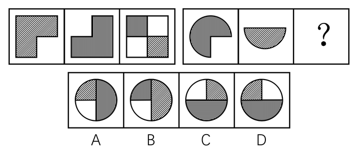
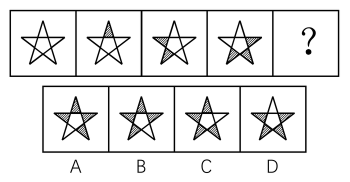
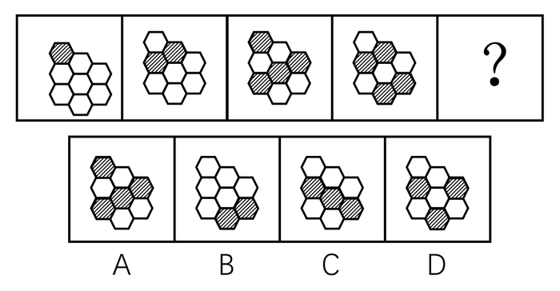
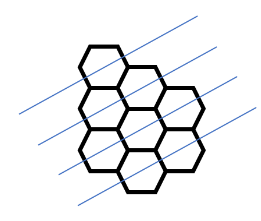
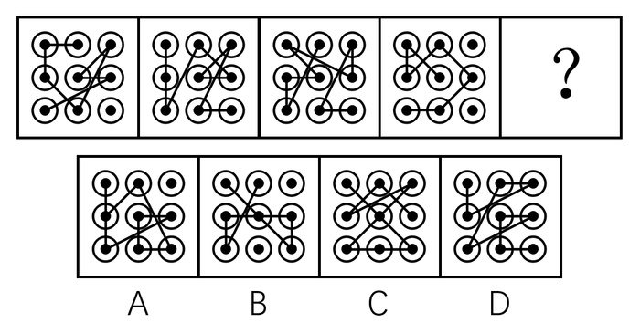
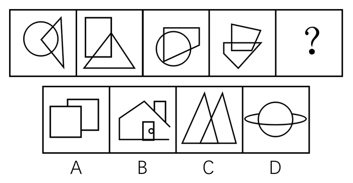
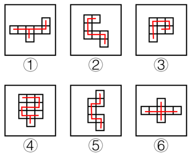

# 2016年广州市公务员录用考试《行测》题

> 判断推理 · 30 题 · 广州市考 2016

## 第 1 题　qid 2062658 · 类比推理

纸：书与（    ）在内在逻辑关系上最为相似。

- **A**. 竹：筏　✅
- **B**. 雨：衣
- **C**. 叶：树
- **D**. 河：海

**答案**：A

**官方解析**

第一步：判断题干词语间逻辑关系。
纸是制作书的原材料，二者为原材料和成品的对应关系。
第二步：判断选项词语间逻辑关系。
A项：竹是制作筏的原材料，二者为原材料和成品的对应关系，与题干逻辑关系一致，当选；
B项：雨和衣之间没有明显的逻辑关系，与题干逻辑关系不一致，排除；
C项：叶是树的组成部分，二者为包容关系中的组成关系，与题干逻辑关系不一致，排除；
D项：河和海是并列关系，与题干逻辑关系不一致，排除。
故正确答案为A。

---

## 第 2 题　qid 2062662 · 类比推理

火：烹饪与（    ）在内在逻辑关系上最为相似。

- **A**. 雾：驾驶
- **B**. 水：洗涤　✅
- **C**. 风：晴天
- **D**. 磁：力量

**答案**：B

**官方解析**

第一步：判断题干词语间逻辑关系。
用火来烹饪，二者为对应关系。
第二步：判断选项词语间逻辑关系。
A项：雾不能用来驾驶，不符合题干的逻辑关系，排除；
B项：用水来洗涤，二者为对应关系，符合题干的逻辑关系，当选；
C项：风和晴天没有必然的关系，不符合题干的逻辑关系，排除；
D项：磁是物质能吸引铁、镍等金属的性质，磁是一种力量，二者为种属关系，不符合题干的逻辑关系，排除。
故正确答案为B。

---

## 第 3 题　qid 2062668 · 类比推理

油：（    ）与（    ）：车在内在逻辑关系上最为相似。

- **A**. 炒，开
- **B**. 香，快
- **C**. 锅，人　✅
- **D**. 水，马

**答案**：C

**官方解析**

逐一代入选项。
A项：油是炒菜的佐料，开车是一个动词，前后逻辑关系不一致，排除；
B项：油和香为或然属性关系，车的速度可能是快的，也为或然属性关系，但是位置反了，前后逻辑关系不一致，排除；
C项：锅是装油的载体，车是装人的载体，前后逻辑关系一致，当选；
D项：油和水均可以看作烹饪时可以用到的材料，二者为并列关系；马看作古代交通工具时，和车为并列关系，但现在更多时候马只是作为一种动物，这种情况下和车不是并列，排除。
故正确答案为C。

---

## 第 4 题　qid 2062678 · 类比推理

歌曲：（    ）与（    ）：动作在内在逻辑关系上最为相似。

- **A**. 旋律，舞蹈　✅
- **B**. 歌手，交涉
- **C**. 传唱，表现
- **D**. 优美，夸张

**答案**：A

**官方解析**

逐一代入选项。
A项：旋律是歌曲的组成部分，动作是舞蹈的组成部分，二者为包容关系中的组成关系，前后逻辑关系一致，当选；
B项：歌手歌唱歌曲，交涉和动作没有必然的关系，前后逻辑关系不一致，排除；
C项：歌曲可以用来传唱的，表现不一定是动作，前后逻辑关系不一致，排除；
D项：优美是歌曲的或然属性，夸张也是动作的或然属性，但顺序反了，前后逻辑关系不一致，排除。
故正确答案为A。

---

## 第 5 题　qid 2062686 · 类比推理

鱼缸：泳池与（    ）在内在逻辑关系上最为相似。

- **A**. 货柜：仓库
- **B**. 鲜花：花瓶
- **C**. 调料：火锅
- **D**. 鸟笼：监狱　✅

**答案**：D

**官方解析**

第一步：判断题干词语间逻辑关系。
鱼在鱼缸里游泳，人在泳池里游泳，鱼缸与泳池均是游泳的场所，二者是并列关系。
第二步：判断选项词语间逻辑关系。
A项：货柜可以放货物，仓库也可以放货物，货柜与仓库均是放货物的场所，二者是并列关系，与题干逻辑关系一致，保留；
B项：鲜花插在花瓶里，二者是场所的对应，与题干逻辑关系不一致，排除；
C项：火锅里面有调料，二者是对应关系，与题干逻辑关系不一致，排除；
D项：鸟被囚禁在鸟笼中，人被囚禁在监狱中，鸟笼与监狱均是囚禁的场所，二者是并列关系，与题干逻辑关系一致，保留。
比较A、D两项，题干第一个词是跟动物有关的场所，第二个词是跟人有关的场所，A项两个词都是跟货物有关的场所，排除；D项第一个词是跟鸟有关的场所，即跟动物有关的场所，第二个词是跟人有关的场所，与题干更为一致，当选。
故正确答案为D。

---

## 第 6 题　qid 2062696 · 类比推理

口罩：唇膏与（    ）在内在逻辑关系上最为相似。

- **A**. 
电源：电线

- **B**. 
画布 ：颜料

- **C**. 
油纸：雨伞

- **D**. 
化肥：犁头
　✅

**答案**：D

**官方解析**

第一步：判断题干词语间的逻辑关系。
“口罩”是一种用于过滤进入口鼻空气的卫生用品，“唇膏”是一种唇部化妆品，二者的作用对象存在相同之处，均可以是唇部。
第二步：判断选项词语间的逻辑关系。
A项：“电源”是将其他形式的能转换成电能的装置，“电线”是传导电能使用的载体，二者虽然均与电能相关，但是作用对象都不是电能，与题干逻辑关系不一致，排除；
B项：“画布”是指一种厚重的机织织物，用作油画或丙烯画，“颜料”是指能使物体染上颜色的物质，“颜料”可以涂在“画布”上，与题干逻辑关系不一致，排除；
C项：“油纸”是用较韧的原纸，涂上桐油或其他干性油制成的一种加工纸，“油纸”是“雨伞”的原材料的一种，同时二者不存在相同的作用对象，与题干逻辑关系不一致，排除；
D项：“化肥”是用化学方法制成的含有一种或几种农作物生长需要的营养元素的肥料，“犁头”是翻土的一种工具，二者的作用对象存在相同之处，均可以是土壤，与题干逻辑关系一致，当选。
故正确答案为D。

---

## 第 7 题　qid 2062702 · 类比推理

排量：油耗：成本与（    ）在内在逻辑关系上最为相似。

- **A**. 火候：口感：食物
- **B**. 距离：重量：邮费　✅
- **C**. 纬度：气候：生态
- **D**. 营养：新鲜：健康

**答案**：B

**官方解析**

第一步：判断题干词语间的逻辑关系。
“排量”越大，“油耗”越高，则“成本”越高。第一词、第二词均与第三词构成正相关。
第二步：判断选项词语间的逻辑关系。
A项：“火候”的把握决定了“口感”和“食物”的好坏，但“口感”和“食物”，不构成正相关，与题干逻辑关系不一致，排除；
B项：“距离”越远，“重量”越大，则“邮费”越贵，第一词、第二词均与第三词构成正相关，与题干逻辑关系一致，当选；
C项：“纬度”影响“生态”，但不能说“纬度”越高，“生态”越好，第一词与第三词不构成正相关，与题干逻辑关系不一致，排除；
D项：“营养”并非越多越“健康”，营养过剩则会危害身体，与题干逻辑关系不一致，排除。
故正确答案为B。
本题有争议，还有另外一个理解角度，题干“排量”会影响“油耗”，一般“排量”越大，“油耗”越高；而“油耗”会影响“成本”，“油耗”越高，“成本”越高，题干两词间均是前者影响后者的关系。
B项：“距离”一般不会影响“重量”，与题干逻辑关系不一致，排除；
C项：“纬度”会影响“气候”；而“气候”一般会影响“生态”，与题干逻辑关系一致，当选。
两种思路均有道理，本题出题不严谨，咱们重点学习基本关系即可，备考阶段，争议题不纠结。

---

## 第 8 题　qid 2062710 · 类比推理

脚：车胎：履带与（    ）在内在逻辑关系上最为相似。

- **A**. 罗盘：日晷：星空
- **B**. 毛笔：眼睛：手指
- **C**. 飞镖：子弹：鱼雷　✅
- **D**. 镜子：灯光：清水

**答案**：C

**官方解析**

第一步：判断题干词语间的逻辑关系。
通过脚、车胎和履带均能实现移动的功能，三者为移动功能实现对应的不同工具。
第二步：判断选项词语间的逻辑关系。
A项：罗盘用于确定方位，日晷用于计时，星空可用于确定方位，三者在功能上不尽相同，与题干逻辑关系不一致，排除；
B项：毛笔用于书写，眼睛用于感知光线，手指可用于书写但无法感知光线，三者在功能上不尽相同，与题干逻辑关系不一致，排除；
C项：通过飞镖、子弹和鱼雷均能实现射击的功能，三者为射击功能实现对应的不同工具，与题干逻辑关系一致，当选；
D项：镜子表面光滑，具有反射的功能，灯光是灯的亮光，具有照明的功能，清水具有反射的功能，三者在功能上不尽相同，与题干逻辑关系不一致，排除。
故正确答案为C。

---

## 第 9 题　qid 2062718 · 类比推理

日理万机：废寝忘食与（    ）逻辑关系上最为相似。

- **A**. 洞若观火：凿壁偷光
- **B**. 和盘托出：真相大白　✅
- **C**. 东施效颦：沉鱼落雁
- **D**. 苟且偷生：奄奄一息

**答案**：B

**官方解析**

第一步：判断题干词语间的逻辑关系。
“日理万机”指一天要处理成千上万件事务，形容当政者处理政务的繁忙，“废寝忘食”指顾不得睡觉，忘记了吃饭，形容专心努力。因“日理万机”而“废寝忘食”，“日理万机”是“废寝忘食”的原因，二者之间为因果关系。
第二步：判断选项词语间的逻辑关系。
A项：“洞若观火”指清楚得就像看火一样，形容观察事物非常清楚，“凿壁偷光”用来形容家贫而读书刻苦的人，二者之间不存在因果关系，与题干逻辑关系不一致，排除；
B项：“和盘托出”形容一个人毫无保留地将自己所知道的事情说出来，“真相大白”指真实情况完全弄明白了，因“和盘托出”而“真相大白”，“和盘托出”是“真相大白”的原因，二者之间为因果关系，与题干逻辑关系一致，当选；
C项：“东施效颦”比喻模仿别人，不但模仿不好，反而出丑，“沉鱼落雁”形容女子容貌美丽，二者之间不存在因果关系，与题干逻辑关系不一致，排除；
D项：“苟且偷生”指将就着活下去不顾将来的祸患，“奄奄一息”形容呼吸微弱，生命垂危，二者之间不存在因果关系，与题干逻辑关系不一致，排除。
故正确答案为B。

---

## 第 10 题　qid 2062726 · 类比推理

得道多助：失道寡助与（    ）在内在逻辑关系上最为相似。

- **A**. 骄兵必败：哀兵必胜　✅
- **B**. 不在其位：不谋其政
- **C**. 吃一堑：长一智
- **D**. 物以类聚：人以群分

**答案**：A

**官方解析**

第一步：判断题干词语间的逻辑关系。
“得道多助”指站在正义、仁义方面，会得到大多数人的支持帮助，“失道寡助”指违背道义、仁义，必然陷于孤立。“得道多助”与“失道寡助”之间构成反义关系。
第二步：判断选项词语间的逻辑关系。
A项：“骄兵必败”指骄傲的军队必定打败仗，“哀兵必胜”指悲愤的军队必然获得胜利，“骄兵必败”与“哀兵必胜”之间构成反义关系，与题干逻辑关系一致，当选；
B项：“不在其位”指不在那个职位上，“不谋其政”指不去考虑那个职位上的事，二者之间并非反义关系，与题干逻辑关系不一致，排除；
C项：“吃一堑”指受一次栽倒沟里的教训，受到一次挫折，“长一智”指得到一次教训，增长一分才智，二者之间并非反义关系，与题干逻辑关系不一致，排除；
D项：“物以类聚”指同类的东西聚在一起，坏人彼此臭味相投，勾结在一起，“人以群分”指人按照其品行、爱好而形成团体，因而能互相区别，好人总跟好人结成朋友，坏人总跟坏人聚在一起，二者之间为近义关系，并非反义关系，与题干逻辑关系不一致，排除。
故正确答案为A。

---

## 第 11 题　qid 2062730 · 类比推理

鞋厂工人打算举行罢工，除非老板给他们涨工资。为给工人涨工资，老板必须卖掉一部分厂房。现在，工人的工资没涨。
根据上述信息可以确定的是：

- **A**. 鞋厂老板将会蒙受更大损失
- **B**. 鞋厂工人会罢工　✅
- **C**. 鞋厂老板没有能力满足工人的涨工资要求
- **D**. 鞋厂的厂房没有被卖掉

**答案**：B

**官方解析**

第一步：翻译题干。
① 工人不打算举行罢工→老板给他们涨工资。
② 给工人涨工资→卖掉一部分厂房。
已知工人工资没涨，是对条件①的否后，
将①逆否可以推出：工人工资没有涨→工人打算举行罢工。
第二步：逐一分析选项。
A项：更大损失题干没有提及，无法推出，排除；
B项：结合已知条件，通过①逆否推理可知，工人打算罢工，可以推出，当选；
C项：鞋厂老板有没有能力给工人涨工资题干没有提及，无法推出，排除；
D项：已知条件工人的工资没涨是对条件②的否前，否前无法推出确定性结论，即无法确定厂房是否被卖掉，该项无法推出，排除。
故正确答案为B。

---

## 第 12 题　qid 2062738 · 逻辑判断

女性不都爱化妆，但男性都不爱化妆。如果上述第一个判断为真，第二个判断为假，则以下哪项据此可以确定真假？
（1）女性都爱化妆，有的男性也爱化妆
（2）有的女性爱化妆，有的男性不爱化妆
（3）女性都不爱化妆，男性都爱化妆

- **A**. 只有（1）　✅
- **B**. 只有（2）
- **C**. 只有（3）
- **D**. （1）（3）

**答案**：A

**官方解析**

第一步：分析题干信息。
“女性不都爱化妆”即“有的女性不爱化妆”，这是真判断；
“男性都不爱化妆”是假判断，则它的矛盾项“有的男性爱化妆”是真判断。
因此题干结论就是：
①有的女性不爱化妆；
②有的男性爱化妆。
第二步：逐一分析3个结论。
（1）女性都爱化妆与条件①有的女性不爱化妆相矛盾，故该说法一定为假，而根据结论②可知，有的男性也爱化妆为真，故该项可以确定真假；
（2）
有的女性爱化妆，有的男性不爱化妆，可能为真，也可能为假，根据已知结论无法确定真假；

（3）女性都不爱化妆，男性都爱化妆，可能为真，也可能为假，根据已知结论无法确定真假。
能确定真假的只有（1）。
故正确答案为A。

---

## 第 13 题　qid 2062746 · 逻辑判断

有了汽车自动驾驶系统，人们是否就可以不用再学如何开车了？恐怕还没那么简单。尽管现在的汽车在纯自动驾驶系统控制下发生意外事故的概率已经只有人工驾驶的百分之一，但A国相关部门依然否决了纯自动驾驶汽车上市的申请。
以下哪项最不可能是A国相关部门作出否决的原因？

- **A**. 纯自动驾驶状态下发生交通事故的主体责任难以认定
- **B**. 再高明的计算机系统也无法代替人进行伦理判断，而交通环境中却有可能面临是撞人还是撞车这样的选择困境
- **C**. 提高汽车驾驶技术考核要求，并加强宣传良好驾驶习惯，也能够降低交通意外事故概率　✅
- **D**. 纯自动驾驶汽车上市对传统汽车产业的冲击巨大，会影响本国汽车产业链

**答案**：C

**官方解析**

第一步：找出题干矛盾。
现在的汽车在纯自动驾驶系统控制下发生意外事故的概率已经只有人工驾驶的百分之一，但A国相关部门依然否决了纯自动驾驶汽车上市的申请。
第二步：逐一分析选项。
A项：纯自动驾驶状态下交通事故责任难以认定，说明该项技术还无法正式应用，可以解释为何相关部门否决纯自动驾驶汽车上市的申请，排除；
B项：无法代替人做伦理判断，说明纯自动驾驶还存在缺陷，可以解释为何相关部门否决纯自动驾驶汽车上市的申请，排除；
C项：该项只是说还有哪些方法能降低事故概率，与纯自动驾驶能否上市无关，不能解释，当选；
D项：纯自动驾驶汽车会影响本国汽车产业链，说明该项技术存在弊端，可以解释为何相关部门否决纯自动驾驶汽车上市的申请，排除。
本题为选非题，故正确答案为C。

---

## 第 14 题　qid 2062754 · 逻辑判断

小区居民代表说：“附近垃圾处理厂引起的污染危害了本小区居民的健康。”垃圾处理厂负责人说：“责任不在本厂。我们的研究表明，贵小区居民健康受损是由变异病菌引起的。”
下列哪一项如果成立，则能最有力削弱垃圾处理厂负责人的论断？

- **A**. 垃圾处理厂的研究没有涉及该厂排出的有害物质的危害
- **B**. 小区居民的生活方式近年来没有什么变化
- **C**. 垃圾处理厂负责人所说的变异病菌由来已久
- **D**. 垃圾处理厂引起的污染促生了变异病菌　✅

**答案**：D

**官方解析**

第一步：找出论点和论据。
论点：小区居民健康受损是由变异病菌引起的，与垃圾处理厂无关。
无明显论据。
第二步：逐一分析选项。
A项：只是表明研究没有涉及该厂排出的有害物质，但没有明确表明小区居民健康受损是否和这种有害物质有关，不明确选项，排除；
B项：小区居民的生活方式是否变化和居民健康受损原因没有直接关系，无关选项，排除；
C项：该项只能说明变异病菌很早就有，但是不是小区居民健康受损的原因不知道，不明确选项，排除；
D项：垃圾处理厂促生了变异病菌，说明该厂对小区居民健康受损负有责任，居民健康受损和该厂有关，直接质疑了负责人的观点，可以削弱，当选。
故正确答案为D。

---

## 第 15 题　qid 2062756 · 逻辑判断

甲：大家都知道“吸烟有害健康”。乙：我可不这么认为！你看林医生他们夫妻二人不是都吸烟吗？
乙作出这一结论，所蕴含的必要前提是：

- **A**. 医生比一般人更注意身体健康
- **B**. 医生比一般人更了解吸烟对身体的危害
- **C**. 不知道吸烟有害健康的人都会去吸烟
- **D**. 吸烟的人都不知道吸烟有害健康　✅

**答案**：D

**官方解析**

第一步：找出论点和论据。
乙的论点：不是所有人都知道吸烟有害健康，即有的人不知道吸烟有害健康。
乙的论据：林医生夫妻二人吸烟。
第二步：判断加强方式。
论点强调的是有的人不知道吸烟有害健康，论据强调的是有人吸烟，二者话题不一致，所以可以在话题之间搭桥。
第三步：逐一分析选项。
A项：医生是否更注意健康，与是否知道吸烟有害健康没有关系，无关选项，排除；
B项：医生更了解吸烟有害健康，而乙的论点是有的人不知道吸烟有害健康，该项无法支持，排除；
C项：该项同时提到了论点“不知道吸烟有害健康”和论据“吸烟的人”，“······都······”是前推后的句式，即从不知道吸烟有害健康搭到了吸烟的人，从论点搭到论据，方向反了，无法支持，排除；
D项：该项同时提到了论据“吸烟的人”和论点“不知道吸烟有害健康”，“······都······”是前推后的句式，从吸烟的人搭到不知道吸烟有害健康，从论据搭到论点，方向正确，加强论证，可以支持，当选。
故正确答案为D。

---

## 第 16 题　qid 2062762 · 逻辑判断

某连锁品牌酒店建在某一文化古城，入住率一直不温不火，而且入住旅客主要是该品牌酒店的会员。酒店经理决定将酒店的现代化元素改造成与古城风貌一致的古朴风格。改造完毕后，入住率没有显著提升，周边酒店的入住率却有所下降。
以下哪项如果为真，最能说明以上现象？

- **A**. 最近文化古城举办旅游月活动，吸引了大量游客，古城的管理面临巨大挑战
- **B**. 酒店外观改造后，吸引了不少新旅客，但原会员的入住率却降低了　✅
- **C**. 周边的酒店也进行了外观改造，增添了更多的古朴元素，更显古色古香
- **D**. 该酒店的经理并没有在文化古城经营酒店的经验，很多经营策略其实并未得到品牌总部的支持

**答案**：B

**官方解析**

第一步：找出题干矛盾。
某酒店改造前入住率一般，但改造后入住率没有显著提升，周边酒店的入住率反而有所下降。
第二步：逐一分析选项。
A项：只是说明游客量增加，酒店管理面临挑战，并没有提到入住率的问题，且游客增多入住率应该增加，而不是像题干中说的入住率下降。因此不能解释上述现象，排除；
B项：酒店改造后吸引了新旅客但原会员入住率降低，因此该酒店的入住率没有明显提升，而该酒店吸引了不少新旅客一定程度上减少了其他酒店的入住率，可以解释上述现象，当选； 
C项：周边的酒店也进行了外观改造，说明该古城中的所有酒店都改造了，但无法解释上述现象，排除；
D项：只提到该酒店经理缺乏经验，没有提到周边酒店的情况，因此无法解释上述现象，排除。
故正确答案为B。

---

## 第 17 题　qid 2062770 · 逻辑判断

当心脏发生“停工”时，很可能导致心源性猝死，而身边如果有同伴懂得心肺复苏术( CPR) 并迅速实施，就有抢救的机会。美国某大学查阅过去三年的人口资料，发现心脏骤停导致心源性猝死的高发街区，CPR 的实施率通常偏低。为降低猝死发生率，他们建议针对这些街区的居民推出一项 CPR 培训计划。
以下哪项如果为真，最能严重影响这一计划的实际效果？

- **A**. 心脏骤停主要发生在晚间，特别是吃晚饭的时候
- **B**. 发生心源性猝死的老年人一般都有基础疾病在先
- **C**. CPR的学习并不只是理论学习，还需要反复地练习
- **D**. CPR实施率低的社区通常是地广人稀的低密度社区　✅

**答案**：D

**官方解析**

第一步：找出论点和论据。
论点：为降低猝死发生率，他们建议针对这些街区的居民推出一项 CPR 培训计划。
论据：美国某大学查阅过去三年的人口资料，发现心脏骤停导致心源性猝死的高发街区，CPR 的实施率通常偏低。
第二步：逐一分析选项。
A项：心脏骤停发生的时间与CPR培训计划是否能够降低猝死发生率无关，无法削弱，排除；
B项：心源性猝死的老人一般有基础疾病在先，但是基础疾病是否会影响CPR培训的效果无法得知，无关，排除；
C项：强调CPR的学习不只是理论学习还需要反复练习，但题干论点中并没有明确指出该培训计划只有理论学习而不会进行反复练习，不明确选项，排除；
D项：社区低密度说明社区人少，那么在心脏骤停后很可能导致身边没有同伴及时实施CPR，从而影响了CPR的实际效果，可以削弱，当选。
故正确答案为D。

---

## 第 18 题　qid 2062774 · 逻辑判断

辛迪是非洲大草原上的一只“明星”狮子，狮子是非洲大草原的动物之王，因此辛迪是非洲大草原的动物之王。
以下哪项与上述论证方式不一样？

- **A**. 公司决定解雇市场部的全部员工，赵小姐是市场部的新员工，所以她也同样面临公司的解雇　✅
- **B**. 大家都喜欢看电视剧，《大宅门》是电视剧中的精品，自然是人人都喜欢看
- **C**. 创业者代表了社会发展的希望，张明是杰出的创业者，因此，张明代表了社会发展的希望
- **D**. 无领导小组讨论是一种常用的面试形式，公司招聘必然会用到面试，因此无领导小组讨论一定会被用在公司招聘中

**答案**：A

**官方解析**

第一步：翻译题干。
题干中“明星”狮子是一个非集合概念，是辛迪的个体属性，而第二句中的“狮子”是一个集合概念，“动物之王”是集合概念的属性，集合概念所具有的属性不被其中的某个个体所具有。而题干中由集合概念的“狮子”是动物之王，推出非集合概念的“明星”狮子辛迪是动物之王，属于偷换概念，推理错误。
第二步：逐一分析选项。
A项：“解雇市场部的全部员工”其中自然包括了市场部的新员工，这里的“全部员工”是集合概念，且员工也是赵小姐这个非集合概念的属性，因此也要被解雇，A项论证方式无误，但与题干论证方式不同，当选；
B项：“电视剧中的精品”是一个非集合概念，是《大宅门》的个体属性，而“电视剧”是一个集合概念，“大家都喜欢看”是集合概念的属性，集合概念所具有的属性不被其中的某个个体所具有。而题干中由集合概念的电视剧大家都喜欢看，推出非集合概念《大宅门》人人都喜欢看，属于偷换概念，推理错误，与题干论证方式一致，排除； 
C项：“杰出的创业者”是一个非集合概念，是“张明”的个体属性，而“创业者”是一个集合概念，代表社会发展的希望是集合概念的属性，集合概念所具有的属性不被其中的某个个体所具有。而题干中由集合概念的创业者代表了社会发展的希望，推出非集合概念张明代表了社会发展的希望，属于偷换概念，推理错误，与题干论证方式一致，排除；
D项：“常用的面试形式”是一个非集合概念，是“无领导小组讨论”的个体属性，而“面试”是一个集合概念，招聘必用是集合概念的属性，集合概念所具有的属性不被其中的某个个体所具有。而题干中由集合概念的面试是公司招聘必用，推出非集合概念的无领导小组讨论一定会被用到公司招聘中，属于偷换概念，推理错误，与题干论证方式一致，排除。
本题为选非题，故正确答案为A。

---

## 第 19 题　qid 2062778 · 逻辑判断

丹麦的研究团队发现，多饮用含咖啡因饮料的年轻人，胆固醇指标严重超标的比例明显超过那些不饮用含咖啡因饮料的年轻人。因此，研究团队认为饮用咖啡因将影响年轻人的身体健康。
以下哪项如果为真，将最有力质疑上述的结论？

- **A**. 胆固醇指标是身体是否健康的指标之一
- **B**. 常喝含咖啡因饮料的年轻人通常有暴饮暴食的饮食习惯　✅
- **C**. 饮食清淡的人更容易保持健康的胆固醇指标
- **D**. 有的年轻人胆固醇超标严重，但他们从来不饮用含咖啡因的饮料

**答案**：B

**官方解析**

第一步：找出论点和论据。
论点：饮用咖啡因将影响年轻人的身体健康。
论据：多饮用含咖啡因饮料的年轻人，胆固醇指标严重超标的比例明显超过那些不饮用含咖啡因饮料的年轻人。
第二步：逐一分析选项。
A项：说明胆固醇指标是身体健康的指标之一，在论点和论据之间搭桥，可以支持结论，排除；
B项：常喝咖啡因饮料的年轻人通常有暴饮暴食的习惯，说明不一定是咖啡因影响身体健康，也可能是暴饮暴食影响了身体健康，他因削弱，当选； 
C项：饮食清淡的人与论点中饮用咖啡因无关，不能削弱，排除；
D项：强调了不饮用咖啡因饮料的人胆固醇超标，无法说明饮用咖啡因对胆固醇的影响，属于无关选项，排除。
故正确答案为B。

---

## 第 20 题　qid 2062782 · 逻辑判断

不首先完成摄像技术这门课程，在F省就不会被聘为记者。在F省的师范学院读新闻专业的所有学生毕业前都要完成这门课程。因此该校所有新闻专业的毕业生在F省都能被聘为记者。
以上推断会受到质疑，因为该论述没有指出：

- **A**. 所有修完这门课程的人对摄像相关知识的掌握程度是一样的
- **B**. 在F省的师范学院读新闻专业的所有修完这门课程的学生都毕业了
- **C**. 修完摄像技术这门课程的学生在F省都能被聘为记者　✅
- **D**. F省的师范学院的学生中只有新闻专业的学生有资格修这门课程

**答案**：C

**官方解析**

第一步：找出论点和论据。
论点：新闻专业的毕业生→被聘为记者。
论据：被聘为记者→完成摄像技术课程；新闻专业的毕业生→完成摄像技术课程。
将论点论据翻译后，可以发现论据要想得到论点还需补充：完成摄像技术课程→被聘为记者。
第二步：逐一分析选项。
A项：完成摄像技术课程→对摄像相关知识的掌握程度一样，与新闻专业毕业生能不能都在F省被聘为记者无关，排除；
B项：完成摄像技术课程且新闻专业→毕业了，与新闻专业毕业生能不能都在F省被聘为记者无关，排除； 
C项：完成摄像技术课程→被聘为记者，在论点和论据中搭桥，可以加强，当选；
D项：有资格修这门课程与能不能被聘用无关，属于无关选项，排除。
故正确答案为C。

---

## 第 21 题　qid 2062786 · 图形推理

从所给四个选项中，选择最合适的一个填入问号处，使之呈现一定的规律性：

- **A**. A
- **B**. B
- **C**. C
- **D**. D　✅

**答案**：D

**官方解析**

元素组成相同，优先考虑位置规律。第一组图中，最长的图形每次顺时针旋转90度，较长的图形每次逆时针旋转90度，最短的图形每次逆时针旋转90度。第二组图中，图1到图2，最长的图形逆时针旋转90度，较长的图形逆时针旋转90度，最短的图形逆时针旋转90度，则？处也应保持此规律，得到D图形。
故正确答案为D。

---

## 第 22 题　qid 2062790 · 图形推理

从所给四个选项中，选择最合适的一个填入问号处，使之呈现一定的规律性：

- **A**. A
- **B**. B
- **C**. C
- **D**. D　✅

**答案**：D

**官方解析**

图形组成相似，图1图2中的阴影样式均在图3中出现，考虑运算规律。第一组图中，根据阴影样式位置可知，图1与图2阴影部分去同存异（此处阴影虽然线条不同，仍可继续按照阴影线条一致的情况运算）后旋转180度可得图3，则第二组图也应符合此规律。图1和图2左下角的阴影部分去同存异后旋转180度得到的空白区域应在右上角，只有D项符合。
故正确答案为D。

---

## 第 23 题　qid 2062794 · 图形推理

从所给四个选项中，选择最合适的一个填入问号处，使之呈现一定的规律性：

- **A**. A
- **B**. B　✅
- **C**. C
- **D**. D

**答案**：B

**官方解析**

图形组成相似，考虑样式规律。第一组图中，图2为图1上下翻转后与图1叠加形成，图3为图2左右翻转后与图2叠加形成，则第二组图也应符合此规律。图2左右翻转后再与图2叠加形成B选项的图形。
故正确答案为B。

---

## 第 24 题　qid 2062800 · 图形推理

从所给四个选项中，选择最合适的一个填入问号处，使之呈现一定的规律性：

- **A**. A　✅
- **B**. B
- **C**. C
- **D**. D

**答案**：A

**官方解析**

题干图形出现了明显的阴影部分，且阴影部分的数量分别为0、1、2、3、？，则？处图形阴影部分为4个，无法排除选项。通过题干中阴影部分的位置可知，阴影部分起始位置每次逆时针移动一格，则？处阴影部分起始位置应在右下角，为A图。
故正确答案为A。

---

## 第 25 题　qid 2062806 · 图形推理

从所给四个选项中，选择最合适的一个填入问号处，使之呈现一定的规律性：

- **A**. A　✅
- **B**. B
- **C**. C
- **D**. D

**答案**：A

**官方解析**

解法一：

题干图形轮廓都相同，但阴影部分数量没有明显规律，考虑位置规律。观察发现，题干中相邻两幅图的阴影部分的位置均不重合，B、C、D项阴影部分的位置均与图4出现重合，只有A项符合此规律。

解法二：

题干图形轮廓都相同，但阴影部分数量没有明显规律，考虑位置规律。观察题干中阴影部分发现，所有阴影部分均出现在同一条蓝线（或隔着一条蓝线的两条蓝线上，如下图所示），排除C、D两项，且阴影从第一幅图开始每次向右下列移动，移动到第三条蓝线处就会出现新的阴影，排除B项。

故正确答案为A。

---

## 第 26 题　qid 2062810 · 图形推理

从所给四个选项中，选择最合适的一个填入问号处，使之呈现一定的规律性：

- **A**. A
- **B**. B　✅
- **C**. C
- **D**. D

**答案**：B

**官方解析**

图形组成相同，优先考虑位置规律。发现题干中图形的长短指针的夹角均保持90度，选项中仅有B项的长短指针夹角为90度。
故正确答案为B。

---

## 第 27 题　qid 2062816 · 图形推理

从所给四个选项中，选择最合适的一个填入问号处，使之呈现一定的规律性：

- **A**. A
- **B**. B
- **C**. C
- **D**. D　✅

**答案**：D

**官方解析**

图形均为一条线一笔穿过若干小黑点形成的图形，优先考虑起点与终点的位置关系，发现并无规律。考虑线与小黑点之间的关系，发现题干中所有小黑点最多与2条直线相连接，A、B、C三项中均存在与超过2条直线相连接的小黑点，排除。
故正确答案为D。

---

## 第 28 题　qid 2062820 · 图形推理

从所给四个选项中，选择最合适的一个填入问号处，使之呈现一定的规律性：

- **A**. A
- **B**. B
- **C**. C　✅
- **D**. D

**答案**：C

**官方解析**

图形组成不同，且均由2个元素组成，都存在相交部分，考虑图形间关系。题干中两个元素相交均形成了相交面，A项为相压，排除；B项不是由2个元素组成，排除；D项为相压，排除。
故正确答案为C。

---

## 第 29 题　qid 2062824 · 图形推理

从所给四个选项中，选择最合适的一个填入问号处，使之呈现一定的规律性：

- **A**. A
- **B**. B　✅
- **C**. C
- **D**. D

**答案**：B

**官方解析**

观察题干图形，可以发现相邻的两幅图都可以在旋转后拼合成一个矩形。如下图中前三个图形所示，从左至右分别是题干中图1与图2、图2与图3、图3与图4拼合而成的矩形，选项中能与题干中图4拼合成矩形的只有B项（如下图中最后一个图形所示）。

故正确答案为B。

---

## 第 30 题　qid 2062826 · 图形推理

把下面六个图形分成两类，使每一类图形都有各自共同的规律或特征，分类正确的一项是：

- **A**. ①②③，④⑤⑥
- **B**. ①②④，③⑤⑥
- **C**. ①④⑥，②③⑤　✅
- **D**. ①④⑤，②③⑥

**答案**：C

**官方解析**

元素组成基本相同，但无明显位置规律。观察发现，图②③⑤均能由一笔画连接所有小正方形，图①④⑥均需要两笔才能连接所有小正方形（如下图所示），故①④⑥为一组，②③⑤为一组。

故正确答案为C。

---
