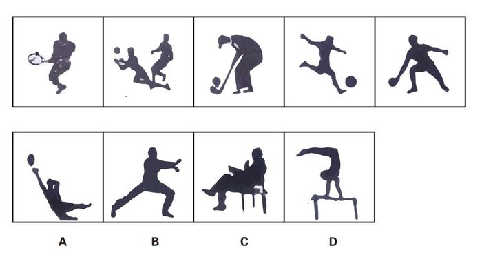
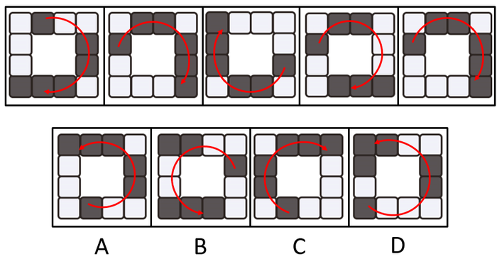
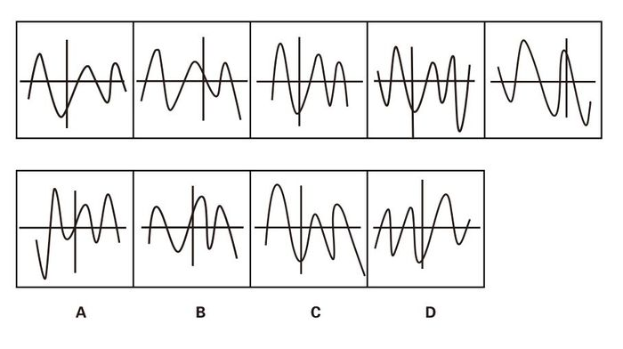
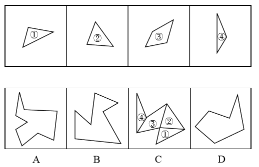
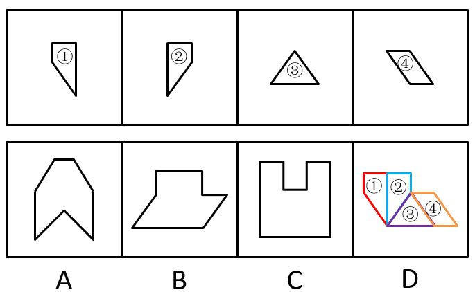
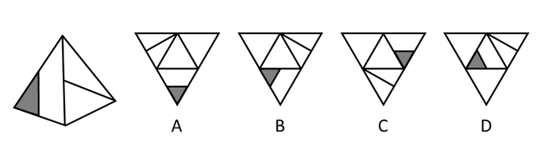
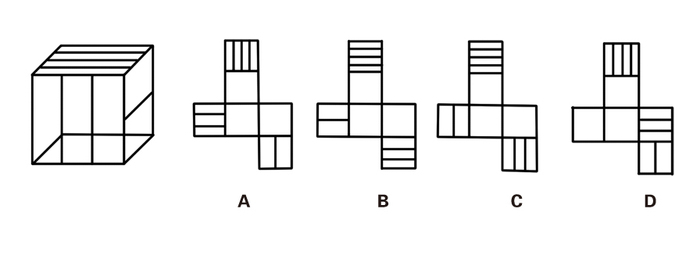
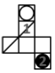
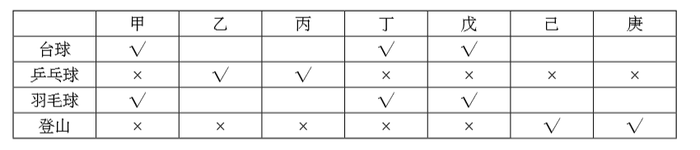

# 2016年江苏省公务员录用考试《行测》题（A类）

> 判断推理 · 45 题 · 江苏 2016

## 第 1 题　qid 1788628 · 类比推理

上山：山上

- **A**. 上海：海上
- **B**. 回收：收回
- **C**. 工人：人工
- **D**. 下台：台下　✅

**答案**：D

**官方解析**

第一步：判断题干词语间逻辑关系。 
人“上山”后到达“山上”，二者是动作和地点的对应关系。 
第二步：判断选项词语间逻辑关系。 
A项：“上海”“海上”都是地点名称，二者不是动作和地点的对应关系，与题干逻辑关系不一致，排除；
B项：“回收”和“收回”为近义词，与题干逻辑关系不一致，排除；
C项：“工人”是个职业而非动作，“人工”不是地点，二者不是动作和地点的对应关系，与题干逻辑关系不一致，排除；
D项：人“下台”后到达“台下”，二者是动作和地点的对应关系，与题干逻辑关系一致，当选。 
故正确答案为D。

---

## 第 2 题　qid 1788630 · 类比推理

舞蹈：天鹅

- **A**. 歌唱：黄莺　✅
- **B**. 春燕：呢喃
- **C**. 读书：学生
- **D**. 采莲：江南

**答案**：A

**官方解析**

第一步：判断题干词语间逻辑关系。 
“舞蹈”是艺术表演，“天鹅”是动物，可以用“天鹅”的形态比喻“舞蹈”动作优雅，二者为比喻象征关系。 
第二步：判断选项词语间逻辑关系。 
A项：“歌唱”是艺术表演，“黄莺”是动物，可以用“黄莺”比喻“歌唱”声音婉转动听，二者是比喻象征关系，与题干逻辑关系一致，当选。 
B项：“呢喃”是拟声词，可直接用来形容“春燕”的鸣叫声，与题干逻辑关系不一致，排除。 
C项：“学生”与“读书”可以构成主谓宾关系，与题干逻辑关系不一致，排除。 
D项：“江南”是“采莲”这个动作可能发生的区域，二者是动作和地点的对应关系，与题干逻辑关系不一致，排除。 
故正确答案为A。

---

## 第 3 题　qid 1788632 · 类比推理

静如处子：动如脱兔

- **A**. 顺手牵羊：守株待兔
- **B**. 胆小如鼠：胆大包天　✅
- **C**. 杀鸡儆猴：惩前毖后
- **D**. 呆若木鸡：愚不可及

**答案**：B

**官方解析**

第一步：判断题干词语间逻辑关系。 
“静如处子”指像未出嫁的姑娘那样沉静，“动如脱兔”指像兔子一样迅速，二者为反义词关系。 
第二步：判断选项词语间逻辑关系。
A项：“顺手牵羊”指顺手把人家的羊牵走，原比喻趁势捉住敌人，现比喻趁机拿走别人的东西或不费力借机做某事。“守株待兔”指守着树桩等待兔子撞上树，比喻死守狭隘的经验，不知变通，也比喻心存侥幸，不通过主观努力而获得意外收获的心理。二者不是反义词关系，与题干逻辑关系不一致，排除。
B项：“胆小如鼠”指胆子非常小，“胆大包天”指胆子非常大，二者为反义词关系，与题干逻辑关系一致，当选。 
C项：“杀鸡儆猴”指杀鸡给猴子看，比喻用惩罚某个个体的办法来警告别的人。“惩前毖后”指批判以前所犯的错误，吸取教训，使以后谨慎些，不致再犯。二者不是反义词关系，与题干逻辑关系不一致，排除。 
D项：“呆若木鸡”形容一个人有些痴傻发愣的样子，或因恐惧或惊异而发愣的样子。“愚不可及”原指人为了逃避眼前不利局面而假装愚痴，以免祸患，为常人所不及，后用来形容人极端愚蠢。二者不是反义词关系，与题干逻辑关系不一致，排除。 
故正确答案为B。

---

## 第 4 题　qid 1788634 · 类比推理

冠军：亚军

- **A**. 热带：亚热带　✅
- **B**. 芝麻：亚麻
- **C**. 奥运会：亚运会
- **D**. 亚健康：健康

**答案**：A

**官方解析**

第一步：判断题干词语间逻辑关系。 
“冠军”和“亚军”是通过比赛所获得的不同头衔、名次，为并列关系，“亚军”相对“冠军”而言是次一等的奖项。 
第二步：判断选项词语间逻辑关系。 
A项：“热带”和“亚热带”都是气候地带，“亚热带”相对“热带”而言是次一等热的地带，与题干逻辑关系一致，当选。 
B项：“芝麻”和“亚麻”是两种不同的植物，二者为并列关系，但不存在等级上的差别，与题干逻辑关系不一致，排除。 
C项：“奥运会”和“亚运会”都是运动会，二者为并列关系，奥运会是全球范围的运动会，“亚运会”是亚洲范围内的运动会，二者仅在参赛范围上有区别，不存在等级上的区别，与题干逻辑关系不一致，排除。 
D项：“亚健康”和“健康”都是指身体状态，二者为并列关系，“亚健康”指次一等的“健康”状态，但两词前后顺序与题干相反，与题干逻辑关系不一致，排除。 
故正确答案为A。

---

## 第 5 题　qid 1788636 · 类比推理

茶杯：杯盖：杯底

- **A**. 树林：树梢：树根
- **B**. 文章：文件：标题
- **C**. 苹果：果核：果皮　✅
- **D**. 茶叶：春茶：秋茶

**答案**：C

**官方解析**

第一步：判断题干词语间逻辑关系。 
“杯盖”和“杯底”为并列关系，二者都是“茶杯”的组成部分，与“茶杯”为组成关系。 
第二步：判断选项词语间逻辑关系。 
A项：“树梢”和“树根”为并列关系，二者都是树木的一部分，不是“树林”的一部分，与题干逻辑关系不一致，排除。 
B项：“文件”和“标题”不是并列关系，“文件”不是“文章”的一部分，与题干逻辑关系不一致，排除。 
C项：“果核”和“果皮”为并列关系，二者都是“苹果”的一部分，与“苹果”为组成关系，与题干逻辑关系一致，当选。 
D项：“春茶”和“秋茶”为并列关系，二者都是“茶叶”，与“茶叶”为种属关系，与题干逻辑关系不一致，排除。 
故正确答案为C。

---

## 第 6 题　qid 1788638 · 类比推理

火车：轨道：行驶

- **A**. 电脑：键盘：上网
- **B**. 相机：镜头：拍照
- **C**. 飞机：机场：飞行
- **D**. 油轮：江海：航行　✅

**答案**：D

**官方解析**

第一步：判断题干词语间逻辑关系。
“火车”在“轨道”上“行驶”，三者为对应关系。
第二步：判断选项词语间逻辑关系。 
A项：用“键盘”在“电脑”上打字，而不是“上网”，与题干逻辑关系不一致，排除；
B项：“镜头”是“相机”的一部分，二者为组成关系，与题干逻辑关系不一致， 排除；
C项：“飞机”在空中“飞行”，“机场”是“飞机”停留和起飞的场地，与题干逻辑关系不一致，排除；
D项：“油轮”在“江海”中“航行”，三者为对应关系，与题干逻辑关系一致，当选。 
故正确答案为D。

---

## 第 7 题　qid 1788640 · 类比推理

驾驶  之于（    ）相当于  讲课  之于（    ）

- **A**. 司机——教师　✅
- **B**. 网络——教室
- **C**. 汽车——学生
- **D**. 麦克风——导航仪

**答案**：A

**官方解析**

逐一代入选项。
A项：“驾驶”是“司机”的工作内容，二者为职业和行为的对应关系；“讲课”是“教师”的工作内容，二者为职业和行为的对应关系。前后逻辑关系一致，当选；
B项：“驾驶”与“网络”没有明显的逻辑关系；“讲课”与“教室”为地点对应关系。前后逻辑关系不一致，排除；
C项：驾驶汽车，“驾驶”和“汽车”构成动宾关系；“讲课”与“学生”不能构成动宾关系，学生主要是听课学习。前后逻辑关系不一致，排除；
D项：“驾驶”与“麦克风”没有明显的逻辑关系；“讲课”与“导航仪”没有明显的逻辑关系。前后都没有明显的逻辑关系，排除。
故正确答案为A。

---

## 第 8 题　qid 1788642 · 类比推理

时间  之于（    ）相当于（    ）之于  密度

- **A**. 数量——质量
- **B**. 流水——磐石
- **C**. 速度——体积　✅
- **D**. 日晷——天平

**答案**：C

**官方解析**

逐一代入选项。
A项：“时间”与“数量”没有明显的逻辑关系；质量=体积×密度，“质量”与“密度”为对应关系。前后逻辑关系不一致，排除；
B项：“时间”与“流水”为象征关系，用“流水”形容“时间”过得快；“磐石”与“密度”没有逻辑关系，“磐石”形容的是坚硬，也就是硬度，不是“密度”。前后逻辑关系不一致，排除；
C项：路程=时间×速度，“时间”与“速度”为对应关系，同样路程条件下，“时间”越短，“速度”越快；质量=体积×密度，“体积”与“密度”为对应关系，同样质量条件下，“体积”越小，“密度”越大。前后逻辑关系一致，当选；
D项：“时间”与“日晷”为对应关系，“日晷”是利用日影测得时刻的一种计算“时间”的仪器；“天平”与“密度”没有关系，“天平”是衡量质量的仪器。前后逻辑关系不一致，排除。
故正确答案为C。

---

## 第 9 题　qid 1788644 · 逻辑判断

- **A**. 

- **B**. 

　✅
- **C**. 

- **D**. 

**答案**：B

**官方解析**

分析题干符号间关系。
从相同符号的位置入手：位置1、3符号相同；位置2、8、9符号相同；位置4、7符号相同；位置5、6符号相同。
A、C、D三项中位置2与位置8、9符号不同，排除；只有B选项相同符号的位置和题干保持一致。
故正确答案为B。

---

## 第 10 题　qid 1788646 · 类比推理

悠悠嘻嘎嘻吱吱嘻

- **A**. 嘻嘻悠吱悠嘻吱嘎
- **B**. 悠悠嘻悠嘻嘎嘎吱
- **C**. 嘻嘻吱悠吱嘎嘎吱　✅
- **D**. 吱吱悠嘻悠嘻嘻嘎

**答案**：C

**官方解析**

第一步：分析题干汉字间关系。
从相同汉字的位置入手：位置1、2汉字相同，位置3、5、8汉字相同，位置6、7汉字相同。
第二步：判断选项汉字间关系。
A项：位置3、5、8汉字不相同，位置6、7汉字不相同，与题干不一致，排除。
B项：位置3、5、8汉字不相同，与题干不一致，排除。
C项：位置1、2汉字相同，位置3、5、8汉字相同，位置6、7汉字相同，与题干一致，当选。
D项：位置3、5、8汉字不相同，与题干不一致，排除。
故正确答案为C。

---

## 第 11 题　qid 1789584 · 图形推理

在题干中给出一套图形，其中有五个图，这五个图呈现一定的规律性。在给出的另一套图形中，有四个图，从中选出唯一的一项作为保持上边五个图规律性的第六个图。

- **A**. A　✅
- **B**. B
- **C**. C
- **D**. D

**答案**：A

**官方解析**

本题考查图形的实际意义，寻找最大共同点。题干一组图都是人在做不同的球类运动，都存在黑色小球。选项中只有A项具有黑色小球。
故正确答案为A。

---

## 第 12 题　qid 1789596 · 图形推理

在题干中给出一套图形，其中有五个图，这五个图呈现一定的规律性。在给出的另一套图形中，有四个图，从中选出唯一的一项作为保持上边五个图规律性的第六个图。

- **A**. A
- **B**. B
- **C**. C　✅
- **D**. D

**答案**：C

**官方解析**

图形元素组成相同，考虑位置规律，整体看无规律，考虑分开看，发现分别是1个黑块、2个黑块连在一起、3个黑块连在一起。继续观察发现，题干五幅图中，1个黑块2个黑块3个黑块是沿着顺时针的顺序进行排列的，选项中只有C项符合此规律。A、B、D三项中是沿着逆时针的顺序排列的。

 

故正确答案为C。

---

## 第 13 题　qid 1789598 · 图形推理

在题干中给出一套图形，其中有五个图，这五个图呈现一定的规律性。在给出的另一套图形中，有四个图，从中选出唯一的一项作为保持上边五个图规律性的第六个图。

- **A**. A
- **B**. B　✅
- **C**. C
- **D**. D

**答案**：B

**官方解析**

元素组成不同且没有明显属性规律，考虑数量规律。题干出现多边形，优先数直线，直线数量分别为3、4、4、5、5，没有明显规律。再次观察发现线和线之间都有交点，考虑数交点，交点数量分别为3、4、4、5、5，由此发现每一幅图线数量和点数量均相同，只有B项符合规律。
故正确答案为B。

---

## 第 14 题　qid 1789602 · 图形推理

在题干中给出一套图形，其中有五个图，这五个图呈现一定的规律性。在给出的另一套图形中，有四个图，从中选出唯一的一项作为保持上边五个图规律性的第六个图。

- **A**. A
- **B**. B
- **C**. C　✅
- **D**. D

**答案**：C

**官方解析**

图形元素组成不同，且无明显属性规律，考虑数量规律。观察题干图形发现，图形均由1条曲线和2 条直线构成，直线组成了坐标轴，曲线形成了波峰和波谷。首先看波峰和波谷的数量，波峰数量依次为 3，3，3，3，2，波谷数量依次为 2，2，2，4，3，发现波峰、波谷的个数相差1（波峰、波谷相减结果的绝对值都是1），排除A、D两项。 再观察题干图形中波峰、波谷与坐标轴的位置关系，发现每个图形中最高的波峰均出现在竖轴的左侧，排除B项，只有C项符合。 
故正确答案为C。

---

## 第 15 题　qid 1789606 · 图形推理

选项的四个图形中，只有一个是由题干中的四个图形拼合（只能上、下、左、右平移）而成的，请把它找出来。

- **A**. A
- **B**. B
- **C**. C　✅
- **D**. D

**答案**：C

**官方解析**

本题考查的是平面拼合，可以采用平行等长相消的方法（找到相对面积较大的图形为基准图形，找到平行且等长的边进行拼合，拼合之后等长线条抵消）。如下图所示：

故正确答案为C。

---

## 第 16 题　qid 1789608 · 图形推理

选项的四个图形中，只有一个是由题干中的四个图形拼合（只能上、下、左、右平移）而成的，请把它找出来。

- **A**. A
- **B**. B
- **C**. C
- **D**. D　✅

**答案**：D

**官方解析**

本题考查的是平面拼合，可以采用平行等长相消的方法（找到相对面积较大的图形为基准图形，找到平行且等长的边进行拼合，拼合之后等长线条抵消）。如下图所示：

故正确答案为D。

---

## 第 17 题　qid 1789610 · 图形推理

右边四个图形中，只有一个是左侧图形的展开图，请把它找出来。

- **A**. A
- **B**. B　✅
- **C**. C
- **D**. D

**答案**：B

**官方解析**

将题干展开图标上序号，如下图所示，逐一进行分析。

A项：选项中面a的黑三角形与面a面b的公共边（边1）相交，而题干中面a的黑三角形与边1不相交，选项展开图与题干不一致，排除；

B项：选项展开图与题干一致，当选；

C项：选项中面a的黑三角形与边1相交，而题干中面a的黑三角形与边1不相交，选项展开图与题干不一致，排除；

D项：选项面b中的线条与边1相交于边1的端点处，而题干面b中的线条与边1相交于边1的中点处，选项展开图与题干不一致，排除。

故正确答案为B。 

---

## 第 18 题　qid 1789614 · 图形推理

右边四个图形中，只有一个是左侧图形的展开图，请把它找出来。

- **A**. A
- **B**. B
- **C**. C
- **D**. D　✅

**答案**：D

**官方解析**

本题考查四面体的空间重构。对平面展开图中的面进行标记，用排除法解题。

 

观察题干所给的立体图形，可以看到两个面，采用画边法，以黑色三角形所在面的顶点E为唯一点，顺时针画边。观察可知，立体图形中边1所对的面为灰色三角形所在面。 

A项：边1对应空白面，题干中边1对应灰三角所在的面，与题干不一致，排除。 

B项：边1对应空白面，题干中边1对应灰三角所在的面，与题干不一致，排除。 

C项：边1对应空白面，题干中边1对应灰三角所在的面，与题干不一致，排除。 

D项：与题干一致，当选。 

故正确答案为D。 

---

## 第 19 题　qid 1789616 · 图形推理

右边四个图形中，只有一个是左侧图形的展开图，请把它找出来。

- **A**. A
- **B**. B
- **C**. C
- **D**. D　✅

**答案**：D

**官方解析**

一线面中的线段与两条边有交点，如图1所示，与空白面交于边1。在立体图形与展开图中，以边1为唯一边顺时针画边。 

A项：边4对应空白面，题干中边4对应三线面，与题干不一致，排除。 

B项：边4对应空白面，题干中边4对应三线面，与题干不一致，排除。 

二线面中的线段与两条边有交点，如图2所示，与空白面交于边1。在立体图形与展开图中，以边1为唯一边顺时针画边。 

C项：边4对应空白面，题干中边4对应一线面，与题干不一致，排除。 

D项：与题干一致，当选。

故正确答案为D。

---

## 第 20 题　qid 1789700 · 图形推理

右边四个图形中，只有一个是左侧图形的展开图，请把它找出来。

- **A**. A　✅
- **B**. B
- **C**. C
- **D**. D

**答案**：A

**官方解析**

由原图可知三个面的公共点与两条对角线并不相连。

B项：这三个面的公共点与两条对角线相连，与题干不一致，排除。

C项：面1与面2分别位于“Z”字形的两端，为相对面，不能同时出现，与题干不一致，排除。

D项：面1与面2分别位于“Z”字形的两端，为相对面，不能同时出现，与题干不一致，排除。

故正确答案为A。

---

## 第 21 题　qid 1789564 · 逻辑判断

与传统的“汗水型”经济不同，创新是一种主要依靠人类智慧的创造性劳动。由于投入多、风险大、周期长、见效慢，创新并非是每个人自觉的行动，它需要强大的动力支持。如果有人可以通过土地资源炒作暴富，或者可以借权钱交易腐败发财，那么人们创新就不会有真正的动力。
根据以上概述，可以得出以下哪项？

- **A**. 如果有人可以通过土地资源炒作暴富，就有人可以凭借权钱交易腐败发财
- **B**. 如果没有人可以凭借权钱交易腐败发财，人们创新就会有真正的动力
- **C**. 如果人们创新没有真正的动力，那么就有人可以通过土地资源炒作暴富
- **D**. ​如果人们创新具有真正的动力，那么没有人可以凭借权钱交易腐败发财　✅

**答案**：D

**官方解析**

第一步：翻译题干。

资源炒作暴富或权钱交易腐败发财创新有真正的动力。

第二步：逐一分析选项。

A项：土地资源炒作暴富权钱交易腐败发财，由土地资源炒作暴富无法推出权钱交易腐败发财，属于无中生有，排除；

B项：权钱交易腐败发财创新有真正的动力，是对题干或关系其中一个的否定，无法推出确定结论，排除；

C项：创新有真正的动力土地资源炒作暴富，是对题干逻辑关系的肯定箭头后，无法推出确定结论，排除；

D项：创新有真正的动力权钱交易腐败发财，根据逆否规则，题干可以翻译为：创新有真正的动力（土地资源炒作暴富或权钱交易腐败发财）。根据摩根定律等价为：创新有真正的动力土地资源炒作暴富且权钱交易腐败发财，可以推出，当选。

故正确答案为D。

---

## 第 22 题　qid 1789566 · 逻辑判断

某学院共有42名员工，他们或者做教学科研工作，或者做行政工作。在该学院中，教授都不担任行政工作，而30岁以下的年轻博士都在做行政工作，学院中有不少人是从海外招聘来的，他们都具有博士学位，李明是该学院最年轻的教授，他只有29岁。
根据以上陈述，可以得出以下哪项？

- **A**. 该学院从海外招聘来的博士大多是教授
- **B**. 该学院从海外招聘来的博士都不做行政工作
- **C**. 该学院教授大多是30岁以上的海外博士
- **D**. ​该学院有的教授不是从海外招聘来的　✅

**答案**：D

**官方解析**

第一步：翻译题干。

①科研或行政；

②教授行政；

③30岁以下博士行政；

④海外博士；

⑤李明29岁教授。

将②逆否和③可以递推出⑥：30岁以下且博士行政教授。

第二步：逐一分析选项。

A项：（大多）有的海外博士教授，④与“海外”“博士”相关，并未提及年龄问题，因此不能根据⑥推出海外博士是否为教授，排除。

B项：题干中和“海外”有关的只有④海外博士，没有说明年龄问题，无法推出海外招聘来的博士是否做行政工作，排除。

C项：题干中和“海外”有关的只有④海外博士，没有说明他们的年龄或职务，无法推出“教授大多是30岁以上的海外博士”，排除。

D项：已知⑤李明29岁教授，而③30岁以下博士行政，否后必否前可知，行政30岁以下或博士，29岁是对“30岁以下”的否定，或关系否一推一，可知“博士”成立，说明李明教授不是博士。④海外博士，李明不是博士，否后必否前，说明李明教授不是海外招聘的，因此“有的教授不是从海外招聘来的”表述正确，当选。

故正确答案为D。

---

## 第 23 题　qid 1789568 · 逻辑判断

经理：小张，这星期你怎么上班总是迟到？
小张：经理，不要只盯着我哟！小李有时比我到的还要晚！
以下哪项的对话方式与上述最为不同？（    ）

- **A**. 
丈夫：老婆，你有没有觉得最近你特别爱发火？

妻子：你什么意思！你有没有觉得最近你特别爱唠叨？

- **B**. 
乘客：师傅，开车时你怎么还打手机啊？

司机：你乱嚷什么！把我惹火了，一车人的安全你负责？

- **C**. 
老师：小明，你最近上课怎么老不注意听课？

学生：老师，我注意听讲了但是听不懂！听不懂我怎么听？
　✅
- **D**. 
顾客：老板，你们卖的馄饨里怎么有股怪味呢？

老板：你是何居心！你是哪家馄饨店派来的捣蛋鬼？

**答案**：C

**官方解析**

本题考查推理结构。
第一步：翻译题干推出方式。
①小张迟到，②小李有时到得更晚，把话题转移到别人身上。
第二步：逐一分析选项。
A项：①老婆爱发火，②老公更爱唠叨，把话题转移到老公身上，与题干推出方式一致，排除；
B项：①司机开车打手机，②乘客乱嚷嚷，把话题转移到乘客身上，与题干推出方式一致，排除；
C项：①小明不听讲，②小明听不懂，没有转移话题，话题还在小明身上，与题干推出方式不一致，当选；
D项：①馄饨有怪味，②别家派人来捣乱，把话题转移到顾客和别家馄饨店上，与题干推出方式一致，排除。
本题为选非题，故正确答案为C。

---

## 第 24 题　qid 1789570 · 逻辑判断

据报道，与国外相比，中国河流的抗生素浓度较高，测量浓度最高达7560纳克/升，平均也有303纳克/升，而意大利为9纳克/升，美国为120纳克/升，德国为20纳克/升。对此，有专家认为不足为虑。因为绝大多数抗生素对于致病细菌的最小抑制浓度都在10000纳克/升以上，目前中国江河和土壤中检测的抗生素浓度都小于各种抗生素对病菌的最小抑制浓度。
以下哪项是上述专家所作论断的假设？

- **A**. 抗生素浓度如果低于其对病菌的最小抑制浓度，病菌就不会产生抗药性　✅
- **B**. 很多病人就诊后，必须要使用更多的新一代抗生素才能控制感染和病情
- **C**. 细菌如果具有抗药性，因细菌感染而导致的疾病就很难用抗生素治愈
- **D**. 通过环境摄入的残留抗生素浓度高一些可能反而有利于维护人体健康

**答案**：A

**官方解析**

第一步：找出论点和论据。
论点：专家认为中国河流抗生素浓度较高的现象不足为虑。
论据：中国河流的总体抗生素浓度较高，但绝大多数抗生素对于致病细菌的最小抑制浓度都在10000纳克/升以上，目前中国江河和土壤中检测到的抗生素浓度小于各种抗生素对病菌的最小抑制浓度。
第二步：逐一分析选项。
A项：在抗生素浓度和病菌抑制浓度之间搭桥，说明抗生素浓度如果低于其对病菌的最小抑制浓度，病菌就不会产生抗药性，加强了论点，当选；
B项：很多病人就诊后的用药情况和题干无关，无关选项，无法加强，排除；
C项：细菌具有抗药性的危害和题干讨论的中国河流的抗生素浓度问题无关，无关选项，无法加强，排除；
D项：通过环境摄入的残留抗生素和题干讨论的问题无关，无关选项，无法加强，排除。
注：抗药性即多次接触抗生素后，对抗生素的敏感性下降甚至消失，致使抗生素疗效降低的现象。
故正确答案为A。

---

## 第 25 题　qid 1789572 · 逻辑判断

甲、乙、丙、丁、戊5支足球队进行小组单循环赛。比赛规定：每队胜一场得3分，平一场得1分，负一场得0分；积分前两名出线。比赛结束后发现，没有积分相同的球队，乙队胜了3场，另一场负于甲队。
根据以上信息，可得出以下哪项？

- **A**. 甲队一定出线
- **B**. 乙队一定出线　✅
- **C**. 丙队一定出线
- **D**. 戊队一定出线

**答案**：B

**官方解析**

第一步：分析题干条件。
（1）5支球队进行单循环赛，每队胜一场得3分，平一场得1分，负一场得0分；
（2）没有积分相同的球队；
（3）乙队胜了3场，另一场负于甲队。
第二步：根据题干条件进行推理。
共有5支球队，进行小组单循环赛，每个球队都要进行4场比赛，乙队胜了3场，只有一场负于甲队，那么丙、丁、戊3队每队已经分别输给乙队一场。题干最后一句说没有积分相同的球队，所以丙、丁、戊3队在剩下的比赛中不可能3场均取得胜利，因此积分必然低于乙队。由于前两名出线，那么乙队必然出线。
故正确答案为B。

---

## 第 26 题　qid 1789574 · 逻辑判断

俄国作家肖洛霍夫讲过一个故事：“一个兔子没命地狂奔，路遇狼。狼说，你跑那么急干嘛？兔子说，他们要逮住我，给我钉掌，狼说，他们要逮住钉掌的是骆驼，而不是你。兔子说，他们要是逮住我钉了掌，你看我还怎么证明自己不是骆驼。”
在这个故事中，兔子最担心的是：

- **A**. 只要是骆驼，都要被钉掌
- **B**. 即使不是骆驼，也可能会被钉掌
- **C**. 如果被钉了掌，就一定是骆驼　✅
- **D**. 如果没有被钉掌，就不会是骆驼

**答案**：C

**官方解析**

第一步：翻译题干。

兔子的话是反问句，意思是“如果他们要是逮住我钉了掌，我就不能证明自己不是骆驼”，双重否定表肯定，可以翻译为：钉掌骆驼。

第二步：逐一分析选项。

A项：翻译为“骆驼钉掌”，是对题干条件的肯后，肯后得不到确定性的结论，无法推出，排除；

B项：“即使······也······”不是逻辑关联词，一般不翻译，根据题干“钉掌骆驼”可知，不是骆驼就一定不会被钉掌，所以选项的“可能会被钉掌”无法推出，排除；

C项：翻译为“钉掌骆驼”，是对题干条件的肯前，肯前必肯后，可以推出，当选；

D项：翻译为“钉掌骆驼”，是对题干条件的否前，否前得不到确定性的结论，无法推出，排除。

故正确答案为C。

---

## 第 27 题　qid 1789576 · 逻辑判断

荷兰画家梵高在一家精神病院里创作了著名的绘画作品《星空》。这幅画作中的“漩涡”引起了人们长期的争论，许多心理学家认为，“漩涡”是梵高当时脆弱心理状态的延伸和表现。欧洲航天局近日发布了一幅根据“普朗克”卫星探测绘制的星空图，神奇的是，这幅图与《星空》有惊人的相似之处。有艺术家认为，自然的星空正是梵高创作的灵感来源。
以下各项如果为真，则除了哪项均能支持上述艺术家的观点？

- **A**. 梵高的创作灵感一般均有明显的现实来源
- **B**. 《星空》的创作年代要远早于卫星绘制星空图的年代　✅
- **C**. 梵高具有超越常人的视觉观察能力与想象能力
- **D**. 卫星绘制的星空图和《星空》的画面大体是一致的

**答案**：B

**官方解析**

第一步：找出论点和论据。
论点：自然的星空正是梵高创作的灵感来源。
论据：欧洲航天局近日发布了一幅根据“普朗克”卫星探测绘制的星空图，与《星空》有惊人的相似之处。
第二步：逐一分析选项。
A项：梵高的创作灵感一般均有明显的现实来源，说明《星空》的创作和现实有关系，补充论据支持论点，可以加强，排除；
B项：《星空》的创作年代要远早于卫星绘制星空图的年代，创作年代与梵高是否受到自然星空的影响无关，无关项，无法加强，当选；
C项：梵高具有超越常人的视觉观察能力与想象能力，《星空》的画面可能是他在现实中观测到的，补充论据支持论点，可以加强，排除；
D项：卫星绘制的星空图和《星空》的画面大体是一致的，说明梵高创作的《星空》与自然的星空相似，补充论据支持论点，可以加强，排除。
本题为选非题，故正确答案为B。

---

## 第 28 题　qid 1789578 · 逻辑判断

和谐小区里的居民具有乐于助人的良好风尚。在该小区里，凡帮助过老刘的人，老张都帮助过，一个人，只要有一人没帮助过他，老周就帮助过他。老王新搬来不久，还没有帮助过其他人。
根据以上陈述，可以得出以下哪项？

- **A**. 老周没有帮助过老张
- **B**. 老周没有帮助过老王
- **C**. 老刘与老张互相帮助过
- **D**. 老张和老周互相帮助过　✅

**答案**：D

**官方解析**

翻译题干。

①谁帮助过老刘老张就帮助过谁；

②只要有一人没帮助过他老周就帮助过他；

③老王没帮助过任何人。

③为确定已知的信息，从③入手分析。根据③可以推出老王没帮助过老刘、老张、老周，再根据②可以推出老周帮助过老张、老刘，老周帮助过老刘。根据①可以得出，老张帮助过老周。根据以上推理可知老周与老张互相帮助过。

故正确答案为D。

---

## 第 29 题　qid 1789580 · 逻辑判断

某单位工会成立职工业余兴趣活动小组，分台球、乒乓球、羽毛球、登山四个小组。已知该单位的甲、乙、丙、丁、戊、己、庚等7人每人各参加其中的两个小组，每个小组最少有其中的两人参加。最多有其中的5人参加。另外，还知道：
（1）丁与戊的参加情况完全相同；
（2）己与庚的参加情况完全相同；
（3）如果甲参加台球组，则丁也会参加台球组；
（4）只有乙和丙参加乒乓球组。
如果登山组只有己和庚参加，则可以得出以下哪项？

- **A**. 甲参加台球组，羽毛球组　✅
- **B**. 乙参加台球组，羽毛球组
- **C**. 己参加台球组，登山组
- **D**. 庚参加羽毛球组，登山组

**答案**：A

**官方解析**

题干信息较多，采用列表法解题。通过“只有乙和丙参加乒乓球组”与题干的限制条件“登山组只有己和庚参加”可知：

①甲、丁、戊没有参加乒乓球组和登山组；

②乙、丙参加了乒乓球组，但台球组或羽毛球组具体参加情况无法确定；

③己、庚参加了登山组，但台球组或羽毛球组具体参加情况无法确定。列表如下：

A项：由①与题干条件“每人各参加其中的两个小组”可知甲、丁、戊一定参加了羽毛球组和台球组，表述正确，当选；

B项：由②可知乙参加了乒乓球组，且每人参加两个小组，因此乙不能再同时参加台球组、羽毛球组，排除；

C项：由③可知己不确定是否参加台球组，排除；

D项：由“己与庚的参加情况完全相同”与条件③可知，庚不确定是否参加羽毛球组，排除。

故正确答案为A。

---

## 第 30 题　qid 1789582 · 逻辑判断

某单位工会成立职工业余兴趣活动小组，分台球、乒乓球、羽毛球、登山四个小组。已知该单位的甲、乙、丙、丁、戊、己、庚等7人每人各参加其中的两个小组，每个小组最少有其中的两人参加。最多有其中的5人参加。另外，还知道：
（1）丁与戊的参加情况完全相同；
（2）己与庚的参加情况完全相同；
（3）如果甲参加台球组，则丁也会参加台球组；
（4）只有乙和丙参加乒乓球组。
如果乙与丁都没有参加台球组，则可以得出以下哪项？

- **A**. 如果己参加台球组，则丙参加登山组
- **B**. 如果庚参加台球组，则戊参加台球组
- **C**. 如果甲参加羽毛球组，则庚参加登山组
- **D**. 如果乙参加羽毛球组，则己参加登山组　✅

**答案**：D

**官方解析**

题干信息较多，采用列表法解题。由已知条件“乙与丁都没有参加台球组”和“丁与戊的参加情况完全相同”，推出乙、丁、戊都没参加台球组；结合已知条件“如果甲参加台球组，则丁也会参加台球组”，推出甲没参加台球组，则甲、乙、丁、戊均未参加台球组。因为“每个小组最少有其中的两人参加”且“己与庚的参加情况完全相同”，则己、庚必然参加了台球组。而“只有乙和丙参加乒乓球组”，说明甲、丁、戊、己、庚均未参加乒乓球组，甲、丁、戊只能参加羽毛球组和登山组。

列表如下：

A项：丙不确定是否参加了登山组，排除；

B项：戊没有参加台球组，排除；

C项：庚不确定是否参加了登山组，排除；

D项：如果乙参加了羽毛球组，己也参加了羽毛球组，同时己和庚的情况完全相同，那么羽毛球组就有6个人，与题干矛盾，因此己不能参加羽毛球组，那么己只能参加登山组，符合题干，当选。

故正确答案为D。

---

## 第 31 题　qid 1789586 · 定义判断

逆势扩张：指企业在面临巨大压力和困难的情况下，进一步巩固和拓展市场，在竞争中抢占先机的经营行为。
下列不属于逆势扩张的是：

- **A**. 当大多数的国产品牌彩电市场份额纷纷下滑的时候，某电视厂家却连续推出了几款超级电视，市场占比高歌猛进，遥遥领先几大洋品牌
- **B**. 某汽车油箱销售公司是我国规模较大的自主品牌出口企业，近期已正式进入预先披露更新企业名单之列，向上市的目标又迈进了一步　✅
- **C**. 在人们普遍认为房地产调控政策将严重影响家居行业之际，某品牌家具高调宣布，最近在省城及周边地区又成功开设了多家专营店
- **D**. 国内零售行业近期表现欠佳，各销售企业纷纷收缩实体阵地，某民营企业今日却在省城新增了一家购物中心，另外两家不久也将开业

**答案**：B

**官方解析**

第一步：找出定义关键词。
“企业”、“面临巨大压力和困难”、“进一步巩固和拓展市场”、“在竞争中抢占先机”。
第二步：逐一分析选项。
A项：国产品牌彩电市场份额纷纷下滑符合“企业面临巨大压力和困难”，某电视厂家却连续推出几款超级电视，市场占比高歌猛进，是“进一步巩固和拓展市场”，最后遥遥领先几大洋品牌属于“在竞争中抢占先机”，符合定义，排除；
B项：某汽车油箱销售公司属于企业，近期已正式进入预先披露更新企业名单之列，向上市目标迈进一步，并没有体现题干中所提到的困难的环境，也没有体现出在竞争中抢占先机，不符合定义，当选；
C项：家居行业受到房地产调控政策影响，符合“企业面临巨大压力和困难”，某品牌家具在省城及周边地区成功开设了多家专营店体现了“进一步巩固和拓展市场”“在竞争中抢占先机”，符合定义，排除；
D项：零售行业表现不佳，符合“企业面临巨大压力和困难”，某民营企业新开购物中心属于定义中的“进一步巩固和拓展市场”“在竞争中抢占先机”，符合定义，排除。
本题为选非题，故正确答案为B。

---

## 第 32 题　qid 1789588 · 定义判断

公共信息资源：指社会公共领域中特定管理机构依法管理，面向全体社会公众提供信息服务的各种数据系统，具有公共性、广泛性、基础性和公益性等特点。
下列属于公共信息资源的是：

- **A**. 公安部门为了核查居民身份或侦破案件而研发的居民身份信息管理系统
- **B**. 银行为了审核贷款申请、开展各种金融业务而开发的客户个人诚信档案系统
- **C**. 国家气象部门建立的气象信息发布系统，如天气预报、地质灾害预警系统等　✅
- **D**. 高校教务部门为提高教学管理效率而开发的学生选课、评课、成绩管理系统

**答案**：C

**官方解析**

第一步：找出定义关键词。
“社会公共领域中特定管理机构”、“全体社会公众”、“提供信息服务”、“公共性、广泛性、基础性和公益性等”。
第二步：逐一分析选项。
A项：公安部门属于社会公共领域中的特定管理机构，居民身份信息管理系统是公安部门为了核查居民身份或者侦破案件而研发的，该系统中的信息为居民个人隐私，不能面向社会公众提供信息服务，不符合定义，排除；
B项：银行是金融服务机构，不属于社会公共领域中的特定管理机构，客户个人诚信档案系统属于客户隐私，不能面向社会公众提供信息服务，不符合定义，排除；
C项：国家气象部门属于社会公共领域中的特定管理机构，所建立的气象信息发布系统是面向全体社会公众提供天气预报等信息服务的数据系统，同时天气预报、地质灾害预警系统具有公共性、广泛性、基础性和公益性等特点，符合定义，当选；
D项：高校教务部门建立的学生选课、评课、成绩管理系统面向的服务对象并不是全体社会公众，客体不符合定义，排除。
故正确答案为C。

---

## 第 33 题　qid 1789590 · 定义判断

功利化阅读：指在有限的读书时间里，出于特殊目的，只选择阅读那些对提高自己的学习成绩、工作能力或求职更有帮助的书刊资料。
下列不属于功利化阅读的是（   ）

- **A**. 小李平时忙着上课和做家教，资格考试前三天，才一门心思复习考试课程
- **B**. 老李是业务骨干，一有时间就去资料室翻阅与自己工种相关的刊物
- **C**. 为了取得面试好成绩，小江特地去书店买了几本关于面试技巧方面的书
- **D**. 小林虽然工作繁忙，却一直迷恋科幻小说，只要有点空闲就会找一本来看　✅

**答案**：D

**官方解析**

第一步：找出定义关键词。
“有限的读书时间”、“出于特殊目的”、“只选择阅读那些对提高自己的学习成绩、工作能力或求职更有帮助的书刊资料”。
第二步：逐一分析选项。
A项：小李在资格考试前三天才挤出时间复习，符合“有限的读书时间”、出于考试的“特殊目的”，只复习考试课程符合定义中的“只选择对自己学习成绩更有帮助的书刊资料”，符合定义，排除。
B项：“一有时间”即工作之余抽时间读书体现了“有限的读书时间”，翻阅与自己工种相关的刊物体现了“只选择对提高自己工作能力更有帮助的书刊资料”，符合定义，排除。
C项：为了取得面试好成绩符合定义中的“出于特殊目的”，小江特地买了几本面试技巧方面的书属于定义中的“只选择对自己求职更有帮助的书刊资料”，符合定义，排除。
D项：工作之余阅读科幻小说不符合定义中的“只选择阅读那些对提高自己的学习成绩、工作能力或求职更有帮助的书刊资料”，而是个人爱好，不符合定义，当选。
本题为选非题，故正确答案为D。

---

## 第 34 题　qid 1789592 · 定义判断

定制旅游：指由游客和旅游服务商共同商定旅游方案，以充分满足旅游个性化要求的旅游方式。
下列不属于定制旅游的是：

- **A**. 某旅行社最近推出了欧洲十日游，沿海五市一周游等产品，提前订好酒店、机票、景点门票等，游客觉得价格合适就可以购买出行　✅
- **B**. 某在线旅游网站根据游客的个人预算、旅游目标等制订行程计划，与客户反复沟通，最终形成了客户满意的方案，并派出专人随行监管
- **C**. 某旅行社组织了一个美食旅游项目，应游客要求精心挑选几家有特色的美食店，预定好当地的个性民居，全程陪游，游客归来后都感到十分满意
- **D**. 小李同几个酷爱摄影的朋友策划了一个拍摄沙漠风光的活动计划，经过与旅行社多次讨价还价，终于成行，参与者过了一个很有意思的假期

**答案**：A

**官方解析**

第一步：找出定义关键词。 
“游客和旅游服务商共同商定旅游方案”、“充分满足旅游个性化要求”。 
第二步：逐一分析选项。 
A项：某旅行社推出的旅游产品中的旅游计划是提前制定的，不符合定义中的“游客和旅游服务商共同商定旅游方案”，不符合定义，当选。 
B项：某在线旅游网站根据游客的个人预算、旅行目标等制订详细的行程计划，与客户反复沟通体现了“游客和旅游服务商共同商定旅游方案”，最终形成客户满意的方案体现了“充分满足旅游个性化要求”，符合定义，排除。 
C项：某旅行社组织了美食旅游项目，应游客要求精心挑选了美食店，预定个性民居，体现了“游客和旅游服务商共同商定旅游方案”，游客感到十分满意，体现了“充分满足旅游个性化要求”，符合定义，排除。 
D项：拍摄沙漠风光的活动计划是小李和几个朋友共同策划的，同时也跟旅行社讨价还价，讨价还价即对价格、双方所提条件进行协商，符合“共同商定旅游方案”、“满足旅游个性化要求”，符合定义，排除。 
本题为选非题，故正确答案为A。

---

## 第 35 题　qid 1789594 · 定义判断

优势反应：指熟练程度极高、遇到某种刺激时不加思考就做出来的习惯性动作。
下列不属于优势反应的是：

- **A**. 中国人遇到多年未见的朋友时，一般都伸出右手去和对方握手
- **B**. 在街上听到有人喊自己名字，人们总会循着声音方向去寻找
- **C**. 人们无意之中伸进滚烫的开水，瞬间就会把手缩回　✅
- **D**. 小丽在家看小说时，一碰到不认识的字就会下意识地去查字典

**答案**：C

**官方解析**

第一步：找出定义关键词。
“熟练程度极高”、“遇到某种刺激”、“不加思考就做出来的习惯性动作”。
第二步：逐一分析选项。
A项：遇到了多年未见的朋友体现了“遇到某种刺激”，一般伸出右手和对方握手符合“熟练程度极高的动作”，符合定义，排除；
B项：听到有人喊自己名字体现了定义中的“遇到某种刺激”，总会循着声音方向去寻找属于“不加思考就做出来的习惯性动作”，符合定义，排除；
C项：被热水烫这件事没有多少机会让人去熟悉，也没人经常把手伸到热水里，不属于定义中的“熟练程度极高的习惯性动作”，不符合定义，当选；
D项：看到不认识的字下意识地去查字典，这正是因为遇到过这种情况且通过查字典解决了问题，符合定义中的“熟练程度极高、不加思考就做出来的习惯性动作”，符合定义，排除。
本题为选非题，故正确答案为C。

---

## 第 36 题　qid 1789600 · 定义判断

以房养老：指老人将自己的产权房抵押给金融机构，按约定条件定期领取养老金并获得相应服务的养老方式。老人去世后，金融机构可以按约定处置房产，偿付已经支出的各项费用。
下列属于以房养老的是：

- **A**. 最近，老李夫妇把卖房子的钱存进银行，一起住进了附近的老年公寓，每月的存款利息足够支付那里的各种费用
- **B**. 年逾古稀的张先生夫妇与银行签订了协议，生前，他们每月从银行领取13000元养老金；去世后，他们的产权房由银行处置　✅
- **C**. 赵某在一次车祸中落下重度残疾，他与典当行的远房侄子签了一份协议；由侄子照顾他的日常起居，自己名下的房子将来过户给侄子
- **D**. 老孙退休后卖掉市中心的大房子，买了一套二手小房住，每月的退休金加上卖房款利息，夫妻俩的日子过得很是自在惬意

**答案**：B

**官方解析**

第一步：找出定义关键词。
“将自己的产权房抵押给金融机构”、“定期领取养老金并获得相应服务的养老方式”、“老人去世后，金融机构可以按约定处置房产”。
第二步：逐一分析选项。
A项：老李夫妇是靠卖房子的存款利息支付服务费用，不符合关键词“将自己的产权房抵押给金融机构”，不符合定义，排除；
B项：张先生夫妇与银行签订的协议属于定义中的“将自己的产权房抵押给金融机构”，每月领取13000元养老金符合“按约定条件定期领取养老金”，去世后，他们的产权房由银行处置，符合“老人去世后，金融机构可以按约定处置房产”，符合定义，当选；
C项：虽然典当行属于金融机构，但赵某是与其远房侄子签订协议，不是与典当行签订协议，不符合“将自己的产权房抵押给金融机构”，不符合定义，排除；
D项：老孙卖掉大房买二手小房住并将卖房款存进银行获得利息，没有体现“将自己的产权房抵押给金融机构”，不符合定义，排除。
故正确答案为B。

---

## 第 37 题　qid 1789604 · 定义判断

自然淘汰育种法，指在良种筛选过程中，减少人为干预，尽量通过被筛选对象的自然生长确定所需良种的育种方法。
下列属于自然淘汰育种法的是：

- **A**. 
甲鱼养殖场为了选育出抗病力强的种鱼，在甲鱼接连死亡的情况下，不施加任何药物而任其发展，存活到最后的则作为种鱼
　✅
- **B**. 
锦鲤养殖户从幼鱼开始分拣最有经济价值的鱼苗，经过三次人工选鱼后，最终只有不到的幼鱼成了精品锦鲤

- **C**. 
石斛养殖户爬上人迹罕至的悬崖峭壁采集野生石斛，挑选其中的一部分作为种苗，精心培育出了多个新品种

- **D**. 
生长在同一片山坡上的某种植物，有的长势非常茂盛，有的则弱小枯黄，泾渭分明，这正是“物竞天择”的形象说明

**答案**：A

**官方解析**

第一步：找出定义关键词。
“筛选过程中”、“减少人为干预”、“自然生长”、“确定所需良种”。
第二步：逐一分析选项。
A项：甲鱼养殖场不施加任何药物，相当于没有进行人为干预，尽量通过自然生长筛选，存活到最后的抗病力强的种鱼就是所需的良种，符合定义，当选；
B项：经过三次人工选鱼，说明多次进行人为干预，不符合“减少人为干预”，不符合定义，排除；
C项：养殖户人工采集野生石斛，并从中挑选种苗，不符合定义中的“减少人为干预”和“通过······自然生长确定所需良种”，不符合定义，排除；
D项：山坡上的植物长势是自然状态，并不是良种筛选的过程，不符合定义，排除。
故正确答案为A。

---

## 第 38 题　qid 1789612 · 定义判断

隐形就业：指没有通过传统就业渠道获取固定职业，处于相关部门就业统计范围之外的工作状态。
下列不属于隐形就业的是：

- **A**. 颜某辞去工作后，一边带孩子一边经营一奶粉网店
- **B**. 某教授受多家培训学校之邀，在工作之余常去授课　✅
- **C**. 小陈离开公司后专门为电商店铺提供平台搭建和维护服务
- **D**. 酷爱写作的小王，大学毕业后成了一家报社的自由撰稿人

**答案**：B

**官方解析**

第一步：找出定义关键词。
“没有通过传统就业渠道获取固定职业”、“处于相关部门就业统计范围之外”。
第二步：逐一分析选项。
A项：开奶粉网店符合定义中的“没有通过传统就业渠道获取固定职业”，符合定义，排除；
B项：某教授的本职工作是在高校授课，不符合定义中的“没有通过传统就业渠道获取固定职业”，并且无论其是否兼职授课，该教授都会处于相关部门的就业统计范围之内，不符合定义，当选；
C项：小陈专门为电商店铺提供平台搭建和维护服务符合定义中的“没有通过传统就业渠道获取固定职业”，符合定义，排除；
D项：自由撰稿人是一种新型的自由职业，符合定义中的“没有通过传统就业渠道获取固定职业”，符合定义，排除。
本题为选非题，故正确答案为B。

---

## 第 39 题　qid 1789618 · 定义判断

众筹行为：指通过互联网发布筹款项目、实施方案、投资回报的资金募集方式，其构成要素包括有创造能力但缺乏资金的发起人，对筹资者的故事或回报感兴趣的支持者，在两者之间发挥连接作用的互联网平台等。
下列属于众筹行为的是：

- **A**. 地震发生后，市红十字会利用官网、微博、微信等多种网络平台及时发布灾情信息呼吁市民捐款捐物，帮助灾民重建家园，很快筹集到大量善款、赈灾物资
- **B**. 小涛大学毕业后回乡创业资金不足，他在网上发布了自己的创意，争取各界人士的资金援助，在网友们帮助下迅速度过了难关
- **C**. 某中学的一名学生患了白血病，学校在网上发布了募捐活动，两天之内就募捐了几万元，帖子转载后各地的善款越来越多
- **D**. 某青年艺术家为了举办个人画展，利用网络筹集了一大笔启动资金，画展圆满结束后，一一兑现了让出资人享受展品收藏待遇的承诺　✅

**答案**：D

**官方解析**

第一步：找出定义关键词。
“通过互联网发布筹款项目、实施方案、投资回报的资金募集方式”、“有创造能力但缺乏资金的发起人”、“对筹资者的故事或回报感兴趣的支持者”、“发挥连接作用的互联网平台”。
第二步：逐一分析选项。
A项：红十字会是社会救助团体，不符合定义中的“有创造能力但缺乏资金的发起人”，且呼吁市民捐款捐物是没有回报的，不符合定义，排除；
B项：小涛争取资金援助渡过难关之后，未体现是否给出资人回报，不明确，保留；
C项：为白血病学生进行募捐活动没有回报，不符合定义，排除；
D项：青年艺术家是“有创造能力但缺乏资金的发起人”，为了举办个人画展利用网络筹集启动资金，符合定义中的“通过互联网发布筹款项目”，画展结束后兑现了让出资人享受展品收藏待遇的承诺体现了“投资回报”，符合定义，保留。
对比B、D两项，D项明确说明给予出资人回报，对比择优，排除B项。
故正确答案为D。

---

## 第 40 题　qid 1789620 · 定义判断

路怒症：指机动车驾驶者在行车过程中因焦躁、愤怒情绪而产生的攻击性行为。
下列不属于路怒症的是：

- **A**. 在路口等红灯时，小张感觉汽车被碰了一下，下车一看，果然是后车刹车不及时追尾了。小张猛踢后车车轮，大声责怪其司机并且索要赔偿
- **B**. 妻子开车送老陈去上班，一辆小汽车突然窜到了面前，险些撞到他的车，老陈下车拦住那辆车，把司机痛斥一顿　✅
- **C**. 小李开了8年车，技术高超，每次被人超车，都忍不住狂踩油门飚上一把，直到反超并羞辱对方一番才罢休
- **D**. 小王正在赶路，旁边车子中飞出一个纸团突然落在他的挡风玻璃上，小王十分生气，他猛按喇叭，嘴里骂个不停

**答案**：B

**官方解析**

第一步：找出定义关键词。
“机动车驾驶者”、“行车过程中”、“因焦躁、愤怒情绪”、“产生的攻击性行为”。
第二步：逐一分析选项。
A项：小张因为后车刹车不及时追尾导致了愤怒情绪，猛踢后车车轮、大声责怪属于“攻击性行为”，符合定义，排除；
B项：妻子开车送老陈上班，妻子是机动车驾驶者，老陈是乘客，老陈不符合定义中的“机动车驾驶者”，不符合定义，当选；
C项：小李被人超车后飙车体现了“愤怒情绪”，反超并羞辱对方一番，符合定义中的“攻击性行为”，符合定义，排除；
D项：小王十分生气，猛按喇叭，嘴里骂个不停，符合定义中的“机动车驾驶者因愤怒情绪而产生的攻击性行为”，符合定义，排除。
本题为选非题，故正确答案为B。

---

## 第 41 题　qid 1789682 · 定义判断

跳板策略：指在特定条件下，为了避免因统一指挥造成的信息传递延误而跨越权力边界，直接进行横向沟通。
下列属于跳板策略的是：

- **A**. 小杰被毒蛇咬后，生命垂危，县医院立即向国家卫生部紧急求救，在卫生部直接干预下，仅两个小时就拿到了所需的特效药，小杰很快转危为安
- **B**. 一次学术会议上，某大学校长遇到了兄弟院校从未谋面的老同行，两人就一些学术热点问题进行了深入探讨，并商定联手申报国家级重大科研项目
- **C**. 一次追逃行动中，通讯系统突发故障，为防嫌疑人再次逃脱，第一小组的高组长未向指挥中心汇报就直接请求第二小组的邓组长火速救援，迅速抓获了犯罪嫌疑人　✅
- **D**. 由于路程较远，120救护车不能马上赶到车祸现场，巡警得知这一情况后主动用自己的摩托警车把伤员送进了附近的一家医院

**答案**：C

**官方解析**

第一步：找出定义关键词。 
“避免因统一指挥造成的信息传递延误”、“跨越权力边界”、“直接进行横向沟通”。 
第二步：逐一分析选项。 
A项：卫生部是医院的上级机构，县医院向国家卫生部紧急求救是纵向沟通，不符合定义中的“横向沟通”，不符合定义，排除。 
B项：他们之间是学术交流，未体现“避免因统一指挥造成的信息传递延误”，也未体现“跨越权力边界”，不符合定义，排除。 
C项：第一小组高组长没有向指挥中心汇报就直接请求救援，属于定义中的“为了避免因统一指挥造成的信息传递延误而跨越权力边界”，请求第二小组邓组长增援，二者级别相同，属于定义中的“直接进行横向沟通”，符合定义，当选。 
D项：巡警将伤员送到医院的行为未体现“避免因统一指挥造成的信息传递延误”，不符合定义，排除。 
故正确答案为C。

---

## 第 42 题　qid 1789684 · 定义判断

配套效应，指拥有某件物品后，为了追求完美效果而不断配置其他相应物品。
下列不属于配套效应的是：

- **A**. 邻居送给小李一只宠物狗，半月后，小李家阳台上狗笼子、狗饭碗、狗澡盆、狗毛衣等一应俱全，几乎变成了宠物用品展示中心
- **B**. 小孙穿着朋友赠送的一件质地精良做工考究的睡袍在书房走动，总觉得身边的一切都不协调，他很快换掉了书房中的地毯、桌椅、书柜
- **C**. 张女士在商场亲子装专柜为儿子买了一件T恤，儿子和丈夫都非常满意，于是又返回商场为丈夫和自己各买了一件　✅
- **D**. 赵总在古玩店淘到一件康熙宫廷玉器，特意为它配置了一个红木底座，还请诗友为它专门写了一首咏玉诗，放在大厅最醒目的地方

**答案**：C

**官方解析**

第一步：找到定义关键词。
关键词：目的为“追求完美效果”，方式为“拥有某件物品后不断配置其他相应物品”。
第二步：逐一分析选项。
A项：小李家买的狗笼子、狗饭碗等是发生在小李拥有一只宠物狗后，体现了“拥有某件物品后不断配置其他相应物品”，这些物品是为了追求与宠物狗配套的“完美效果”，符合定义，排除；
B项：小孙换掉地毯等物品是为了和质地精良的睡袍配套，体现了“拥有某件物品后不断配置其他相应物品”，为的是“追求完美的效果”，符合定义，排除；
C项：张女士前后购买的是T恤，并没有配置其他物品，不符合定义，当选；
D项：赵总为玉器配置了红木底座，请他人为玉器写诗等行为体现了“拥有某件物品后不断配置其他相应物品”，也是为了“追求完美效果”，符合定义，排除。
本题为选非题，故正确答案为C。

---

## 第 43 题　qid 1789686 · 定义判断

平行竞争：指各家厂商提供不同种类的产品以满足顾客同一需求而形成的竞争。
下列属于平行竞争的是：

- **A**. 冬天还没到，电器商场就摆满了各种取暖用品，空调、油汀、热电扇、电热毯应有尽有，价格有高有低，款式或经典或新潮　✅
- **B**. 为了扩大市场份额，某公司新近推出了一款平板电脑，硬盘容量有64G、128G和256G三种规格，供不同层次的消费者选择
- **C**. 只要走进地下商城，马上就会有一群人把你团团围住，卖服装的、卖玩具的、卖食品的······迫不及待地要把你控制在自己的摊位上
- **D**. 小李拿到了1万多元年终奖，准备好好奖励自己，现在正纠结于出国放假、买笔记本电脑还是黄金首饰

**答案**：A

**官方解析**

第一步：找出定义关键词。
“满足顾客同一需求”、“提供不同种类的产品”、“各家厂商”、“竞争”。
第二步：逐一分析选项。
A项：电器商场中有各种品牌，属于定义中的“各家厂商”，空调、油汀、热电扇等属于不同种类的产品，都是为满足顾客取暖的同一需求，体现出厂家间的竞争，符合定义，当选；
B项：平板电脑规格不同但都是同一家公司推出的，不存在厂家间的竞争，不符合定义，排除；
C项：服装、玩具、食品满足的是消费者的不同需求，不符合定义，排除；
D项：出国旅游、买电脑还是买黄金首饰满足的是小李的不同需求，不符合定义，排除。
故正确答案为A。

---

## 第 44 题　qid 1789688 · 定义判断

反向激励：指领导者对于工作表现欠佳的下属不仅不批评，反而适度肯定，以期取得与正向激励效果相当的评价策略。
下列属于反向激励的是：

- **A**. 小刘提前完成了经理布置的演讲稿，经理要他拿回去认真推敲，第二天小刘的修改稿得到了经理的高度肯定
- **B**. 小王因工作失误被顾客投诉，同事老王安慰她，并指导小王如何避免失误，小王经过一段时间的努力，业务能力越来越强，顾客十分满意
- **C**. 小李接受撰写市场调研报告的任务后，未能按时完成。经理称赞他调研认真，特意延期两天，小李的调研报告最终写得很出色　✅
- **D**. 在工会羽毛球循环赛中，夺冠热门小王首轮意外失手，单位领导没有批评他，反而鼓励他调整好心态，小王最终获得了冠军

**答案**：C

**官方解析**

第一步：找出定义关键词。
“领导者对工作表现欠佳的下属不批评，反而适度肯定”、“取得与正向激励效果相当的结果”。
第二步：逐一分析选项。
A项：小刘提前完成演讲稿，并不属于“工作表现欠佳”，不符合定义，排除；
B项：同事老王对小王的安慰与指导，不符合定义中的“领导者对于工作表现欠佳的下属适度肯定”，不符合定义，排除；
C项：小李没有按时完成任务，属于定义中的“工作表现欠佳”，领导没有批评反而称赞，体现了“适度肯定”，目的是让小李更好地完成任务，最后小李报告完成得很出色，体现了“取得与正向激励效果相当的结果”，符合定义，当选；
D项：小王在工会羽毛球循环赛中失手，不属于定义中的“工作表现欠佳”，不符合定义，排除。
故正确答案为C。

---

## 第 45 题　qid 1789690 · 定义判断

代际歧视：指上代人从自己的视角对新生代整体形象作出的描述性或定位性负面评价，这种评价往往不够客观、准确。
下列属于代际歧视的是：

- **A**. 年近花甲的钱总在职工大会上批评少数年轻的技术人员缺乏创新意识，不思进取，要求他们尽快改变目前的精神状态
- **B**. 80后曾被父辈斥为“叛逆的一代”，被指责为自我、叛逆和缺乏责任感，然而最近某七十高龄的作家却称80后是“懦弱的一代”，缺乏反叛精神　✅
- **C**. 孙大妈学会了使用微信，经常关注女儿的朋友圈，由于女儿经常分享一些充满正能量的短文，饭桌上她戏称女儿是“鸡汤党”
- **D**. 某啃老男整天游手好闲、惹是生非，父母恨铁不成钢欲将其赶出家门，他却指责父母这一代人自私自利，不顾子女

**答案**：B

**官方解析**

第一步：找出定义关键词。
“上代人对新生代整体形象作出的负面评价”、“不够客观、准确”。
第二步：逐一分析选项。
A项：钱总批评少数年轻技术人员不是对新生代整体形象的评价，不符合定义，排除。
B项：父辈指责“80后”为“叛逆的一代”，是从自己的视角对“80后”整体形象作出的负面评价，某七十高龄作家称“80后”为“懦弱的一代”，缺乏反叛精神，也是从自己的视角对“80后”整体形象作出的定位性负面评价，且两种评价相互冲突，体现了“不够客观、准确”，符合定义，当选。
C项：孙大妈对女儿的评价不是对新生代整体形象的评价，不符合定义，排除。
D项：啃老男对父母这一代人的评价是对上代人的评价，不是上一代对新生代的评价，不符合定义，排除。
故正确答案为B。

---
