# 2016年江苏省公务员录用考试《行测》题（B类）

> 判断推理 · 45 题 · 江苏 2016

## 材料 1

某校组建篮球队，需要从甲、乙、丙、丁、戊、己、庚、辛等8名候选者中选出5名队员，为求得球队最佳组合，选拔需满足以下条件：

（1）甲、乙、丙3人中必须选出两人；

（2）丁、戊、己3人中必须选出两人；

（3）甲与丙不能都被选上；

（4）如果丁被选上，则乙不能选上。

### 第 1 题　qid 2035840 · 逻辑判断

如果添加前提“如果庚被选上，则辛也被选上”，则可以得出以下哪项？

- **A**. 甲和乙能被选上
- **B**. 丁和戊能被选上
- **C**. 乙和庚能被选上
- **D**. 己和辛能被选上　✅

**答案**：D

**官方解析**

分析题干的逻辑关系。

由（1）和（3）可知乙一定被选上，由（4）丁乙，否后必否前，得到乙丁，可知丁不会被选上。由条件（2）可得出戊和己一定被选上，而由条件（1）可知甲和丙里还要再选一个，总共已经有4个人，那么庚和辛必定只能选一个。由“如果庚被选上，则辛也被选上”可知，只能选辛，所以乙、戊、己、辛是一定能被选上的。

故正确答案为D。

---

### 第 2 题　qid 2035842 · 逻辑判断

如果添加前提“如果戊被选上，则甲不能被选上”，则可以得出以下哪项？

- **A**. 甲和乙能被选上
- **B**. 乙和丙能被选上　✅
- **C**. 戊和辛能被选上
- **D**. 丁和庚能被选上

**答案**：B

**官方解析**

分析题干的逻辑关系。

由（1）和（3）可知乙一定要选上，由（4）丁乙，否后必否前，可转换为乙丁，可知丁不能被选上，由条件（2）可得出戊和己一定被选上，由“如果戊被选上，则甲不能被选上”可知甲没有被选上，由条件（1）可得甲、乙、丙3人中必须选出来两人，所以一定要选乙和丙，所以乙、丙、戊和己一定能选上。

故正确答案为B。

---

### 第 3 题　qid 1791612 · 类比推理

行为规则：法律

- **A**. 创新发展：发展
- **B**. 社会关系：工会
- **C**. 文学体裁：小说　✅
- **D**. 人生理想：目标

**答案**：C

**官方解析**

第一步：判断题干词语间逻辑关系。
“法律”是由国家制定或认可的一种特殊的“行为规则”，二者是种属关系。
第二步：判断选项词语间逻辑关系。
A项：“创新发展”和“发展”之间是种属关系，但词语顺序与题干相反，与题干逻辑关系不一致，排除。
B项：“社会关系”是人们在共同的物质和精神活动过程中所结成的相互关系的总称，即人与人之间的一切关系；“工会”是一个组织。二者不是种属关系，与题干逻辑关系不一致，排除。
C项：“小说”是“文学体裁”的一种，与题干逻辑关系一致，当选。
D项：“人生理想”是“目标”的一种，二者是种属关系，但词语顺序与题干相反，与题干逻辑关系不一致，排除。
故正确答案为C。

---

### 第 4 题　qid 1791614 · 类比推理

微信交流：上网

- **A**. 锻炼身体：跳舞
- **B**. 增长知识：学习　✅
- **C**. 法庭审判：实验
- **D**. 旅游度假：自驾

**答案**：B

**官方解析**

第一步：判断题干词语间逻辑关系。
“上网”是“微信交流”的必要条件。
第二步：判断选项词语间逻辑关系。
A项：“跳舞”不是“锻炼身体”的必要条件，不符合题干逻辑关系，排除；
B项：“学习”是“增长知识”的必要条件，符合题干逻辑关系，当选；
C项：“法庭审判”和“实验”没有逻辑关系，排除；
D项：“自驾”是“旅游度假”的一种方式，二者为种属关系，不符合题干逻辑关系，排除。
故正确答案为B。

---

### 第 5 题　qid 1791616 · 类比推理

江苏：南京：北京

- **A**. 上海：海口：海南
- **B**. 武汉：湖北：河北
- **C**. 青海：辽宁：西宁
- **D**. 广东：广州：贵州　✅

**答案**：D

**官方解析**

第一步：判断题干词语间的逻辑关系。
江苏的省会是南京，第一词与第二词之间的逻辑关系为省与省会的对应；江苏与北京之间为省级行政单位的并列，第一词与第三词之间为省级行政单位的并列。
第二步：逐一分析选项。
A项：上海与海口之间不是省与其省会城市的对应，与题干逻辑关系不一致，排除；
B项：武汉是湖北的省会，第一词与第二词之间的逻辑关系为省会与省的对应，但两词顺序与题干两词顺序相反，与题干逻辑关系不一致，排除；
C项：青海与辽宁均为省级行政单位，第一词与第二词之间的逻辑关系为并列关系，与题干逻辑关系不一致，排除；
D项：广东的省会是广州，第一词与第二词之间的逻辑关系为省与省会的对应；广东与贵州为省级行政单位的并列，与题干逻辑关系一致，当选。
故正确答案为D。

---

### 第 6 题　qid 1791618 · 类比推理

水稻：农田：农民

- **A**. 学生：老师：校园
- **B**. 羊群：牧民：草原
- **C**. 货物：网络：电商　✅
- **D**. 捕鱼：海面：渔民

**答案**：C

**官方解析**

第一步，判断题干词语间的逻辑关系。
农民在农田中种植水稻，农民种植水稻，第一词与第三词之间为主宾关系；农民在农田中，第二词与第三词之间为场所的对应。
第二步，逐一分析选项。
A项：老师在校园中，第二词与第三词之间构成场所的对应，但是顺序相反，排除；
B项：牧民在草原上，第二词与第三词之间构成场所的对应，但是顺序相反，排除；
C项：电商在网络上销售货物，电商销售货物，第一词与第三词之间为主宾关系；电商在网络上，第二词与第三词之间为场所的对应。三词逻辑关系与题干一致，当选；
D项：渔民捕鱼，第一词与第三词之间不是主宾关系，与题干逻辑关系不一致，排除。
故正确答案为C。

---

### 第 7 题　qid 1791620 · 类比推理

规划：实施：验收

- **A**. 诉讼：审判：取证
- **B**. 销售：宣传：生产
- **C**. 投标：开标：招标
- **D**. 播种：管理：收获　✅

**答案**：D

**官方解析**

第一步：判断题干词语间逻辑关系。
规划、实施、验收三者存在正常的时间先后顺序，即规划在前，随后去实施，最后去验收。
第二步：判断选项词语间逻辑关系。
A项：取证应该在诉讼、审判之前，与题干逻辑关系不一致，排除；
B项：生产应该在销售之前，与题干逻辑关系不一致，排除；
C项：招标应该在投标之前，与题干逻辑关系不一致，排除；
D项：播种、管理、收获三者存在正常的时间先后顺序，即播种在前，随后去管理，最后去收获，与题干逻辑关系一致，当选。
故正确答案为D。

---

### 第 8 题　qid 1791622 · 类比推理

动车：高铁：运输

- **A**. 小学：中学：教育　✅
- **B**. 手表：码表：导航
- **C**. 导弹：核弹：武器
- **D**. 楷书：黑体：书写

**答案**：A

**官方解析**

第一步：判断题干词语间逻辑关系。
动车、高铁二者是并列关系，都是交通工具，都有运输的功能，与运输是对应关系。
第二步：判断选项词语间逻辑关系。
A项：小学、中学二者是并列关系，都是学校，都有教育的功能，与教育是对应关系，与题干逻辑关系一致，当选；
B项：手表、码表二者为并列关系，都可以用来计时，但码表是用以计算里程及速度的电子产品，没有导航的功能，与题干逻辑关系不一致，排除；
C项：导弹与核弹都是武器的一种，二者与武器是种属关系，与题干逻辑关系不一致，排除；
D项：楷书和黑体之间不构成并列关系，楷体和黑体才构成并列，与题干逻辑关系不一致，排除。
故正确答案为A。

---

### 第 9 题　qid 1791624 · 类比推理

风气 之于（  ）相当于 文献 之于 （  ）。

- **A**. 风格——图书
- **B**. 风尚——典籍　✅
- **C**. 精神——文化
- **D**. 弘扬——传承

**答案**：B

**官方解析**

逐一代入选项验证。
A项：“风气”和“风格”没有明显的逻辑关系；“文献”通常理解为图书、期刊等各种出版物的总和，故“文献”包含“图书”，二者为包容关系，前后逻辑关系不一致，排除；
B项：“风气”是指风尚习气，故“风气”包含“风尚”，二者为包容关系；“典籍”泛指古今图书，“文献”是图书、期刊等各种出版物的总和，故“文献”包含“典籍”，前后逻辑关系一致，当选；
C项：风气和精神没有明显的逻辑关系，文化和文献也没有明显的逻辑关系，前后逻辑关系不一致，排除；
D项：风气可以被弘扬，构成动宾短语；通过文献去传承是对应关系，而非动宾结构，前后逻辑关系不一致，排除。
故正确答案为B。

---

### 第 10 题　qid 1791626 · 类比推理

医院 之于（  ）相当于 学校 之于 （  ）。

- **A**. 诊治——教学　✅
- **B**. 实验——手术
- **C**. 医生——学生
- **D**. 查房——课程

**答案**：A

**官方解析**

逐一代入选项验证。
A项：医院的主要功能是诊治，医院是地点，功能是诊治，构成地点与功能的对应关系；学校的主要功能是教学，学校是地点，教学是功能，构成地点与功能的对应关系，前后逻辑关系一致，当选；
B项：医院与实验没有明显的逻辑关系，手术与学校没有明显的逻辑关系，前后逻辑关系不一致，排除；
C项：医生在医院里工作，医生是一种职业，构成地点与职业的对应关系；学生在学校里学习，但学生不是一种职业，前后逻辑关系不一致，排除；
D项：查房是医院工作人员的一项工作，查房是动词；课程是学校教学的一项内容，课程是名词，前后逻辑关系不一致，排除。
故正确答案为A。

---

### 第 11 题　qid 1791806 · 类比推理

嘀谔嘀谔微微滴谔

- **A**. 滴微滴微谔谔嘀微　✅
- **B**. 谔嘀谔嘀微微谔滴
- **C**. 嘀嘀谔微谔微微滴
- **D**. 嘀微嘀微嘀谔谔滴

**答案**：A

**官方解析**

第一步，分析题干汉字间逻辑关系。
位置1、3相同，位置7与1、3不同，位置2、4、8相同，位置5、6相同。
第二步，逐一分析选项。
A项：位置1、3相同，位置7与1、3不同，位置2、4、8相同，位置5、6相同，与题干一致，当选；
B项：位置7与1、3相同，排除；
C项：位置1、3不同，排除；
D项：位置2、8不同，排除。
故正确答案为A。

---

### 第 12 题　qid 2033822 · 逻辑判断

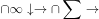

- **A**. 

- **B**. 

　✅
- **C**. 

- **D**. 
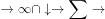

**答案**：B

**官方解析**

第一步：分析题干字符间逻辑关系。
第一个字符和第五个字符相同，第四个字符和第七个字符相同，其他字符都不相同。
第二步：逐一分析选项。
A项：第一个字符和第五个字符相同，但第三个字符和第六个字符也相同，排除；
B项：第一个字符和第五个字符相同，第四个字符和第七个字符相同，其他字符都不相同，与题干一致，当选；
C项：第一个字符和第五个字符不同，排除；
D项：第一个字符和第五个字符及第七个字符都相同，排除。
故正确答案为B。

---

### 第 13 题　qid 1791630 · 图形推理

每道题在上边的题干中给出一套图形，其中有五个图，这五个图呈现一定的规律性。在下边给出一套图形，其中有四个图，从中选出唯一的一项作为保持上边五个图规律性的第六个图：

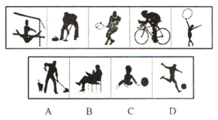

- **A**. A
- **B**. B
- **C**. C
- **D**. D　✅

**答案**：D

**官方解析**

观察发现图形中的人都在进行不同的运动，A项拖地、B项在椅子上坐着、C项小孩玩球，都不是运动，排除；只有D项踢足球是运动项目，当选。
故正确答案为D。

---

### 第 14 题　qid 1791632 · 图形推理

每道题在上边的题干中给出一套图形，其中有五个图，这五个图呈现一定的规律性。在下边给出一套图形，其中有四个图，从中选出唯一的一项作为保持上边五个图规律性的第六个图。

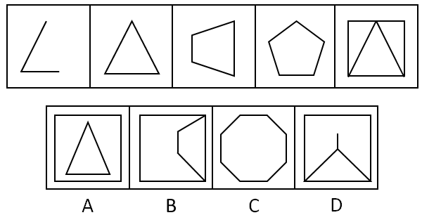

- **A**. A
- **B**. B　✅
- **C**. C
- **D**. D

**答案**：B

**官方解析**

元素组成不同，无属性规律，考虑数数。观察发现题干都是直线图形，考虑数直线，题干图形的直线数量为2-3-4-5-6-？，？号处应为7条直线的图形，A、B、D项都为7条直线，C项为8条直线，排除C。
再次观察图形发现，题干图形均为一笔画图形，A、D项均为两笔画图形，B项为一笔画图形，排除A、D项。
故正确答案为B。

---

### 第 15 题　qid 1791634 · 图形推理

每道题在上边的题干中给出一套图形，其中有五个图，这五个图呈现一定的规律性。在下边给出一套图形，其中有四个图，从中选出唯一的一项作为保持上边五个图规律性的第六个图： 

- **A**. A　✅
- **B**. B
- **C**. C
- **D**. D

**答案**：A

**官方解析**

题干元素组成相似，但无明显的样式规律。考虑数数，发现元素换算以及单个元素数目均不呈现规律。观察发现，每幅图形中的元素排布特点均为每一行的元素都是同一种。只有A选项满足此规律。
故正确答案为A。

---

### 第 16 题　qid 1791636 · 图形推理

下边四个图形中，只有一个是由上边的四个图形拼合而成（只能通过上、下、左、右进行移动），请把它找出来：

- **A**. A
- **B**. B　✅
- **C**. C
- **D**. D

**答案**：B

**官方解析**

本题考查平面拼合，可采用平行且等长相消的方法解题。消去平行且等长的线段后进行组合即可得到轮廓图，即为B选项。平行且等长相消的方法如下图所示：

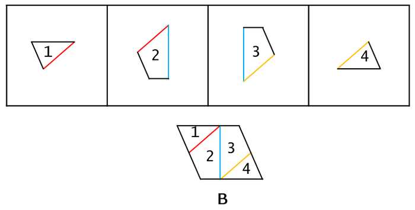

故正确答案为B。

---

### 第 17 题　qid 1791638 · 图形推理

下边四个图形中，只有一个是由上边的四个图形拼合而成（只能通过上、下、左、右进行移动），请把它找出来：

- **A**. A
- **B**. B
- **C**. C
- **D**. D　✅

**答案**：D

**官方解析**

本题考查的是平面拼合，可以采用平行等长消去的方法。消去平行等长的线段（相同颜色标注）后进行组合得到轮廓图，即为D选项。平行等长消去方法如下图所示：

故正确答案为D。

---

### 第 18 题　qid 1791640 · 图形推理

下边四个图形中，只有一个是由上边的四个图形拼合而成（只能通过上、下、左、右进行移动），请把它找出来：

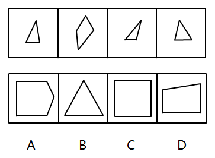

- **A**. A
- **B**. B　✅
- **C**. C
- **D**. D

**答案**：B

**官方解析**

本题考查的是平面拼合，可以采用平行等长消去的方法。消去平行等长的线段（相同颜色标注）后进行组合得到轮廓图，即为B选项。平行等长消去方法如下图所示：

故正确答案为B。

---

### 第 19 题　qid 1791642 · 图形推理

左边这个图形是由右边四个图形中的某一个作为外表面折叠而成，请指出它是哪一个？

- **A**. A
- **B**. B
- **C**. C
- **D**. D　✅

**答案**：D

**官方解析**

本题属于空间重构类，逐一分析选项，将题干如图一标号。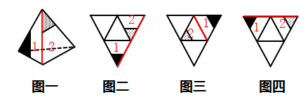

由题干图形可知，1面和2面为相邻面，标红的线即为两个面的公共边，可以观察到，2面上的灰色三角形有条边挨着这条标红的公共边，而1面上的黑色三角形没有边与标红的公共边挨着。

A项：如图二所示，选项中，1面和2面的公共边即为标红的线条，可以发现在公共边上灰色三角形和黑色三角形都有边与公共边挨着，和题干已知图形不一致，排除；

B项：如图三所示，选项中，1面和2面的公共边即为标红的线条，可以发现在公共边上灰色三角形和黑色三角形都没有边与公共边挨着，和题干已知图形不一致，排除；

C项：如图四所示，C选项中，1面和2面的公共边即为标红的线条，可以发现在公共边上灰色三角形和黑色三角形都有边与公共边挨着，和题干已知图形不一致，排除。

故正确答案为D。

---

### 第 20 题　qid 1791644 · 图形推理

左边这个图形是由右边四个图形中的某一个作为外表面折叠而成，请指出它是哪一个？

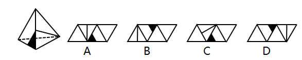

- **A**. A
- **B**. B
- **C**. C
- **D**. D　✅

**答案**：D

**官方解析**

本题属于空间重构类，逐一分析选项。
由题干图形可知，所给两个面公共边的中点上发出了一条直线。
A项：两个面的公共边的中点没有发出直线，和题干已知图形不一致，排除；
B项：两个面的公共边的中点没有发出直线，和题干已知图形不一致，排除；
C项：两个面的公共边的中点没有发出直线，和题干已知图形不一致，排除；
D项：两个面公共边的中点上发出了一条直线，和题干已知图形一致，当选。
故正确答案为D。

---

### 第 21 题　qid 1791646 · 图形推理

左边这个图形是由右边四个图形中的某一个作为外表面折叠而成，请指出它是哪一个？

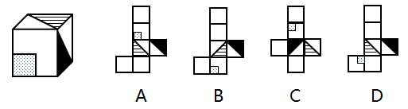

- **A**. A
- **B**. B
- **C**. C　✅
- **D**. D

**答案**：C

**官方解析**

对选项的面进行标号，如下图所示。

A项：选项中面2、3、4为左边所展示的面，选项中三个面的公共点仅连接了面4的对角线，但在原图中连接了面3和面4的两条对角线，排除；

B项：选项中面3、4、6为左边所展示的面，选项中三个面的公共点为面3灰色三角形的直角处，但在原图中三个面的公共点为灰色三角形的锐角处，排除；

C项：选项中面2、3、4为左边所展示的面，选项中三个面的公共点为面3和面4的对角线交点处，原图中三个面的公共点也是面3和面4的对角线交点处，公共点相同，排除不了，先保留；

D项：选项中面3、4、5为左边所展示的面，选项中面4和面5是z字型两端，为相对面，不可能同时出现，排除。

故正确答案为C。

---

### 第 22 题　qid 1791648 · 图形推理

左边这个图形是由右边四个图形中的某一个作为外表面折叠而成，请指出它是哪一个？

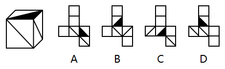

- **A**. A
- **B**. B
- **C**. C
- **D**. D　✅

**答案**：D

**官方解析**

对选项的面进行标号，如下图所示。

A项：选项中面4、5、6为左边所展示的面，选项中三个面的公共点发散出两条对角线，但在原图中仅发散出一条对角线，排除；

B项：选项中面2、4、5为左边所展示的面，选项中三个面的公共点没有发散出对角线，但在原图中发散出一条对角线，排除；

C项：选项中面3、4、6为左边所展示的面，选项中三个面的公共点为面4直角三角形左下的锐角处，而在原图中三个面的公共点为直角三角形的直角处，排除。

故正确答案为D。

---

### 第 23 题　qid 1791650 · 逻辑判断

在某单位，老李非常尊重同事大张，而大张非常尊重新入职的技术员小陈。老李是单位的领导之一，职位比小陈高。
根据以上陈述，可以得出以下哪项？

- **A**. 大张的职位比老李高
- **B**. 老李的职位比大张高
- **C**. 有人尊重比自己职位低的人　✅
- **D**. 有人尊重比自己职位高的人

**答案**：C

**官方解析**

第一步：分析题干所给的信息。
老李尊重大张，大张尊重小陈，老李职位比小陈职位高。
第二步：根据题干信息逐一分析选项。
A项：题干中没有提及大张和老李的职位高低，无法推出，排除；
B项：题干中没有提及大张和老李的职位高低，无法推出，排除；
C项：“有人尊重比自己职位低的人”，假设大张比老李的职位高，那么通过老李职位比小陈职位高，大张又尊重小陈，可以推出有人尊重比自己职位低的人；假设大张没有老李的职位高，通过老李尊重大张，也可以推出有人尊重比自己职位低的人，当选；
D项：“有人尊重比自己职位高的人”，题干已知老李职位比小陈职位高，但无法得出小陈是否尊重老李，排除。
故正确答案为C。

---

### 第 24 题　qid 1791652 · 逻辑判断

当一辆疾驰的汽车需要马上刹住时，几毫秒的反应时间是非常关键的。有时，区区几米的距离就决定着人的生死。最近有研究者利用模拟驾驶系统、眼球追踪技术等手段，让五组受试者面对动感不同的交通标志，然后测试他们做出反应的速度。结果发现，动感较强的交通标志确实能让受试者更快做出反应。由此，他们建议有关部门，应该将原有的交通警告标识牌全部置换为动感较强的标示牌，以便提高司机反应速度。
以下哪项如果为真，最能表明上述研究者的建议难以实现预期目标的是：

- **A**. 置换原有的交通警告标示牌是一项庞大、繁琐的工程，需要投入巨额成本
- **B**. 在研究者选取的五组受试者中，有的人驾龄并不长，有的人甚至还不会开车
- **C**. 当司机了解到较强动感交通警告标示牌的实际意义后，其反应速度又会降到从前的水平　✅
- **D**. 如果画面上的人看起来在跑，就容易让人联想到行人急匆匆从你车前经过的画面

**答案**：C

**官方解析**

第一步：找出论点论据。
论点：应该将原有的交通警告标识牌全部置换为动感较强的标示牌，以便提高司机反应速度。
论据：动感较强的交通标志确实能让受试者更快做出反应。
第二步：逐一分析选项。
A项：“置换原有的交通警告标示牌需要投入巨额成本”和论点中讨论的动感较强的标示牌可以提高司机的反应速度无关，无关项，排除；
B项：“有的人驾龄并不长，有的人甚至还不会开车”，这说明不同的受试者反应速度都提高了，说明该建议有效，加强选项，排除；
C项：“当司机了解到较强动感交通警告标示牌的实际意义后，其反应速度又会降到从前的水平”，说明动感交通警告牌没有起到提高反应速度的效果，削弱论据，当选；
D项：“容易联想到行人急匆匆从你车前经过的画面”和是否可以提高司机的反应速度无关，无关项，排除。
故正确答案为C。

---

### 第 25 题　qid 1791654 · 逻辑判断

考入蓝天外国语学校的学生，一般都被认为是学霸级人物。虽然聪明、勤奋的同学未必都能成为蓝天外国语学校的学生，但是蓝天外国语学校的学生多半聪明或勤奋。
根据以上陈述，可以得出以下哪项？

- **A**. 有的聪明、勤奋的同学必然不会成为蓝天外国语学校的学生
- **B**. 有的聪明、勤奋的同学可能不会成为蓝天外国语学校的学生　✅
- **C**. 大多数蓝天外国语学校的学生既聪明又勤奋
- **D**. 有少数蓝天外国语学校的学生既聪明又勤奋

**答案**：B

**官方解析**

本题考查模态命题。题干中“虽然聪明、勤奋的同学未必都能成为蓝天外国语学校的学生”，出现了未必，未必=不必然=可能不。因此A项错误，B项正确；
题干中“蓝天外国语学校的学生多半聪明或勤奋”，聪明与勤奋之间的关联词为“或”关系，而C、D选项中聪明与勤奋之间为“且”关系，排除。
故正确答案为B。

---

### 第 26 题　qid 1789572 · 逻辑判断

甲、乙、丙、丁、戊5支足球队进行小组单循环赛。比赛规定：每队胜一场得3分，平一场得1分，负一场得0分；积分前两名出线。比赛结束后发现，没有积分相同的球队，乙队胜了3场，另一场负于甲队。
根据以上信息，可得出以下哪项？

- **A**. 甲队一定出线
- **B**. 乙队一定出线　✅
- **C**. 丙队一定出线
- **D**. 戊队一定出线

**答案**：B

**官方解析**

第一步：分析题干条件。
（1）5支球队进行单循环赛，每队胜一场得3分，平一场得1分，负一场得0分；
（2）没有积分相同的球队；
（3）乙队胜了3场，另一场负于甲队。
第二步：根据题干条件进行推理。
共有5支球队，进行小组单循环赛，每个球队都要进行4场比赛，乙队胜了3场，只有一场负于甲队，那么丙、丁、戊3队每队已经分别输给乙队一场。题干最后一句说没有积分相同的球队，所以丙、丁、戊3队在剩下的比赛中不可能3场均取得胜利，因此积分必然低于乙队。由于前两名出线，那么乙队必然出线。
故正确答案为B。

---

### 第 27 题　qid 1789576 · 逻辑判断

荷兰画家梵高在一家精神病院里创作了著名的绘画作品《星空》。这幅画作中的“漩涡”引起了人们长期的争论，许多心理学家认为，“漩涡”是梵高当时脆弱心理状态的延伸和表现。欧洲航天局近日发布了一幅根据“普朗克”卫星探测绘制的星空图，神奇的是，这幅图与《星空》有惊人的相似之处。有艺术家认为，自然的星空正是梵高创作的灵感来源。
以下各项如果为真，则除了哪项均能支持上述艺术家的观点？

- **A**. 梵高的创作灵感一般均有明显的现实来源
- **B**. 《星空》的创作年代要远早于卫星绘制星空图的年代　✅
- **C**. 梵高具有超越常人的视觉观察能力与想象能力
- **D**. 卫星绘制的星空图和《星空》的画面大体是一致的

**答案**：B

**官方解析**

第一步：找出论点和论据。
论点：自然的星空正是梵高创作的灵感来源。
论据：欧洲航天局近日发布了一幅根据“普朗克”卫星探测绘制的星空图，与《星空》有惊人的相似之处。
第二步：逐一分析选项。
A项：梵高的创作灵感一般均有明显的现实来源，说明《星空》的创作和现实有关系，补充论据支持论点，可以加强，排除；
B项：《星空》的创作年代要远早于卫星绘制星空图的年代，创作年代与梵高是否受到自然星空的影响无关，无关项，无法加强，当选；
C项：梵高具有超越常人的视觉观察能力与想象能力，《星空》的画面可能是他在现实中观测到的，补充论据支持论点，可以加强，排除；
D项：卫星绘制的星空图和《星空》的画面大体是一致的，说明梵高创作的《星空》与自然的星空相似，补充论据支持论点，可以加强，排除。
本题为选非题，故正确答案为B。

---

### 第 28 题　qid 1791660 · 逻辑判断

某金融机构计划在欧洲和亚洲分别设立一个办事处，候选城市有6个，亚洲的吉隆坡、香港和首尔，欧洲的苏黎世、伦敦和法兰克福。该机构的两名工作人员就办事处的设立城市进行了如下猜测：
张经理：亚洲办事处一定会设在吉隆坡，绝不会设在首尔；
陈经理：欧洲办事处一定会设在伦敦，绝不会设在苏黎世。
事后得知，两人的猜测都只有一半是正确的。
根据以上信息，以下哪项是错误的判断？

- **A**. 亚洲办事处设在香港
- **B**. 欧洲办事处设在法兰克福
- **C**. 亚洲办事处如果不设在香港，就会设在首尔
- **D**. 欧洲办事处如果不设在伦敦，那么也不会设在法兰克福　✅

**答案**：D

**官方解析**

本题为真假推理。根据题干确定信息：两人的猜测都只有一半是正确的，对张经理和陈经理的猜测进行分析。

假设张经理前半句对，即“亚洲办事处一定会设在吉隆坡”，那么张经理后半句“绝不会设在首尔”也对，张经理前后两句话都对，与题干矛盾，所以假设错误，说明张经理的前半句是错的（即亚洲办事处不在吉隆坡），且后半句对。说明亚洲办事处只能设在香港。 

同理，假设陈经理的前半句是对的，即“欧洲办事处一定会设在伦敦”，那么陈经理后半句“绝不会设在苏黎世”也对，陈经理的前后两句话都对，与题干矛盾，所以假设错误，说明陈经理的前半句是错的（即欧洲办事处不在伦敦），后半句对。说明欧洲办事处只能设在法兰克福。 

A项：亚洲办事处设在香港正确，选非排除； 

B项：欧洲的办事处设在法兰克福正确，选非排除； 

C项：香港首尔，已知亚洲办事处设立在香港，即否定了C项前件，当前件为假时，则该命题为真，C项正确，选非排除； 

D项：伦敦法兰克福，已知欧洲办事处设立在法兰克福，即否定了D项的后件，根据逆否等价推出欧洲办事处设在伦敦，与题干推导出设在法兰克福矛盾，错误，选非当选。 

本题为选非题，故正确答案为D。

---

### 第 29 题　qid 1791662 · 逻辑判断

一项研究选取80名13岁到25岁出现精神分裂症早期症状的年轻人作为被试对象，随机选取其中的一半人服用鱼油片剂3个月，另一半人都用安慰剂3个月。研究人员对受试者跟踪考察7年后发现，在服用鱼油片剂组中，只有的人罹患精神分裂症；而在服用安慰剂组中，罹患这种疾病的人则高达。由此，研究人员得出结论：服用鱼油片剂有助于青少年预防精神分裂症。

以下各项如果为真，则除了哪项均能质疑上述研究人员的结论？ 

- **A**. 被试对象的数量仍然偏少，且每个被试者在7年中的发展差异较大
- **B**. 被试对象的年龄跨度较大，实验开始时有人可能已是青年而非少年
- **C**. 鱼油片剂曾被尝试治疗成年精神分裂症患者，但实验发现没有效果　✅
- **D**. 被试对象服用鱼油片剂的时间较短，不足以形成稳定、明显的疗效

**答案**：C

**官方解析**

第一步：找出论点和论据。

论点：服用鱼油片剂有助于青少年预防精神分裂症。

论据：一项针对出现精神分裂症早期症状的年轻人的研究中，服用鱼油片剂组中，只有的人罹患精神分裂症，服用安慰剂组中，罹患精神分裂症的人高达。

第二步：逐一分析选项。

A项：被试对象数量偏少，被试者在7年间发展差异大，说明论据选取的研究样本不具代表性，试验设计不科学，削弱了论据，本题选不能质疑的，排除；

B项：被试年龄跨度大，有的被试者在实验开始时可能已经是青年，说明论据选取的研究样本不够科学，削弱了论据，本题选不能质疑的，排除；

C项：实验发现鱼油片剂治疗成年精神分裂症患者没有效果，与鱼油片剂是否有助于青少年预防精神分裂症无关，主题不一致，本题选不能质疑的，当选；

D项：被试服用鱼油片剂的时间短，不足以形成稳定、明显的疗效，说明论据的研究过程不够科学，削弱了论据，本题选不能质疑的，排除。

本题为选非题，故正确答案为C。

---

### 第 30 题　qid 1791664 · 逻辑判断

学校操场有6条环形跑道，从外向内分别为1至6道，王伟、李明、刘平、张强、钱亮、孙新6人分别占据其中一道。已知：
（1） 王伟的两侧是单数跑道，张强的两侧是双数跑道；
（2） 李明与张强隔着两个跑道，钱亮在王伟与李明中间的那个跑道；
（3） 刘平在单数跑道，孙新在双数跑道；
（4） 王伟不在第二跑道；
（5） 如果张强在第三跑道，那么王伟不在第四跑道。
根据以上陈述，可以得出以下哪项？

- **A**. 在刘平和孙新之间隔着4个跑道　✅
- **B**. 在钱亮和张强之间隔着2个跑道
- **C**. 在钱亮和孙新之间隔着3个跑道
- **D**. 在刘平和王伟之间隔着1个跑道

**答案**：A

**官方解析**

六个人分别占据六个跑道中的一道，整理题干给的5个条件如下：

（1）王伟在跑道2或跑道4（跑道6只有一侧是单数跑道），张强在跑道3或跑道5（跑道1只有一侧是双数跑道）；

（2）李明与张强隔着两个跑道，钱亮在王伟与李明中间的那个跑道；

（3）刘平在单数跑道，孙新在双数跑道；

（4）王伟不在跑道2；

（5）张强在跑道3→王伟不在跑道4王伟在跑道4→张强不在跑道3；

由条件（1）和条件（4）可知，王伟在跑道4，又由条件（5）可知，张强不在跑道3，则张强在跑道5，如图1所示：

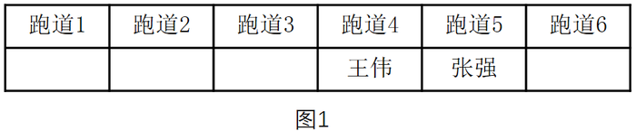

由条件（2）李明与张强隔着两个跑道可知，李明在跑道2，钱亮在王伟与李明中间的那个跑道可知，钱亮在跑道3，如图2所示：

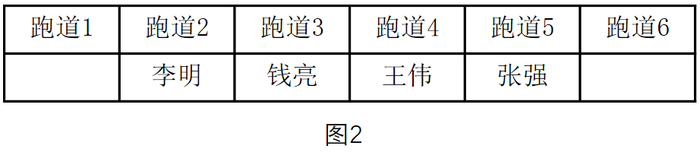

进而由条件（3）可知刘平在跑道1，孙新在跑道6，如图3所示：

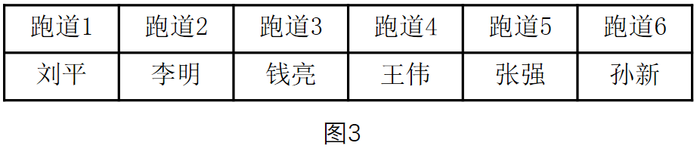

A项：刘平和孙新之间隔着4个跑道，A项正确，当选；

B项：钱亮和张强之间隔着1个跑道，B项错误，排除；

C项：钱亮和孙新之间隔着2个跑道，C项错误，排除；

D项：刘平和王伟之间隔着2个跑道，D项错误，排除。

故正确答案为A。

---

### 第 31 题　qid 1791842 · 定义判断

条件性承诺，指在社会活动中，一方对另一方作出附带条件的承诺。
下列属于条件性承诺的是：

- **A**. 小琴考上了重点高中，老爸奖励她到国外旅游一周
- **B**. 某公司老总答应给考核优秀员工每人每月加薪200元　✅
- **C**. 陈某对女儿说：“老妈将一如既往支持你报考研究生。”
- **D**. 小雨为自己立规，不减肥5斤，就拒绝参加朋友聚会

**答案**：B

**官方解析**

第一步：找出定义关键词。
“一方对另一方”、“附带条件的承诺”。
第二步：逐一分析选项。
A项：小琴考上了重点高中，老爸奖励国外旅游，仅仅只是局限于考上了的奖励，并不涉及考前对此有承诺，因此不符合定义，排除；
B项：老总答应加薪，这是一种承诺，而附带的条件则是要考核为优秀，因此符合定义，当选；
C项：陈某表示支持女儿报考研究生，没有体现附带条件，因此不符合定义，排除；
D项：小雨给自己减肥定规矩，只是涉及到单方面的个人，而不存在另一方，因此不符合定义，排除。
故正确答案为B。

---

### 第 32 题　qid 1791844 · 定义判断

趋同感应：指在社会交往过程中，一方能够把握另一方的心理状态，并且能够设身处地体验对方心理。
下列属于趋同感应的是：

- **A**. 天下谁人不识君
- **B**. 天生我材必有用
- **C**. 同是天涯沦落人　✅
- **D**. 一片冰心在玉壶

**答案**：C

**官方解析**

第一步：找出定义关键词。
关键词为“把握另一方的心理状态”、“设身处地体验对方心理”。
第二步：逐一分析选项。
A项：“天下谁人不识君”指天下哪个不知道你啊，没有体现“把握另一方的心理状态”，排除；
B项：“天生我材必有用”指上天生下我一定有需要用到我的地方，没有体现“把握另一方的心理状态”，排除；
C项：“同是天涯沦落人”指同样都是沦落世间的人，体现了“把握另一方的心理状态”，体验了对方的心理，当选；
D项：“一片冰心在玉壶”指我的心就像盛在玉壶的冰那样洁白透明，没有体现“把握另一方的心理状态”，排除。
故正确答案为C。

---

### 第 33 题　qid 1789620 · 定义判断

路怒症：指机动车驾驶者在行车过程中因焦躁、愤怒情绪而产生的攻击性行为。
下列不属于路怒症的是：

- **A**. 在路口等红灯时，小张感觉汽车被碰了一下，下车一看，果然是后车刹车不及时追尾了。小张猛踢后车车轮，大声责怪其司机并且索要赔偿
- **B**. 妻子开车送老陈去上班，一辆小汽车突然窜到了面前，险些撞到他的车，老陈下车拦住那辆车，把司机痛斥一顿　✅
- **C**. 小李开了8年车，技术高超，每次被人超车，都忍不住狂踩油门飚上一把，直到反超并羞辱对方一番才罢休
- **D**. 小王正在赶路，旁边车子中飞出一个纸团突然落在他的挡风玻璃上，小王十分生气，他猛按喇叭，嘴里骂个不停

**答案**：B

**官方解析**

第一步：找出定义关键词。
“机动车驾驶者”、“行车过程中”、“因焦躁、愤怒情绪”、“产生的攻击性行为”。
第二步：逐一分析选项。
A项：小张因为后车刹车不及时追尾导致了愤怒情绪，猛踢后车车轮、大声责怪属于“攻击性行为”，符合定义，排除；
B项：妻子开车送老陈上班，妻子是机动车驾驶者，老陈是乘客，老陈不符合定义中的“机动车驾驶者”，不符合定义，当选；
C项：小李被人超车后飙车体现了“愤怒情绪”，反超并羞辱对方一番，符合定义中的“攻击性行为”，符合定义，排除；
D项：小王十分生气，猛按喇叭，嘴里骂个不停，符合定义中的“机动车驾驶者因愤怒情绪而产生的攻击性行为”，符合定义，排除。
本题为选非题，故正确答案为B。

---

### 第 34 题　qid 1791674 · 定义判断

有我之境：指审美过程中包含客体性的自然景物，也蕴藏审美者的主观感受。即作为观察对象的客观事物染上观察者的主观色彩。
下列最能体现有我之境的是：

- **A**. 明月松间照，清泉石上流
- **B**. 星垂平野阔，月涌大江流
- **C**. 片云天共远，永夜月同孤　✅
- **D**. 明月出天山，苍茫云海间

**答案**：C

**官方解析**

第一步：找出定义关键词。
“包含客体性的自然景物，也蕴藏审美者的主观感受”。
第二步：逐一分析选项。
A项：出自唐代诗人王维的《山居秋暝》，仅仅是在描写山间的自然景色，没有蕴藏审美者的主观感受，不符合定义，排除；
B项：出自唐代诗人杜甫的《旅夜书怀》，仅仅是在描写江边的景色，没有蕴藏审美者的主观感受，不符合定义，排除；
C项：出自唐代诗人杜甫的《江汉》，字面上写的是诗人所看到的片云孤月，实际上是用它们暗喻诗人自己。诗人把内在的感情融入外在的景物当中，感慨自己虽然四处飘零，但对国家的忠心却依然像孤月般皎洁，蕴藏审美者的主观感受，符合定义，当选；
D项：出自唐代诗人李白的《关山月》，仅仅是在描绘边塞的风光，没有蕴藏审美者的主观感受，不符合定义，排除。
故正确答案为C。

---

### 第 35 题　qid 1789604 · 定义判断

自然淘汰育种法，指在良种筛选过程中，减少人为干预，尽量通过被筛选对象的自然生长确定所需良种的育种方法。
下列属于自然淘汰育种法的是：

- **A**. 
甲鱼养殖场为了选育出抗病力强的种鱼，在甲鱼接连死亡的情况下，不施加任何药物而任其发展，存活到最后的则作为种鱼
　✅
- **B**. 
锦鲤养殖户从幼鱼开始分拣最有经济价值的鱼苗，经过三次人工选鱼后，最终只有不到的幼鱼成了精品锦鲤

- **C**. 
石斛养殖户爬上人迹罕至的悬崖峭壁采集野生石斛，挑选其中的一部分作为种苗，精心培育出了多个新品种

- **D**. 
生长在同一片山坡上的某种植物，有的长势非常茂盛，有的则弱小枯黄，泾渭分明，这正是“物竞天择”的形象说明

**答案**：A

**官方解析**

第一步：找出定义关键词。
“筛选过程中”、“减少人为干预”、“自然生长”、“确定所需良种”。
第二步：逐一分析选项。
A项：甲鱼养殖场不施加任何药物，相当于没有进行人为干预，尽量通过自然生长筛选，存活到最后的抗病力强的种鱼就是所需的良种，符合定义，当选；
B项：经过三次人工选鱼，说明多次进行人为干预，不符合“减少人为干预”，不符合定义，排除；
C项：养殖户人工采集野生石斛，并从中挑选种苗，不符合定义中的“减少人为干预”和“通过······自然生长确定所需良种”，不符合定义，排除；
D项：山坡上的植物长势是自然状态，并不是良种筛选的过程，不符合定义，排除。
故正确答案为A。

---

### 第 36 题　qid 1789612 · 定义判断

隐形就业：指没有通过传统就业渠道获取固定职业，处于相关部门就业统计范围之外的工作状态。
下列不属于隐形就业的是：

- **A**. 颜某辞去工作后，一边带孩子一边经营一奶粉网店
- **B**. 某教授受多家培训学校之邀，在工作之余常去授课　✅
- **C**. 小陈离开公司后专门为电商店铺提供平台搭建和维护服务
- **D**. 酷爱写作的小王，大学毕业后成了一家报社的自由撰稿人

**答案**：B

**官方解析**

第一步：找出定义关键词。
“没有通过传统就业渠道获取固定职业”、“处于相关部门就业统计范围之外”。
第二步：逐一分析选项。
A项：开奶粉网店符合定义中的“没有通过传统就业渠道获取固定职业”，符合定义，排除；
B项：某教授的本职工作是在高校授课，不符合定义中的“没有通过传统就业渠道获取固定职业”，并且无论其是否兼职授课，该教授都会处于相关部门的就业统计范围之内，不符合定义，当选；
C项：小陈专门为电商店铺提供平台搭建和维护服务符合定义中的“没有通过传统就业渠道获取固定职业”，符合定义，排除；
D项：自由撰稿人是一种新型的自由职业，符合定义中的“没有通过传统就业渠道获取固定职业”，符合定义，排除。
本题为选非题，故正确答案为B。

---

### 第 37 题　qid 1789686 · 定义判断

平行竞争：指各家厂商提供不同种类的产品以满足顾客同一需求而形成的竞争。
下列属于平行竞争的是：

- **A**. 冬天还没到，电器商场就摆满了各种取暖用品，空调、油汀、热电扇、电热毯应有尽有，价格有高有低，款式或经典或新潮　✅
- **B**. 为了扩大市场份额，某公司新近推出了一款平板电脑，硬盘容量有64G、128G和256G三种规格，供不同层次的消费者选择
- **C**. 只要走进地下商城，马上就会有一群人把你团团围住，卖服装的、卖玩具的、卖食品的······迫不及待地要把你控制在自己的摊位上
- **D**. 小李拿到了1万多元年终奖，准备好好奖励自己，现在正纠结于出国放假、买笔记本电脑还是黄金首饰

**答案**：A

**官方解析**

第一步：找出定义关键词。
“满足顾客同一需求”、“提供不同种类的产品”、“各家厂商”、“竞争”。
第二步：逐一分析选项。
A项：电器商场中有各种品牌，属于定义中的“各家厂商”，空调、油汀、热电扇等属于不同种类的产品，都是为满足顾客取暖的同一需求，体现出厂家间的竞争，符合定义，当选；
B项：平板电脑规格不同但都是同一家公司推出的，不存在厂家间的竞争，不符合定义，排除；
C项：服装、玩具、食品满足的是消费者的不同需求，不符合定义，排除；
D项：出国旅游、买电脑还是买黄金首饰满足的是小李的不同需求，不符合定义，排除。
故正确答案为A。

---

### 第 38 题　qid 2033748 · 定义判断

交友泡沫化指基于各种现实需要而有意扩大朋友范围或虽有交往却从未谋面的朋友泛化现象。
下列不属于交友泡沫化的是：

- **A**. 游戏爱好者的账号中都有一串不知道真名实姓的朋友
- **B**. 饭局上，即使不太熟悉的人也会以哥们、兄弟相称
- **C**. 小昊说自己微信朋友圈里有许多从未见过面的好友
- **D**. 大多数人都习惯把交情比较深的同事也称为朋友　✅

**答案**：D

**官方解析**

第一步：找出定义关键词。
“基于各种现实需要而有意扩大朋友范围或虽有交往却从未谋面的朋友泛化”。
第二步：逐一分析选项。
A项：游戏爱好者的账号中的朋友是为了共同参与游戏，属于有意扩大朋友范围，不知道真名实姓的朋友说明从未谋面，符合定义，排除； 
B项：在饭局上和不熟悉的人称兄道弟是基于某种现实需要而有意扩大朋友范围的一种手段，符合定义，排除； 
C项：微信中的好友是为了交流，属于有意扩大朋友范围，从未见过面说明从未谋面，符合定义，排除； 
D项：把交情比较深的同事称为朋友说明之前是有过谋面的，不符合定义，当选。
本题为选非题，故正确答案为D。

---

### 第 39 题　qid 1791682 · 定义判断

新农人：指具有科学文化素质、掌握现代农业生产技能，以农业生产、经营、服务作为职业的劳动者。
下列不属于新农人的是：

- **A**. 蔡某大学毕业后，利用自己学到的新技术培育种植出了方形南瓜、彩色辣椒等，销路很好
- **B**. 回乡创业的程某，几年来致力于推广无土瓜果种植技术，圆了全村不少家庭的致富梦
- **C**. 小李高考落榜后，在政府政策扶持下，在自己家乡养起来了猪，10多年下来，已经走上了富裕路　✅
- **D**. 小朱在部队掌握了养牛技术，转业回乡后自办奶牛场，建起了一个直销网站，为客户提供周到服务

**答案**：C

**官方解析**

第一步：找到定义关键词。
“具有科学文化素质、掌握现代农业生产技能，以农业生产、经营、服务作为职业的劳动者”。
第二步：逐一分析选项。
A项：利用大学学到的新技术说明具有科学文化素质、掌握现代农业生产技能，培养方形南瓜、彩色辣椒等说明是以农业生产作为职业，符合定义，排除； 
B项：推广无土瓜果种植技术说明掌握现代农业生产技能，服务对象是全村家庭说明是以农业服务作为职业，符合定义，排除； 
C项：虽然养猪属于农业生产，但在政府政策扶持下养猪并没有体现小李掌握了现代农业生产技能，不符合定义，当选； 
D项：在部队掌握了养牛技术说明有现代农业生产技能，建立直销网站为客户提供服务说明是以农业服务作为职业，符合定义，排除。
本题为选非题，故正确答案为C。

---

### 第 40 题　qid 1791684 · 定义判断

社会概称意识：指人们对某一社会群体所持有的比较固定的、概括而笼统的看法。
下列属于社会概称意识的是：

- **A**. 某民族认为狼都是凶残、贪婪的
- **B**. 非洲某部落视天狼星为其幸运星
- **C**. 不少年轻人认为养宠物最有爱心
- **D**. 南方人认为北方人是不怕冷的　✅

**答案**：D

**官方解析**

第一步：找到定义关键词。
“人们对某一社会群体所持有的比较固定的、概括而笼统的看法”。
第二步：逐一分析选项。
A项：狼不属于社会群体，不符合定义，排除； 
B项：天狼星不属于社会群体，不符合定义，排除； 
C项：养宠物是一种行为，不是社会群体，不符合定义，排除； 
D项：不怕冷是南方人对北方人这一社会群体持有的比较固定的、概括而笼统的看法，符合定义，当选。
故正确答案为D。

---

### 第 41 题　qid 1789586 · 定义判断

逆势扩张：指企业在面临巨大压力和困难的情况下，进一步巩固和拓展市场，在竞争中抢占先机的经营行为。
下列不属于逆势扩张的是：

- **A**. 当大多数的国产品牌彩电市场份额纷纷下滑的时候，某电视厂家却连续推出了几款超级电视，市场占比高歌猛进，遥遥领先几大洋品牌
- **B**. 某汽车油箱销售公司是我国规模较大的自主品牌出口企业，近期已正式进入预先披露更新企业名单之列，向上市的目标又迈进了一步　✅
- **C**. 在人们普遍认为房地产调控政策将严重影响家居行业之际，某品牌家具高调宣布，最近在省城及周边地区又成功开设了多家专营店
- **D**. 国内零售行业近期表现欠佳，各销售企业纷纷收缩实体阵地，某民营企业今日却在省城新增了一家购物中心，另外两家不久也将开业

**答案**：B

**官方解析**

第一步：找出定义关键词。
“企业”、“面临巨大压力和困难”、“进一步巩固和拓展市场”、“在竞争中抢占先机”。
第二步：逐一分析选项。
A项：国产品牌彩电市场份额纷纷下滑符合“企业面临巨大压力和困难”，某电视厂家却连续推出几款超级电视，市场占比高歌猛进，是“进一步巩固和拓展市场”，最后遥遥领先几大洋品牌属于“在竞争中抢占先机”，符合定义，排除；
B项：某汽车油箱销售公司属于企业，近期已正式进入预先披露更新企业名单之列，向上市目标迈进一步，并没有体现题干中所提到的困难的环境，也没有体现出在竞争中抢占先机，不符合定义，当选；
C项：家居行业受到房地产调控政策影响，符合“企业面临巨大压力和困难”，某品牌家具在省城及周边地区成功开设了多家专营店体现了“进一步巩固和拓展市场”“在竞争中抢占先机”，符合定义，排除；
D项：零售行业表现不佳，符合“企业面临巨大压力和困难”，某民营企业新开购物中心属于定义中的“进一步巩固和拓展市场”“在竞争中抢占先机”，符合定义，排除。
本题为选非题，故正确答案为B。

---

### 第 42 题　qid 2032242 · 定义判断

假摔式降费：指企业在外部压力之下采取的一些表面降幅很大，实际上并未惠及广大消费者的调价策略。
下列属于假摔式降费的是：

- **A**. 在“双十一”价格大战中，某知名家电企业大幅调整了多种产品的零售价格，一周内，这些产品在全城各大商场均纷纷售罄
- **B**. 某城市的几家大商场为了抢占节日市场，联手采用打折促销的手段，消费人数呈上升之势
- **C**. 为落实上级有关部门的降费要求，某运营商很快公布了夜间国际漫游降低费用的具体方案　✅
- **D**. 根据上级规定，某旅游景区在其官网上发布了不涨价承诺，游客们很快发现其中的不少景点本来就是免费景点

**答案**：C

**官方解析**

第一步：找到定义关键词。
关键词为“企业”、“降幅很大”、“实际上并未惠及广大消费者的调价策略”。
第二步：逐一分析选项。
A项：家电企业大幅调整价格后其惠及的群体是各大商场的购买者，消费者能够得到实际的好处，与题干定义关键词不符，排除；
B项：几家大商场联手打折促销，惠及的群体是“上升趋势的消费人数”，实际上惠及了大量消费者，与题干定义关键词不符，排除；
C项：降低夜间国际漫游费用，体现了定义中的关键词“降幅”，但是降价之后有没有人会在夜间使用国际漫游，或者说有没有消费者得到实际的好处是不确定的，保留；
D项：不涨价承诺并未体现“降幅”，与题干定义关键词不符，排除。
对比选项：A、B两项中的消费者都明确地获得了实际的好处，C项中的消费者有没有获得实际好处是不明确的，此时对比也只能选择C项。
故正确答案为C。

---

### 第 43 题　qid 1789594 · 定义判断

优势反应：指熟练程度极高、遇到某种刺激时不加思考就做出来的习惯性动作。
下列不属于优势反应的是：

- **A**. 中国人遇到多年未见的朋友时，一般都伸出右手去和对方握手
- **B**. 在街上听到有人喊自己名字，人们总会循着声音方向去寻找
- **C**. 人们无意之中伸进滚烫的开水，瞬间就会把手缩回　✅
- **D**. 小丽在家看小说时，一碰到不认识的字就会下意识地去查字典

**答案**：C

**官方解析**

第一步：找出定义关键词。
“熟练程度极高”、“遇到某种刺激”、“不加思考就做出来的习惯性动作”。
第二步：逐一分析选项。
A项：遇到了多年未见的朋友体现了“遇到某种刺激”，一般伸出右手和对方握手符合“熟练程度极高的动作”，符合定义，排除；
B项：听到有人喊自己名字体现了定义中的“遇到某种刺激”，总会循着声音方向去寻找属于“不加思考就做出来的习惯性动作”，符合定义，排除；
C项：被热水烫这件事没有多少机会让人去熟悉，也没人经常把手伸到热水里，不属于定义中的“熟练程度极高的习惯性动作”，不符合定义，当选；
D项：看到不认识的字下意识地去查字典，这正是因为遇到过这种情况且通过查字典解决了问题，符合定义中的“熟练程度极高、不加思考就做出来的习惯性动作”，符合定义，排除。
本题为选非题，故正确答案为C。

---

### 第 44 题　qid 1791852 · 定义判断

安全性思维，指经过观察后，对当前事物或事件的发展作出对自己不利的预测，并做好防备。
下列属于安全性思维的是：

- **A**. 小李从小体质虚弱，三天两头感冒，坚持了10年冬泳后，现在已经很少生病了
- **B**. 公司经营越来越难，小陈觉得肯定会裁员，悄悄到人才市场投递了几份简历　✅
- **C**. 公共汽车上来了一个驼背老人，小王怕他跌倒受伤，便把自己的座位让给了老人
- **D**. 这两天气温骤降，老张要到北方出差，妻子特意往他的行李箱里塞了几件厚衣服

**答案**：B

**官方解析**

第一步：找出定义关键词。
原因：“作出对自己不利的预测”。
结果：“做好防备”。
第二步：逐一分析选项。
A项：小李并没有对当前事物的发展作出对自己不利的预测，因此不符合定义，排除； 
B项：公司经营困难，小陈觉得会裁员是对事件发展作出了不利于自己的预测，悄悄到人才市场投简历是一种做好防备的行为，因此符合定义，当选；
C项：小王是怕驼背老人跌倒，不是对自己作不利的预测，因此不符合定义，排除；
D项：老张的妻子特意在他的行李箱里塞几件厚衣服，并不是对自己作出不利的预测，因此不符合定义，排除。
故正确答案为B。

---

### 第 45 题　qid 2032210 · 定义判断

粉丝文化：指个人或者群体出于对某一特定对象的追捧心理，所引发的过度崇拜、过度消费、无偿付出等社会文化现象。
下列不属于粉丝文化的是：

- **A**. 某位学者在电视台成功地举办了多次讲座，从此以后，他上课的教室外边常常挤满了慕名而来请求签名、合影的学生、市民
- **B**. 为了让歌手小杨在选秀节目中脱颖而出，许多陌生的年轻人自发组织起来，天天台前幕后地拉选票、拉赞助，忙得不亦乐乎
- **C**. 小张是一家娱乐类刊物的记者，他的主要任务是报道演艺圈的动态消息。有时为了追踪一个明星，甚至连饭都顾不上吃　✅
- **D**. 小丽是《舌尖上的中国》的忠实观众，她把每一期节目都下载到自己的电脑中反复观看，经常到废寝忘食的地步

**答案**：C

**官方解析**

第一步：找出定义关键词。
“出于对某一特定对象的追捧心理”、“过度崇拜、过度消费、无偿付出等”。
第二步：逐一分析选项。
A项：慕名而来请求签名、合影的学生和市民是出于对学者的追捧心理，对学者的支持、喜爱是一种无偿付出，符合定义，排除；
B项：陌生人自发组织为歌手小杨拉选票、拉赞助是出于对小杨的追捧心理引发的无偿付出的现象，符合定义，排除；
C项：小张追踪明星是出于工作需要，并不是对明星的追捧，不符合定义，当选；
D项：小丽是《舌尖上的中国》的忠实观众，看节目废寝忘食是出于对节目的追捧心理所引发的过度崇拜的现象，符合定义，排除。
本题为选非题，故正确答案为C。

---
