# 2016年江苏省公务员录用考试《行测》题（C类）

> 判断推理 · 45 题 · 江苏 2016

## 第 1 题　qid 1791790 · 类比推理

播种：庄稼

- **A**. 烹饪：美食　✅
- **B**. 填写：表格
- **C**. 品尝：绿茶
- **D**. 复印：文章

**答案**：A

**官方解析**

第一步：分析题干词语间逻辑关系。
播种的应该是种子，而不是庄稼，种子长大成熟后才会成为庄稼，播种目的是为了收获庄稼。
第二步：逐一分析选项。
A项：烹饪的应该是食材，而不是美食，食材经过烹饪后才会成为美食，烹饪的目的是为了得到美食，与题干逻辑关系一致，当选；
B项：填写表格是动宾关系，两者之间不是目的关系，与题干逻辑关系不一致，排除；
C项：品尝绿茶是动宾关系，两者之间不是目的关系，与题干逻辑关系不一致，排除；
D项：复印文章是动宾关系，两者之间不是目的关系，与题干逻辑关系不一致，排除。
故正确答案为A。

---

## 第 2 题　qid 1791792 · 类比推理

欧元：美元

- **A**. 公斤：公顷
- **B**. 小说：散文　✅
- **C**. 公里：小时
- **D**. 阴性：阳性

**答案**：B

**官方解析**

第一步：分析题干词语的逻辑关系。
欧元和美元都是货币单位，两者是反对关系。
第二步：逐一分析选项。
A项：公斤是重量单位，公顷是面积单位，两者不是反对关系，与题干逻辑关系不一致，排除；
B项：小说和散文都是文体的一种，两者是反对关系，与题干逻辑关系一致，当选；
C项：公里是距离单位，小时是时间单位，两者不是反对关系，与题干逻辑关系不一致，排除；
D项：阴性和阳性是矛盾关系，不是反对关系，与题干逻辑关系不一致，排除。
故正确答案为B。

---

## 第 3 题　qid 1791794 · 类比推理

消除：障碍

- **A**. 交流：合作
- **B**. 解决：问题　✅
- **C**. 制度：创新
- **D**. 改革：开放

**答案**：B

**官方解析**

第一步：分析题干词语的逻辑关系。
消除障碍是动宾关系，消除是动词，障碍是名词。
第二步：逐一分析选项。
A项：交流和合作都是动词，两者不是动宾关系，与题干逻辑关系不一致，排除；
B项：解决问题是动宾关系，解决是动词，问题是名词，与题干逻辑关系一致，当选；
C项：制度被创新，制度是名词，创新是动词，顺序反了，与题干逻辑关系不一致，排除；
D项：改革和开放都是动词，两者是并列关系，与题干逻辑关系不一致，排除。
故正确答案为B。

---

## 第 4 题　qid 1791796 · 类比推理

纪念：忘却

- **A**. 创业：就业
- **B**. 传播：引导
- **C**. 挖掘：埋没　✅
- **D**. 救援：灾难

**答案**：C

**官方解析**

第一步：分析题干词语的逻辑关系。
纪念和忘却是反义词，且两者都是动词。
第二步：逐一分析选项。
A项：创业是就业的一种形式，两者不是反义词，与题干逻辑关系不一致，排除；
B项：传播和引导不是反义词，两者之间没有明显的逻辑关系，与题干逻辑关系不一致，排除；
C项：挖掘和埋没是反义词，且两者都是动词，与题干逻辑关系一致，当选；
D项：救援和灾难不是反义词，且灾难是名词，与题干逻辑关系不一致，排除。
故正确答案为C。

---

## 第 5 题　qid 1788638 · 类比推理

火车：轨道：行驶

- **A**. 电脑：键盘：上网
- **B**. 相机：镜头：拍照
- **C**. 飞机：机场：飞行
- **D**. 油轮：江海：航行　✅

**答案**：D

**官方解析**

第一步：判断题干词语间逻辑关系。
“火车”在“轨道”上“行驶”，三者为对应关系。
第二步：判断选项词语间逻辑关系。 
A项：用“键盘”在“电脑”上打字，而不是“上网”，与题干逻辑关系不一致，排除；
B项：“镜头”是“相机”的一部分，二者为组成关系，与题干逻辑关系不一致， 排除；
C项：“飞机”在空中“飞行”，“机场”是“飞机”停留和起飞的场地，与题干逻辑关系不一致，排除；
D项：“油轮”在“江海”中“航行”，三者为对应关系，与题干逻辑关系一致，当选。 
故正确答案为D。

---

## 第 6 题　qid 1791800 · 类比推理

青奥会：亚运会：运动员

- **A**. 展销会：拍卖会：文物
- **B**. 校友会：同乡会：同学
- **C**. 座谈会：听证会：专家
- **D**. 教代会：职代会：代表　✅

**答案**：D

**官方解析**

第一步：分析题干词语的逻辑关系。
青奥会和亚运会都是运动会的一种，两者是并列关系，且前两者必须要有运动员参加。
第二步：逐一分析选项。
A项：展销会是为了展示产品和技术、拓展渠道、促进销售、传播品牌而进行的一种宣传活动。拍卖会是指以公开竞价的形式，将特定物品或者财产权利转让给最高应价者的买卖方式的活动。展销会和拍卖会上不一定要有文物，与题干逻辑关系不一致，排除；
B项：同学是校友会的参与主体，而同乡会的参与主体应该是老乡，与同学无关，与题干逻辑关系不一致，排除；
C项：座谈会和听证会都是交流看法的一种形式，但是专家不是必须参加的，与题干逻辑关系不一致，排除；
D项：教代会和职代会都是代表会的一种，两者是并列关系，且都必须要有代表参加，与题干逻辑关系一致，当选。
故正确答案为D。

---

## 第 7 题　qid 1791802 · 类比推理

喜乐 之于 （    ） 相当于 （    ） 之于 美德

- **A**. 快乐——伦理
- **B**. 情绪——诚信　✅
- **C**. 后悔——丑恶
- **D**. 健康——心理

**答案**：B

**官方解析**

填空式，需要将选项一一代入题干，逐一分析。
A项：喜乐与快乐为近义词关系；伦理指的是人与人以及人与自然的关系和处理这些关系的规则，与美德没有明显的逻辑关系，排除；
B项：喜乐是一种情绪，为种属关系；诚信是一种美德，为种属关系，前后逻辑关系一致，当选；
C项：喜乐与后悔没有明显的逻辑关系；丑恶多指人的面相，与美德没有明显的逻辑关系，排除；
D项：喜乐与健康没有明显的逻辑关系；心理与美德没有明显的逻辑关系，排除。
故正确答案为B。

---

## 第 8 题　qid 2032214 · 类比推理

左右 之于 （    ） 相当于 （    ） 之于 早晚

- **A**. 高低——内外
- **B**. 多少——迟早
- **C**. 长短——大小
- **D**. 上下——快慢　✅

**答案**：D

**官方解析**

A项：“左右”表示方向或位置，“高低”表示高度或位置，二者可以看作并列关系，“内外”表示空间，而“早晚”表示时间，二者无明显逻辑关系，排除；
B项：“左右”表示方向或位置，“多少”表示数量，二者无明显逻辑关系，“迟早”表示情况或早或晚必会发生，与“早晚”属于近义关系，排除；
C项：“左右”表示方向或位置，“长短”表示长度，二者无明显逻辑关系，“大小”表示体积，“早晚”表示时间，二者无明显逻辑关系，排除；
D项：“左右”与“上下”均为表示方向或位置的概念，二者属于并列关系，“早晚”与“快慢”均为可表示时间程度的概念，二者属于并列关系，前后逻辑关系一致，当选。
故正确答案为D。

---

## 第 9 题　qid 2032216 · 逻辑判断

- **A**. 

- **B**. 

　✅
- **C**. 

- **D**. 

**答案**：B

**官方解析**

第一步，分析题干字符间逻辑关系。
优先找相同符号，位置1、3、7相同，位置2、6相同，位置4、5相同。
第二步，逐一分析选项。
A项：位置1、3、6相同，排除；
B项：位置1、3、7相同，位置2、6相同，位置4、5相同，与题干一致，当选；
C项：位置1、6、7相同，排除；
D项：位置1、3、4相同，排除。
故正确答案为B。

---

## 第 10 题　qid 1791806 · 类比推理

嘀谔嘀谔微微滴谔

- **A**. 滴微滴微谔谔嘀微　✅
- **B**. 谔嘀谔嘀微微谔滴
- **C**. 嘀嘀谔微谔微微滴
- **D**. 嘀微嘀微嘀谔谔滴

**答案**：A

**官方解析**

第一步，分析题干汉字间逻辑关系。
位置1、3相同，位置7与1、3不同，位置2、4、8相同，位置5、6相同。
第二步，逐一分析选项。
A项：位置1、3相同，位置7与1、3不同，位置2、4、8相同，位置5、6相同，与题干一致，当选；
B项：位置7与1、3相同，排除；
C项：位置1、3不同，排除；
D项：位置2、8不同，排除。
故正确答案为A。

---

## 第 11 题　qid 1791808 · 图形推理

在上边的题干中给出一套图形，其中有五个图，这五个图呈现一定的规律性。在下边给出一套图形，其中有四个图，从中选出唯一的一项作为保持上边五个图规律性的第六个图。

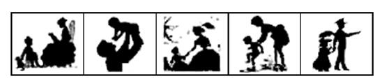

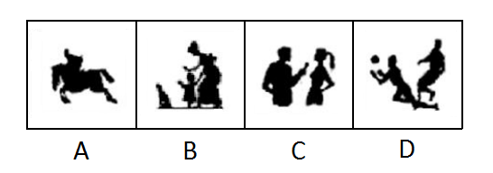

- **A**. A
- **B**. B　✅
- **C**. C
- **D**. D

**答案**：B

**官方解析**

题干中的图形出现多人，且出现的人物都有成人与小孩。只有B项有成人与小孩，当选；A项为一个人，C、D两项均为成人，排除。
故正确答案为B。

---

## 第 12 题　qid 1791810 · 图形推理

在上边的题干中给出一套图形，其中有五个图，这五个图呈现一定的规律性。在下边给出一套图形，其中有四个图，从中选出唯一的一项作为保持上边五个图规律的第六个图。

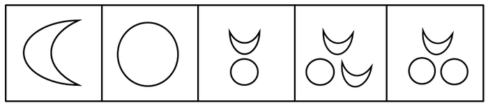

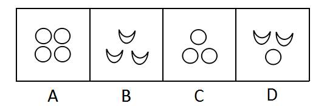

- **A**. A
- **B**. B
- **C**. C　✅
- **D**. D

**答案**：C

**官方解析**

观察发现，题干图形出现多个小元素，优先考虑元素的种类和数量，但无规律。继续观察发现题干共出现了两种小元素，且元素数量有增加趋势，考虑元素间的换算关系。根据基本换算公式“图1+图3=2×图2”，换算的结果为1圆=2月亮，验证即为1、2、3、4、5个月亮，下一个应该选一个6个月亮或三个圆的图形，A项8个，B项3个，C项6个，D项4个。
故正确答案为C。

---

## 第 13 题　qid 1791812 · 图形推理

每道题在上边的题干中给出一套图形，其中有五个图，这五个图呈现一定的规律性。在下边给出一套图形，其中有四个图，从中选出唯一的一项作为保持上边五个图规律性的第六个图。

- **A**. A
- **B**. B　✅
- **C**. C
- **D**. D

**答案**：B

**官方解析**

观察发现，题干中每幅图形都有一个圆，排除C项；再次观察发现，题干图形中的直线数分别为3、4、5、6、7，那么下一幅图应该为8条直线，排除D项；题干中三条直角折线均可以通过旋转形成一个“Z”字形，排除A项。
故正确答案为B。

---

## 第 14 题　qid 1791814 · 图形推理

在上边的题干中给出一套图形，其中有五个图，这五个图呈现一定的规律性。在下边给出一套图形，其中有四个图，从中选出唯一的一项作为保持上边五个图规律性的第六个图。

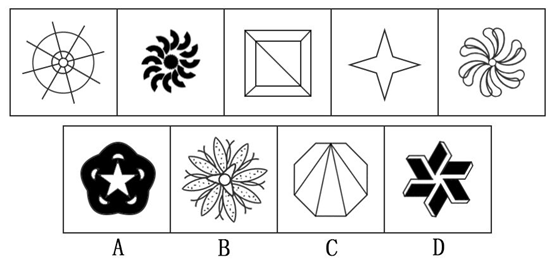

- **A**. A
- **B**. B
- **C**. C
- **D**. D　✅

**答案**：D

**官方解析**

元素组成不相同不相似，优先考虑属性规律。观察发现，图一既是轴对称图形又是中心对称图形，图二中心对称图形，图三既是轴对称图形又是中心对称图形，图四既是轴对称图形又是中心对称图形，图五中心对称图形，发现题干所有图形都是中心对称图形。A、C两项均是轴对称图形，排除；B项中内部的三角形不是中心对称图形，且外侧黑点位置也分布不规则，排除；只有D项符合，当选。
故正确答案为D。

---

## 第 15 题　qid 1791816 · 图形推理

下边四个图形中，只有一个是由上边的四个图形拼合而成（只能通过上、下、左、右进行移动），请把它找出来。

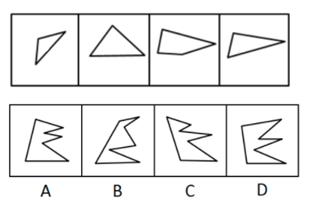

- **A**. A　✅
- **B**. B
- **C**. C
- **D**. D

**答案**：A

**官方解析**

本题考查平面拼合，可采用平行且等长相消的方式解题。消去平行且等长的线段后进行组合即可得到轮廓图，即为A项。平行且等长相消的方式如下图所示：

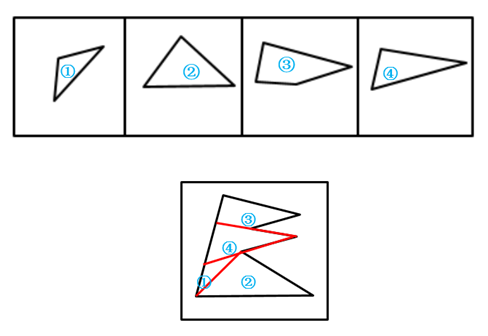

故正确答案为A。

---

## 第 16 题　qid 1791818 · 图形推理

下边四个图形中，只有一个是由上边的四个图形拼合而成（只能通过上、下、左、右进行移动），请把它找出来。

- **A**. A
- **B**. B　✅
- **C**. C
- **D**. D

**答案**：B

**官方解析**

本题考查平面拼合，可采用平行且等长相消的方法解题。消去平行且等长的线段后进行组合即可得到轮廓图，即为B选项。平行且等长相消的方法如下图所示：

故正确答案为B。

---

## 第 17 题　qid 1791820 · 图形推理

下边四个图形中，只有一个是由上边的四个图形拼合而成（只能通过上、下、左、右进行移动），请把它找出来。

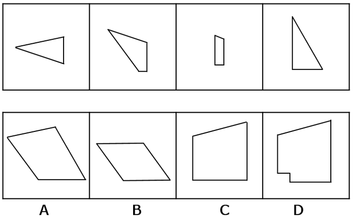

- **A**. A　✅
- **B**. B
- **C**. C
- **D**. D

**答案**：A

**官方解析**

本题考查平面拼合，可采用平行且等长相消的方法解题。消去平行且等长的线段后进行组合即可得到轮廓图，即为A选项。平行且等长相消的方法如下图所示：

故正确答案为A。

---

## 第 18 题　qid 1791822 · 图形推理

上边这个图形是由下边四个图形中的某一个作为外表面折叠而成，请指出它是哪一个？

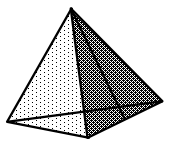

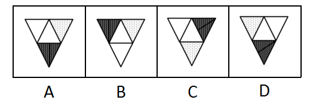

- **A**. A　✅
- **B**. B
- **C**. C
- **D**. D

**答案**：A

**官方解析**

本题考查四面体结构。四面体可用箭头法，公共边和公共点等方法来进行解题。

如上图所示，相同边用相同颜色进行标示。

A项：题干中所给图形箭头标示面与非箭头标示面二者相对关系正确，为正确选项，当选；

B项：题干中非箭头标示面在箭头标示面的左，而选项中非箭头标示面在箭头标示面的下，选项与题干不对应，排除；

C项：题干中非箭头标示面在箭头标示面的左，而选项中非箭头标示面在箭头标示面的右，选项与题干不对应，排除；

D项：题干中非箭头标示面在箭头标示面的左，而选项中非箭头标示面在箭头标示面的下，选项与题干不对应（D选项只是B选项旋转了方向），排除。

故正确答案为A。

---

## 第 19 题　qid 1791824 · 图形推理

上边这个图形是由下边四个图形中的某一个作为外表面折叠而成，请指出它是哪一个？

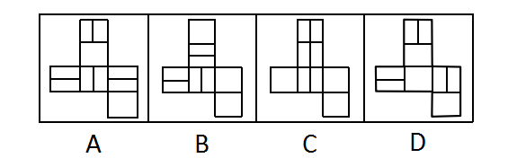

- **A**. A
- **B**. B　✅
- **C**. C
- **D**. D

**答案**：B

**官方解析**

本题考查六面体结构，主要着眼考查相对面的识别。

选项所示图形平面展开图外轮廓一致，首先考虑平面展开图中相对面的识别。

平面展开图中1面与4面为相对面，2面与6面为相对面，3面与5面为相对面。

逐一分析选项：

ACD选项中均存在相对面，立体图中的三个横线面无法在平面展开图中体现，排除ACD。

B选项中三个面中的横线互相垂直，能够折合成题干所示的立体图。

故正确答案为B。

---

## 第 20 题　qid 1791826 · 图形推理

上边这个图形是由下边四个图形中的某一个作为外表面折叠而成，请指出它是哪一个？

- **A**. A
- **B**. B
- **C**. C
- **D**. D　✅

**答案**：D

**官方解析**

本题考查六面体的空间重构。

题干立体图形中给出三个面，三个面存在公共点，分别在题干和选项中标记出三面的公共点，如下图E点所示：

题干中点E为三面交点，且与三个不同阴影三角形的顶点重合。

A项：公共点E未与三角形顶点重合，与题干不一致，排除；

B项：公共点E未与三角形顶点重合，与题干不一致，排除；

C项：其中两个三角形面中间隔了一个空白面，为相对面，不能同时出现，与题干不一致，排除；

D项：三面的公共点E与三个不同阴影三角形的顶点重合，与题干一致，当选。

故正确答案为D。

---

## 第 21 题　qid 1791828 · 逻辑判断

小王不是摄影师，但小王所认识的人都是摄影师，而摄影师都喜欢旅行，因为只有在旅行中才能遇到最美的风景，小王的朋友小张通过旅行与小王一起认识了小李。
根据以上陈述，可以得出以下哪项？

- **A**. 小王喜欢旅行
- **B**. 小李喜欢旅行　✅
- **C**. 小王不喜欢旅行
- **D**. 小李不喜欢旅行

**答案**：B

**官方解析**

第一步：翻译题干。

①小王摄影师；②小王认识的人摄影师；③摄影师喜欢旅行；④最美的风景在旅行中遇到。

根据②③传递可得，小王认识的人摄影师喜欢旅行，即小王认识的人都是摄影师，小王认识的人都喜欢旅行；

再根据题干最后一句可得，小张是小王的朋友，小王认识小张，小王和小张都认识小李；

因此可以得出，小张和小李都是摄影师，小张和小李都喜欢旅行。

第二步：逐一分析选项。

A项：否定前件无法得出确定性结论，由可知，无法得出小王是否喜欢旅行，排除；

B项：由可知，小张和小李都喜欢旅行，当选；

C项：见A项分析，排除；

D项：小张和小李都喜欢旅行，排除。

故正确答案为B。

---

## 第 22 题　qid 1791830 · 逻辑判断

研究人员为了验证一种长寿新药的效果，用两组小白兔进行了试验。他们对无差别的两组小白兔注射了新药，然后将其中一组关在笼子中饲养，另一组放在自然环境中饲养。结果发现，自然环境中饲养的小白兔的平均寿命比笼子中饲养的小白兔延长了1/10。研究人员由此认为，轻松的环境有利于发挥新药的功能。
以下哪项最有可能是研究人员得出结论的假设？

- **A**. 关在笼子中的小白兔生活得不愉快
- **B**. 注射了新药之后的小白兔生活得更轻松
- **C**. 自然环境中饲养的小白兔生活得更轻松　✅
- **D**. 新药功能的发挥和实验对象的生活环境密切相关

**答案**：C

**官方解析**

第一步：找到论点论据。
论点：轻松的环境有利于发挥新药的功能。
论据：他们对无差别的两组小白兔注射了新药，然后将其中一组关在笼子中饲养，另一组放在自然环境中饲养。结果发现，自然环境中饲养的小白兔的平均寿命比笼子中饲养的小白兔延长了1/10。
第二步：逐一分析选项。
A项：“关在笼子中的小白兔生活得不愉快”不能得出轻松环境中的药物发挥情况如何，无关选项，排除；
B项：只是在说“注射了新药之后的小白兔生活得更轻松”，不知道小白兔生活的环境是否轻松，是否有利于新药效的发挥，无关选项，排除；
C项：“自然环境中饲养的小白兔生活得更轻松”，补充了自然环境更轻松的情况，说明生活的轻松有利于发挥药效，属搭桥项，当选；
D项：只是说“新药功能的发挥和实验对象的生活环境密切相关”，但没有说明环境对实验对象有什么样的影响，不明确选项，排除。
故正确答案为C。

---

## 第 23 题　qid 1791832 · 逻辑判断

乡间公路上发生一起车祸，肇事司机是位女性。据这位女司机介绍，当时她发现路边有一餐馆所以准备停车用餐，误将油门当刹车，汽车径直向前撞向路边车辆，连撞两车后方才停下，万幸的是车上乘客仅受轻伤。有目击者对这起车祸做出如下评论：女司机更容易出车祸。
以下哪项如果为真，最能质疑上述评论？

- **A**. 有的男司机开车时比较敏捷和果断，很少出车祸
- **B**. 有的女司机开车时比较细心和冷静，很少出车祸
- **C**. 肇事司机已有8年驾龄，技术娴熟，以前从未出过车祸
- **D**. 女司机各有不同，对肇事女司机不能轻率概括、以偏概全　✅

**答案**：D

**官方解析**

第一步：找出论点和论据。
论点：女司机更容易出车祸。
论据：乡间公路上发生一起车祸，肇事司机是位女性。
第二步：逐一分析选项。
A项：“有的男司机开车时比较敏捷和果断，很少出车祸”只是部分男司机的情况，不能说明女司机的情况，无法削弱，排除；
B项：“有的女司机开车时比较细心和冷静，很少出车祸”只是部分女司机的情况，不能说明全部女司机的情况，无法削弱，排除；
C项：“肇事司机已有8年驾龄，技术娴熟，以前从未出过车祸”不能削弱现在的车祸情况，仅肇事司机一人的情况不能说明所有女司机的情况，无法削弱，排除；
D项：“女司机各有不同，对肇事女司机不能轻率概括、以偏概全”说明目击者的评论只是针对一场车祸中一个女司机的情况，不具有代表性，不能代表整体女司机的情况，可以削弱，当选。
故正确答案为D。

---

## 第 24 题　qid 1791834 · 逻辑判断

在某公司新招聘的100名应届毕业生（不含专科）中，男性42名，女性58名；研究生的比例超过了本科生，计算机类毕业生人数多于文史类毕业生，除了计算机类和文史类专业外，还有其他专业毕业的学生。
根据以上陈述，关于上述100名大学毕业生，可以得出以下哪项？

- **A**. 计算机类研究生人数多于文史类本科生
- **B**. 女性计算机类毕业生人数多于男性文史类本科生
- **C**. 女性研究生人数多于男性本科生　✅
- **D**. 计算机类研究生人数多于男性本科生

**答案**：C

**官方解析**

分析题干已知条件可知：①；②；③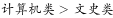。

由于新招聘的只有研究生和本科生，①可以转化为：④，即：；同理②可以转化为：⑤；

④+⑤：；去掉相同项可知：，即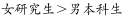，只有C项符合。

故正确答案为C。

---

## 第 25 题　qid 1791836 · 逻辑判断

城市是一个生命体，一座历史文化名城，她的寿命长达千百年，印证她寿命的年轮也定会有千百条。作为城市年轮的历史文化遗产是绝对不能破坏或丢弃的，破坏或丢弃城市的年轮，就是自毁城市特色。而一座城市只有保持其固有特色，才能拥有核心竞争力。
根据以上陈述，可以得出以下哪项？

- **A**. 只有保护好历史文化遗产，历史文化名城才能拥有核心竞争力　✅
- **B**. 只有拥有核心竞争力，一座城市才能保护好其历史文化遗产
- **C**. 如果保护好历史文化遗产，一座城市就能拥有其核心竞争力
- **D**. 如果历史文化遗产被破坏或丢弃，历史文化名城就会失去其生命力

**答案**：A

**官方解析**

第一步：翻译题干。

①破坏或丢弃历史文化遗产自毁城市特色；②拥有核心竞争力保持其固有特色。根据递推规则，得出：③破坏或丢弃历史文化遗产自毁城市特色核心竞争力。

第二步：逐一分析选项。

A项：拥有核心竞争力保护历史文化遗产，与题干命题③的逆否命题一致，可以推出，当选；

B项：保护历史文化遗产拥有核心竞争力，是对条件①的否前，无法推出确定结论，排除；

C项：保护历史文化遗产拥有核心竞争力，是对条件①的否前，无法推出确定结论，排除；

D项：破坏或丢弃历史文化遗产历史文化名城就会失去其生命力，“生命力”在题干中没有提到，无法推出，排除。

故正确答案为A。

---

## 第 26 题　qid 1789572 · 逻辑判断

甲、乙、丙、丁、戊5支足球队进行小组单循环赛。比赛规定：每队胜一场得3分，平一场得1分，负一场得0分；积分前两名出线。比赛结束后发现，没有积分相同的球队，乙队胜了3场，另一场负于甲队。
根据以上信息，可得出以下哪项？

- **A**. 甲队一定出线
- **B**. 乙队一定出线　✅
- **C**. 丙队一定出线
- **D**. 戊队一定出线

**答案**：B

**官方解析**

第一步：分析题干条件。
（1）5支球队进行单循环赛，每队胜一场得3分，平一场得1分，负一场得0分；
（2）没有积分相同的球队；
（3）乙队胜了3场，另一场负于甲队。
第二步：根据题干条件进行推理。
共有5支球队，进行小组单循环赛，每个球队都要进行4场比赛，乙队胜了3场，只有一场负于甲队，那么丙、丁、戊3队每队已经分别输给乙队一场。题干最后一句说没有积分相同的球队，所以丙、丁、戊3队在剩下的比赛中不可能3场均取得胜利，因此积分必然低于乙队。由于前两名出线，那么乙队必然出线。
故正确答案为B。

---

## 第 27 题　qid 1791840 · 逻辑判断

研究人员比较了过去3.3万年以来生活在欧洲的人的骨骼变化情况，发现从1万年前的中石器时代到2000年前的罗马帝国时期，人类两种腿骨的强度持续下降，但与奔跑行走无关的上臂骨强度则保持稳定。也正是在这一时期，农业开始兴起，人类逐渐向定居的生活方式转变，农业兴起导致现代人的骨骼变轻，但之后两种腿骨的强度几乎没有变化。研究人员由此得出结论，机械化和城市化对骨骼强度的影响并不明显。
以下哪项最可能是研究人员作出结论的假设？

- **A**. 在过去3.3万年间，人类的体重总体变化不大
- **B**. 从3.3万年前至1万年间，人类的生活方式没有发生重大的改变
- **C**. 机械化和城市化发生在农业兴起之后　✅
- **D**. 人的骨骼变轻会导致其骨骼强度的下降

**答案**：C

**官方解析**

第一步：找出论点和论据。
论点：机械化和城市化对骨骼强度的影响并不明显。
论据：农业开始兴起，人类逐渐向定居的生活方式转变，农业兴起导致现代人的骨骼变轻，但之后两种腿骨的强度几乎没有变化。
第二步：逐一分析选项。
A项：“人类的体重总体变化”和论点的“骨骼强度”无关，无法加强，排除；
B项：“3.3万年前至1万年间”在农业和机械化和城市化之前，与论点讨论的时间范围不一致，属于无关选项，无法加强，排除；
C项：“机械化和城市化发生在农业兴起之后”，论据说农业兴起之后两种腿骨的强度几乎没有变化，论点说机械化和城市化对骨骼强度影响并不明显，给机械化和城市化跟农业兴起之后搭了桥，可以加强，当选；
D项：论据当中强调了农业兴起的时期，骨骼变轻了，腿骨强度下降，上臂骨强度不变是同时发生的，D选项则解释了骨骼变轻与骨骼强度下降之间的关系，属于对于论据的加强，不是搭桥和必要条件，排除。
故正确答案为C。

---

## 第 28 题　qid 2032238 · 逻辑判断

食品安全标准不仅关系到食品安全，更关系到国家利益。稀土在土壤中广泛存在，也在现有的各种食物中广泛存在。目前，科学界关于稀土对人类健康影响的研究很欠缺，国际权威机构迄今为止并没有对稀土的危害性做出评估，更没有设立所谓“安全摄入标准”。近年来，我国对稻谷、玉米、小麦、茶叶等食物中的稀土限量标准做出统一标准，均为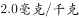。有专家据此认为，这些标准的制定并非都是合理的。

以下哪项如果为真，最能支持上述专家的观点？

- **A**. 
目前，我国的稻谷、玉米、小麦中的稀土含量一般都低于

- **B**. 
茶叶中的稀土只有大约会进入茶水中，而一个人每天食用的茶叶量要远远小于粮食
　✅
- **C**. 
中国先于国际权威机构制定食物中稀土的“安全摄入标准”，具有一定的超前性

- **D**. 
中国是茶叶出口大国，又是世界上唯一制定了茶叶稀土限量标准的国家

**答案**：B

**官方解析**

第一步：找到论点论据。

论点：这些标准的制定并非都是合理的。

论据：近年来，我国对稻谷、玉米、小麦、茶叶等食物中的稀土限量标准做出统一标准，均为。

第二步：逐一分析选项。

A项：“我国的稻谷、玉米、小麦中的稀土含量一般都低于”说明规定达到国家标准，至于这些标准制定的合理不合理没说，无关项，排除；

B项：“茶叶中的稀土只有大约会进入茶水中，而一个人每天食用的茶叶量要远远小于粮食”和粮食对比说明茶叶的稀土进入水中的少、食用量小，采取统一限定标准不合理，举例加强，当选；

C项：“具有一定的超前性”不一定就是合理的，无法加强，排除；

D项：“中国是茶叶出口大国，又是世界上唯一制定了茶叶稀土限量标准的国家”和制定标准是否合理，无关项，排除。

故正确答案为B。

---

## 第 29 题　qid 2032240 · 类比推理

某国承办了一次国际大赛，决定将赛事分配给该国的3个城市具体筹办。现有甲、乙、丙、丁、戊、己、庚7个候选城市通过了初选。根据要求，最终负责筹办的城市还需符合以下条件：
（1）甲和乙要么都入选，要么都不入选；
（2）丙与丁至多只能有一个入选；
（3）丙和甲至少要有一个入选。
如果丁入选，那么下列哪两个城市也一定入选？

- **A**. 甲和乙　✅
- **B**. 甲和庚
- **C**. 乙和丙
- **D**. 丙和戊

**答案**：A

**官方解析**

第一步：翻译题干。
①要么（甲且乙），要么（-甲且-乙）；
②-丙或-丁；
③丙或甲。
第二步：逐一分析选项。
已知确定信息：丁入选，代入条件②可以推出：丁→-丙；将-丙代入条件③可以推出：-丙→甲；将甲代入条件①可以推出：甲且乙，得知甲、乙两个城市入选。
故正确答案为A。

---

## 第 30 题　qid 1758116 · 类比推理

某国承办了一次国际大赛，决定将赛事分配给该国的3个城市具体筹办。现有甲、乙、丙、丁、戊、己、庚7个候选城市通过了初选。根据要求，最终负责筹办的城市还需符合以下条件：
（1）甲和乙要么都入选，要么都不入选；
（2）丙与丁至多只能有一个入选；
（3）丙和甲至少要有一个入选。
如果戊入选，那么下列哪两个城市也可能同时入选？

- **A**. 甲和丙
- **B**. 甲和己
- **C**. 乙和丙
- **D**. 丙和己　✅

**答案**：D

**官方解析**

根据题干要从7个城市中入选3个，又因戊入选，故剩余的2个入选名额将会在甲、乙、丙、丁、己、庚6个城市中产生。
题干问法是可能，优先代入排除。
A项，若甲、丙同时入选，则根据（1）可知，乙也会入选，则入选的城市超过题干要求的3个，与题干信息相矛盾，排除；
B项，若甲、己同时入选，则根据（1）可知，乙也会入选，则入选的城市超过题干要求的3个，与题干信息相矛盾，排除；
C项，若乙、丙同时入选，则根据（1）可知，甲也会入选，则入选的城市超过题干要求的3个，与题干信息相矛盾，排除；
D项，若丙、己同时入选，则甲、乙都不入选，符合条件（1），且丙入选，丁不入选，符合条件（2），若丙入选，则符合条件（3），与题干信息不矛盾，是可能成立的选项，当选。
故正确答案为D。

---

## 第 31 题　qid 1791842 · 定义判断

条件性承诺，指在社会活动中，一方对另一方作出附带条件的承诺。
下列属于条件性承诺的是：

- **A**. 小琴考上了重点高中，老爸奖励她到国外旅游一周
- **B**. 某公司老总答应给考核优秀员工每人每月加薪200元　✅
- **C**. 陈某对女儿说：“老妈将一如既往支持你报考研究生。”
- **D**. 小雨为自己立规，不减肥5斤，就拒绝参加朋友聚会

**答案**：B

**官方解析**

第一步：找出定义关键词。
“一方对另一方”、“附带条件的承诺”。
第二步：逐一分析选项。
A项：小琴考上了重点高中，老爸奖励国外旅游，仅仅只是局限于考上了的奖励，并不涉及考前对此有承诺，因此不符合定义，排除；
B项：老总答应加薪，这是一种承诺，而附带的条件则是要考核为优秀，因此符合定义，当选；
C项：陈某表示支持女儿报考研究生，没有体现附带条件，因此不符合定义，排除；
D项：小雨给自己减肥定规矩，只是涉及到单方面的个人，而不存在另一方，因此不符合定义，排除。
故正确答案为B。

---

## 第 32 题　qid 1791844 · 定义判断

趋同感应：指在社会交往过程中，一方能够把握另一方的心理状态，并且能够设身处地体验对方心理。
下列属于趋同感应的是：

- **A**. 天下谁人不识君
- **B**. 天生我材必有用
- **C**. 同是天涯沦落人　✅
- **D**. 一片冰心在玉壶

**答案**：C

**官方解析**

第一步：找出定义关键词。
关键词为“把握另一方的心理状态”、“设身处地体验对方心理”。
第二步：逐一分析选项。
A项：“天下谁人不识君”指天下哪个不知道你啊，没有体现“把握另一方的心理状态”，排除；
B项：“天生我材必有用”指上天生下我一定有需要用到我的地方，没有体现“把握另一方的心理状态”，排除；
C项：“同是天涯沦落人”指同样都是沦落世间的人，体现了“把握另一方的心理状态”，体验了对方的心理，当选；
D项：“一片冰心在玉壶”指我的心就像盛在玉壶的冰那样洁白透明，没有体现“把握另一方的心理状态”，排除。
故正确答案为C。

---

## 第 33 题　qid 1791846 · 逻辑判断

职业基因：指与个人所从事工作的特点相匹配的个性特点与气质。
下列不涉及职业基因的是：

- **A**. 小李在近十年的货车驾驶工作经历中，他的机智灵敏、注意力集中等特点使他成为公司的优秀驾驶员
- **B**. 做事一向细致、认真的小张，对自己从事财务工作感到很满意
- **C**. 小马头脑灵活、善于交际，在公司销售部工作期间，其业务量多年名列前茅
- **D**. 以优异成绩毕业于知名大学的马林博士，进入其科研机构后很快成为该机构的业务骨干　✅

**答案**：D

**官方解析**

第一步，找到定义关键词。
关键词为“所从事工作的特点相匹配的个性特点与气质”。
第二步，逐一分析选项。
A项：机智灵敏、注意力集中等是小李的特点，这些特点与他从事的驾驶工作能够相匹配，符合定义，排除；
B项：细致认真是小张的特点，这些特点与他从事的财务工作能够相匹配，符合定义，排除；
C项：头脑灵活、善于交际是小马的特点，这些特点与他从事的销售工作能够相匹配，符合定义，排除；
D项：成绩优异并不能体现个性特点或气质，不符合定义，当选。
本题为选非题，故正确答案为D。

---

## 第 34 题　qid 1791848 · 定义判断

同质性群体：指经过较长时间后形成的具有某种共同的文化或性格特征的社会群体。
下列不属于同质性群体的是（    ）。

- **A**. 票友
- **B**. 同乡
- **C**. 徽商
- **D**. 旅客　✅

**答案**：D

**官方解析**

第一步：找出定义关键词。
“具有某种共同的文化或性格特征”。
第二步：逐一分析选项。
A项：“票友”是戏曲界的行话，其意是指会唱戏而不以专业演戏为生的爱好者，即对戏曲、曲艺非职业演员、乐师等的通称，符合“具有某种共同的文化或性格特征”，符合定义；
B项：“同乡”是指同一籍贯的人，符合“具有某种共同的文化或性格特征”，符合定义；
C项：“徽商”即徽州商人、新安商人，俗称"徽帮"，指徽州(府)籍商人的总称，符合“具有某种共同的文化或性格特征”，符合定义；
D项：“旅客”是指临时客住在外的人或旅行者，这群人不符合“具有某种共同的文化或性格特征”，不符合定义。
本题为选非题，故正确答案为D。

---

## 第 35 题　qid 1791850 · 定义判断

众包，指公司或机构通常由员工承担的工作任务交由非特定的社会公众完成的做法。
下列不属于众包的是：

- **A**. 某玩具公司一直鼓励和赞助用户参与公司设计工作，从机器人操纵系统到积木套装产品，都收到了比较理想的效果
- **B**. 某洗涤用品公司经常把自己的研发项目，发布在各大网站上，征集解决方案承诺一定的奖励
- **C**. 近三年来，某房地产公司将所有的电脑、网络及外设的日常维护工作，全部交给某电脑公司　✅
- **D**. 某美术馆请参观者为馆内展品撰写讲解说明，选出其中的一部分制成标签共同展出

**答案**：C

**官方解析**

第一步：找出定义关键词。
“公司或机构”、“由员工承担的工作任务交由非特定的社会公众完成”
第二步：逐一分析选项。
A项：“积木套装产品”本应是员工承担的工作任务，现在由用户参与设计完成，满足“由员工承担的工作任务交由非特定的社会公众完成”，排除；
B项：“找到解决研发项目方案”本应是“员工承担的工作任务”，现在发布在各大网站上，交由网友解决，网友是“非特定的社会公众”，满足“由员工承担的工作任务交由非特定的社会公众完成”，排除；
C项：全部交给某电脑公司，某电脑公司是“特定的社会公众”，不满足关键词“由员工承担的工作任务交由非特定的社会公众完成”，当选；
D项：“撰写讲解说明”本应是“员工承担的工作任务”，参观者是“非特定的社会公众”，满足“由员工承担的工作任务交由非特定的社会公众完成”，排除。
本题为选非题，故正确答案为C。

---

## 第 36 题　qid 2032242 · 定义判断

假摔式降费：指企业在外部压力之下采取的一些表面降幅很大，实际上并未惠及广大消费者的调价策略。
下列属于假摔式降费的是：

- **A**. 在“双十一”价格大战中，某知名家电企业大幅调整了多种产品的零售价格，一周内，这些产品在全城各大商场均纷纷售罄
- **B**. 某城市的几家大商场为了抢占节日市场，联手采用打折促销的手段，消费人数呈上升之势
- **C**. 为落实上级有关部门的降费要求，某运营商很快公布了夜间国际漫游降低费用的具体方案　✅
- **D**. 根据上级规定，某旅游景区在其官网上发布了不涨价承诺，游客们很快发现其中的不少景点本来就是免费景点

**答案**：C

**官方解析**

第一步：找到定义关键词。
关键词为“企业”、“降幅很大”、“实际上并未惠及广大消费者的调价策略”。
第二步：逐一分析选项。
A项：家电企业大幅调整价格后其惠及的群体是各大商场的购买者，消费者能够得到实际的好处，与题干定义关键词不符，排除；
B项：几家大商场联手打折促销，惠及的群体是“上升趋势的消费人数”，实际上惠及了大量消费者，与题干定义关键词不符，排除；
C项：降低夜间国际漫游费用，体现了定义中的关键词“降幅”，但是降价之后有没有人会在夜间使用国际漫游，或者说有没有消费者得到实际的好处是不确定的，保留；
D项：不涨价承诺并未体现“降幅”，与题干定义关键词不符，排除。
对比选项：A、B两项中的消费者都明确地获得了实际的好处，C项中的消费者有没有获得实际好处是不明确的，此时对比也只能选择C项。
故正确答案为C。

---

## 第 37 题　qid 1789684 · 定义判断

配套效应，指拥有某件物品后，为了追求完美效果而不断配置其他相应物品。
下列不属于配套效应的是：

- **A**. 邻居送给小李一只宠物狗，半月后，小李家阳台上狗笼子、狗饭碗、狗澡盆、狗毛衣等一应俱全，几乎变成了宠物用品展示中心
- **B**. 小孙穿着朋友赠送的一件质地精良做工考究的睡袍在书房走动，总觉得身边的一切都不协调，他很快换掉了书房中的地毯、桌椅、书柜
- **C**. 张女士在商场亲子装专柜为儿子买了一件T恤，儿子和丈夫都非常满意，于是又返回商场为丈夫和自己各买了一件　✅
- **D**. 赵总在古玩店淘到一件康熙宫廷玉器，特意为它配置了一个红木底座，还请诗友为它专门写了一首咏玉诗，放在大厅最醒目的地方

**答案**：C

**官方解析**

第一步：找到定义关键词。
关键词：目的为“追求完美效果”，方式为“拥有某件物品后不断配置其他相应物品”。
第二步：逐一分析选项。
A项：小李家买的狗笼子、狗饭碗等是发生在小李拥有一只宠物狗后，体现了“拥有某件物品后不断配置其他相应物品”，这些物品是为了追求与宠物狗配套的“完美效果”，符合定义，排除；
B项：小孙换掉地毯等物品是为了和质地精良的睡袍配套，体现了“拥有某件物品后不断配置其他相应物品”，为的是“追求完美的效果”，符合定义，排除；
C项：张女士前后购买的是T恤，并没有配置其他物品，不符合定义，当选；
D项：赵总为玉器配置了红木底座，请他人为玉器写诗等行为体现了“拥有某件物品后不断配置其他相应物品”，也是为了“追求完美效果”，符合定义，排除。
本题为选非题，故正确答案为C。

---

## 第 38 题　qid 1789588 · 定义判断

公共信息资源：指社会公共领域中特定管理机构依法管理，面向全体社会公众提供信息服务的各种数据系统，具有公共性、广泛性、基础性和公益性等特点。
下列属于公共信息资源的是：

- **A**. 公安部门为了核查居民身份或侦破案件而研发的居民身份信息管理系统
- **B**. 银行为了审核贷款申请、开展各种金融业务而开发的客户个人诚信档案系统
- **C**. 国家气象部门建立的气象信息发布系统，如天气预报、地质灾害预警系统等　✅
- **D**. 高校教务部门为提高教学管理效率而开发的学生选课、评课、成绩管理系统

**答案**：C

**官方解析**

第一步：找出定义关键词。
“社会公共领域中特定管理机构”、“全体社会公众”、“提供信息服务”、“公共性、广泛性、基础性和公益性等”。
第二步：逐一分析选项。
A项：公安部门属于社会公共领域中的特定管理机构，居民身份信息管理系统是公安部门为了核查居民身份或者侦破案件而研发的，该系统中的信息为居民个人隐私，不能面向社会公众提供信息服务，不符合定义，排除；
B项：银行是金融服务机构，不属于社会公共领域中的特定管理机构，客户个人诚信档案系统属于客户隐私，不能面向社会公众提供信息服务，不符合定义，排除；
C项：国家气象部门属于社会公共领域中的特定管理机构，所建立的气象信息发布系统是面向全体社会公众提供天气预报等信息服务的数据系统，同时天气预报、地质灾害预警系统具有公共性、广泛性、基础性和公益性等特点，符合定义，当选；
D项：高校教务部门建立的学生选课、评课、成绩管理系统面向的服务对象并不是全体社会公众，客体不符合定义，排除。
故正确答案为C。

---

## 第 39 题　qid 1789600 · 定义判断

以房养老：指老人将自己的产权房抵押给金融机构，按约定条件定期领取养老金并获得相应服务的养老方式。老人去世后，金融机构可以按约定处置房产，偿付已经支出的各项费用。
下列属于以房养老的是：

- **A**. 最近，老李夫妇把卖房子的钱存进银行，一起住进了附近的老年公寓，每月的存款利息足够支付那里的各种费用
- **B**. 年逾古稀的张先生夫妇与银行签订了协议，生前，他们每月从银行领取13000元养老金；去世后，他们的产权房由银行处置　✅
- **C**. 赵某在一次车祸中落下重度残疾，他与典当行的远房侄子签了一份协议；由侄子照顾他的日常起居，自己名下的房子将来过户给侄子
- **D**. 老孙退休后卖掉市中心的大房子，买了一套二手小房住，每月的退休金加上卖房款利息，夫妻俩的日子过得很是自在惬意

**答案**：B

**官方解析**

第一步：找出定义关键词。
“将自己的产权房抵押给金融机构”、“定期领取养老金并获得相应服务的养老方式”、“老人去世后，金融机构可以按约定处置房产”。
第二步：逐一分析选项。
A项：老李夫妇是靠卖房子的存款利息支付服务费用，不符合关键词“将自己的产权房抵押给金融机构”，不符合定义，排除；
B项：张先生夫妇与银行签订的协议属于定义中的“将自己的产权房抵押给金融机构”，每月领取13000元养老金符合“按约定条件定期领取养老金”，去世后，他们的产权房由银行处置，符合“老人去世后，金融机构可以按约定处置房产”，符合定义，当选；
C项：虽然典当行属于金融机构，但赵某是与其远房侄子签订协议，不是与典当行签订协议，不符合“将自己的产权房抵押给金融机构”，不符合定义，排除；
D项：老孙卖掉大房买二手小房住并将卖房款存进银行获得利息，没有体现“将自己的产权房抵押给金融机构”，不符合定义，排除。
故正确答案为B。

---

## 第 40 题　qid 1789604 · 定义判断

自然淘汰育种法，指在良种筛选过程中，减少人为干预，尽量通过被筛选对象的自然生长确定所需良种的育种方法。
下列属于自然淘汰育种法的是：

- **A**. 
甲鱼养殖场为了选育出抗病力强的种鱼，在甲鱼接连死亡的情况下，不施加任何药物而任其发展，存活到最后的则作为种鱼
　✅
- **B**. 
锦鲤养殖户从幼鱼开始分拣最有经济价值的鱼苗，经过三次人工选鱼后，最终只有不到的幼鱼成了精品锦鲤

- **C**. 
石斛养殖户爬上人迹罕至的悬崖峭壁采集野生石斛，挑选其中的一部分作为种苗，精心培育出了多个新品种

- **D**. 
生长在同一片山坡上的某种植物，有的长势非常茂盛，有的则弱小枯黄，泾渭分明，这正是“物竞天择”的形象说明

**答案**：A

**官方解析**

第一步：找出定义关键词。
“筛选过程中”、“减少人为干预”、“自然生长”、“确定所需良种”。
第二步：逐一分析选项。
A项：甲鱼养殖场不施加任何药物，相当于没有进行人为干预，尽量通过自然生长筛选，存活到最后的抗病力强的种鱼就是所需的良种，符合定义，当选；
B项：经过三次人工选鱼，说明多次进行人为干预，不符合“减少人为干预”，不符合定义，排除；
C项：养殖户人工采集野生石斛，并从中挑选种苗，不符合定义中的“减少人为干预”和“通过······自然生长确定所需良种”，不符合定义，排除；
D项：山坡上的植物长势是自然状态，并不是良种筛选的过程，不符合定义，排除。
故正确答案为A。

---

## 第 41 题　qid 1789620 · 定义判断

路怒症：指机动车驾驶者在行车过程中因焦躁、愤怒情绪而产生的攻击性行为。
下列不属于路怒症的是：

- **A**. 在路口等红灯时，小张感觉汽车被碰了一下，下车一看，果然是后车刹车不及时追尾了。小张猛踢后车车轮，大声责怪其司机并且索要赔偿
- **B**. 妻子开车送老陈去上班，一辆小汽车突然窜到了面前，险些撞到他的车，老陈下车拦住那辆车，把司机痛斥一顿　✅
- **C**. 小李开了8年车，技术高超，每次被人超车，都忍不住狂踩油门飚上一把，直到反超并羞辱对方一番才罢休
- **D**. 小王正在赶路，旁边车子中飞出一个纸团突然落在他的挡风玻璃上，小王十分生气，他猛按喇叭，嘴里骂个不停

**答案**：B

**官方解析**

第一步：找出定义关键词。
“机动车驾驶者”、“行车过程中”、“因焦躁、愤怒情绪”、“产生的攻击性行为”。
第二步：逐一分析选项。
A项：小张因为后车刹车不及时追尾导致了愤怒情绪，猛踢后车车轮、大声责怪属于“攻击性行为”，符合定义，排除；
B项：妻子开车送老陈上班，妻子是机动车驾驶者，老陈是乘客，老陈不符合定义中的“机动车驾驶者”，不符合定义，当选；
C项：小李被人超车后飙车体现了“愤怒情绪”，反超并羞辱对方一番，符合定义中的“攻击性行为”，符合定义，排除；
D项：小王十分生气，猛按喇叭，嘴里骂个不停，符合定义中的“机动车驾驶者因愤怒情绪而产生的攻击性行为”，符合定义，排除。
本题为选非题，故正确答案为B。

---

## 第 42 题　qid 1791852 · 定义判断

安全性思维，指经过观察后，对当前事物或事件的发展作出对自己不利的预测，并做好防备。
下列属于安全性思维的是：

- **A**. 小李从小体质虚弱，三天两头感冒，坚持了10年冬泳后，现在已经很少生病了
- **B**. 公司经营越来越难，小陈觉得肯定会裁员，悄悄到人才市场投递了几份简历　✅
- **C**. 公共汽车上来了一个驼背老人，小王怕他跌倒受伤，便把自己的座位让给了老人
- **D**. 这两天气温骤降，老张要到北方出差，妻子特意往他的行李箱里塞了几件厚衣服

**答案**：B

**官方解析**

第一步：找出定义关键词。
原因：“作出对自己不利的预测”。
结果：“做好防备”。
第二步：逐一分析选项。
A项：小李并没有对当前事物的发展作出对自己不利的预测，因此不符合定义，排除； 
B项：公司经营困难，小陈觉得会裁员是对事件发展作出了不利于自己的预测，悄悄到人才市场投简历是一种做好防备的行为，因此符合定义，当选；
C项：小王是怕驼背老人跌倒，不是对自己作不利的预测，因此不符合定义，排除；
D项：老张的妻子特意在他的行李箱里塞几件厚衣服，并不是对自己作出不利的预测，因此不符合定义，排除。
故正确答案为B。

---

## 第 43 题　qid 1789686 · 定义判断

平行竞争：指各家厂商提供不同种类的产品以满足顾客同一需求而形成的竞争。
下列属于平行竞争的是：

- **A**. 冬天还没到，电器商场就摆满了各种取暖用品，空调、油汀、热电扇、电热毯应有尽有，价格有高有低，款式或经典或新潮　✅
- **B**. 为了扩大市场份额，某公司新近推出了一款平板电脑，硬盘容量有64G、128G和256G三种规格，供不同层次的消费者选择
- **C**. 只要走进地下商城，马上就会有一群人把你团团围住，卖服装的、卖玩具的、卖食品的······迫不及待地要把你控制在自己的摊位上
- **D**. 小李拿到了1万多元年终奖，准备好好奖励自己，现在正纠结于出国放假、买笔记本电脑还是黄金首饰

**答案**：A

**官方解析**

第一步：找出定义关键词。
“满足顾客同一需求”、“提供不同种类的产品”、“各家厂商”、“竞争”。
第二步：逐一分析选项。
A项：电器商场中有各种品牌，属于定义中的“各家厂商”，空调、油汀、热电扇等属于不同种类的产品，都是为满足顾客取暖的同一需求，体现出厂家间的竞争，符合定义，当选；
B项：平板电脑规格不同但都是同一家公司推出的，不存在厂家间的竞争，不符合定义，排除；
C项：服装、玩具、食品满足的是消费者的不同需求，不符合定义，排除；
D项：出国旅游、买电脑还是买黄金首饰满足的是小李的不同需求，不符合定义，排除。
故正确答案为A。

---

## 第 44 题　qid 1789688 · 定义判断

反向激励：指领导者对于工作表现欠佳的下属不仅不批评，反而适度肯定，以期取得与正向激励效果相当的评价策略。
下列属于反向激励的是：

- **A**. 小刘提前完成了经理布置的演讲稿，经理要他拿回去认真推敲，第二天小刘的修改稿得到了经理的高度肯定
- **B**. 小王因工作失误被顾客投诉，同事老王安慰她，并指导小王如何避免失误，小王经过一段时间的努力，业务能力越来越强，顾客十分满意
- **C**. 小李接受撰写市场调研报告的任务后，未能按时完成。经理称赞他调研认真，特意延期两天，小李的调研报告最终写得很出色　✅
- **D**. 在工会羽毛球循环赛中，夺冠热门小王首轮意外失手，单位领导没有批评他，反而鼓励他调整好心态，小王最终获得了冠军

**答案**：C

**官方解析**

第一步：找出定义关键词。
“领导者对工作表现欠佳的下属不批评，反而适度肯定”、“取得与正向激励效果相当的结果”。
第二步：逐一分析选项。
A项：小刘提前完成演讲稿，并不属于“工作表现欠佳”，不符合定义，排除；
B项：同事老王对小王的安慰与指导，不符合定义中的“领导者对于工作表现欠佳的下属适度肯定”，不符合定义，排除；
C项：小李没有按时完成任务，属于定义中的“工作表现欠佳”，领导没有批评反而称赞，体现了“适度肯定”，目的是让小李更好地完成任务，最后小李报告完成得很出色，体现了“取得与正向激励效果相当的结果”，符合定义，当选；
D项：小王在工会羽毛球循环赛中失手，不属于定义中的“工作表现欠佳”，不符合定义，排除。
故正确答案为C。

---

## 第 45 题　qid 2032210 · 定义判断

粉丝文化：指个人或者群体出于对某一特定对象的追捧心理，所引发的过度崇拜、过度消费、无偿付出等社会文化现象。
下列不属于粉丝文化的是：

- **A**. 某位学者在电视台成功地举办了多次讲座，从此以后，他上课的教室外边常常挤满了慕名而来请求签名、合影的学生、市民
- **B**. 为了让歌手小杨在选秀节目中脱颖而出，许多陌生的年轻人自发组织起来，天天台前幕后地拉选票、拉赞助，忙得不亦乐乎
- **C**. 小张是一家娱乐类刊物的记者，他的主要任务是报道演艺圈的动态消息。有时为了追踪一个明星，甚至连饭都顾不上吃　✅
- **D**. 小丽是《舌尖上的中国》的忠实观众，她把每一期节目都下载到自己的电脑中反复观看，经常到废寝忘食的地步

**答案**：C

**官方解析**

第一步：找出定义关键词。
“出于对某一特定对象的追捧心理”、“过度崇拜、过度消费、无偿付出等”。
第二步：逐一分析选项。
A项：慕名而来请求签名、合影的学生和市民是出于对学者的追捧心理，对学者的支持、喜爱是一种无偿付出，符合定义，排除；
B项：陌生人自发组织为歌手小杨拉选票、拉赞助是出于对小杨的追捧心理引发的无偿付出的现象，符合定义，排除；
C项：小张追踪明星是出于工作需要，并不是对明星的追捧，不符合定义，当选；
D项：小丽是《舌尖上的中国》的忠实观众，看节目废寝忘食是出于对节目的追捧心理所引发的过度崇拜的现象，符合定义，排除。
本题为选非题，故正确答案为C。

---
