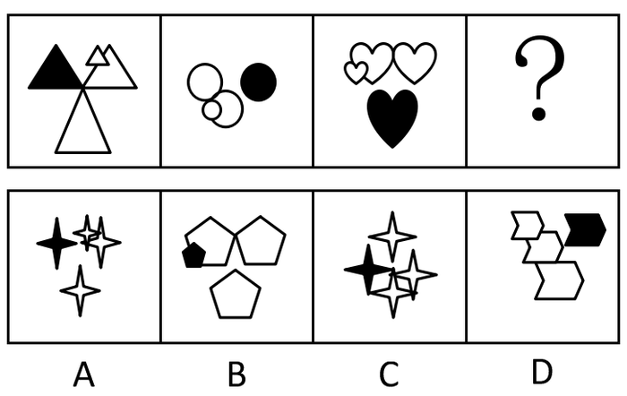
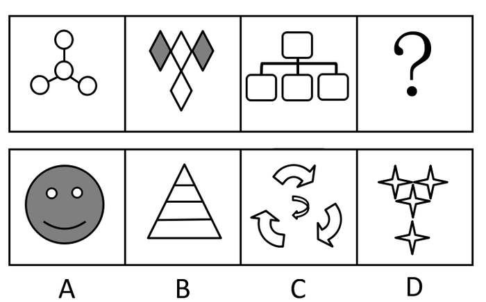
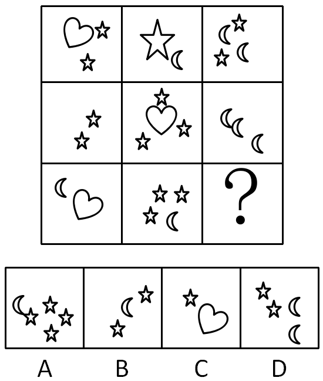

# 2016年江西省法检系统招录考试《行测》题

> 判断推理 · 34 题 · 江西 2016

## 第 1 题　qid 2255600 · 图形推理

从所给的四个选项中，选择最合适的一个填入问号处，使之呈现一定的规律性：

- **A**. A　✅
- **B**. B
- **C**. C
- **D**. D

**答案**：A

**官方解析**

元素组成不同，且无明显属性规律，优先考虑数量规律。观察发现，题干面数量特征明显，优先考虑数面，依次为2、3、4，则“？”处应该填入有5个面的图形。A项是5个，B项是4个，C项是4个，D项是3个，只有A项符合。
故正确答案为A。

---

## 第 2 题　qid 2255624 · 图形推理

从所给的四个选项中，选择最合适的一个填入问号处，使之呈现一定的规律性：

- **A**. A
- **B**. B
- **C**. C
- **D**. D　✅

**答案**：D

**官方解析**

观察发现，题干每幅图均由形状完全相同的三大一小元素组成，且有一个大元素为黑色，排除B、C两项；对比A、D两项发现，小元素和大元素的图形间关系不同，A项为相交，D项为相压，题干图形中，小元素和大元素均为相压，只有D项符合。

---

## 第 3 题　qid 2255629 · 图形推理

从所给的四个选项中，选择最合适的一个填入问号处，使之呈现一定的规律性：

- **A**. A
- **B**. B
- **C**. C
- **D**. D　✅

**答案**：D

**官方解析**

元素组成不同，且无明显属性规律，优先考虑数量规律。题干图形均由小元素组成，优先考虑数素。观察可知，每幅图均有4个相同的小元素，只有D项符合。
故正确答案为D。

---

## 第 4 题　qid 2255632 · 图形推理

从所给的四个选项中，选择最合适的一个填入问号处，使之呈现一定的规律性：

- **A**. A
- **B**. B　✅
- **C**. C
- **D**. D

**答案**：B

**官方解析**

元素组成不同，且无明显属性规律，优先考虑数量规律。观察发现，题干图形均由若干小元素组成，优先考虑数素。九宫格优先横行看，元素个数依次为：3、2、4；2、4、3；2、4、？，即每行均有9个小元素，则“？”处应该有3个小元素，只有B项符合。
故正确答案为B。

---

## 第 5 题　qid 2255662 · 逻辑判断

晕轮效应，也叫光环效应，是指当一个人因为其自身的一些优势或者在社会领域中取得成功后得到大多数人的认可，导致其弱点或不足被掩盖起来的一种现象。属于晕轮效应的是：

- **A**. 小王在演讲与辩论大赛中获得冠军后被选为演讲与辩论协会理事
- **B**. “一俊遮百丑”、“情人眼里出西施”　✅
- **C**. 张教授在国外知名期刊发表论文后引起学界的密切关注
- **D**. 某歌星吸毒后，其粉丝纷纷倒戈抨击他

**答案**：B

**官方解析**

第一步：找出定义关键词。
“自身的一些优势或者在社会领域中取得成功后”、“得到大多数人的认可”、“弱点或不足被掩盖起来”。
第二步：逐一分析选项。
A项：小王获得冠军后被选为理事，没有体现弱点或不足被掩盖起来，不符合定义，排除；
B项：“一俊遮百丑”的意思是一件好的事情掩盖了许多的丑陋的事；“情人眼里出西施”是比喻由于有感情，不论对方如何都觉得对方无处不美，二者均体现了弱点或不足被优势所掩盖，符合定义，当选；
C项：张教授发表论文后引起关注，没有体现弱点或不足被掩盖起来，不符合定义，排除；
D项：某歌星吸毒后遭受抨击，没有体现有优势或取得成功，也没有体现弱点或不足被掩盖起来，不符合定义，排除。
故正确答案为B。

---

## 第 6 题　qid 2255667 · 逻辑判断

知情权，是指公民有权知道他应该知道的事情，国家应该最大限度地确认和保障公民知悉，获取信息的权利。属于知情权的是：

- **A**. 小丽是其父母从小自别人家抱养的孩子，长大后要求知道其生父母　✅
- **B**. 为满足公众获取信息的权利，某记者通过隐藏拍摄的方法跟踪拍摄明星生活
- **C**. 高女士投诉某产品生产过程存在的违反食品卫生法规定的情况
- **D**. 小学生小明坚持要求父母告诉家庭的财务支出情况

**答案**：A

**官方解析**

第一步：找出定义关键词。
“公民有权知道他应该知道的事情”、“国家”、“最大限度地确认和保障公民知悉，获取信息的权利”。
第二步：逐一分析选项。
A项：小丽要求知道其生父母，属于她应该知道的事情，国家应该保障其知悉信息的权利，符合定义，当选；
B项：明星生活是个人隐私，不属于公民应该知道的事情，并且记者通过隐藏拍摄的方法跟踪拍摄，属于不受法律保障的行为，不符合定义，排除；
C项：高女士投诉某产品违规属于投诉，不属于知悉、获取信息的权利，不符合定义，排除；
D项：家庭财务支出情况，小学生小明的父母可以根据具体情况选择是否告诉他，不属于国家应该保障的知悉、获取信息的权利，不符合定义，排除。
故正确答案为A。

---

## 第 7 题　qid 2255671 · 逻辑判断

逆向思维方法，是指一个人在认识事物过程中采用的方法与通常大多数人采用的方法往往相反或截然不同。属于逆向思维方法的是：

- **A**. 小王学习成绩优异，小李也模仿小王的学习方法
- **B**. 面对素数猜想问题，张教授采取与众不同的崭新方式，最终取得了重大突破
- **C**. 小王性格古怪乖张，交往中经常与别人格格不入
- **D**. 大多数工程师在设计时采用归纳与实验方法，李工程师在设计时采用了演绎与抽象方法　✅

**答案**：D

**官方解析**

第一步：找出定义关键词。
“一个人在认识事物过程中采用的方法”、“与通常大多数人采用的方法往往相反或截然不同”。
第二步：逐一分析选项。
A项：小李模仿小王的学习方法，不符合与大多数人的方法相反或截然不同，不符合定义，排除；
B项：张教授采取与众不同的崭新方式，但是没有体现是否和大多数人的方法相反或截然不同，不符合定义，排除；
C项：讨论的是小王的性格和别人格格不入，而非在认识事物中采用的方法和大多数人不同，不符合定义，排除；
D项：大多数工程师采用归纳与实验方法，而李工程师采取的是演绎与抽象方法，体现了与通常大多数人采用的方法往往相反或截然不同，符合定义，当选。
故正确答案为D。

---

## 第 8 题　qid 2255675 · 逻辑判断

绝对无效民事行为，是指其内容违反法律禁止性规定的民事行为。包括以合法行为掩盖非法目的的民事行为：双方恶意串通，损害国家，集体或第三人利益的民事行为；内容违反公共利益，损害公共秩序的民事行为等。不属于绝对无效民事行为的是：

- **A**. 两家汽车生产商为了骗取国家新能源汽车补贴，私下交换销售信息并向国家相关部门提供虛假的汽车销售记录与数据
- **B**. 某人表面上开了一家外贸公司，实际上却在从事贩毒活动
- **C**. 张三与李四一起诱骗王五签订违反法规的合同，导致王五破产
- **D**. 某企业违反劳动法处理违规的员工　✅

**答案**：D

**官方解析**

第一步：找出定义关键词。
“内容违反法律禁止性规定的民事行为”、“以合法行为掩盖非法目的的民事行为”、“双方恶意串通，损害国家，集体或第三人利益的民事行为”、“内容违反公共利益，损害公共秩序的民事行为”。
第二步：逐一分析选项。
A项：两家汽车生产商为了骗取补贴，私下交换销售信息并提供虚假数据，属于双方恶意串通，损害国家利益的民事行为，符合定义，排除；
B项：表面上是外贸公司，实际上从事贩毒活动，属于以合法行为掩盖非法目的的民事行为，符合定义，排除；
C项：张三和李四一起诱骗王五签订违法合同，导致王五破产，属于双方恶意串通，损害第三人利益的民事行为，符合定义，排除；
D项：某企业违反劳动法处理违规的员工，不属于题干列举的三种情形之一，不符合定义，当选。
本题为选非题，故正确答案为D。

---

## 第 9 题　qid 2255681 · 逻辑判断

劳动权，是指有劳动能力的公民有从事劳动并取得相应报酬的权利，在一定意义上就是指受雇权和从事生产活动的权利。与劳动权有关的是：

- **A**. 未满18岁的小丽被父母经常要求做家务
- **B**. 小李经常在工作之余帮助自己的朋友打理酒店的生意
- **C**. 刚刚毕业的大学生小王被一家外资企业招聘为人力资源部的员工　✅
- **D**. 张华根很孝敬父母，经常帮父母做家务，有空经常陪父母聊天

**答案**：C

**官方解析**

第一步：找出定义关键词。
“有劳动能力的公民有从事劳动并取得相应报酬的权利”、“受雇权和从事生产活动的权利”。
第二步：逐一分析选项。
A项：未满18岁的小丽不一定属于有劳动能力的公民，且做家务也不符合受雇佣和从事生产活动，不符合定义，排除；
B项：小李在工作之余帮助朋友打理生意，不符合受雇佣和从事生产活动，不符合定义，排除；
C项：刚毕业的大学生小王被招聘为员工，符合有劳动能力的公民从事劳动并取得相应报酬，符合定义，当选；
D项：张华根帮助父母做家务、陪父母聊天，不符合受雇佣和从事生产活动，不符合定义，排除。
故正确答案为C。

---

## 第 10 题　qid 2255682 · 逻辑判断

贸易摩擦，是指国家之间由于在贸易活动中为了保护国内市场或争夺第三方市场产生的竞争斗争。主要表现为提高关税，互设贸易壁垒、贸易报复、反倾销、反补贴、保障措施等。属于贸易摩擦的是：

- **A**. 为防止国家信息安全受到威胁，世界各国都在加强信息安全建设
- **B**. 由于担心中国军事技术水平提升带来的威胁，欧美国家长期对中国实行武器禁运
- **C**. 欧盟与美国针对中国的光伏产业实施反倾销政策　✅
- **D**. 由于担心竞争对手的赶超，某企业对竞争对手都有一些产品实行大幅降价

**答案**：C

**官方解析**

第一步：找出定义关键词。
“国家之间”、“在贸易活动中”、“为了保护国内市场或争夺第三方市场产生的竞争斗争”。
第二步：逐一分析选项。
A项：各国加强信息安全建设，和贸易活动无关，不符合定义，排除；
B项：欧美国家对中国实行武器禁运，和贸易及市场竞争无关，不符合定义，排除；
C项：欧盟与美国针对中国的光伏产业实施反倾销政策，符合国家之间在贸易活动中为了保护国内市场产生的竞争斗争，符合定义，当选；
D项：主体是企业，而题干主体是国家，主体不符合，不符合定义，排除。
故正确答案为C。

---

## 第 11 题　qid 2255684 · 逻辑判断

微信营销，是指商家为了更好地推销自己的商品，通过微信平台和手段传播商品的信息，提高商品销售量和知名度。属于微信营销的是：

- **A**. 李某经常在微信朋友圈里面把他店里的产品照片公布出来　✅
- **B**. 李老师经常通过微信传播课件、布置作业等方式来提高教学效果
- **C**. 小王经常在朋友圈发一些自己做的美食，获得很多朋友的点赞
- **D**. 一些政府部门通过微信平台发布一些时政，提高政府部门的办事效率

**答案**：A

**官方解析**

第一步：找出定义关键词。
“商家为了更好地推销自己的商品”、“通过微信平台和手段传播商品的信息”、“提高商品销售量和知名度”。
第二步：逐一分析选项。
A项：李某在微信朋友圈公布他店里的产品照片，符合通过微信平台传播商品信息，提高商品销量和知名度，符合定义，当选；
B项：传播课件、布置作业等不属于商品，并且李老师这么做的目的是提高教学效果，不是提高销量和知名度，不符合定义，排除；
C项：小王自己做的美食不属于商品，并且小王这么做的目的不是提高销量和知名度，不符合定义，排除；
D项：时政不属于商品，并且政府部门这么做的目的是提高办事效率，不是提高销量和知名度，不符合定义，排除。
故正确答案为A。

---

## 第 12 题　qid 2255689 · 逻辑判断

红海战略，是指在已知的市场空间中进行竞争的战略，在已知的市场空间中，竞争规则已经制定，竞争激烈，利润率不断下降。蓝海战略，是指打破现有的产业边界，在一片全新的、无人竞争的市场开拓进取，其主要的是摆脱竞争，创造和获得新的需求，追求差异化和低成本，获取更高利润率。属于蓝海战略的是：

- **A**. 国内一些手机生产商通过网络营销来拓展销路
- **B**. 国产汽车为了提高销量大打价格战
- **C**. 美国特斯拉公司设计出以前从未出现过的全新电动汽车，占据了新能源汽车的制高点　✅
- **D**. 某企业通过加强市场宣传与改变销售策略提高市场占有率

**答案**：C

**官方解析**

第一步：找出定义关键词。
红海战略：“在已知的市场空间中进行竞争的战略”、“竞争规则已经制定，竞争激烈，利润率不断下降”。
蓝海战略：“打破现有的产业边界”、“在一片全新的、无人竞争的市场开拓进取”、“摆脱竞争，创造和获得新的需求”、“追求差异化和低成本”、“获取更高利润率”。
第二步：逐一分析选项。
A项：通过网络营销不符合在一片全新的、无人竞争的市场开拓进取，并没有摆脱竞争，不符合定义，排除；
B项：为了提高销量大打价格战，不符合打破现有产业边界，没有摆脱竞争，不符合定义，排除；
C项：美国特斯拉公司设计出以前从未出现过的全新电动汽车，符合打破现有的产业边界，在一片全新的、无人竞争的市场开拓进取，符合定义，当选；
D项：加强市场宣传与改变销售策略提高市场占有率，不符合打破现有产业边界，没有摆脱竞争，不符合定义，排除。
故正确答案为C。

---

## 第 13 题　qid 2255693 · 逻辑判断

代际公平，是指按照可持续发展要求，使得当代人公平地使用自然资源（包括环境）。当代人是未来世代人的资源与财富的托管者，当代人在利用自然资源的同时须要考虑后代人利用资源的机会和获取可持续资源的数量，不能以牺牲未来时代人的利益过度使用资源，以体现无论哪一代人在资源分配中都没有支配权地位的公平原则。属于代际公平的是：

- **A**. 既要金山银山，更要绿水青山　✅
- **B**. 某地为了提高GDP增长速度，不断地占用农业用地
- **C**. 某地为了均衡区域经济发展，对该地的水资源、土地资源等平均分配使用
- **D**. 某企业为了长远发展不断提高企业发展预留金

**答案**：A

**官方解析**

第一步：找出定义关键词。
“按照可持续发展要求”、“使得当代人公平地使用自然资源（包括环境）”。
第二步：逐一分析选项。
A项：既要金山银山，更要绿水青山，符合按照可持续发展要求，在发展经济的过程中更公平地使用自然资源，符合定义，当选；
B项：为了提高GDP增长速度，不断占用农业用地，不符合可持续性发展要求，不符合定义，排除；
C项：对水资源、土地资源平均分配使用，是为了均衡区域经济发展，而非为了可持续性发展，不符合定义，排除；
D项：某企业为了长远发展不断提高企业发展预留金，和自然资源的可持续性发展无关，不符合定义，排除。
故正确答案为A。

---

## 第 14 题　qid 2255724 · 逻辑判断

道德危险因素，是指保险业中投保人或者被投保及其关系人图谋保险合同上的利益而人为制造“危险”，或故意促使危险发生，或在损失后加重其后果，以觊觎合同上的利益。保险公司对因道德因素所致的损失不负赔偿责任。不属于道德危险因素的是：

- **A**. 张某为了骗取保险赔偿，故意伪造交通事故现场
- **B**. 李某驾驶不当导致汽车轻微刮伤，为了换掉汽车整个保险杠，于是加大油门撞向栏杆
- **C**. 刘某为了更早地从副总做到总裁，与人合谋把总裁黄某撞成重伤　✅
- **D**. 某企业故意把已经投了财产的厂房纵火烧毁以获得保险金

**答案**：C

**官方解析**

第一步：找出定义关键词。
“投保人或者被投保及其关系人”、“图谋保险合同上的利益”、“人为制造‘危险’，或故意促使危险发生，或在损失后加重其后果”、“以觊觎合同上的利益”。
第二步：逐一分析选项。
A项：张某为了骗取保险赔偿，故意伪造交通事故现场，属于人为制造“危险”，符合定义，排除；
B项：李某驾驶不当导致汽车轻微刮伤，加大油门撞向栏杆，属于在损失后加重其后果，符合定义，排除；
C项：刘某与人合谋把总裁黄某撞成重伤，目的是为了更早地从副总做到总裁，而非觊觎合同上的利益，不符合定义，当选；
D项：某企业故意纵火烧毁厂房，想要获得保险金，属于人为制造“危险”，符合定义，排除。
本题为选非题，故正确答案为C。

---

## 第 15 题　qid 2255725 · 类比推理

秩序：混乱：整顿

- **A**. 环境：污染：提高
- **B**. 交通：拥堵：疏导　✅
- **C**. 生活：艰苦：改变
- **D**. 困难：学习：解决

**答案**：B

**官方解析**

第一步：判断题干词语间逻辑关系。
题干可造句为：秩序混乱需要被整顿。
第二步：判断选项词语间逻辑关系。
A项：造句为：环境污染需要被提高，不通顺，与题干逻辑关系不一致，排除；
B项：造句为：交通拥堵需要被疏导，与题干逻辑关系一致，当选；
C项：造句为：生活艰苦需要被改变，不通顺，应该是主动改变，与题干逻辑关系不一致，排除；
D项：造句为：困难学习需要被解决，不通顺，与题干逻辑关系不一致，排除。
故正确答案为B。

---

## 第 16 题　qid 2255727 · 类比推理

阳光：明媚

- **A**. 作家：天才
- **B**. 科学家：聪明
- **C**. 农民：淳朴　✅
- **D**. 清晰：结构

**答案**：C

**官方解析**

第一步：判断题干词语间逻辑关系。
“明媚”多用于形容“阳光”。
第二步：判断选项词语间逻辑关系。
A项：作家和天才是交叉关系，与题干逻辑关系不一致，排除；
B项：聪明可以用来形容科学家，也可以用来形容更多的事物，范围过于广泛，与题干逻辑关系不一致，排除；
C项：淳朴多用于形容农民，与题干逻辑关系一致，当选；
D项：清晰可以用来形容结构，但两词顺序相反，与题干逻辑关系不一致，排除。
故正确答案为C。

---

## 第 17 题　qid 2255730 · 类比推理

（  ）对于 原则性 相当于 实事求是 对于（  ）

- **A**. 循规蹈矩  客观性　✅
- **B**. 按部就班  灵活性
- **C**. 抱残守缺  主观性
- **D**. 刻舟求剑  随便性

**答案**：A

**官方解析**

逐一代入选项。
A项：循规蹈矩原指遵守规矩，不轻举妄动，现多形容一举一动拘守旧框框，不敢稍有变动，形容有原则性；实事求是指从实际情况出发，不夸大，不缩小，正确地对待和处理问题，形容有客观性，前后逻辑关系一致，当选；
B项：按部就班指照章办事，依次进行，不越轨，不逾格，形容有原则性；实事求是指从实际情况出发，不夸大，不缩小，正确地对待和处理问题，与灵活性无必然联系，前后逻辑关系不一致，排除；
C项：抱残守缺是指抱着残缺陈旧的东西不放，形容思想保守，不求改进，与原则性无必然联系；实事求是指从实际情况出发，不夸大，不缩小，正确地对待和处理问题，形容不主观性，前后逻辑关系不一致，排除；
D项：刻舟求剑比喻拘泥成例，不知道跟着情势的变化而改变看法或办法，与原则性无必然联系；实事求是指从实际情况出发，不夸大，不缩小，正确地对待和处理问题，形容不随便性，前后逻辑关系不一致，排除。
故正确答案为A。

---

## 第 18 题　qid 2255733 · 类比推理

水果：桔子：维生素

- **A**. 科学：物理学：自然规律　✅
- **B**. 花卉：牡丹：欣赏
- **C**. 交通工具：汽车：出行
- **D**. 衣服：皮夹克：保暖

**答案**：A

**官方解析**

第一步：判断题干词语间逻辑关系。
桔子是水果的一种，二者为种属关系；桔子含有维生素，二者为组成关系。
第二步：判断选项词语间逻辑关系。
A项：物理学是科学的一种，二者为种属关系；物理学含有自然规律，二者为组成关系，与题干逻辑关系一致，当选；
B项：牡丹是花卉的一种，二者为种属关系；牡丹可以用来欣赏，二者为功能的对应关系，与题干逻辑关系不一致，排除；
C项：汽车是交通工具的一种，二者为种属关系；汽车可以用于出行，二者为功能的对应关系，与题干逻辑关系不一致，排除；
D项：皮夹克是衣服的一种，二者为种属关系；皮夹克可以用于保暖，二者为功能的对应关系，与题干逻辑关系不一致，排除。
故正确答案为A。

---

## 第 19 题　qid 2255735 · 类比推理

白衣天使：医生：病人

- **A**. 人民卫士：警察：罪犯　✅
- **B**. 钢铁长城：军人：军队
- **C**. 灵魂工程师：教师：学生
- **D**. 人民公仆：党员：群众

**答案**：A

**官方解析**

第一步：判断题干词语间逻辑关系。
医生是白衣天使的一种，二者为种属关系，且医生的工作对象是病人，二者为职业和工作对象的对应关系。
第二步：判断选项词语间逻辑关系。
A项：警察是人民卫士的一种，二者为种属关系，且警察的工作对象是罪犯，二者为职业和工作对象的对应关系，与题干逻辑关系一致，当选；
B项：钢铁长城指的是解放军，和军人不是种属关系，且军人是军队的组成部分，二者是组成关系，与题干逻辑关系不一致，排除；
C项：灵魂工程师指教师，二者为比喻象征义，与题干逻辑关系不一致，排除；
D项：人民公仆指为人民服务、全心全意为人民群众排忧解难的党政干部，与党员没有直接关系，与题干逻辑关系不一致，排除。
故正确答案为A。

---

## 第 20 题　qid 2255737 · 类比推理

朝三暮四：一如既往

- **A**. 一诺千金：言而有信
- **B**. 雪中送炭：锦上添花
- **C**. 颠沛流离：安居乐业　✅
- **D**. 巧夺天工：鬼斧神工

**答案**：C

**官方解析**

第一步：判断题干词语间的逻辑关系。
朝三暮四比喻办事反复无常，经常变卦；一如既往指态度或做法没有任何变化，还是像从前一样，二者为反义关系。
第二步：判断选项词语间的逻辑关系。
A项：一诺千金比喻说话算数，极有信用；言而有信指说话靠得住，有信用，二者为近义关系，与题干逻辑关系不一致，排除； 
B项：雪中送炭比喻在别人急需时给以物质上或精神上的帮助；锦上添花比喻略加修饰使美者更美，引申比喻在原有成就的基础上进一步完善，二者没有必然的逻辑关系，与题干逻辑关系不一致，排除；
C项：颠沛流离形容生活艰难，四处流浪；安居乐业指安定愉快地生活和劳动，二者为反义关系，与题干逻辑关系一致，当选；
D项：巧夺天工形容技艺十分巧妙；鬼斧神工形容艺术技巧高超，不是人力所能达到的，二者为近义关系，与题干逻辑关系不一致，排除。
故正确答案为C。

---

## 第 21 题　qid 2255739 · 类比推理

恒山：五台山：山西

- **A**. 三清山：井冈山：江西　✅
- **B**. 武夷山：武当山：湖北
- **C**. 九华山：齐云山：安徽
- **D**. 普陀山：黄山：浙江

**答案**：A

**官方解析**

第一步：判断题干词语间的逻辑关系。
恒山和五台山为并列关系，二者均在山西，三者为地理位置的对应关系。
第二步：判断选项词语间的逻辑关系。
A项：三清山和井冈山为并列关系，二者均在江西，三者为地理位置的对应关系，与题干逻辑关系一致，当选；
B项：武夷山在福建，武当山在湖北，与题干逻辑关系不一致，排除；
C项：九华山在安徽，齐云山是一个多地名，在安徽、湖南、江西等地均有，与题干逻辑关系不一致，排除；
D项：普陀山在浙江，黄山在安徽，与题干逻辑关系不一致，排除。
故正确答案为A。

---

## 第 22 题　qid 2255751 · 类比推理

（  ）对于 处分 相当于 见义勇为 对于（  ）。

- **A**. 开除  刑罚
- **B**. 撤职  刑法
- **C**. 严厉  严重
- **D**. 作弊  表扬　✅

**答案**：D

**官方解析**

逐一代入选项。
A项：开除是处分的一种，二者为种属关系，见义勇为和刑罚没有必然的逻辑关系，前后逻辑关系不一致，排除；
B项：撤职是处分的一种，二者为种属关系，见义勇为和刑法没有必然的逻辑关系，前后逻辑关系不一致，排除；
C项：严厉可以用来形容处分，见义勇为和严重没有必然的逻辑关系，前后逻辑关系不一致，排除；
D项：作弊会受到处分，见义勇为会受到表扬，二者均为对应关系，前后逻辑关系一致，当选。
故正确答案为D。

---

## 第 23 题　qid 2255754 · 类比推理

《半月谈》：《人民日报》：《暸望》：新闻媒体

- **A**. 电视直播：网络直播：网络主播：现场直播
- **B**. 篮球：足球：排球：体育用品　✅
- **C**. 地铁：高铁：动车：交通工具
- **D**. 电脑：书籍：杂志：学习资料

**答案**：B

**官方解析**

第一步：判断题干词语间的逻辑关系。
《半月谈》、《人民日报》、《暸望》三者为并列关系，均为一种新闻媒体，与第四个词为种属关系。
第二步：判断选项词语间的逻辑关系。
A项：电视直播和网络直播是一种直播形式，网络主播是一种职业，三者不是并列关系，与题干逻辑关系不一致，排除； 
B项：篮球、足球、排球三者为并列关系，均为一种体育用品，与第四个词为种属关系，与题干逻辑关系一致，当选；
C项：地铁是城市中修建的轨道交通，高铁和动车是穿梭在城市间的交通工具，三者不是并列关系，与题干逻辑关系不一致，排除；
D项：电脑、书籍和杂志三者不是并列关系，与题干逻辑关系不一致，排除。
故正确答案为B。

---

## 第 24 题　qid 2255755 · 类比推理

花蕾：花朵

- **A**. 白天：黑夜
- **B**. 胚胎：婴儿　✅
- **C**. 春天：夏天
- **D**. 鸡蛋：小鸡

**答案**：B

**官方解析**

第一步：判断题干词语间的逻辑关系。
花蕾是指即将盛开的花朵，是花朵的幼体，二者为对应关系。
第二步：判断选项词语间的逻辑关系。
A项：白天和黑夜为并列关系中的矛盾关系，与题干逻辑关系不一致，排除； 
B项：胚胎是怀孕最初两个月内的幼体，是婴儿的幼体，二者为对应关系，与题干逻辑关系一致，当选；
C项：春天和夏天为并列关系中的反对关系，与题干逻辑关系不一致，排除；
D项：鸡蛋可以孵出小鸡，与题干逻辑关系不一致，排除。
故正确答案为B。

---

## 第 25 题　qid 2255759 · 逻辑判断

四位同事对单位年底评优结果进行猜测：
甲：小王工作努力，成绩突出；
乙：小王一定可以评上优秀；
丙：小王可能不能评上优秀；
丁：如果工作努力，成绩突出就一定可以评上优秀。
结果四个人中只有一位同事判断错了，由此不能推出：

- **A**. 小王可能评上优秀
- **B**. 小王一定没有评上优秀　✅
- **C**. 小王一定评上优秀
- **D**. 小王工作努力，成绩突出

**答案**：B

**官方解析**

第一步：找矛盾。
①小王工作努力且成绩突出
②小王一定可以评上优秀
③小王可能不能评上优秀
④工作努力且成绩突出→评上优秀
条件②和③为矛盾，必有一真必有一假。已知只有一个为假的，说明条件①和④一定为真。
第二步：看其余。
已知条件①和④一定为真，根据工作努力且成绩突出→评上优秀，可知小王一定能评上优秀，因此A、C、D选项均能推出。
故正确答案为B。

---

## 第 26 题　qid 2255761 · 逻辑判断

“不忘初心，方得始终”的意思是只有一直坚持最初的理想，不断努力，才能够最后获得成功，实现目标。论断必定正确的是：

- **A**. 小李坚持理想，不断努力，但没有成功
- **B**. 小李最后实现目标，因为他一直孜孜不倦地追求自己的理想
- **C**. 小李坚持理想，不断努力，所以最后获得成功
- **D**. 小李没有成功，因为他没有坚持理想和不断努力　✅

**答案**：D

**官方解析**

第一步：翻译题干。

成功坚持理想且不断努力

第二步：逐一分析选项。

A项：翻译为坚持理想且不断努力成功，是对题干的肯后，肯后得不到必然性结论，排除；

B项：翻译为坚持理想成功，是对题干的肯后，肯后得不到必然性结论，排除；

C项：翻译为坚持理想且不断努力成功，是对题干的肯后，肯后得不到必然性结论，排除；

D项：翻译为（坚持理想且不断努力）成功，是对题干的否后，否后必否前，当选。

故正确答案为D。

---

## 第 27 题　qid 2255766 · 逻辑判断

江大中学今年的升学率有明显的提高，很多家长认为是因为该中学师资队伍水平高，因此希望自己的小孩也要进入该中学接受优质的教育。最能反驳上述家长观点的是：

- **A**. 该中学仍然实行的是以应试教育为主，素质教育在该中学没有很好地推广
- **B**. 该中学的教育方法与方式并不先进
- **C**. 该校的各类教育设施很落后
- **D**. 该中学升学率提高是因为该校入学时招收的都是成绩好、素质高的学生　✅

**答案**：D

**官方解析**

第一步：找出论点和论据。
论点：江大中学的师资队伍水平高导致升学率有明显的提高。
论据：无明显论据。
第二步：逐一分析选项。
A项：指出该校实行的是以应试教育为主，与论点讨论的升学率是否能提高无关，话题不一致，无法削弱，排除；
B项：指出教育方法与方式不先进，与论点讨论的升学率是否能提高无关，话题不一致，无法削弱，排除；
C项：指出各类教育设施很落后，与论点讨论的升学率是否能提高无关，话题不一致，无法削弱，排除； 
D项：指出升学率高是因为该校入学时招收的都是成绩好、素质高的学生，说明升学率高是因为学生本身就优秀，而不是因为师资队伍水平高，否定论点，当选。
故正确答案为D。

---

## 第 28 题　qid 2255770 · 逻辑判断

某高校就业处汪处长说：“最近，哲学专业的毕业生到其他专业岗位就业去了。这说明该专业岗位不受欢迎，所以这种专业应该限制招生人数。”最能削弱汪处长看法的是：

- **A**. 哲学专业的就业岗位本来数量就很少　✅
- **B**. 哲学专业毕业的学生本来就很少
- **C**. 哲学专业毕业的学生综合素质都很高
- **D**. 很多高校没有开设哲学专业

**答案**：A

**官方解析**

第一步：找出论点和论据。
论点：应该限制哲学专业的招生人数。
论据：哲学专业的毕业生到其他专业岗位就业去了，说明哲学专业的岗位不受欢迎。
第二步：逐一分析选项。
A项：指出哲学专业的就业岗位本来数量就很少，说明不是因为本专业的学生不喜欢这个专业的工作，而是它招聘的人数有限，不得不去尝试其他专业的工作，否定了论据，可以削弱，当选；
B项：指出哲学专业的学生很少，与论点讨论的哲学专业岗位不受欢迎，是否应该限制招生人数无关，话题不一致，无法削弱，排除；
C项：指出哲学专业毕业的学生综合素质都很高，与论点讨论的哲学专业岗位不受欢迎，是否应该限制招生人数无关，话题不一致，无法削弱，排除；
D项：指出很多高校没有开设哲学专业，与论点讨论的哲学专业岗位不受欢迎，是否应该限制招生人数无关，话题不一致，无法削弱，排除。
故正确答案为A。

---

## 第 29 题　qid 2255772 · 逻辑判断

近来有报道称，大多数自来水厂的水质由于使用的漂白物质中都含有亚硝酸类的致癌物质，因此，目前自来水厂对人体会带来严重威胁。最能质疑上述观点的是：

- **A**. 大多数自来水厂的水含亚硫酸铵的含量没有超标，不会对人体健康产生明显影响　✅
- **B**. 有些自来水厂的水亚硝酸胺的含量很低
- **C**. 自来水厂处理水质过程中不使用漂白物质是不可能的
- **D**. 自来水厂改变水处理方式可以有效降低亚硝酸胺的含量

**答案**：A

**官方解析**

第一步：找出论点和论据。
论点：目前自来水厂对人体会带来严重威胁。
论据：大多数自来水厂的水质使用的漂白物质中都含有亚硝酸类的致癌物质。
第二步：逐一分析选项。
A项：指出这些水虽然含亚硫酸铵，但不会对人体健康产生明显影响，直接否定论点，当选；
B项：指出有些自来水厂的水亚硝酸胺的含量很低，不能说明目前所有自来水厂的情况，无法削弱，排除；
C项：指出自来水厂处理水质过程中一定会使用漂白物质，与论点讨论的是否会对人体带来危害无关，无法削弱，排除； 
D项：指出可以降低亚硝酸胺的含量，与论点讨论的是否会对人体带来危害无关，无法削弱，排除。
故正确答案为A。

---

## 第 30 题　qid 2255776 · 逻辑判断

目前，大多数水果在生长阶段都会喷洒一些杀虫剂。但是，一些专家建议，我们吃水果时不应该削皮，因为大多数水果的果皮里含有一些对身体非常有益的维生素，而这些维生素在水果果肉里含量很少。最能反驳专家观点的是：

- **A**. 水果生长阶段喷洒在果皮上的杀虫剂残留物对人体几乎没有影响
- **B**. 吸收果皮上杀虫剂残留物的危害太大，超过了吸收果皮中的维生素对身体的益处　✅
- **C**. 果皮上的残留物很难被洗干净
- **D**. 果皮中的维生素不能够全部被人体吸收消化

**答案**：B

**官方解析**

第一步：找出论点和论据。
论点：我们吃水果时不应该削皮。
论据：大多数水果的果皮里含有一些对身体非常有益的维生素，而这些维生素在水果果肉里含量很少。
第二步：逐一分析选项。
A项：指出果皮上的杀虫剂残留物对人体几乎没有影响，说明果皮可以吃，加强选项，无法削弱，排除；
B项：指出果皮上杀虫剂残留物的危害超过果皮中的维生素对身体的益处，说明果皮不可以吃，直接否定论点，当选；
C项：指出果皮上的残留物很难被洗干净，但残留物对人体是否有益不明确，属于不明确选项，无法削弱，排除； 
D项：指出果皮中的维生素不能够全部被人体吸收消化，与论点讨论的吃水果是否应该削皮无关，无法削弱，排除。
故正确答案为B。

---

## 第 31 题　qid 2255778 · 逻辑判断

一种金属检测仪在检测到金属做成的考试作弊工具时会亮起红灯警示。制造商称该检测仪器可大大减少考试作弊现象。不能成为该制造商观点依赖的假设前提是：

- **A**. 大多数作弊的人都会采取金属做成的作弊工具
- **B**. 很多人考试时会采取作弊行为　✅
- **C**. 使用金属检测仪的工作人员能够正确地操作检测仪器
- **D**. 大多数考场能够配备这种金属检测仪器

**答案**：B

**官方解析**

第一步：找出论点和论据。
论点：该检测仪器可大大减少考试作弊现象。
论据：该金属检测仪在检测到金属做成的考试作弊工具时会亮起红灯警示。
第二步：逐一分析选项。
A项：如果大多数作弊的人不会采取金属做成的作弊工具，那么该仪器就不可能大大减少作弊情况，是必然条件，可以加强，排除；
B项：指出很多人考试时会采取作弊行为，与论点讨论的使用该仪器后是否能减少考试作弊现象无关，无法加强，当选；
C项：如果使用金属检测仪的工作人员不能够正确地操作检测仪器，那么该仪器就不可能大大减少作弊情况，是必然条件，可以加强，排除； 
D项：如果大多数考场不能够配备这种金属检测仪器，那么该仪器就不可能大大减少作弊情况，是必然条件，可以加强，排除。
本题为选非题，故正确答案为B。

---

## 第 32 题　qid 2255780 · 逻辑判断

现代政治学理论与实践表明，政策的制定越是能够听取民众的意见，符合民众的利益就越能够推行下去，取得良好的效果。不能支持上述观点的是：

- **A**. 群众利益无小事，水能载舟亦能覆舟
- **B**. 不充分吸取民众意见的政策在推行过程中很难得到群众的大力支持，政策执行效果就差
- **C**. 一些专业性很强的政策决定，民众并不熟悉相关领域，民众的意见往往会阻碍政策的有效推行　✅
- **D**. 凡是执行效果好的政策很少出现民众的反对意见

**答案**：C

**官方解析**

第一步：找出论点和论据。
论点：政策的制定越是能够听取民众的意见，符合民众的利益就越能够推行下去，取得良好的效果（即听取民众意见有利于政策推行）。
论据：无明显论据。 
第二步：逐一分析选项。
A项：群众利益无小事，水能载舟亦能覆舟，说明一定要符合群众的利益，可以加强，排除；
B项：不充分吸取民众的政策执行效果就差，举反例说明要听取民众的意见，可以加强，排除；
C项：说明专业性强的政策，民众意见会阻碍政策执行，直接否定了论点，无法加强，当选； 
D项：执行效果好的政策很少出现民众反对意见，通过举例的方式说明要听取民众意见，可以加强，排除。
本题为选非题，故正确答案为C。

---

## 第 33 题　qid 2255782 · 逻辑判断

一篇好的文章或者因为观点新颖深刻，或者因为论证逻辑清晰，或者因为语言表达生动感人。现在有人认为韩某的文章是一篇好的文章，但是他的文章观点并不新颖深刻。一定为假的是：

- **A**. 韩某的文章论证逻辑清晰且语言表达生动感人
- **B**. 韩某的文章论证逻辑不清晰但语言表达生动感人
- **C**. 韩某的文章论证逻辑不清晰且语言表达也不生动感人　✅
- **D**. 韩某的文章论证逻辑清晰但语言表达不生动感人

**答案**：C

**官方解析**

第一步：分析题干。
韩某的文章是一篇好的文章，但-观点新颖深刻，根据或关系“否一推一”可知，韩某的文章或者论证逻辑清晰，或者语言表达生动感人。
第二步：逐一分析选项。
A项：翻译为论证逻辑清晰且语言表达生动感人，满足或关系的其中一项，排除；
B项：翻译为-论证逻辑清晰且语言表达生动感人，满足或关系的其中一项，排除；
C项：翻译为-论证逻辑清晰且-语言表达生动感人，或关系两项均不成立，题干或关系则不成立，一定为假，当选；
D项：翻译为逻辑清晰且-语言表达生动感人，满足或关系的其中一项，排除。
本题为选非题，故正确答案为C。

---

## 第 34 题　qid 2255784 · 逻辑判断

在一次国际会议上，甲、乙、丙、丁4人相遇，他们分别掌握英语、俄语、德语、汉语四种语言中的两种，其中有3人会说英语，但没有一种语言是4人都会的，并且知道：
（1）没有人既会汉语又会俄语；
（2）甲会汉语，而乙不会，但他们可以用另一种语言交谈；
（3）丙不会德语，甲和丁交谈时，需要丙为他们做翻译；
（4）乙、丙、丁不会同一种语言。
4人分别会的两种语言是：

- **A**. 甲会英语和汉语，乙会英语和俄语，丙会英语和德语，丁会俄语和德语
- **B**. 甲会英语和德语，乙会英语和汉语，丙会英语和俄语，丁会俄语和德语
- **C**. 甲会英语和汉语，乙会英语和德语，丙会英语和俄语，丁会俄语和德语　✅
- **D**. 甲会英语和德语，乙会英语和俄语，丙会俄语和德语，丁会英语和汉语

**答案**：C

**官方解析**

题干和选项信息确定，优先考虑排除法。
根据条件（2）可知，乙不会汉语，排除B项；根据条件（3）可知，丙不会德语，排除A、D项。
故正确答案为C。

---
