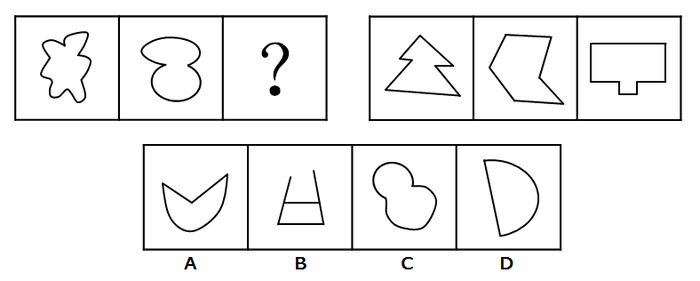
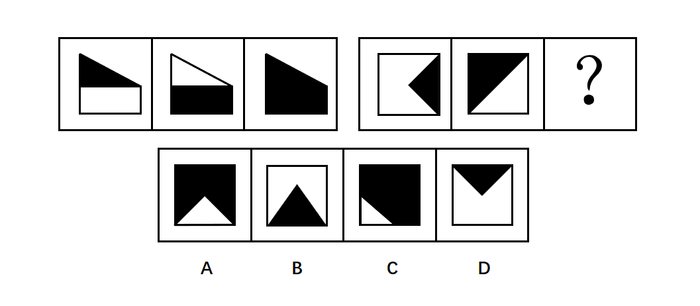
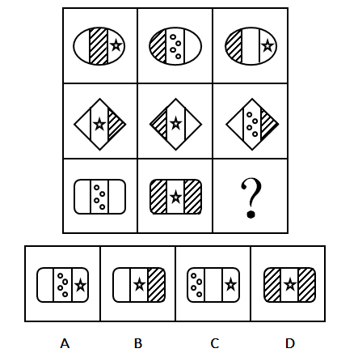
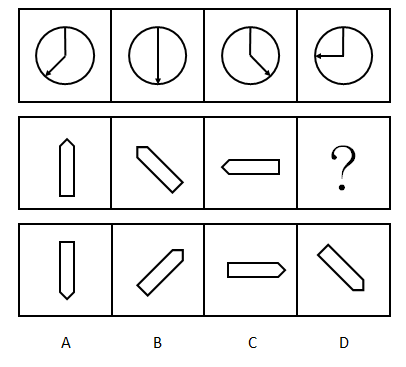
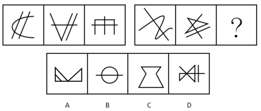
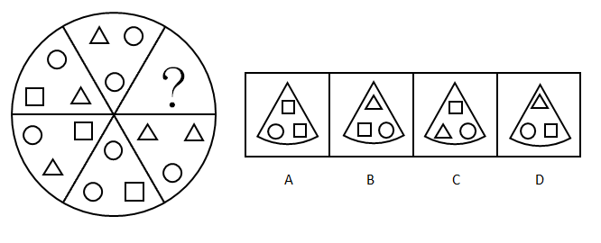
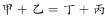
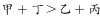
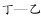
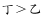

# 2016年河南省公务员录用考试《行测》题

> 判断推理 · 35 题 · 河南 2016

## 第 1 题　qid 2033308 · 图形推理

从所给的四个选项中，选择最合适的一个填入问号处，使之呈现一定的规律性：

- **A**. A
- **B**. B
- **C**. C　✅
- **D**. D

**答案**：C

**官方解析**

元素组成不同，优先考虑属性规律。第一组图前两幅图为全曲线图形，第二组图为全直线图形，因此“？”处应选择一个全曲线图形，只有C项为全曲线图形。
故正确答案为C。

---

## 第 2 题　qid 2033316 · 图形推理

从所给的四个选项中，选择最合适的一个填入问号处，使之呈现出一定的规律性：

- **A**. A
- **B**. B
- **C**. C　✅
- **D**. D

**答案**：C

**官方解析**

元素组成相同，优先考虑位置规律。十六宫格，中间的四格都是两黑两白，可以将内圈（中间4个格子）和外圈（12个格子）分开看规律。首先内圈的两个小黑块都是顺（逆）时针每次移动一个格子，因此排除A、D两项。
再看外圈小黑块，最右竖排相连的两个小黑块是每次逆时针移动一个格子，最下面的小黑块是每次向右移动一个格子（循环移动），在“？”应该移动到最左面，因此可以排除B项。
故正确答案为C。

---

## 第 3 题　qid 2033322 · 图形推理

从所给的四个选项中，选择最合适的一个填入问号处，使之呈现出一定的规律性：

 

- **A**. A　✅
- **B**. B
- **C**. C
- **D**. D

**答案**：A

**官方解析**

观察图形特征，第一组图形外轮廓相同，内部颜色不同，且第三个图形内部颜色由前两个图形的颜色叠加而成。因此，第二组图形也应符合此特征。
故正确答案为A。

---

## 第 4 题　qid 2033332 · 图形推理

从所给的四个选项中，选择最合适的一个填入问号处，使之呈现出一定的规律性：

- **A**. A
- **B**. B　✅
- **C**. C
- **D**. D

**答案**：B

**官方解析**

观察图形，第一、二行，每行图形都由轮廓相同的左、中、右三个部分构成，且每行图形，均出现三个“空白条”、三个“阴影图”、两个“星图”、一个“四个圆圈图”区域，因此考虑遍历规律。
规律应用第三行中，还缺一个“空白条”、一个“星图”、一个“阴影图”区域，观察选项，只有选项B符合。
故正确选项为B。

---

## 第 5 题　qid 2033336 · 图形推理

从所给的四个选项中，选择最合适的一个填入问号处，使之呈现出一定的规律性：

- **A**. A
- **B**. B　✅
- **C**. C
- **D**. D

**答案**：B

**官方解析**

元素组成相同，优先考虑位置规律。每幅图中直线和曲线均围绕圆中心旋转，观察曲线旋转的规律，均顺时针旋转，？处应是前一幅图顺时针旋转得到，排除C、D两项，观察直线旋转的规律，均逆时针旋转，？处应是前一幅图直线逆时针旋转得到，排除A项。

故正确答案为B。

---

## 第 6 题　qid 2033364 · 图形推理

从所给的四个选项中，选择最合适的一个填入问号处，使之呈现出一定的规律性：

- **A**. A
- **B**. B　✅
- **C**. C
- **D**. D

**答案**：B

**官方解析**

元素组成不同，考虑属性规律和数量规律。
解法一：属性规律分为对称性、曲直性、封闭性，对称、封闭无明显规律，题干所有的图形都是直线图形，而选项A、C、D项含有曲线，故根据曲直性选择B选项。
解法二：考虑数量规律。观察发现，每幅图形都是由两个相同的元素组成，第一幅图是两个四角形，第二幅图是两个三角形，第三幅图是两个六边形，第四幅图是两个长方形，？是也应是由两个相同的元素组成，即B选项，由两个带有直线的三角形组成。
故正确答案为B。

---

## 第 7 题　qid 2033370 · 图形推理

从所给的四个选项中，选择最合适的一个填入问号处，使之呈现出一定的规律性：

- **A**. A
- **B**. B　✅
- **C**. C
- **D**. D

**答案**：B

**官方解析**

元素组成相同，考虑位置规律。

优先看第一组，第一个图形到第三个图形箭头依次逆时针旋转了，第三个图形顺时针旋转得到第四个图形。

应用到第二组找规律，第一个图形到第三个图形依次逆时针旋转了，故“？”处图形应由第三个图形顺时针旋转，只有B项符合。

故正确答案为B。

---

## 第 8 题　qid 2033320 · 图形推理

从所给的四个选项中，选择最合适的一个填入问号处，使之呈现一定的规律性：

- **A**. A
- **B**. B
- **C**. C
- **D**. D　✅

**答案**：D

**官方解析**

元素组成不同，无明显属性规律，考虑数量规律。观察发现存在线条间的交叉，但点和线数量均无规律。
再看第二组第二个图形是五角星的变形图，考虑笔画数。
第一组每幅图都是六个奇点，均为三笔画图形。
第二组前两幅图都有4个奇点，均为两笔画图形，故？处应是两笔画图形。
A项2个奇点一笔画，B项2个奇点一笔画，C项0个奇点一笔画，D项4个奇点两笔画，只有D项符合。
故正确答案为D。

---

## 第 9 题　qid 2033324 · 图形推理

从所给的四个选项中，选择最合适的一个填入问号处，使之呈现一定的规律性：

- **A**. A
- **B**. B
- **C**. C
- **D**. D　✅

**答案**：D

**官方解析**

元素组成不同，无属性规律，考虑数量规律。观察发现面居多，优先数面。依次为2、4、6、8，呈等差数列规律，问号处应该是10个面，只有D项符合。
故正确答案为D。

---

## 第 10 题　qid 2033328 · 图形推理

从所给的四个选项中，选择最合适的一个填入问号处，使之呈现一定的规律性：

- **A**. A　✅
- **B**. B
- **C**. C
- **D**. D

**答案**：A

**官方解析**

元素组成不同，无属性和数量规律，观察发现这六个扇形的元素在里层从上逆时针依次是圆形、三角形、正方形，圆形、三角形、？，所以问号处应该是正方形，排除B、D两项。六个扇形的元素在外层上方开始逆时针依次是圆形三角形、圆形正方形、圆形三角形、圆形正方形、圆形三角形、？，所以问号处应该是圆形正方形，排除C项。

故正确答案为A。

---

## 第 11 题　qid 2033376 · 定义判断

智慧城市是运用信息和通信技术整合城市运行各项关键信息，从而对包括民生、环保、公共安全、城市服务、工商业活动在内的各种需求做出智能响应，实现城市智慧式管理和运行。
根据上述定义，下列不属于智慧城市内容的是：

- **A**. 逐步实现多领域跨行业的“一卡通”网
- **B**. 网上“一站式”行政审批及其他公共服务
- **C**. 根据人工智能算法科学合理地规划城市交通网　✅
- **D**. 整合各类监控资源，建立治安综合管理平台

**答案**：C

**官方解析**

第一步：找到定义关键词。
关键词为：“运用信息和通信技术整合城市运行关键信息”、“对各种需求做出智能响应”、“实现智慧式管理和运行”。
第二步：逐一分析选项。
A项：多领域跨行业的“一卡通”是运用了信息和通信技术，对多领域内的需求做出智能响应，实现智慧城市的管理和运行，符合定义；
B项：网上的“一站式”行政审批是运用了信息和通信技术，可以对行政审批的民生需求做出智能响应，实现智慧城市的管理和运行，符合定义；
C项：人工智能算法运用了信息和通信技术，但规划合理的城市公共交通网只是对城市交通进行规划（如道路设置、增设公共汽车、有轨电车、无轨电车、地下铁道、出租汽车等各类交通工具），没有体现智能响应（如果C选项说的是根据人工智能算法，公交车能够自动识别高峰期，每天动态变化，智能调整路线等才符合题干中智能响应的要求），不符合定义；
D项：整合监控资源，建立治安管理平台是运用了信息和通信技术，可以对公共安全的需求做出智能响应，实现智慧城市的管理和运行，符合定义。
本题为选非题，故正确答案为C。

---

## 第 12 题　qid 2033386 · 定义判断

在因果关系十分复杂的科学领域，即使在基本条件相同的条件下，每做一次观察或试验，都可能得到不同的结果。这意味着，我们往往无法根据已知的有限原因精确地预测结果，每做一次预测，也都可能会出现偏差。我们将这种无法精确预测的现象，称为随机现象。
根据上述定义，下列属于随机现象的是：

- **A**. 种瓜得瓜，种豆得豆
- **B**. 郑州每年8月9日的气温　✅
- **C**. 对正常人而言，剧烈运动后会出汗
- **D**. 定量的氢气在氧气中燃烧生成定量的水

**答案**：B

**官方解析**

第一步，找到定义关键词。
关键词为“因果关系十分复杂的科学领域”、“基本条件相同”、“每做一次预测，也都可能会出现偏差”、“无法精准预测”。
第二步，逐一分析选项。
A项：种瓜或豆，一定会得到瓜或豆，不会出现预测的偏差，可以得到精准预测，不符合定义，排除；
B项：“郑州每年8月9日”符合关键词“基本条件相同”，天气预测属于科学领域，但每年同一天的天气情况会因为多种因素影响，无法精准预测出结果，每一次预测都可能出现偏差，符合关键词，符合定义，当选；
C项：在“对正常人而言”这一限定条件下，剧烈运动一定会出汗，不符合关键词“无法精准预测”，不符合定义，排除；
D项：定量的氢气和氧气通过燃烧可以分解出氢原子、氧原子，两个氢原子和一个氧原子生成一个水分子，N个水分子结合成水，是必然现象，不符合关键词“无法精准预测”，不符合定义，排除。
故正确答案为B。

---

## 第 13 题　qid 2033396 · 定义判断

案例教学法是指在教师的指导下，由学生对选定的具有代表性的典型案例，进行针对性地分析、审理和讨论，做出自己的判断和评价。
根据上述定义，下列属于案例教学法的是：

- **A**. 为讲解什么是“正当防卫”，赵老师给出真实案件，把学生分为辩方律师与控方律师进行分析、辩论　✅
- **B**. 为教授无土栽培技术，李老师以“无土栽培番茄”为例进行逐步演示，学生分组动手操作，并完成栽培过程书面报告
- **C**. 为讲解“包产到户”，张老师组织学生到小岗村进行实地考察，与当地农民座谈、讨论、分析“包产到户”的必要性
- **D**. 为传授网线制作的技巧，刘老师播放了一段事先录制好的网线制作视频，供大家观察、讨论和学习

**答案**：A

**官方解析**

第一步：找出定义关键词。
“在教师的指导下”、“学生对选定的具有代表性的典型案例”、“针对性地分析、审理和讨论”、“做出自己的判断和评价”。
第二步：逐一分析选项。
A项：赵老师为讲解“正当防卫”，给出了真实案例，体现了在教师的指导下，把学生分组进行分析、辩论，符合学生对案例进行针对性分析、审理、讨论，体现了学生的主体作用，符合定义，当选；
B项：李老师在教授中自己进行逐步演示，是老师在分析案例，学生直接动手操作，没有体现学生对案例的分析、审理和讨论，不符合定义，排除；
C项：张老师组织学生实地考察，并不是典型案例，学生也没有对案例进行针对性分析，不符合定义，排除；
D项：刘老师播放了事先录制好的网线制作视频，只是为了教授制作技巧，并不是具有代表性的典型案例，学生也没有进行针对性的讨论、分析，不符合定义，排除。
故正确答案为A。

---

## 第 14 题　qid 2033406 · 定义判断

军事侦察侧重于侦查对象是什么，现在什么状态，是一种主动获取的方式。而军事监视侧重于将会发生什么，具有一定的预警功能，是一种相对被动的方式。
根据上述定义，下列属于军事侦察行为的是：

- **A**. 某国在网络设备上开启后门搜集情报
- **B**. 某国间谍在我驻外使馆安装窃听设备
- **C**. 某国军机抵近我沿海军事基地搜集情报　✅
- **D**. 某国在我国周边地区安装大型远程雷达时刻关注我军事动向

**答案**：C

**官方解析**

第一步：找到关键词。
军事侦察：侧重于侦察对象是什么，现在什么状态，主动获取的方式；
军事监视：侧重于将会发生什么，一定预警功能，相对被动的方式。
第二步：逐一分析选项。
A项：在网络设备上开启后门搜索情报，搜集的对象、方式不明确，不符合军事侦察定义，排除；
B项：间谍安装了窃听设备，监视我驻外大使馆的情况，是侧重于大使馆将会发生什么，而不是大使馆目前发生什么，属于军事监视，排除；
C项：军机抵进我沿海军事基地搜集情报，侦察对象是我沿海军事基地，侦察方式是主动侦察，是侧重于侦察我沿海军事基地现在什么状态，符合军事侦察定义，当选；
D项：安装大型远程雷达时刻关注我军事动向，是侧重于我国将会发生什么，有一定预警功能，而不是我军目前发生什么，属于军事监视，排除。
故正确答案为C。

---

## 第 15 题　qid 2033412 · 定义判断

经验科学指偏重于经验事实的描述和明确具体的实用性科学，它旨在探究、描述、说明和预言发生在我们所生活的世界上的事件。因此，经验科学的论断必须由我们经验中的事实来检验，而且仅当它们有经验证据支持时，它们才是可以接受的。
根据上述定义，下列不属于经验科学的是：

- **A**. 逻辑学　✅
- **B**. 星座学
- **C**. 万有引力定律
- **D**. 自由落体定律

**答案**：A

**官方解析**

第一步：找到关键词。
“经验事实的描述”、“明确具体的实用性”、“必须由经验中的事实来检验”。
第二步：逐一分析选项。
A项：逻辑学是研究思维规律的学问，属于哲学范畴，是科学的学科，是基础学科，不是对“经验事实的描述”，也没有“明确具体的实用性”，更不用“经验来检验”，不符合定义；
B项：星座学是对经验事实的描述，需要通过收集大量的案例和数据，才能形成一个较为确定的理论体系，所以星座学是当有经验论据支持时，它是可以接受的，符合定义；
C项：万有引力定律是牛顿在1687年于《自然哲学的数学原理》上发表的，他发现海洋被月球重力所吸引，并且一切行星相互被重力所吸引，彗星同样被太阳的重力所吸引。故得出对经验事实的描述，一切物体，不论是什么，都被赋予了相互的引力原理。有明确具体的实用性，且任何事物均可用此定律来检验，符合定义；
D项：自由落体定律是伽利略通过反复的实验得出的，认为如果不计空气阻力，轻重物体的自由下落速度是相同的，即重力加速度的大小都是相同的。这是对经验事实的描述，有明确具体的实用性，也可以通过其他事物来检验，符合定义。
技巧：C、D项是同构选项，排除。
本题为选非题，故正确答案为A。

---

## 第 16 题　qid 2033418 · 定义判断

事业单位固定资产是指使用期限超过一年，单位价值1000元以上（其中：专用设备单位价值在1500元以上）。并在使用过程中基本保持原有物质形态的资产。单位价值虽未达到规定标准，但是耐用时间在一年以上的大批同类物资，作为固定资产管理。
根据上述定义，下列属于事业单位固定资产的是：

- **A**. 一个价值800元的移动硬盘
- **B**. 每箱价值200元的打印纸100箱
- **C**. 单套价值500元的座椅10套　✅
- **D**. 价值2000元的一批试验用试剂

**答案**：C

**官方解析**

第一步：找到定义关键词。
关键词为①“单位价值1000元以上，使用期限超过一年，并在使用过程中基本保持原有物质形态”；②“单位价值未达规定标准（价值1000元以下），耐用时间在一年以上的大批同类物资”。
符合上述关键词中一个即符合定义。
第二步：逐一分析选项。
A项：单位价值在1000元以下，不符合定义关键词①；移动硬盘耐用时间在一年以上，但是只有一个，不符合定义关键词②，排除；
B项：打印纸单位价值在1000元以下，不符合定义关键词①；同时打印纸是一次性使用，耐用时间不在一年以上，不符合定义关键词②，排除；
C项：座椅单套价值为1000元以下，不符合定义关键词①；同时座椅的耐用时间是在一年以上，符合定义关键词②，当选；
D项：单位价值在1000元以上，对比关键词①，试验用试剂不符合使用过程中基本保持原有物质状态，不符合定义，排除。
故正确答案为C。

---

## 第 17 题　qid 2033424 · 定义判断

自17世纪以来，也许是受到理性精神的鼓舞和科学进步的鼓励，人类思想长期处在逻辑形式主义和科学唯理主义的密云中。到了20世纪上半叶的逻辑实证主义那里，这种思想发展成为一种极端：只有符合逻辑的、可验证的知识才是人类的唯一选择，凡不能由逻辑与实证加以检验的知识都是空想，没有意义。
根据上述观点，下列不属于“空想”的是：

- **A**. 法学
- **B**. 几何学　✅
- **C**. 伦理学
- **D**. 政治学

**答案**：B

**官方解析**

第一步，找到定义关键词。
关键词为“不能由逻辑与实证加以检验的知识”。
第二步，逐一分析选项。
A项，法学是以法律、法律现象及其规律性为研究内容的科学，它是研究与法相关问题的专门学问，是建立在一定经验基础上发展的学科，属于空想，排除；
B项，几何学是运用基本的逻辑推理做出一系列的命题（如几何学中的公理、定理、公式、推导等），当选；
C项，伦理学是关于道德问题的理论，是研究道德的产生、发展、本质、评价、作用以及道德教育、道德修养规律的学说，是建立在一定经验基础上发展的学科，属于空想，排除；
D项，政治学是一门以研究政治行为、政治体制以及政治相关领域为主的社会科学学科，是建立在一定经验基础上发展的学科，属于空想，排除。
本题为选非题，故正确答案为B。

---

## 第 18 题　qid 2033430 · 定义判断

非战争军事行动是指在相对和平环境下，动用军事力量有组织有计划地采取战争以外的军事手段。
根据上述定义，下列属于非战争军事行动的是：

- **A**. 南苏丹武装冲突
- **B**. 2016中俄联演　✅
- **C**. 美军击毙本·拉登
- **D**. 德军打击IS组织

**答案**：B

**官方解析**

第一步：找到定义关键词。
关键词为“相对和平环境”、“动用军事力量”、“有组织有计划”、“战争以外的军事手段”。
第二步：逐一分析选项。
A项：南苏丹的武装冲突采用的是战争手段，不符合关键词“战争以外的军事手段”，不符合定义，排除；
B项：中俄联演发生在相对和平的环境，且联演是动用了两国的军事力量，属于有计划有组织的行动，且没有采取战争手段，符合定义，当选；
C项：美军击毙本·拉登动用的不是战争以外的军事手段，不符合定义，排除；
D项：德军打击IS组织动用的不是战争以外的军事手段，不符合定义，排除。
故正确答案为B。

---

## 第 19 题　qid 2033426 · 定义判断

单工通信是指发送端和接收端的身份是固定的，发送端只能发送信息，不能接收信息。接收端只能接收信息，不能发送信息，数据信号仅从一端传送到另一端，即信息流是单方向的。
根据上述定义，下列不属于单工通信的是：

- **A**. 校园广播
- **B**. 对讲机通话　✅
- **C**. 收音机收听电台
- **D**. 电视机遥控器切换频道

**答案**：B

**官方解析**

第一步：找到定义关键词。
“发送端只能发送不能接收”、“接收端只能接收不能发送”、“信息流是单方向”。
第二步：逐一分析选项。
A项：“校园广播”只能发送消息，不能接收学生们的消息，同样学生也只能接收信息，不能发送，信息流是单方向，符合题干关键词，排除；
B项：“对讲机通话”是双向交流，既可以发送信息又可以接收信息，不符合题干关键词“信息流是单方向”，当选；
C项：“收音机收听电台”只是发送消息，不能接收听众们的信息，注意这里说的是“收听电台”，并不是双向咨询的电台，信息流是单方向，符合题干关键词，排除；
D项：“电视机遥控器切换频道”的工作原理是通过红外线二极管发射出去，电视机接收之后进行解码再执行相应的动作，遥控器只是发送消息，没有接收消息，信息流是单方向，符合题干关键词，排除。
本题为选非题，故正确答案为B。

---

## 第 20 题　qid 2033422 · 定义判断

语言是一种符号系统，任何符号都包含形式和意义两方面。在语法系统里，基本符号是语素，它被定义为“最小的有意义的语言成分”，例如“我喜欢吃葡萄”里的“我”“喜”“欢”“吃”都有意义，而且都不能分割成更小的有意义的单位了，所以“葡萄”也是最小的有意义的语言成分，也是语素。
根据上述定义，下列属于语素的是：

- **A**. 琵琶　✅
- **B**. 人民
- **C**. 衣服
- **D**. 履历

**答案**：A

**官方解析**

第一步：找到定义关键词。
“最小的有意义的语言成分”、“合在一起才有意义”。
第二步：逐一分析选项。
A项：“琵”和“琶”是最小有意义的语言成分，它俩只有合在一起才有意义，符合定义，当选；
B项：“人”和“民”并不是最小有意义的语言成分，还可以再分割，而且两词不在一起，就算单独分开也是具有一定意义的，故不符合定义，排除；
C项：“衣”和“服”并不是最小有意义的语言成分，两词不在一起，就算单独分开也是具有一定意义的，故不符合定义，排除；
D项：“履”和“历”并不是最小有意义的语言成分，而且两词不在一起，就算单独分开也是具有一定意义的，故不符合定义，排除。
故正确答案为A。

---

## 第 21 题　qid 2033344 · 类比推理

鸭子：河

- **A**. 摩天轮：过山车
- **B**. 喜剧：话剧
- **C**. 飞机：飞机场　✅
- **D**. 火车：轨道

**答案**：C

**官方解析**

第一步：判断题干词语间逻辑关系。
鸭子是水禽，可在河中放养，河是鸭子活动的场所。
第二步：判断选项词语间逻辑关系。
A项：摩天轮和过山车是并列关系，都是娱乐设施，不符合题干逻辑关系，排除；
B项：戏剧按戏剧冲突的性质及效果，可分为悲剧、喜剧和正剧，按表现形式，可分为话剧、歌剧、诗剧、舞剧、戏曲等。因此有的喜剧是话剧，有的话剧是喜剧，二者是交叉关系，不符合题干逻辑关系，排除；
C项：飞机停放在飞机场，飞机场也是飞机活动的场所，与题干逻辑关系一致，保留；
D项：火车在轨道上运行，轨道也是火车活动的场所，与题干逻辑关系一致，保留；
比较C、D两项，题干鸭子可在河中活动，也可以在岸上活动，C选项的飞机可以在飞机场中，也可以在天上飞行；火车只能在轨道上运动，因此C选项更加契合题干。
故正确答案为C。

---

## 第 22 题　qid 2033348 · 类比推理

水泥：建房

- **A**. 水杯：解渴
- **B**. 船桨：船帆
- **C**. 瓢：舀水　✅
- **D**. 血：循环

**答案**：C

**官方解析**

第一步：判断题干词语间逻辑关系。
水泥可用来建房，二者是功能对应关系。
第二步：判断选项词语间逻辑关系。
A项：水杯是盛放液体的工具，不可以解渴，水杯中的水及其他饮品才能解渴，不符合题干逻辑关系，排除；
B项：船桨和船帆都是船的一部分，二者是并列关系，不符合题干逻辑关系，排除；
C项：瓢有舀水的功能，二者是功能对应关系，与题干逻辑关系一致，当选；
D项：血的功能是营养和滋润，而不是循环，不符合题干逻辑关系，排除。
故正确答案为C。

---

## 第 23 题　qid 2033350 · 类比推理

书籍：人类进步的阶梯：《进化论》

- **A**. 跑步：使人健康的方式：强壮
- **B**. 语言：心灵的桥梁：汉语　✅
- **C**. 月亮：天空中的小船：天体
- **D**. 舞蹈：流动的符号：表演

**答案**：B

**官方解析**

第一步：判断题干词语间逻辑关系。
书籍是人类进步的阶梯，用“人类进步的阶梯”比喻“书籍”，前两个词是比喻义；第一个词和第三个词，《进化论》是书籍，二者是种属关系。
第二步：判断选项词语间逻辑关系。
A项，跑步是使人健康的方式之一，但“使人健康的方式”没有比喻“跑步”，与题干逻辑关系不一致，排除；
B项，语言是心灵的桥梁，用“心灵的桥梁”比喻“语言”，是比喻义；汉语是语言的一种，是种属关系，与题干逻辑关系一致，当选；
C项，月亮是天空中的小船，用“天空中的小船”比喻“月亮”，是比喻义；但月亮是天体的一种，顺序与题干相反，与题干逻辑关系不一致，排除；
D项，舞蹈是流动的符号，用“流动的符号”比喻“舞蹈”，是比喻义；但舞蹈是表演的一种，顺序与题干相反，与题干逻辑关系不一致，排除。
故正确答案为B。

---

## 第 24 题　qid 2033356 · 类比推理

歌唱家：歌唱：歌曲

- **A**. 厨师：烹饪：食物　✅
- **B**. 学生：学习：考试
- **C**. 律师：法院：案件
- **D**. 清洁工：施肥：垃圾

**答案**：A

**官方解析**

第一步：判断题干词语间逻辑关系。
歌唱家歌唱歌曲，歌唱家是主语，歌唱是谓语，歌曲是宾语，三词构成主谓宾关系。
第二步：判断选项词语间逻辑关系。
A项：厨师烹饪食物，厨师是主语，烹饪是谓语，食物是宾语，三词构成主谓宾关系，与题干逻辑关系一致，当选；
B项：学生是主语，学习考试搭配不当，无法构成主谓宾关系，与题干逻辑关系不一致，排除；
C项：律师是主语，但法院是一个地点，与题干逻辑关系不一致，排除；
D项：清洁工清扫垃圾，而非施肥垃圾，搭配不当，与题干逻辑关系不一致，排除。
故正确答案为A。

---

## 第 25 题　qid 2033358 · 类比推理

报名：培训：结业

- **A**. 高考：招生：毕业
- **B**. 设计：产品：使用
- **C**. 驾驶：公路：旅行
- **D**. 挂号：看病：痊愈　✅

**答案**：D

**官方解析**

第一步：判断题干词语间逻辑关系。
报名、培训、结业这三个事件存在时间先后顺序的对应关系，即先报名再培训，最后结业。
第二步：判断选项词语间逻辑关系。
A项：高考、招生、毕业这三个词并不是时间先后顺序的对应关系，排除；
B项：设计和产品是动宾关系，使用产品也是动宾关系，三者都不是顺序关系，排除；
C项：在公路上驾驶，所以公路与驾驶也无时间先后顺序的对应关系，排除；
D项：挂号、看病、痊愈这三个事件存在时间先后顺序的对应关系，即先挂号再看病，最后痊愈，与题干逻辑关系一致，当选。
故正确答案为D。

---

## 第 26 题　qid 2033366 · 逻辑判断

有人说某地养石斛浇的是富含微量元素的矿泉水，似乎是说该地石斛的品质跟这种矿泉水有关。
为了验证这个结论，下列哪种实验方法最可靠？

- **A**. 选一些不同品种、等级的石斛，用富含微量元素的矿泉水浇养，然后检验比较它们的品质
- **B**. 选择品种、等级等完全相同的石斛，一半用富含微量元素的矿泉水浇养，一半用普通水浇养，然后比较它们的品质　✅
- **C**. 检验和比较用富含微量元素的矿泉水浇养和用普通水浇养的石斛的品质
- **D**. 选一种优良品种、等级高的石斛用富含微量元素的矿泉水浇养，然后与普通水浇养的普通石斛做品质比较

**答案**：B

**官方解析**

第一步：找到论点和论据。
论点：该地石斛品质与矿泉水有关。
论据：有人说某地养石斛浇的是富含微量元素的矿泉水。
第二步：逐一分析选项。
A项：选择不同品种和等级的石斛，属于样本选择不科学，即使用含有微量元素的矿泉水浇养也无法比较出石斛品质的差别，无法验证题干结论，排除；
B项：选择品种和等级相同的石斛，样本选取科学，一半用富含微量元素的矿泉水浇养，一半用普通水浇养，可以有效地比较出同一样本的不同品质，可以验证题干结论，当选；
C项：并没有提到检验的是否为同一品种的石斛，样本不一致会导致得出的结果不科学，属于不明确选项，排除；
D项：用矿泉水浇养优良品种石斛，用普通水浇养普通石斛，无法验证富含微量元素矿泉水对石斛品质是否有影响这一结论，排除。
故正确答案为B。

---

## 第 27 题　qid 2033374 · 逻辑判断

某市工商局的员工数量较五年前减少了数百人，但新办企业办证时间减少了一周。由此可以得出结论：目前该市工商局的员工工作效率较五年前有明显的提高。
以下各项如果为真，不能支持上述论证的是：

- **A**. 该工商局增加了新办企业办证的环节
- **B**. 该工商局管理力度较五年前有明显加强
- **C**. 该市新办企业数量较五年前也有大幅减少　✅
- **D**. 新办企业办证时间主要取决于人员办事的速度

**答案**：C

**官方解析**

第一步：找到论点论据。
论点：该市工商局的员工工作效率较五年前有明显的提高。
论据：该市工商局的员工数量较五年前减少了数百人，新办企业办证时间减少了一周。
第二步：逐一分析选项。
A项：增加了新办企业办证的环节，说明工作量不减反增，在人数减少的情况下，工作量变大了，但是办证时间减少了，证明工作效率确实是提高了，补充论据加强论点，属于加强选项，排除；
B项：相较五年前工商局管理力度明显加强，管理好了，则效率在一定程度上可以提高，补充论据解释论点，属于加强选项，排除；
C项：工作效率等于单位时间内的工作量，效率除了与办证时间有关之外，还与办证数量有关，C项说新办企业数量较五年前有减少，属于反面补充范围，削弱论证，属于削弱选项，当选；
D项：办证时间取决于办事的速度，时间减少了，办证速度也提升，速度提升就是效率提高了，可以加强论证，属于加强选项，排除。
本题为选非题，故正确答案为C。

---

## 第 28 题　qid 2033380 · 类比推理

已知一次英语考试甲、乙、丙、丁的成绩如下：甲、乙的成绩之和等于丁、丙的成绩之和，如果把乙和丁的成绩互换，甲和丁的成绩之和大于乙和丙的成绩之和，乙的成绩比甲、丙的成绩都高。
根据以上所知，下列哪项为真？

- **A**. 甲的成绩最高
- **B**. 乙的成绩最高
- **C**. 丙的成绩最高
- **D**. 丁的成绩最高　✅

**答案**：D

**官方解析**

根据题干条件可知： 

①，②，③； 

根据③，甲、丙的成绩不能是最高的，排除A、C两项。

由②—①推出：（大于号两边减去相同的数大于号方向不变）。

为正数，为负数，即。

故正确答案为D。

---

## 第 29 题　qid 2033384 · 逻辑判断

甜品店有四种甜品：双皮奶、布丁、蛋糕和冰淇淋。B比A贵，C最便宜，双皮奶比布丁贵，蛋糕最贵，冰淇淋比D贵。
关于这四种甜点，下列说法正确的是：

- **A**. A是双皮奶，B是蛋糕，C是冰淇淋，D是布丁
- **B**. A是布丁，B是冰淇淋，C是蛋糕，D是双皮奶
- **C**. A是冰淇淋，B是蛋糕，C是布丁，D是双皮奶　✅
- **D**. A是冰淇淋，B是蛋糕，C是双皮奶，D是布丁

**答案**：C

**官方解析**

第一步：分析题干条件。
（1）B&gt;A
（2）C最便宜
（3）双皮奶&gt;布丁
（4）蛋糕最贵
（5）冰淇淋&gt;D
第二步：根据题干条件进行推理。
题干信息确定，选项信息充分，优先考虑排除法。
根据条件（2）可知其它食物的价格均比C食物贵。
根据条件（3）可知双皮奶不是最便宜的C食物，故排除D项；
根据条件（4）可知蛋糕不是最便宜的C食物，故排除B项；
根据条件（5）可知冰淇淋不是最便宜的C食物，故排除A项。
故正确答案为C。

---

## 第 30 题　qid 2033390 · 逻辑判断

三人在一起猜测晚会节目的顺序。甲说：“一班第一个出场，二班第三个出场。”乙说：“三班第一个出场，四班第四个出场。”丙说：“四班第二个出场，一班第三个出场。”结果公布后，发现他们的预测都只对了一半。
由以上可以推出，节目的正确出场顺序是：

- **A**. 四班第一，三班第二，一班第三，二班第四
- **B**. 二班第一，一班第二，三班第三，四班第四
- **C**. 三班第一，四班第二，二班第三，一班第四　✅
- **D**. 一班第一，二班第二，四班第三，三班第四

**答案**：C

**官方解析**

由题干可知每人只对了一半，是一道题干信息真假不确定的排列组合，考虑代入法，代入选项后符合每人的预测都只对了一半即为正确答案。
A项：根据选项信息可知，甲说一班第一个出场错误，二班第三个出场错误，甲全错，与题干条件每人的预测都只对了一半不符，排除；
B项：根据选项信息可知，甲说一班第一个出场错误，二班第三个出场错误，甲全错，与题干条件每人的预测都只对了一半不符，排除；
C项：根据选项信息可知，甲说一班第一个出场错误，二班第三个出场正确，甲符合；乙说三班第一个出场正确，四班第四个出场错误，乙符合；丙说四班第二个出场正确，一班第三个出场错误，丙符合，三人预测都只对了一半，满足题干条件，当选；
D项：根据选项信息可知，甲说一班第一个出场正确，二班第三个出场错误，甲符合；乙说三班第一个出场错误，四班第四个出场错误，乙全错，与题干条件每人的预测都只对了一半不符，排除。
故正确答案为C。

---

## 第 31 题　qid 2033394 · 类比推理

把红、黄、蓝、绿、紫五个小球放在五个排成一列的抽屉里，序号为A、B、C、D、E。要求:黄球放在绿球和紫球前面，蓝球不能放在B抽屉里，红球和绿球之间隔着一个抽屉。
问黄球放在哪个抽屉时，五个球的排放顺序是唯一的？

- **A**. B抽屉
- **B**. C抽屉　✅
- **C**. D抽屉
- **D**. E抽屉

**答案**：B

**官方解析**

该题需要将不同颜色的球和抽屉顺序做匹配，为排列组合题，优先用代入排除法，问黄球放在哪个抽屉时，五个球的排放顺序是唯一的，4个选项依次代入，满足要求即为正确答案。
A项，假设黄球放在B抽屉，根据题干要求，黄球在绿球和紫球的前面，红球和绿球隔一个，蓝球不在B，可以有蓝黄红紫绿、蓝黄绿紫红等排放顺序，并不唯一，排除；
B项，假设黄球放在C抽屉，根据题干要求，黄球在绿球和紫球的前面，红球和绿球隔一个，蓝球不在B，只有蓝红黄绿紫唯一的排放顺序，当选；
C项，假设黄球放在D抽屉，如果黄球放在D抽屉，题干要求黄球在绿球和紫球的前面，黄球后面只剩一个抽屉，无法同时放绿球和紫球，不满足题干要求，排除；
D项，假设黄球放在E抽屉，如果黄球放在E抽屉，与C项同理，题干要求黄球在绿球和紫球的前面，黄球后面没有抽屉，无法放绿球和紫球，不满足题干要求，排除。
故正确答案为B。

---

## 第 32 题　qid 2033398 · 逻辑判断

甲乙丙丁四个人高考前对英语成绩进行预测。当时，甲说：“我再怎么努力也考不了90分。”乙说：“不知道自己能考多少分，但是我知道丙能考90分。”丙说：“不会考到80分。”丁说：“乙不会考的比60分还低。”事实上只有一个人猜对了。
以下哪个结论不支持乙猜对了？

- **A**. 丁考得比甲好
- **B**. 乙考得不是最差的　✅
- **C**. 甲和丙考得一样高
- **D**. 丙和丁考得一样高

**答案**：B

**官方解析**

本题为真假推理题。经过老师们的一致教研，粉笔认为本题题干信息不充分，根据题干已知信息并结合选项推不出答案，而丙的话按照正常语句构成来说少了一个主语。发现题干信息均未涉及丁，而选项中反复出现丁，故认为此处丙的话可能是“丁不会考到80分”，将此条件补齐进行推理可知：
第一步：分析题干。
列出题干已知信息：
甲：甲＜90分，乙：丙≥90分，丙：丁＜80分，丁：乙≥60分。
提问方式中明确指出不支持乙猜对，那么，我们根据乙说的为真话，又只有一个人猜对，可知其余人都说假话，可以得出如下结论：甲≥90分、丙≥90分、丁≥80分、乙＜60分。
第二步：分析选项。
本题采用代入法，假设A、C、D三项为真代入题干，均与题干无冲突。代入B项，乙考的不是最差的，与上一步推出的结论乙＜60分，是四个人中成绩最差的有冲突，因此B项不能支持乙的猜测。
本题为选非题，故正确答案为B。

---

## 第 33 题　qid 2033400 · 逻辑判断

某市多年来一直存在人才外流的现象，但自从大学城搬迁到该市后，出现了名校毕业生在该市就业难的现象，因此有人认为该市就业难是大学城搬迁带来的。
以下哪项如果为真，最能支持上述结论？

- **A**. 周围其他市依旧存在人才外流现象
- **B**. 本市的企业在2年内增长了3倍　✅
- **C**. 本市大学城搬迁前也存在就业难的现象
- **D**. 本市政府出台政策鼓励学生自主创业

**答案**：B

**官方解析**

第一步：找到论点论据。
论点：该市就业难是大学城搬迁带来的。
论据：某市多年来一直存在人才外流的现象，但自从大学城搬迁到该市后，出现了名校毕业生在该市就业难的现象。
第二步：逐一分析选项。
A项：周围其他市也存在人才外流的情况，与该市是因为什么原因导致就业难是两件不同的事情，无关选项，排除；
B项：就业涉及到就业人员与企业双方面的因素，本市企业增多说明不是企业少的因素导致就业难，即就业人员增加是就业难的原因，大学城搬迁可以导致就业人数增加，补充论据，加强，当选；
C项：搬迁之前也有这种情况，说明搬迁没有导致就业难，削弱题干论点，排除；
D项：政府鼓励自主创业，但是否有成效并不确定，对毕业生的影响也无法判断，且毕业生就业的情况并未提及，无关选项，排除。
故正确答案为B。

---

## 第 34 题　qid 2033416 · 逻辑判断

小丽一大早到公司，发现自己桌子上有一束玫瑰花，同事小王经过仔细分析，认为是客户张总送的，小丽则认为不可能。但是小王说，其他的可能性都被排除了，剩下的可能性不管看起来多荒谬，都是真的。
以下哪项如果为真，最能削弱小王的说法？

- **A**. 小王不可能比小丽更了解张总
- **B**. 逻辑推理不一定能得出更多答案
- **C**. 张总是公认的浪漫的人
- **D**. 小王不可能穷尽所有的可能性　✅

**答案**：D

**官方解析**

第一步：找到论点论据。
论点：小王认为小丽的花是张总送的。
论据：其他送花的可能性都被排除了。
第二步：逐一分析选项。
A项：强调的是小王没有小丽了解张总，这与论点所说的张总是否送花给小丽之间无必然联系，排除；
B项：讨论的是逻辑推理能不能得出更多答案的问题，与论点中“小王认为小丽的花是张总送的”无关，不能削弱，排除；
C项：强调张总是浪漫的人，这还是未告知我们张总是否有送花给小丽，排除；
D项：强调小王不可能穷尽所有可能性，与题干中小王所说的已经排除了其他送花的可能性矛盾，直接削弱论据，当选。
故正确答案为D。

---

## 第 35 题　qid 2033420 · 类比推理

甲乙丙丁同住一寝室，有人问他们：“你们当中谁会的语言最多？”甲说：“我不会说英语，当乙和丙交谈时，我能用外语给他们翻译。”乙说：“我是英国人，丁不会说英语，但我俩可以毫无困难地交流。”丙说：“我和丁交流时，需要乙来帮忙翻译。”丁说：“我们四个人不能同时用一种语言交流。”
据此可以推断出四个人中谁会的语言最多？

- **A**. 甲
- **B**. 乙　✅
- **C**. 丙
- **D**. 丁

**答案**：B

**官方解析**

注：本题不严谨，考试时考场临时通知修改了题目，将“三个人”修改为“四个人”，但是修改后仍然有问题，如果进行推理需要假设非常多情况并且得不出来确定结论。此外，从命题人的出题角度看，也不会让考生在考试时进行过于复杂的假设和推理，因此，本题在考试的时候可采用以下思路快速解题：
分析题干可知，甲不会说英语，丁不会说英语，丙和丁交流的时候需要乙做翻译，说明丙不会丁的语言，故甲、丙、丁都至少有一种不会的语言。此时，如果乙会所有语言，与题干要求并不矛盾，那么可以猜测乙会的语言可能最多。
故正确答案为B。

---
