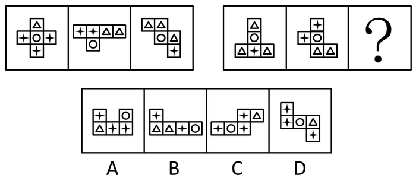
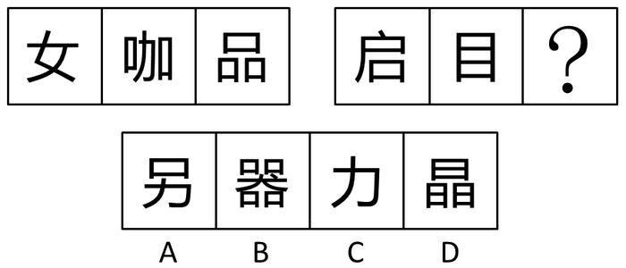
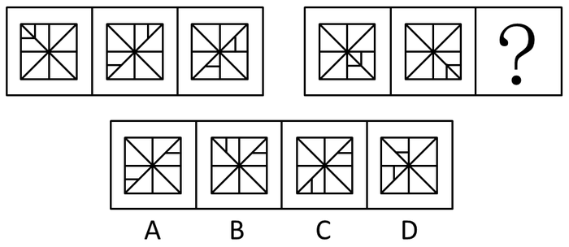
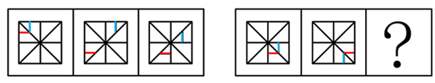
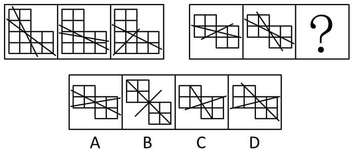

# 2016年深圳市公务员录用考试《行测》题

> 判断推理 · 20 题 · 深圳市考 2016

## 第 1 题　qid 1770714 · 类比推理

（1）提高健康素质

（2）改善人类生活质量
（3）取得基因组研究突破
（4）加入人类基因组计划
（5）完成承担的科研计划

- **A**. 4-1-2-3-5
- **B**. 5-3-4-2-1
- **C**. 4-5-3-1-2　✅
- **D**. 5-4-2-3-1

**答案**：C

**官方解析**

4与5之间比较，4是加入，5是完成，因此4在5的前面，排除B选项和D选项；1和3之间比较，先取得研究突破，后提高身体素质，因此3在1的前面，排除A选项。
故正确答案为C。

---

## 第 2 题　qid 1772240 · 类比推理

（1）得到有效控制
（2）掌握病的流行规律和特点
（3）某传染病流行
（4）开发接种疫苗
（5）大规模调研和防治实践

- **A**. 5-3-1-4-2
- **B**. 3-2-5-4-1
- **C**. 3-5-2-4-1　✅
- **D**. 5-4-3-2-1

**答案**：C

**官方解析**

3与5之间比较，先开始流行，后调研，因此排除A和D选项；2和5比较，先调研实践，后掌握规律特点，因此排除B选项。
故正确答案为C。

---

## 第 3 题　qid 1772246 · 类比推理

（1）日本人质遭斩首
（2）国际社会同声谴责
（3）民众在首相官邸外示威
（4）表态确保海内外日本人安全
（5）借机推动海外派兵

- **A**. 1-3-2-4-5　✅
- **B**. 1-4-2-3-5
- **C**. 3-4-2-5-1
- **D**. 4-5-3-2-1

**答案**：A

**官方解析**

事件起因是日本人质遭到斩首，故（1）是开始；国际社会同声谴责表明之前还有一个声音，看其他题干，（3）中民众游行示威显然是发生在国际社会同声谴责之前，故（3）在（2）的前面，据此排除可以得到正确答案为A。
故正确答案为A。

---

## 第 4 题　qid 1772248 · 类比推理

（1）夏朝灭亡
（2）商鞅变法
（3）统一六国
（4）周公吐哺
（5）卧薪尝胆

- **A**. （4）-（1）-（5）-（2）-（3）
- **B**. （4）-（1）-（2）-（3）-（5）
- **C**. （1）-（4）-（2）-（5）-（3）
- **D**. （1）-（4）-（5）-（2）-（3）　✅

**答案**：D

**官方解析**

朝代顺序匹配与排列。夏（夏朝灭亡）、西周（周公吐哺）、春秋（卧薪尝胆）、战国（商鞅变法）、秦（统一六国），根据朝代表，顺序应该是（1）-（4）-（5）-（2）-（3）。
故正确答案为D。

---

## 第 5 题　qid 1772250 · 类比推理

（1）尽职工作
（2）受到表彰
（3）支援西部
（4）大学毕业
（5）开发创新

- **A**. 4-1-3-5-2
- **B**. 3-4-5-1-2
- **C**. 4-3-1-5-2　✅
- **D**. 3-4-5-2-1

**答案**：C

**官方解析**

3与4之间比较，先大学毕业，排除B和D选项；1与3之间比较，先支援西部后尽职工作，排除A选项。
故正确答案为C。

---

## 第 6 题　qid 1772260 · 图形推理

从所给四个选项中，选择最合适的一个填入问号处，使之呈现一定的规律性：

- **A**. A
- **B**. B
- **C**. C
- **D**. D　✅

**答案**：D

**官方解析**

图形均存在一些独立的小个体，并且和正六面体的展开图相似，考虑素数量和空间重构。
观察发现，第一行图形“星”的数量分别是3、2、1，第二行前两个图形“星”的数量为1、2、？，则？处应为“星”数量是3的图形，排除B项；并且题干所有图形均能折成一面开口的正六面体，排除A项；继续观察发现，题干所有图形折成的开口六面体中，圆面均为底面，排除C项。
故正确答案为D。

---

## 第 7 题　qid 1772262 · 图形推理

从所给四个选项中，选择最合适的一个填入问号处，使之呈现一定的规律性：

- **A**. A
- **B**. B　✅
- **C**. C
- **D**. D

**答案**：B

**官方解析**

元素组成相似，考虑样式规律，这道题优先考虑样式运算。
观察发现，左边图一和图二叠加去同存异得到图三，将规律代入第二行图，B选项满足要求。
故正确答案为B。

---

## 第 8 题　qid 1772266 · 图形推理

从所给四个选项中，选择最合适的一个填入问号处，使之呈现一定的规律性：

- **A**. A
- **B**. B　✅
- **C**. C
- **D**. D

**答案**：B

**官方解析**

元素组成凌乱，考虑数量规律，全部文字图形均存在封闭空间。
观察发现，第一组图形面的数量分别为1、2、3，成等差数列，第二组前两个图形面的数量分别为2、3，将第一行等差数列规律代入，第三个图形面的数量应该是4个，只有B满足要求。
故正确答案为B。

---

## 第 9 题　qid 1772268 · 图形推理

从所给四个选项中，选择最合适的一个填入问号处，使之呈现一定的规律性：

- **A**. A
- **B**. B
- **C**. C　✅
- **D**. D

**答案**：C

**官方解析**

元素组成相同，优先考虑位置规律。每幅图均出现了米字型外框、一条小竖线和一条小横线，外框没变，线在动，考虑小竖线和小横线的位置移动。如下图所示，从图1到图2到图3，小竖线依次顺时针移动一格，小横线依次逆时针移动一格。第二组图运用规律，小竖线依次顺时针移动一格，？处的小竖线应该移动到左下角，只有C项符合。故正确答案为C。

---

## 第 10 题　qid 1772276 · 图形推理

从所给四个选项中，选择最合适的一个填入问号处，使之呈现一定的规律性：

- **A**. A　✅
- **B**. B
- **C**. C
- **D**. D

**答案**：A

**官方解析**

元素组成相同，考虑位置规律。
观察发现，第一组图形中，两条直线将图形分割成两对两两之间面积相同的部分，将此规律代入第二组，排除C、D两项，进一步观察，各图中任一直线均在主体图形内部进行切割，而B项中的一条直线没有切割任何一个小方格，排除。
故正确答案为A。

---

## 第 11 题　qid 1772280 · 类比推理

牛奶的包装盒设计成方形，是因为方形比圆形的包装盒更节约储存牛奶所需的冷藏空间，这样一个冷藏柜中可以摆放更多的牛奶，可乐的瓶子设计成圆形是因为该形状更容易随手拿取和携带。
如果以上的观点是正确的，那么必须以下列（　　）为前提。

- **A**. 储存牛奶的冷藏空间比储存可乐的空间小
- **B**. 可乐不需要冷藏而牛奶需要
- **C**. 产品的包装设计以实用为主要目的　✅
- **D**. 人们无法接受圆形的牛奶盒和方形的可乐瓶

**答案**：C

**官方解析**

逐一分析选项：
A项，储存牛奶的冷藏空间比储存可乐的空间小，只能证明牛奶的包装盒设计成方形是正确的，但是无法证明可乐的瓶子设计成圆形，排除。
B项，可乐不需要冷藏而牛奶需要，与观点中包装盒的设计无关。不构成观点的前提条件，排除。
C项，产品的包装设计以实用为主要目的。牛奶储存，方盒是为了冷藏柜中可以摆放更多的牛奶，可乐瓶圆形是为了让人们更容易随手拿取和携带。这些都是根据实际使用时的需求而设计的。可以构成观点正确的前提，当选。
D项，人们无法接受圆形的牛奶盒和方形的可乐瓶无法证明观点的正确，因为人们还可以设计成圆柱形的牛奶盒或者圆锥形的可乐瓶，排除。
故正确答案为C。

---

## 第 12 题　qid 1772284 · 逻辑判断

“惯性思维”是由先前的活动而造成的一种对活动的特殊的心理准备状态或者倾斜性，表现为这样解决了一个问题，下次遇到类似的问题或表面看起来相同的问题，不由自主地还是沿着上次思考的方式或次序去解决。
以下选项中最不能推出的一项是（　　）。

- **A**. 在情境不变时，惯性思维有利于迅速解决问题
- **B**. 在情境不变时，惯性思维有利于新方法的产生　✅
- **C**. 惯性思维可能是束缚创造性思维的枷锁
- **D**. 惯性思维一定程度上是产生创造性思维的根源

**答案**：B

**官方解析**

日常结论题，根据题干信息逐一分析选项。
A项：根据题干可知，“下次遇到类似的问题或表面看起来相同的问题，不由自主地还是沿着上次思考的方式或次序去解决”，所以，如果情境不变，则会延用上次的思考方式或次序，即有利于迅速解决问题，可以推出，排除；
B项：根据题干可知，“下次遇到类似的问题或表面看起来相同的问题，不由自主地还是沿着上次思考的方式或次序去解决”，即情境不变时，依然会采用上次的方法，不会探索新方法，因此不利于新方法的产生，无法推出，保留；
C项：根据题干可知，“下次遇到类似的问题或表面看起来相同的问题，不由自主地还是沿着上次思考的方式或次序去解决”，思维被束缚，所以惯性思维可能是束缚创造性思维的枷锁，可以推出，排除；
D项：根据题干可知，“下次遇到类似的问题或表面看起来相同的问题，不由自主地还是沿着上次思考的方式或次序去解决”，而如果遇到的是不同的问题，或者使用原有的方式无法解决相同或相似的问题，就可能会去探索新方法，即可能需要在一定程度上产生创造性思维，选项有一定道理，保留。
对比B、D两项，B项中的提出新方法是针对相同情境的，根据题干可知，相同情境下会采用惯性思维而不会提出新方法，故B项更不能推出。
本题为选非题，故正确答案为B。

---

## 第 13 题　qid 1772288 · 逻辑判断

有苹果、草莓、香蕉、桔子四种水果，甲、乙、丙、丁四个人每人领一种，甲：“我领到了苹果”，乙：“我领到了桔子”，丙说：“甲说谎，他领到了香蕉”，丁：“我领到了草莓”。
如果只有两个人说的是真话，则一定可以推出的是（　）。

- **A**. 乙领到的是桔子
- **B**. 丁领到的是草莓
- **C**. 丙领到的不是香蕉　✅
- **D**. 甲领到的不是苹果

**答案**：C

**官方解析**

第一步：翻译题干。
甲：甲苹果。乙：乙桔子。丙：甲香蕉。丁：丁草莓。已知有两人说真话，并且甲、丙至少有一人为假。
第二步：分析题干。
若甲、丙均为假，则乙、丁均为真。则甲：非苹果，非香蕉，也不可能是桔子或草莓。与“甲、乙、丙、丁四个人每人领一种水果”不符，所以这种假设错误。则甲、丙有一假。
若甲为真，则丙为假，乙、丁一真一假。
若丙为真，则甲为假，乙、丁一真一假。
逐一假设可知。
若甲真，丙假，乙真，丁假。则甲苹果，乙桔子，丙草莓，丁香蕉。
若甲真，丙假，丁真，乙假。则甲苹果，乙香蕉，丙桔子，丁草莓。
若丙真，甲假，乙真，丁假。则甲香蕉，乙桔子，丙草莓，丁苹果。
若丙真，甲假，丁真，乙假。则甲香蕉，乙苹果，丙桔子，丁草莓。
第三步：结合假设选出答案。只有C项正确。
故正确答案为C。

---

## 第 14 题　qid 1772292 · 逻辑判断

以下（  ）前项不是后项的充分条件。

- **A**. 无规矩不成方圆　✅
- **B**. 人若犯我，我必犯人
- **C**. 人心齐，泰山移
- **D**. 招手即停

**答案**：A

**官方解析**

前项是后项充分条件，则应该翻译成AB，前推后。

逐一分析选项：

A项，翻译成规矩方圆，逆否命题为，方圆→规矩。后项是前项的充分条件，错误。

B项，翻译成人若犯我我必犯人，前推后，正确。

C项，翻译成人心齐泰山移，前推后，正确。

D项，翻译成招手停，前推后，正确。

本题为选非题，故正确答案为A。

---

## 第 15 题　qid 1772298 · 逻辑判断

煤炭采掘业发言人提出建议：为了维持国产煤炭的价格，必须限制较便宜的国外煤炭的进口，否则，我国的煤炭采掘业将难以经营，有色金属冶炼业发言人对上述建议的反应：我国有色金属冶炼业购买的煤炭75%都是国产的。如果煤炭的价格不是按国际价格支付，那么，由于成本的提高，国产的有色金属就会卖不出去，这样对国产煤炭的需求就会下跌。
以下（  ）是对有色金属冶炼业发言人的论证最恰当的评价。

- **A**. 该论证无的放矢，和煤炭采掘业发言人的建议无关
- **B**. 该论证是循环论证，它预先假设了为了评论煤炭采掘业发言人的建议而需要证明的东西
- **C**. 该论证说明煤炭采掘业发言人的建议如果实施的话将会对其自身产生负面影响　✅
- **D**. 该论证没有给出理由说明为什么上述建议的实施并不能减轻煤炭采掘业难以经营的担心

**答案**：C

**官方解析**

第一步：翻译题干。

煤炭采掘业发言人：

①维持国产煤炭的价格限制较便宜的国外煤炭进口；

②限制较便宜的国外煤炭进口我国的煤炭采掘业将难以经营；

有色金属冶炼业发言人：

③不按国际价格支付对国产煤炭的需求就会下跌。

第二步：逐一分析选项。

A项：两个行业的发言人都在谈论的是煤炭的价格，并不是无关，排除；

B项：循环论证是指用来证明论题的论据本身的真实性要依靠论题来证明的逻辑错误。如证明“鸦片能催眠”，所用的论据是“它有催眠的力量”。而“鸦片有催眠的力量”，又要借助于“它能催眠”来证明。这就是犯了循环论证的自证。通过题干的逻辑关系①②③可知，有色金属冶炼业发言人的建议并没有循环论证，排除；

C项：根据条件①②可知，煤炭采掘业发言人是在说明不维持国产煤炭的价格，也就是按国际价格支付会使我国煤炭采掘业难以经营，因此煤炭采掘业发言人的观点是想“不按国际价格支付”；而有色金属冶炼业是在说明如果不按国际价格支付，会导致国产煤炭需求下跌，即会产生负面影响，当选；

D项：有色金属冶炼业发言人说明了不按国际价格支付会使国产煤炭需求下跌，那么就给出理由说明了为什么上述建议的实施并不能减轻对煤炭采掘业难以经营的担心，排除。

故正确答案为C。

---

## 第 16 题　qid 1772300 · 逻辑判断

当前人们越来越热爱旅游，许多游客会到一些著名的城市旅游，常常有这样一种现象：在前往游览风景名胜的路上，导游小姐总会在几个工艺品加工厂前停车，劝大家去厂里参观，说产品便宜，而且买不买都没有关系，为此，一些游客常有怨言，然而此种行为仍在继续，甚至愈演愈烈。
以下最不可能成为造成上述现象原因的是：

- **A**. 虽然有的人不满意，但许多游客是愿意的，她们从厂里出来时的笑容就是证据
- **B**. 绝大多数游客经济上都是富裕的，她们只想省时间，不在意商品的价格　✅
- **C**. 有些游客来旅游的一项重要任务就是购物，若是空手回家，家里人会不高兴的
- **D**. 厂家产品直销，质量有保证，价格也确实便宜，何乐而不为

**答案**：B

**官方解析**

此题属于原因解释类题目，主要解释的现象为“旅游购物的现象愈演愈烈”。
A项：从游客的角度解释为什么这种现象持续存在，因为很多的游客还是很喜欢旅游购物的，可以解释；
B项：大多数游客想省时间而不在意商品价格，则说明工艺品加工厂产品便宜对游客没有吸引力，因此不能作为解释旅游购物持续存在的原因，当选； 
C项：游客来旅游的一项重要任务就是购物，因此从游客的角度解释为什么这种现象持续存在，可以解释；
D项：产品物美价廉，肯定是受绝大多数游客的喜爱，因此可以从游客的角度解释旅游购物持续存在的原因，可以解释。
本题为选非题，故正确答案为B。

---

## 第 17 题　qid 1772304 · 类比推理

在超市里有四个存物柜，打开柜子后发现，第一个柜子里写着：“所有的柜子里都装着购物袋”，第二个柜子里写着：“本柜子中有购物礼品”，第三个柜子里写着：“本柜子里没有食品”，第四个柜子写着：“有些柜子里没有购物袋”。
如果只有一个柜子里的描述是真实的，以下肯定为真的是（  ）。

- **A**. 所有的柜子里都是购物袋
- **B**. 所有的柜子里都没有购物袋
- **C**. 所有的柜子里都没有购物礼品
- **D**. 第三个柜子里有食品　✅

**答案**：D

**官方解析**

第一步：找突破口。
突破口为第一个柜子和第四个柜子是矛盾关系，两人的断定必有一真一假。
第二步：看其他人的话。
题干说只有一个柜子的描述为真，那么第二个柜子和第三个柜子的描述必定均为假，即第二个柜子里没有购物礼品，第三个柜子里有食品。
故正确答案为D。

---

## 第 18 题　qid 1772310 · 逻辑判断

小张对小李说：“红色象征着热情，我一看到红色就热血沸腾。”小李于是书写了红色两个字，对小张说：“你觉得热血沸腾吗？”
以下句子的逻辑表述方法与所给题干一致的是（  ）。

- **A**. 小李对小张说：“海水咸吗？要不，你去尝尝那两个字，看看有咸味不？”　✅
- **B**. 小李对小张说：“你的朋友真是个好人啊，你看，长得就非常漂亮”
- **C**. 小李对小张说：“一年四季都有花盛开，花就像美女一样，人人爱看”
- **D**. 小李对小张说：“这个人真麻烦，一点麻烦都解决不了”

**答案**：A

**官方解析**

题干中的表述方式是：小张说的红色是指实物的颜色，指的是视觉上的感受，而小李理解为是“红色”这两个字，两个人所说的含义不同，这种表述方式会使人产生误解。
分析各选项：
A项中的“海水”有两个含义，一个是指真实的海水，而另一个是指“海水”这两个字本身 ，与题干的表述方法一致，当选；
B项没有涉及同一个词的不同含义，与题干表述方法不同，排除；
C项只是运用了比喻手法，将花比作女人，并不是表述了花的两个不同含义，与题干的表述方式不同，排除；
D项虽然表述了麻烦这个词的不同含义，但是并没有涉及人体感官，这样的表述方式也不会产生误解，与题干表述方式不同，排除。
故正确答案为A。

---

## 第 19 题　qid 1772314 · 逻辑判断

三段论推理是演绎推理中的一种简单推理判断，它包含：一个一般性的原则（大前提），一个附属于前面大前提的特殊化陈述（小前提），以及由此引申出的特殊化陈述符合一般性原则的结论。
根据以上定义，下列推理过程正确的是：

- **A**. 骄兵必败，我们胜利，所以我们不是骄兵
- **B**. 勇者无畏，我无畏，所以我是勇者
- **C**. 英雄难过美人关，我是英雄，所以我难过美人关　✅
- **D**. 狭路相逢勇者胜，我们胜利，所以勇者胜

**答案**：C

**官方解析**

题干的逻辑关系可表示为：A→B，C是附属于A的小前提，则C→B。
各选项逻辑关系分别为：
A项：骄兵→必败，胜利与骄兵和必败都没有关系，因此就不能推出相应的结论。与题干逻辑关系不同，排除；
B项：勇者→无畏，我无畏是附属于B而不是A。与题干逻辑关系不同，排除；
C项：英雄→难过美人关，我是英雄是附属于A的一个小前提，因此可以推出B。与题干逻辑关系相同，当选；
D项：狭路相逢→勇者胜，我们胜利是附属于B而不是A。与题干逻辑关系不同，排除。
故正确答案为C。

---

## 第 20 题　qid 1773078 · 类比推理

一池塘边竖着一块“牌子”，“池塘水有剧毒，下水即死。否则，不承担医药费”，以下（　　）与题干犯的是同样的逻辑错误。

- **A**. 妈妈对小孩说：“我很爱你，你决定做任何事，我都会支持你，但是你必须按我说的做！”　✅
- **B**. 老师说：“这位同学的想法是否正确，我们还不好下结论，否则，对他不公平。”
- **C**. 老师要批评一批同学，也要表扬一批同学，要爱憎分明。
- **D**. 文化大革命有其正确的地方，也有其不正确的地方，我们要一分为二地评论。

**答案**：A

**官方解析**

第一步：分析题干。
“池塘有毒，下水即死”说明下水就会死，“否则，不承担医药费”是对前面一句话的否定，表示“下水不会死，可能会进医院，但是不承担医药费”，前后两句话自相矛盾。
第二步：逐一分析选项。
A项：妈妈前半句说“你决定的任何事情，我都支持你”，说明孩子想做什么都可以，但是妈妈后半句又说“你必须按我说的做”，说明孩子不是想做什么就可以做什么的，还是要听妈妈的，前后两句话自相矛盾，与题干所犯的逻辑错误相同，当选。
B项：老师前半句说“这位同学的想法是否正确，我们还不好下结论”，说明现在不能下结论，后半句说“否则，对他不公平”也是再说不能下结论，前后没有自相矛盾，与题干不一致，排除。
C项：老师说要批评一部分同学，也要表扬一部分同学，前后没有自相矛盾，与题干不一致，排除。
D项：文化大革命有正确的地方，也有不正确的地方，前后没有自相矛盾，与题干不一致，排除。
故正确答案为A。

---
