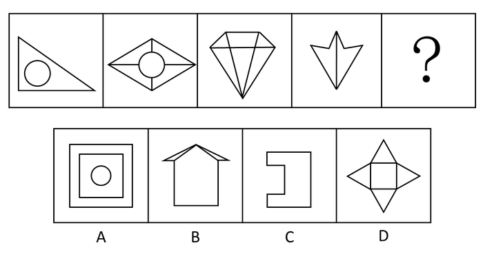
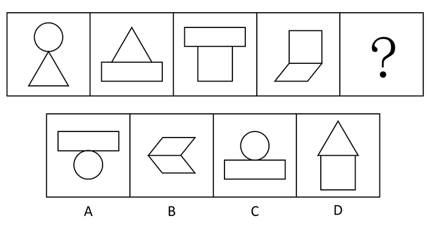
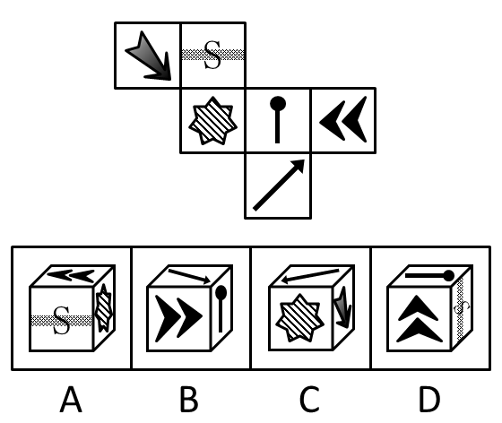
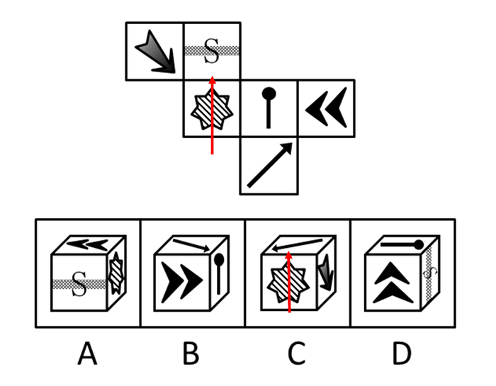
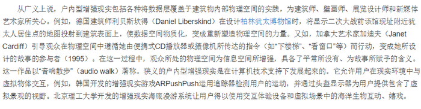
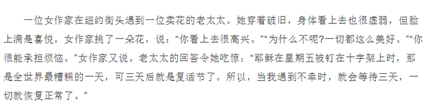
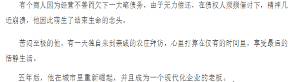

# 2016年重庆市公务员录用考试《行测》题（下半年）

> 判断推理 · 30 题 · 重庆 2016

## 第 1 题　qid 2015314 · 图形推理

把下面的六个图形分为两类，使每一类图形都有各自的共同特征或规律，分类正确的一项是：

- **A**. ①③⑤，②④⑥
- **B**. ①④⑤，②③⑥
- **C**. ①②⑥，③④⑤　✅
- **D**. ①②③，④⑤⑥

**答案**：C

**官方解析**

图形组成不同，属性无规律，考虑数量类规律。每个图形均由明显的封闭空间构成，优先数面的数量。发现图①②⑥都是5个面，③④⑤都是4个面。
故正确答案为C。

---

## 第 2 题　qid 2024138 · 图形推理

把下面的六个图形分为两类，使每一类图形都有各自的共同特征或规律，分类正确的一项是：

- **A**. ①④⑤ ，②③⑥
- **B**. ①③④ ，②⑤⑥
- **C**. ①③⑤ ，②④⑥
- **D**. ①②④ ，③⑤⑥　✅

**答案**：D

**官方解析**

元素组成凌乱，考虑属性规律。出现明显的中心对称提示图形，比如图①中的“Z”，图④中的“S”。观察发现，图①②④均为中心对称图形，图③⑤⑥均为轴对称图形。
故正确答案为D。

---

## 第 3 题　qid 2024142 · 图形推理

从所给四个选项中，选择最合适的一个填入问号处，使之呈现一定的规律性：

- **A**. A
- **B**. B　✅
- **C**. C
- **D**. D

**答案**：B

**官方解析**

解法一：元素组成不同，无明显属性规律，考虑数量规律。观察发现，图形出现多边形，考虑数线，线数量依次为：4、9、8、7，无规律，但是外轮廓的线条数依次为：3、4、5、6，呈递增规律，所以“？”处图形外轮廓的线条数应该为7。四个选项的外轮廓线条数分别为4、7、8、8，只有B选项符合规律。
故正确答案为B。
解法二：元素组成不同，无明显属性规律，考虑数量规律。观察发现，图形出现多边形，考虑数线，线数量依次为：4、9、8、7，无规律。同时发现，图形多次出现线条交叉的情况，考虑数点，点数量依次为：3、8、7、6，因此发现题干每幅图的线数量与点数量的差都是1。四个选项线数量与点数量的差分别为：1、2、0、4，只有A选项符合规律。
故正确答案为A。
备注：本题不严谨，但是外轮廓的线条数3、4、5、6，呈等差数列的规律，不太可能是巧合，且这个规律更加直观明确，应该是出题人精心设计过的，所以我们粉笔更倾向通过外框边数选到B项。

---

## 第 4 题　qid 2024148 · 图形推理

从所给四个选项，选择最合适的一个填入问号处，使之呈现一定的规律性：

- **A**. A
- **B**. B　✅
- **C**. C
- **D**. D

**答案**：B

**官方解析**

题干中每个图形均由两个样式不同的封闭面组成，分为上下两个部分。前一幅图形中的下部图形出现在下一幅图形中的上部。依此规律，问号处的图形上半部分应该为平行四边形，符合此规律的只有B选项。
故正确答案为B。

---

## 第 5 题　qid 2015354 · 图形推理

下图上边给定的是纸盒的外表面，下列哪一项能由它折叠而成？

- **A**. A
- **B**. B
- **C**. C
- **D**. D　✅

**答案**：D

**官方解析**

观察选项：

A项：本选项中阴影七角星的面与双箭头的面是相对面，不能在选项中同时出现，相对位置关系不匹配，排除； 

B项：本选项中火柴棍儿的头指向了箭头，而原图火柴棍儿的头指向S面，相邻位置关系不匹配，排除；

C项：由下至上将阴影七角星的箭头画出来（如下图），本选项中箭头指着箭头面，而在原图中箭头指着S面，相邻位置关系不匹配，排除；

D项：不存在错误，为正确选项。

故正确答案为D。

---

## 第 6 题　qid 2015362 · 定义判断

虚假记忆综合症是指一个人的认同和人际关系以一种创伤经历的记忆为中心，这种记忆在客观上是虚假的，但病人却对此深信不疑，它在病人内心是非常逼真的，几乎就是一种“客观现实”。
根据上述定义，下列属于虚假记忆综合症的是：

- **A**. 甲在被蛇咬过后，看见所有像蛇一样的东西，会感到恐惧
- **B**. 乙参加婚庆不由自主回忆起自己结婚时的情境并感到幸福
- **C**. 丙看到路边可怜的乞丐会勾起痛苦的回忆而产生怜悯之心
- **D**. 丁通过反复洗手来排除内心强烈的肮脏感获得心灵的平静　✅

**答案**：D

**官方解析**

第一步：找到关键词。
关键词为“以创伤经历的记忆为中心”、“记忆在客观上是虚假的”、“病人深信不疑”。
第二步：逐一分析选项。
A项：甲被蛇咬，是一种真实客观存在的创伤的经历，不符合定义关键词“记忆在客观上是虚假的”，排除；
B项：乙参加别人的婚庆想到自己结婚时的情景，乙曾经的婚礼是真实客观存在的，并且不是一种创伤的记忆，是美好的东西，不符合关键词“以创伤经历的记忆为中心”，不是虚假记忆综合症，不符合定义，排除；
C项：丙因为乞丐勾起痛苦的回忆，痛苦的回忆有可能是发生过的，并且选项中是对乞丐产生怜悯，没有体现这种记忆是非常逼真的，不符合定义，排除；
D项：丁通过反复洗手来排除内心强烈的肮脏感说明之前是发生过不好的事情，存在回忆，并且丁内心有强烈的肮脏感说明他内心的感觉非常逼真，保留。
比较A、B、C、D四项，A、B、C三项是明确不符合定义要求的，而D项可能符合，所以通过比较选D项更合适。
故正确答案为D。

---

## 第 7 题　qid 2015344 · 定义判断

社会协同治理机制是指政府出于治理需要，通过发挥其主导作用，构建制度化的沟通渠道和参与平台，在始终保护并尊重社会的主体地位以及社会自身的运作机制和规律下，加强对社会的支持培育，并与社会一起，发挥社会在自主治理、参与服务、协同管理等方面的作用，形成政府主导、社会协同、共建共享的社会治理新格局。
根据上述定义，下列属于社会协同治理的是：

- **A**. 由街道协调区工商局、城管大队等不定期开展联合执法，共同整治辖区内的经营秩序
- **B**. 市政府整合社会资源，在社区配备街道干部、民警、社工等人员，设立服务台，服务社区居民　✅
- **C**. 由县教育局、民政局、公安局等共同在行政服务大厅为企业和个人提供一站式行政审批办证服务
- **D**. 由省工商局、高级人民法院、中国人民银行某省分行共同签署协议，对失信企业实施信用联合监管

**答案**：B

**官方解析**

第一步：找到定义关键词。
关键词为：“政府”、“构建制度化的沟通渠道和参与平台”、“发挥社会自主治理、参与服务、协同管理的作用”。
第二步：逐一分析选项。
A项：工商局、城管大队联合执法，并没有出现社会参与，没有“发挥社会自主治理、参与服务、协同管理的作用”，不符合定义，排除；
B项：既有政府，又有社会参与，还设立了服务平台，满足“构建制度化的沟通渠道和参与平台”、“发挥社会自主治理、参与服务、协同管理的作用”，符合定义，当选；
C项：教育局、民政局、公安局，不涉及到社会参与，没有“发挥社会自主治理、参与服务、协同管理的作用”，不符合定义，排除；
D项：工商局、法院、银行联合监管，不涉及到“发挥社会自主治理、参与服务、协同管理的作用”，不符合定义，排除。
故正确答案为B。

---

## 第 8 题　qid 2015328 · 定义判断

行政比例原则是指行政主体实施行政行为应兼顾行政目标的实现和相对人权益的保护，如果初始行政目标可能对相对人权益造成某种不利影响，应使这种不利影响限制在尽可能小的范围和限度内，保持二者处于适度的比例。
根据上述定义，下列选项符合行政比例原则的是：

- **A**. 
王某因在商业区摆地摊，被城市管理部门以无证经营为由罚款5万元

- **B**. 
谭某在批准建设的三层楼房上加盖二层，被责令拆除加盖的二层楼房
　✅
- **C**. 
马某醉酒驾车，酒精含量为，被处3个月拘役、缓刑一年

- **D**. 
张某和李某互殴，张某将李某打成轻微伤，被处罚款500元并拘留15天

**答案**：B

**官方解析**

第一步：找到关键词。
“行政主体”、“行政行为”、“兼顾行政目标的实现和相对人权益的保护”。
第二步：逐一分析选项。
A项：城市管理部门以无证经营为由对王某罚款5万元属于正当行政行为，没有体现出对王某权益的保护，不符合定义，排除；
B项：谭某在批准建设的三层楼房上加盖二层属于违法行为，但只是被责令拆除违法加盖的楼层而未涉及其他有损谭某利益的处罚，最大限度地保护了行政相对人的权益，符合行政比例原则，当选；
C项：马某醉驾被判拘役、缓刑，属于刑法范畴不属于行政法范畴，无法体现行政比例原则，排除；
D项：张某和李某互殴，被处罚500元并拘留15天属于正当行政行为，没有体现出对二人的权益保护，不符合定义，排除。
故正确答案为B。

---

## 第 9 题　qid 2015334 · 定义判断

投射测验是指采用某种方法绕过受测者的心理防御，在他们不防备的情况下探测其真实想法。在实际测验中，测试者往往会给受测者一些模糊的刺激，观察他们对这些模糊刺激做出的反应，进而得出测试结论。
根据上述定义，下列属于投射测验的是：

- **A**. 为了选拔合唱队员，音乐课上老师让每位同学唱一首歌
- **B**. 饭店老板临时外出，让顾客自行将钱放在柜台的盒子里
- **C**. 在考生面试进场前，考官故意将一些散乱的书堆在考场入口处　✅
- **D**. 老张想考察几个年轻人，下班离开前故意将钱包落在办公桌上

**答案**：C

**官方解析**

第一步：找到关键词。
“绕过受测者的心理防御”、“不防备的情况下”、“模糊刺激”。
第二步：逐一分析选项。
A项：为了选拔合唱队员，老师让每位同学唱一首歌是目的性很明确的行为，不符合定义关键词“绕过受测者的心理防御”、“不防备的情况下”、“模糊刺激”，排除；
B项：饭店老板外出时，让顾客自行将钱放在柜台的盒子里，即明确告知了顾客应该怎么做，不符合定义关键词“绕过受测者的心理防御”、“不防备的情况下”，排除；
C项：在考生面试进场前，考官故意将一些散乱的书堆在考场入口处，考生在此情况下更多是在准备考试，对于散乱的书堆是没有心理防备的，符合定义关键词“绕过受测者的心理防御”、“不防备的情况下”，同时对于考生来说是不容易注意到书堆的，属于“模糊刺激”，符合定义，保留；
D项：老张想考察几个年轻人，下班前故意将钱包落在办公桌上，符合“绕过受测者的心理防御”、“不防备的情况下”，但是落在桌上的钱包是比较容易被看见的，不属于“模糊刺激”。
比较C和D两项，C项书堆的刺激相较钱包的刺激更模糊，更不容易被察觉，因此C项比D项更好。
故正确答案为C。

---

## 第 10 题　qid 2024152 · 定义判断

纵向整合是指整个产业链上下游之间进行的整合，其主要目的是控制某种资源、保障供应，如收购上游原料供应商或拥有某种渠道，扩大销售等。横向整合是指生产和销售相同或相似产品、经营相似业务、提供相同业务的企业间的合并，其主要目的是把一些规模小的企业联合起来，组成企业集团，实现规模效益。
根据上述定义，下列属于横向整合的是：

- **A**. 
老张为保证其酒店食材供应质量，建设了一个蔬菜和渔场养殖基地

- **B**. 
因经济不景气、楼市疲软，某房地产商开始进军电子商务领域

- **C**. 
某公司为拓展业务，与某高校联合，走产学研结合的路子

- **D**. 
某著名奶制品生产商并购了一家乳品公司的股份
　✅

**答案**：D

**官方解析**

第一步：提取定义关键词。
纵向整合强调“整个产业链上下游之间整合”，从而达到“控制某种资源、保障供应”的目的；
横向整合强调“相同业务的企业间的合并”，从而达到“组成企业集团，实现规模效益”的目的。
第二步：逐一分析选项。
A项：老张建设蔬菜基地和渔场养殖基地，属于在其涉及酒店服务产业的上下游之间进行整合，从而实现“控制某种资源、保障供应”的目的，属于纵向整合，排除；
B项：从房地产转而进军电子商务，不是企业间的合并，而是企业自身的转型，不属于横向整合，排除；
C项：高校不属于企业，不符合定义主体，排除；
D项：奶制品生产商并购乳品公司，属于相同业务的企业间的合并，符合定义，当选。
故正确答案为D。

---

## 第 11 题　qid 2024154 · 定义判断

用典是指引用古籍中的故事或词句的一种修辞手法，该修辞可以丰富而含蓄地表达有关的内容和思想，也称“用事”。用典可分为明典、暗典、翻典三种。明典，令人一望即知其所用之典故；暗典是指字面上看不出用典之痕迹，须详加玩味，方能体会；翻典，即反用典故原意，使文章产生意外之效果。
根据上述定义，下列选项不属于翻典手法的是：

- **A**. 周公吐哺，天下归心　✅
- **B**. 随意春芳歇，王孙自可留
- **C**. 东风不与周郎便，铜雀春深锁二乔
- **D**. 可堪回首，佛狸祠下，一片神鸦社鼓

**答案**：A

**官方解析**

第一步：找出定义关键词。
“翻典，即反用典故原意，使文章产生意外之效果”。
第二步：逐一分析选项。
A项：“周公吐哺，天下归心”是礼贤下士之意，令人一望即知其所用之典故，属于明典，不存在反用典故，不符合定义，当选。
B项：“随意春芳歇，王孙自可留”反用了《楚辞 • 招隐士》中的末句：“王孙兮归来，山中兮不可以久留”，原意为招王孙出山入世以求仕途通达。王维反用其意，“王孙”自可不必离去，属于反用典故原意，属于翻典，排除。
C项：“东风不与周郎便，铜雀春深锁二乔”意为倘若当年东风不帮助周瑜的话，那么铜雀台就会深深地锁住东吴二乔了。此句属于反用赤壁之战中的历史典故，周瑜趁着东风进攻，最终孙刘联军以火攻大破曹军，属于反用“借东风”，反用典故原意，属于翻典，排除。
D项：“可堪回首，佛狸祠下，一片神鸦社鼓”中，“佛狸”为北魏太武帝，其建立的行宫为佛狸祠，整句话意思为到了南宋时期，当地老百姓只把佛狸祠当作供奉神祇的地方，而不知道它过去曾是一个皇帝的行宫，辛弃疾看到这个情景，不忍回首当年的烽火扬州路。此处用“佛狸”代指金主完颜亮，完颜亮曾驻扎在佛狸祠所在的瓜步山上，严督金兵抢渡长江，当年沦陷区的人民与异族统治者进行了不屈不挠的斗争，烽烟四起，但如今的中原早已风平浪静，沦陷区的人民已经安于异族的统治，竟至于对异族君主顶礼膜拜。此句属于反用历史典故，以此正告南宋统治者，收复失土，刻不容缓，排除。
本题为选非题，故正确答案为A。

---

## 第 12 题　qid 2015324 · 定义判断

职业基因是指每个人的职业方向都与自己的某种气质相匹配，这种气质是在人际交往中潜移默化而形成的一种带有强烈个人色彩的心理修养。
根据上述定义，下列现象中符合职业基因理论的是：

- **A**. 小明的父母都是教师，最终小明也选择了教师职业
- **B**. 小红从小爱看动画片，长大后成为一名动漫设计师
- **C**. 性情开朗、活泼好动的小丁应聘为某商城销售人员　✅
- **D**. 快言快语的小李毕业当了两年医生后变得慢条斯理

**答案**：C

**官方解析**

第一步，找到定义关键词。
关键词为：职业方向与在人际交往中形成的带有强烈个人色彩的气质相匹配。
第二步，逐一分析选项。
A项：小明选择当老师是因为父母是老师，而不是因为老师与自己的气质匹配，且小明的气质如何没有说明，不符合职业基因理论，排除；
B项：小红选择成为一名动漫设计师是因为兴趣爱好喜欢动画片，而不是自己的气质，且小红的气质如何没有说明，不符合职业基因理论，排除；
C项：小丁成为销售人员是因为其性情开朗、活泼好动，属于其强烈个人色彩的气质，符合职业基因理论，当选；
D项：小李当医生后从快言快语变成慢条斯理，属于职业改变性格，医生这个职业与其之前气质不符，不符合职业基因理论，排除。
故正确答案为C。

---

## 第 13 题　qid 2015338 · 定义判断

增强现实技术是一种将真实世界信息和虚拟世界信息“无缝”集成的新技术。是把原本在现实世界的一定时间空间范围很难体验到的实体信息（视觉、声音、味道、触觉等），通过电脑等科学技术，模拟仿真后再叠加，将虚拟的信息应用到真实世界，被人类感官所感知，从而达到超越现实的感官体验。
根据上述定义，下列选项不属于增强现实技术的是：

- **A**. 某海底漫游系统通过交互体验设备让用户与虚拟场景中的海洋生物互动、嬉戏
- **B**. 某游戏运用追踪器侦测用户运动，并通过头盔显示器为用户提供包含虚拟景观的视野
- **C**. 某科学家研制的智能隐形眼镜通过无线技术接收手机数据，并将手机上的图像投射到眼睛上　✅
- **D**. 某艺术家引导用户在物理空间中遵循播放器的指令行动进而成为其所设计情境的参与者

**答案**：C

**官方解析**

第一步：找到定义关键词。

关键词为：“真实世界信息和虚拟世界信息‘无缝’集成”、“电脑等科学技术”、“被人类感官所感知”、“达到超越现实的感官体验”。

第二步：逐一分析选项。

A项：交互设备是一种“电脑类的科学技术”，与海洋动物互动属于“虚拟信息被人类感官感知”，“让虚拟和现实同时存在”，符合定义，排除；

B项：追踪器和头盔是一种“电脑类的科学技术”，为用户提供包含虚拟景观的视野属于“虚拟信息被人类感官感知”，“让虚拟和现实同时存在”，符合定义，排除；

C项：通过无线技术接收的是数据，但最终投射到眼睛上的是手机图像，二者没有必然关系，并没有形成虚拟世界，不属于“让虚拟和现实同时存在”，不符合定义，当选；

D项：播放器的指令是一种“电脑类的科学技术”，观众所处的物理空间为信息空间所增强，遵循了虚拟的指令参与到虚拟场景中，属于“虚拟信息被人类感官感知”，“让虚拟和现实同时存在”，符合定义，排除。

本题为选非题，故正确答案为C。

注：有同学可能不太理解选项的含义而误选了D。经查证，在百科词条里面，A、B、D三项都是增强现实技术词条中的例子，均符合这个定义。

---

## 第 14 题　qid 2024166 · 定义判断

农业干旱是指在作物生育期内，由于土壤水分不足而造成作物体内水分亏缺，影响作物正常生长发育。水文干旱是指由于降水的长期短缺而造成某段时间内地表水或地下水收支不平衡，出现水分短缺，使江河流量、湖泊水位、水库蓄水等减少的现象。社会经济干旱是指由自然系统与人类社会经济系统中水资源供需不平衡造成的异常水分短缺现象，如果需大于供，就会发生社会经济干旱。
根据上述定义，下列选项属于社会经济干旱范畴的是：

- **A**. 一月未雨，某著名河流流域出现大规模的河床裸露现象
- **B**. 地铁建设施工队不慎挖破水管，导致几个小区停水一天
- **C**. 常年少雨致使某工业区推行按时段浮动征收水费的办法　✅
- **D**. 半月不曾下雨，某地水稻出现穗长缩短、穗粒减少现象

**答案**：C

**官方解析**

第一步，提取定义关键词句。
题干中出现三个定义，均为原因结果类句式。
农业干旱的原因是“土壤水分不足”，结果是“作物体内水分亏缺，影响作物正常生长发育”；
水文干旱的原因是“降水的长期短缺”，结果是“水分短缺，使江河流量、湖泊水位、水库蓄水等减少的现象”；
社会经济干旱的原因是“自然系统与人类社会经济系统供需不平衡”，结果是“异常水分短缺现象”。
第二步：逐一分析选项。
A项：一月未下雨，原因为“降水的长期短缺”，导致河流流域出现大规模的河床裸露现象，符合“水分短缺，使江河流量、湖泊水位、水库蓄水等减少的现象”，属于水文干旱，排除；
B项：地铁施工建设不属于三个定义中的任何一个原因，小区停水不是干旱，不符合定义，排除；
C项：自然系统为常年少雨，人类社会经济系统是工业区，是由于“自然系统与人类社会经济系统供需不平衡”而导致了异常水分短缺现象，因此进行了按时段浮动征收水费，属于社会经济干旱，当选；
D项：半月不曾下雨导致“土壤水分不足”，水稻穗长缩短、穗粒减少现象符合“作物体内水分亏缺，影响作物正常生长发育”，属于农业干旱，排除。
故正确答案为C。

---

## 第 15 题　qid 2015358 · 定义判断

卡瑞尔公式是指唯有强迫自己面对最坏的情况，在精神上先接受它以后，才会使我们处在一个可以集中精力解决问题的地位上。
根据上述定义，下列选项涉及卡瑞尔公式的是：

- **A**. 一个商人因经营不善而欠下一大笔债务，心灰意冷地来到亲戚的农庄，想在此度过余生，却在瓜农的鼓励下，最终重新崛起　✅
- **B**. A君炒股被套十分苦闷，后来想通了，学习当鸵鸟，不看股票，专心工作。几年后，他的事业取得成功
- **C**. 一个卖花老太太衣着破旧却满是喜悦，她说：“耶稣星期五被钉在十字架上死去，可三天后不就是复活节了吗？所以我总是心怀喜悦。”
- **D**. 阿Q与小D打架吃亏，心想：“我总算被儿子打了，现在这世界真不像样，儿子居然打起老子来了。”于是他心满意足，俨然胜利似的

**答案**：A

**官方解析**

第一步：找到关键词。

关键词为“面对最坏的情况”、“精神上接受”、“集中精力解决问题”。

第二步：逐一分析选项。

A项：商人欠下债务心灰意冷，想恬静的过完余生，符合“面对最坏的情况”，在瓜农的帮助下重新崛起，符合“集中精力解决问题”，是卡瑞尔公式，符合定义，当选；

B项：股票被套，鸵鸟心态，不愿意面对炒股的失败，是没有在精神上接受这样的失败，不符合关键词“精神上接受”，因此不是卡瑞尔公式，不符合定义，排除；

C项：老太太衣着破旧，虽然如此，但是她并不认为这是坏事，很积极乐观，心怀喜悦，符合关键词“精神上接受”，但是并没有涉及到解决问题，不符合“集中精力解决问题”，不符合定义，排除；

D项：阿Q是自己臆想小D是自己的儿子，通过这样来麻痹自己不去面对被打的事实，没有从精神上接受被打的事实，不符合关键词“精神上接受”，因此不是卡瑞尔公式，不符合定义，排除。

注意：C项完整的例子应该如下，老太太认为只要等待三天，一切就会恢复正常，但是这其中并没有体现出她主动集中精力解决问题，所以错误。

A项是该定义中的例子，但出现了积极解决问题的结果，更符合定义。

故正确答案为A。

---

## 第 16 题　qid 2015388 · 类比推理

健身：器械：形体

- **A**. 阅兵：坦克：广场
- **B**. 教育：书本：知识　✅
- **C**. 勘探：矿产：石油
- **D**. 导航：汽车：卫星

**答案**：B

**官方解析**

第一步：判断题干词语间逻辑关系。
器械是健身过程中使用的一种工具，健身的目的是塑造形体。
第二步：判断选项词语间逻辑关系。
A项：坦克是阅兵中使用的一种工具，但广场是阅兵对应的场所，与题干逻辑关系不符，排除；
B项：书本是教育过程中使用的一种工具，教育的目的是传授知识，与题干逻辑关系相符，当选；
C项：矿产是勘探的客体，不是勘探使用的一种工具，与题干逻辑关系不符，排除；
D项：汽车不是导航的一种工具，导航的工具应该是指南针、导航仪等，与题干逻辑关系不符，排除；
故正确答案为B。

---

## 第 17 题　qid 2015420 · 类比推理

灯塔 之于 （    ） 相当于 （    ） 之于 腐败

- **A**. 暗礁：金钱
- **B**. 船只：贪官
- **C**. 导航：预防
- **D**. 危险：监督　✅

**答案**：D

**官方解析**

逐一代入验证选项。
A项：灯塔可以指示暗礁，但金钱和腐败没有直接的逻辑关系，前后逻辑关系不一致，排除；
B项：有灯塔不代表有船只，有贪官说明一定存在腐败，前后逻辑关系不一致，排除；
C项：灯塔的一个作用是导航，但预防的作用不是腐败，前后逻辑关系不一致，排除；
D项：灯塔有助于避免危险，监督有助于避免腐败，前后逻辑关系一致，当选。
故正确答案为D。

---

## 第 18 题　qid 2015368 · 类比推理

食言而肥：有言必诺

- **A**. 有恩必报：忠君爱国
- **B**. 坐井观天：勇往直前
- **C**. 削足适履：因地制宜　✅
- **D**. 拾人牙慧：人云亦云

**答案**：C

**官方解析**

第一步：判断题干词语间逻辑关系。
食言而肥是指不按照说的去做，不遵守诺言。有言必诺是指按照承诺的去做事，两者是反义词的关系。
第二步：判断选项词语间逻辑关系。
A项：有恩必报是指收到别人的恩情一定会回报别人；忠君爱国是指忠诚于君主，爱国家，两者不是反义词，与题干逻辑关系不符，排除；
B项：坐井观天比喻眼界小，见识少；勇往直前是指勇敢地向前走，两者不是反义词，与题干逻辑关系不符，排除；
C项：削足适履比喻不合理地迁就现成条件，也可以比喻不顾具体条件，生搬硬套；因地制宜是根据各地的具体情况，制定适宜的办法。两者是反义词，与题干逻辑关系相符，正确；
D项：拾人牙慧比喻拾取别人的一言半语当作自己的话，也比喻窃取别人的语言和文字；人云亦云是人家怎么说，自己也跟着怎么说，指没有主见，只会随声附和。两者不是反义词，与题干逻辑关系不符，排除。
故正确答案为C。

---

## 第 19 题　qid 2024156 · 类比推理

无边落木：不尽长江

- **A**. 千里冰封：万里雪飘
- **B**. 映阶碧草：隔叶黄鹂　✅
- **C**. 晴川历历：芳草萋萋
- **D**. 山重水复：柳暗花明

**答案**：B

**官方解析**

第一步：判断题干词语间的逻辑关系。
无边修饰落木，不尽修饰长江。无边作为定语修饰名词落木，不尽作为定语修饰长江，定语在前，修饰的名词在后。前后两个词语出自同一诗句“无边落木萧萧下，不尽长江滚滚来”。
第二步：判断选项词语间的逻辑关系。
选项前后的两个词句均来自同一诗句。
A项：千里修饰冰封，万里修饰雪飘，与题干逻辑关系类似，保留；
B项：映阶修饰碧草，隔叶修饰黄鹂，与题干逻辑关系一致，保留；
C项：历历意为清楚可数，萋萋意为草木长得茂盛，历历修饰晴川，萋萋修饰芳草，定语在后，修饰的名词在前，与题干逻辑关系不一致，排除；
D项：重修饰山，复修饰水，暗修饰柳，明修饰花，与题干逻辑关系不一致，排除。
对比选项A和B，发现A选项中的名词对应没有B选项对应整齐，A选项中为雪飘不是飘雪，排除A选项。
故正确答案为B。

---

## 第 20 题　qid 2015374 · 类比推理

小麦：麦穗：麦粒

- **A**. 车子：车轮：轮胎　✅
- **B**. 棋类：围棋：棋子
- **C**. 学校：教室：学生
- **D**. 房子：房间：卧室

**答案**：A

**官方解析**

第一步：判断题干词语间逻辑关系。
麦粒是麦穗的一部分，二者是组成关系，麦穗是小麦的一部分，二者是组成关系。
第二步：判断选项词语间逻辑关系。
A项：轮胎是车轮的一部分，是组成关系，车轮是车子的一部分，是组成关系，与题干逻辑关系相符；
B项：棋子是围棋的一部分，是组成关系，但是围棋是一种棋类，是种属关系，与题干逻辑关系不符，排除；
C项：学生在教室学习，教室是场所，所以学生并不是教室的组成部分，与题干逻辑关系不符，排除；
D项：卧室是房间的一种，是种属关系，与题干逻辑关系不符，排除。
故正确答案为A。

---

## 第 21 题　qid 2015360 · 逻辑判断

认识到物种生存对土地与气候的要求，可以为调节人类的粮食生产、最大程度地保护物种提供依据。科学家通过调查得出结论：当雨林被砍伐变成农田后，那些需要湿润气候的鸟类趋于死亡，而那些适应干旱气候的鸟类则取而代之生存下来。
以下哪项如果为真，最能支持科学家的上述结论？

- **A**. 适应于干旱气候的鸟类更能适应未来气候的变化和未来土地使用的变化
- **B**. 农田的自然条件与干旱气候环境下鸟类栖息地的自然条件具有相似性　✅
- **C**. 在干旱地区保留原生动物栖息地很有必要，可以缓冲气候变化的影响
- **D**. 把动物栖息地转换为农田时，必须考虑该地区现在和未来的气候情况

**答案**：B

**官方解析**

第一步，寻找论点论据。
论点：当雨林被砍伐变成农田后，那些需要湿润气候的鸟类趋于死亡，而那些适应干旱气候的鸟类则取而代之生存下来。
论据：无明显论据。
对于无明显论据的题目，加强的方式多为解释或者举例。论点本身有两个关键信息：一是土地利用方式的变化（雨林变农田），二是气候变化（干旱和湿润），预计解释的可能性更大。
第二步，逐一分析选项。
A项，强调干旱气候的鸟类更能适应未来的气候和土地变化，但未来的气候与土地是否是雨林变成农田的情况不确定，为不确定选项，排除；
B项，强调农田的自然条件与干旱气候环境下的自然条件具有相似性，有利于干旱气候鸟类的生存，解释论点，加强作用，当选；
C项，强调的是如何缓冲气候变化对原生动物生存的影响，说的是一种做法，与论点强调的雨林变农田后，湿润气候和干旱气候鸟类的生存状况是无关的。一个是做法，一个是现状。排除；
D项，与C项一致，都是谈论转换为农田后的一个做法，与论点无关，排除。
故正确答案为B。

---

## 第 22 题　qid 2015370 · 逻辑判断

人类目前使用的氦气主要来自油气钻探过程中产生的副产品，总量有限，难以满足需求。首次“有意地”发现大量氦气，是最近研究人员与开采企业合作的成果。他们采用新方法在非洲东部坦桑尼亚境内发现储量约为15亿立方米的氦气，总量足够120万台医用核磁仪共振使用。这一地点处于东非大裂谷范围内，剧烈火山活动产生的热量使古老岩石中蕴含的氦释放到浅层油田中。此次开采可能成为确保未来社会氦气需求的转折点。
上述结论的成立，需要补充以下哪项作为前提？

- **A**. 可以预见的未来不会出现剧烈的火山运动
- **B**. 东非大裂谷的地质地貌在长期内不再发生变化
- **C**. 此次所用探测方法有助于在更多地方发现和开采更多氦气　✅
- **D**. 未来人类不再被动等待来自油气钻探过程中产生的副产品

**答案**：C

**官方解析**

第一步：寻找论点论据。
论点：此次开采可能成为确保未来社会氦气需求的转折点。
论据：以前的氦气是油气开采的副产品，这是首次“有意地”用新方法在非洲发现大量氦气。
第二步：逐一分析选项。
A项，出不出现火山活动与题干所强调的新方法能否成为确保未来社会氦气需求的转折点无关。题干说剧烈火山活动会产生氦气，若如选项所说未来不再有剧烈运动，氦气未来可能就没有了。但这并不会抹杀“有意地”用新方法开采所产生的意义，故该项不是前提项，排除；
B项，与A项相似，说地貌不再发生变化，意味着目前的大量氦气会存在，但是并不能对这次开采是否具有“转折点”的意义构成支持或反对。而且就算此地的地貌发生变化，现有的氦气也依然可以开采。故该项不是前提项，排除；
C项，此次所用的方法有助发现和开采更多氦气，强调了首次有意地用新方法开采的后续可行性，将论据中的方法推广到更广范围，从而保证未来社会氦气的需求。试想，如果此方法不能推广，显然也不会成为氦气需求转折点。属于前提项，当选；
D项，与题干论点无关，排除。
故正确答案为C。

---

## 第 23 题　qid 2015390 · 逻辑判断

地球上的生物之所以能够在地球表面生存，最大的防护在于地球磁场将大量的带电粒子偏转，大量有害宇宙射线被隔绝在大气层之外。近日，科学家发现南大西洋磁场开始翻转，地球磁场正被削弱。他们经过研究认为，如果地球磁场翻转，在没有磁场保护的情况下，所有生物将会灭绝。
以下哪项如果为真，最能支持上述结论？

- **A**. 
类地行星火星失去磁场后，其大气被太阳风完全摧毁，生命荡然无存

- **B**. 
目前南大西洋异常区范围在增大，轨道卫星掠过这里时经常出现问题

- **C**. 
磁场翻转时，地球生命将会暴露在无防护的地表，造成皮肤癌大爆发
　✅
- **D**. 
近200年来，随着南大西洋磁场开始翻转，地球磁场已经削弱了

**答案**：C

**官方解析**

第一步，寻找论点论据。
论点：如果地球磁场翻转，在没有磁场保护的情况下，所有生物将会灭绝。
论据：地球上的生物之所以在地表生存，最大的防护在于地球磁场将大量的带电粒子偏转，被隔在大气层之外。现发现，南大西洋磁场开始翻转，地球磁场正被削弱。
第二步，逐一分析选项。
A项，说的是类地行星火星在失去磁场后生命荡然无存，是一个类比加强项，看是否有更好的，先保留；
B项，没有提到磁场是否翻转，而且说到了经常出现问题，经常出问题不代表生物就会灭绝，无关，排除；
C项，强调的是磁场翻转后，地球生命失去防护，皮肤癌大爆发。通过补充论据，直接对论点进行了举例加强。而且力度一定强于A项的类比，故C当选；
D项，说的是一个地球磁场削弱的事实，但是否会造成生物灭绝并不知道，排除。
故正确答案为C。

---

## 第 24 题　qid 2024162 · 逻辑判断

研究人员选取16名11月大的儿童开展实验研究，其中8个来自英语单语的家庭，另外8个来自讲西班牙语、英语的双语家庭。每个儿童都会听一段长约18分钟的音频，其中既有英语发音，也有西班牙语发音。研究者借助脑磁图描技术发现，在大脑的执行区域中，双语家庭长大的儿童对语言声音的刺激的反应要比单语家庭的儿童更为强烈。这说明，双语环境很早就已开始对大脑活跃性产生影响。
以下哪项如果为真，最能支持上述结论？

- **A**. 相比而言，西班牙语对大脑的声音刺激比英语更为明显
- **B**. 双语家庭长大的孩子无须父母刻意教就能熟练掌握双语　✅
- **C**. 双语家庭儿童在11个月大时对外语声音的感知较6个月大时明显强化
- **D**. 此前人类大脑研究显示，具备双语能力的成年人大脑执行功能更为活跃

**答案**：B

**官方解析**

第一步：找到论点论据。
论点：双语环境很早就已开始对大脑活跃性产生影响。
论据：双语家庭长大的儿童对语言声音的刺激的反应要比单语家庭的儿童更为强烈。
本题的论点和论据都是在说双语环境对大脑活跃性有影响，所以论点论据话题一致，考虑通过补充论据的方式加强。
第二步：逐一分析选项。
A项：题干是在双语与单语之间进行对比，而选项是在西班牙语与英语之间进行对比，话题不一致，为无关选项，排除；
B项：强调在双语环境下孩子无需刻意教就能熟练掌握双语，证明双语环境对孩子的影响还是很重要的，补充论据，可以加强，当选；
C项：强调的是双语家庭儿童在不同时期对外语声音感知的比较，增加了一个年龄因素，说明可能是年龄不同导致的对声音的感知能力不同，不能加强，排除；
D项：题干讨论的是语言环境对儿童的影响，选项讨论的是具备双语能力对成年人大脑执行功能的影响，话题不一致，为无关选项，排除。
故正确答案为B。

---

## 第 25 题　qid 2015396 · 逻辑判断

当小张、小李、小王和小贾在公园里打棒球时，田老师家的玻璃恰好被人打破了。田老师怀疑这与他们有关，于是分别找他们询问，四人的回答如下：
小张说：“您家的玻璃不是我们打破的，和我们压根无关。”
小王说：“小李和小贾中，至少有一个肯定是无辜的。”
小李说：“我只能告诉您，打破您家玻璃的人肯定在我们之中。”
小贾说：“田老师，您千万要相信我啊，真的不是我打破的。”
如果四个人中，有两个人说的是假话，两个人说的是真话，可以推出：

- **A**. 说真话的是小张和小王
- **B**. 说真话的是小贾和小张
- **C**. 说真话的是小贾和小李
- **D**. 说真话的是小李和小王　✅

**答案**：D

**官方解析**

第一步：真假推理题，找矛盾。
小张：四人中不存在打破玻璃者；
小王：不是小李或不是小贾；
小李：四人中存在打破玻璃；
小贾：不是小贾。
第二步：分析题干。
小张和小李两个人说的矛盾了，矛盾必有一真一假。条件中“两个人说假话，两个人说真话”，即共有两真两假，那么剩下的小王和小贾中也必有一真一假。这时候，我们可以用假设法，假设小贾说的是真话，即不是小贾打破的，那小王说的也就是真话了，因为或命题有一项为真即为真，这很明显不符合题意。所以小贾说的是假话，即玻璃是小贾打破的，也间接证明了小张说了假话。综上所述：小张说了假话；小王说了真话；小李说了真话；小贾说了假话。
故正确答案为D。

---

## 第 26 题　qid 2015414 · 逻辑判断

定期运动不仅能让孩子打下健康的基础，而且成年后可能收入更高。芬兰学者在一项始于1980年、持续30年的研究中发现，相比童年很少锻炼的人，在9岁、12岁、15岁时经常参加体育锻炼的人成年以后在为期10年的时间内平均收入提高至。即使考虑个人和家庭背景等因素，这个研究也成立。但是，研究结果也显示，这种关联只针对男性群体，在女性群体中没有观察到这种关联。

如果以下哪项为真，最能支持上述结论？

- **A**. 政府应为不同经济社会背景的儿童提供参与体育活动的平等机会
- **B**. 爱运动的大学男生毕业后在工资和就业机会方面具有优势　✅
- **C**. 之前许多研究表明，成年人的体育活动与收入成正比
- **D**. 世界各地许多体育冠军退役后生计没有着落

**答案**：B

**官方解析**

第一步：找出论点论据。
论点：定期运动不仅能使男孩子打下健康的基础，而且成年后可能收入更高。
论据：芬兰学者做的一项30年的研究调查。
第二步：逐一分析选项。
A项，题干讨论的是“运动”与“收入”之间的关系，选项说应提供运动的平等机会，很显然跑题了，无关项，排除；
B项，建立了“运动”与“工资”之间的联系，搭桥项，能加强，先保留；
C项，题干的主体是“未成年的男孩”成年后收入如何，选项的主体直接就是“成年人”怎么样，主体不一致，讨论不在一个范围，排除；
D项，首先这些体育冠军是否都是从小开始体育运动的，并不明确，即使很多同学联想到实际情况，的确大部分冠军都是从小运动训练的，那也是削弱了论点，不能加强，排除。
故正确答案为B。

---

## 第 27 题　qid 2015408 · 逻辑判断

某社交平台对一款网红APP营销产品以“给用户带来骚扰，破坏用户体验”的理由进行封杀。这引起了舆论关注和讨论。
以下各项如果为真，最能削弱“给用户带来骚扰，破坏用户体验”观点的是：

- **A**. 该平台曾以同样理由屏蔽过另一款APP，以打击自己的竞争对手
- **B**. 该款APP在用户中有口皆碑，推出后下载量迅速上升至第5位
- **C**. 在该款APP被封杀的同时，与该款APP相关的应用软件也被屏蔽
- **D**. “用户体验”是相当感性的感受，该社交平台缺乏界定感受的数据　✅

**答案**：D

**官方解析**

第一步：找出论点和论据。
论点：网红APP给用户带来骚扰，破坏用户体验。
论据：无。
本题只有论点，优先考虑削弱论点。
此题的背景是当年微信封杀某网红APP，以前在朋友圈我们会经常看到某网红APP课程学习的打卡链接，今天是学习的第几天了等等，这会让其他微信用户感到反感，所以基于这样的背景，我们就可以梳理出论点讨论受到骚扰的“用户”具体是谁？应该是纯微信用户，而不是某网红APP的用户，不然也不需要微信官方出手来封杀，即本题论点完整来说应该是：网红APP给“社交平台用户”带来骚扰，破坏“社交平台用户”的体验。
第二步：逐一分析选项。
A项：社交平台以同样理由屏蔽过其他APP，不确定该理由这次用在这个网红APP上是否属实，排除；
B项：网红APP在它自己的用户中有口皆碑，即网红APP用户的体验感好，但是本题论点讨论的用户，是社交平台用户的感受，不确定那些每天看到别人在朋友圈学习打卡的社交平台用户是否也觉得体验好，选项和论点讨论的用户群体并不一致，排除；
C项：与其他相关的应用是否被屏蔽无关，只想知道屏蔽这款APP的理由是否客观真实，无关选项，排除；
D项：社交平台缺乏界定感受的数据，即社交平台根本不知道用户的具体体验，那么说“该网红APP给用户带来骚扰，破坏用户体验”是没有证据支撑的，可能性削弱，当选。
注：本题的D项很多同学会觉得这不是课上常讲的不明确选项，不是说不选嘛，这里有个思维误区，不明确选项在真题中确实很少成为正确答案，但是一定要跟其他选项比较，如果其他3个选项错的更离谱，此时不明确选项，也可以作为可能性的削弱/加强，即做题一定要灵活，没有哪种选项一定对或一定不对，比较才是王道。
故正确答案为D。

---

## 第 28 题　qid 2015428 · 逻辑判断

在一项实验中，志愿者要记住屏幕上出现的一系列单词，但其间会被时而出现的数学题打断。研究者则周期性的询问志愿者是否走神，最终通过记忆单词的数量来为志愿者“大脑运行容量”打分。结果显示，那些在出现数学题时走神的人，记住的单词反而更多，证明他们拥有更大的“大脑运行容量”。研究者认为，那些时常分神、发愣的人实际上更聪明，因为他们能够记住大量信息并加以灵活运用。
以下哪项如果为真，无法削弱该实验结论？

- **A**. 在生活中，做任何事时大脑多半时间都在走神，通常未被察觉
- **B**. 数学题改为阅读理解题，走神志愿者记住的单词数量反而更少
- **C**. 大脑运行容量还和人类智商的其他指标有关，不仅是单词数量
- **D**. 只有任务不困难时，大脑运行容量大的人才会思考无关的事情　✅

**答案**：D

**官方解析**

第一步，寻找论点论据。

论点：那些时常分神、发愣的人实际上更聪明，因为他们能够记住大量信息并加以灵活运用。
论据：那些在出现数学题时走神的人，记住的单词反而更多，证明他们拥有更大的“大脑运行容量”。
第二步，逐一分析选项。
A项，强调走神是常事，而且未被察觉，说明周期性的询问志愿者是否走神，就不会客观，可能志愿者本身也并不知道自己有没有走神。质疑了实验方法，可以削弱，排除；
B项，数学题改阅读题后，记住的单词数量会减少，说明实验方法有问题，质疑实验方法，可以削弱，排除；
C项，指出大脑运行容量还与其他指标有关，不仅取决于单词数量，说明通过单词数量来判断大脑运行容量就不科学，可以削弱，排除；
D项，任务的难度会对大脑运行容量大的人产生影响，并不能质疑这个人自身脑容量大还是小，与论点讨论的无关，无法削弱，当选。

本题为选非题，故正确答案为D。

---

## 第 29 题　qid 2015426 · 逻辑判断

大脑边缘系统驱动情绪产生，该系统在青春期期间快速发育，而前额叶皮层神经网络发育则相对较晚，主要负责提供合理判断和冲动控制。现在已经确知，前额叶皮层要到20岁左右才能完全发育成熟，而如今青春期却在不断提前，二者不匹配的时间跨度正在延长。
由此可以推出：

- **A**. 人的某些行为与年龄的冲突是大脑存在的天然缺陷所致
- **B**. 形成青少年行为特点的原因在于人体调控功能的晚发育
- **C**. 人脑的独特结构使人类可以控制冲动行为的时间跨度正在延长
- **D**. 人脑控制功能与边缘系统的失衡是青少年产生冲动行为的关键　✅

**答案**：D

**官方解析**

第一步：看提问——由此可以推出，题干无逻辑关联词，故为日常推理题。
第二步：通读题干，逐一分析选项。
A项，发生冲突只是因为青春期的起点与大脑控制功能发育的起点不匹配，后者较晚，但这是人正常的发育过程，并非缺陷，无中生有，排除；
B项，只提到了大脑控制功能发育晚一方面的情况，其实是因为控制功能发育晚和大脑边缘系统发育早，两者的发育时间差造成的，排除；
C项，延长控制冲动行为时间跨度的并非人脑的独特结构，如果是这个原因，那么成年人也应该有这个特点，而不仅仅是青春期的特点了。根据原文描述，真正起作用的应该是青春期人脑不同功能间发育的不匹配和不平衡。排除；
D项，人脑控制功能（即前额叶皮层神经网络，提供合理判断和冲动控制）与边缘系统的失衡（即发育不匹配，控制情绪）是导致青少年产生冲动行为（即在青少年有情绪时不能做出合理判断，不能控制冲动）的关键，正好是原文的同义转换，当选。
故正确答案为D。

---

## 第 30 题　qid 2024168 · 类比推理

某单位决定派选2名女性和3名男性前往省城参加培训，经过各个程序选拔，最后确定了以下候选人：林某、杨某、童某等3名女性和陈某、何某、吴某、王某、李某等5名男性，同时还规定同一部门，同一地方至多只能选派一人参加培训，已知：林某和王某来自同一部门，吴某和陈某来自同一部门，王某和李某来自同一地方。
根据上述条件，如果林某入选，以下哪位必定会入选？

- **A**. 李某　✅
- **B**. 王某
- **C**. 童某
- **D**. 陈某

**答案**：A

**官方解析**

从题干确定性信息“林某入选”入手。
从林某入手，提取与林某有关的信息，林某和王某来自同一部门，来自同一部门至多只能选派一名参加，因此王某不能参加；又因为陈某（男）和吴某（男）来自同一个部门，因此他们两人中只能去一个；又因为在5个男的中要选派3人参加培训，因此在王某（男）不参加，陈某（男）和吴某（男）只能去一个的情况下，何某（男）和李某（男）必须要参加。
故正确答案为A。

---
