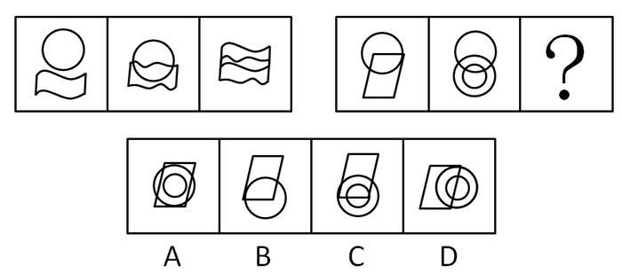
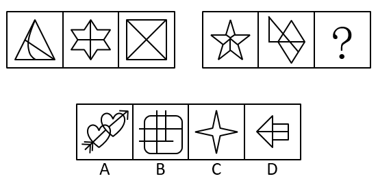
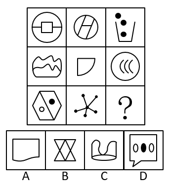

# 2016年重庆市选调优秀大学生到基层工作考试《行测》题

> 判断推理 · 30 题 · 选调 2016

## 第 1 题　qid 414233 · 图形推理

下列选项中，符合所给图形的变化规律的是：

- **A**. A
- **B**. B
- **C**. C　✅
- **D**. D

**答案**：C

**官方解析**

本题考查的是图形的元素。
第一个图形和第二个图形去同存异得到第三个图形，且位置关系为第一图在上，第二图在下，并叠加至中心处。
故正确答案为C。

---

## 第 2 题　qid 2262562 · 图形推理

根据图形规律，填入问号处最合适的一项是：

- **A**. A　✅
- **B**. B
- **C**. C
- **D**. D

**答案**：A

**官方解析**

元素组成不同，无明显属性规律，考虑数量规律。观察发现，题干中图形的“窟窿”比较多，考虑数面，第一组图形面的数量均为4，第二组前两个图形面的数量均为5，因此问号处应填一个面的数量为5的图形，只有A项符合。
故正确答案为A。

---

## 第 3 题　qid 2262563 · 图形推理

根据图形规律，填入问号处最合适的一项是：

- **A**. A
- **B**. B
- **C**. C
- **D**. D　✅

**答案**：D

**官方解析**

观察发现，题干图形封闭空间明显，考虑数面，题干中所有图形的面数量均为2，因此？处也要选择一个面数量为2的图形，排除A、C两项。又发现，题干中每幅图前一个图形中最右边的字母都在相邻的后一个图形的最左边，依此规律，问号处所填图形最左边的字母应为Q，排除B项，只有D项符合。
故正确答案为D。

---

## 第 4 题　qid 2262564 · 图形推理

根据图形规律，填入问号处最合适的一项是：

- **A**. A　✅
- **B**. B
- **C**. C
- **D**. D

**答案**：A

**官方解析**

元素组成不同，无明显属性规律，考虑数量规律。题干图形中出现多边形，考虑数直线数，第一列依次为：6、1、7，第二列依次为：3、2、5，第三列依次为：3、0、？。每列前两个图形中的直线数相加之和等于是第三个图形中的直线数，因此问号处应填写一个直线数为3的图形，只有A项符合。
故正确答案为A。

---

## 第 5 题　qid 2262565 · 图形推理

把下面的六个图形分为两类，使每一类图形都有各自的共同特征或规律，分类正确的一项是：

- **A**. ①②⑤，③④⑥
- **B**. ①④⑤，②③⑥　✅
- **C**. ①③⑥，②④⑤
- **D**. ①⑤⑥，②③④

**答案**：B

**官方解析**

本题为分组分类题目。元素组成相同，无明显属性规律，考虑数量规律。题干图形②、③为田字形的变形图，优先考虑笔画数，笔画数依次为：1、2、2、1、1、2，①④⑤均为一笔画，②③⑥均为两笔画，因此①④⑤为一组，②③⑥为一组，只有B项符合。
故正确答案为B。

---

## 第 6 题　qid 21903 · 定义判断

工作扩大化是指在横向水平上增加工作任务的数目或变化性，使工作多样化。工作丰富化是指从纵向上赋予员工更复杂、更系列化的工作，使员工有更大的控制权。
下列属于工作丰富化的是：

- **A**. 自助餐的伙计在面食、沙拉、蔬菜、饮品和甜点部轮换工作
- **B**. 邮政部门的员工从原来只专门负责分拣邮件增加到同时分送到各邮政部门
- **C**. 在某传输数据系统公司，员工可以经常提出自己喜欢的工作并随后转入新的岗位
- **D**. 在一家研究所，一个部门主管告诉她的下属，只要在预算内并且合法，他们就可以做想做的任何研究　✅

**答案**：D

**官方解析**

第一步：判断考查定义。
题目考查“工作丰富化”，所以仅需在题干中阅读“工作丰富化”相关内容。
第二步：抓住定义中的关键词。
关键词包括“纵向上”、“更复杂、更系列化的工作”、“更大的控制权”。
第三步：逐一判断选项。
A项中工作内容的变化，是横向的，不是纵向的；
B项中邮政部门的员工只是增加了工作任务，而且新增加的工作不是更复杂的；
C项工作任务的变化并不一定是更复杂、更系列化的工作。A、B、C三项均不符合定义。
故正确答案为D。

---

## 第 7 题　qid 456507 · 类比推理

暴力慈善是一种慈善的暴力行为，以牺牲受赠人的尊严来获得自己的满足，是对“现金救穷”“高调行善”行事方式的一种概括。
根据以上定义，下列哪项中的现象不属于暴力慈善：

- **A**. 某政府单位向敬老院送现金红包
- **B**. 捐款的时候将现金垒成人民币墙并进行展示
- **C**. 公司领导以命令的方式要求员工捐款　✅
- **D**. 朝每名受赠者鞠躬后送现金红包

**答案**：C

**官方解析**

第一步：找出定义关键词。
关键词为“牺牲受赠人的尊严”，包括“现金救穷”和“高调行善”。 
第二步：逐一分析选项。
A项：现金红包属于牺牲敬老院老人的尊严的“现金救穷”，属于暴力慈善，排除；
B项：用人民币墙展示属于“高调行善”，是暴力慈善的方式，排除；
C项：强制捐款牺牲的是捐赠人的利益，未体现受赠人，不符合定义，当选；
D项：公开鞠躬捐现金，牺牲被捐赠人的尊严，属于“现金救穷”，是暴力慈善，排除。
本题为选非题，故正确答案为C。

---

## 第 8 题　qid 10057 · 定义判断

生态移民是指为了保护某个地区特殊的生态或让某个地区的生态得到修复而进行的移民，也指因自然环境恶劣，不具备就地扶贫的条件而将当地人民整体迁出的移民。
下列属于生态移民的是：

- **A**. 贵州省某山区因土地出现石质化现象，该地区村民被迁往他乡　✅
- **B**. 几百年前，中原一带的居民为躲避战争，整体迁到南方，成为客家人
- **C**. 某村落位于山谷中，交通十分不便，为更快致富，村民集体研究决定移居山外
- **D**. 张三的父母家住三峡库区，由于修水库，其父母将家产变卖，来到上海与张三一起居住

**答案**：A

**官方解析**

第一步：抓住定义中的关键词。
该定义项中的关键词强调“为了保护某个地区特殊的生态或让某个地区的生态得到修复”、“因自然环境恶劣”。
第二步：逐一判断选项。
A项，村民迁往他乡的原因是“土地出现石质化现象”，符合定义，当选；
B项是“为躲避战争”、C项是因为“交通十分不便”、D项是因为“修水库”，与定义不对应，均排除。
故正确答案为A。

---

## 第 9 题　qid 24135 · 定义判断

水平一体化物流是指同一行业的多个企业，通过共同利用物流渠道，获得规模经济效益、提高物流效率。水平一体化物流须具备物流需求和物流供应的信息平台，要有大量企业参与并存在较多的商品量。
根据上述定义，下列选项属于水平一体化物流的是：

- **A**. 某家具厂要求原材料供应商和产品销售商使用同一家物流公司
- **B**. 某市屠宰企业将猪、牛肉混放入冷藏车并送往一百多家零售店
- **C**. 电子城百家商店签订协议，指定其中一家承担电子城送货业务　✅
- **D**. 某百货公司设立物流中心，统筹安排全公司各类货物发送工作

**答案**：C

**官方解析**

第一步：抓住定义中的关键词。
水平一体化物流的定义包含的重点关键词是“同一行业的多个企业”、“共同利用物流渠道”和“提高物流效率”。
第二步：逐一判断选项。
A项：原材料供应商和产品销售商不属于“同一行业的多个企业”， 比如做家具的，原材料供应商可能是生产钉子的，但是销售商是卖家具的，两者不是同一个行业，不符合定义；
B项：屠宰企业也是单个企业行为，不属于“同一行业的多个企业”，不符合定义；
C项：百家商店属于“同一行业的多个企业”，指定其中一家承担送货业务属于“共同利用物流渠道”，能够提高物流效率，符合定义；
D项：设立物流中心仍属于单个企业行为，并不是“同一行业的多个企业”，不符合定义。
故正确答案为C。

---

## 第 10 题　qid 2002404 · 定义判断

顶层设计是指统筹考虑系统各层次和各要素，追根溯源，统揽全局，在最高层次上寻求问题的系统解决之道。
根据上述定义，下列选项不符合顶层设计的是（    ）。

- **A**. 某市政府在有关园林绿化决策执行效果的检查过程中发现问题，有关领导指示对北区绿化方案进行优化　✅
- **B**. 某公司董事会就公司扩大经营范围，在海外收购项目等问题召集相关专家起草方案，在论证后董事会进行表决
- **C**. 某岛屿具有不冻不淤的深水港口与沙白滩阔等条件，辖区政府为利用好这些资源，组织海内外专家研究岛屿开发方案
- **D**. 软件公司在开发大型软件时，就软件的框架召集专家进行论证，在充分吸收专家意见的基础上，确立了软件设计思路

**答案**：A

**官方解析**

第一步：抓住定义中的关键词。
客体：系统各层次各要素。属性：系统解决之道。
第二步：逐一分析选项。
A项，对北区绿化方案的优化仅限于北区这一局部，而非整个系统的解决之道，不符合定义，当选；
B项，海外收购项目等问题是扩大经营范围的各个要素，起草方案是公司扩大经营范围的系统性方案，符合定义，排除；
C项，深水港口和白沙滩阔是整个岛屿的各个要素，开发方案是开发岛屿的系统性方案，符合定义，排除；
D项，软件的框架设计是软件的各个层次和要素，软件设计思路是开发整个软件的系统性方案，符合定义，排除。
本题为选非题，故正确答案为A。

---

## 第 11 题　qid 2262571 · 类比推理

生活应该是一系列冒险，它很有乐趣，偶尔让人感到兴奋，有时却好像是通向不可预知的未来的痛苦旅行。当你试图以一种创造性的方式生活时，即使你身处沙漠中，也会遇到灵感之井、妙想之泉，它们却不是能事先拥有的。
下面哪一选项所强调的意思与题干的主旨相同？

- **A**. 习惯是人生的伟大指南
- **B**. 观念的改变损失最小，成就最大
- **C**. 机遇只偏爱有准备的头脑
- **D**. 假如我知道写诗的结果，我就不会开始写诗　✅

**答案**：D

**官方解析**

日常结论题，根据题干信息逐一分析选项。
A项：题干中生活应该是一系列冒险，是通向不可预知的未来旅行，不是能事先拥有的，即文段意在强调生活的冒险性、不可预知性、未知性，而选项“习惯是人生的伟大指南”强调习惯对于人生的重要性，与题干的主旨内容不同，无法推出，排除；
B项：题干中生活应该是一系列冒险，是通向不可预知的未来旅行，不是能事先拥有的，即文段意在强调生活的冒险性、不可预知性、未知性，而选项“观念的改变损失最小，成功最大”强调观念的改变，与题干的主旨内容不同，无法推出，排除；
C项：题干中生活应该是一系列冒险，是通向不可预知的未来旅行，不是能事先拥有的，即文段意在强调生活的冒险性、不可预知性、未知性，而选项“机遇只偏爱有准备的头脑”强调做好准备对于抓住机遇的重要性，与题干的主旨内容不同，无法推出，排除；
D项：题干中生活应该是一系列冒险，是通向不可预知的未来旅行，不是能事先拥有的，即文段意在强调生活的冒险性、不可预知性、未知性，选项“假如我知道写诗的结果，我就不会开始写诗”由于不知道写诗的结果，所以才有了写诗的动力，也是在强调一种未知性、不可预知性，与题干的主旨内容相同，可以推出，当选。
故正确答案为D。

---

## 第 12 题　qid 2262572 · 逻辑判断

这里有一个控制农业杂草的新办法，它不是用合成的那种能杀死特殊野草而对谷物无害的除草剂，而是用对所有植物都有效的除草剂，同时运用特别的基因工程使谷物对这种除草剂具有免疫力。
以下哪项如果为真，对上文提出的新办法的实施构成了最严重的障碍？

- **A**. 最新的研究表明，进行基因重组并非像想象的那样可以使农作物中的营养成分有所提高
- **B**. 对某些特定种类的杂草有效的除草剂，施用后两年内会阻碍某些作物的生长
- **C**. 虽然基因的重组使单独的谷物植株免受万能除草剂的影响，但这些作物产出的种子却由于万能除草剂的影响而不能再发芽　✅
- **D**. 大部分只能除掉少数特定杂草的除草剂含有的有效成分对家禽、家畜及野生动物有害

**答案**：C

**官方解析**

第一步：找出论点和论据。
论点：控制农业杂草的新办法是一种对所有植物都有效的除草剂，同时运用特别的基因工程使谷物对这种除草剂具有免疫力。
论据：无。
第二步：逐一分析选项。
A项：题干讨论的是运用特别的基因工程使谷物对除草剂具有免疫力，而选项讨论的是基因重组和农作物营养成分，二者讨论的话题不一致，无法对新方法的实施构成障碍，排除；
B项：题干讨论的是对所有植物都有效的除草剂，而选项讨论的是“对某些特定种类的杂草有效的除草剂”，二者讨论的主体不一致，无法对新方法的实施构成障碍，排除；
C项：通过基因工程虽然可以使谷物对除草剂产生免疫力，但对除草剂产生免疫力的作物所产出的种子却不能再发芽，这就破坏了农作物的生产循环周期，最终造成农作物种植的不可持续性，可以对新方法的实施构成障碍，当选；
D项：题干讨论的是对所有植物都有效的除草剂，而选项讨论的是只能除掉少数特定杂草的除草剂，二者讨论的话题不一致，无法对新方法的实施构成障碍，排除。
故正确答案为C。

---

## 第 13 题　qid 2262573 · 逻辑判断

某工厂实验室对3种产品A、B、C进行撞击和拉伸测试，能通过这两种测试就是合格品。结果有两种产品通过撞击测试，有两种产品通过了拉伸测试。
根据上述测试结果，以下哪项一定为真？

- **A**. 产品A是合格品
- **B**. 至少有一种产品是合格品　✅
- **C**. 有两种产品是合格品
- **D**. 有可能3种产品都不是合格品

**答案**：B

**官方解析**

日常结论题，根据题干信息逐一分析选项。
A项：由题干可知“有两种产品通过撞击测试，有两种产品通过了拉伸测试”，可能存在A产品既没有通过撞击测试，又没有通过拉伸测试，选项不一定为真，排除；
B项：“有两种产品通过撞击测试，有两种产品通过了拉伸测试”说明至少有一种产品同时经过了撞击和拉伸测试，即在3种产品中至少有一种产品是合格品，当选；
C项：如果通过撞击测试的产品是A、B，通过拉伸测试的产品是B、C，那么只有B产品是合格产品，选项不一定为真，排除；
D项：“有两种产品通过撞击测试，有两种产品通过了拉伸测试”说明至少有一种产品、至多有两种产品同时经过了撞击和拉伸测试，不可能存在3种产品均不合格的情况，选项表述错误，排除。
故正确答案为B。

---

## 第 14 题　qid 2262574 · 逻辑判断

一项研究报告表明，随着经济的发展和改革开放，我国与种植、养殖有关的单位几乎都有从外国引进物种的项目。不过，我国华东等地作为饲料引进的空心莲子草，沿海省区为护滩引进的大米草等，很快蔓延疯长，侵入草场、林区和荒地，形成单种优势群落，导致原有植物群落的衰退。新疆引进的意大利黑蜂迅速扩散到野外，使原有的优良蜂种伊犁黑蜂几乎灭绝。
因此：
以下哪项可以最合乎逻辑地完成上面论述？

- **A**. 引进国外物种可能会对我国的生物多样性造成巨大危害　✅
- **B**. 应该设法控制空心莲子草、大米草等植物的蔓延
- **C**. 从国外引进物种是为了提高经济效益
- **D**. 我国34个省、市、自治区都有外来物种

**答案**：A

**官方解析**

日常结论题，根据题干信息逐一分析选项。
A项：文段首句阐述了我国与种植、养殖有关的单位几乎都从国外引进了项目，接着通过华东等地及沿海省区引进的植物和新疆引进的动物为例说明在引进这些动植物后，造成了当地动植物种群的衰落或灭绝，因此可以推出引进国外物种对于我国原生的动植物多样性产生了巨大危害，选项表述合乎题干逻辑，当选；
B项：由题干可知，文段主要强调的是我国各地在引进了国外的动植物物种后导致当地原有动植物群落衰退或灭绝，举了空心莲子草、大米草等植物为例，文段不仅论述了植物的引进，还论述了动物的引进，选项表述片面，不符合题干逻辑，排除；
C项：题干中并未说明我国引进国外物种的目的是为了提高经济效益，无中生有，且由题干可知，一些地区在引进了国外的动植物后都对当地原生物种群落造成了影响，说明可能会影响当地经济效益提高，不符合题干逻辑，排除；
D项：“我国34个省、市、自治区都有外来物种”无法从材料中推出，无中生有，不符合题干逻辑，排除。
故正确答案为A。

---

## 第 15 题　qid 2262575 · 逻辑判断

信贷消费在一些经济发达国家十分盛行，很多消费者通过预支他们尚未到手的收入满足对住房、汽车、家用电器等耐用消费品的需求。在消费信贷发达的国家中，人们的普遍观念是：不能负债说明你的信誉差。
如果上述论述为真，那么必须以下列哪项为前提？

- **A**. 在发达国家，消费信贷已成为商业银行扩大经营、加强竞争的重要手段
- **B**. 消费信贷于国于民都有利，国家可利用利率下调刺激消费者购买商品
- **C**. 社会已建立起完备、严密的信用网络，银行可对信贷者的经济状况进行查询和监督　✅
- **D**. 保险公司可向借贷人提供保险，以保障银行资产的安全

**答案**：C

**官方解析**

第一步：找出论点和论据。
论点：在消费信贷发达的国家中，人们的普遍观念是：不能负债说明你的信誉差。
论据：无。
第二步：逐一分析选项。
A项：题干讨论的是信贷与信誉之间的关系，而选项讨论的是消费信贷已成为商业银行扩大经营、加强竞争的重要手段，选项与题干讨论的话题不一致，无法加强，排除；
B项：题干讨论的是信贷与信誉之间的关系，而选项讨论的是消费信贷对于国家和国民所带来的积极意义，选项与题干讨论的话题不一致，无法加强，排除；
C项：“社会已建立起完备、严密的信用网络”说明消费者的信用情况是可以查询的，而“银行可对信贷者的经济状况进行查询和监督”则说明银行可以通过查询和监督来了解消费者的经济和负债情况，负债和信用的可查询是“不能负债说明你的信誉差”的必要条件，可以加强，当选；
D项：题干讨论的是信贷与信誉之间的关系，而选项讨论的是保险公司可以通过向借贷人提供保险，以保障银行资产安全，选项与题干讨论的话题不一致，无法加强，排除。
故正确答案为C。

---

## 第 16 题　qid 2262576 · 逻辑判断

对那些最先给封建主义定义的作家来说，封建主义的存在也就预先假定了贵族阶级的存在。然而正确的说来，贵族阶级是不可能存在的。除非那些表明较高的贵族地位的头衔和这些头衔的继承权被法律所认可。尽管封建主义早在8世纪时就已经存在，但是直到12世纪，当许多封建机构处于衰落时，法律上承认的世袭贵族头衔才第一次出现。
题干描述最有可能支持以下哪项结论？

- **A**. 认为从封建主义定义上讲要求贵族阶级的存在就是在使用一个歪曲历史的定义　✅
- **B**. 某个社会团体具有与众不同的法律地位的事实本身并不足以说明这个团体可被合情合理地认为是一个社会阶层
- **C**. 12世纪之前，欧洲的封建制度与机构是在没有统治阶级存在的情况下运行的
- **D**. 按照贵族阶级这一词的最严格的定义来讲，先前的封建机构的存在是贵族阶级出现的先决条件

**答案**：A

**官方解析**

日常结论题，根据题干信息逐一分析选项。
A项：由题干可知，封建主义存在→贵族阶级存在，贵族阶级存在→贵族地位的头衔和头衔的继承权被法律认可。从封建主义定义上讲，8世纪封建主义产生后，贵族地位的头衔和头衔的继承权即被法律认可，即贵族阶级也随之存在，但贵族头衔和头衔的继承权被法律认可却产生于12世纪，二者的产生存在时间差，因此，从封建主义定义上讲要求贵族阶级的存在就是在使用一个歪曲历史的定义，选项表述正确，当选；
B项：“某个社会团体具有与众不同的法律地位”指代不明确，且选项所述内容并不能从题干中推出，排除；
C项：题干中并未提及“封建制度”，且从题干所给信息也不能得出选项所述内容，排除；
D项：题干并未说明“封建机构”何时产生，也并未提及封建机构与贵族阶级二者之间的关系，排除。
故正确答案为A。

---

## 第 17 题　qid 2262577 · 逻辑判断

疲劳驾驶是造成交通事故的重要原因之一，很多货车司机经常连续驾驶超过8个小时，因此交警在一些高速公路收费站设置检查站点，检查货车司机的疲劳状态，以减少货车司机疲劳驾驶的情况。
以下选项如果为真，不能支持交警的这一做法的理由是：

- **A**. 一些货车司机会通过提前在服务站休息后再驾驶来应对交警的检查
- **B**. 一些货车司机会选择抽烟或找人聊天的方式驱除疲劳
- **C**. 货车司机身体的疲劳状态不一定是他连续驾驶时间的反映
- **D**. 人体的疲劳状态很难有一个确切的评价和对比指标　✅

**答案**：D

**官方解析**

第一步：找出论点和论据。
论点：交警在一些高速公路收费站设置检查站点，检查货车司机的疲劳状态，以减少货车司机疲劳驾驶的情况。
论据：疲劳驾驶是造成交通事故的重要原因之一，很多货车司机经常连续驾驶超过8个小时。
第二步：逐一分析选项。
A项：一些货车司机会通过提前在服务站休息后再驾驶来应对交警的检查，司机的这一做法可以有效避免疲劳驾驶，可以支持，排除；
B项：一些货车司机会选择抽烟或找人聊天的方式驱除疲劳，只是说明了司机驱逐疲劳的方式，不确定是否是为了应对交警检查，属于无关选项，保留；
C项：交警依据货车司机的连续驾驶时间来确定其疲劳状态，然后通过检查他们的疲劳状态来减少货车司机的疲劳驾驶情况，而疲劳状态不一定是货车司机连续驾驶时间的反映，可能性削弱论点，保留；
D项：交警依据货车司机的连续驾驶时间来确定其疲劳状态，但人体的疲劳状态很难有一个确切的评价和对比指标，直接削弱了论点，保留；
对比B、C、D三项，D项直接削弱论点，是最不能支持交警做法的。
本题为选非题，故正确答案为D。

---

## 第 18 题　qid 2262578 · 逻辑判断

在频繁地使用几星期后，吉他琴弦经常会“死掉”，即反应更加迟钝，音调不那么响亮。一个其职业为古典吉他演奏家的研究人员提出一个假想，认为这是由脏东西和油，而不是琴弦材料性质的改变而导致的结果。
以下哪一项调查最有可能得出有助于评价该研究人员假想的信息？

- **A**. 确定一根死掉的弦和一根新弦是否会产生不同音质的声音
- **B**. 确定古典吉他演奏家使他们的琴弦死掉的速度是否比通俗吉他演奏家快
- **C**. 确定把相同的标准长度相等的琴弦，安在不同品牌的吉他上，是否以不同的速度死掉
- **D**. 确定在新吉他弦上抹上不同的物质是否能使它们死掉　✅

**答案**：D

**官方解析**

第一步：找出论点和论据。
论点：琴弦在频繁使用几星期后，会出现反应迟钝、音调不响亮的情况，研究人员认为这是由脏东西和油引起的，而非琴弦材料性质的改变而导致的结果。
论据：无。
第二步：逐一分析选项。
A项：对比一根死掉的琴弦和一根新弦发出的声音并不能判断出琴弦死掉的原因，无法加强，排除；
B项：古典吉他演奏家和通俗吉他演奏家可能在使用吉他上存在差异，而不同的使用方法也可能造成琴弦死掉的速度不尽相同，选项无法证明琴弦死掉速度是因为脏东西和油还是因为琴弦材料性质，无法加强，排除；
C项：虽然把相同的标准长度相等的琴弦安在不同品牌的吉他上，但仍无法确定琴弦死掉速度到底是因为脏东西和油还是因为琴弦材料性质造成的，无法加强，排除；
D项：通过在相同的琴弦上涂抹不同的物质来检验不同物质对于吉他琴弦死掉速度的影响，可以加强，当选。
故正确答案为D。

---

## 第 19 题　qid 2262579 · 逻辑判断

按照我国城市当前水消费量来计算，如果每吨水增收5分钱的水费，则每年可增加25亿元收入。这显然是解决自来水公司年年亏损问题的好办法。这样做还可以减少消费者对水的需求，养成节约用水的良好习惯，从而保护我国非常短缺的水资源。
以下哪一项最清楚地指出了上述论证中的错误？

- **A**. 作者引用了无关的数据和材料
- **B**. 作者所依据的我国城市当前水消费量的数据不准确
- **C**. 作者作出了相互矛盾的假定　✅
- **D**. 作者错把结果当作了原因

**答案**：C

**官方解析**

日常结论题，根据题干信息逐一分析选项。
A项：从题干所给信息并不能判断出作者引用了无关的数据和材料，排除；
B项：从题干所给信息并不能得出作者所依据的我国城市当前水消费量的数据准确与否，排除；
C项：每吨水增加5分钱水费，一方面可以增加收入，解决自来水亏损问题；另一方面可以减少消费者对水的需求，养成节约用水的良好习惯。但水费的增加，会使消费者的用水量减少，则此时自来水公司可能不会增加收入，故水费增加所带来的两方面益处相互矛盾，当选；
D项：由题干可知，增加水费所带来的两方面益处之间存在矛盾，而并非作者错把结果当作了原因，排除。
故正确答案为C。

---

## 第 20 题　qid 2262580 · 逻辑判断

甲认为：快速而精确地处理订单的程序有助于我们的交易。为了增加利润，我们应该运用电子程序而不是手工操作，运用电子程序，客户的订单就会直接进入所相关的队列之中。
乙认为：如果我们启用电子订单程序，我们的收入将会减少。很多人在下订单时更愿意与人打交道。如果我们转换成电子订单程序，我们的交易会看起来冷漠而且非人性化，我们吸引的顾客就会减少。
甲和乙的意见分歧在于：

- **A**. 更快且更精确的订单程序是否会有益于他们的财政收益
- **B**. 对多数顾客而言，电子订单程序是否真的显得冷漠和非人性化
- **C**. 电子订单程序是否比手工订单程序更快、更精确
- **D**. 改用电子订单程序是否会有益于他们的财政收益　✅

**答案**：D

**官方解析**

日常结论题，根据题干信息逐一分析选项。
A项：甲、乙产生分歧的主体是电子订单程序，为非订单程序，偷换概念，排除；
B项：“电子订单程序是否真的显得冷漠和非人性化”是乙用来证明启用电子订单程序会减少其收入的例证，并非甲乙的意见分歧，排除；
C项：“电子订单程序是否比手工订单程序更快、更精确”是甲用来证明启用电子订单程序会增加其收入的例证，并非甲乙的意见分歧，排除；
D项：甲认为运用电子订单程序可以方便交易，将客户订单直接纳入相关队列中，最终可增加利润；而乙认为启用电子订单程序会使交易看起来冷漠且非人性化，降低对顾客的吸引，最终使收入减少。因此二者的分歧在于使用电子订单程序是否会增加收入，选项表述正确，当选。
故正确答案为D。

---

## 第 21 题　qid 2262581 · 类比推理

科学家：院士

- **A**. 长江：黄河
- **B**. 袋鼠：老鼠
- **C**. 大学生：军人　✅
- **D**. 跑步：散步

**答案**：C

**官方解析**

第一步：判断题干词语间逻辑关系。
有的科学家是院士，有的院士是科学家，二者为交叉关系。
第二步：判断选项词语间逻辑关系。
A项：长江和黄河是并列关系，与题干逻辑关系不一致，排除；
B项：袋鼠和老鼠是并列关系，与题干逻辑关系不一致，排除；
C项：有的大学生是军人，有的军人是大学生，二者是交叉关系，与题干逻辑关系一致，当选；
D项：跑步和散步是并列关系，与题干逻辑关系不一致，排除。
故正确答案为C。

---

## 第 22 题　qid 2262582 · 类比推理

氧气：生命

- **A**. 灯光：黑暗
- **B**. 振动：声音　✅
- **C**. 努力：成功
- **D**. 烛光：浪漫

**答案**：B

**官方解析**

第一步：判断题干词语间逻辑关系。
氧气是维持生命的必要条件，二者为必要条件对应关系。
第二步：判断选项词语间逻辑关系。
A项：灯光可以照亮黑暗，二者为功能对应关系，与题干逻辑关系不一致，排除；
B项：振动是声音产生的必要条件，二者为必要条件对应关系，与题干逻辑关系一致，当选；
C项：成功是努力的一种结果，二者为因果对应关系，与题干逻辑关系不一致，排除；
D项：烛光可以营造出浪漫的氛围，二者为功能对应关系，与题干逻辑关系不一致，排除。
故正确答案为B。

---

## 第 23 题　qid 2264188 · 类比推理

陡峭：山峰

- **A**. 简朴：生活　✅
- **B**. 精炼：态度
- **C**. 滥用：药物
- **D**. 闪耀：光芒

**答案**：A

**官方解析**

第一步：判断题干词语间逻辑关系。
陡峭的山峰，二者是形容词与其修饰的名词之间的语法关系，构成偏正结构。
第二步：判断选项词语间逻辑关系。
A项：简朴的生活，二者是形容词与其修饰的名词之间的语法关系，构成偏正结构，与题干逻辑关系一致，当选；
B项：精炼与态度不能搭配，与题干逻辑关系不一致，排除；
C项：滥用药物为动宾搭配关系，与题干逻辑关系不一致，排除；
D项：闪耀光芒为动宾搭配关系，与题干逻辑关系不一致，排除。
故正确答案为A。

---

## 第 24 题　qid 2262584 · 类比推理

歧视：自卑

- **A**. 调查：发现
- **B**. 差距：落后
- **C**. 惊吓：害怕　✅
- **D**. 分歧：谈判

**答案**：C

**官方解析**

第一步：判断题干词语间逻辑关系。
因歧视而导致自卑，二者为因果对应关系，且歧视和自卑不是同一主体。
第二步：判断选项词语间逻辑关系。
A项：调查和发现二者不存在因果上的对应关系，与题干逻辑关系不一致，排除；
B项：因落后而导致差距，二者为因果对应关系，但词语逻辑顺序与题干不同，题干逻辑关系不一致，排除；
C项：因惊吓而导致害怕，二者为因果对应关系，且惊吓和害怕不是同一主体，与题干逻辑关系一致，当选；
D项：因存在分歧所以进行谈判，二者为因果对应关系，但分歧和谈判的主体均为双方，与题干逻辑关系不一致，排除。
故正确答案为C。

---

## 第 25 题　qid 2262585 · 类比推理

马匹：驰骋

- **A**. 干扰：红外线
- **B**. 狮子：吼叫　✅
- **C**. 论文：质量
- **D**. 消化：排泄

**答案**：B

**官方解析**

第一步：判断题干词语间逻辑关系。
马匹驰骋，二者为语法关系中的主谓关系。
第二步：判断选项词语间逻辑关系。
A项：干扰红外线，二者为语法关系中的动宾关系，与题干逻辑关系不一致，排除；
B项：狮子吼叫，二者为语法关系中的主谓关系，与题干逻辑关系一致，当选；
C项：论文质量，二者为语法关系中的偏正结构，与题干逻辑关系不一致，排除；
D项：先消化，后排泄，二者不存在语法关系中的主谓关系，与题干逻辑关系不一致，排除。
故正确答案为B。

---

## 第 26 题　qid 2262586 · 类比推理

章程：选举

- **A**. 文章：阅读
- **B**. 素描：画画
- **C**. 规则：比赛　✅
- **D**. 法规：执法

**答案**：C

**官方解析**

第一步：判断题干词语间逻辑关系。
依照章程组织选举，二者为对应关系。
第二步：判断选项词语间逻辑关系。
A项：阅读文章，二者为语法关系中的动宾关系，与题干逻辑关系不一致，排除；
B项：素描是一种画画方式，二者是种属关系，与题干逻辑关系不一致，排除；
C项：依照规则组织比赛，二者为对应关系，保留；
D项：依照法规执法，二者为对应关系，保留。
对比C、D两项，选举和比赛均可以为动词和名词，而执法为动宾短语，相比较C项更符合题干逻辑关系。
故正确答案为C。

---

## 第 27 题　qid 2262587 · 类比推理

金属∶导电

- **A**. 冬天∶严寒
- **B**. 黄色∶收获
- **C**. 年轻∶激情
- **D**. 液体∶流动　✅

**答案**：D

**官方解析**

第一步：判断题干词语间逻辑关系。
金属具有导电的属性，二者为必然对应关系。
第二步：判断选项词语间逻辑关系。
A项：严寒指气候非常寒冷，冬天并非都非常寒冷，二者为或然对应关系，与题干逻辑关系不一致，排除；
B项：黄色和收获没有必然的关系，与题干逻辑关系不一致，排除；
C项：年轻并非都有激情，二者为或然对应关系，与题干逻辑关系不一致，排除；
D项：液体具有流动的属性，二者为必然对应关系，与题干逻辑关系一致，当选。
故正确答案为D。

---

## 第 28 题　qid 2262588 · 类比推理

培养 对于 （    ） 相当于 （    ） 对于 成绩

- **A**. 能力  提高　✅
- **B**. 培育  分数
- **C**. 兴趣  获得
- **D**. 提高  绩效

**答案**：A

**官方解析**

逐一代入选项。
A项：培养能力，二者为语法关系中的动宾关系；提高成绩，二者为语法关系中的动宾关系，前后逻辑关系一致，保留；
B项：培养和培育，二者为近义词关系；分数是评判成绩好坏的标准，二者为对应关系，前后逻辑关系不一致，排除；
C项：培养兴趣，二者为语法关系中的动宾关系；获得成绩，二者为语法关系中的动宾关系，前后逻辑关系一致，保留；
D项：培养和提高，二者没有必然的关系；绩效指成绩、成效，绩效和成绩二者为近义词关系，前后逻辑关系不一致，排除。
对比A、C两项，培养和提高都存在一个过程，而获得成绩只是拥有成绩，更偏重直接获得结果，相比较而言，A项的前后逻辑关系更为一致，当选。
故正确答案为A。

---

## 第 29 题　qid 22559 · 类比推理

锁具：保安员：安全

- **A**. 日月：星辰：光明
- **B**. 航母：导弹：战争
- **C**. 手镯：项链：美观　✅
- **D**. 画框：纽扣：装饰

**答案**：C

**官方解析**

第一步：判断题干词语之间逻辑关系。
题干词语间属于对应关系。“锁具”和“保安员”的作用都是“安全”。
第二步：判断选项词语之间逻辑关系。
A项中“星辰”的作用不是“光明”，排除；B项中“航母”和“导弹”都应用于战争，而非作用是战争，排除；C项中“手镯”和“项链”的作用都是“美观”，当选；D项中“纽扣”的作用并不是“装饰”，排除。
故正确答案为C。

---

## 第 30 题　qid 2262590 · 类比推理

侦查∶线索∶案件

- **A**. 评价∶排行榜∶歌手
- **B**. 定位∶地点∶地图
- **C**. 导航∶GPS∶汽车
- **D**. 搜索∶关键词∶网页　✅

**答案**：D

**官方解析**

第一步：判断题干词语间逻辑关系。
题干三词可造句子为：通过线索侦查案件。
第二步：判断选项词语间逻辑关系。
A项：通过排行榜评价歌手，保留；
B项：地图是定位地点的工具，二者为对应关系，与题干逻辑关系不一致，排除；
C项：GPS主要功能是提供实时、全天候和全球性的导航服务，导航和GPS，二者为功能对应关系，与题干逻辑关系不一致，排除；
D项：通过关键词搜索网页，保留；
对比A、D两项，题干侦查案件必须要通过线索，A项评价歌手不一定要通过排行榜，D项搜索网页必须要通过关键词。因此，相比于A项，D项更符合题干逻辑关系，当选。
故正确答案为D。

---
