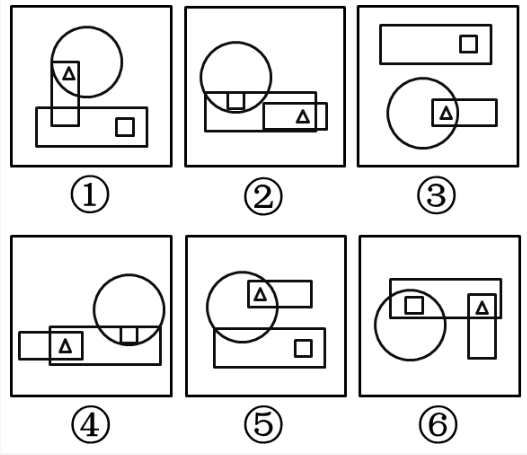

# 2016年黑龙江省公务员录用考试《行测》题（公检法卷）

> 判断推理 · 35 题 · 黑龙江 2016

## 第 1 题　qid 1796284 · 逻辑判断

记者采访时的提问要具体、简洁明了，切忌空泛、笼统、不着边际。约翰·布雷迪在《采访技巧》中剖析了记者采访时向访问对象提出诸如“您感觉如何？”等问题的弊端，认为这些提问“实际上在信息获取上等于原地踏步，它使采访对象没法回答，除非用含混不清或枯燥无味的话来应付。”
由此可以推出：

- **A**. 记者采访时的提问如果具体、简洁明了，就不会给采访对象带来回答的困难
- **B**. 采访对象如果没法回答提问，说明他没有用含混不清或枯燥无味的话来应付
- **C**. 采访对象只有用含混不清或枯燥无味的话来应付，才能回答那些空泛、笼统的提问　✅
- **D**. 诸如“您感觉如何？”这样的问题，只能使采访对象抓不住问题的要点而作泛泛的或言不由衷的回答

**答案**：C

**官方解析**

第一步：翻译题干。

除非，否则不这个关联词可翻译为：后前的形式，因此，题干最后一句话翻译为：

回答了含混不清或枯燥无味。

第二步：逐一翻译选项。

A项：记者采访时的提问如果具体、简洁明了是否能给采访对象带来回答的困难，原文当中完全没有提到过，属于无中生有的选项，排除；

B项：可翻译为：没法回答没有（含混不清或枯燥无味），否前否后，与题干的翻译形式不一致，排除；

C项：可翻译为：回答含混不清或枯燥无味，与题干翻译形式一致，符合题意，当选；

D项：选项中因为采访对象抓不住要点而作泛泛的或言不由衷的回答，原文说的是采用含混不清或枯燥无味，不等同于泛泛或言不由衷，属于概念的偷换，并且这么回答的原因是什么，题干也没有提到，排除。

故正确答案为C。

---

## 第 2 题　qid 1796110 · 逻辑判断

人们在社会生活中常会面临选择，要么选择风险小，报酬低的机会；要么选择风险大，报酬高的机会。究竟是在个人决策的情况下富于冒险性，还是在群体决策的情况下富于冒险性？有研究表明，群体比个体更富有冒险精神，群体倾向于获利大但成功率小的行为。
以下哪项如果为真，最能支持上述研究结论？

- **A**. 在群体进行决策时，人们往往会比个人决策时更倾向于向某一个极端偏斜，从而背离最佳决策　✅
- **B**. 个体会将其意见与群体其他成员相互比较，因其想要被其他群体成员所接受及喜爱，所以个体往往会顺从群体的一般意见
- **C**. 在群体决策中，很可能出现以个体或子群体为主发表意见、进行决策的情况，使群体决策为个体或子群体所左右
- **D**. 群体决策有利于充分利用其成员不同的教育程度、经验和背景，他们的广泛参与有利于最高决策的科学性

**答案**：A

**官方解析**

第一步：找到论点论据。
论点：群体比个体更具有冒险精神，群体倾向于获利大但成功率小的行为。
本题没有论据。
第二步：逐一分析选项。
A选项：群体作决策时比个人更容易走极端，将群体决策和个人决策做比较，解释了群体决策与个人决策之间存在差距的原因，可能会导致群体倾向于获利大但成功率小的行为，有一定的加强作用；
B选项：说的是在群体中个体会偏向于群体的一般意见，论证的是个体在群体中是坚持自己独特意见还是屈众，跟论题不一致，所以排除；
C选项：群体决策可能会被个体或者子群体所主导，也就是说群体决策可能和个体决策是一样的，而不是比个体决策更具有冒险精神，有削弱的意思，排除；
D选项：题干中没有涉及到决策的科学性与成功率，为无关选项，排除。
B、D两项为无关选项，C项有削弱的意思，只有A项有一定的加强作用，比较而言只能选A。
故正确答案为A。

---

## 第 3 题　qid 1796108 · 逻辑判断

某市为了实施文化强市战略，在2008年、2010年先后建成了两个图书馆，2008年底共办理市民借书证7万余个，到2010年底共办理市民借书证13余万个。2011年，该市又在新区建立了第三个图书馆，于2012年初落成开放，截止2012年底，全市共计办理市民借书证20余万个，市政府由此认为，该项举措是有实效的，因为在短短的4年间，光顾图书馆的市民增加了近两倍。
以下哪项如果为真，最能削弱上述结论？

- **A**. 图书馆要不断购置新书，维护成本也很高，这会影响该市其他文化设施建设
- **B**. 该市有两所高等学校，许多在校生也办理了这3个图书馆的借书证
- **C**. 很多办理了第一个图书馆借书证的市民又办理了另外两个图书馆的借书证　✅
- **D**. 该市新区建设发展迅速，4年间很多外来人口大量涌入新区

**答案**：C

**官方解析**

第一步：找到论点论据。
论点：该项举措（建图书馆）是有实效的。
论据：在建成三个图书馆的4年内，光顾图书馆的市民增加了近两倍。
论据说的是光顾图书馆的市民多了，论点说的是举措是有实效的，根据论据可以合理推出论点，因此话题一致，削弱优先考虑削弱论点，也可以考虑削弱论据。
第二步：逐一分析选项。
A项：该项说的是图书馆的维护成本高，与论点讨论的建图书馆能否取得实效无关，话题不一致，不能削弱，排除；
B项：该项说的两所高校的学生也办理了借书证，说明建立图书馆对这两所高校的学生有帮助，有一定的实效，可以加强，不能削弱，排除；
C项：该项说的是一个市民办理三个借书证，这样就是说明看书的人并不一定在增加，只是一人办多证，削弱论据，可以削弱，当选；
D项：该项说的是4年间很多外来人口大量涌入新区，外来人口对于借书证影响不明确，为不明确选项，无法削弱，排除。
故正确答案为C。

---

## 第 4 题　qid 1796278 · 逻辑判断

近日，火星车在加勒陨坑拍摄的图像发现，火星陨坑内的远古土壤存在着类似地球土壤裂纹剖面的土壤样本，通常这样的土壤存在于南极干燥谷和智利阿塔卡马沙漠，这暗示着远古时期火星可能存在生命。
以下哪项如果为真，最能支持上述结论？

- **A**. 地球沙漠土壤中存在土块，具有多孔中空结构，硫酸盐浓度较高，这一特征在火星土壤层并不明显
- **B**. 化学物质分析显示，陨坑内土壤的化学风化过程以及粘土沉积中橄榄石矿损耗情况与地球土壤的状况较为接近
- **C**. 这些火星远古土壤样本仅表明火星早期可能曾是温暖潮湿的，那时的环境比现今更具宜居性
- **D**. 土壤裂纹剖面中的磷损耗特别引人注意，因为地球土壤也存在这种现象，这是由于微生物的活跃性所致　✅

**答案**：D

**官方解析**

第一步：找出论点和论据。
论点：远古时期火星可能存在生命。
论据：火星陨坑内的远古土壤存在着类似地球土壤裂纹剖面的土壤样本。
第二步：逐一分析选项。
A项：地球沙漠土壤与火星土壤不同，是对论据的削弱，无法加强，排除。
B项：经化学物质分析后，陨坑内土壤与地球上土壤的化学风化过程相似，与论据表意相同，是对论据的加强，保留。
C项：火星远古土壤样本情况仅表明火星早期的环境比现在宜居，但并没有明确说明当时是否存在生命，不明确选项，排除。
D项：磷在土壤裂纹剖面中有损耗，说明有微生物存在，解释了为什么看到土壤裂纹剖面就说明可能有生命，属于搭桥加强。
B、D两项都能加强，但是D项搭桥的加强力度强于重复论据的B项。
故正确答案为D。

---

## 第 5 题　qid 1796106 · 逻辑判断

干细胞遍布人体，因为拥有变成任何类型细胞的能力而令科学家们着迷，这种能力意味着它们有可能修复或者取代受损的组织。而通过激光刺激干细胞生长很有可能实现组织生长，因此研究人员认为激光技术或许将成为医学领域的一种变革工具。
以下哪项如果为真，最能支持上述结论？

- **A**. 不同波段的激光对机体组织作用的原理尚不清楚
- **B**. 已有病例表明，激光会对儿童视网膜造成损伤，影响视力
- **C**. 目前激光刺激生长法尚未在人类机体上进行试验，风险还待评估
- **D**. 用激光治疗带有牙洞的臼齿，受损的牙体组织能逐渐恢复　✅

**答案**：D

**官方解析**

第一步：找到题干论点论据。
论点：激光技术或许将成为医学领域的一种变革工具；
论据：激光刺激干细胞生长可能实现组织生长，干细胞具有可以变成任何类型细胞的能力。
第二步：逐一分析选项。
A选项，讨论的是不同波段的激光对人体的组织作用的原理不清楚，属于不明确选项，排除；
B选项，用激光对儿童视网膜影响的例子来证明激光技术会对人体有损伤，属于举例削弱，排除；
C选项，没有在人体试验，风险还待评估，属于不明确选项，排除；
D选项，用有洞的牙齿来作为例子，证明激光技术确实能够成为医学领域变革的工具，举例加强，当选。
故正确答案为D。

---

## 第 6 题　qid 1796280 · 逻辑判断

酒精本身没有明显的致癌能力。但是许多流行病学调查发现，喝酒与多种癌症的发生风险正相关——也就是说，喝酒的人群中，多种癌症的发病率升高了。
以下哪项如果为真，最能支持上述发现？

- **A**. 
酒精在体内的代谢产物乙醛可以稳定地附着在DNA分子上，导致癌变或者突变
　✅
- **B**. 
东欧地区的人广泛食用甜烈性酒，该地区的食管癌发病率很高 

- **C**. 
烟草中含有多种致癌成分，其在人体内代谢物与酒精在人体内代谢物相似

- **D**. 
有科学家估计，如果美国人都戒掉烟酒，那么的消化道癌可以避免 

**答案**：A

**官方解析**

第一步：找到题干论点论据。
论点：喝酒与多种癌症发生风险正相关。
无论据。
第二步：逐一分析选项。
A选项，说明了酒精在人体内的代谢产物是可以致癌的，解释了题干中所说“酒精无致癌能力，但是饮酒的人中患癌症的几率高”，属于解释论点加强；
B选项，以东欧的人和甜烈性酒作为例子，属于举例加强，加强力度比解释论点加强要弱。并且A选项说的是酒精和人体，是普遍性的，B选项说的是东欧的人，以及甜烈性酒，都属于个例，根据整体加强力度大于局部加强力度的原则，也可排除B项；
C选项，烟草能够致癌，其在人体内代谢物与酒精的代谢物相似，属于类比加强。但是类比只是一种可能性加强，要想证明酒精的代谢物能致癌，还是要进一步分析酒精与烟草致癌机理是否一致，其实还是需要类似A项那样的解释，故不如A项明确，排除；
D选项，如果戒掉烟酒，可避免消化道癌，但不清楚到底是烟致癌还是酒致癌，还是两者在一起能致癌，所以属于不明确选项，排除。
故正确答案为A。

---

## 第 7 题　qid 1796276 · 逻辑判断

有报道称，由于人类大量排放温室气体，过去150多年中全球气温一直在持续上升。但与1970年至1998年相比，1999年至今全球表面平均气温的上升速度明显放缓，近15年来该平均气温的上升幅度不明显，因此全球变暖并不是那么严重。
如果以下各项为真，最能削弱上述论证的是？

- **A**. 海洋和气候系统的调整过程使得海洋表层热量向深海输送
- **B**. 此现象在上世纪50~70年代曾出现过，随后又开始加速变暖　✅
- **C**. 联合国气候专家指出，空气中的二氧化碳浓度处于80万年来的最高点
- **D**. 近几年发生多起因气候变暖而产生的自然灾害

**答案**：B

**官方解析**

第一步：找到论点和论据。
论点：全球变暖并不严重。
论据：与1970年至1998年相比，1999年至今全球表面平均气温的上升速度明显放缓，近15年来该平均气温的上升幅度不明显。
第二步：逐一分析选项。
A项：海洋表层热量向深海输送，解释了地球表面温度上升为什么会减缓，补充论据，为加强项，无法削弱，排除；
B项：此现象指的是全球表面平均气温上升速度放缓的现象，这个现象曾经出现过，但随后又加速变暖，即：气温上升速度的放缓并不能得出变暖不严重，有可能之后全球变暖会更加严重，可以削弱，当选；
C项：首先专家的意见不一定符合实情，其次二氧化碳和全球变暖的关系题干中也没提到，需进一步说明才能明确，为无关项，无法削弱，排除；
D项：题干主题是全球变暖这件事儿会不会变得更严重，而D项说的是气候变暖所带来的后果是什么，二者话题并不一致，为无关项，无法削弱，排除。
故正确答案为B。

---

## 第 8 题　qid 1796286 · 逻辑判断

一个没有普通话一级甲等证书的人不可能成为一个主持人，因为主持人不能发音不标准。
上述论证还需基于以下哪一前提？

- **A**. 没有一级甲等证书的人都会发音不标准　✅
- **B**. 发音不标准的主持人可能没有一级甲等证书
- **C**. 一个发音不标准的人有可能获得一级甲等证书
- **D**. 一个发音不标准的主持人不可能成为一个受人欢迎的主持人

**答案**：A

**官方解析**

第一步：找到题干论点论据。

论点：没有一级甲等证书的人不能成为主持人，即：没有一级甲等证书不是主持人（1）。

论据：主持人不能发音不标准，即：主持人发音标准（2）。

论点说的是“一级甲等证书”和“主持人”，论据说的是“主持人”和“发音”，二者话题不一致，要想加强优先考虑搭桥，且由论据搭向论点，即“发音标准有一级甲等证书”。

第二步：逐一分析选项。

A项：没有一级甲等证书发音不标准，其等价命题为：发音标准→有一级甲等证书，最强搭桥项，当选；

B项：发音不标准的可能没有证书，既是可能性的表述，同时也不符合我们需要的条件逻辑，排除；

C项：发音不标准的可能获得证书，既是可能性的表述，同时也不符合我们需要的条件逻辑，排除；

D项：说的是发音标准与受欢迎之间的关系，排除。

故正确答案为A。

---

## 第 9 题　qid 1797820 · 逻辑判断

在某图书馆中，涉及民国时期的历史书均只存放于第二层的专业书库中，外文类的典藏书籍均只存放于第三层的珍本阅览室中，小林周末到该图书馆借了一本外文类历史书。由此可以推出小林借的书是：

- **A**. 是珍本书
- **B**. 不是珍本书
- **C**. 是涉及民国时期的典藏书籍
- **D**. 不是涉及民国时期的典藏书籍　✅

**答案**：D

**官方解析**

第一步：翻译题干。
（1）民国且历史→二层专业书库；（2）外文且典藏→三层珍本。从题干已知条件推不出任何确定结论，因此此题采用代入法。
第二步：逐一代入选项。
假设A项正确，小林借的是珍本书，对于（2）是肯后，推不出必然结论，所以是不确定项；
假设B项正确，小林借的不是珍本书，对于（2）是否后，否后必否前，—三层珍本→—外文或—典藏，题干说他借的是外文书，但是不是典藏书不知道，因此也得不出必然结论；
假设C项正确，是民国时期的典藏书籍，那么说明这本书是民国历史书，也是外文典藏书，就把翻译后的表达式的（1）（2）的前件都肯定了，肯前必肯后，得到的是小林借书既是只能在二层又是只能在三层，矛盾。因此小林借的肯定不是民国时期的典藏书籍，D项正确。
故正确答案为D。

---

## 第 10 题　qid 1797830 · 逻辑判断

国际工程一般是指那些资金由外国政府或国际组织提供，并在咨询设计、施工、设备材料采购及劳务供应等方面部分或全部实行跨国经营的工程项目。国际工程经营是国际间复杂的商业性交易活动，与国际政治、经济环境密切相关，环境和市场的变化会严重影响到有关国际工程业务的成败，有人认为，目前我国国际工程项目管理体系还未达到要求。
以下哪项如果为真，最能驳斥上述结论？

- **A**. 和其他发达国家相比我国在国际项目管理这个方面学术活动水平比较低
- **B**. 现阶段建设市场在项目整体承包方面认可水平较高，市场认可水平高
- **C**. 现阶段开展项目管理工作的部门绝大部分都具有健全的运作机制　✅
- **D**. 在工程开展方面进行管理控制的项目控制相关部门专业化程度较高

**答案**：C

**官方解析**

第一步：找出论点和论据。
论点：目前我国国际工程项目管理体系还未达到要求。
无明显论据。
第二步：逐一分析选项。
A项：论点说未达到要求，选项说的是学术活动水平较低，并不知道学术活动水平能否反映整个管理体系水平，无关项，排除；
B项：没有提及“工程项目管理体系”，无关项，排除；
C项：绝大部分开展项目管理工作的部门都有健全的运作机制，说明是达到要求的，能够削弱论点，当选；
D项：“项目控制相关部门专业化程度较高”不代表管理体系达到要求，无关项，排除。
故正确答案为C。

---

## 第 11 题　qid 2391849 · 图形推理

把下面的六个图形分为两类，使每一类图形都有各自的共同特征或规律，分类正确的一项是：

- **A**. ①④⑥，②③⑤
- **B**. ①④⑤，②③⑥
- **C**. ①③⑤，②④⑥　✅
- **D**. ①②③，④⑤⑥

**答案**：C

**官方解析**

本题图形组成元素相同，但无明显的位置移动规律，考虑图形间的相对位置。观察题干图形发现在图①③⑤中，只有小三角形在两个图形相交区域内，而在②④⑥中，小三角形和小正方形均在两个图形相交区域内，因此①③⑤为一组，②④⑥为一组。
故正确答案为C。

---

## 第 12 题　qid 1796366 · 图形推理

从所给四个选项中，选择最合适的一个填入问号处，使之呈现一定的规律性：

- **A**. A
- **B**. B　✅
- **C**. C
- **D**. D

**答案**：B

**官方解析**

图形元素组成相同，优先考虑位置规律。九宫格优先横向观察，观察第一行发现“○”绕着三角形的边逆时针每次移动一条边，第二行验证此规律成立，因此问号处的“○”应在三角形下面的那条边上，排除C、D两项。观察A、B两项发现，“○”所处的位置不同，一个在三角形外部，一个在三角形内部，因此应考虑两个元素之间的位置关系。经观察发现前两行中都有两个图形“○”位于三角形内部，一个图形“○”位于三角形外部，因此问号处的“○”应于三角形的内部，排除A项。
故正确答案为B。

---

## 第 13 题　qid 1797874 · 图形推理

从所给四个选项中，选择最合适的一个填入问号处，使之呈现一定的规律性：

- **A**. A　✅
- **B**. B
- **C**. C
- **D**. D

**答案**：A

**官方解析**

考查图形的总点数，第一横行总点数为：5、6、7，第二横行总点数为：7、8、9，第三横行总点数为9、10、11，因此排除C、D两项，而且所有图形内部都有三角形，排除B项，选择A项。
故正确答案为A。

---

## 第 14 题　qid 2391876 · 图形推理

从所给的四个选项中，选择最合适的一个填入问号处，使之呈现一定的规律性。

- **A**. A
- **B**. B
- **C**. C　✅
- **D**. D

**答案**：C

**官方解析**

图形组成元素不同，属性无规律，考虑数量规律。面、线数量均无规律，考虑点数量。题干图形交点依次为：2、3、4、5、6个，则“？”处应该填入有7个交点的图形。
A项：有6个交点，排除；
B项：有6个交点，排除；
C项：有7个交点，当选；
D项：有8个交点，排除。
故正确答案为C。

---

## 第 15 题　qid 2391839 · 图形推理

把下面的六个图形分为两类，使每一类图形都有各自的共同特征或规律，分类正确的一项是：

- **A**. ①②③，④⑤⑥
- **B**. ①③⑤，②④⑥
- **C**. ①②④，③⑤⑥
- **D**. ①⑤⑥，②③④　✅

**答案**：D

**官方解析**

元素组成不同，无明显属性和数量规律。观察发现，①⑤⑥三个图形中的小圆圈既分布在图形的中心，也分布在图形的外围区域，②③④三个图形中的小圆圈只分布在图形的外围区域，故①⑤⑥一组，②③④一组。
故正确答案为D。

---

## 第 16 题　qid 2391840 · 定义判断

操作性定义是指根据可观察、可测量、可判定的特征来界定概念含义的方法。
根据上述定义，下列不符合操作性定义的是：

- **A**. 饥饿是指一个人连续24小时以上没有进食的状态
- **B**. 一年是指地球绕太阳转一周所需的时间长度
- **C**. 煎是指把少量油加热，再把食物放进去使其熟透的烹饪方法　✅
- **D**. 旁观是指注视别人的活动达3分钟以上，自己并未参与其中

**答案**：C

**官方解析**

第一步，找出定义关键词。
“可观察、可测量、可判定的特征”、“界定概念含义”。
第二步，逐一分析选项。
A项：“连续24小时以上没有进食的状态”，符合“可观察、可测量、可判定的特征”，符合定义，排除；
B项：“地球绕太阳转一周所需的时间长度”，符合“可观察、可测量、可判定的特征”，符合定义，排除；
C项：“把少量油加热，再把食物放进去使其熟透”，其中的“加热”和“熟透”的概念没有具体的衡量方法，不符合“可观察、可测量、可判定的特征”，不符合定义，当选；
D项：“注视别人的活动达3分钟以上，自己并未参与其中”，符合“可观察、可测量、可判定的特征”，符合定义，排除。
本题为选非题，故正确答案为C。

---

## 第 17 题　qid 2391842 · 定义判断

志愿服务是指不以盈利为目的，基于利他动机，自愿贡献知识、体力、技能等，促进社会和谐与进步的服务活动。
根据上述定义，下列不属于志愿服务的是：

- **A**. 张老师每年春节前都组织“献爱心送温暖”活动，为孤寡老人打扫房间，送上粮油
- **B**. 某居民小区常有穿着白大褂的人为老年人免费量血压，热情推销保健品　✅
- **C**. 某地遭强台风袭击后，不少人士自行驾车帮助运送救灾物资
- **D**. 某大学韩教授经常为所在社区居民做公益专题讲座，引导居民提高生活质量

**答案**：B

**官方解析**

第一步：找出定义关键词。
 “不以盈利为目的，基于利他动机”、“自愿贡献知识、体力、技能等，促进社会和谐与进步的服务活动”。
第二步：逐一分析选项。
A项：张老师组织“献爱心送温暖”活动，“为孤寡老人打扫房间，送上粮油”，符合“不以盈利为目的，基于利他动机”、“自愿贡献知识、体力、技能等，促进社会和谐与进步的服务活动”，符合定义，排除； 
B项：“热情推销保健品”，不符合“不以盈利为目的，基于利他动机”，不符合定义，当选；
C项：“遭强台风袭击后，不少人士自行驾车帮助运送救灾物资”，符合“不以盈利为目的，基于利他动机”、“自愿贡献知识、体力、技能等，促进社会和谐与进步的服务活动”，符合定义，排除；
D项：某大学韩教授做公益专题讲座，符合“不以盈利为目的，基于利他动机”、“自愿贡献知识、体力、技能等，促进社会和谐与进步的服务活动”，符合定义，排除。
本题为选非题，故正确答案为B。

---

## 第 18 题　qid 2391843 · 定义判断

微商买卖是一种发生在亲朋好友之间的商品交易，发生于微信朋友圈中，是熟人买卖在社交网络上的一种表现形式。这种交易因为是建立在朋友的信任之上，因此，一旦遇到微商销售假货，反而熟人会蒙受损失，微商也失去了朋友的信任。
根据上述定义，下列哪项属于微商买卖？

- **A**. 张三在市中心开了一家门店，经常通过微信做商品宣传，生意很红火
- **B**. 李四因为向朋友销售假货，被工商部门罚款一千元，现在停业整顿中
- **C**. 王五微信圈里有很多好朋友，他经常向他们介绍美容产品的打折信息
- **D**. 赵六不慎遗失手机，耽误了好几笔已经谈成的微信好友的生意，损失上千元　✅

**答案**：D

**官方解析**

第一步：找出定义关键词。
“发生在亲朋好友之间的商品交易，发生于微信朋友圈中”、“熟人买卖在社交网络上的一种表现形式”、“建立在朋友的信任之上”。
第二步：逐一分析选项。
A项：“张三在市中心开了一家门店，经常通过微信做商品宣传”，张三只是通过微信宣传商品，并没有进行买卖，不符合“发生在亲朋好友之间的商品交易，发生于微信朋友圈中”，不符合定义，排除；
B项：“李四因为向朋友销售假货”，没有体现是在微信朋友圈进行交易，不符合“发生在亲朋好友之间的商品交易，发生于微信朋友圈中”，不符合定义，排除；
C项：“王五微信圈里有很多好朋友，他经常向他们介绍美容产品的打折信息”，没有体现在微信朋友圈进行交易，不符合“发生在亲朋好友之间的商品交易，发生于微信朋友圈中”，不符合定义，排除；
D项：“赵六不慎遗失手机，耽误了好几笔已经谈成的微信好友的生意，损失上千元”，符合“发生在亲朋好友之间的商品交易，发生于微信朋友圈中”、“熟人买卖在社交网络上的一种表现形式”，符合定义，当选。
故正确答案为D。

---

## 第 19 题　qid 2391844 · 定义判断

差异化战略是指为使企业产品、服务、企业形象等与竞争对手有明显的区别，以获得竞争优势为目的而采取的战略。
根据上述定义，下列属于差异化战略的是：

- **A**. 某家电企业在国内家电业独占鳌头，为绕过贸易壁垒，进一步打开国外市场，正积极开展资本和技术输出，在海外建立制造和销售基地
- **B**. 面对日益激烈的竞争环境，某跨国企业决定剥离不盈利的个人电脑业务，主攻旗下高利润率的智能计算和服务器业务
- **C**. 随着楼市调控政策的不断出台，某房产龙头企业积极调整战略，逐步形成了对旅游、餐饮、物流等行业的多元化产业布局
- **D**. 在国内手机厂商大打价格战时，某手机品牌始终秉持“只做最好的产品”这一理念，依靠技术和产品设计的优势，坚持走高端路线　✅

**答案**：D

**官方解析**

第一步：找出定义关键词。
“使企业产品、服务、企业形象等与竞争对手有明显的区别”、“以获得竞争优势为目的”。
第二步：逐一分析选项。
A项：某家电企业在海外建立制造和销售基地，不符合“使企业产品、服务、企业形象等与竞争对手有明显的区别”，不符合定义，排除；
B项：某跨国企业决定主攻旗下高利润率的智能计算和服务器业务，不符合“使企业产品、服务、企业形象等与竞争对手有明显的区别”，不符合定义，排除；
C项：某房产龙头企业积极调整战略，逐步形成了对旅游、餐饮、物流等行业的多元化产业布局，不符合“使企业产品、服务、企业形象等与竞争对手有明显的区别”，不符合定义，排除；
D项：在国内手机厂商大打价格战时，某手机品牌坚持走高端路线，符合“使企业产品、服务、企业形象等与竞争对手有明显的区别”、“以获得竞争优势为目的”，符合定义，当选。
故正确答案为D。

---

## 第 20 题　qid 1796460 · 定义判断

初级群体指的是由面对面互动所形成的、具有亲密的人际关系和浓厚的感情色彩的社会群体；次级群体指的是其成员为了某种特定的目标集合在一起，通过明确的规章制度结成正规关系的社会群体。
根据上述定义，下列涉及次级群体的是：

- **A**. 亲友团来到比赛现场为小李助威
- **B**. 小赵要到大城市上学了，山里的乡亲们都到村口为他送行
- **C**. 小王考上了研究生，公司的同事一起为他庆贺　✅
- **D**. 20年之后，小张儿时的玩伴建立了一个微信群

**答案**：C

**官方解析**

第一步：找到定义关键词。
关键词为初级群体是由“面对面互动所形成”、“具有亲密的人际关系和浓厚的感情色彩”，次级群体是为了“某种特定的目标”、“通过明确的规章制度”。
第二步：逐一分析选项。
A项：亲友团来到比赛现场为小李助威，群体为亲友团，是通过血缘关系或共同爱好结成的，而不是通过“明确的规章制度”，不符合定义，排除；
B项：小赵考上大学山里乡亲为他送行体现的是一种人际关系和感情色彩，属于初级群体，没有涉及到特定的目标和规章制度，排除；
C项：小王考上研究生，同事为他庆祝，这个群体指的是公司群体，大家的共同目标就是努力工作，把公司搞好，同时这个关系群中有严格的公司规章制度，属于次级群体，当选；
D项：小张的玩伴建立了微信群体现的是亲密的人际关系，属于初级群体，没有涉及到特定的目标和规章制度，排除。
故正确答案为C。

---

## 第 21 题　qid 2391846 · 定义判断

构形歧义是指由于语句和语法结构不确定导致所反映的命题含义不确定，可以解释成不同的命题，从而形成构形歧义。
根据上述定义，下列属于构形歧义的是：

- **A**. 他看着妈妈吃饭　✅
- **B**. 1、9为奇数，所以，1+9是奇数
- **C**. 奇迹不会发生
- **D**. 强权即公理

**答案**：A

**官方解析**

第一步：找出定义关键词。
“由于语句和语法结构不确定导致所反映的命题含义不确定，可以解释成不同的命题”。
第二步：逐一分析选项。
A项：他看着妈妈吃饭，“看着”有两层意思，一可以表示望着，二可以表示看护，符合“由于语句和语法结构不确定导致所反映的命题含义不确定，可以解释成不同的命题”，符合定义，当选； 
B项：1、9为奇数，所以，1+9是奇数，语句中没有出现歧义，不符合“由于语句和语法结构不确定导致所反映的命题含义不确定，可以解释成不同的命题”，不符合定义，排除；
C项：奇迹不会发生，语句中没有出现歧义，不符合“由于语句和语法结构不确定导致所反映的命题含义不确定，可以解释成不同的命题”，不符合定义，排除；
D项：强权即公理，语句中没有出现歧义，不符合“由于语句和语法结构不确定导致所反映的命题含义不确定，可以解释成不同的命题”，不符合定义，排除。
故正确答案为A。

---

## 第 22 题　qid 2391847 · 定义判断

二次事故是指在原有的医疗事故、煤矿安全事故、交通事故等事故的基础上，由于自然不可抗力、救援方的疏忽或当事人的错误操作引起的事故。
根据上述定义，下列不属于二次事故的是：

- **A**. 李某在高速公路上与前车追尾，他匆忙下车捡拾自己小车洒落的物品，被后方驶来的汽车撞击身亡
- **B**. 刘某突发急性阑尾炎入院，医生在阑尾切除手术结束时将一块止血棉遗留在刘某腹腔内没有取出，导致刘某再次入院
- **C**. 某市连日暴雨引发的洪水及泥石流导致25人丧生，部分房屋被毁，数千人被迫离开家园　✅
- **D**. 某煤矿井下渗水，矿工私自启动水泵抽水，拉闸时产生火花，致井内瓦斯爆炸，造成4人当场死亡

**答案**：C

**官方解析**

第一步：找出定义关键词。
“在原有的医疗事故、煤矿安全事故、交通事故等事故的基础上”、“由于自然不可抗力、救援方的疏忽或当事人的错误操作引起的事故”。
第二步：逐一分析选项。
A项：李某在高速公路上与前车追尾属于“交通事故”，匆忙下车捡拾自己小车洒落的物品，被后方驶来的汽车撞击身亡，人为原因导致了二次事故，符合“当事人的错误操作引起的事故”，符合定义，排除；
B项：刘某突发急性阑尾炎入院，医生在阑尾切除手术结束时将一块止血棉遗留在刘某腹腔内没有取出，符合“救援方的疏忽引起的事故”，符合定义，排除；
C项：某市连日暴雨引发的洪水及泥石流导致25人丧生，部分房屋被毁，数千人被迫离开家园，只有泥石流一次自然灾害，没有体现二次事故，不符合“在原有的医疗事故、煤矿安全事故、交通事故等事故的基础上，由于自然不可抗力、救援方的疏忽或当事人的错误操作引起的事故”，不符合定义，当选；
D项：某煤矿井下渗水属于“煤矿安全事故”，矿工私自启动水泵抽水，拉闸时产生火花，致井内瓦斯爆炸，造成4人当场死亡，符合“由于当事人的错误操作引起的事故”，符合定义，排除。
本题为选非题，故正确答案为C。

---

## 第 23 题　qid 1796272 · 定义判断

精益生产是通过系统结构、人员组织、运行方式和市场供求等方面的变革，最大限度地消除浪费和降低库存以及缩短生产周期，力求实现低成本准时生产的技术，其最终目的是通过流程整体优化、均衡物流、高效利用资源、消灭一切库存和浪费，达到用最少的投入向顾客提供最完美价值的目的。
根据上述定义，下列属于精益生产的是：

- **A**. 为了抢占市场，甲公司不断提高空间利用率
- **B**. 乙公司投入了大量资金以缩短其产品生产周期
- **C**. 丙公司的强大供货体系保证它能随时满足客户
- **D**. 丁公司充分发挥自身优势建立了超快的物流系统　✅

**答案**：D

**官方解析**

第一步：找到定义关键词。
题干中精益生产的方式是“通过系统结构、人员组织、运行方式和市场供求等方面的变革”，目的是“整体优化、均衡物流、高效利用资源”，达到“最少的投入向顾客提供最完美的价值”。
第二步：逐一分析选项。
A项：题干中的目的是为顾客提供最完美的价值，A项中的目的是抢占市场，不符合定义，排除；
B项：题干中的方式是通过系统结构、人员组织、运行方式和市场供求等方面，B是通过资金的调整，不符合定义，排除；
C项：只说到有强大的供货体系，但是这个供货体系是否经过各方面的变革，是否是最优化的并没有提及，该选项不够明确；
D项：充分发挥自身优势就是对公司优势资源的高效利用，建立超快物流体系符合“均衡物流，高效利用资源”，符合定义。
C、D两项比较而言，D项更加明确地体现了对优势资源的充分利用，实现了均衡物流、高效利用资源的效果。
故正确答案为D。

---

## 第 24 题　qid 1796382 · 定义判断

不规则需求是指某些物品或者服务的市场需求在不同季节，或一周不同日子，甚至一天不同时间上下波动很大的一种需求状况。
根据上述定义，下列哪项属于不规则需求？

- **A**. 早晚高峰期出租车供不应求　✅
- **B**. 某品牌牙刷分为软、硬、中三种以面向不同消费者
- **C**. 某电商店庆打折，活动当天点击量剧增
- **D**. 某博物馆引进一批梵高画作巡展，游客蜂拥而至

**答案**：A

**官方解析**

第一步：找到定义关键词。
关键词为“某些物品或者服务的市场需求”、“不同季节，或一周不同日子，甚至一天不同时间”、“上下波动很大”。
第二步：逐一分析选项。
A项：早晚高峰期出租车供不应求，即出租车服务的市场需求在一天的不同时间上下波动很大，符合定义，当选；
B项：只提到牙刷品牌对牙刷分类，并未提到消费者的反应如何，也不存在需求上下波动，不符合定义，排除；
C项：“店庆打折，活动当天点击量剧增”说明这种打折服务的市场需求很大，并未体现出需求上下波动，不符合定义，排除；
D项：“博物馆引进梵高画作后游客蜂拥而至”说明人们对欣赏梵高画作的需求很大，并未体现出需求上下波动，不符合定义，排除。
故正确答案为A。

---

## 第 25 题　qid 2114644 · 定义判断

红叶子理论认为，一个人职业的成功不在于红叶子数目的多少，而在于他是否具备一片特别硕大的红叶子，这片特别硕大的红叶子不是与生俱来的，需要根据个人优势不断努力才能获得。
根据上述定义，下列哪项能用红叶子理论解释？

- **A**. 小刘虽然偶尔迟到，但对工作尽职尽责、富有团队精神
- **B**. 小张本科学习数学专业，但是他觉得数学专业比较枯燥，所以他选择攻读经济学硕士
- **C**. 小李的销售能力和财务水平一般，但对市场特别敏感，他努力发展这方面优势，最后成了一名企业家　✅
- **D**. 小文是英语系学生，但口语不太好，她辅修了国际法方面的课程，最后成了一名出色的律师

**答案**：C

**官方解析**

第一步：找到定义关键词。
关键词为“职业的成功在于他具有一片特别硕大的红叶子”、“需要靠个人优势不断努力获得”。
第二步：逐一分析选项。
A项：小刘对工作尽职尽责，富有团队精神，没有体现出这是他的个人优势，也没体现出他在不断努力，不符合定义，排除；
B项：小张觉得数学专业枯燥选择了读经济学硕士，没有体现出他的个人优势，也没体现出个人的不断努力，不符合定义，排除；
C项：小李销售水平一般，但是对市场特别敏感，体现了他的个人优势，对市场敏感，同时他努力发展优势体现了他个人不断努力，能用红叶子理论解释，当选；
D项：小文是英语系学生，口语不好，辅修国际法方面的课程最后成为出色律师，说的是虽然有劣势，但是成功了，并没有体现出他的个人优势和特色，不符合定义，排除。
故正确答案为C。

---

## 第 26 题　qid 1796426 · 类比推理

（　）　对于　熟练　相当于　敏捷　对于　（　）

- **A**. 娴熟　灵敏　✅
- **B**. 操作　迅捷
- **C**. 熟悉　迅速
- **D**. 谙熟　灵动

**答案**：A

**官方解析**

将选项逐一代入。
A项：娴熟是指很熟练，二者为近义关系，且前者是对后者程度的加深，敏捷是指灵敏快捷，与灵敏为近义关系，且前者是对后者程度的加深，前后逻辑关系一致，当选；
B项：熟练可以形容操作，敏捷与迅捷是近义关系，前后逻辑关系不一致，排除；
C项：熟悉指了解得清楚，清楚地知道，而熟练程度要比熟悉更重一些，后比前重。敏捷是指灵敏快捷，所以敏捷程度要比迅速更重一些，这里前比后重。所以二组词顺序反了，前后逻辑关系不一致，排除；
D项：谙熟指熟悉、了解，程度要比熟练轻。敏捷是指灵敏迅速，灵动多指活泼，敏捷和灵动没有关系，前后逻辑关系不一致，排除。
故正确答案为A。

---

## 第 27 题　qid 1796412 · 类比推理

报刊：新闻

- **A**. 土地：玉米
- **B**. 法院：法律
- **C**. 出版社：书籍
- **D**. 唱片：歌曲　✅

**答案**：D

**官方解析**

第一步：分析题干词语间的逻辑关系。
报刊是利用纸张传播文字资料的一种工具，是发表、宣传新闻的一种载体；并且新闻的发表方式有很多，报刊只是其中一种。
第二步：逐一分析选项。
A选项：土地与玉米是作物和种植地之间的对应关系，与题干逻辑不符，排除；
B选项：法院是司法审判机关，不是法律的载体，与题干逻辑不符，排除；
C选项：出版社出版书籍，不是书籍刊登的载体，与题干逻辑不符，排除；
D选项：唱片是一种传播音乐、歌曲的载体，并且歌曲的发表形式有很多，唱片只是其中一种，与题干逻辑关系一致，当选。
故正确答案为D。

---

## 第 28 题　qid 2114670 · 类比推理

指鹿为马：颠倒黑白

- **A**. 师心自用：固执己见　✅
- **B**. 目无全牛：鼠目寸光
- **C**. 不以为然：不屑一顾
- **D**. 不孚众望：众望所归

**答案**：A

**官方解析**

第一步：分析题干中词语的逻辑关系。
“指鹿为马”意思是指着鹿，说是马，比喻故意颠倒黑白，混淆是非。
“颠倒黑白”意思是把黑的说成白的，白的说成黑的，比喻歪曲事实，混淆是非，指鹿为马。
二者为近义词。
第二步：逐一分析选项。
A项：“师心自用”形容自以为是，不肯接受别人的正确意见，“固执己见”是指顽固地坚持自己的意见，不肯改变，二者为近义词，符合题干逻辑关系，当选；
B项：“目无全牛”意思是眼中没有完整的牛，只有牛的筋骨结构，形容技艺已经到达非常纯熟的地步，“鼠目寸光”比喻目光短浅，缺乏远见，二者不是近义词，不符合题干逻辑关系，排除；
C项：“不以为然”意思是不认为是对的，表示不同意或否定，“不屑一顾”意思是认为不值得一看，形容极端轻视，二者不是近义词，不符合题干逻辑关系，排除；
D项：“不孚众望”意思是不能使大家信服，未符合大家的期望，“众望所归”是指某人得到大家的信赖，希望他担任某项工作或完成事情，二者不是近义词，不符合题干逻辑关系，排除。
故正确答案为A。

---

## 第 29 题　qid 2391854 · 类比推理

沙子：水泥：钢筋

- **A**. 衣柜：餐桌：家具
- **B**. 电暖气：风扇：电器
- **C**. 填空：选择：问答　✅
- **D**. 蚂蚁：蜜蜂：金属

**答案**：C

**官方解析**

第一步：判断题干词语间逻辑关系。
沙子、水泥、钢筋均为建筑材料，三者为并列关系中的反对关系。
第二步：判断选项词语间逻辑关系。
A项：衣柜和餐桌均为家具的一种，与题干逻辑关系不一致，排除；
B项：电暖气和风扇均为电器的一种，与题干逻辑关系不一致，排除；
C项：填空、选择、问答三者均为题目类型，三者为并列关系中的反对关系，与题干逻辑关系一致，当选；
D项：蚂蚁、蜜蜂、金属三者之间没有必然的逻辑关系，与题干逻辑关系不一致，排除。
故正确答案为C。

---

## 第 30 题　qid 2391857 · 类比推理

冷冻：冰箱：冷藏

- **A**. 存储：电脑：上网
- **B**. 制冷：空调：制热　✅
- **C**. 电话：手机：拍照
- **D**. 照明：电灯：取暖

**答案**：B

**官方解析**

第一步：判断题干词语间逻辑关系。
冰箱有冷冻和冷藏的功能，为物品和两种功能的对应关系，且冰箱只有这两种主要功能。
第二步：判断选项词语间逻辑关系。
A项：电脑有存储和上网的功能，但电脑的主要功能还有数据通信、资源共享等，与题干逻辑关系不一致，排除；
B项：空调有制冷和制热的功能，为物品和两种功能的对应关系，且空调只有这两种主要功能，与题干逻辑关系一致，当选；
C项：电话和手机均为通讯工具，手机是一种无线电话，二者是种属关系，手机有拍照的功能，与题干逻辑关系不一致，排除；
D项：电灯的主要功能是照明，取暖不是电灯的主要功能，与题干逻辑关系不一致，排除。
故正确答案为B。

---

## 第 31 题　qid 1796410 · 类比推理

黄连：苦涩

- **A**. 班级：团结
- **B**. 钻石：坚硬　✅
- **C**. 花朵：鲜红
- **D**. 城市：繁华

**答案**：B

**官方解析**

第一步：分析题干词语间的逻辑关系。
黄连是一种草本植物，其味入口一定是极苦，因此苦涩是黄连的一种必然属性。
第二步：逐一分析选项。
A选项：班级可能团结可能不团结，不是一种必然属性关系，与题干逻辑不符，排除；
B选项：钻石是指经过琢磨的金刚石。金刚石在天然矿物中的硬度最高，因此坚硬是钻石的必然属性，与题干逻辑关系一致，为正确答案，当选；
C选项：鲜红是花朵的属性，但花朵不一定是鲜红的，花朵的颜色可以多样，不是必然属性，与题干逻辑不符，排除；
D选项：城市不一定繁华，不是一种必然属性关系，与题干逻辑不符，排除。
故正确答案为B。

---

## 第 32 题　qid 2114688 · 类比推理

沟通：手机：金属

- **A**. 招聘：面试：简介
- **B**. 物流：运输：公路
- **C**. 卫星：科技：科学家
- **D**. 露营：帐篷：帆布　✅

**答案**：D

**官方解析**

第一步：判断题干词语间逻辑关系。
“手机”用于“沟通”，“手机”的材质是“金属”。
第二步：判断选项词语间逻辑关系。
A项： “面试”是“招聘”的一个环节，与题干逻辑关系不一致，排除。
B项： “运输”是“物流”的一个环节，与题干逻辑关系不一致，排除。
C项： “卫星”是“科技”发展的成果，与题干逻辑关系不一致，排除。
D项：“帐篷”用于“露营”，“帐篷”的材质是“帆布”，与题干逻辑关系一致，当选。
故正确答案为D。

---

## 第 33 题　qid 1796408 · 类比推理

麻雀：动物：生物链

- **A**. 豆浆：早餐：豆制品
- **B**. 开水：纸杯：便利品
- **C**. 发卡：首饰：妆扮品　✅
- **D**. 钢笔：电脑：办公品

**答案**：C

**官方解析**

第一步：分析题干词语间的逻辑关系。
题干麻雀属于动物，二者为种属关系，生物链指的是由动物、植物和微生物互相提供食物而形成的相互依存的链条关系。麻雀和动物都属于生物链的一部分。
第二步：逐一分析选项。
A项：豆浆可以作为早餐食用，但二者并非种属关系，并且早餐不是豆制品的组成部分，与题干逻辑不符，排除；
B项：开水不属于纸杯，二者不是种属关系，与题干逻辑不符，排除；
C项：发卡是首饰的一种，二者为种属关系，发卡和首饰都属于妆扮品，分别与妆扮品构成种属关系，而题干是组成关系，对应关系并不完全一致，但是相比于其他选项，种属关系和组成关系都是包容关系，所以该项更合适，当选；
D项：钢笔和电脑都属于办公品，但是钢笔和电脑之间不是种属关系，与题干逻辑不符，排除。
故正确答案为C。

---

## 第 34 题　qid 2114658 · 类比推理

水：森林：煤炭

- **A**. 雪：丰年：喜悦
- **B**. 表扬：自信：乐观
- **C**. 氮：蛋白质：智力　✅
- **D**. 闪电：雨：打伞

**答案**：C

**官方解析**

第一步：分析题干词语的逻辑关系。
水是森林存在的必要条件，森林是产生煤炭的必要条件。
第二步：逐一分析选项。
A选项：瑞雪预示着丰年，但雪不是丰年的必要条件，丰年会让人喜悦，但也不是必要条件，不符合题干逻辑关系，排除；
B选项：表扬可能会让人更有自信，自信与乐观是并列关系，不符合题干逻辑关系，排除；
C选项：氮是组成蛋白质的元素之一，没有氮，蛋白质就不存在，氮是蛋白质存在的必要条件，没有蛋白质就没有动物和人类，也不可能存在智力，蛋白质是智力存在的必要条件，符合题干逻辑关系，当选；
D选项：闪电并不是雨产生的必要条件，而是打雷的必要条件，不符合题干逻辑关系，排除。
故正确答案为C。

---

## 第 35 题　qid 2114680 · 类比推理

（  ）对于 美丽 相当于 春风满面 对于 （  ）

- **A**. 楚楚动人 愉快　✅
- **B**. 笑靥如花 兴奋
- **C**. 眉开眼笑 高兴
- **D**. 心地善良 滋润

**答案**：A

**官方解析**

A项：楚楚动人形容姿容美好，动人心神，形容人很美丽。春风满面形容人心情愉快，满脸笑容，形容人很愉快，当选；
B项：笑靥如花形容女子的笑脸像花儿一样美丽，但春风满面不形容兴奋，排除；
C项：眉开眼笑形容人高兴愉快的样子，也不形容人美丽，排除；
D项：心地善良指有道德、德行好，不形容美丽，排除。
故正确答案为A。

---
